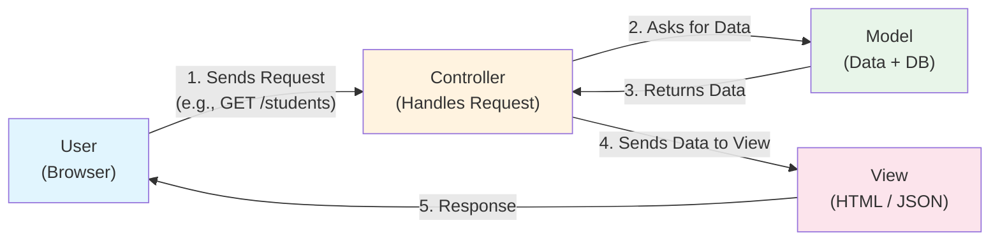
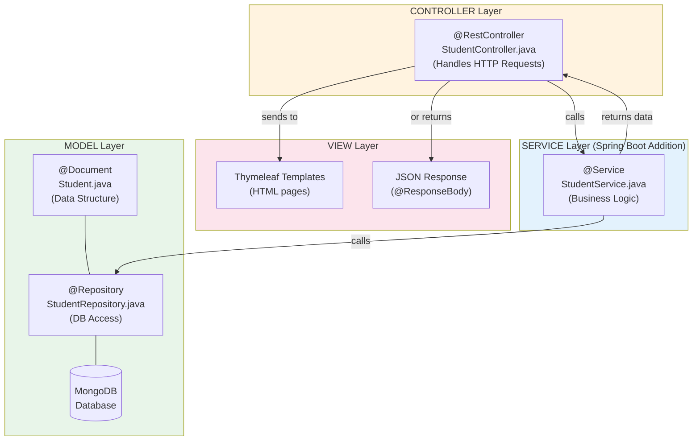
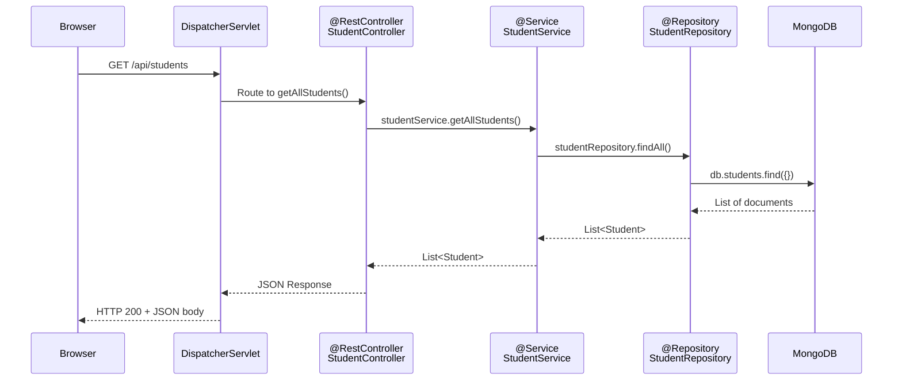
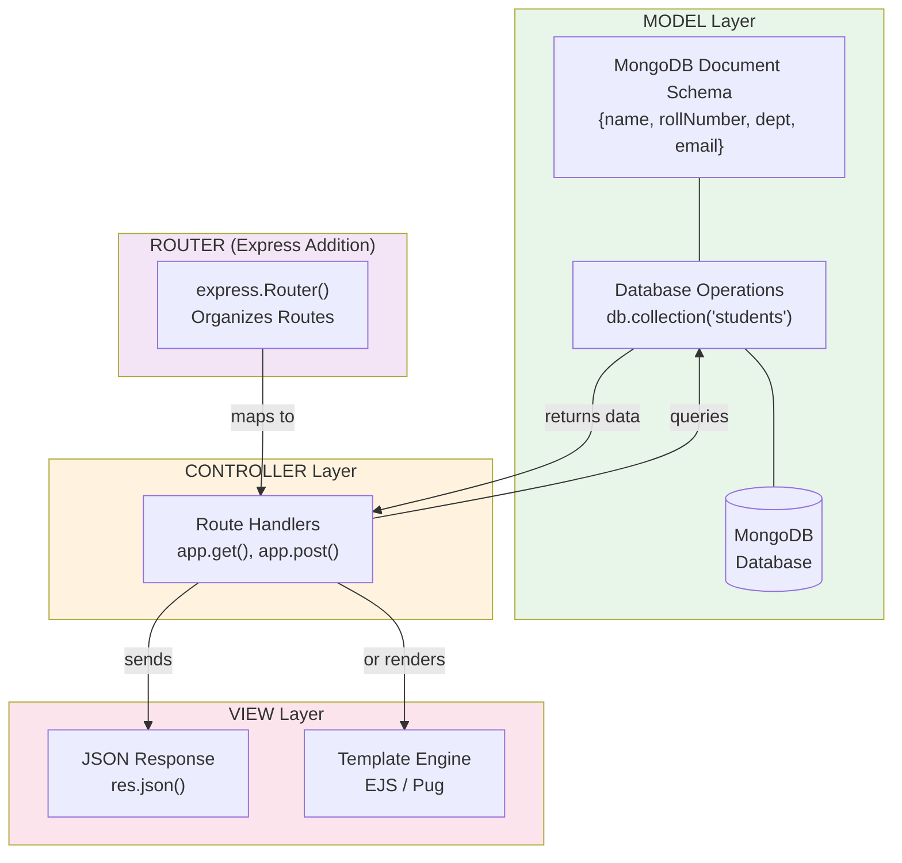
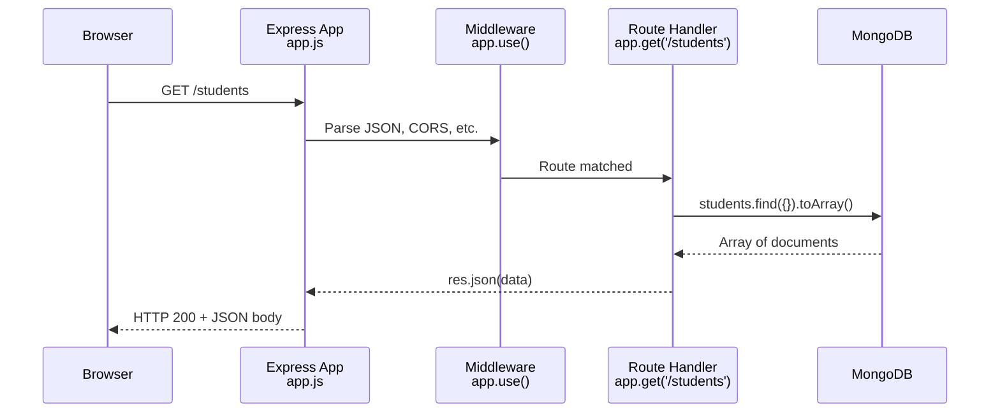
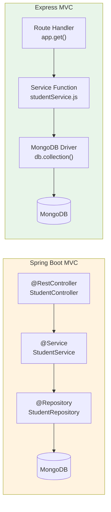
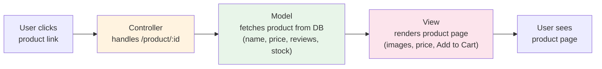
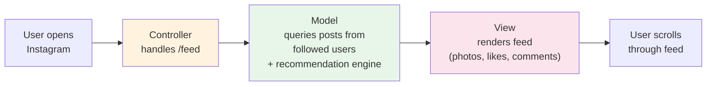
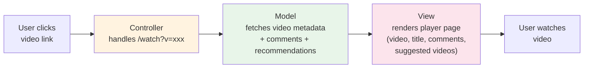
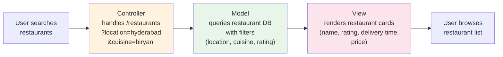

# MVC Architecture Pattern

[< Back to Docs](../README.md)

---

## Table of Contents

1. [What is MVC?](#1-what-is-mvc)
2. [MVC in Spring Boot](#2-mvc-in-spring-boot)
3. [MVC in Node.js/Express](#3-mvc-in-nodejsexpress)
4. [Side-by-Side Comparison](#4-side-by-side-comparison)
5. [Real-World Examples](#5-real-world-examples)
6. [Companies Using Spring Boot and Express](#6-companies-using-spring-boot-and-express)
7. [Key Takeaways](#7-key-takeaways)

---

## 1. What is MVC?

**MVC** stands for **Model-View-Controller**. It is a software design pattern that separates an application into three interconnected components. This separation helps organize code, makes it easier to maintain, and allows multiple developers to work on different parts simultaneously.

### The Three Components

| Component | Responsibility | Think of it as... |
|-----------|---------------|-------------------|
| **Model** | Manages data and business logic | The **brain** -- knows the data, talks to the database |
| **View** | Displays data to the user | The **face** -- what the user actually sees (HTML, JSON) |
| **Controller** | Handles user input and coordinates Model & View | The **traffic police** -- receives requests, decides what to do |

### Why Does MVC Exist? (Separation of Concerns)

Without MVC, you might write database queries, business logic, and HTML all in the same file. This creates a mess:

- **Hard to debug** -- a bug could be anywhere in a 500-line file
- **Hard to reuse** -- want the same data in a mobile app? Rewrite everything
- **Hard to work in teams** -- two developers editing the same file causes conflicts

MVC solves this by giving each part its own job. The Model does not care how data is displayed. The View does not care where data comes from. The Controller just connects them.

### Basic MVC Flow



**In plain English:** The user makes a request. The Controller receives it, asks the Model for data, gets the data back, passes it to the View, and the View sends the response to the user.

---

## 2. MVC in Spring Boot

Spring Boot provides a structured, annotation-driven approach to MVC. Each component maps to specific Java classes with specific annotations.

### Spring Boot MVC Component Mapping



### Complete Request Flow (Sequence Diagram)



> **Note:** The `DispatcherServlet` is Spring Boot's front controller. It receives ALL incoming HTTP requests and routes them to the correct `@Controller` method based on the URL mapping. You never write it yourself -- Spring Boot provides it automatically.

### Mapping Table

| MVC Component | Spring Boot Equivalent | Example File | Purpose |
|---|---|---|---|
| Model | `@Document` + `@Repository` | `Student.java`, `StudentRepository.java` | Data structure + DB access |
| View | Thymeleaf / JSON (`@ResponseBody`) | `templates/home.html` or JSON response | What user sees |
| Controller | `@Controller` / `@RestController` | `StudentController.java` | Handles requests, routes |
| (Service) | `@Service` | `StudentService.java` | Business logic (Spring Boot addition) |

### Code Examples

#### Model -- `Student.java` (Data Structure)

```java
package com.lab.student.model;

import org.springframework.data.annotation.Id;
import org.springframework.data.mongodb.core.mapping.Document;

@Document(collection = "students")  // Maps to MongoDB "students" collection
public class Student {

    @Id
    private String id;          // MongoDB auto-generates this
    private String name;
    private String rollNumber;
    private String department;
    private String email;

    // Default constructor (required by Spring)
    public Student() {}

    // Parameterized constructor
    public Student(String name, String rollNumber, String department, String email) {
        this.name = name;
        this.rollNumber = rollNumber;
        this.department = department;
        this.email = email;
    }

    // Getters and Setters
    public String getId() { return id; }
    public void setId(String id) { this.id = id; }
    public String getName() { return name; }
    public void setName(String name) { this.name = name; }
    public String getRollNumber() { return rollNumber; }
    public void setRollNumber(String rollNumber) { this.rollNumber = rollNumber; }
    public String getDepartment() { return department; }
    public void setDepartment(String department) { this.department = department; }
    public String getEmail() { return email; }
    public void setEmail(String email) { this.email = email; }
}
```

#### Model -- `StudentRepository.java` (Database Access)

```java
package com.lab.student.repository;

import com.lab.student.model.Student;
import org.springframework.data.mongodb.repository.MongoRepository;
import java.util.List;

// No @Repository annotation needed -- Spring auto-detects it
// MongoRepository<Student, String> gives you CRUD methods for FREE
public interface StudentRepository extends MongoRepository<Student, String> {

    // Spring creates the query automatically from the method name!
    List<Student> findByDepartment(String department);
    List<Student> findByNameContainingIgnoreCase(String name);
}
```

#### Service -- `StudentService.java` (Business Logic)

```java
package com.lab.student.service;

import com.lab.student.model.Student;
import com.lab.student.repository.StudentRepository;
import org.springframework.beans.factory.annotation.Autowired;
import org.springframework.stereotype.Service;
import java.util.List;
import java.util.Optional;

@Service  // Marks this as a service component
public class StudentService {

    @Autowired  // Spring injects StudentRepository automatically
    private StudentRepository studentRepository;

    public List<Student> getAllStudents() {
        return studentRepository.findAll();
    }

    public Optional<Student> getStudentById(String id) {
        return studentRepository.findById(id);
    }

    public Student createStudent(Student student) {
        return studentRepository.save(student);
    }

    public void deleteStudent(String id) {
        studentRepository.deleteById(id);
    }
}
```

#### Controller -- `StudentController.java` (Handles Requests)

```java
package com.lab.student.controller;

import com.lab.student.model.Student;
import com.lab.student.service.StudentService;
import org.springframework.beans.factory.annotation.Autowired;
import org.springframework.http.ResponseEntity;
import org.springframework.web.bind.annotation.*;
import java.util.List;

@RestController                // Combines @Controller + @ResponseBody (returns JSON)
@RequestMapping("/api/students")  // Base URL for all endpoints in this controller
public class StudentController {

    @Autowired
    private StudentService studentService;  // Spring injects the service

    @GetMapping                           // GET /api/students
    public List<Student> getAllStudents() {
        return studentService.getAllStudents();
    }

    @GetMapping("/{id}")                  // GET /api/students/123
    public ResponseEntity<Student> getStudentById(@PathVariable String id) {
        return studentService.getStudentById(id)
                .map(student -> ResponseEntity.ok(student))
                .orElse(ResponseEntity.notFound().build());
    }

    @PostMapping                          // POST /api/students
    public Student createStudent(@RequestBody Student student) {
        return studentService.createStudent(student);
    }

    @DeleteMapping("/{id}")               // DELETE /api/students/123
    public ResponseEntity<Void> deleteStudent(@PathVariable String id) {
        studentService.deleteStudent(id);
        return ResponseEntity.noContent().build();
    }
}
```

#### View -- JSON Response (what the browser receives)

When a user hits `GET /api/students`, the `@RestController` automatically converts the `List<Student>` to JSON:

```json
[
  {
    "id": "6651abc123",
    "name": "Krushi Raj",
    "rollNumber": "1602-21-733-001",
    "department": "IT",
    "email": "krushi@vce.ac.in"
  },
  {
    "id": "6651abc456",
    "name": "Sai Kumar",
    "rollNumber": "1602-21-733-002",
    "department": "IT",
    "email": "sai@vce.ac.in"
  }
]
```

> **Key Insight:** With `@RestController`, the **View is the JSON response itself**. There is no separate HTML template -- the data IS the view. This is how modern APIs (used by React, mobile apps, etc.) work.

---

## 3. MVC in Node.js/Express

Unlike Spring Boot, Express does not enforce MVC through annotations or a framework structure. You follow MVC **by convention** -- organizing your files and code yourself.

### Express MVC Component Mapping



### Express Request Flow (Sequence Diagram)



### Mapping Table

| MVC Component | Express Equivalent | Example | Purpose |
|---|---|---|---|
| Model | MongoDB collection + operations | `db.collection('students')` | Data access |
| View | `res.json()` / EJS templates | JSON API response | What user sees |
| Controller | Route handler `(req, res) => {}` | `app.get('/students', handler)` | Handles requests |
| Router | `express.Router()` | `studentsRouter` | Groups related routes |

### Code Examples

#### Complete Express API (Single File -- Beginner Style)

```javascript
// app.js - Express REST API for students
const express = require("express");
const { MongoClient, ObjectId } = require("mongodb");

const app = express();
const PORT = 3000;

// MongoDB connection
const uri = "mongodb://localhost:27017";
const client = new MongoClient(uri);
let students; // collection reference

// Middleware -- parses JSON request bodies
app.use(express.json());

// Connect to MongoDB, then start server
async function start() {
  await client.connect();
  const db = client.db("college");
  students = db.collection("students");   // MODEL: database collection

  app.listen(PORT, () => {
    console.log(`Server running at http://localhost:${PORT}`);
  });
}

// ---- CONTROLLER: Route Handlers ----

// GET all students
app.get("/students", async (req, res) => {
  try {
    const allStudents = await students.find({}).toArray();  // MODEL call
    res.json(allStudents);                                   // VIEW: JSON response
  } catch (err) {
    res.status(500).json({ error: err.message });
  }
});

// GET student by ID
app.get("/students/:id", async (req, res) => {
  try {
    const student = await students.findOne({
      _id: new ObjectId(req.params.id)
    });
    if (!student) {
      return res.status(404).json({ error: "Student not found" });
    }
    res.json(student);
  } catch (err) {
    res.status(500).json({ error: err.message });
  }
});

// POST create a student
app.post("/students", async (req, res) => {
  try {
    const { name, rollNumber, department, email } = req.body;

    if (!name || !rollNumber || !department || !email) {
      return res.status(400).json({ error: "All fields required" });
    }

    const result = await students.insertOne({
      name, rollNumber, department, email
    });
    res.status(201).json({ message: "Student created", id: result.insertedId });
  } catch (err) {
    res.status(500).json({ error: err.message });
  }
});

// DELETE a student
app.delete("/students/:id", async (req, res) => {
  try {
    const result = await students.deleteOne({
      _id: new ObjectId(req.params.id)
    });
    if (result.deletedCount === 0) {
      return res.status(404).json({ error: "Student not found" });
    }
    res.json({ message: "Student deleted" });
  } catch (err) {
    res.status(500).json({ error: err.message });
  }
});

start();
```

#### MVC-Structured Express App (Organized -- Production Style)

In a real project, you split the code into separate files:

**`models/studentModel.js`** -- Model Layer

```javascript
// Model: handles all database operations for students
const { ObjectId } = require("mongodb");

let students; // collection reference

function initModel(db) {
  students = db.collection("students");
}

async function findAll() {
  return await students.find({}).toArray();
}

async function findById(id) {
  return await students.findOne({ _id: new ObjectId(id) });
}

async function create(studentData) {
  const result = await students.insertOne(studentData);
  return { id: result.insertedId, ...studentData };
}

async function deleteById(id) {
  return await students.deleteOne({ _id: new ObjectId(id) });
}

module.exports = { initModel, findAll, findById, create, deleteById };
```

**`controllers/studentController.js`** -- Controller Layer

```javascript
// Controller: handles HTTP requests, calls model, sends response
const studentModel = require("../models/studentModel");

async function getAllStudents(req, res) {
  try {
    const students = await studentModel.findAll();
    res.json(students);  // VIEW: JSON response
  } catch (err) {
    res.status(500).json({ error: err.message });
  }
}

async function getStudentById(req, res) {
  try {
    const student = await studentModel.findById(req.params.id);
    if (!student) {
      return res.status(404).json({ error: "Student not found" });
    }
    res.json(student);
  } catch (err) {
    res.status(500).json({ error: err.message });
  }
}

async function createStudent(req, res) {
  try {
    const { name, rollNumber, department, email } = req.body;
    const student = await studentModel.create({ name, rollNumber, department, email });
    res.status(201).json(student);
  } catch (err) {
    res.status(500).json({ error: err.message });
  }
}

module.exports = { getAllStudents, getStudentById, createStudent };
```

**`routes/studentRoutes.js`** -- Router Layer

```javascript
// Router: maps URLs to controller functions
const express = require("express");
const router = express.Router();
const studentController = require("../controllers/studentController");

router.get("/",     studentController.getAllStudents);
router.get("/:id",  studentController.getStudentById);
router.post("/",    studentController.createStudent);

module.exports = router;
```

**`app.js`** -- Main Application

```javascript
const express = require("express");
const { MongoClient } = require("mongodb");
const studentRoutes = require("./routes/studentRoutes");
const { initModel } = require("./models/studentModel");

const app = express();
app.use(express.json());

async function start() {
  const client = new MongoClient("mongodb://localhost:27017");
  await client.connect();
  const db = client.db("college");

  initModel(db);  // Initialize model with DB connection

  app.use("/students", studentRoutes);  // Mount routes

  app.listen(3000, () => console.log("Server running on port 3000"));
}

start();
```

---

## 4. Side-by-Side Comparison

### Architecture Comparison Diagram



### Detailed Comparison Table

| Aspect | Spring Boot | Express.js |
|--------|------------|------------|
| **Language** | Java | JavaScript |
| **MVC enforcement** | Built-in (annotations like `@Controller`, `@Service`) | Convention (you organize files yourself) |
| **Routing** | `@GetMapping`, `@PostMapping`, `@RequestMapping` | `app.get()`, `app.post()`, `express.Router()` |
| **Model** | `@Document` + `MongoRepository` (auto-generates queries) | MongoDB driver `db.collection()` or Mongoose |
| **View** | Thymeleaf templates / JSON (`@ResponseBody`) | EJS/Pug templates / JSON (`res.json()`) |
| **Dependency Injection** | `@Autowired` (automatic, framework manages) | `require()` / `import` (manual, you manage) |
| **Middleware** | Filters, Interceptors | `app.use()` middleware functions |
| **Server** | Embedded Tomcat (comes built-in) | Node.js http module (lightweight) |
| **Configuration** | `application.properties` or `application.yml` | Environment variables, `.env` file, `config.js` |
| **Build tool** | Maven (`pom.xml`) or Gradle | npm/yarn (`package.json`) |
| **Type system** | Statically typed (compile-time errors) | Dynamically typed (runtime errors) |
| **Learning curve** | Steeper (annotations, DI, beans) | Gentler (plain functions, less magic) |
| **Startup time** | Slower (JVM + Spring context) | Faster (V8 engine, no compilation) |
| **Concurrency** | Multi-threaded (one thread per request) | Single-threaded (event loop, non-blocking) |

### Code Comparison: Same Endpoint

**Get all students -- Spring Boot:**

```java
@GetMapping("/api/students")
public List<Student> getAllStudents() {
    return studentService.getAllStudents();
}
```

**Get all students -- Express:**

```javascript
app.get("/students", async (req, res) => {
    const allStudents = await students.find({}).toArray();
    res.json(allStudents);
});
```

> **Notice:** Both do the same thing. Spring Boot is more structured (annotations, type safety, service layer). Express is more direct (just a function).

---

## 5. Real-World Examples

MVC is not just a textbook pattern. Every major web application you use daily follows MVC (or a variation of it). Here is how:

### Amazon -- Product Page



- **Controller:** Receives `GET /product/B08N5WRWNW`
- **Model:** Queries product database for details, price, reviews, inventory status
- **View:** Renders the product page with images, price, reviews, and "Add to Cart" button

### Instagram -- Feed



- **Controller:** Receives `GET /feed` when app opens
- **Model:** Queries posts from followed accounts, applies ranking algorithm, fetches likes/comments
- **View:** Renders the infinite scroll feed with images, reels, stories

### YouTube -- Video Page



- **Controller:** Receives `GET /watch?v=dQw4w9WgXcQ`
- **Model:** Fetches video file URL, metadata (title, description, likes), comments, and recommended videos
- **View:** Renders the video player, info section, comments, and sidebar recommendations

### Zomato/Swiggy -- Restaurant Listing



- **Controller:** Receives `GET /restaurants?location=hyderabad&cuisine=biryani`
- **Model:** Queries restaurant database with filters (location, cuisine type, rating, delivery radius)
- **View:** Renders restaurant cards with name, rating, estimated delivery time, and price range

---

## 6. Companies Using Spring Boot and Express

### Spring Boot (Java)

| Company | Use Case | Scale |
|---------|----------|-------|
| **Netflix** | Microservices backend | Billions of API calls/day |
| **Amazon** | Internal services, AWS | Massive scale |
| **LinkedIn** | Backend services | 800M+ users |
| **Uber** | Trip management, pricing | Millions of trips/day |
| **Flipkart** | E-commerce platform | India's largest e-commerce |
| **Swiggy** | Order management | Millions of orders/day |
| **PhonePe** | Payment processing | 400M+ users |
| **Infosys / TCS / Wipro** | Enterprise clients | Most Java projects use Spring |

### Express.js (Node.js)

| Company | Use Case | Scale |
|---------|----------|-------|
| **Netflix** | UI rendering layer | Reduced startup time by 70% |
| **PayPal** | Web application layer | Doubled requests/sec vs Java |
| **LinkedIn** | Mobile backend | 10x faster than Ruby |
| **Uber** | Matching, surge pricing | Real-time operations |
| **Twitter** | API services | Billions of tweets |
| **Accenture** | Client projects | Enterprise Node.js |
| **Myntra** | E-commerce frontend | India's fashion e-commerce |

> **Did you notice?** Companies like **Netflix**, **LinkedIn**, and **Uber** use BOTH Spring Boot and Express for different parts of their stack. Spring Boot handles heavy backend processing, while Express handles real-time features and UI rendering. This is called a **polyglot architecture**.

### Indian IT Industry Relevance

This is important for your career planning:

- **Service companies** (TCS, Infosys, Wipro, HCL, Tech Mahindra) -- Spring Boot / Java is the dominant stack. Most enterprise clients run Java backends. If you join a service company, you will very likely work with Spring Boot.

- **Startups and product companies** (Razorpay, Cred, Zerodha, Dunzo) -- increasingly use Node.js/Express for speed of development and real-time features.

- **Large product companies** (Flipkart, Swiggy, PhonePe) -- use both. Java/Spring Boot for core services, Node.js for real-time and frontend-facing APIs.

- **Knowing both** makes you versatile. You can join any type of company and adapt quickly.

---

## 7. Key Takeaways

1. **MVC separates concerns:** Data (Model), presentation (View), and logic (Controller) are kept in different layers. This makes code organized, testable, and maintainable.

2. **Spring Boot enforces MVC with annotations:** `@Document`, `@Repository`, `@Service`, `@RestController` -- the framework guides you into the right structure. It also adds a Service layer between Controller and Model for business logic.

3. **Express lets you follow MVC by convention:** There are no annotations or enforced structure. You organize your files into `models/`, `controllers/`, `routes/` yourself. This gives freedom but requires discipline.

4. **Both connect to the same MongoDB:** Whether you use Spring Boot's `MongoRepository` or Express's `db.collection()`, the underlying database is the same. The data does not care which framework accesses it.

5. **Understanding MVC makes you framework-agnostic:** Once you understand the pattern, you can apply it in Django (Python), Laravel (PHP), Rails (Ruby), or any new framework. The concepts transfer.

6. **The Service layer is a best practice:** Both Spring Boot and Express benefit from separating business logic into a service layer, even though only Spring Boot enforces it with `@Service`.

7. **Real companies use this pattern at massive scale:** Netflix, Amazon, Uber, Swiggy -- all follow MVC (or its variations). This is not just theory -- it is how production software is built.

---

*Prepared for B.E. IV Semester IT -- Vasavi College of Engineering*
*Spring Boot 2.7.18 (JDK 1.8) | Node.js with Express*
