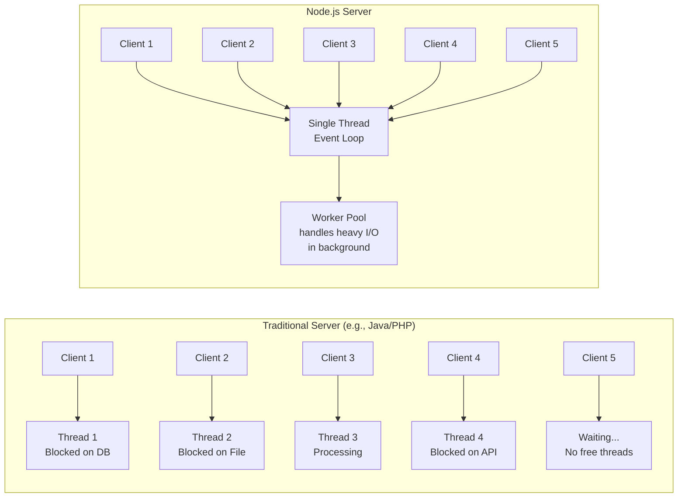
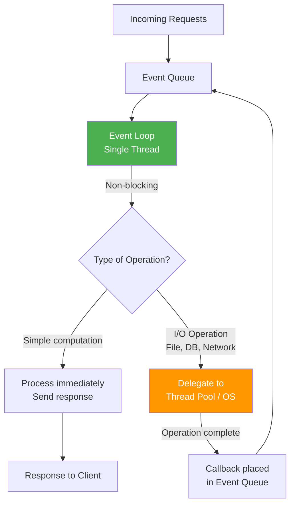

# Introduction to Node.js

[Back to Node.js & MongoDB Topics](./)

---

## Table of Contents

- [What is Node.js?](#what-is-nodejs)
- [Why Node.js?](#why-nodejs)
- [Node.js vs Browser JavaScript](#nodejs-vs-browser-javascript)
- [Node.js Architecture](#nodejs-architecture)
- [Installing Node.js](#installing-nodejs)
- [Node.js REPL](#nodejs-repl)
- [Running Scripts](#running-scripts)
- [npm Basics](#npm-basics)
- [Modules in Node.js](#modules-in-nodejs)
- [Key Takeaways](#key-takeaways)

---

## What is Node.js?

Node.js is an **open-source, cross-platform JavaScript runtime environment** that executes JavaScript code **outside of a web browser**. It was created by Ryan Dahl in 2009 and is built on Google Chrome's **V8 JavaScript engine**.

In simpler terms: you already know JavaScript runs inside a browser (Chrome, Firefox, etc.) to make web pages interactive. Node.js takes that same language and lets you run it on a server or your laptop -- just like you run Java or Python programs.

**Key characteristics:**

| Feature | Description |
|---------|-------------|
| **Runtime** | Not a language, not a framework -- it is a runtime environment for JavaScript |
| **V8 Engine** | Uses the same engine that powers Google Chrome |
| **Cross-platform** | Runs on Windows, macOS, and Linux |
| **Package Ecosystem** | npm (Node Package Manager) is the largest software registry in the world |

---

## Why Node.js?

### 1. Non-Blocking I/O

Traditional server-side languages (like Java, PHP) handle requests using a **blocking** approach. When one request reads a file from disk or queries a database, that thread **waits** (blocks) until the operation completes.

Node.js uses **non-blocking I/O** -- it sends the request to read a file and immediately moves on to handle other requests. When the file read completes, a callback function is invoked.

```javascript
// Non-blocking file read in Node.js
const fs = require('fs');

console.log("Before reading file");

fs.readFile('data.txt', 'utf8', (err, data) => {
  console.log("File contents:", data);
});

console.log("After calling readFile (this prints BEFORE file contents!)");
```

**Output:**
```
Before reading file
After calling readFile (this prints BEFORE file contents!)
File contents: Hello from data.txt
```

Notice how "After calling readFile" prints before the file contents. Node.js did not wait for the file to be read.

### 2. Event-Driven

Node.js uses an **event-driven architecture**. Everything revolves around events -- when something happens (a file finishes reading, a client connects, data arrives), an event is fired and the corresponding callback function executes.

### 3. V8 Engine

The V8 engine compiles JavaScript directly to **native machine code** (not interpreted line-by-line). This makes Node.js extremely fast for a dynamic language.

### 4. Single Language for Full Stack

With Node.js, you can use JavaScript for both **frontend** (browser) and **backend** (server). One language for the entire stack.

### Traditional Multi-Threaded Server vs Node.js



> **Analogy:** Think of a restaurant. A traditional server is like having one waiter per table -- if a table is slow to order, that waiter is stuck waiting. Node.js is like having one very efficient waiter who takes all orders, passes them to the kitchen, and moves to the next table immediately. When food is ready, the waiter delivers it.

---

## Node.js vs Browser JavaScript

You already know JavaScript from the browser. Here is how Node.js differs:

| Feature | Browser JavaScript | Node.js |
|---------|-------------------|---------|
| **Purpose** | Make web pages interactive | Build server-side applications |
| **DOM Access** | Yes (`document`, `window`) | No (no DOM, no browser) |
| **File System** | No (security restriction) | Yes (`fs` module) |
| **Network Servers** | No (can only make requests) | Yes (can create HTTP servers) |
| **Global Object** | `window` | `global` (or `globalThis`) |
| **Module System** | ES Modules (`import/export`) | CommonJS (`require`) + ES Modules |
| **npm packages** | Limited | Full access to 2M+ packages |
| **Console** | Browser DevTools | Terminal/Command Prompt |

**What you already know that works in Node.js:**
- Variables (`let`, `const`, `var`)
- Functions (regular and arrow functions)
- Arrays and array methods (`map`, `filter`, `reduce`)
- Objects and JSON
- Promises and `async/await`
- `console.log()`
- `setTimeout()`, `setInterval()`

**What does NOT work in Node.js:**
- `document.getElementById()` -- there is no HTML document
- `window.alert()` -- there is no browser window
- `fetch()` -- available from Node.js 18+ (built-in), but was not always there
- Any DOM manipulation

---

## Node.js Architecture

Node.js uses a **single-threaded event loop** architecture. This is fundamentally different from traditional multi-threaded servers.



### How the Event Loop Works (Step by Step)

1. **Client sends a request** (e.g., "fetch student data from MongoDB")
2. The request enters the **Event Queue**
3. The **Event Loop** (single thread) picks up the request
4. If it is a simple computation, it processes and responds immediately
5. If it requires I/O (file read, database query, API call), it **delegates** the work to the system's thread pool (handled by `libuv` library)
6. The Event Loop is now **free** to handle the next request (non-blocking!)
7. When the I/O operation completes, a **callback** is placed back in the Event Queue
8. The Event Loop picks up the callback and sends the response to the client

> **Important for exams:** Node.js is single-threaded for JavaScript execution, but it uses a thread pool (via libuv) for heavy I/O operations. This is what makes it non-blocking.

---

## Installing Node.js

Refer to [PREREQUISITES.md](../PREREQUISITES.md) for detailed installation instructions.

**Quick steps:**

1. Download Node.js **20 LTS** from [https://nodejs.org](https://nodejs.org)
2. Run the installer (it also installs npm automatically)
3. Verify installation:

```bash
node --version
# v20.x.x

npm --version
# 10.x.x
```

---

## Node.js REPL

**REPL** stands for **Read-Eval-Print-Loop**. It is an interactive shell where you can type JavaScript and see results immediately -- similar to how you use `sqlplus` for Oracle DB.

**Starting the REPL:**

```bash
node
```

**Example session:**

```
$ node
Welcome to Node.js v20.x.x.
Type ".help" for more information.
> 2 + 3
5
> let name = "Ravi"
undefined
> `Hello, ${name}!`
'Hello, Ravi!'
> const arr = [10, 20, 30]
undefined
> arr.map(x => x * 2)
[ 20, 40, 60 ]
> .exit
```

**REPL Commands:**

| Command | Description |
|---------|-------------|
| `.help` | Show available commands |
| `.break` | Exit multi-line input |
| `.clear` | Clear context |
| `.exit` | Exit the REPL |
| `Ctrl + C` | Exit (press twice) |

---

## Running Scripts

Instead of typing code in the REPL, you can save it in a `.js` file and run it.

### Hello World

Create a file `hello.js`:

```javascript
// hello.js
console.log("Hello, World!");
console.log("Welcome to Node.js");

const name = "Priya";
const year = 4;
console.log(`${name} is in ${year}th semester of B.E.`);
```

Run it:

```bash
node hello.js
```

**Output:**
```
Hello, World!
Welcome to Node.js
Priya is in 4th semester of B.E.
```

### Reading a File

Create a file `data.txt` with some content, then create `readfile.js`:

```javascript
// readfile.js
const fs = require('fs');

// Asynchronous (non-blocking) - preferred
fs.readFile('data.txt', 'utf8', (err, data) => {
  if (err) {
    console.error("Error reading file:", err.message);
    return;
  }
  console.log("File contents:");
  console.log(data);
});

// Synchronous (blocking) - use only when necessary
const content = fs.readFileSync('data.txt', 'utf8');
console.log("Sync read:", content);
```

### Creating an HTTP Server

This is the classic first Node.js program -- a web server in just a few lines:

```javascript
// server.js
const http = require('http');

const server = http.createServer((req, res) => {
  res.writeHead(200, { 'Content-Type': 'text/html' });
  res.end('<h1>Hello from Node.js Server!</h1><p>Welcome, VCE IT students!</p>');
});

const PORT = 3000;
server.listen(PORT, () => {
  console.log(`Server running at http://localhost:${PORT}`);
});
```

Run it:

```bash
node server.js
```

Open `http://localhost:3000` in your browser. You just built a web server!

> **Compare this to Java:** In Java, you would need a Servlet container (Tomcat), web.xml configuration, a Servlet class, compile, deploy, etc. In Node.js, it is 10 lines of code.

---

## npm Basics

**npm** (Node Package Manager) is the default package manager for Node.js. Think of it as a tool that lets you:

- Download and install third-party libraries (called **packages**)
- Manage project dependencies
- Run project scripts

### Initializing a Project

```bash
mkdir my-project
cd my-project
npm init
```

This starts an interactive prompt asking for project details (name, version, description, etc.). For quick setup with defaults:

```bash
npm init -y
```

This creates a `package.json` file:

```json
{
  "name": "my-project",
  "version": "1.0.0",
  "description": "",
  "main": "index.js",
  "scripts": {
    "test": "echo \"Error: no test specified\" && exit 1",
    "start": "node index.js"
  },
  "keywords": [],
  "author": "",
  "license": "ISC"
}
```

### Understanding package.json

| Field | Description |
|-------|-------------|
| `name` | Project name |
| `version` | Current version (follows semver: major.minor.patch) |
| `main` | Entry point file |
| `scripts` | Custom commands you can run with `npm run <script>` |
| `dependencies` | Packages needed in production |
| `devDependencies` | Packages needed only during development |

### Installing Packages

```bash
# Install a package and add to dependencies
npm install express

# Install a package as dev dependency
npm install --save-dev nodemon

# Install a specific version
npm install express@4.18.2

# Install all dependencies from package.json
npm install

# Uninstall a package
npm uninstall express
```

After installing, two things are created:

1. **`node_modules/`** folder -- contains the actual package code (never commit this to git!)
2. **`package-lock.json`** -- locks exact versions for reproducible builds

### Running Scripts

```bash
# Run the start script
npm start

# Run any custom script
npm run test
npm run dev
```

**Example package.json with scripts:**

```json
{
  "scripts": {
    "start": "node index.js",
    "dev": "nodemon index.js",
    "test": "jest"
  }
}
```

---

## Modules in Node.js

Modules are a way to organize code into separate files. Node.js supports two module systems.

### CommonJS Modules (require / module.exports)

This is the **original** module system in Node.js. You will see this in most Node.js tutorials and older codebases.

**Exporting from a module:**

```javascript
// math.js
function add(a, b) {
  return a + b;
}

function subtract(a, b) {
  return a - b;
}

function multiply(a, b) {
  return a * b;
}

// Export individual functions
module.exports = { add, subtract, multiply };
```

**Importing a module:**

```javascript
// app.js
const math = require('./math');

console.log(math.add(10, 5));       // 15
console.log(math.subtract(10, 5));  // 5
console.log(math.multiply(10, 5));  // 50
```

**Destructured import:**

```javascript
const { add, multiply } = require('./math');
console.log(add(3, 4));       // 7
console.log(multiply(3, 4));  // 12
```

**Built-in modules (no installation needed):**

```javascript
const fs = require('fs');       // File system
const http = require('http');   // HTTP server/client
const path = require('path');   // File path utilities
const os = require('os');       // Operating system info
const events = require('events'); // Event handling
```

### ES Modules (import / export)

This is the **modern** module system, the same one used in browser JavaScript. Node.js supports it from version 12+.

**To use ES modules, either:**
1. Name your file with `.mjs` extension, OR
2. Add `"type": "module"` in your `package.json`

**Exporting:**

```javascript
// math.mjs (or .js with "type": "module" in package.json)

export function add(a, b) {
  return a + b;
}

export function subtract(a, b) {
  return a - b;
}

// Default export
export default function multiply(a, b) {
  return a * b;
}
```

**Importing:**

```javascript
// app.mjs
import multiply, { add, subtract } from './math.mjs';

console.log(add(10, 5));       // 15
console.log(subtract(10, 5));  // 5
console.log(multiply(10, 5));  // 50
```

### CommonJS vs ES Modules

| Feature | CommonJS | ES Modules |
|---------|----------|------------|
| Syntax | `require()` / `module.exports` | `import` / `export` |
| Loading | Synchronous | Asynchronous |
| File Extension | `.js` (default) | `.mjs` or `"type": "module"` |
| Top-level await | Not supported | Supported |
| Usage | Older Node.js code, npm packages | Modern code, browser-compatible |

> **For this course:** We will primarily use CommonJS (`require`) as it is more common in existing Node.js code and tutorials. Be familiar with both for exams.

### Example: Creating a Student Module

```javascript
// student.js
class Student {
  constructor(name, rollNumber, department) {
    this.name = name;
    this.rollNumber = rollNumber;
    this.department = department;
  }

  getInfo() {
    return `${this.name} (${this.rollNumber}) - ${this.department}`;
  }
}

module.exports = Student;
```

```javascript
// app.js
const Student = require('./student');

const s1 = new Student("Ravi Kumar", "21B01A1201", "IT");
const s2 = new Student("Priya Sharma", "21B01A1202", "CSE");

console.log(s1.getInfo()); // Ravi Kumar (21B01A1201) - IT
console.log(s2.getInfo()); // Priya Sharma (21B01A1202) - CSE
```

---

## Key Takeaways

1. **Node.js** is a JavaScript runtime built on Chrome's V8 engine that lets you run JavaScript on the server side.
2. It uses a **single-threaded event loop** with **non-blocking I/O**, making it efficient for I/O-heavy applications.
3. Node.js does **not** have access to DOM (`document`, `window`) -- it is not a browser.
4. **npm** is the package manager used to install third-party libraries and manage project dependencies.
5. `package.json` is the configuration file for every Node.js project.
6. Node.js supports two module systems: **CommonJS** (`require`/`module.exports`) and **ES Modules** (`import`/`export`).
7. Built-in modules like `fs`, `http`, `path`, and `os` provide core functionality without installing anything.
8. You can create an HTTP web server in just a few lines of code.

---

**Next:** [Events and Callbacks in Node.js](./02-events-callbacks.md)
