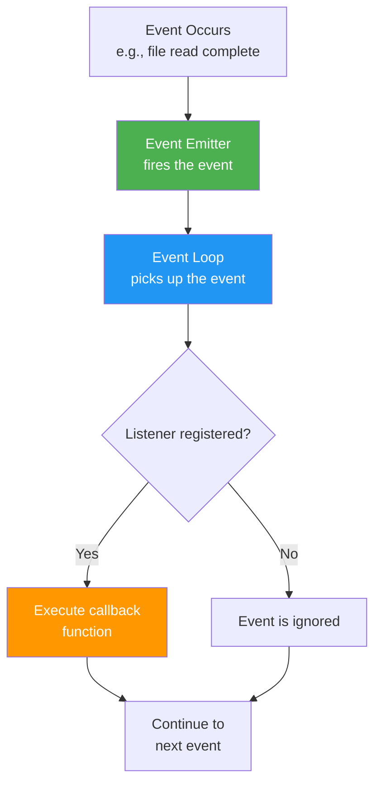

# Events and Callbacks in Node.js

[Back to Node.js & MongoDB Topics](./)

---

## Table of Contents

- [Events in Node.js](#events-in-nodejs)
- [The EventEmitter Class](#the-eventemitter-class)
- [Creating Custom Events](#creating-custom-events)
- [Event Listeners](#event-listeners)
- [Timers](#timers)
- [The Callback Pattern](#the-callback-pattern)
- [Callback Hell](#callback-hell)
- [Promises](#promises)
- [async/await](#asyncawait)
- [The Progression: Callbacks to async/await](#the-progression-callbacks-to-asyncawait)
- [Key Takeaways](#key-takeaways)

---

## Events in Node.js

Node.js is built around an **event-driven architecture**. Almost everything in Node.js is based on events:

- A client connects to the server -- that is an event
- A file finishes reading -- that is an event
- A database query completes -- that is an event
- A timer expires -- that is an event



Think of it like this: events are signals that something happened, and **listeners** are functions that respond when those signals are fired.

---

## The EventEmitter Class

The `EventEmitter` class is the foundation of event-driven programming in Node.js. It is provided by the built-in `events` module.

```javascript
const EventEmitter = require('events');

// Create an instance
const emitter = new EventEmitter();
```

**Key methods of EventEmitter:**

| Method | Description |
|--------|-------------|
| `emitter.on(event, listener)` | Register a listener for an event |
| `emitter.once(event, listener)` | Register a listener that fires only once |
| `emitter.emit(event, ...args)` | Fire/trigger an event |
| `emitter.removeListener(event, listener)` | Remove a specific listener |
| `emitter.removeAllListeners(event)` | Remove all listeners for an event |
| `emitter.listenerCount(event)` | Get count of listeners for an event |

### Basic Example

```javascript
const EventEmitter = require('events');
const emitter = new EventEmitter();

// Register a listener for the 'greet' event
emitter.on('greet', (name) => {
  console.log(`Hello, ${name}!`);
});

// Fire the event
emitter.emit('greet', 'Ravi');    // Hello, Ravi!
emitter.emit('greet', 'Priya');   // Hello, Priya!
```

---

## Creating Custom Events

You can create your own event-driven classes by extending `EventEmitter`.

### Example: Student Registration System

```javascript
const EventEmitter = require('events');

class StudentRegistry extends EventEmitter {
  constructor() {
    super();
    this.students = [];
  }

  register(student) {
    this.students.push(student);
    // Emit a custom event when a student registers
    this.emit('studentRegistered', student);
  }

  getCount() {
    return this.students.length;
  }
}

// Create the registry
const registry = new StudentRegistry();

// Listen for the custom event
registry.on('studentRegistered', (student) => {
  console.log(`New registration: ${student.name} (${student.rollNumber})`);
});

registry.on('studentRegistered', (student) => {
  console.log(`Total students: ${registry.getCount()}`);
});

// Register students
registry.register({ name: "Ravi Kumar", rollNumber: "21B01A1201" });
registry.register({ name: "Priya Sharma", rollNumber: "21B01A1202" });
```

**Output:**
```
New registration: Ravi Kumar (21B01A1201)
Total students: 1
New registration: Priya Sharma (21B01A1202)
Total students: 2
```

Notice: **multiple listeners** can be attached to the same event. They execute in the order they were registered.

---

## Event Listeners

### `.on()` -- Persistent Listener

The listener fires **every time** the event is emitted.

```javascript
const EventEmitter = require('events');
const emitter = new EventEmitter();

emitter.on('tick', () => {
  console.log('Tick!');
});

emitter.emit('tick'); // Tick!
emitter.emit('tick'); // Tick!
emitter.emit('tick'); // Tick!
```

### `.once()` -- One-Time Listener

The listener fires **only the first time** the event is emitted, then it is automatically removed.

```javascript
const EventEmitter = require('events');
const emitter = new EventEmitter();

emitter.once('connect', () => {
  console.log('Connected! (this prints only once)');
});

emitter.emit('connect'); // Connected! (this prints only once)
emitter.emit('connect'); // nothing happens
emitter.emit('connect'); // nothing happens
```

**Use case:** Initialization events, first-time connection handlers.

### `.removeListener()` -- Removing a Listener

```javascript
const EventEmitter = require('events');
const emitter = new EventEmitter();

function onData(data) {
  console.log('Received:', data);
}

// Add listener
emitter.on('data', onData);

emitter.emit('data', 'Hello');   // Received: Hello

// Remove listener
emitter.removeListener('data', onData);

emitter.emit('data', 'World');   // nothing happens (listener removed)
```

> **Note:** To remove a listener, you must pass the **same function reference**. Arrow functions defined inline cannot be removed because you do not have a reference to them.

### Passing Arguments to Events

```javascript
const EventEmitter = require('events');
const emitter = new EventEmitter();

emitter.on('examResult', (name, subject, marks) => {
  console.log(`${name} scored ${marks} in ${subject}`);
});

emitter.emit('examResult', 'Amit Reddy', 'Node.js', 92);
// Amit Reddy scored 92 in Node.js
```

---

## Timers

Node.js provides timer functions that are similar to browser JavaScript.

### setTimeout -- Execute Once After Delay

```javascript
console.log("Start");

setTimeout(() => {
  console.log("This runs after 2 seconds");
}, 2000);

console.log("End");
```

**Output:**
```
Start
End
This runs after 2 seconds
```

Notice "End" prints before the timeout message -- this is non-blocking behavior.

### setInterval -- Execute Repeatedly

```javascript
let count = 0;

const intervalId = setInterval(() => {
  count++;
  console.log(`Tick ${count}`);
  
  if (count >= 5) {
    clearInterval(intervalId); // Stop after 5 ticks
    console.log("Timer stopped");
  }
}, 1000);
```

**Output (one line per second):**
```
Tick 1
Tick 2
Tick 3
Tick 4
Tick 5
Timer stopped
```

### setImmediate -- Execute After Current Event Loop Cycle

`setImmediate` runs the callback **after the current event loop cycle completes**, but before any timers.

```javascript
console.log("1. Start");

setTimeout(() => {
  console.log("2. setTimeout (0ms)");
}, 0);

setImmediate(() => {
  console.log("3. setImmediate");
});

console.log("4. End");
```

**Output:**
```
1. Start
4. End
3. setImmediate    (or 2 -- order between setTimeout(0) and setImmediate is not guaranteed)
2. setTimeout (0ms)
```

### process.nextTick -- Execute Before Everything Else

```javascript
console.log("Start");

process.nextTick(() => {
  console.log("nextTick -- runs before setTimeout and setImmediate");
});

setTimeout(() => {
  console.log("setTimeout");
}, 0);

console.log("End");
```

**Output:**
```
Start
End
nextTick -- runs before setTimeout and setImmediate
setTimeout
```

**Priority order:** `process.nextTick` > `setImmediate` > `setTimeout(0)`

---

## The Callback Pattern

A **callback** is a function passed as an argument to another function, which is called when the operation completes. This is the **oldest** asynchronous pattern in Node.js.

### Node.js Callback Convention (Error-First Callbacks)

In Node.js, callbacks follow a standard pattern: **the first argument is always the error** (or `null` if no error).

```javascript
const fs = require('fs');

// Error-first callback pattern
fs.readFile('students.txt', 'utf8', (err, data) => {
  if (err) {
    console.error("Error:", err.message);
    return;
  }
  console.log("Data:", data);
});
```

### Custom Function with Callback

```javascript
function fetchStudentMarks(rollNumber, callback) {
  // Simulating a database query with setTimeout
  setTimeout(() => {
    if (rollNumber === "21B01A1201") {
      callback(null, { name: "Ravi Kumar", marks: 85 });  // success
    } else {
      callback(new Error("Student not found"), null);      // error
    }
  }, 1000);
}

// Using the function
fetchStudentMarks("21B01A1201", (err, result) => {
  if (err) {
    console.error(err.message);
    return;
  }
  console.log(`${result.name} scored ${result.marks}`);
});
```

---

## Callback Hell

When you have multiple asynchronous operations that depend on each other, callbacks get **deeply nested**. This is called **Callback Hell** or the **Pyramid of Doom**.

```javascript
// Callback Hell -- DON'T write code like this
const fs = require('fs');

fs.readFile('student.json', 'utf8', (err, studentData) => {
  if (err) { console.error(err); return; }
  
  const student = JSON.parse(studentData);
  
  fs.readFile('courses.json', 'utf8', (err, courseData) => {
    if (err) { console.error(err); return; }
    
    const courses = JSON.parse(courseData);
    
    fs.readFile('grades.json', 'utf8', (err, gradeData) => {
      if (err) { console.error(err); return; }
      
      const grades = JSON.parse(gradeData);
      
      fs.writeFile('report.json', JSON.stringify({
        student, courses, grades
      }), (err) => {
        if (err) { console.error(err); return; }
        
        console.log("Report generated!");
        // Imagine more nesting here...
      });
    });
  });
});
```

**Problems with Callback Hell:**
1. Code is hard to read (nesting keeps going right)
2. Error handling is repetitive
3. Difficult to maintain and debug
4. Cannot use `try/catch` for error handling

---

## Promises

**Promises** were introduced in ES6 (2015) to solve the callback hell problem. A Promise represents a value that may be available now, in the future, or never.

### Promise States

A Promise has three states:

| State | Description |
|-------|-------------|
| **Pending** | Initial state, operation is in progress |
| **Fulfilled** (Resolved) | Operation completed successfully |
| **Rejected** | Operation failed with an error |

### Creating a Promise

```javascript
function fetchStudentMarks(rollNumber) {
  return new Promise((resolve, reject) => {
    setTimeout(() => {
      if (rollNumber === "21B01A1201") {
        resolve({ name: "Ravi Kumar", marks: 85 });  // success
      } else {
        reject(new Error("Student not found"));       // failure
      }
    }, 1000);
  });
}
```

### Using a Promise with .then() and .catch()

```javascript
fetchStudentMarks("21B01A1201")
  .then((result) => {
    console.log(`${result.name} scored ${result.marks}`);
  })
  .catch((err) => {
    console.error("Error:", err.message);
  });
```

### Chaining Promises (Solving Callback Hell)

```javascript
const fs = require('fs').promises; // fs.promises provides Promise-based API

fs.readFile('student.json', 'utf8')
  .then((studentData) => {
    const student = JSON.parse(studentData);
    console.log("Student loaded:", student.name);
    return fs.readFile('courses.json', 'utf8');
  })
  .then((courseData) => {
    const courses = JSON.parse(courseData);
    console.log("Courses loaded:", courses.length);
    return fs.readFile('grades.json', 'utf8');
  })
  .then((gradeData) => {
    const grades = JSON.parse(gradeData);
    console.log("Grades loaded");
    console.log("Report ready!");
  })
  .catch((err) => {
    console.error("Error in any step:", err.message);
  });
```

Notice: no deep nesting! Each `.then()` returns a new Promise, so they chain **flat**.

### Promise.all -- Run Multiple Promises in Parallel

```javascript
const fs = require('fs').promises;

Promise.all([
  fs.readFile('student.json', 'utf8'),
  fs.readFile('courses.json', 'utf8'),
  fs.readFile('grades.json', 'utf8')
])
  .then(([studentData, courseData, gradeData]) => {
    console.log("All files loaded simultaneously!");
  })
  .catch((err) => {
    console.error("One of the reads failed:", err.message);
  });
```

---

## async/await

**async/await** (introduced in ES2017) is syntactic sugar over Promises. It makes asynchronous code look and behave like synchronous code.

### Basic Syntax

```javascript
// Mark the function as async
async function getStudent() {
  // await pauses execution until the Promise resolves
  const result = await fetchStudentMarks("21B01A1201");
  console.log(`${result.name} scored ${result.marks}`);
}

getStudent();
```

### Error Handling with try/catch

```javascript
async function getStudent(rollNumber) {
  try {
    const result = await fetchStudentMarks(rollNumber);
    console.log(`${result.name} scored ${result.marks}`);
  } catch (err) {
    console.error("Error:", err.message);
  }
}

getStudent("21B01A1201");  // Ravi Kumar scored 85
getStudent("INVALID");     // Error: Student not found
```

### File Reading with async/await

```javascript
const fs = require('fs').promises;

async function generateReport() {
  try {
    const studentData = await fs.readFile('student.json', 'utf8');
    const student = JSON.parse(studentData);
    console.log("Student loaded:", student.name);

    const courseData = await fs.readFile('courses.json', 'utf8');
    const courses = JSON.parse(courseData);
    console.log("Courses loaded:", courses.length);

    const gradeData = await fs.readFile('grades.json', 'utf8');
    const grades = JSON.parse(gradeData);
    console.log("Grades loaded");

    console.log("Report ready!");
  } catch (err) {
    console.error("Error:", err.message);
  }
}

generateReport();
```

Compare this with the callback hell version above -- it reads like synchronous code, top to bottom.

### Parallel Execution with async/await

```javascript
const fs = require('fs').promises;

async function loadAllFiles() {
  try {
    // Run all three reads in parallel
    const [studentData, courseData, gradeData] = await Promise.all([
      fs.readFile('student.json', 'utf8'),
      fs.readFile('courses.json', 'utf8'),
      fs.readFile('grades.json', 'utf8')
    ]);

    console.log("All files loaded in parallel!");
  } catch (err) {
    console.error("Error:", err.message);
  }
}

loadAllFiles();
```

---

## The Progression: Callbacks to async/await

Here is the same operation written in all three styles, so you can see the evolution:

### Task: Read a file, parse JSON, and print a student name

**Style 1: Callbacks**

```javascript
const fs = require('fs');

fs.readFile('student.json', 'utf8', (err, data) => {
  if (err) {
    console.error("Error:", err.message);
    return;
  }
  const student = JSON.parse(data);
  console.log("Name:", student.name);
});
```

**Style 2: Promises**

```javascript
const fs = require('fs').promises;

fs.readFile('student.json', 'utf8')
  .then((data) => {
    const student = JSON.parse(data);
    console.log("Name:", student.name);
  })
  .catch((err) => {
    console.error("Error:", err.message);
  });
```

**Style 3: async/await**

```javascript
const fs = require('fs').promises;

async function main() {
  try {
    const data = await fs.readFile('student.json', 'utf8');
    const student = JSON.parse(data);
    console.log("Name:", student.name);
  } catch (err) {
    console.error("Error:", err.message);
  }
}

main();
```

### Summary Comparison

| Feature | Callbacks | Promises | async/await |
|---------|-----------|----------|-------------|
| **Readability** | Poor (nested) | Better (chained) | Best (linear) |
| **Error Handling** | Manual in each callback | `.catch()` at end | `try/catch` |
| **Debugging** | Difficult | Moderate | Easy (line-by-line) |
| **Year Introduced** | Since the beginning | ES6 (2015) | ES2017 |
| **Still Used?** | Yes, in many APIs | Yes | Yes (preferred) |

> **For exams:** Know all three styles. Modern Node.js code uses `async/await`, but many npm packages and Node.js built-in modules still use callbacks. Understanding callbacks is essential to understanding how Node.js works internally.

---

## Key Takeaways

1. Node.js is built on an **event-driven** architecture. The `EventEmitter` class is the core of this system.
2. You can create **custom events** by extending `EventEmitter` or using instances directly.
3. `.on()` listens for every occurrence, `.once()` listens only the first time, `.removeListener()` removes a listener.
4. Timer functions (`setTimeout`, `setInterval`, `setImmediate`) schedule code execution but do not block the event loop.
5. **Callbacks** are functions passed to asynchronous operations, following the **error-first** convention `(err, data)`.
6. **Callback hell** occurs when multiple dependent async operations are nested deeply. This is hard to read, debug, and maintain.
7. **Promises** solve callback hell by allowing chaining with `.then()` and centralized error handling with `.catch()`.
8. **async/await** is the modern way to write asynchronous code -- it looks synchronous but is non-blocking under the hood.
9. The progression is: **Callbacks** (2009) -> **Promises** (2015) -> **async/await** (2017). Know all three.

---

**Next:** [Introduction to MongoDB](./03-introduction-mongodb.md)
