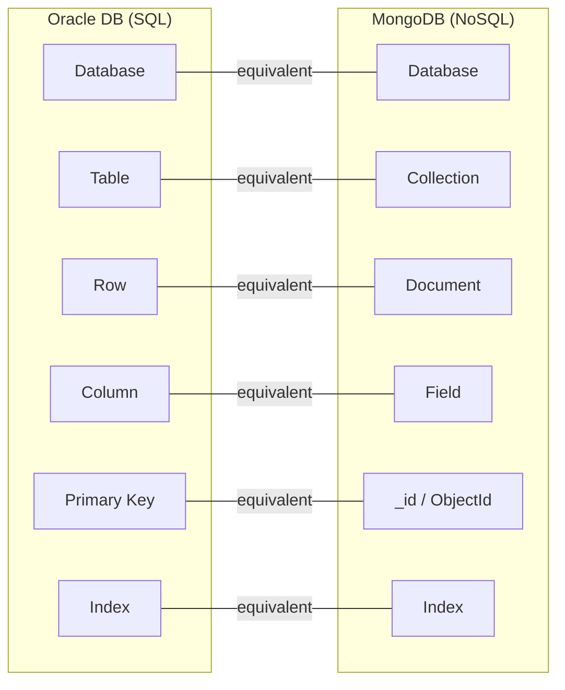
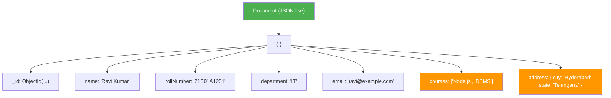

# Introduction to MongoDB

[Back to Node.js & MongoDB Topics](./)

---

## Table of Contents

- [What is MongoDB?](#what-is-mongodb)
- [NoSQL vs SQL](#nosql-vs-sql)
- [MongoDB Terminology](#mongodb-terminology)
- [Document Model (BSON/JSON)](#document-model-bsonjson)
- [MongoDB Data Types](#mongodb-data-types)
- [Getting Started with mongosh](#getting-started-with-mongosh)
- [CRUD Operations](#crud-operations)
  - [Create (Insert)](#create-insert)
  - [Read (Find)](#read-find)
  - [Update](#update)
  - [Delete](#delete)
- [Query Operators](#query-operators)
- [Sorting and Limiting](#sorting-and-limiting)
- [Indexing Basics](#indexing-basics)
- [Aggregation Pipeline Basics](#aggregation-pipeline-basics)
- [Key Takeaways](#key-takeaways)

---

## What is MongoDB?

MongoDB is an open-source, **document-oriented NoSQL database**. Instead of storing data in tables with rows and columns (like Oracle DB), MongoDB stores data as flexible **JSON-like documents**.

**Key characteristics:**

| Feature | Description |
|---------|-------------|
| **Document-oriented** | Data stored as JSON-like documents (BSON) |
| **Schema-flexible** | Documents in the same collection can have different fields |
| **Scalable** | Built-in support for horizontal scaling (sharding) |
| **High Performance** | Supports indexing, in-memory processing |
| **Free & Open Source** | Community Edition is free to use |

> **Why MongoDB for this course?** As IT students, you will work with various databases in your career. You already know SQL with Oracle DB. MongoDB introduces you to the NoSQL world, which is widely used in modern web applications, especially with Node.js.

---

## NoSQL vs SQL

You have already worked with Oracle DB, which is a relational (SQL) database. Here is how MongoDB (NoSQL) compares:

| Feature | SQL (Oracle DB) | NoSQL (MongoDB) |
|---------|----------------|-----------------|
| **Data Model** | Tables with rows and columns | Collections with documents |
| **Schema** | Fixed schema (ALTER TABLE to change) | Flexible schema (each document can differ) |
| **Query Language** | SQL (`SELECT * FROM students`) | MongoDB Query Language (`db.students.find()`) |
| **Relationships** | JOINs between tables | Embedded documents or references |
| **Scaling** | Vertical (bigger server) | Horizontal (more servers) |
| **Transactions** | Full ACID transactions | ACID transactions (since v4.0) |
| **Best For** | Complex relationships, banking | Flexible data, rapid development, JSON APIs |

### When to Use What?

- **Use SQL (Oracle/MySQL/PostgreSQL):** Banking systems, ERP, systems with complex relationships and strict data integrity
- **Use MongoDB:** Web applications, content management, real-time analytics, mobile app backends, APIs that work with JSON

---

## MongoDB Terminology

If you know Oracle DB, this mapping will help you understand MongoDB:



| Oracle DB (SQL) | MongoDB (NoSQL) | Example |
|----------------|-----------------|---------|
| Database | Database | `studentDB` |
| Table | Collection | `students` |
| Row | Document | `{ name: "Ravi", dept: "IT" }` |
| Column | Field | `name`, `dept` |
| Primary Key | `_id` (auto-generated ObjectId) | `ObjectId("507f1f77bcf86cd799439011")` |
| `SELECT` | `find()` | `db.students.find()` |
| `INSERT` | `insertOne()` / `insertMany()` | `db.students.insertOne({...})` |
| `UPDATE` | `updateOne()` / `updateMany()` | `db.students.updateOne({...})` |
| `DELETE` | `deleteOne()` / `deleteMany()` | `db.students.deleteOne({...})` |

---

## Document Model (BSON/JSON)

### What is a Document?

A MongoDB document is a **JSON-like** data structure made up of field-value pairs:



```json
{
  "_id": "ObjectId('507f1f77bcf86cd799439011')",
  "name": "Ravi Kumar",
  "rollNumber": "21B01A1201",
  "department": "IT",
  "email": "ravi@example.com",
  "courses": ["Node.js", "DBMS", "OS"],
  "address": {
    "city": "Hyderabad",
    "state": "Telangana"
  }
}
```

**Key points:**
- Every document has a unique `_id` field (auto-generated if you do not provide one)
- Fields can contain **arrays** (`courses`) -- this is something SQL tables cannot do directly
- Fields can contain **nested documents** (`address`) -- this replaces JOINs in many cases
- Documents in the same collection can have **different fields** (flexible schema)

### JSON vs BSON

| Feature | JSON | BSON |
|---------|------|------|
| **Full Form** | JavaScript Object Notation | Binary JSON |
| **Format** | Text-based, human-readable | Binary, machine-optimized |
| **Used Where** | When you write/read data | How MongoDB stores data internally |
| **Data Types** | String, Number, Boolean, Array, Object, null | All JSON types + Date, ObjectId, Binary, Decimal128, etc. |

You write documents in **JSON** format. MongoDB internally stores them in **BSON** format for efficiency. You don't need to worry about this conversion -- it happens automatically.

---

## MongoDB Data Types

| Data Type | Description | Example |
|-----------|-------------|---------|
| **String** | UTF-8 text | `"Ravi Kumar"` |
| **Number** (int32/int64) | Integer values | `85`, `NumberInt(85)` |
| **Double** | Floating-point | `9.5`, `85.75` |
| **Boolean** | true or false | `true`, `false` |
| **Array** | List of values | `["IT", "CSE", "ECE"]` |
| **Object** (Embedded Document) | Nested document | `{ city: "Hyderabad" }` |
| **ObjectId** | Unique 12-byte identifier | `ObjectId("507f1f77...")` |
| **Date** | Date/time value | `new Date()`, `ISODate("2024-01-15")` |
| **Null** | Null/missing value | `null` |
| **Decimal128** | High-precision decimal | `NumberDecimal("99.99")` |

---

## Getting Started with mongosh

**mongosh** is the MongoDB Shell -- an interactive JavaScript interface to MongoDB (similar to `sqlplus` for Oracle DB).

### Starting mongosh

```bash
# Connect to local MongoDB (default: localhost:27017)
mongosh

# Connect with specific connection string
mongosh "mongodb://localhost:27017"
```

### Basic Shell Commands

```javascript
// Show all databases
show dbs

// Switch to a database (creates it if it doesn't exist)
use studentDB

// Show current database
db

// Show all collections in current database
show collections

// Drop (delete) a database
db.dropDatabase()

// Drop (delete) a collection
db.students.drop()
```

> **Note:** In MongoDB, databases and collections are created **lazily** -- they are actually created only when you first insert data into them. Just running `use studentDB` does not create the database.

---

## CRUD Operations

Let us work with a `students` collection. First, start `mongosh` and switch to our database:

```javascript
use studentDB
```

### Create (Insert)

#### insertOne -- Insert a Single Document

```javascript
db.students.insertOne({
  name: "Ravi Kumar",
  rollNumber: "21B01A1201",
  department: "IT",
  email: "ravi@example.com"
})
```

**Output:**
```javascript
{
  acknowledged: true,
  insertedId: ObjectId('65a1b2c3d4e5f6a7b8c9d0e1')
}
```

#### insertMany -- Insert Multiple Documents

```javascript
db.students.insertMany([
  {
    name: "Priya Sharma",
    rollNumber: "21B01A1202",
    department: "CSE",
    email: "priya@example.com"
  },
  {
    name: "Amit Reddy",
    rollNumber: "21B01A1203",
    department: "IT",
    email: "amit@example.com"
  },
  {
    name: "Sneha Patel",
    rollNumber: "21B01A1204",
    department: "ECE",
    email: "sneha@example.com"
  },
  {
    name: "Karthik Rao",
    rollNumber: "21B01A1205",
    department: "CSE",
    email: "karthik@example.com"
  }
])
```

**Output:**
```javascript
{
  acknowledged: true,
  insertedIds: {
    '0': ObjectId('65a1b2c3d4e5f6a7b8c9d0e2'),
    '1': ObjectId('65a1b2c3d4e5f6a7b8c9d0e3'),
    '2': ObjectId('65a1b2c3d4e5f6a7b8c9d0e4'),
    '3': ObjectId('65a1b2c3d4e5f6a7b8c9d0e5')
  }
}
```

Now our `students` collection has 5 documents.

---

### Read (Find)

#### find() -- Retrieve All Documents

```javascript
// Get all students (equivalent to SELECT * FROM students)
db.students.find()
```

**Output:**
```javascript
[
  { _id: ObjectId('...'), name: 'Ravi Kumar', rollNumber: '21B01A1201', department: 'IT', email: 'ravi@example.com' },
  { _id: ObjectId('...'), name: 'Priya Sharma', rollNumber: '21B01A1202', department: 'CSE', email: 'priya@example.com' },
  { _id: ObjectId('...'), name: 'Amit Reddy', rollNumber: '21B01A1203', department: 'IT', email: 'amit@example.com' },
  { _id: ObjectId('...'), name: 'Sneha Patel', rollNumber: '21B01A1204', department: 'ECE', email: 'sneha@example.com' },
  { _id: ObjectId('...'), name: 'Karthik Rao', rollNumber: '21B01A1205', department: 'CSE', email: 'karthik@example.com' }
]
```

#### find() with Filter

```javascript
// Find students in IT department
// SQL equivalent: SELECT * FROM students WHERE department = 'IT'
db.students.find({ department: "IT" })
```

**Output:**
```javascript
[
  { _id: ObjectId('...'), name: 'Ravi Kumar', rollNumber: '21B01A1201', department: 'IT', email: 'ravi@example.com' },
  { _id: ObjectId('...'), name: 'Amit Reddy', rollNumber: '21B01A1203', department: 'IT', email: 'amit@example.com' }
]
```

#### find() with Projection (Selecting Specific Fields)

```javascript
// Get only name and department (exclude _id)
// SQL equivalent: SELECT name, department FROM students
db.students.find(
  {},                              // filter: all documents
  { name: 1, department: 1, _id: 0 }  // projection: include name, dept; exclude _id
)
```

**Output:**
```javascript
[
  { name: 'Ravi Kumar', department: 'IT' },
  { name: 'Priya Sharma', department: 'CSE' },
  { name: 'Amit Reddy', department: 'IT' },
  { name: 'Sneha Patel', department: 'ECE' },
  { name: 'Karthik Rao', department: 'CSE' }
]
```

**Projection rules:**
- `1` means include the field
- `0` means exclude the field
- `_id` is included by default (you must explicitly exclude it with `_id: 0`)
- You cannot mix inclusion and exclusion (except for `_id`)

#### findOne() -- Retrieve a Single Document

```javascript
// Find one student by roll number
db.students.findOne({ rollNumber: "21B01A1201" })
```

**Output:**
```javascript
{
  _id: ObjectId('...'),
  name: 'Ravi Kumar',
  rollNumber: '21B01A1201',
  department: 'IT',
  email: 'ravi@example.com'
}
```

#### Filter with Projection

```javascript
// Find IT students, show only name and roll number
// SQL equivalent: SELECT name, rollNumber FROM students WHERE department = 'IT'
db.students.find(
  { department: "IT" },
  { name: 1, rollNumber: 1, _id: 0 }
)
```

**Output:**
```javascript
[
  { name: 'Ravi Kumar', rollNumber: '21B01A1201' },
  { name: 'Amit Reddy', rollNumber: '21B01A1203' }
]
```

---

### Update

#### updateOne -- Update a Single Document

```javascript
// Add a CGPA field to Ravi Kumar
// SQL equivalent: UPDATE students SET cgpa = 8.5 WHERE rollNumber = '21B01A1201'
db.students.updateOne(
  { rollNumber: "21B01A1201" },     // filter
  { $set: { cgpa: 8.5 } }           // update
)
```

**Output:**
```javascript
{
  acknowledged: true,
  matchedCount: 1,
  modifiedCount: 1
}
```

#### updateMany -- Update Multiple Documents

```javascript
// Add a semester field to all students
db.students.updateMany(
  {},                              // filter: all documents
  { $set: { semester: 4 } }        // update
)
```

**Output:**
```javascript
{
  acknowledged: true,
  matchedCount: 5,
  modifiedCount: 5
}
```

#### Update Operators

**`$set`** -- Set the value of a field (add if it does not exist):

```javascript
db.students.updateOne(
  { rollNumber: "21B01A1202" },
  { $set: { cgpa: 9.1, phone: "9876543210" } }
)
```

**`$unset`** -- Remove a field from a document:

```javascript
// Remove the phone field from Priya's document
db.students.updateOne(
  { rollNumber: "21B01A1202" },
  { $unset: { phone: "" } }
)
```

**`$push`** -- Add an element to an array field:

```javascript
// First, add a courses array to a student
db.students.updateOne(
  { rollNumber: "21B01A1201" },
  { $set: { courses: ["DBMS", "OS"] } }
)

// Then push a new course to the array
db.students.updateOne(
  { rollNumber: "21B01A1201" },
  { $push: { courses: "Node.js" } }
)
```

Now Ravi's courses array is `["DBMS", "OS", "Node.js"]`.

**`$inc`** -- Increment a numeric field:

```javascript
// Increase Ravi's CGPA by 0.2
db.students.updateOne(
  { rollNumber: "21B01A1201" },
  { $inc: { cgpa: 0.2 } }
)
```

**`$pull`** -- Remove an element from an array:

```javascript
// Remove "OS" from Ravi's courses
db.students.updateOne(
  { rollNumber: "21B01A1201" },
  { $pull: { courses: "OS" } }
)
```

---

### Delete

#### deleteOne -- Delete a Single Document

```javascript
// Delete student with roll number 21B01A1205
// SQL equivalent: DELETE FROM students WHERE rollNumber = '21B01A1205'
db.students.deleteOne({ rollNumber: "21B01A1205" })
```

**Output:**
```javascript
{
  acknowledged: true,
  deletedCount: 1
}
```

#### deleteMany -- Delete Multiple Documents

```javascript
// Delete all students in ECE department
db.students.deleteMany({ department: "ECE" })
```

**Output:**
```javascript
{
  acknowledged: true,
  deletedCount: 1
}
```

```javascript
// Delete ALL documents in a collection (careful!)
db.students.deleteMany({})
```

> **Caution:** `deleteMany({})` with an empty filter deletes ALL documents, similar to `DELETE FROM students` without a WHERE clause in SQL.

---

## Query Operators

MongoDB provides query operators for complex filtering. They start with `$`.

### Comparison Operators

| Operator | Description | SQL Equivalent |
|----------|-------------|----------------|
| `$eq` | Equal to | `=` |
| `$ne` | Not equal to | `!=` |
| `$gt` | Greater than | `>` |
| `$gte` | Greater than or equal | `>=` |
| `$lt` | Less than | `<` |
| `$lte` | Less than or equal | `<=` |
| `$in` | Matches any value in array | `IN (...)` |
| `$nin` | Does not match any value in array | `NOT IN (...)` |

**Examples:**

Let us first add CGPA data to work with:

```javascript
db.students.updateOne({ rollNumber: "21B01A1201" }, { $set: { cgpa: 8.5 } })
db.students.updateOne({ rollNumber: "21B01A1202" }, { $set: { cgpa: 9.1 } })
db.students.updateOne({ rollNumber: "21B01A1203" }, { $set: { cgpa: 7.8 } })
db.students.updateOne({ rollNumber: "21B01A1204" }, { $set: { cgpa: 8.9 } })
db.students.updateOne({ rollNumber: "21B01A1205" }, { $set: { cgpa: 7.5 } })
```

```javascript
// Students with CGPA greater than 8.0
// SQL: SELECT * FROM students WHERE cgpa > 8.0
db.students.find({ cgpa: { $gt: 8.0 } })

// Students with CGPA between 8.0 and 9.0 (inclusive)
// SQL: SELECT * FROM students WHERE cgpa >= 8.0 AND cgpa <= 9.0
db.students.find({ cgpa: { $gte: 8.0, $lte: 9.0 } })

// Students in IT or CSE department
// SQL: SELECT * FROM students WHERE department IN ('IT', 'CSE')
db.students.find({ department: { $in: ["IT", "CSE"] } })

// Students NOT in ECE department
// SQL: SELECT * FROM students WHERE department != 'ECE'
db.students.find({ department: { $ne: "ECE" } })
```

### Logical Operators

| Operator | Description | SQL Equivalent |
|----------|-------------|----------------|
| `$and` | All conditions must be true | `AND` |
| `$or` | At least one condition must be true | `OR` |
| `$not` | Negates the condition | `NOT` |

**Examples:**

```javascript
// Students in IT department AND CGPA > 8.0
// SQL: SELECT * FROM students WHERE department = 'IT' AND cgpa > 8.0
db.students.find({
  $and: [
    { department: "IT" },
    { cgpa: { $gt: 8.0 } }
  ]
})
```

**Shorthand for $and** (when fields are different, you can just list them):

```javascript
// This is equivalent to the $and above
db.students.find({
  department: "IT",
  cgpa: { $gt: 8.0 }
})
```

```javascript
// Students in IT OR CSE department
// SQL: SELECT * FROM students WHERE department = 'IT' OR department = 'CSE'
db.students.find({
  $or: [
    { department: "IT" },
    { department: "CSE" }
  ]
})

// Students in IT with CGPA > 8 OR in CSE with CGPA > 9
db.students.find({
  $or: [
    { department: "IT", cgpa: { $gt: 8.0 } },
    { department: "CSE", cgpa: { $gt: 9.0 } }
  ]
})
```

---

## Sorting and Limiting

### sort() -- Sort Results

```javascript
// Sort by name ascending (A to Z)
// SQL: SELECT * FROM students ORDER BY name ASC
db.students.find().sort({ name: 1 })

// Sort by CGPA descending (highest first)
// SQL: SELECT * FROM students ORDER BY cgpa DESC
db.students.find().sort({ cgpa: -1 })

// Sort by department ascending, then by CGPA descending
db.students.find().sort({ department: 1, cgpa: -1 })
```

- `1` means ascending (A-Z, low-high)
- `-1` means descending (Z-A, high-low)

### limit() -- Limit Number of Results

```javascript
// Get top 3 students by CGPA
// SQL: SELECT * FROM students ORDER BY cgpa DESC FETCH FIRST 3 ROWS ONLY
db.students.find().sort({ cgpa: -1 }).limit(3)
```

### skip() -- Skip Results (for Pagination)

```javascript
// Skip first 2 results, get next 2 (page 2 with 2 items per page)
db.students.find().skip(2).limit(2)
```

### countDocuments() -- Count Results

```javascript
// Count all students
db.students.countDocuments()
// 5

// Count IT students
db.students.countDocuments({ department: "IT" })
// 2
```

### Chaining Operations

```javascript
// Find CSE students, show only name and CGPA, sort by CGPA descending, limit to 2
db.students.find(
  { department: "CSE" },
  { name: 1, cgpa: 1, _id: 0 }
).sort({ cgpa: -1 }).limit(2)
```

---

## Indexing Basics

Indexes make queries faster, just like indexes in Oracle DB. Without an index, MongoDB scans **every document** in a collection (collection scan) -- like a full table scan.

### Creating an Index

```javascript
// Create an index on the rollNumber field
db.students.createIndex({ rollNumber: 1 })

// Create an index on department (ascending)
db.students.createIndex({ department: 1 })

// Create a compound index
db.students.createIndex({ department: 1, cgpa: -1 })

// Create a unique index (no duplicate values allowed)
db.students.createIndex({ email: 1 }, { unique: true })
```

### Viewing Indexes

```javascript
// List all indexes on a collection
db.students.getIndexes()
```

**Output:**
```javascript
[
  { v: 2, key: { _id: 1 }, name: '_id_' },              // default index
  { v: 2, key: { rollNumber: 1 }, name: 'rollNumber_1' },
  { v: 2, key: { department: 1 }, name: 'department_1' }
]
```

> **Note:** MongoDB automatically creates an index on the `_id` field. You cannot remove it.

### Dropping an Index

```javascript
db.students.dropIndex({ department: 1 })
```

---

## Aggregation Pipeline Basics

The **aggregation pipeline** is MongoDB's way of processing and transforming data -- similar to `GROUP BY`, `HAVING`, and aggregate functions in SQL.

An aggregation pipeline consists of **stages**, and documents pass through each stage in sequence.

### Common Pipeline Stages

| Stage | Description | SQL Equivalent |
|-------|-------------|----------------|
| `$match` | Filter documents | `WHERE` |
| `$group` | Group by a field and compute aggregates | `GROUP BY` |
| `$sort` | Sort results | `ORDER BY` |
| `$project` | Select/rename/compute fields | `SELECT` |
| `$limit` | Limit results | `FETCH FIRST n ROWS` |
| `$count` | Count documents | `COUNT(*)` |

### Example 1: Count Students by Department

```javascript
// SQL: SELECT department, COUNT(*) as count FROM students GROUP BY department
db.students.aggregate([
  {
    $group: {
      _id: "$department",        // group by department
      count: { $sum: 1 }          // count each
    }
  }
])
```

**Output:**
```javascript
[
  { _id: 'IT', count: 2 },
  { _id: 'CSE', count: 2 },
  { _id: 'ECE', count: 1 }
]
```

### Example 2: Average CGPA by Department

```javascript
// SQL: SELECT department, AVG(cgpa) as avgCGPA FROM students GROUP BY department
db.students.aggregate([
  {
    $group: {
      _id: "$department",
      avgCGPA: { $avg: "$cgpa" },
      maxCGPA: { $max: "$cgpa" },
      minCGPA: { $min: "$cgpa" }
    }
  }
])
```

**Output:**
```javascript
[
  { _id: 'IT', avgCGPA: 8.15, maxCGPA: 8.5, minCGPA: 7.8 },
  { _id: 'CSE', avgCGPA: 8.3, maxCGPA: 9.1, minCGPA: 7.5 },
  { _id: 'ECE', avgCGPA: 8.9, maxCGPA: 8.9, minCGPA: 8.9 }
]
```

### Example 3: Multi-Stage Pipeline

```javascript
// Find departments where average CGPA > 8.0, sorted by average CGPA descending
// SQL: SELECT department, AVG(cgpa) as avgCGPA FROM students
//      GROUP BY department HAVING AVG(cgpa) > 8.0 ORDER BY avgCGPA DESC
db.students.aggregate([
  {
    $group: {
      _id: "$department",
      avgCGPA: { $avg: "$cgpa" },
      studentCount: { $sum: 1 }
    }
  },
  {
    $match: { avgCGPA: { $gt: 8.0 } }      // HAVING equivalent
  },
  {
    $sort: { avgCGPA: -1 }                   // ORDER BY
  },
  {
    $project: {                               // SELECT / rename fields
      department: "$_id",
      avgCGPA: { $round: ["$avgCGPA", 2] },
      studentCount: 1,
      _id: 0
    }
  }
])
```

**Output:**
```javascript
[
  { studentCount: 1, department: 'ECE', avgCGPA: 8.9 },
  { studentCount: 2, department: 'CSE', avgCGPA: 8.3 },
  { studentCount: 2, department: 'IT', avgCGPA: 8.15 }
]
```

---

## Key Takeaways

1. **MongoDB** is a document-oriented NoSQL database that stores data as JSON-like documents (BSON internally).
2. The mapping from SQL to MongoDB: **Table -> Collection**, **Row -> Document**, **Column -> Field**, **Primary Key -> _id**.
3. MongoDB has a **flexible schema** -- documents in the same collection can have different fields.
4. Documents can contain **arrays** and **nested documents**, reducing the need for JOINs.
5. **CRUD operations**: `insertOne`/`insertMany`, `find`/`findOne`, `updateOne`/`updateMany`, `deleteOne`/`deleteMany`.
6. **Query operators** (`$gt`, `$lt`, `$in`, `$and`, `$or`) provide powerful filtering similar to SQL WHERE clauses.
7. **Update operators** (`$set`, `$unset`, `$push`, `$inc`, `$pull`) modify specific fields without replacing the entire document.
8. **Sorting** uses `1` for ascending and `-1` for descending. **Limiting** restricts the number of results.
9. **Indexes** improve query performance -- similar to indexes in Oracle DB.
10. The **aggregation pipeline** is MongoDB's equivalent of SQL GROUP BY with aggregate functions.

---

**Next:** [MongoDB from Node.js](./04-mongodb-from-nodejs.md)
