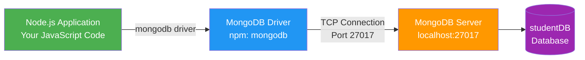
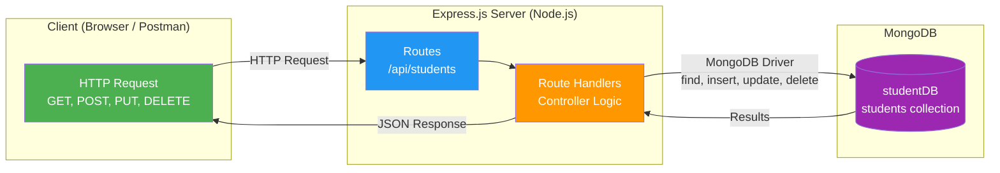

# MongoDB from Node.js

[Back to Node.js & MongoDB Topics](./)

---

## Table of Contents

- [MongoDB Node.js Driver](#mongodb-nodejs-driver)
- [Setting Up a Project](#setting-up-a-project)
- [Connecting to MongoDB](#connecting-to-mongodb)
- [Database and Collection References](#database-and-collection-references)
- [CRUD Operations from Node.js](#crud-operations-from-nodejs)
  - [Insert Documents](#insert-documents)
  - [Find Documents](#find-documents)
  - [Update Documents](#update-documents)
  - [Delete Documents](#delete-documents)
- [Error Handling](#error-handling)
- [Complete CRUD Script](#complete-crud-script)
- [Building a REST API with Express.js + MongoDB](#building-a-rest-api-with-expressjs--mongodb)
  - [What is Express.js?](#what-is-expressjs)
  - [What is a REST API?](#what-is-a-rest-api)
  - [Project Setup](#project-setup)
  - [Complete Student Management API](#complete-student-management-api)
  - [Testing the API](#testing-the-api)
- [Key Takeaways](#key-takeaways)

---

## MongoDB Node.js Driver

To interact with MongoDB from a Node.js application, you need the official **MongoDB Node.js Driver** -- an npm package called `mongodb`.



The driver handles:
- Connecting to the MongoDB server
- Converting JavaScript objects to BSON and back
- Executing queries and returning results
- Connection pooling (reusing connections for performance)

---

## Setting Up a Project

```bash
# Create a new project directory
mkdir student-app
cd student-app

# Initialize the project
npm init -y

# Install the MongoDB driver
npm install mongodb
```

Your `package.json` will now include:

```json
{
  "dependencies": {
    "mongodb": "^6.x.x"
  }
}
```

---

## Connecting to MongoDB

### Basic Connection

```javascript
// connect.js
const { MongoClient } = require('mongodb');

// Connection URI for local MongoDB
const uri = "mongodb://localhost:27017";

// Create a new MongoClient
const client = new MongoClient(uri);

async function main() {
  try {
    // Connect to MongoDB
    await client.connect();
    console.log("Connected to MongoDB successfully!");

    // Ping the database to verify connection
    await client.db("admin").command({ ping: 1 });
    console.log("Ping successful!");

  } catch (err) {
    console.error("Connection error:", err.message);
  } finally {
    // Close the connection
    await client.close();
    console.log("Connection closed.");
  }
}

main();
```

**Run it:**

```bash
node connect.js
```

**Output:**
```
Connected to MongoDB successfully!
Ping successful!
Connection closed.
```

### Understanding the Connection URI

```
mongodb://localhost:27017
   |          |       |
   |          |       └── Port number (default: 27017)
   |          └── Hostname (localhost = your machine)
   └── Protocol
```

---

## Database and Collection References

Once connected, you get references to databases and collections. No need to create them beforehand -- MongoDB creates them when you first insert data.

```javascript
const { MongoClient } = require('mongodb');
const client = new MongoClient("mongodb://localhost:27017");

async function main() {
  try {
    await client.connect();

    // Get a reference to the database
    const db = client.db("studentDB");

    // Get a reference to a collection
    const students = db.collection("students");

    // Now you can use 'students' for CRUD operations
    const count = await students.countDocuments();
    console.log(`Number of students: ${count}`);

  } finally {
    await client.close();
  }
}

main();
```

---

## CRUD Operations from Node.js

### Insert Documents

#### insertOne

```javascript
const { MongoClient } = require('mongodb');
const client = new MongoClient("mongodb://localhost:27017");

async function insertStudent() {
  try {
    await client.connect();
    const db = client.db("studentDB");
    const students = db.collection("students");

    const result = await students.insertOne({
      name: "Ravi Kumar",
      rollNumber: "21B01A1201",
      department: "IT",
      email: "ravi@example.com"
    });

    console.log(`Inserted document with _id: ${result.insertedId}`);

  } finally {
    await client.close();
  }
}

insertStudent();
```

#### insertMany

```javascript
async function insertMultipleStudents() {
  try {
    await client.connect();
    const db = client.db("studentDB");
    const students = db.collection("students");

    const result = await students.insertMany([
      { name: "Priya Sharma", rollNumber: "21B01A1202", department: "CSE", email: "priya@example.com" },
      { name: "Amit Reddy", rollNumber: "21B01A1203", department: "IT", email: "amit@example.com" },
      { name: "Sneha Patel", rollNumber: "21B01A1204", department: "ECE", email: "sneha@example.com" },
      { name: "Karthik Rao", rollNumber: "21B01A1205", department: "CSE", email: "karthik@example.com" }
    ]);

    console.log(`Inserted ${result.insertedCount} documents`);

  } finally {
    await client.close();
  }
}

insertMultipleStudents();
```

---

### Find Documents

#### find() -- Get Multiple Documents

```javascript
async function findStudents() {
  try {
    await client.connect();
    const db = client.db("studentDB");
    const students = db.collection("students");

    // Find all students
    const allStudents = await students.find().toArray();
    console.log("All students:", allStudents);

    // Find students in IT department
    const itStudents = await students.find({ department: "IT" }).toArray();
    console.log("IT students:", itStudents);

    // Find with projection (only name and department)
    const names = await students.find(
      {},
      { projection: { name: 1, department: 1, _id: 0 } }
    ).toArray();
    console.log("Names and departments:", names);

    // Find with sorting (by name ascending)
    const sorted = await students.find().sort({ name: 1 }).toArray();
    console.log("Sorted by name:", sorted);

    // Find with limit
    const topTwo = await students.find().limit(2).toArray();
    console.log("First 2 students:", topTwo);

  } finally {
    await client.close();
  }
}

findStudents();
```

> **Important:** In Node.js, `find()` returns a **cursor**, not an array. You must call `.toArray()` to get the actual documents as a JavaScript array. In `mongosh`, this conversion happens automatically.

#### findOne() -- Get a Single Document

```javascript
async function findOneStudent() {
  try {
    await client.connect();
    const db = client.db("studentDB");
    const students = db.collection("students");

    const student = await students.findOne({ rollNumber: "21B01A1201" });

    if (student) {
      console.log(`Found: ${student.name} (${student.department})`);
    } else {
      console.log("Student not found");
    }

  } finally {
    await client.close();
  }
}

findOneStudent();
```

---

### Update Documents

#### updateOne

```javascript
async function updateStudent() {
  try {
    await client.connect();
    const db = client.db("studentDB");
    const students = db.collection("students");

    const result = await students.updateOne(
      { rollNumber: "21B01A1201" },          // filter
      { $set: { cgpa: 8.5, semester: 4 } }   // update
    );

    console.log(`Matched: ${result.matchedCount}, Modified: ${result.modifiedCount}`);

  } finally {
    await client.close();
  }
}

updateStudent();
```

#### updateMany

```javascript
async function updateAllStudents() {
  try {
    await client.connect();
    const db = client.db("studentDB");
    const students = db.collection("students");

    const result = await students.updateMany(
      {},                                     // filter: all documents
      { $set: { semester: 4, year: 2024 } }   // update
    );

    console.log(`Matched: ${result.matchedCount}, Modified: ${result.modifiedCount}`);

  } finally {
    await client.close();
  }
}

updateAllStudents();
```

---

### Delete Documents

#### deleteOne

```javascript
async function deleteStudent() {
  try {
    await client.connect();
    const db = client.db("studentDB");
    const students = db.collection("students");

    const result = await students.deleteOne({ rollNumber: "21B01A1205" });
    console.log(`Deleted ${result.deletedCount} document(s)`);

  } finally {
    await client.close();
  }
}

deleteStudent();
```

#### deleteMany

```javascript
async function deleteByDepartment() {
  try {
    await client.connect();
    const db = client.db("studentDB");
    const students = db.collection("students");

    const result = await students.deleteMany({ department: "ECE" });
    console.log(`Deleted ${result.deletedCount} document(s)`);

  } finally {
    await client.close();
  }
}

deleteByDepartment();
```

---

## Error Handling

Always wrap MongoDB operations in `try/catch/finally` blocks:

```javascript
const { MongoClient } = require('mongodb');

async function safeOperation() {
  const client = new MongoClient("mongodb://localhost:27017");

  try {
    await client.connect();
    const db = client.db("studentDB");
    const students = db.collection("students");

    // This might fail (e.g., duplicate key on unique index)
    const result = await students.insertOne({
      name: "Ravi Kumar",
      rollNumber: "21B01A1201",
      department: "IT",
      email: "ravi@example.com"
    });

    console.log("Inserted:", result.insertedId);

  } catch (err) {
    if (err.code === 11000) {
      // Duplicate key error
      console.error("Duplicate entry! A student with this data already exists.");
    } else {
      console.error("Database error:", err.message);
    }
  } finally {
    // Always close the connection, whether success or failure
    await client.close();
  }
}

safeOperation();
```

**Common error codes:**

| Code | Description |
|------|-------------|
| `11000` | Duplicate key error (unique index violation) |
| `ECONNREFUSED` | MongoDB server is not running |
| `ETIMEDOUT` | Connection timeout |

---

## Complete CRUD Script

Here is a complete, runnable script that demonstrates all CRUD operations:

```javascript
// crud-demo.js
const { MongoClient } = require('mongodb');

const uri = "mongodb://localhost:27017";
const client = new MongoClient(uri);

async function main() {
  try {
    await client.connect();
    console.log("Connected to MongoDB\n");

    const db = client.db("studentDB");
    const students = db.collection("students");

    // ---- Clean up (start fresh) ----
    await students.deleteMany({});
    console.log("Collection cleared.\n");

    // ---- CREATE ----
    console.log("=== INSERT ===");
    const insertResult = await students.insertMany([
      { name: "Ravi Kumar", rollNumber: "21B01A1201", department: "IT", email: "ravi@example.com", cgpa: 8.5 },
      { name: "Priya Sharma", rollNumber: "21B01A1202", department: "CSE", email: "priya@example.com", cgpa: 9.1 },
      { name: "Amit Reddy", rollNumber: "21B01A1203", department: "IT", email: "amit@example.com", cgpa: 7.8 },
      { name: "Sneha Patel", rollNumber: "21B01A1204", department: "ECE", email: "sneha@example.com", cgpa: 8.9 },
      { name: "Karthik Rao", rollNumber: "21B01A1205", department: "CSE", email: "karthik@example.com", cgpa: 7.5 }
    ]);
    console.log(`Inserted ${insertResult.insertedCount} students\n`);

    // ---- READ ----
    console.log("=== FIND ALL ===");
    const allStudents = await students.find({}, { projection: { name: 1, department: 1, cgpa: 1, _id: 0 } }).toArray();
    console.table(allStudents);

    console.log("=== FIND IT STUDENTS ===");
    const itStudents = await students.find({ department: "IT" }).toArray();
    itStudents.forEach(s => console.log(`  ${s.name} (${s.rollNumber})`));
    console.log();

    console.log("=== FIND ONE ===");
    const oneStudent = await students.findOne({ rollNumber: "21B01A1201" });
    console.log(`  Found: ${oneStudent.name}\n`);

    // ---- UPDATE ----
    console.log("=== UPDATE ONE ===");
    const updateResult = await students.updateOne(
      { rollNumber: "21B01A1201" },
      { $set: { cgpa: 8.7 } }
    );
    console.log(`  Modified ${updateResult.modifiedCount} document(s)\n`);

    console.log("=== UPDATE MANY ===");
    const updateManyResult = await students.updateMany(
      {},
      { $set: { semester: 4 } }
    );
    console.log(`  Modified ${updateManyResult.modifiedCount} document(s)\n`);

    // ---- DELETE ----
    console.log("=== DELETE ONE ===");
    const deleteResult = await students.deleteOne({ rollNumber: "21B01A1205" });
    console.log(`  Deleted ${deleteResult.deletedCount} document(s)\n`);

    // ---- VERIFY ----
    console.log("=== FINAL STATE ===");
    const finalStudents = await students.find({}, { projection: { name: 1, department: 1, cgpa: 1, semester: 1, _id: 0 } }).toArray();
    console.table(finalStudents);

  } catch (err) {
    console.error("Error:", err.message);
  } finally {
    await client.close();
    console.log("\nConnection closed.");
  }
}

main();
```

---

## Building a REST API with Express.js + MongoDB

### What is Express.js?

**Express.js** is a minimal, fast web framework for Node.js. It simplifies building web servers and APIs compared to using the raw `http` module.

```bash
npm install express
```

### What is a REST API?

A **REST API** (Representational State Transfer) uses HTTP methods to perform operations on resources. Each resource (like a student) has a URL endpoint.

| HTTP Method | URL | Operation | Description |
|-------------|-----|-----------|-------------|
| `GET` | `/api/students` | Read all | Get all students |
| `GET` | `/api/students/:id` | Read one | Get a specific student |
| `POST` | `/api/students` | Create | Add a new student |
| `PUT` | `/api/students/:id` | Update | Update a student |
| `DELETE` | `/api/students/:id` | Delete | Remove a student |



### Project Setup

```bash
mkdir student-api
cd student-api
npm init -y
npm install express mongodb
```

### Complete Student Management API

```javascript
// server.js
const express = require('express');
const { MongoClient, ObjectId } = require('mongodb');

const app = express();
const PORT = 3000;

// Middleware: parse JSON request bodies
app.use(express.json());

// MongoDB connection
const uri = "mongodb://localhost:27017";
const client = new MongoClient(uri);
let db, students;

// Connect to MongoDB when server starts
async function connectDB() {
  try {
    await client.connect();
    db = client.db("studentDB");
    students = db.collection("students");
    console.log("Connected to MongoDB");
  } catch (err) {
    console.error("Failed to connect to MongoDB:", err.message);
    process.exit(1);
  }
}

// ============================================
// ROUTES
// ============================================

// GET /api/students -- Get all students
app.get('/api/students', async (req, res) => {
  try {
    const allStudents = await students.find().toArray();
    res.json(allStudents);
  } catch (err) {
    res.status(500).json({ error: err.message });
  }
});

// GET /api/students/:id -- Get a student by ID
app.get('/api/students/:id', async (req, res) => {
  try {
    const id = req.params.id;

    // Validate ObjectId format
    if (!ObjectId.isValid(id)) {
      return res.status(400).json({ error: "Invalid ID format" });
    }

    const student = await students.findOne({ _id: new ObjectId(id) });

    if (!student) {
      return res.status(404).json({ error: "Student not found" });
    }

    res.json(student);
  } catch (err) {
    res.status(500).json({ error: err.message });
  }
});

// POST /api/students -- Create a new student
app.post('/api/students', async (req, res) => {
  try {
    const { name, rollNumber, department, email } = req.body;

    // Basic validation
    if (!name || !rollNumber || !department || !email) {
      return res.status(400).json({
        error: "All fields are required: name, rollNumber, department, email"
      });
    }

    const newStudent = { name, rollNumber, department, email };
    const result = await students.insertOne(newStudent);

    res.status(201).json({
      message: "Student created successfully",
      insertedId: result.insertedId
    });
  } catch (err) {
    if (err.code === 11000) {
      res.status(409).json({ error: "Student with this data already exists" });
    } else {
      res.status(500).json({ error: err.message });
    }
  }
});

// PUT /api/students/:id -- Update a student
app.put('/api/students/:id', async (req, res) => {
  try {
    const id = req.params.id;

    if (!ObjectId.isValid(id)) {
      return res.status(400).json({ error: "Invalid ID format" });
    }

    const updateData = req.body;

    // Remove _id from update data if present (cannot update _id)
    delete updateData._id;

    const result = await students.updateOne(
      { _id: new ObjectId(id) },
      { $set: updateData }
    );

    if (result.matchedCount === 0) {
      return res.status(404).json({ error: "Student not found" });
    }

    res.json({
      message: "Student updated successfully",
      modifiedCount: result.modifiedCount
    });
  } catch (err) {
    res.status(500).json({ error: err.message });
  }
});

// DELETE /api/students/:id -- Delete a student
app.delete('/api/students/:id', async (req, res) => {
  try {
    const id = req.params.id;

    if (!ObjectId.isValid(id)) {
      return res.status(400).json({ error: "Invalid ID format" });
    }

    const result = await students.deleteOne({ _id: new ObjectId(id) });

    if (result.deletedCount === 0) {
      return res.status(404).json({ error: "Student not found" });
    }

    res.json({ message: "Student deleted successfully" });
  } catch (err) {
    res.status(500).json({ error: err.message });
  }
});

// GET /api/students/department/:dept -- Get students by department
app.get('/api/students/department/:dept', async (req, res) => {
  try {
    const dept = req.params.dept.toUpperCase();
    const deptStudents = await students.find({ department: dept }).toArray();
    res.json(deptStudents);
  } catch (err) {
    res.status(500).json({ error: err.message });
  }
});

// ============================================
// START SERVER
// ============================================
connectDB().then(() => {
  app.listen(PORT, () => {
    console.log(`Server running at http://localhost:${PORT}`);
    console.log(`API endpoints:`);
    console.log(`  GET    http://localhost:${PORT}/api/students`);
    console.log(`  GET    http://localhost:${PORT}/api/students/:id`);
    console.log(`  POST   http://localhost:${PORT}/api/students`);
    console.log(`  PUT    http://localhost:${PORT}/api/students/:id`);
    console.log(`  DELETE http://localhost:${PORT}/api/students/:id`);
  });
});

// Graceful shutdown
process.on('SIGINT', async () => {
  console.log("\nShutting down...");
  await client.close();
  process.exit(0);
});
```

### Testing the API

Start the server:

```bash
node server.js
```

You can test the API using **curl** (command line), **Postman**, or a browser (for GET requests).

#### Using curl:

**Create a student (POST):**

```bash
curl -X POST http://localhost:3000/api/students \
  -H "Content-Type: application/json" \
  -d '{
    "name": "Ravi Kumar",
    "rollNumber": "21B01A1201",
    "department": "IT",
    "email": "ravi@example.com"
  }'
```

**Response:**
```json
{
  "message": "Student created successfully",
  "insertedId": "65a1b2c3d4e5f6a7b8c9d0e1"
}
```

**Get all students (GET):**

```bash
curl http://localhost:3000/api/students
```

**Response:**
```json
[
  {
    "_id": "65a1b2c3d4e5f6a7b8c9d0e1",
    "name": "Ravi Kumar",
    "rollNumber": "21B01A1201",
    "department": "IT",
    "email": "ravi@example.com"
  }
]
```

**Get a student by ID (GET):**

```bash
curl http://localhost:3000/api/students/65a1b2c3d4e5f6a7b8c9d0e1
```

**Update a student (PUT):**

```bash
curl -X PUT http://localhost:3000/api/students/65a1b2c3d4e5f6a7b8c9d0e1 \
  -H "Content-Type: application/json" \
  -d '{
    "cgpa": 8.5,
    "semester": 4
  }'
```

**Response:**
```json
{
  "message": "Student updated successfully",
  "modifiedCount": 1
}
```

**Delete a student (DELETE):**

```bash
curl -X DELETE http://localhost:3000/api/students/65a1b2c3d4e5f6a7b8c9d0e1
```

**Response:**
```json
{
  "message": "Student deleted successfully"
}
```

#### Request-Response Flow

Here is what happens when you make a `GET /api/students` request:

```
1. Client sends:  GET http://localhost:3000/api/students
2. Express.js receives the request
3. Matches route:  app.get('/api/students', handler)
4. Handler executes:  await students.find().toArray()
5. MongoDB driver sends query to MongoDB server (port 27017)
6. MongoDB returns matching documents
7. Driver converts BSON to JavaScript objects
8. Express.js sends JSON response to client
```

---

## Key Takeaways

1. The **mongodb** npm package is the official driver for connecting Node.js to MongoDB.
2. Use `MongoClient` to establish a connection to `mongodb://localhost:27017`.
3. Get database and collection references using `client.db("dbName")` and `db.collection("collectionName")`.
4. All MongoDB operations in Node.js return **Promises**, so use `async/await`.
5. `find()` in Node.js returns a **cursor** -- call `.toArray()` to get an array of documents.
6. Always wrap database operations in **try/catch/finally** and close the connection in `finally`.
7. **Express.js** is a web framework that simplifies building HTTP servers and REST APIs.
8. A REST API maps HTTP methods (GET, POST, PUT, DELETE) to CRUD operations on resources.
9. Use `express.json()` middleware to parse JSON request bodies.
10. Use `ObjectId` from the mongodb package to work with MongoDB's `_id` field in queries.

---

**Previous:** [Introduction to MongoDB](./03-introduction-mongodb.md)
