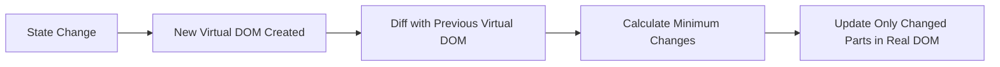
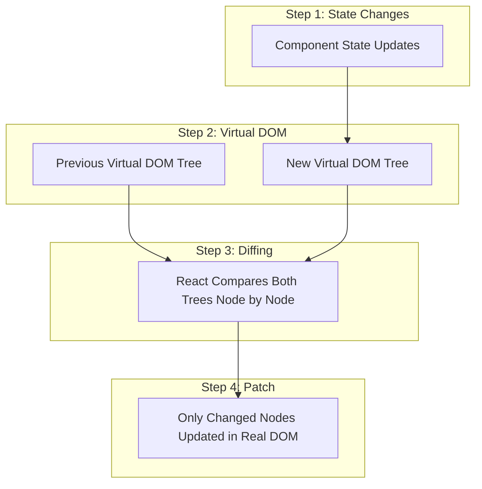
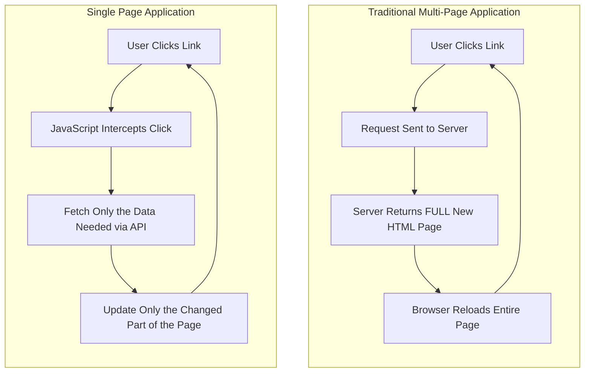

# Unit IV - Introduction to React

[Back to React Topics](./)

---

## Table of Contents

- [What is React?](#what-is-react)
- [Why React?](#why-react)
- [React vs Traditional DOM Manipulation](#react-vs-traditional-dom-manipulation)
- [Single Page Applications (SPA)](#single-page-applications-spa)
- [React Ecosystem Overview](#react-ecosystem-overview)
- [Adding React to a Website (CDN Approach)](#adding-react-to-a-website-cdn-approach)
- [Creating a New React App with Vite](#creating-a-new-react-app-with-vite)
- [Key Takeaways](#key-takeaways)

---

## What is React?

React is an open-source **JavaScript library** for building user interfaces. It was created by **Jordan Walke** at Facebook (now Meta) and was first released in **2013**. React is maintained by Meta and a large community of developers.

Key facts about React:

- It is a **library**, not a framework. It focuses on the **view layer** (UI) of an application.
- React lets you build UIs from small, isolated pieces of code called **components**.
- The current stable version is **React 18.3.x** (as of 2024-2025).
- React can be used for web apps, mobile apps (React Native), and even desktop apps.

> **Library vs Framework:** A library gives you functions you call when you need them. A framework calls your code and controls the flow. React is a library -- you decide when and how to use it.

---

## Why React?

React became the most popular UI library for several important reasons:

### 1. Component-Based Architecture

React lets you split the UI into independent, reusable pieces called **components**. Each component manages its own logic and rendering. You can compose small components into larger ones to build complex UIs.

```jsx
// A simple component
function Greeting() {
  return <h1>Hello, Student!</h1>;
}

// Composing components
function App() {
  return (
    <div>
      <Greeting />
      <Greeting />
    </div>
  );
}
```

### 2. Virtual DOM

React uses a **Virtual DOM** -- a lightweight JavaScript copy of the real DOM. When data changes, React first updates the Virtual DOM, compares it with the previous version (a process called **reconciliation** or **diffing**), and then updates only the parts of the real DOM that actually changed.

This is much faster than directly manipulating the real DOM for every change.



#### Virtual DOM Reconciliation Process



### 3. Declarative UI

React is **declarative** -- you describe **what** the UI should look like for a given state, and React figures out **how** to update the DOM to match. This is the opposite of **imperative** programming where you manually tell the browser each step.

```jsx
// Declarative (React) -- describe WHAT to show
function Counter({ count }) {
  return <p>Count: {count}</p>;
}

// Imperative (Vanilla JS) -- describe HOW to update
// document.getElementById('counter').textContent = 'Count: ' + count;
```

### 4. One-Way Data Flow

Data in React flows in one direction: from **parent to child** via **props**. This makes the application easier to understand and debug because you always know where data comes from.

---

## React vs Traditional DOM Manipulation

| Feature | Traditional (Vanilla JS) | React |
|---|---|---|
| DOM Updates | Manual, imperative | Automatic, declarative |
| Performance | Can be slow with frequent updates | Optimized via Virtual DOM |
| Code Organization | Can get messy in large apps | Component-based, modular |
| State Management | Spread across the DOM | Centralized in component state |
| Reusability | Difficult | Easy with components |

### Example: Updating a Counter

**Traditional JavaScript:**

```jsx
// HTML: <p id="count">0</p> <button id="btn">Click</button>

let count = 0;
const countEl = document.getElementById('count');
const btnEl = document.getElementById('btn');

btnEl.addEventListener('click', () => {
  count++;
  countEl.textContent = count; // manually update DOM
});
```

**React:**

```jsx
import { useState } from 'react';

function Counter() {
  const [count, setCount] = useState(0);

  return (
    <div>
      <p>{count}</p>
      <button onClick={() => setCount(count + 1)}>Click</button>
    </div>
  );
}
```

In the React version, you simply update the **state** and React handles the DOM update for you.

---

## Single Page Applications (SPA)

A **Single Page Application** is a web application that loads a single HTML page and dynamically updates the content as the user interacts with the app. Instead of requesting a new HTML page from the server for every navigation, the SPA rewrites the current page using JavaScript.

### Traditional Multi-Page App vs SPA



### SPA Characteristics

| Feature | Traditional App | SPA |
|---|---|---|
| Page Load | Full reload on every navigation | Single initial load |
| Server Requests | Full HTML pages | JSON data (APIs) |
| User Experience | Flickering, slower transitions | Smooth, app-like feel |
| URL Handling | Server-side routing | Client-side routing |
| Examples | Wikipedia, government sites | Gmail, Twitter, Netflix |

React is commonly used to build SPAs, though it can also be used for individual components on traditional pages.

---

## React Ecosystem Overview

React itself is just the UI library. In real projects, you use it alongside other tools:

| Tool/Library | Purpose |
|---|---|
| **Vite** | Build tool and development server (fast!) |
| **React Router** | Client-side routing for SPAs |
| **Axios / Fetch API** | Making HTTP requests to APIs |
| **Redux / Zustand** | Advanced state management |
| **Tailwind CSS / CSS Modules** | Styling components |
| **React Hook Form** | Form handling |
| **Vitest / Jest** | Testing |
| **TypeScript** | Static type checking (optional but popular) |

> For this course, we will primarily use **Vite** for project setup and **React Router** for navigation.

---

## Adding React to a Website (CDN Approach)

You can add React to an existing HTML page using CDN links. This is useful for learning or adding React to a small part of a page. **This approach is NOT recommended for production apps.**

```html
<!DOCTYPE html>
<html lang="en">
<head>
  <meta charset="UTF-8" />
  <title>React via CDN</title>
</head>
<body>

  <div id="root"></div>

  <!-- React CDN Links -->
  <script crossorigin src="https://unpkg.com/react@18/umd/react.development.js"></script>
  <script crossorigin src="https://unpkg.com/react-dom@18/umd/react-dom.development.js"></script>

  <!-- Babel for JSX support in the browser -->
  <script src="https://unpkg.com/@babel/standalone/babel.min.js"></script>

  <script type="text/babel">
    function App() {
      return <h1>Hello from React via CDN!</h1>;
    }

    const root = ReactDOM.createRoot(document.getElementById('root'));
    root.render(<App />);
  </script>

</body>
</html>
```

**Limitations of the CDN approach:**
- Babel compilation in the browser is slow
- No module system (cannot use `import`/`export`)
- No hot reload during development
- Not suitable for large applications

---

## Creating a New React App with Vite

**Vite** (French word for "fast", pronounced "veet") is a modern build tool that provides an extremely fast development experience. It is the recommended way to start a new React project.

> **Note:** Create React App (CRA) is deprecated and should not be used for new projects.

### Prerequisites

- **Node.js 20 LTS** installed (check with `node --version`)
- **npm** or **yarn** package manager

### Step-by-Step Setup

**1. Create a new Vite project:**

```bash
# Using yarn (recommended)
yarn create vite my-react-app --template react

# OR using npm
npm create vite@latest my-react-app -- --template react
```

**2. Navigate to the project folder:**

```bash
cd my-react-app
```

**3. Install dependencies:**

```bash
# Using yarn
yarn

# OR using npm
npm install
```

**4. Start the development server:**

```bash
# Using yarn
yarn dev

# OR using npm
npm run dev
```

The app will start at `http://localhost:5173/` by default.

### Project Structure

After creating the project, you will see this structure:

```
my-react-app/
  ├── node_modules/       # Installed packages (do not edit)
  ├── public/             # Static files (favicon, etc.)
  ├── src/                # Your source code goes here
  │   ├── App.css         # Styles for App component
  │   ├── App.jsx         # Main App component
  │   ├── index.css       # Global styles
  │   └── main.jsx        # Entry point - renders App into DOM
  ├── index.html          # Single HTML page
  ├── package.json        # Project metadata and dependencies
  └── vite.config.js      # Vite configuration
```

### Key Files Explained

**`index.html`** -- The single HTML page. It has a `<div id="root">` where React mounts the app:

```html
<!DOCTYPE html>
<html lang="en">
  <head>
    <meta charset="UTF-8" />
    <title>Vite + React</title>
  </head>
  <body>
    <div id="root"></div>
    <script type="module" src="/src/main.jsx"></script>
  </body>
</html>
```

**`src/main.jsx`** -- The entry point that renders the root component:

```jsx
import React from 'react';
import ReactDOM from 'react-dom/client';
import App from './App.jsx';
import './index.css';

ReactDOM.createRoot(document.getElementById('root')).render(
  <React.StrictMode>
    <App />
  </React.StrictMode>
);
```

**`src/App.jsx`** -- Your main component (you will modify this):

```jsx
import './App.css';

function App() {
  return (
    <div>
      <h1>Hello, React!</h1>
    </div>
  );
}

export default App;
```

> **React.StrictMode** is a development-only wrapper that helps find common bugs. It does not render any visible UI and does not affect production builds. It causes components to render twice in development to help detect side effects.

---

## Key Takeaways

1. **React** is a JavaScript library for building user interfaces using **components**.
2. React uses a **Virtual DOM** to efficiently update only the parts of the page that change.
3. React is **declarative** -- you describe what the UI should look like, not how to update it step by step.
4. A **Single Page Application (SPA)** loads once and dynamically updates content without full page reloads.
5. **Vite** is the modern, recommended tool for creating new React projects (not Create React App).
6. React can also be added to existing pages via **CDN**, though this is only for learning or small use cases.
7. The entry point of a Vite + React app is `main.jsx`, which renders the root component into the `#root` div.

---

[Next: JSX and Rendering -->](./02-jsx-rendering.md)
