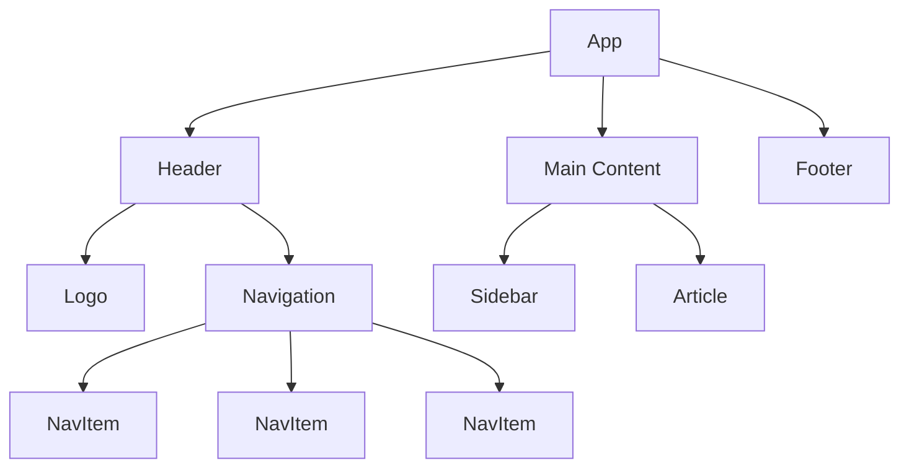
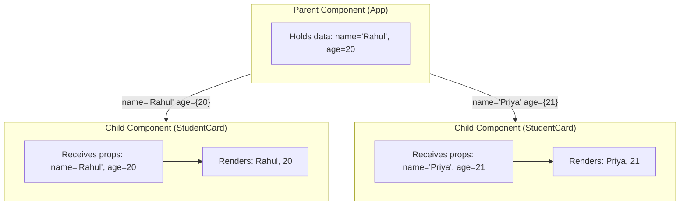
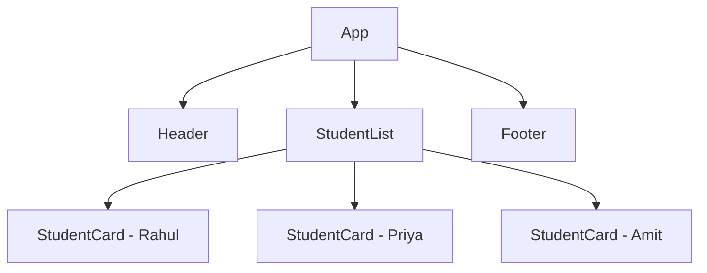

# Unit IV - Components and Props

[Back to React Topics](./)

---

## Table of Contents

- [What are Components?](#what-are-components)
- [Function Components](#function-components)
- [Component Naming Conventions](#component-naming-conventions)
- [Props - Passing Data to Components](#props---passing-data-to-components)
- [Props Destructuring](#props-destructuring)
- [Default Props](#default-props)
- [Children Prop](#children-prop)
- [Component Composition](#component-composition)
- [Reusable Components](#reusable-components)
- [Key Takeaways](#key-takeaways)

---

## What are Components?

Components are the **building blocks** of any React application. A component is a JavaScript function that returns JSX (UI description). Think of components like LEGO bricks -- you build small pieces and combine them to create complex structures.



Every React application has a **component tree** starting from a root component (usually called `App`). Each component can contain other components as children.

---

## Function Components

In modern React (React 18), we write components as **JavaScript functions**. These are called **function components**.

### Basic Function Component

```jsx
function Welcome() {
  return <h1>Welcome to React!</h1>;
}
```

### Arrow Function Component

```jsx
const Welcome = () => {
  return <h1>Welcome to React!</h1>;
};
```

Both styles work the same way. Use whichever you prefer, but be consistent.

### Using a Component

To use a component, write it as a **JSX tag**:

```jsx
function App() {
  return (
    <div>
      <Welcome />
      <Welcome />
      <Welcome />
    </div>
  );
}
```

This renders "Welcome to React!" three times.

> **A Note on Class Components:** Older React code used `class` syntax to write components. Class components are still supported but are considered legacy. **All new React code should use function components with hooks.** You may encounter class components in older codebases, but you do not need to learn them for this course.

---

## Component Naming Conventions

React has specific rules and conventions for naming components:

| Rule | Example | Explanation |
|---|---|---|
| Must start with uppercase | `StudentCard`, not `studentCard` | Lowercase names are treated as HTML elements |
| Use PascalCase | `StudentCard`, not `student_card` | Convention in the React community |
| Use descriptive names | `StudentList`, not `List1` | Makes code readable |
| One component per file | `StudentCard.jsx` | File name matches component name |

```jsx
// WRONG - lowercase, React treats it as HTML tag
function studentCard() {
  return <div>Student</div>;
}

// CORRECT - PascalCase
function StudentCard() {
  return <div>Student</div>;
}
```

### File Organization

```
src/
  components/
    Header.jsx
    Footer.jsx
    StudentCard.jsx
    StudentList.jsx
  App.jsx
  main.jsx
```

---

## Props - Passing Data to Components

**Props** (short for "properties") are how you pass data from a **parent component** to a **child component**. Props make components dynamic and reusable.

### Data Flow via Props



### Passing Props

Props are passed as attributes on the JSX tag:

```jsx
// Parent Component
function App() {
  return (
    <div>
      <StudentCard name="Rahul" age={20} branch="IT" />
      <StudentCard name="Priya" age={21} branch="CSE" />
    </div>
  );
}
```

### Receiving Props

The component receives props as a **single object parameter**:

```jsx
// Child Component
function StudentCard(props) {
  return (
    <div>
      <h2>{props.name}</h2>
      <p>Age: {props.age}</p>
      <p>Branch: {props.branch}</p>
    </div>
  );
}
```

### Types of Props

You can pass any JavaScript value as a prop:

```jsx
<MyComponent
  name="Rahul"             // String
  age={20}                 // Number
  isActive={true}          // Boolean
  subjects={["React", "Node"]}  // Array
  address={{ city: "Hyderabad", state: "Telangana" }}  // Object
  onClickHandler={handleClick}  // Function
/>
```

> **Important: Props are READ-ONLY.** A component must never modify the props it receives. Props flow one way -- from parent to child. If a child needs to send data back to the parent, it uses callback functions (covered in later topics).

---

## Props Destructuring

Instead of writing `props.name`, `props.age` everywhere, you can **destructure** props directly in the function parameter:

### Without Destructuring

```jsx
function StudentCard(props) {
  return (
    <div>
      <h2>{props.name}</h2>
      <p>Age: {props.age}</p>
      <p>Branch: {props.branch}</p>
    </div>
  );
}
```

### With Destructuring (Recommended)

```jsx
function StudentCard({ name, age, branch }) {
  return (
    <div>
      <h2>{name}</h2>
      <p>Age: {age}</p>
      <p>Branch: {branch}</p>
    </div>
  );
}
```

Destructuring is **cleaner** and makes it immediately obvious what props a component expects.

---

## Default Props

You can provide **default values** for props in case the parent does not pass them.

### Using Default Parameters (Recommended)

```jsx
function StudentCard({ name = "Unknown", age = 0, branch = "N/A" }) {
  return (
    <div>
      <h2>{name}</h2>
      <p>Age: {age}</p>
      <p>Branch: {branch}</p>
    </div>
  );
}

// Usage
<StudentCard name="Rahul" />
// age will be 0, branch will be "N/A"
```

### Practical Example

```jsx
function Button({ text = "Click Me", color = "blue", size = "medium" }) {
  const styles = {
    backgroundColor: color,
    padding: size === "small" ? "4px 8px" : size === "large" ? "12px 24px" : "8px 16px",
    color: "white",
    border: "none",
    borderRadius: "4px",
    cursor: "pointer",
  };

  return <button style={styles}>{text}</button>;
}

// Usage
function App() {
  return (
    <div>
      <Button />                           {/* Uses all defaults */}
      <Button text="Submit" color="green" /> {/* Custom text and color */}
      <Button text="Delete" color="red" size="small" />
    </div>
  );
}
```

---

## Children Prop

The **`children`** prop is a special prop that contains whatever you place **between** the opening and closing tags of a component.

```jsx
function Card({ children }) {
  return (
    <div style={{
      border: '1px solid #ccc',
      borderRadius: '8px',
      padding: '16px',
      margin: '8px'
    }}>
      {children}
    </div>
  );
}

// Usage
function App() {
  return (
    <div>
      <Card>
        <h2>Student Profile</h2>
        <p>Name: Rahul</p>
      </Card>

      <Card>
        <h2>Course Info</h2>
        <p>Subject: Full Stack Development</p>
        <p>Semester: IV</p>
      </Card>
    </div>
  );
}
```

The `Card` component does not know what will be inside it ahead of time. It simply renders whatever `children` it receives inside a styled container.

### Children with Other Props

```jsx
function Card({ title, children }) {
  return (
    <div style={{ border: '1px solid #ccc', padding: '16px', borderRadius: '8px' }}>
      <h2 style={{ borderBottom: '1px solid #eee', paddingBottom: '8px' }}>{title}</h2>
      <div>{children}</div>
    </div>
  );
}

// Usage
<Card title="Student Info">
  <p>Name: Rahul</p>
  <p>Branch: IT</p>
</Card>
```

---

## Component Composition

**Composition** is the pattern of building complex UIs by combining simple components. This is a core React principle.

### Building a Page from Components

```jsx
function Header() {
  return (
    <header style={{ backgroundColor: '#333', color: '#fff', padding: '16px' }}>
      <h1>Vasavi College of Engineering</h1>
      <nav>
        <a href="#home" style={{ color: '#fff', marginRight: '16px' }}>Home</a>
        <a href="#courses" style={{ color: '#fff', marginRight: '16px' }}>Courses</a>
        <a href="#contact" style={{ color: '#fff' }}>Contact</a>
      </nav>
    </header>
  );
}

function StudentCard({ name, rollNo, branch }) {
  return (
    <div style={{ border: '1px solid #ddd', padding: '12px', margin: '8px', borderRadius: '8px' }}>
      <h3>{name}</h3>
      <p>Roll No: {rollNo}</p>
      <p>Branch: {branch}</p>
    </div>
  );
}

function StudentList() {
  return (
    <main style={{ padding: '16px' }}>
      <h2>Student Directory</h2>
      <StudentCard name="Rahul Kumar" rollNo="21071A1234" branch="IT" />
      <StudentCard name="Priya Sharma" rollNo="21071A1235" branch="IT" />
      <StudentCard name="Amit Reddy" rollNo="21071A1236" branch="IT" />
    </main>
  );
}

function Footer() {
  return (
    <footer style={{ backgroundColor: '#333', color: '#fff', padding: '16px', textAlign: 'center' }}>
      <p>Vasavi College of Engineering, Hyderabad</p>
    </footer>
  );
}

// Composing everything together
function App() {
  return (
    <div>
      <Header />
      <StudentList />
      <Footer />
    </div>
  );
}

export default App;
```

### Component Hierarchy for the Above Example



---

## Reusable Components

The real power of components comes from **reusability**. A well-designed component can be used in many places with different data.

### Example: A Reusable Alert Component

```jsx
function Alert({ type = "info", title, message }) {
  const colors = {
    info: { bg: '#d1ecf1', border: '#bee5eb', text: '#0c5460' },
    success: { bg: '#d4edda', border: '#c3e6cb', text: '#155724' },
    warning: { bg: '#fff3cd', border: '#ffeaa7', text: '#856404' },
    error: { bg: '#f8d7da', border: '#f5c6cb', text: '#721c24' },
  };

  const color = colors[type] || colors.info;

  return (
    <div style={{
      backgroundColor: color.bg,
      border: `1px solid ${color.border}`,
      color: color.text,
      padding: '12px 16px',
      borderRadius: '4px',
      margin: '8px 0',
    }}>
      {title && <strong>{title}: </strong>}
      {message}
    </div>
  );
}

// Usage - same component, different data
function App() {
  return (
    <div style={{ padding: '20px' }}>
      <Alert type="success" title="Success" message="Your form has been submitted!" />
      <Alert type="error" title="Error" message="Invalid email address." />
      <Alert type="warning" message="Your session will expire in 5 minutes." />
      <Alert type="info" message="Classes resume on Monday." />
    </div>
  );
}
```

### Example: A Reusable Course Card

```jsx
function CourseCard({ courseName, instructor, credits, semester }) {
  return (
    <div style={{
      border: '1px solid #e0e0e0',
      borderRadius: '8px',
      padding: '16px',
      margin: '8px',
      maxWidth: '300px',
      boxShadow: '0 2px 4px rgba(0,0,0,0.1)',
    }}>
      <h3 style={{ margin: '0 0 8px 0', color: '#1a73e8' }}>{courseName}</h3>
      <p style={{ margin: '4px 0', color: '#555' }}>
        <strong>Instructor:</strong> {instructor}
      </p>
      <p style={{ margin: '4px 0', color: '#555' }}>
        <strong>Credits:</strong> {credits}
      </p>
      <p style={{ margin: '4px 0', color: '#555' }}>
        <strong>Semester:</strong> {semester}
      </p>
    </div>
  );
}

function App() {
  return (
    <div style={{ padding: '20px' }}>
      <h1>IT Department - Semester IV</h1>
      <div style={{ display: 'flex', flexWrap: 'wrap' }}>
        <CourseCard
          courseName="Full Stack Development"
          instructor="Prof. Kumar"
          credits={4}
          semester="IV"
        />
        <CourseCard
          courseName="Operating Systems"
          instructor="Prof. Reddy"
          credits={3}
          semester="IV"
        />
        <CourseCard
          courseName="Computer Networks"
          instructor="Prof. Sharma"
          credits={3}
          semester="IV"
        />
      </div>
    </div>
  );
}
```

### Tips for Creating Reusable Components

1. **Keep components small** -- each component should do one thing well.
2. **Use props for customization** -- do not hardcode values inside components.
3. **Use default props** -- provide sensible defaults so the component works even with minimal props.
4. **Use `children`** -- for components that wrap other content (like Card, Modal, Layout).
5. **Name props clearly** -- use descriptive names like `userName` instead of `data`.

---

## Key Takeaways

1. **Components** are JavaScript functions that return JSX. They are the building blocks of React apps.
2. Always use **PascalCase** for component names (e.g., `StudentCard`, not `studentCard`).
3. **Props** pass data from parent to child. They are **read-only** and flow in **one direction**.
4. **Destructuring** props in the function parameter is cleaner: `function Card({ title, children })`.
5. **Default props** provide fallback values using default parameters: `{ name = "Unknown" }`.
6. The **`children` prop** lets a component render whatever is placed between its opening and closing tags.
7. **Composition** -- building complex UIs from simple components -- is a core React pattern.
8. Good components are **small, reusable, and customizable via props**.

---

[Next: State and Lifecycle -->](./04-state-lifecycle.md)
