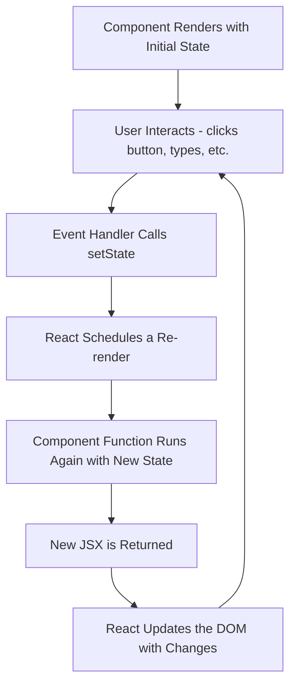
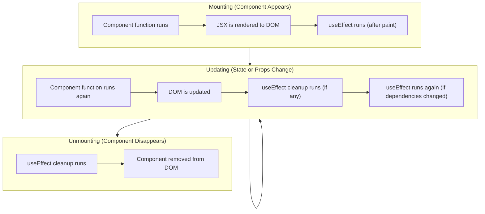

# Unit IV - State and Lifecycle

[Back to React Topics](./)

---

## Table of Contents

- [What is State?](#what-is-state)
- [The useState Hook](#the-usestate-hook)
- [State vs Props](#state-vs-props)
- [Updating State (Immutability)](#updating-state-immutability)
- [The useEffect Hook](#the-useeffect-hook)
- [Cleanup in useEffect](#cleanup-in-useeffect)
- [Dependencies Array](#dependencies-array)
- [Common Patterns](#common-patterns)
- [Key Takeaways](#key-takeaways)

---

## What is State?

**State** is data that a component **owns and manages** internally. When state changes, React **re-renders** the component to reflect the new data in the UI.

Think of state as the component's **memory**. For example:
- A counter remembers its current count
- A form input remembers what the user has typed
- A toggle remembers whether it is on or off

> **Why not just use regular variables?** Regular variables do not trigger a re-render when they change. React does not know about them. State is special because React tracks it and updates the UI when it changes.

```jsx
// WRONG - this will NOT update the UI
function Counter() {
  let count = 0;

  function handleClick() {
    count = count + 1; // count changes, but UI does NOT update
    console.log(count); // logs the new value, but screen still shows 0
  }

  return (
    <div>
      <p>Count: {count}</p>
      <button onClick={handleClick}>Increment</button>
    </div>
  );
}
```

---

## The useState Hook

**`useState`** is a React **hook** that lets you add state to function components. It is the most fundamental hook in React.

> **What is a Hook?** Hooks are special functions that let you "hook into" React features. They all start with the word `use` (e.g., `useState`, `useEffect`). Hooks can only be called at the **top level** of a component -- not inside loops, conditions, or nested functions.

### Syntax

```jsx
const [stateValue, setStateFunction] = useState(initialValue);
```

- **`stateValue`** -- the current value of the state
- **`setStateFunction`** -- a function to update the state (triggers re-render)
- **`initialValue`** -- the starting value of the state

### Counter Example

```jsx
import { useState } from 'react';

function Counter() {
  const [count, setCount] = useState(0);

  function handleIncrement() {
    setCount(count + 1);
  }

  function handleDecrement() {
    setCount(count - 1);
  }

  function handleReset() {
    setCount(0);
  }

  return (
    <div>
      <h2>Count: {count}</h2>
      <button onClick={handleIncrement}>+1</button>
      <button onClick={handleDecrement}>-1</button>
      <button onClick={handleReset}>Reset</button>
    </div>
  );
}

export default Counter;
```

### Multiple State Variables

A component can have multiple `useState` calls:

```jsx
import { useState } from 'react';

function StudentForm() {
  const [name, setName] = useState('');
  const [age, setAge] = useState('');
  const [branch, setBranch] = useState('IT');

  return (
    <div>
      <input
        type="text"
        value={name}
        onChange={(e) => setName(e.target.value)}
        placeholder="Name"
      />
      <input
        type="number"
        value={age}
        onChange={(e) => setAge(e.target.value)}
        placeholder="Age"
      />
      <select value={branch} onChange={(e) => setBranch(e.target.value)}>
        <option value="IT">IT</option>
        <option value="CSE">CSE</option>
        <option value="ECE">ECE</option>
      </select>
      <p>Student: {name}, Age: {age}, Branch: {branch}</p>
    </div>
  );
}
```

### State Update and Re-render Cycle



---

## State vs Props

This is a crucial distinction:

| Feature | State | Props |
|---|---|---|
| **Owned by** | The component itself | Parent component |
| **Mutable?** | Yes (via setState) | No (read-only) |
| **Purpose** | Internal data that can change | Data passed from parent |
| **Triggers re-render?** | Yes, when updated | Yes, when parent re-renders with new props |
| **Declared with** | `useState()` hook | Function parameters |

### Analogy

Think of a student ID card:
- **Props** are like the printed details (name, roll number) -- set by someone else (the college) and you cannot change them.
- **State** is like your current attendance count -- it belongs to you and changes over time.

### Example: Props and State Together

```jsx
import { useState } from 'react';

// Parent passes initial data via props
// Component manages its own toggle state
function StudentCard({ name, rollNo, branch }) {
  const [showDetails, setShowDetails] = useState(false);

  return (
    <div style={{ border: '1px solid #ccc', padding: '12px', margin: '8px', borderRadius: '8px' }}>
      <h3>{name}</h3>
      <button onClick={() => setShowDetails(!showDetails)}>
        {showDetails ? 'Hide Details' : 'Show Details'}
      </button>
      {showDetails && (
        <div>
          <p>Roll No: {rollNo}</p>
          <p>Branch: {branch}</p>
        </div>
      )}
    </div>
  );
}

function App() {
  return (
    <div>
      <StudentCard name="Rahul" rollNo="21071A1234" branch="IT" />
      <StudentCard name="Priya" rollNo="21071A1235" branch="CSE" />
    </div>
  );
}
```

---

## Updating State (Immutability)

React state must be treated as **immutable** -- you should never modify state directly. Always create a **new value** and pass it to the setter function.

### Primitive Values (Numbers, Strings, Booleans)

These are naturally immutable, so just pass a new value:

```jsx
const [count, setCount] = useState(0);
setCount(count + 1);        // New number

const [name, setName] = useState('');
setName('Rahul');            // New string

const [isOpen, setIsOpen] = useState(false);
setIsOpen(true);             // New boolean
```

### Arrays

Never use `push`, `pop`, `splice`, or direct index assignment. Instead, create a new array:

```jsx
const [items, setItems] = useState(['React', 'Node']);

// WRONG - mutating the existing array
items.push('MongoDB');
setItems(items);

// CORRECT - creating a new array
setItems([...items, 'MongoDB']);           // Add item
setItems(items.filter(item => item !== 'Node'));  // Remove item
setItems(items.map(item =>                // Update item
  item === 'React' ? 'React 18' : item
));
```

### Objects

Never modify object properties directly. Create a new object using the spread operator:

```jsx
const [student, setStudent] = useState({
  name: 'Rahul',
  age: 20,
  branch: 'IT',
});

// WRONG - mutating the existing object
student.age = 21;
setStudent(student);

// CORRECT - creating a new object
setStudent({ ...student, age: 21 });
```

### Updater Function

When the new state depends on the previous state, use the **updater function** form:

```jsx
const [count, setCount] = useState(0);

// Simple form - may cause issues with rapid updates
setCount(count + 1);

// Updater function form - always uses the latest state
setCount(prevCount => prevCount + 1);
```

This is important because React **batches** state updates for performance. If you call `setCount(count + 1)` three times in a row, `count` might still be the old value for all three calls. The updater function guarantees you get the latest value.

```jsx
function handleTripleIncrement() {
  // WRONG - all three use the same stale 'count' value
  setCount(count + 1);
  setCount(count + 1);
  setCount(count + 1);
  // Result: count increases by 1, not 3

  // CORRECT - each uses the latest value
  setCount(prev => prev + 1);
  setCount(prev => prev + 1);
  setCount(prev => prev + 1);
  // Result: count increases by 3
}
```

---

## The useEffect Hook

**`useEffect`** lets you perform **side effects** in function components. Side effects are operations that interact with the outside world:

- Fetching data from an API
- Setting up a timer or interval
- Updating the document title
- Adding event listeners
- Writing to localStorage

### Component Lifecycle with Hooks



### Basic Syntax

```jsx
import { useEffect } from 'react';

useEffect(() => {
  // Side effect code here
  // Runs AFTER the component renders
}, [dependencies]);
```

### Example: Update Document Title

```jsx
import { useState, useEffect } from 'react';

function Counter() {
  const [count, setCount] = useState(0);

  useEffect(() => {
    document.title = `Count: ${count}`;
  }, [count]); // Only runs when count changes

  return (
    <div>
      <p>Count: {count}</p>
      <button onClick={() => setCount(count + 1)}>Increment</button>
    </div>
  );
}
```

### Example: Fetching Data

```jsx
import { useState, useEffect } from 'react';

function UserList() {
  const [users, setUsers] = useState([]);
  const [loading, setLoading] = useState(true);
  const [error, setError] = useState(null);

  useEffect(() => {
    fetch('https://jsonplaceholder.typicode.com/users')
      .then(response => {
        if (!response.ok) {
          throw new Error('Failed to fetch users');
        }
        return response.json();
      })
      .then(data => {
        setUsers(data);
        setLoading(false);
      })
      .catch(err => {
        setError(err.message);
        setLoading(false);
      });
  }, []); // Empty array = run only once on mount

  if (loading) return <p>Loading...</p>;
  if (error) return <p>Error: {error}</p>;

  return (
    <ul>
      {users.map(user => (
        <li key={user.id}>{user.name} - {user.email}</li>
      ))}
    </ul>
  );
}
```

---

## Cleanup in useEffect

Some effects need **cleanup** when the component unmounts or before the effect runs again. For example, if you set up a timer, you should clear it when the component is removed.

Return a **cleanup function** from the effect:

```jsx
useEffect(() => {
  // Setup
  const timerId = setInterval(() => {
    console.log('Tick');
  }, 1000);

  // Cleanup - runs when component unmounts
  // or before effect runs again
  return () => {
    clearInterval(timerId);
  };
}, []);
```

### Example: Live Clock

```jsx
import { useState, useEffect } from 'react';

function Clock() {
  const [time, setTime] = useState(new Date());

  useEffect(() => {
    const timerId = setInterval(() => {
      setTime(new Date());
    }, 1000);

    // Cleanup: stop the timer when component unmounts
    return () => clearInterval(timerId);
  }, []); // Run once on mount

  return (
    <div>
      <h2>Current Time</h2>
      <p>{time.toLocaleTimeString()}</p>
    </div>
  );
}
```

### Example: Window Resize Listener

```jsx
import { useState, useEffect } from 'react';

function WindowSize() {
  const [size, setSize] = useState({
    width: window.innerWidth,
    height: window.innerHeight,
  });

  useEffect(() => {
    function handleResize() {
      setSize({
        width: window.innerWidth,
        height: window.innerHeight,
      });
    }

    window.addEventListener('resize', handleResize);

    // Cleanup: remove event listener
    return () => window.removeEventListener('resize', handleResize);
  }, []);

  return (
    <p>Window: {size.width} x {size.height}</p>
  );
}
```

---

## Dependencies Array

The **dependencies array** (second argument to `useEffect`) controls **when** the effect runs:

| Dependencies | When Effect Runs | Use Case |
|---|---|---|
| Not provided | After **every** render | Rarely used (can cause performance issues) |
| `[]` (empty array) | Only on **mount** (once) | Fetch data, set up subscriptions |
| `[a, b]` (with values) | On mount + when **`a` or `b` change** | React to specific state/prop changes |

### No Dependencies (Runs Every Render)

```jsx
useEffect(() => {
  console.log('Runs after EVERY render');
});
// WARNING: this can cause performance issues or infinite loops
```

### Empty Dependencies (Runs Once)

```jsx
useEffect(() => {
  console.log('Runs only ONCE after first render');
  // Good for: API calls, setting up listeners
}, []);
```

### Specific Dependencies

```jsx
const [count, setCount] = useState(0);
const [name, setName] = useState('');

useEffect(() => {
  console.log('Runs when count changes');
  document.title = `Count: ${count}`;
}, [count]);
// Does NOT run when 'name' changes, only when 'count' changes
```

> **Rule:** Include every state variable and prop that is used inside the effect in the dependencies array. Omitting a dependency can lead to stale data bugs.

---

## Common Patterns

### Pattern 1: Toggle

```jsx
import { useState } from 'react';

function ToggleSwitch() {
  const [isOn, setIsOn] = useState(false);

  return (
    <div>
      <p>The switch is {isOn ? 'ON' : 'OFF'}</p>
      <button onClick={() => setIsOn(prev => !prev)}>
        Toggle
      </button>
    </div>
  );
}
```

### Pattern 2: Counter with Step

```jsx
import { useState } from 'react';

function StepCounter() {
  const [count, setCount] = useState(0);
  const [step, setStep] = useState(1);

  return (
    <div>
      <h2>Count: {count}</h2>
      <label>
        Step:
        <input
          type="number"
          value={step}
          onChange={(e) => setStep(Number(e.target.value))}
          style={{ width: '60px', marginLeft: '8px' }}
        />
      </label>
      <div style={{ marginTop: '8px' }}>
        <button onClick={() => setCount(prev => prev + step)}>+{step}</button>
        <button onClick={() => setCount(prev => prev - step)}>-{step}</button>
        <button onClick={() => setCount(0)}>Reset</button>
      </div>
    </div>
  );
}
```

### Pattern 3: Fetching Data with Loading and Error States

```jsx
import { useState, useEffect } from 'react';

function PostList() {
  const [posts, setPosts] = useState([]);
  const [loading, setLoading] = useState(true);
  const [error, setError] = useState(null);

  useEffect(() => {
    async function fetchPosts() {
      try {
        const response = await fetch(
          'https://jsonplaceholder.typicode.com/posts?_limit=10'
        );
        if (!response.ok) {
          throw new Error('Network response was not ok');
        }
        const data = await response.json();
        setPosts(data);
      } catch (err) {
        setError(err.message);
      } finally {
        setLoading(false);
      }
    }

    fetchPosts();
  }, []);

  if (loading) {
    return <p>Loading posts...</p>;
  }

  if (error) {
    return <p style={{ color: 'red' }}>Error: {error}</p>;
  }

  return (
    <div>
      <h2>Posts</h2>
      {posts.map(post => (
        <div key={post.id} style={{ border: '1px solid #ddd', padding: '12px', margin: '8px 0', borderRadius: '4px' }}>
          <h3>{post.title}</h3>
          <p>{post.body}</p>
        </div>
      ))}
    </div>
  );
}
```

> **Note:** The `async` function is defined inside `useEffect` and then called immediately. You cannot make the `useEffect` callback itself async (`useEffect(async () => ...)` is not allowed).

### Pattern 4: Local Storage Persistence

```jsx
import { useState, useEffect } from 'react';

function PersistentCounter() {
  // Initialize state from localStorage (or default to 0)
  const [count, setCount] = useState(() => {
    const saved = localStorage.getItem('count');
    return saved !== null ? Number(saved) : 0;
  });

  // Save to localStorage whenever count changes
  useEffect(() => {
    localStorage.setItem('count', count);
  }, [count]);

  return (
    <div>
      <p>Count: {count} (persisted in localStorage)</p>
      <button onClick={() => setCount(prev => prev + 1)}>Increment</button>
      <button onClick={() => setCount(0)}>Reset</button>
    </div>
  );
}
```

> **Lazy initialization:** Passing a function to `useState` (like `useState(() => ...)`) is called lazy initialization. The function runs only on the first render, not on every re-render. Use it when the initial value is expensive to compute.

---

## Key Takeaways

1. **State** is a component's internal, mutable data. When state changes, the component re-renders.
2. **`useState(initialValue)`** returns `[currentValue, setterFunction]`. Always use the setter to update state.
3. **Props** are read-only data from the parent; **state** is mutable data owned by the component.
4. **Never mutate state directly.** Always create new values -- use spread operator for objects/arrays.
5. Use the **updater function** (`setCount(prev => prev + 1)`) when the new state depends on the previous state.
6. **`useEffect`** handles side effects: data fetching, timers, event listeners, DOM manipulation.
7. The **dependencies array** controls when effects run: empty `[]` for once, `[value]` for when value changes.
8. Always **clean up** effects (timers, listeners) by returning a cleanup function from `useEffect`.

---

[Next: Events and Forms -->](./05-events-forms.md)
