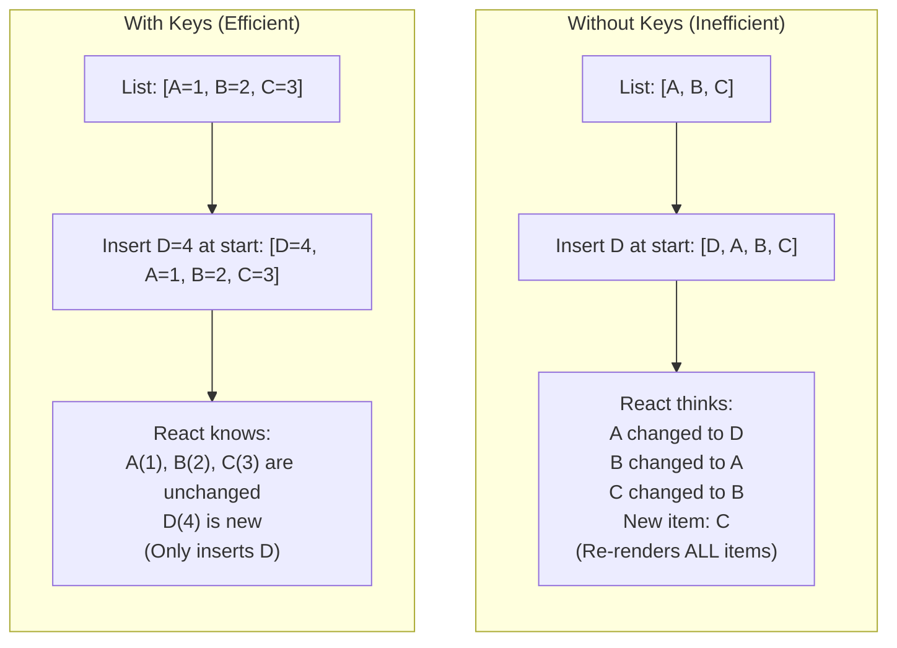

# Unit IV - Lists and Conditional Rendering

[Back to React Topics](./)

---

## Table of Contents

- [Conditional Rendering](#conditional-rendering)
- [Rendering Lists with map()](#rendering-lists-with-map)
- [Keys in Lists](#keys-in-lists)
- [Filtering Lists](#filtering-lists)
- [Showing and Hiding Components](#showing-and-hiding-components)
- [Practical Examples](#practical-examples)
- [Key Takeaways](#key-takeaways)

---

## Conditional Rendering

Conditional rendering means showing different UI based on certain conditions. React lets you use standard JavaScript techniques for this.

### Method 1: if/else (Outside JSX)

Use `if/else` when you need to return completely different JSX based on a condition:

```jsx
function Greeting({ isLoggedIn }) {
  if (isLoggedIn) {
    return <h1>Welcome back!</h1>;
  } else {
    return <h1>Please sign in.</h1>;
  }
}

// Usage
<Greeting isLoggedIn={true} />   // Shows: Welcome back!
<Greeting isLoggedIn={false} />  // Shows: Please sign in.
```

### Method 2: Ternary Operator (Inside JSX)

Use the ternary operator `condition ? ifTrue : ifFalse` for inline conditional rendering:

```jsx
function Greeting({ isLoggedIn }) {
  return (
    <div>
      <h1>{isLoggedIn ? 'Welcome back!' : 'Please sign in.'}</h1>
      <button>{isLoggedIn ? 'Logout' : 'Login'}</button>
    </div>
  );
}
```

The ternary operator works inside JSX because it is an **expression** (not a statement like `if/else`).

### Method 3: Logical AND (&&)

Use `&&` when you want to show something OR show nothing:

```jsx
function Notification({ count }) {
  return (
    <div>
      <h1>Dashboard</h1>
      {count > 0 && <p>You have {count} new notifications!</p>}
    </div>
  );
}

// count = 5 → Shows the notification paragraph
// count = 0 → Shows nothing (the paragraph is not rendered)
```

**How `&&` works:** In JavaScript, `true && expression` evaluates to `expression`, while `false && expression` evaluates to `false`. React does not render `false`, `null`, or `undefined`.

> **Warning with `&&` and numbers:** Be careful with `0 && <Component />`. Zero is falsy, but React **will render** the number `0` on screen. Use an explicit boolean check: `{count > 0 && <Component />}` instead of `{count && <Component />}`.

### Method 4: Early Return

Return `null` to render nothing:

```jsx
function WarningBanner({ show }) {
  if (!show) {
    return null; // Render nothing
  }

  return (
    <div style={{ backgroundColor: '#ff9800', padding: '12px', color: '#fff' }}>
      Warning! Please check your input.
    </div>
  );
}
```

### Comparison of Methods

| Method | Best For | Inside JSX? |
|---|---|---|
| `if/else` | Completely different returns | No (outside JSX) |
| Ternary `? :` | Choose between two elements | Yes |
| `&&` | Show or hide one element | Yes |
| Early return | Skip rendering entirely | No (outside JSX) |

---

## Rendering Lists with map()

The `Array.map()` method is used to render a list of elements from an array of data.

### Basic List Rendering

```jsx
function SubjectList() {
  const subjects = ['React', 'Node.js', 'MongoDB', 'Express'];

  return (
    <ul>
      {subjects.map((subject, index) => (
        <li key={index}>{subject}</li>
      ))}
    </ul>
  );
}
```

### Rendering Objects

```jsx
function StudentList() {
  const students = [
    { id: 1, name: 'Rahul Kumar', branch: 'IT' },
    { id: 2, name: 'Priya Sharma', branch: 'CSE' },
    { id: 3, name: 'Amit Reddy', branch: 'ECE' },
  ];

  return (
    <div>
      <h2>Students</h2>
      {students.map(student => (
        <div key={student.id} style={{ border: '1px solid #ddd', padding: '8px', margin: '4px 0' }}>
          <strong>{student.name}</strong> - {student.branch}
        </div>
      ))}
    </div>
  );
}
```

### Rendering with a Separate Component

```jsx
function StudentCard({ name, branch, rollNo }) {
  return (
    <div style={{
      border: '1px solid #ddd',
      padding: '12px',
      margin: '8px 0',
      borderRadius: '8px',
    }}>
      <h3>{name}</h3>
      <p>Branch: {branch}</p>
      <p>Roll No: {rollNo}</p>
    </div>
  );
}

function StudentList() {
  const students = [
    { id: 1, name: 'Rahul Kumar', branch: 'IT', rollNo: '21071A1234' },
    { id: 2, name: 'Priya Sharma', branch: 'CSE', rollNo: '21071A1235' },
    { id: 3, name: 'Amit Reddy', branch: 'ECE', rollNo: '21071A1236' },
  ];

  return (
    <div>
      <h2>Student Directory</h2>
      {students.map(student => (
        <StudentCard
          key={student.id}
          name={student.name}
          branch={student.branch}
          rollNo={student.rollNo}
        />
      ))}
    </div>
  );
}
```

---

## Keys in Lists

When rendering lists, React requires a **`key`** prop on each element. Keys help React identify which items have changed, been added, or been removed.

### Why Keys Matter



### Rules for Keys

1. **Keys must be unique** among siblings (not globally unique).
2. **Use stable IDs** from your data (database IDs, unique identifiers).
3. **Do NOT use array index** as key if the list can be reordered, filtered, or items can be added/removed in the middle.
4. **Keys are not passed as props** -- they are used internally by React.

```jsx
// GOOD - using unique ID from data
{students.map(student => (
  <StudentCard key={student.id} name={student.name} />
))}

// ACCEPTABLE - index as key for static lists that never change
{colors.map((color, index) => (
  <li key={index}>{color}</li>
))}

// BAD - random values as keys (creates new key every render)
{students.map(student => (
  <StudentCard key={Math.random()} name={student.name} />
))}
```

### What Happens Without Keys?

If you do not provide keys, React will show a warning in the console:

```
Warning: Each child in a list should have a unique "key" prop.
```

Without keys, React cannot efficiently update the list. It may re-render all items instead of just the changed ones, leading to poor performance and potential bugs with component state.

---

## Filtering Lists

Use `Array.filter()` to display only items that match a condition.

### Basic Filtering

```jsx
function PassedStudents() {
  const students = [
    { id: 1, name: 'Rahul', marks: 85 },
    { id: 2, name: 'Priya', marks: 45 },
    { id: 3, name: 'Amit', marks: 72 },
    { id: 4, name: 'Sneha', marks: 38 },
    { id: 5, name: 'Kiran', marks: 91 },
  ];

  const passed = students.filter(s => s.marks >= 50);

  return (
    <div>
      <h2>Passed Students</h2>
      <ul>
        {passed.map(student => (
          <li key={student.id}>
            {student.name} - {student.marks} marks
          </li>
        ))}
      </ul>
    </div>
  );
}
```

### Chaining filter() and map()

```jsx
// Show only IT students, sorted by name
{students
  .filter(s => s.branch === 'IT')
  .map(student => (
    <StudentCard key={student.id} name={student.name} />
  ))
}
```

---

## Showing and Hiding Components

### Toggle Visibility with State

```jsx
import { useState } from 'react';

function TogglePanel() {
  const [isVisible, setIsVisible] = useState(false);

  return (
    <div>
      <button onClick={() => setIsVisible(prev => !prev)}>
        {isVisible ? 'Hide' : 'Show'} Details
      </button>

      {isVisible && (
        <div style={{ padding: '12px', border: '1px solid #ccc', marginTop: '8px' }}>
          <p>This is the hidden content that appears when you click the button.</p>
          <p>Course: Full Stack Development</p>
          <p>Semester: IV</p>
        </div>
      )}
    </div>
  );
}
```

### Conditional CSS (Hide vs Remove)

There is a difference between **not rendering** a component and **hiding** it with CSS:

```jsx
import { useState } from 'react';

function VisibilityDemo() {
  const [method, setMethod] = useState('render');

  return (
    <div>
      <h3>Method 1: Conditional Rendering (removed from DOM)</h3>
      {method === 'render' && <p>This element is added/removed from the DOM.</p>}

      <h3>Method 2: CSS Display (hidden but still in DOM)</h3>
      <p style={{ display: method === 'css' ? 'block' : 'none' }}>
        This element stays in the DOM but is hidden with CSS.
      </p>

      <button onClick={() => setMethod(m => m === 'render' ? 'css' : 'render')}>
        Switch Method
      </button>
    </div>
  );
}
```

| Approach | DOM Impact | State Preserved? | Use When |
|---|---|---|---|
| Conditional rendering (`&&`) | Element removed from DOM | No (state resets) | Toggle infrequently, save memory |
| CSS display none | Element stays in DOM | Yes (state kept) | Toggle frequently, keep state |

---

## Practical Examples

### Example 1: Filtered Student List with Search

```jsx
import { useState } from 'react';

function StudentDirectory() {
  const [searchTerm, setSearchTerm] = useState('');
  const [selectedBranch, setSelectedBranch] = useState('All');

  const students = [
    { id: 1, name: 'Rahul Kumar', branch: 'IT', semester: 4 },
    { id: 2, name: 'Priya Sharma', branch: 'CSE', semester: 4 },
    { id: 3, name: 'Amit Reddy', branch: 'ECE', semester: 4 },
    { id: 4, name: 'Sneha Patil', branch: 'IT', semester: 4 },
    { id: 5, name: 'Kiran Rao', branch: 'CSE', semester: 4 },
    { id: 6, name: 'Divya Gupta', branch: 'IT', semester: 4 },
  ];

  // Apply filters
  const filteredStudents = students
    .filter(student => {
      const matchesSearch = student.name
        .toLowerCase()
        .includes(searchTerm.toLowerCase());
      const matchesBranch =
        selectedBranch === 'All' || student.branch === selectedBranch;
      return matchesSearch && matchesBranch;
    });

  return (
    <div style={{ padding: '20px', maxWidth: '600px' }}>
      <h2>Student Directory</h2>

      {/* Search Input */}
      <input
        type="text"
        placeholder="Search by name..."
        value={searchTerm}
        onChange={(e) => setSearchTerm(e.target.value)}
        style={{ padding: '8px', width: '100%', marginBottom: '8px', fontSize: '14px' }}
      />

      {/* Branch Filter */}
      <select
        value={selectedBranch}
        onChange={(e) => setSelectedBranch(e.target.value)}
        style={{ padding: '8px', marginBottom: '16px', fontSize: '14px' }}
      >
        <option value="All">All Branches</option>
        <option value="IT">IT</option>
        <option value="CSE">CSE</option>
        <option value="ECE">ECE</option>
      </select>

      {/* Results Count */}
      <p style={{ color: '#666' }}>
        Showing {filteredStudents.length} of {students.length} students
      </p>

      {/* Student List */}
      {filteredStudents.length === 0 ? (
        <p style={{ color: '#999', fontStyle: 'italic' }}>No students found.</p>
      ) : (
        <ul style={{ listStyle: 'none', padding: 0 }}>
          {filteredStudents.map(student => (
            <li
              key={student.id}
              style={{
                border: '1px solid #e0e0e0',
                padding: '12px',
                marginBottom: '8px',
                borderRadius: '4px',
              }}
            >
              <strong>{student.name}</strong>
              <span style={{
                backgroundColor: '#e3f2fd',
                padding: '2px 8px',
                borderRadius: '12px',
                marginLeft: '8px',
                fontSize: '12px',
              }}>
                {student.branch}
              </span>
            </li>
          ))}
        </ul>
      )}
    </div>
  );
}

export default StudentDirectory;
```

### Example 2: Conditional UI Elements

```jsx
import { useState } from 'react';

function CourseEnrollment() {
  const [isEnrolled, setIsEnrolled] = useState(false);
  const [showPrerequisites, setShowPrerequisites] = useState(false);

  const prerequisites = [
    'Basic JavaScript (ES6+)',
    'HTML & CSS fundamentals',
    'Understanding of DOM',
    'Basic Git knowledge',
  ];

  return (
    <div style={{ padding: '20px', maxWidth: '500px' }}>
      <h2>Full Stack Development</h2>
      <p>Semester IV | Credits: 4 | Department: IT</p>

      {/* Enrollment Status */}
      <div style={{
        padding: '12px',
        backgroundColor: isEnrolled ? '#d4edda' : '#fff3cd',
        border: `1px solid ${isEnrolled ? '#c3e6cb' : '#ffeaa7'}`,
        borderRadius: '4px',
        marginBottom: '16px',
      }}>
        {isEnrolled ? (
          <p style={{ color: '#155724', margin: 0 }}>
            You are enrolled in this course.
          </p>
        ) : (
          <p style={{ color: '#856404', margin: 0 }}>
            You are not enrolled yet. Click below to enroll.
          </p>
        )}
      </div>

      {/* Enroll / Unenroll Button */}
      <button
        onClick={() => setIsEnrolled(prev => !prev)}
        style={{
          padding: '8px 20px',
          backgroundColor: isEnrolled ? '#dc3545' : '#28a745',
          color: '#fff',
          border: 'none',
          borderRadius: '4px',
          cursor: 'pointer',
          marginBottom: '16px',
        }}
      >
        {isEnrolled ? 'Unenroll' : 'Enroll Now'}
      </button>

      {/* Prerequisites Toggle */}
      <div>
        <button
          onClick={() => setShowPrerequisites(prev => !prev)}
          style={{
            background: 'none',
            border: 'none',
            color: '#1a73e8',
            cursor: 'pointer',
            fontSize: '14px',
            padding: 0,
          }}
        >
          {showPrerequisites ? 'Hide' : 'Show'} Prerequisites
        </button>

        {showPrerequisites && (
          <ul style={{ marginTop: '8px' }}>
            {prerequisites.map((prereq, index) => (
              <li key={index} style={{ marginBottom: '4px' }}>{prereq}</li>
            ))}
          </ul>
        )}
      </div>

      {/* Conditional message for enrolled students */}
      {isEnrolled && (
        <div style={{
          marginTop: '16px',
          padding: '12px',
          backgroundColor: '#e3f2fd',
          borderRadius: '4px',
        }}>
          <h4 style={{ margin: '0 0 8px 0' }}>Next Steps</h4>
          <p style={{ margin: 0 }}>
            Check your email for the course schedule and Vite setup instructions.
          </p>
        </div>
      )}
    </div>
  );
}

export default CourseEnrollment;
```

### Example 3: Todo List (Adding, Removing, and Filtering)

```jsx
import { useState } from 'react';

function TodoApp() {
  const [todos, setTodos] = useState([
    { id: 1, text: 'Learn React basics', done: true },
    { id: 2, text: 'Build a component', done: false },
    { id: 3, text: 'Understand state', done: false },
  ]);
  const [newTodo, setNewTodo] = useState('');
  const [filter, setFilter] = useState('all'); // 'all', 'active', 'done'

  function addTodo(event) {
    event.preventDefault();
    if (!newTodo.trim()) return;

    setTodos(prev => [
      ...prev,
      { id: Date.now(), text: newTodo.trim(), done: false },
    ]);
    setNewTodo('');
  }

  function toggleTodo(id) {
    setTodos(prev =>
      prev.map(todo =>
        todo.id === id ? { ...todo, done: !todo.done } : todo
      )
    );
  }

  function deleteTodo(id) {
    setTodos(prev => prev.filter(todo => todo.id !== id));
  }

  // Filter the list
  const filteredTodos = todos.filter(todo => {
    if (filter === 'active') return !todo.done;
    if (filter === 'done') return todo.done;
    return true;
  });

  return (
    <div style={{ padding: '20px', maxWidth: '400px' }}>
      <h2>Todo List</h2>

      {/* Add Todo Form */}
      <form onSubmit={addTodo} style={{ display: 'flex', gap: '8px', marginBottom: '16px' }}>
        <input
          type="text"
          value={newTodo}
          onChange={(e) => setNewTodo(e.target.value)}
          placeholder="Add a new todo..."
          style={{ flex: 1, padding: '8px' }}
        />
        <button type="submit" style={{ padding: '8px 16px' }}>Add</button>
      </form>

      {/* Filter Buttons */}
      <div style={{ marginBottom: '12px' }}>
        {['all', 'active', 'done'].map(f => (
          <button
            key={f}
            onClick={() => setFilter(f)}
            style={{
              marginRight: '4px',
              padding: '4px 12px',
              backgroundColor: filter === f ? '#1a73e8' : '#e0e0e0',
              color: filter === f ? '#fff' : '#333',
              border: 'none',
              borderRadius: '4px',
              cursor: 'pointer',
            }}
          >
            {f.charAt(0).toUpperCase() + f.slice(1)}
          </button>
        ))}
      </div>

      {/* Todo List */}
      {filteredTodos.length === 0 ? (
        <p style={{ color: '#999' }}>No todos to show.</p>
      ) : (
        <ul style={{ listStyle: 'none', padding: 0 }}>
          {filteredTodos.map(todo => (
            <li
              key={todo.id}
              style={{
                display: 'flex',
                alignItems: 'center',
                gap: '8px',
                padding: '8px',
                borderBottom: '1px solid #eee',
              }}
            >
              <input
                type="checkbox"
                checked={todo.done}
                onChange={() => toggleTodo(todo.id)}
              />
              <span style={{
                flex: 1,
                textDecoration: todo.done ? 'line-through' : 'none',
                color: todo.done ? '#999' : '#333',
              }}>
                {todo.text}
              </span>
              <button
                onClick={() => deleteTodo(todo.id)}
                style={{
                  background: 'none',
                  border: 'none',
                  color: '#dc3545',
                  cursor: 'pointer',
                }}
              >
                Delete
              </button>
            </li>
          ))}
        </ul>
      )}

      {/* Summary */}
      <p style={{ color: '#666', fontSize: '14px', marginTop: '12px' }}>
        {todos.filter(t => !t.done).length} items remaining
      </p>
    </div>
  );
}

export default TodoApp;
```

---

## Key Takeaways

1. **Conditional rendering** uses JavaScript techniques: `if/else`, ternary `? :`, logical `&&`, and early `return null`.
2. Use **ternary** for choosing between two elements. Use **`&&`** for show/hide a single element.
3. **`Array.map()`** is the standard way to render lists in React. Each mapped element needs a **`key`** prop.
4. **Keys** must be **unique and stable**. Use data IDs, not array indexes (unless the list is static and never reordered).
5. Keys help React efficiently **identify changes** in lists -- which items were added, removed, or moved.
6. **`Array.filter()`** is used to show subsets of data. Chain it with `map()` for filtered list rendering.
7. **Conditional rendering vs CSS display**: conditional rendering removes the element from the DOM (resets state); CSS display hides it (preserves state).

---

[Next: Single Page Applications with React Router -->](./07-single-page-apps.md)
