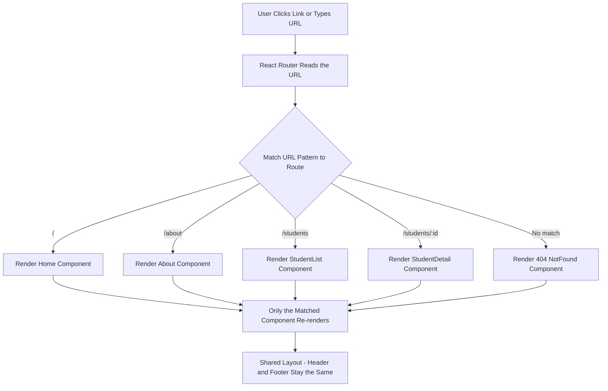

# Unit IV - Single Page Applications with React Router

[Back to React Topics](./)

---

## Table of Contents

- [What is a Single Page Application?](#what-is-a-single-page-application)
- [React Router Basics](#react-router-basics)
- [Setting Up React Router](#setting-up-react-router)
- [BrowserRouter, Routes, and Route](#browserrouter-routes-and-route)
- [Link and NavLink](#link-and-navlink)
- [useNavigate Hook](#usenavigate-hook)
- [useParams Hook and Route Parameters](#useparams-hook-and-route-parameters)
- [Nested Routes](#nested-routes)
- [Building a Complete Multi-Page SPA](#building-a-complete-multi-page-spa)
- [Key Takeaways](#key-takeaways)

---

## What is a Single Page Application?

A **Single Page Application (SPA)** is a web application that loads a single HTML file and dynamically updates the page content using JavaScript, without requesting new HTML pages from the server.

### How Traditional Websites Work

1. User clicks a link.
2. Browser sends a request to the server.
3. Server returns a completely new HTML page.
4. Browser reloads the entire page (white flash, losing scroll position, etc.).

### How SPAs Work

1. User clicks a link.
2. JavaScript **intercepts** the click and prevents a full page reload.
3. JavaScript updates the URL in the address bar.
4. JavaScript renders the new content by swapping components.
5. Only data is fetched from the server (if needed), not entire pages.

### SPA Routing Flow



### Benefits of SPAs

| Benefit | Description |
|---|---|
| Fast navigation | No full page reloads; transitions feel instant |
| Smooth UX | App feels like a desktop or mobile application |
| Reduced server load | Server only sends data (JSON), not full HTML pages |
| Offline capable | Can cache content and work offline (with service workers) |

---

## React Router Basics

**React Router** is the most popular routing library for React. It enables client-side routing in SPAs.

We use **`react-router-dom`** version 6 (v6), which is the latest stable version designed for web applications.

### Key Concepts

| Concept | Description |
|---|---|
| **BrowserRouter** | Wraps your app and enables routing using the browser's URL |
| **Routes** | Container for all your `Route` definitions |
| **Route** | Maps a URL path to a component |
| **Link** | Replaces `<a>` tags for navigation without page reload |
| **NavLink** | Like Link but with active styling support |
| **useNavigate** | Hook to navigate programmatically (e.g., after form submit) |
| **useParams** | Hook to read URL parameters (e.g., `/students/123`) |

---

## Setting Up React Router

### Step 1: Install React Router

```bash
# Using yarn
yarn add react-router-dom

# OR using npm
npm install react-router-dom
```

### Step 2: Wrap Your App with BrowserRouter

In `src/main.jsx`:

```jsx
import React from 'react';
import ReactDOM from 'react-dom/client';
import { BrowserRouter } from 'react-router-dom';
import App from './App.jsx';
import './index.css';

ReactDOM.createRoot(document.getElementById('root')).render(
  <React.StrictMode>
    <BrowserRouter>
      <App />
    </BrowserRouter>
  </React.StrictMode>
);
```

> **Important:** `BrowserRouter` must wrap your entire app. It is usually placed in `main.jsx` so that routing is available everywhere.

---

## BrowserRouter, Routes, and Route

### Basic Route Setup

```jsx
import { Routes, Route } from 'react-router-dom';

// Page Components
function Home() {
  return <h1>Home Page</h1>;
}

function About() {
  return <h1>About Page</h1>;
}

function Contact() {
  return <h1>Contact Page</h1>;
}

// App with Routes
function App() {
  return (
    <div>
      <h1>My Website</h1>
      <Routes>
        <Route path="/" element={<Home />} />
        <Route path="/about" element={<About />} />
        <Route path="/contact" element={<Contact />} />
      </Routes>
    </div>
  );
}

export default App;
```

### How It Works

- `<Routes>` looks at the current URL and finds the matching `<Route>`.
- `<Route path="/" element={<Home />} />` means: when the URL is `/`, render the `Home` component.
- Only **one** route is rendered at a time (the best match).

### 404 Not Found Page

Use `path="*"` to catch all unmatched URLs:

```jsx
function NotFound() {
  return (
    <div>
      <h1>404 - Page Not Found</h1>
      <p>The page you are looking for does not exist.</p>
    </div>
  );
}

function App() {
  return (
    <Routes>
      <Route path="/" element={<Home />} />
      <Route path="/about" element={<About />} />
      <Route path="*" element={<NotFound />} />
    </Routes>
  );
}
```

---

## Link and NavLink

### Link Component

`<Link>` replaces the HTML `<a>` tag for internal navigation. It prevents a full page reload and uses client-side routing instead.

```jsx
import { Link } from 'react-router-dom';

function Navigation() {
  return (
    <nav>
      <Link to="/">Home</Link>
      <Link to="/about">About</Link>
      <Link to="/contact">Contact</Link>
    </nav>
  );
}
```

> **Why not `<a href="...">`?** An `<a>` tag causes a full page reload, defeating the purpose of a SPA. `<Link>` updates the URL and renders the new component without reloading the page.

### NavLink Component

`<NavLink>` is like `<Link>` but automatically applies an **active** class (or style) when the link matches the current URL. This is useful for navigation menus where you want to highlight the current page.

```jsx
import { NavLink } from 'react-router-dom';

function Navigation() {
  const linkStyle = ({ isActive }) => ({
    color: isActive ? '#1a73e8' : '#333',
    fontWeight: isActive ? 'bold' : 'normal',
    textDecoration: 'none',
    padding: '8px 16px',
    borderBottom: isActive ? '2px solid #1a73e8' : '2px solid transparent',
  });

  return (
    <nav style={{ display: 'flex', gap: '4px', borderBottom: '1px solid #ddd', padding: '8px' }}>
      <NavLink to="/" style={linkStyle} end>Home</NavLink>
      <NavLink to="/about" style={linkStyle}>About</NavLink>
      <NavLink to="/students" style={linkStyle}>Students</NavLink>
      <NavLink to="/contact" style={linkStyle}>Contact</NavLink>
    </nav>
  );
}
```

### NavLink Details

- `isActive` is automatically provided by React Router.
- The `end` prop on `<NavLink to="/" end>` ensures the Home link is only active for **exactly** `/`, not for `/about`, `/students`, etc. (because all paths start with `/`).
- You can also use `className` instead of `style`:

```jsx
<NavLink
  to="/about"
  className={({ isActive }) => isActive ? 'nav-link active' : 'nav-link'}
>
  About
</NavLink>
```

---

## useNavigate Hook

The **`useNavigate`** hook lets you navigate programmatically -- for example, after a form submission, after a login, or when a button is clicked.

```jsx
import { useNavigate } from 'react-router-dom';

function LoginForm() {
  const navigate = useNavigate();

  function handleSubmit(event) {
    event.preventDefault();
    // ... perform login logic ...

    // Navigate to dashboard after successful login
    navigate('/dashboard');
  }

  return (
    <form onSubmit={handleSubmit}>
      <input type="text" placeholder="Username" />
      <input type="password" placeholder="Password" />
      <button type="submit">Login</button>
    </form>
  );
}
```

### navigate Options

```jsx
const navigate = useNavigate();

navigate('/about');          // Go to /about
navigate(-1);                // Go back (like browser back button)
navigate(-2);                // Go back two pages
navigate(1);                 // Go forward
navigate('/login', { replace: true }); // Replace current history entry
                                        // (user cannot go back to current page)
```

---

## useParams Hook and Route Parameters

**Route parameters** let you create dynamic URLs. For example, `/students/1`, `/students/2`, etc., all use the same route pattern.

### Defining a Route with Parameters

Use `:paramName` syntax in the route path:

```jsx
<Routes>
  <Route path="/students" element={<StudentList />} />
  <Route path="/students/:id" element={<StudentDetail />} />
</Routes>
```

### Reading Parameters with useParams

```jsx
import { useParams } from 'react-router-dom';

function StudentDetail() {
  const { id } = useParams(); // Reads :id from the URL

  // In a real app, you would fetch student data using this id
  return (
    <div>
      <h2>Student Details</h2>
      <p>Viewing student with ID: {id}</p>
    </div>
  );
}
```

### Practical Example: Student List with Detail Page

```jsx
import { Link, useParams } from 'react-router-dom';

const students = [
  { id: 1, name: 'Rahul Kumar', branch: 'IT', semester: 4 },
  { id: 2, name: 'Priya Sharma', branch: 'CSE', semester: 4 },
  { id: 3, name: 'Amit Reddy', branch: 'ECE', semester: 4 },
];

function StudentList() {
  return (
    <div>
      <h2>Students</h2>
      <ul>
        {students.map(student => (
          <li key={student.id}>
            <Link to={`/students/${student.id}`}>{student.name}</Link>
          </li>
        ))}
      </ul>
    </div>
  );
}

function StudentDetail() {
  const { id } = useParams();
  const student = students.find(s => s.id === Number(id));

  if (!student) {
    return <p>Student not found.</p>;
  }

  return (
    <div>
      <h2>{student.name}</h2>
      <p>Branch: {student.branch}</p>
      <p>Semester: {student.semester}</p>
      <Link to="/students">Back to list</Link>
    </div>
  );
}
```

---

## Nested Routes

**Nested routes** allow you to render child routes inside a parent route's component. This is useful for layouts where part of the page stays the same (like a sidebar) while another part changes.

### How Nested Routes Work

```jsx
import { Routes, Route, Outlet } from 'react-router-dom';

// Parent layout component
function Dashboard() {
  return (
    <div style={{ display: 'flex' }}>
      <nav style={{ width: '200px', borderRight: '1px solid #ccc', padding: '16px' }}>
        <h3>Dashboard</h3>
        <ul>
          <li><Link to="/dashboard">Overview</Link></li>
          <li><Link to="/dashboard/grades">Grades</Link></li>
          <li><Link to="/dashboard/attendance">Attendance</Link></li>
        </ul>
      </nav>

      <main style={{ flex: 1, padding: '16px' }}>
        {/* Child routes render here */}
        <Outlet />
      </main>
    </div>
  );
}

// Child components
function Overview() {
  return <h2>Dashboard Overview</h2>;
}

function Grades() {
  return <h2>Your Grades</h2>;
}

function Attendance() {
  return <h2>Your Attendance</h2>;
}

// Route configuration
function App() {
  return (
    <Routes>
      <Route path="/" element={<Home />} />

      {/* Nested routes */}
      <Route path="/dashboard" element={<Dashboard />}>
        <Route index element={<Overview />} />            {/* /dashboard */}
        <Route path="grades" element={<Grades />} />       {/* /dashboard/grades */}
        <Route path="attendance" element={<Attendance />} /> {/* /dashboard/attendance */}
      </Route>

      <Route path="*" element={<NotFound />} />
    </Routes>
  );
}
```

### Key Points About Nested Routes

- **`<Outlet />`** is a placeholder in the parent component where child routes are rendered.
- **`index`** route is the default child route (rendered when the URL matches the parent path exactly).
- Child route `path` values are **relative** to the parent -- `path="grades"` becomes `/dashboard/grades`.

---

## Building a Complete Multi-Page SPA

Here is a complete SPA example that demonstrates all the routing concepts together:

### Project Structure

```
src/
  components/
    Layout.jsx
  pages/
    Home.jsx
    About.jsx
    StudentList.jsx
    StudentDetail.jsx
    Contact.jsx
    NotFound.jsx
  App.jsx
  main.jsx
```

### main.jsx

```jsx
import React from 'react';
import ReactDOM from 'react-dom/client';
import { BrowserRouter } from 'react-router-dom';
import App from './App.jsx';
import './index.css';

ReactDOM.createRoot(document.getElementById('root')).render(
  <React.StrictMode>
    <BrowserRouter>
      <App />
    </BrowserRouter>
  </React.StrictMode>
);
```

### components/Layout.jsx

```jsx
import { NavLink, Outlet } from 'react-router-dom';

function Layout() {
  const linkStyle = ({ isActive }) => ({
    color: isActive ? '#fff' : '#ccc',
    backgroundColor: isActive ? '#1a73e8' : 'transparent',
    textDecoration: 'none',
    padding: '8px 16px',
    borderRadius: '4px',
  });

  return (
    <div>
      {/* Header */}
      <header style={{
        backgroundColor: '#333',
        padding: '16px 24px',
        display: 'flex',
        justifyContent: 'space-between',
        alignItems: 'center',
      }}>
        <h1 style={{ color: '#fff', margin: 0, fontSize: '20px' }}>
          VCE Student Portal
        </h1>
        <nav style={{ display: 'flex', gap: '4px' }}>
          <NavLink to="/" style={linkStyle} end>Home</NavLink>
          <NavLink to="/students" style={linkStyle}>Students</NavLink>
          <NavLink to="/about" style={linkStyle}>About</NavLink>
          <NavLink to="/contact" style={linkStyle}>Contact</NavLink>
        </nav>
      </header>

      {/* Main Content - child routes render here */}
      <main style={{ padding: '24px', minHeight: '60vh' }}>
        <Outlet />
      </main>

      {/* Footer */}
      <footer style={{
        backgroundColor: '#333',
        color: '#ccc',
        textAlign: 'center',
        padding: '16px',
        fontSize: '14px',
      }}>
        <p>Vasavi College of Engineering, Hyderabad | IT Department</p>
      </footer>
    </div>
  );
}

export default Layout;
```

### pages/Home.jsx

```jsx
import { Link } from 'react-router-dom';

function Home() {
  return (
    <div>
      <h1>Welcome to VCE Student Portal</h1>
      <p>
        This is a single page application built with React and React Router.
        Navigate using the links above -- notice how the page does not reload!
      </p>
      <div style={{ marginTop: '20px' }}>
        <Link
          to="/students"
          style={{
            backgroundColor: '#1a73e8',
            color: '#fff',
            padding: '10px 20px',
            textDecoration: 'none',
            borderRadius: '4px',
          }}
        >
          View Students
        </Link>
      </div>
    </div>
  );
}

export default Home;
```

### pages/About.jsx

```jsx
function About() {
  return (
    <div>
      <h1>About This App</h1>
      <p>
        This student portal is built using modern web technologies:
      </p>
      <ul>
        <li><strong>React 18</strong> - UI library</li>
        <li><strong>React Router v6</strong> - Client-side routing</li>
        <li><strong>Vite</strong> - Build tool</li>
      </ul>
      <p>
        Developed as part of the Full Stack Development course (B.E. IV Semester IT)
        at Vasavi College of Engineering, Hyderabad.
      </p>
    </div>
  );
}

export default About;
```

### pages/StudentList.jsx

```jsx
import { Link } from 'react-router-dom';

const students = [
  { id: 1, name: 'Rahul Kumar', branch: 'IT', semester: 4, cgpa: 8.5 },
  { id: 2, name: 'Priya Sharma', branch: 'CSE', semester: 4, cgpa: 9.1 },
  { id: 3, name: 'Amit Reddy', branch: 'ECE', semester: 4, cgpa: 7.8 },
  { id: 4, name: 'Sneha Patil', branch: 'IT', semester: 4, cgpa: 8.9 },
  { id: 5, name: 'Kiran Rao', branch: 'CSE', semester: 4, cgpa: 8.2 },
];

function StudentList() {
  return (
    <div>
      <h1>Student Directory</h1>
      <p>Click on a student name to view their details.</p>

      <table style={{ width: '100%', borderCollapse: 'collapse', marginTop: '16px' }}>
        <thead>
          <tr style={{ backgroundColor: '#f5f5f5' }}>
            <th style={{ padding: '12px', textAlign: 'left', borderBottom: '2px solid #ddd' }}>Name</th>
            <th style={{ padding: '12px', textAlign: 'left', borderBottom: '2px solid #ddd' }}>Branch</th>
            <th style={{ padding: '12px', textAlign: 'left', borderBottom: '2px solid #ddd' }}>CGPA</th>
            <th style={{ padding: '12px', textAlign: 'left', borderBottom: '2px solid #ddd' }}>Action</th>
          </tr>
        </thead>
        <tbody>
          {students.map(student => (
            <tr key={student.id} style={{ borderBottom: '1px solid #eee' }}>
              <td style={{ padding: '12px' }}>
                <Link to={`/students/${student.id}`} style={{ color: '#1a73e8' }}>
                  {student.name}
                </Link>
              </td>
              <td style={{ padding: '12px' }}>{student.branch}</td>
              <td style={{ padding: '12px' }}>{student.cgpa}</td>
              <td style={{ padding: '12px' }}>
                <Link
                  to={`/students/${student.id}`}
                  style={{
                    backgroundColor: '#1a73e8',
                    color: '#fff',
                    padding: '4px 12px',
                    textDecoration: 'none',
                    borderRadius: '4px',
                    fontSize: '14px',
                  }}
                >
                  View
                </Link>
              </td>
            </tr>
          ))}
        </tbody>
      </table>
    </div>
  );
}

export { students };
export default StudentList;
```

### pages/StudentDetail.jsx

```jsx
import { useParams, useNavigate, Link } from 'react-router-dom';
import { students } from './StudentList.jsx';

function StudentDetail() {
  const { id } = useParams();
  const navigate = useNavigate();

  const student = students.find(s => s.id === Number(id));

  if (!student) {
    return (
      <div>
        <h2>Student Not Found</h2>
        <p>No student found with ID: {id}</p>
        <Link to="/students">Back to Student List</Link>
      </div>
    );
  }

  return (
    <div>
      <button
        onClick={() => navigate(-1)}
        style={{
          background: 'none',
          border: 'none',
          color: '#1a73e8',
          cursor: 'pointer',
          fontSize: '14px',
          padding: 0,
          marginBottom: '16px',
        }}
      >
        &larr; Go Back
      </button>

      <div style={{
        border: '1px solid #ddd',
        borderRadius: '8px',
        padding: '24px',
        maxWidth: '400px',
      }}>
        <h1 style={{ marginTop: 0 }}>{student.name}</h1>

        <table style={{ width: '100%' }}>
          <tbody>
            <tr>
              <td style={{ padding: '8px 0', fontWeight: 'bold', color: '#666' }}>Student ID</td>
              <td style={{ padding: '8px 0' }}>{student.id}</td>
            </tr>
            <tr>
              <td style={{ padding: '8px 0', fontWeight: 'bold', color: '#666' }}>Branch</td>
              <td style={{ padding: '8px 0' }}>{student.branch}</td>
            </tr>
            <tr>
              <td style={{ padding: '8px 0', fontWeight: 'bold', color: '#666' }}>Semester</td>
              <td style={{ padding: '8px 0' }}>{student.semester}</td>
            </tr>
            <tr>
              <td style={{ padding: '8px 0', fontWeight: 'bold', color: '#666' }}>CGPA</td>
              <td style={{ padding: '8px 0' }}>{student.cgpa}</td>
            </tr>
          </tbody>
        </table>
      </div>

      <div style={{ marginTop: '16px' }}>
        <Link to="/students" style={{ color: '#1a73e8' }}>
          View All Students
        </Link>
      </div>
    </div>
  );
}

export default StudentDetail;
```

### pages/Contact.jsx

```jsx
import { useState } from 'react';

function Contact() {
  const [submitted, setSubmitted] = useState(false);

  function handleSubmit(event) {
    event.preventDefault();
    setSubmitted(true);
  }

  if (submitted) {
    return (
      <div>
        <h1 style={{ color: 'green' }}>Message Sent!</h1>
        <p>Thank you for contacting us. We will get back to you soon.</p>
      </div>
    );
  }

  return (
    <div>
      <h1>Contact Us</h1>
      <form onSubmit={handleSubmit} style={{ maxWidth: '400px' }}>
        <div style={{ marginBottom: '12px' }}>
          <label htmlFor="contactName" style={{ display: 'block', marginBottom: '4px' }}>Name</label>
          <input
            id="contactName"
            type="text"
            style={{ width: '100%', padding: '8px' }}
            required
          />
        </div>
        <div style={{ marginBottom: '12px' }}>
          <label htmlFor="contactEmail" style={{ display: 'block', marginBottom: '4px' }}>Email</label>
          <input
            id="contactEmail"
            type="email"
            style={{ width: '100%', padding: '8px' }}
            required
          />
        </div>
        <div style={{ marginBottom: '12px' }}>
          <label htmlFor="contactMessage" style={{ display: 'block', marginBottom: '4px' }}>Message</label>
          <textarea
            id="contactMessage"
            rows={4}
            style={{ width: '100%', padding: '8px' }}
            required
          />
        </div>
        <button
          type="submit"
          style={{
            backgroundColor: '#1a73e8',
            color: '#fff',
            padding: '10px 24px',
            border: 'none',
            borderRadius: '4px',
            cursor: 'pointer',
          }}
        >
          Send Message
        </button>
      </form>
    </div>
  );
}

export default Contact;
```

### pages/NotFound.jsx

```jsx
import { Link } from 'react-router-dom';

function NotFound() {
  return (
    <div style={{ textAlign: 'center', padding: '40px' }}>
      <h1 style={{ fontSize: '72px', color: '#ccc', margin: 0 }}>404</h1>
      <h2>Page Not Found</h2>
      <p>The page you are looking for does not exist.</p>
      <Link
        to="/"
        style={{
          backgroundColor: '#1a73e8',
          color: '#fff',
          padding: '10px 20px',
          textDecoration: 'none',
          borderRadius: '4px',
        }}
      >
        Go to Home
      </Link>
    </div>
  );
}

export default NotFound;
```

### App.jsx (Putting It All Together)

```jsx
import { Routes, Route } from 'react-router-dom';
import Layout from './components/Layout.jsx';
import Home from './pages/Home.jsx';
import About from './pages/About.jsx';
import StudentList from './pages/StudentList.jsx';
import StudentDetail from './pages/StudentDetail.jsx';
import Contact from './pages/Contact.jsx';
import NotFound from './pages/NotFound.jsx';

function App() {
  return (
    <Routes>
      <Route path="/" element={<Layout />}>
        <Route index element={<Home />} />
        <Route path="about" element={<About />} />
        <Route path="students" element={<StudentList />} />
        <Route path="students/:id" element={<StudentDetail />} />
        <Route path="contact" element={<Contact />} />
        <Route path="*" element={<NotFound />} />
      </Route>
    </Routes>
  );
}

export default App;
```

### How This SPA Works

1. **`Layout`** is the parent route component. It renders the header, footer, and an `<Outlet />` for child routes.
2. All page routes are **nested** inside the Layout route, so every page gets the same header and footer.
3. **`index`** route renders `Home` at the root path `/`.
4. **`students/:id`** is a dynamic route. Clicking a student in the list navigates to `/students/1`, `/students/2`, etc.
5. **`*`** catches any URL that does not match, showing the 404 page.
6. Navigation uses `<NavLink>` for the nav bar (with active styling) and `<Link>` for in-page links.
7. `useNavigate` is used for the "Go Back" button on the student detail page.
8. `useParams` reads the `:id` parameter to find the right student.

---

## Key Takeaways

1. A **Single Page Application (SPA)** loads once and updates content dynamically without full page reloads.
2. **React Router** (`react-router-dom` v6) is the standard library for routing in React SPAs.
3. Wrap your app with **`<BrowserRouter>`** in `main.jsx` to enable routing.
4. Use **`<Routes>`** and **`<Route>`** to define URL-to-component mappings.
5. Use **`<Link>`** instead of `<a>` for navigation to prevent page reloads.
6. Use **`<NavLink>`** for navigation with active state styling.
7. **`useNavigate`** allows programmatic navigation (e.g., after form submission or login).
8. **`useParams`** reads dynamic URL parameters defined with `:paramName` in the route path.
9. **Nested routes** use `<Outlet />` to render child routes inside a parent layout.
10. Use `path="*"` for a catch-all **404 Not Found** page.

---

This concludes Unit IV - React Topics.

[Back to React Topics](./)
