# React - Questions & Answers

> Exam preparation material covering all React topics from Unit IV

## Table of Contents

- [Short Answer Questions (2 Marks)](#short-answer-questions-2-marks)
  1. [What is React?](#q1-what-is-react)
  2. [What is the Virtual DOM?](#q2-what-is-the-virtual-dom)
  3. [How does Virtual DOM differ from Real DOM?](#q3-how-does-virtual-dom-differ-from-real-dom)
  4. [What is JSX?](#q4-what-is-jsx)
  5. [What is a component in React?](#q5-what-is-a-component-in-react)
  6. [What is the difference between function and class components?](#q6-what-is-the-difference-between-function-and-class-components)
  7. [What are Props in React?](#q7-what-are-props-in-react)
  8. [What is State in React?](#q8-what-is-state-in-react)
  9. [What is the difference between State and Props?](#q9-what-is-the-difference-between-state-and-props)
  10. [What is the useState hook?](#q10-what-is-the-usestate-hook)
  11. [What is the useEffect hook?](#q11-what-is-the-useeffect-hook)
  12. [What is conditional rendering?](#q12-what-is-conditional-rendering)
  13. [Why are keys important in lists?](#q13-why-are-keys-important-in-lists)
  14. [What is a controlled component?](#q14-what-is-a-controlled-component)
  15. [What is a Single Page Application (SPA)?](#q15-what-is-a-single-page-application-spa)
  16. [What is React Router?](#q16-what-is-react-router)
  17. [What is the purpose of the key prop?](#q17-what-is-the-purpose-of-the-key-prop)
  18. [What is a synthetic event in React?](#q18-what-is-a-synthetic-event-in-react)
  19. [What is component composition?](#q19-what-is-component-composition)
  20. [What is the children prop?](#q20-what-is-the-children-prop)
  21. [What are fragments in React?](#q21-what-are-fragments-in-react)
  22. [What is the purpose of useNavigate?](#q22-what-is-the-purpose-of-usenavigate)
  23. [What is the difference between Link and NavLink?](#q23-what-is-the-difference-between-link-and-navlink)
  24. [What is Vite and why is it used with React?](#q24-what-is-vite-and-why-is-it-used-with-react)
  25. [What is reconciliation in React?](#q25-what-is-reconciliation-in-react)
  26. [What is the significance of the render method?](#q26-what-is-the-significance-of-the-render-method)
  27. [What is prop drilling?](#q27-what-is-prop-drilling)
  28. [What is the StrictMode in React?](#q28-what-is-the-strictmode-in-react)
  29. [What is an uncontrolled component?](#q29-what-is-an-uncontrolled-component)
  30. [What is one-way data binding in React?](#q30-what-is-one-way-data-binding-in-react)
- [Essay Questions (10 Marks)](#essay-questions-10-marks)
  1. [Explain the Virtual DOM and reconciliation process with a diagram](#e1-explain-the-virtual-dom-and-reconciliation-process-with-a-diagram)
  2. [Explain JSX with examples and how it differs from HTML](#e2-explain-jsx-with-examples-and-how-it-differs-from-html)
  3. [Explain components and props with examples of parent-child communication](#e3-explain-components-and-props-with-examples-of-parent-child-communication)
  4. [Explain state management using useState with practical examples](#e4-explain-state-management-using-usestate-with-practical-examples)
  5. [Explain the component lifecycle and useEffect hook with examples](#e5-explain-the-component-lifecycle-and-useeffect-hook-with-examples)
  6. [Explain event handling in React with examples](#e6-explain-event-handling-in-react-with-examples)
  7. [Explain controlled vs uncontrolled components with form examples](#e7-explain-controlled-vs-uncontrolled-components-with-form-examples)
  8. [Explain how to render lists and the importance of keys with examples](#e8-explain-how-to-render-lists-and-the-importance-of-keys-with-examples)
  9. [Explain conditional rendering techniques in React with examples](#e9-explain-conditional-rendering-techniques-in-react-with-examples)
  10. [Explain React Router and how to build a SPA with code examples](#e10-explain-react-router-and-how-to-build-a-spa-with-code-examples)
  11. [Explain how to create a React application using Vite](#e11-explain-how-to-create-a-react-application-using-vite)
  12. [Explain how to add React to an existing website](#e12-explain-how-to-add-react-to-an-existing-website)
  13. [Explain form handling and validation in React with a complete example](#e13-explain-form-handling-and-validation-in-react-with-a-complete-example)
  14. [Explain the data flow in React (one-way data binding) with a diagram](#e14-explain-the-data-flow-in-react-one-way-data-binding-with-a-diagram)
  15. [Explain how to build a Student Management frontend with React](#e15-explain-how-to-build-a-student-management-frontend-with-react)

---

## Short Answer Questions (2 Marks)

---

### Q1. What is React?

React is an open-source JavaScript library developed by Facebook (now Meta) for building user interfaces, especially single-page applications. It follows a component-based architecture where the UI is broken into reusable, independent pieces called components. React uses a Virtual DOM to efficiently update and render only the parts of the UI that change, making it fast and performant. It is maintained by Meta and a large open-source community.

---

### Q2. What is the Virtual DOM?

The Virtual DOM is a lightweight, in-memory JavaScript representation of the Real DOM. When state changes in a React component, a new Virtual DOM tree is created and compared (diffed) with the previous one. React calculates the minimal set of changes needed and updates only those specific elements in the Real DOM. This process is called **reconciliation** and it makes React applications fast because direct DOM manipulation is expensive while operating on JavaScript objects is cheap.

---

### Q3. How does Virtual DOM differ from Real DOM?

| Feature | Real DOM | Virtual DOM |
|---------|----------|-------------|
| Nature | The actual browser DOM structure | A JavaScript object representation |
| Update speed | Slow, re-renders the entire tree | Fast, updates only changed nodes |
| Memory | Consumes more memory | Lightweight in-memory copy |
| Manipulation | Directly updates the UI | Batches changes, then applies minimal updates |
| Performance | Expensive reflows and repaints | Efficient diffing algorithm reduces updates |

The Virtual DOM acts as an intermediary layer. React compares two Virtual DOM snapshots, calculates the diff, and applies only the necessary changes to the Real DOM.

---

### Q4. What is JSX?

JSX stands for **JavaScript XML**. It is a syntax extension for JavaScript that allows writing HTML-like code inside JavaScript files. JSX is not valid JavaScript on its own; tools like Babel or Vite's build process transpile it into `React.createElement()` calls. JSX makes React components more readable and expressive by letting developers describe what the UI should look like in a familiar HTML-like syntax, while embedding JavaScript expressions inside curly braces `{}`.

---

### Q5. What is a component in React?

A component is an independent, reusable piece of UI in React. Components accept inputs called **props** and return React elements describing what should appear on the screen. They can be either function components (plain JavaScript functions) or class components (ES6 classes). Components allow developers to split the UI into isolated sections, each managing its own structure and logic. Components can be composed together to build complex interfaces.

---

### Q6. What is the difference between function and class components?

| Function Components | Class Components |
|---------------------|-----------------|
| Plain JavaScript functions | ES6 classes extending `React.Component` |
| Use hooks (`useState`, `useEffect`) for state and lifecycle | Use `this.state` and lifecycle methods (`componentDidMount`, etc.) |
| Simpler syntax, less boilerplate | More verbose with constructor, `this` keyword |
| No `this` keyword needed | Requires `this` binding for methods |
| Recommended in modern React (18.x) | Legacy approach, still supported |

Modern React development uses function components with hooks exclusively.

---

### Q7. What are Props in React?

Props (short for **properties**) are read-only inputs passed from a parent component to a child component. They allow data to flow down the component tree (unidirectional data flow). Props are passed as attributes in JSX, similar to HTML attributes. A child component receives props as a function parameter and uses them to render dynamic content. Props are **immutable** -- a component must never modify its own props.

---

### Q8. What is State in React?

State is a built-in object that holds data which may change over the component's lifetime. Unlike props, state is **private** and fully controlled by the component itself. When state changes, React re-renders the component to reflect the new data. In function components, state is managed using the `useState` hook. State enables interactive UIs -- for example, tracking form input values, toggling visibility, or maintaining a counter.

---

### Q9. What is the difference between State and Props?

| State | Props |
|-------|-------|
| Managed within the component | Passed from parent to child |
| Mutable (can be updated via setter) | Immutable (read-only) |
| Triggers re-render when updated | Triggers re-render when parent sends new values |
| Private to the component | Accessible by the child receiving them |
| Declared using `useState` hook | Received as function parameters |

In short, **props** are how components talk to each other, while **state** is how a component manages its own internal data.

---

### Q10. What is the useState hook?

`useState` is a React hook that lets function components declare and manage state variables. It returns an array with two elements: the current state value and a setter function to update it. When the setter is called, React re-renders the component with the new state value.

```jsx
const [count, setCount] = useState(0);
```

Here, `count` is the state variable initialized to `0`, and `setCount` is the function used to update it. Multiple `useState` calls can be used in a single component for different state variables.

---

### Q11. What is the useEffect hook?

`useEffect` is a React hook that lets function components perform **side effects** such as fetching data, setting up subscriptions, or manually changing the DOM. It runs after every render by default. A dependency array can be passed as the second argument to control when the effect runs. An empty array `[]` means the effect runs only once after the initial render. A cleanup function can be returned to run when the component unmounts or before the effect re-runs.

---

### Q12. What is conditional rendering?

Conditional rendering in React is the technique of rendering different UI elements based on certain conditions, similar to how conditions work in JavaScript. Common approaches include using `if` statements, the ternary operator (`condition ? <A /> : <B />`), and the logical AND operator (`condition && <A />`). This allows components to show or hide elements, display loading states, or render different views based on user authentication, data availability, or application state.

---

### Q13. Why are keys important in lists?

Keys help React identify which items in a list have changed, been added, or been removed. They provide a stable identity to each element across re-renders. Without keys (or with incorrect keys like array indices), React may re-render the entire list or mix up component state. Keys must be **unique among siblings** and should be stable, predictable values -- ideally a unique ID from the data. Using proper keys improves performance by enabling React's reconciliation algorithm to make minimal DOM updates.

---

### Q14. What is a controlled component?

A controlled component is a form element whose value is controlled by React state. The component's value is set by state, and every change is handled by an event handler that updates the state. This gives React full control over the form data, making it the "single source of truth." For example, an `<input>` with `value={name}` and `onChange={(e) => setName(e.target.value)}` is a controlled component. This approach makes it easy to validate, transform, or conditionally process form input.

---

### Q15. What is a Single Page Application (SPA)?

A Single Page Application (SPA) is a web application that loads a single HTML page and dynamically updates content as the user interacts with the app, without full page reloads. Navigation between "pages" is handled on the client side by JavaScript, which swaps components in and out. SPAs provide a smoother, faster user experience similar to desktop applications. React, combined with React Router, is a popular choice for building SPAs. The server sends only data (typically JSON) after the initial page load.

---

### Q16. What is React Router?

React Router is a third-party library for handling client-side routing in React applications. It enables navigation between different views/components without a full page reload, making the app behave as a SPA. Key components include `BrowserRouter` (wraps the app), `Routes` (defines route boundaries), `Route` (maps a URL path to a component), `Link` (provides navigation links), and `NavLink` (a `Link` with active styling). It is installed via `npm install react-router-dom`.

---

### Q17. What is the purpose of the key prop?

The `key` prop is a special attribute used when rendering lists of elements. It helps React's reconciliation algorithm identify individual elements uniquely so it can efficiently determine what has changed. When a list is re-rendered, React uses keys to match old and new elements. If a key is stable and unique, React can reuse and reorder existing DOM nodes instead of destroying and recreating them. Keys should be unique among siblings and derived from data (e.g., database IDs), not from array indices.

---

### Q18. What is a synthetic event in React?

A synthetic event is React's cross-browser wrapper around the browser's native event. React normalizes events so they behave consistently across all browsers. Synthetic events have the same interface as native events (e.g., `stopPropagation()`, `preventDefault()`) but work identically everywhere. They are pooled for performance in older React versions. In React 18, event pooling is removed, but synthetic events are still used. For example, `onClick` in React provides a `SyntheticEvent` object, not the native DOM `MouseEvent`.

---

### Q19. What is component composition?

Component composition is the pattern of building complex UIs by combining simpler, reusable components together. Instead of using inheritance, React encourages composition -- nesting components within other components. A parent component can include child components in its JSX, pass them data via props, and even pass components as props. Composition enables code reuse, separation of concerns, and modular architecture. For example, a `Page` component can compose `Header`, `Sidebar`, and `Content` components.

---

### Q20. What is the children prop?

The `children` prop is a special prop automatically provided by React that contains the content placed between a component's opening and closing tags. It allows components to act as generic wrappers without knowing their content in advance. For example:

```jsx
<Card>
  <h2>Title</h2>
</Card>
```

Inside the `Card` component, `props.children` refers to `<h2>Title</h2>`. This pattern is widely used for layout components, modals, and any reusable container.

---

### Q21. What are fragments in React?

Fragments let you group multiple elements without adding an extra DOM node. Normally, a component must return a single parent element, which often leads to unnecessary `<div>` wrappers. Fragments solve this problem. They can be written as `<React.Fragment>...</React.Fragment>` or with the shorthand syntax `<>...</>`. Fragments keep the DOM clean and are useful when rendering lists, table rows, or definition lists where extra wrapper elements would break the HTML structure.

---

### Q22. What is the purpose of useNavigate?

`useNavigate` is a hook from React Router that returns a `navigate` function for programmatic navigation. Unlike `<Link>`, which requires a user click, `useNavigate` allows navigation triggered by code logic -- for example, after a form submission, authentication check, or API call. Usage: `const navigate = useNavigate();` then `navigate('/dashboard')` to redirect. It can also go back in history with `navigate(-1)`. It replaced the older `useHistory` hook from React Router v5.

---

### Q23. What is the difference between Link and NavLink?

Both `Link` and `NavLink` are React Router components used for client-side navigation without page reloads. The key difference is that **`NavLink`** is a special version of `Link` that knows whether it is "active" (i.e., its path matches the current URL). `NavLink` automatically applies an `active` class to the rendered anchor tag when the route matches, allowing active link styling (e.g., highlighting the current menu item). `Link` does not provide this active state functionality.

---

### Q24. What is Vite and why is it used with React?

Vite is a modern, fast build tool and development server created by Evan You (creator of Vue.js). It uses native ES modules in the browser during development, providing near-instant Hot Module Replacement (HMR) and server startup. Compared to older tools like Create React App (which uses Webpack), Vite is significantly faster. It is used with React because it provides rapid development feedback, optimized production builds using Rollup, and first-class support for JSX and TypeScript out of the box. A React project is created with `npm create vite@latest`.

---

### Q25. What is reconciliation in React?

Reconciliation is the process React uses to update the DOM efficiently. When a component's state or props change, React creates a new Virtual DOM tree and compares it with the previous one using a **diffing algorithm**. It identifies the minimum number of changes needed and applies only those updates to the Real DOM. The algorithm works in O(n) time by making two assumptions: elements of different types produce different trees, and the `key` prop identifies which child elements are stable across renders.

---

### Q26. What is the significance of the render method?

In function components, the **function body itself** acts as the render method -- it returns JSX that describes the UI. React calls this function whenever the component needs to re-render (due to state or prop changes). The returned JSX is converted into Virtual DOM elements, which React uses for reconciliation. A component must return a single root element (or a Fragment). The render output should be **pure** -- given the same state and props, it should always return the same result without side effects.

---

### Q27. What is prop drilling?

Prop drilling is the process of passing data from a parent component to a deeply nested child component through multiple intermediate components that do not need the data themselves. Each intermediate component must accept and forward the props, leading to verbose, hard-to-maintain code. For example, passing a `user` object from `App` through `Layout`, `Sidebar`, down to `UserAvatar`. Solutions include the Context API, state management libraries, or component composition patterns.

---

### Q28. What is the StrictMode in React?

`StrictMode` is a React development tool that activates additional checks and warnings for its descendants. It does not render any visible UI and does not affect the production build. In React 18, StrictMode intentionally double-invokes certain functions (like component bodies and effects) to help detect impure renders and side effects. It helps identify unsafe lifecycle methods, deprecated API usage, and unexpected side effects. It is used by wrapping components with `<React.StrictMode>`.

---

### Q29. What is an uncontrolled component?

An uncontrolled component is a form element that manages its own state internally in the DOM, rather than being controlled by React state. The value is accessed using a **ref** (via `useRef`) when needed (e.g., on form submission) instead of tracking every keystroke. While simpler for basic use cases, uncontrolled components offer less control over validation and data transformation compared to controlled components. They are closer to traditional HTML form behavior.

---

### Q30. What is one-way data binding in React?

One-way data binding (also called unidirectional data flow) means data flows in a single direction -- from parent to child via props. A parent component passes data down to its children, but children cannot directly modify the parent's data. If a child needs to communicate with its parent, the parent passes a callback function as a prop, and the child invokes it. This makes data flow predictable, easier to debug, and simpler to understand compared to two-way data binding frameworks.

---

## Essay Questions (10 Marks)

---

### E1. Explain the Virtual DOM and reconciliation process with a diagram

**Introduction:**
The Virtual DOM is one of the core concepts that makes React fast and efficient. It is a programming concept where a virtual representation of the UI is kept in memory and synced with the real DOM through a process called reconciliation.

**What is the Virtual DOM?**
The Virtual DOM is a lightweight JavaScript object that mirrors the structure of the Real DOM. Every React element is a plain object describing a DOM node. For example:

```jsx
const element = <h1 className="title">Hello</h1>;
// Translates to:
// { type: 'h1', props: { className: 'title', children: 'Hello' } }
```

**How Reconciliation Works:**

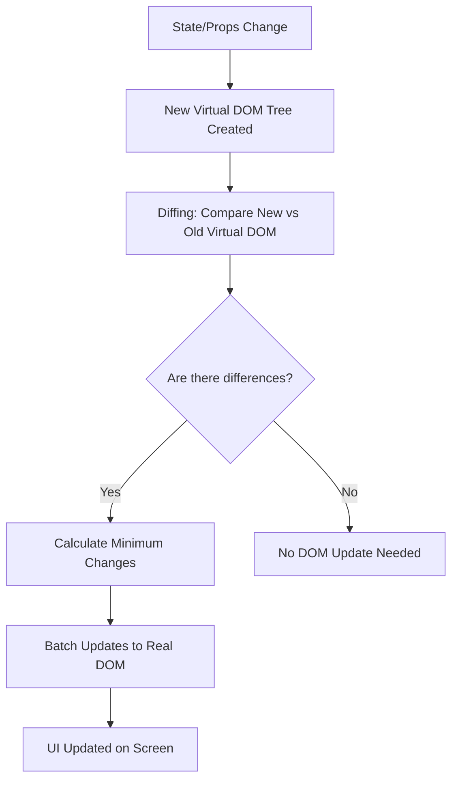

**The Diffing Algorithm:**

React's diffing algorithm compares two trees with the following heuristics:

1. **Different element types:** If the root elements have different types (e.g., `<div>` to `<span>`), React tears down the old tree and builds a new one from scratch.
2. **Same element type:** React keeps the same DOM node and only updates the changed attributes.
3. **Recursing on children:** React uses the `key` prop to match children between the old and new tree.

**Step-by-step Example:**

```jsx
function Counter() {
  const [count, setCount] = useState(0);

  return (
    <div>
      <h1>Count: {count}</h1>
      <button onClick={() => setCount(count + 1)}>Increment</button>
    </div>
  );
}
```

When the button is clicked:
1. `setCount(1)` is called, triggering a re-render.
2. React calls the `Counter` function again, producing a **new Virtual DOM tree**.
3. React **diffs** the new tree against the old tree.
4. It finds that only the text inside `<h1>` changed from `"Count: 0"` to `"Count: 1"`.
5. React updates **only** that text node in the Real DOM.

**Batching:**
React batches multiple state updates together and performs a single re-render, reducing unnecessary DOM operations.

**Benefits of Virtual DOM:**
- Minimizes expensive DOM operations
- Enables declarative programming (describe what, not how)
- Provides cross-platform capability (React Native uses the same concept)
- Efficient batch updates reduce reflows and repaints

**Conclusion:**
The Virtual DOM and reconciliation process allow React to provide a declarative API while maintaining high performance. Developers describe the desired UI state, and React efficiently determines the minimal DOM operations needed.

---

### E2. Explain JSX with examples and how it differs from HTML

**Introduction:**
JSX (JavaScript XML) is a syntax extension for JavaScript that allows developers to write HTML-like code within JavaScript files. It is the primary way to describe the UI in React components.

**What is JSX?**
JSX is not a template language -- it is a syntactic sugar for `React.createElement()` calls. Vite (or Babel) transpiles JSX into regular JavaScript before the browser executes it.

```jsx
// JSX syntax
const element = <h1 className="greeting">Hello, World!</h1>;

// What it compiles to
const element = React.createElement('h1', { className: 'greeting' }, 'Hello, World!');
```

**Embedding Expressions in JSX:**

JavaScript expressions can be embedded inside JSX using curly braces `{}`:

```jsx
function Greeting({ name }) {
  const currentTime = new Date().toLocaleTimeString();

  return (
    <div>
      <h1>Hello, {name}!</h1>
      <p>The time is {currentTime}</p>
      <p>2 + 2 = {2 + 2}</p>
    </div>
  );
}
```

**Differences between JSX and HTML:**

| Feature | HTML | JSX |
|---------|------|-----|
| Class attribute | `class="box"` | `className="box"` |
| For attribute | `for="email"` | `htmlFor="email"` |
| Event handlers | `onclick="handler()"` | `onClick={handler}` |
| Style attribute | `style="color: red"` | `style={{ color: 'red' }}` |
| Self-closing tags | `<br>`, `` | `<br />`, `` (must be closed) |
| Boolean attributes | `<input disabled>` | `<input disabled={true} />` |
| Single root element | Multiple elements allowed | Must have one parent (or use Fragment) |

**JSX Prevents Injection Attacks:**

By default, React DOM escapes any values embedded in JSX before rendering them, preventing XSS (Cross-Site Scripting) attacks:

```jsx
const userInput = '<script>alert("hacked")</script>';
// This is safe -- React escapes the string
return <p>{userInput}</p>;
```

**Conditional Rendering in JSX:**

```jsx
function Dashboard({ isLoggedIn }) {
  return (
    <div>
      {isLoggedIn ? (
        <h1>Welcome back!</h1>
      ) : (
        <h1>Please sign in</h1>
      )}
    </div>
  );
}
```

**Rendering Lists in JSX:**

```jsx
function FruitList() {
  const fruits = ['Apple', 'Banana', 'Cherry'];

  return (
    <ul>
      {fruits.map((fruit, index) => (
        <li key={index}>{fruit}</li>
      ))}
    </ul>
  );
}
```

**Applying Styles in JSX:**

```jsx
function StyledComponent() {
  const boxStyle = {
    backgroundColor: '#f0f0f0',
    padding: '20px',
    borderRadius: '8px'
  };

  return <div style={boxStyle}>Styled with inline styles</div>;
}
```

**Conclusion:**
JSX combines the power of JavaScript with a familiar HTML-like syntax, making it intuitive to describe UI structures. Although it looks like HTML, key differences (attribute names, self-closing tags, expressions in braces) must be understood. JSX is transpiled by build tools and is not sent to the browser directly.

---

### E3. Explain components and props with examples of parent-child communication

**Introduction:**
Components are the building blocks of any React application. They allow you to split the UI into independent, reusable pieces. Props enable communication between components.

**Types of Components:**

In modern React (18.x), function components with hooks are the standard:

```jsx
// Function Component
function Welcome({ name }) {
  return <h1>Hello, {name}!</h1>;
}
```

**Props (Properties):**

Props are read-only data passed from parent to child:

```jsx
// Parent Component
function App() {
  return (
    <div>
      <StudentCard name="Rahul" rollNo="21B01A1234" branch="IT" />
      <StudentCard name="Priya" rollNo="21B01A1235" branch="IT" />
    </div>
  );
}

// Child Component
function StudentCard({ name, rollNo, branch }) {
  return (
    <div className="card">
      <h2>{name}</h2>
      <p>Roll No: {rollNo}</p>
      <p>Branch: {branch}</p>
    </div>
  );
}
```

**Parent-to-Child Communication (via Props):**

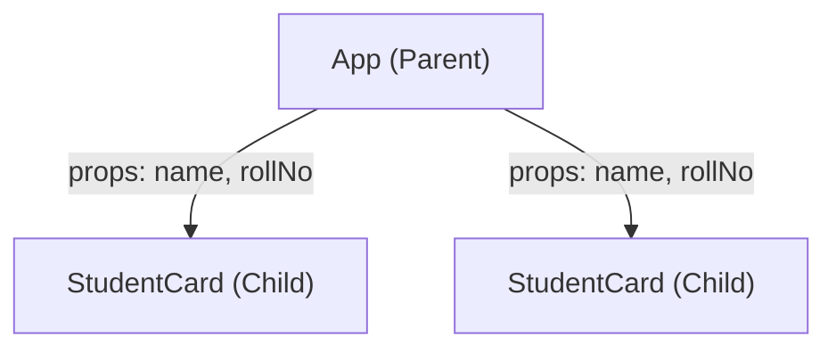

```jsx
function ParentComponent() {
  const message = "Hello from Parent!";
  return <ChildComponent greeting={message} />;
}

function ChildComponent({ greeting }) {
  return <p>{greeting}</p>;
}
```

**Child-to-Parent Communication (via Callback Props):**

A parent passes a function as a prop, and the child calls it to send data back:

```jsx
function Parent() {
  const [selectedFruit, setSelectedFruit] = useState('');

  const handleSelect = (fruit) => {
    setSelectedFruit(fruit);
  };

  return (
    <div>
      <h1>Selected: {selectedFruit}</h1>
      <FruitPicker onSelect={handleSelect} />
    </div>
  );
}

function FruitPicker({ onSelect }) {
  const fruits = ['Apple', 'Banana', 'Mango'];

  return (
    <div>
      {fruits.map((fruit) => (
        <button key={fruit} onClick={() => onSelect(fruit)}>
          {fruit}
        </button>
      ))}
    </div>
  );
}
```

**Default Props:**

```jsx
function Button({ label = 'Click Me', color = 'blue' }) {
  return (
    <button style={{ backgroundColor: color }}>
      {label}
    </button>
  );
}

// Usage
<Button />                    // Uses defaults
<Button label="Submit" />     // Overrides label only
```

**Component Composition with children:**

```jsx
function Card({ title, children }) {
  return (
    <div className="card">
      <h2>{title}</h2>
      <div className="card-body">{children}</div>
    </div>
  );
}

function App() {
  return (
    <Card title="Student Info">
      <p>Name: Rahul</p>
      <p>Branch: IT</p>
    </Card>
  );
}
```

**Conclusion:**
Components and props form the backbone of React's architecture. Components encapsulate UI logic, while props enable data flow between them. Parent-to-child communication uses props directly; child-to-parent communication uses callback functions passed as props. This unidirectional data flow makes applications predictable and easy to debug.

---

### E4. Explain state management using useState with practical examples

**Introduction:**
State is a core concept in React that allows components to manage and respond to changing data. The `useState` hook is the primary way to add state to function components.

**Syntax of useState:**

```jsx
const [stateVariable, setStateVariable] = useState(initialValue);
```

- `stateVariable` -- the current state value
- `setStateVariable` -- function to update the state
- `initialValue` -- the initial value (can be any type)

**Example 1: Simple Counter**

```jsx
function Counter() {
  const [count, setCount] = useState(0);

  return (
    <div>
      <h2>Count: {count}</h2>
      <button onClick={() => setCount(count + 1)}>Increment</button>
      <button onClick={() => setCount(count - 1)}>Decrement</button>
      <button onClick={() => setCount(0)}>Reset</button>
    </div>
  );
}
```

**Example 2: Toggle Visibility**

```jsx
function ToggleMessage() {
  const [isVisible, setIsVisible] = useState(false);

  return (
    <div>
      <button onClick={() => setIsVisible(!isVisible)}>
        {isVisible ? 'Hide' : 'Show'} Message
      </button>
      {isVisible && <p>This is a toggled message!</p>}
    </div>
  );
}
```

**Example 3: Object State (Form Input)**

```jsx
function RegistrationForm() {
  const [formData, setFormData] = useState({
    name: '',
    email: '',
    branch: 'IT'
  });

  const handleChange = (e) => {
    const { name, value } = e.target;
    setFormData((prev) => ({
      ...prev,
      [name]: value
    }));
  };

  return (
    <form>
      <input name="name" value={formData.name} onChange={handleChange} placeholder="Name" />
      <input name="email" value={formData.email} onChange={handleChange} placeholder="Email" />
      <select name="branch" value={formData.branch} onChange={handleChange}>
        <option value="IT">IT</option>
        <option value="CSE">CSE</option>
        <option value="ECE">ECE</option>
      </select>
      <p>Preview: {formData.name} - {formData.email} - {formData.branch}</p>
    </form>
  );
}
```

**Example 4: Array State (Todo List)**

```jsx
function TodoList() {
  const [todos, setTodos] = useState([]);
  const [input, setInput] = useState('');

  const addTodo = () => {
    if (input.trim()) {
      setTodos([...todos, { id: Date.now(), text: input }]);
      setInput('');
    }
  };

  const removeTodo = (id) => {
    setTodos(todos.filter((todo) => todo.id !== id));
  };

  return (
    <div>
      <input value={input} onChange={(e) => setInput(e.target.value)} placeholder="Add todo" />
      <button onClick={addTodo}>Add</button>
      <ul>
        {todos.map((todo) => (
          <li key={todo.id}>
            {todo.text}
            <button onClick={() => removeTodo(todo.id)}>Delete</button>
          </li>
        ))}
      </ul>
    </div>
  );
}
```

**Functional Updates (using previous state):**

When the new state depends on the previous state, use the functional form:

```jsx
// Correct approach for dependent updates
setCount((prevCount) => prevCount + 1);

// Avoid this when the update depends on previous state
setCount(count + 1); // May cause stale state issues with batching
```

**Important Rules:**
1. Never modify state directly (e.g., `state.count = 5` is wrong).
2. State updates are **asynchronous** -- React batches them for performance.
3. When updating objects or arrays, always create a **new copy** using spread syntax.
4. Hooks must be called at the top level -- not inside loops, conditions, or nested functions.

**Conclusion:**
`useState` is the foundation of state management in React function components. It supports primitives, objects, and arrays. Proper usage involves immutable updates, functional updaters for dependent state, and understanding that state changes trigger re-renders.

---

### E5. Explain the component lifecycle and useEffect hook with examples

**Introduction:**
Every React component goes through a lifecycle: mounting (creation), updating (re-rendering), and unmounting (removal). In function components, the `useEffect` hook handles side effects that correspond to these lifecycle phases.

**Component Lifecycle Phases:**

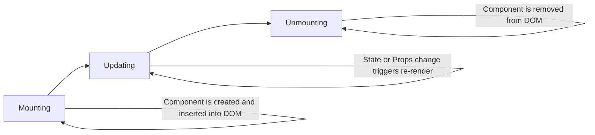

**useEffect Syntax:**

```jsx
useEffect(() => {
  // Side effect code (runs after render)

  return () => {
    // Cleanup code (runs before next effect or unmount)
  };
}, [dependencies]);
```

**Case 1: Run on Every Render (no dependency array)**

```jsx
useEffect(() => {
  console.log('Component rendered or re-rendered');
});
```

**Case 2: Run Only Once on Mount (empty dependency array)**

```jsx
useEffect(() => {
  console.log('Component mounted');
  // Equivalent to componentDidMount

  return () => {
    console.log('Component will unmount');
    // Equivalent to componentWillUnmount
  };
}, []);
```

**Case 3: Run When Specific Dependencies Change**

```jsx
useEffect(() => {
  console.log(`Count changed to: ${count}`);
  // Equivalent to componentDidUpdate for "count"
}, [count]);
```

**Practical Example 1: Fetching Data on Mount**

```jsx
function StudentList() {
  const [students, setStudents] = useState([]);
  const [loading, setLoading] = useState(true);

  useEffect(() => {
    fetch('http://localhost:8080/api/students')
      .then((response) => response.json())
      .then((data) => {
        setStudents(data);
        setLoading(false);
      })
      .catch((error) => {
        console.error('Error fetching students:', error);
        setLoading(false);
      });
  }, []); // Empty array: fetch only once on mount

  if (loading) return <p>Loading...</p>;

  return (
    <ul>
      {students.map((s) => (
        <li key={s.id}>{s.name} - {s.branch}</li>
      ))}
    </ul>
  );
}
```

**Practical Example 2: Document Title Update**

```jsx
function PageTitle() {
  const [count, setCount] = useState(0);

  useEffect(() => {
    document.title = `You clicked ${count} times`;
  }, [count]);

  return <button onClick={() => setCount(count + 1)}>Click me</button>;
}
```

**Practical Example 3: Timer with Cleanup**

```jsx
function Timer() {
  const [seconds, setSeconds] = useState(0);

  useEffect(() => {
    const interval = setInterval(() => {
      setSeconds((prev) => prev + 1);
    }, 1000);

    // Cleanup: clear interval when component unmounts
    return () => clearInterval(interval);
  }, []);

  return <p>Timer: {seconds} seconds</p>;
}
```

**Lifecycle Mapping (Class vs Function Components):**

| Class Component Method | useEffect Equivalent |
|------------------------|---------------------|
| `componentDidMount` | `useEffect(() => {}, [])` |
| `componentDidUpdate` | `useEffect(() => {}, [dep])` |
| `componentWillUnmount` | `return () => {}` inside useEffect |

**Conclusion:**
The `useEffect` hook unifies all lifecycle-related logic in function components. By varying the dependency array, you control when effects run. Always clean up subscriptions, timers, and event listeners to prevent memory leaks. The declarative nature of `useEffect` makes it easier to reason about side effects compared to class lifecycle methods.

---

### E6. Explain event handling in React with examples

**Introduction:**
Event handling in React allows components to respond to user interactions such as clicks, form submissions, keyboard input, and mouse movements. React uses a synthetic event system that wraps native browser events for cross-browser compatibility.

**Key Differences from HTML Event Handling:**

| HTML | React |
|------|-------|
| `onclick="handleClick()"` | `onClick={handleClick}` |
| Event names in lowercase | Event names in camelCase |
| String as event handler | Function reference as handler |
| `return false` to prevent default | Must call `e.preventDefault()` |

**Basic Click Event:**

```jsx
function ClickDemo() {
  const handleClick = () => {
    alert('Button was clicked!');
  };

  return <button onClick={handleClick}>Click Me</button>;
}
```

**Passing Arguments to Event Handlers:**

```jsx
function FruitList() {
  const handleSelect = (fruit) => {
    alert(`You selected: ${fruit}`);
  };

  return (
    <div>
      <button onClick={() => handleSelect('Apple')}>Apple</button>
      <button onClick={() => handleSelect('Banana')}>Banana</button>
      <button onClick={() => handleSelect('Mango')}>Mango</button>
    </div>
  );
}
```

**Event Object (SyntheticEvent):**

```jsx
function InputTracker() {
  const handleChange = (e) => {
    console.log('Input name:', e.target.name);
    console.log('Input value:', e.target.value);
    console.log('Event type:', e.type);
  };

  return (
    <input
      name="username"
      onChange={handleChange}
      placeholder="Type something"
    />
  );
}
```

**Preventing Default Behavior:**

```jsx
function LoginForm() {
  const handleSubmit = (e) => {
    e.preventDefault(); // Prevents page reload
    console.log('Form submitted!');
  };

  return (
    <form onSubmit={handleSubmit}>
      <input type="text" placeholder="Username" />
      <input type="password" placeholder="Password" />
      <button type="submit">Login</button>
    </form>
  );
}
```

**Keyboard Events:**

```jsx
function KeyboardDemo() {
  const handleKeyDown = (e) => {
    if (e.key === 'Enter') {
      console.log('Enter key pressed!');
    }
  };

  return <input onKeyDown={handleKeyDown} placeholder="Press Enter" />;
}
```

**Mouse Events:**

```jsx
function MouseDemo() {
  const [position, setPosition] = useState({ x: 0, y: 0 });

  const handleMouseMove = (e) => {
    setPosition({ x: e.clientX, y: e.clientY });
  };

  return (
    <div onMouseMove={handleMouseMove} style={{ height: '200px', border: '1px solid black' }}>
      <p>Mouse position: ({position.x}, {position.y})</p>
    </div>
  );
}
```

**Common React Events:**

| Category | Events |
|----------|--------|
| Mouse | `onClick`, `onDoubleClick`, `onMouseEnter`, `onMouseLeave` |
| Form | `onChange`, `onSubmit`, `onFocus`, `onBlur` |
| Keyboard | `onKeyDown`, `onKeyUp`, `onKeyPress` |
| Clipboard | `onCopy`, `onCut`, `onPaste` |

**Conclusion:**
React's event handling system provides a consistent, cross-browser API via synthetic events. Events use camelCase naming and accept function references rather than strings. The synthetic event wrapper ensures that events behave identically across all browsers. Proper use of `e.preventDefault()` and event handler functions enables clean, predictable user interaction handling.

---

### E7. Explain controlled vs uncontrolled components with form examples

**Introduction:**
React offers two approaches to handling form elements: controlled components (React manages the form state) and uncontrolled components (the DOM manages the form state). Understanding both is essential for building forms in React.

**Controlled Components:**

In a controlled component, the form element's value is bound to React state. Every change is handled through an event handler that updates the state:

```jsx
function ControlledForm() {
  const [name, setName] = useState('');
  const [email, setEmail] = useState('');

  const handleSubmit = (e) => {
    e.preventDefault();
    console.log('Submitted:', { name, email });
  };

  return (
    <form onSubmit={handleSubmit}>
      <label>
        Name:
        <input
          type="text"
          value={name}
          onChange={(e) => setName(e.target.value)}
        />
      </label>
      <label>
        Email:
        <input
          type="email"
          value={email}
          onChange={(e) => setEmail(e.target.value)}
        />
      </label>
      <button type="submit">Submit</button>
    </form>
  );
}
```

**How Controlled Components Work:**

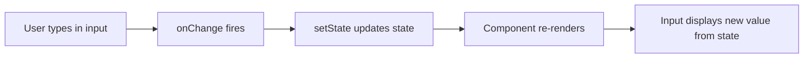

**Uncontrolled Components:**

In an uncontrolled component, form data is handled by the DOM itself. You use a `ref` to access the form values when needed:

```jsx
import { useRef } from 'react';

function UncontrolledForm() {
  const nameRef = useRef(null);
  const emailRef = useRef(null);

  const handleSubmit = (e) => {
    e.preventDefault();
    console.log('Name:', nameRef.current.value);
    console.log('Email:', emailRef.current.value);
  };

  return (
    <form onSubmit={handleSubmit}>
      <label>
        Name:
        <input type="text" ref={nameRef} defaultValue="" />
      </label>
      <label>
        Email:
        <input type="email" ref={emailRef} defaultValue="" />
      </label>
      <button type="submit">Submit</button>
    </form>
  );
}
```

**Comparison:**

| Feature | Controlled | Uncontrolled |
|---------|-----------|-------------|
| Data source | React state | DOM |
| Value access | Via state variable | Via ref |
| Validation | On every change (real-time) | On submit |
| Attribute for initial value | `value` | `defaultValue` |
| Re-renders | On every keystroke | No re-renders on input |
| Control level | Full control | Minimal control |
| Use case | Complex forms, validation | Simple forms, file inputs |

**Controlled Select and Textarea:**

```jsx
function ControlledSelect() {
  const [branch, setBranch] = useState('IT');
  const [bio, setBio] = useState('');

  return (
    <div>
      <select value={branch} onChange={(e) => setBranch(e.target.value)}>
        <option value="IT">Information Technology</option>
        <option value="CSE">Computer Science</option>
        <option value="ECE">Electronics</option>
      </select>

      <textarea
        value={bio}
        onChange={(e) => setBio(e.target.value)}
        placeholder="Write a short bio"
      />
    </div>
  );
}
```

**When to Use Which:**
- **Controlled:** Recommended for most use cases. Provides instant validation, conditional disabling of submit buttons, enforcing input formats, and dynamic form behavior.
- **Uncontrolled:** Suitable for simple forms, integrating with non-React code, or handling file inputs (`<input type="file" />` is always uncontrolled in React).

**Conclusion:**
Controlled components give React full authority over form data, enabling real-time validation and responsive UIs. Uncontrolled components are simpler but offer less control. In most React applications, controlled components are the recommended approach because they align with React's declarative philosophy and unidirectional data flow.

---

### E8. Explain how to render lists and the importance of keys with examples

**Introduction:**
Rendering collections of data as lists is one of the most common tasks in React. JavaScript's `map()` method is used to transform arrays of data into arrays of JSX elements. Keys play a critical role in helping React identify changes in the list efficiently.

**Basic List Rendering:**

```jsx
function StudentList() {
  const students = ['Rahul', 'Priya', 'Anil', 'Sneha'];

  return (
    <ul>
      {students.map((student, index) => (
        <li key={index}>{student}</li>
      ))}
    </ul>
  );
}
```

**Rendering a List of Objects:**

```jsx
function StudentTable() {
  const students = [
    { id: 1, name: 'Rahul', rollNo: '21B01A1234', cgpa: 8.5 },
    { id: 2, name: 'Priya', rollNo: '21B01A1235', cgpa: 9.1 },
    { id: 3, name: 'Anil', rollNo: '21B01A1236', cgpa: 7.8 }
  ];

  return (
    <table>
      <thead>
        <tr>
          <th>Name</th>
          <th>Roll No</th>
          <th>CGPA</th>
        </tr>
      </thead>
      <tbody>
        {students.map((student) => (
          <tr key={student.id}>
            <td>{student.name}</td>
            <td>{student.rollNo}</td>
            <td>{student.cgpa}</td>
          </tr>
        ))}
      </tbody>
    </table>
  );
}
```

**Why Keys are Important:**

Keys tell React which items have changed, been added, or removed. Without proper keys, React may:
- Unnecessarily re-render the entire list
- Mix up component state between items
- Produce incorrect UI updates

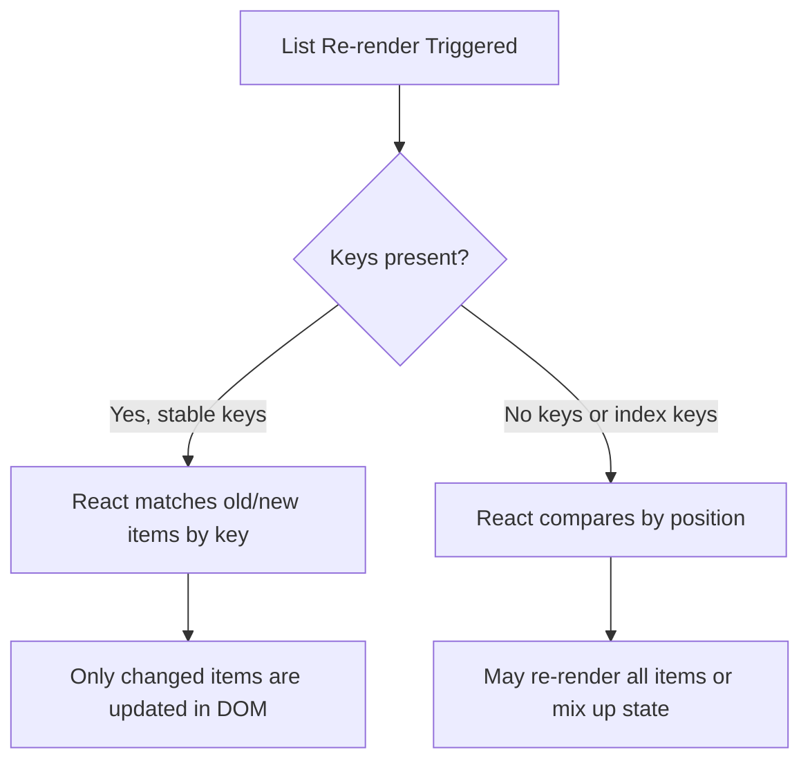

**Rules for Keys:**
1. Keys must be **unique among siblings** (not globally unique).
2. Keys should be **stable** -- the same item should always have the same key.
3. Use data IDs as keys, not array indices (indices can cause issues with reordering).
4. Keys are not passed as props to the component -- they are used internally by React.

**Bad Practice -- Using Index as Key (with dynamic lists):**

```jsx
// Problematic when items can be reordered, inserted, or deleted
{todos.map((todo, index) => (
  <TodoItem key={index} todo={todo} />
))}
```

If you add an item at the beginning, every item's index shifts, causing React to re-render all of them.

**Good Practice -- Using Unique IDs:**

```jsx
{todos.map((todo) => (
  <TodoItem key={todo.id} todo={todo} />
))}
```

**Extracting List Items into Components:**

```jsx
function StudentCard({ student }) {
  return (
    <div className="card">
      <h3>{student.name}</h3>
      <p>Roll No: {student.rollNo}</p>
    </div>
  );
}

function StudentDirectory() {
  const students = [
    { id: 1, name: 'Rahul', rollNo: '21B01A1234' },
    { id: 2, name: 'Priya', rollNo: '21B01A1235' }
  ];

  return (
    <div>
      {students.map((student) => (
        <StudentCard key={student.id} student={student} />
      ))}
    </div>
  );
}
```

Note: The `key` is placed on `<StudentCard>` (the element in the array), not inside the `StudentCard` component.

**Conclusion:**
List rendering with `map()` is fundamental in React. Keys are essential for React's reconciliation algorithm to efficiently update the DOM. Always use unique, stable identifiers from your data as keys. Avoid using array indices as keys for dynamic lists where items can be added, removed, or reordered.

---

### E9. Explain conditional rendering techniques in React with examples

**Introduction:**
Conditional rendering in React refers to displaying different UI elements or components based on certain conditions. React does not have special directives for this (unlike Angular's `*ngIf`); instead, it uses standard JavaScript operators and expressions within JSX.

**Technique 1: if/else Statement**

Used when the rendering logic is complex or when returning entirely different components:

```jsx
function Greeting({ isLoggedIn }) {
  if (isLoggedIn) {
    return <h1>Welcome back, User!</h1>;
  }
  return <h1>Please sign in.</h1>;
}
```

**Technique 2: Ternary Operator**

Best for inline conditional rendering within JSX:

```jsx
function UserStatus({ isLoggedIn }) {
  return (
    <div>
      <h1>{isLoggedIn ? 'Welcome back!' : 'Please sign in'}</h1>
      <button>{isLoggedIn ? 'Logout' : 'Login'}</button>
    </div>
  );
}
```

**Technique 3: Logical AND (&&) Operator**

Used when you want to render something or nothing:

```jsx
function Notifications({ messages }) {
  return (
    <div>
      <h1>Dashboard</h1>
      {messages.length > 0 && (
        <p>You have {messages.length} unread messages.</p>
      )}
    </div>
  );
}
```

**Technique 4: Switch Statement**

Useful for multiple conditions:

```jsx
function StatusBadge({ status }) {
  const renderBadge = () => {
    switch (status) {
      case 'active':
        return <span style={{ color: 'green' }}>Active</span>;
      case 'inactive':
        return <span style={{ color: 'red' }}>Inactive</span>;
      case 'pending':
        return <span style={{ color: 'orange' }}>Pending</span>;
      default:
        return <span>Unknown</span>;
    }
  };

  return <div>Status: {renderBadge()}</div>;
}
```

**Technique 5: Element Variables**

Store elements in variables before returning:

```jsx
function LoginControl() {
  const [isLoggedIn, setIsLoggedIn] = useState(false);

  let button;
  if (isLoggedIn) {
    button = <button onClick={() => setIsLoggedIn(false)}>Logout</button>;
  } else {
    button = <button onClick={() => setIsLoggedIn(true)}>Login</button>;
  }

  return (
    <div>
      <Greeting isLoggedIn={isLoggedIn} />
      {button}
    </div>
  );
}
```

**Technique 6: Preventing Component from Rendering (return null)**

```jsx
function WarningBanner({ showWarning }) {
  if (!showWarning) {
    return null; // Component renders nothing
  }

  return <div className="warning">Warning: Low disk space!</div>;
}
```

**Practical Example: Loading, Error, and Data States**

```jsx
function DataFetcher() {
  const [data, setData] = useState(null);
  const [loading, setLoading] = useState(true);
  const [error, setError] = useState(null);

  useEffect(() => {
    fetch('/api/students')
      .then((res) => res.json())
      .then((data) => {
        setData(data);
        setLoading(false);
      })
      .catch((err) => {
        setError(err.message);
        setLoading(false);
      });
  }, []);

  if (loading) return <p>Loading...</p>;
  if (error) return <p>Error: {error}</p>;
  if (!data || data.length === 0) return <p>No students found.</p>;

  return (
    <ul>
      {data.map((student) => (
        <li key={student.id}>{student.name}</li>
      ))}
    </ul>
  );
}
```

**Summary of Techniques:**

| Technique | Best For |
|-----------|----------|
| `if/else` | Complex logic, early returns |
| Ternary `? :` | Inline either/or rendering |
| `&&` | Show or hide a single element |
| `switch` | Multiple distinct conditions |
| Element variables | Complex conditional setup |
| `return null` | Preventing rendering entirely |

**Conclusion:**
React leverages standard JavaScript for conditional rendering, making it flexible and expressive. The choice of technique depends on the complexity of the condition and where it appears (inside JSX vs. outside). These patterns are used extensively in real-world applications for handling loading states, authentication views, role-based rendering, and responsive layouts.

---

### E10. Explain React Router and how to build a SPA with code examples

**Introduction:**
React Router is the standard library for routing in React applications. It enables building Single Page Applications where navigation between views happens on the client side without full page reloads.

**Installation:**

```bash
npm install react-router-dom
```

**Core Components of React Router:**

| Component | Purpose |
|-----------|---------|
| `BrowserRouter` | Wraps the app; uses HTML5 history API |
| `Routes` | Container for `Route` definitions |
| `Route` | Maps a URL path to a component |
| `Link` | Navigation without page reload |
| `NavLink` | Link with active state styling |
| `Outlet` | Renders child route components (nested routes) |
| `useNavigate` | Programmatic navigation hook |
| `useParams` | Access URL parameters |

**Basic SPA Setup:**

**main.jsx:**
```jsx
import React from 'react';
import ReactDOM from 'react-dom/client';
import { BrowserRouter } from 'react-router-dom';
import App from './App';

ReactDOM.createRoot(document.getElementById('root')).render(
  <React.StrictMode>
    <BrowserRouter>
      <App />
    </BrowserRouter>
  </React.StrictMode>
);
```

**App.jsx:**
```jsx
import { Routes, Route } from 'react-router-dom';
import Navbar from './components/Navbar';
import Home from './pages/Home';
import About from './pages/About';
import Students from './pages/Students';
import StudentDetail from './pages/StudentDetail';
import NotFound from './pages/NotFound';

function App() {
  return (
    <div>
      <Navbar />
      <Routes>
        <Route path="/" element={<Home />} />
        <Route path="/about" element={<About />} />
        <Route path="/students" element={<Students />} />
        <Route path="/students/:id" element={<StudentDetail />} />
        <Route path="*" element={<NotFound />} />
      </Routes>
    </div>
  );
}

export default App;
```

**Navbar with NavLink:**
```jsx
import { NavLink } from 'react-router-dom';

function Navbar() {
  return (
    <nav>
      <NavLink to="/" className={({ isActive }) => isActive ? 'active' : ''}>
        Home
      </NavLink>
      <NavLink to="/about" className={({ isActive }) => isActive ? 'active' : ''}>
        About
      </NavLink>
      <NavLink to="/students" className={({ isActive }) => isActive ? 'active' : ''}>
        Students
      </NavLink>
    </nav>
  );
}

export default Navbar;
```

**Route Parameters with useParams:**
```jsx
import { useParams } from 'react-router-dom';

function StudentDetail() {
  const { id } = useParams();
  const [student, setStudent] = useState(null);

  useEffect(() => {
    fetch(`http://localhost:8080/api/students/${id}`)
      .then((res) => res.json())
      .then((data) => setStudent(data));
  }, [id]);

  if (!student) return <p>Loading...</p>;

  return (
    <div>
      <h1>{student.name}</h1>
      <p>Roll No: {student.rollNo}</p>
      <p>Branch: {student.branch}</p>
    </div>
  );
}
```

**Programmatic Navigation with useNavigate:**
```jsx
import { useNavigate } from 'react-router-dom';

function LoginPage() {
  const navigate = useNavigate();

  const handleLogin = () => {
    // After successful authentication
    navigate('/dashboard');
  };

  return (
    <div>
      <h1>Login</h1>
      <button onClick={handleLogin}>Login</button>
    </div>
  );
}
```

**SPA Architecture:**

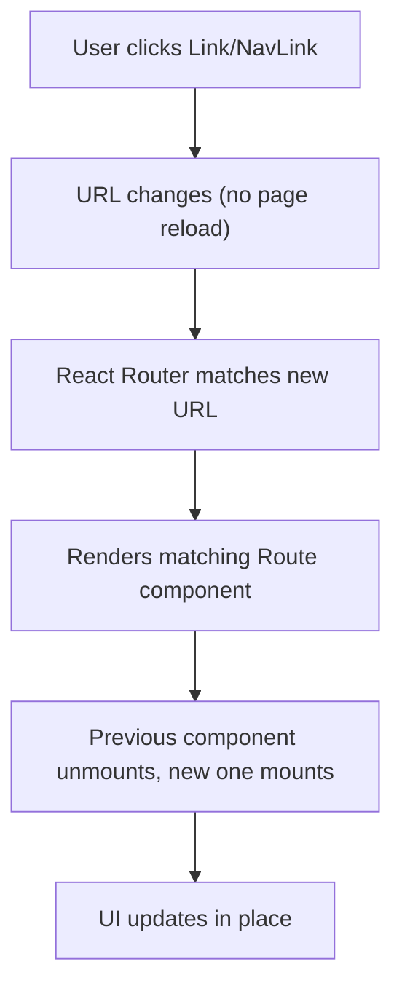

**Nested Routes:**
```jsx
function App() {
  return (
    <Routes>
      <Route path="/" element={<Layout />}>
        <Route index element={<Home />} />
        <Route path="students" element={<Students />} />
        <Route path="students/:id" element={<StudentDetail />} />
      </Route>
    </Routes>
  );
}

function Layout() {
  return (
    <div>
      <Navbar />
      <main>
        <Outlet /> {/* Child routes render here */}
      </main>
      <footer>Footer Content</footer>
    </div>
  );
}
```

**Conclusion:**
React Router transforms a React application into a SPA by handling navigation on the client side. It provides declarative route definitions, URL parameters, programmatic navigation, nested routes, and active link styling. Combined with React's component model, it enables building fast, seamless multi-view applications without full page reloads.

---

### E11. Explain how to create a React application using Vite

**Introduction:**
Vite is a modern build tool that provides a faster and leaner development experience compared to older tools like Create React App (CRA). It leverages native ES modules and provides lightning-fast Hot Module Replacement (HMR).

**Why Vite over CRA?**

| Feature | Vite | Create React App (CRA) |
|---------|------|----------------------|
| Dev server startup | Near-instant (native ESM) | Slow (bundles everything first) |
| HMR speed | Milliseconds | Seconds |
| Build tool | Rollup (optimized) | Webpack |
| Configuration | Minimal, extensible | Hidden, requires eject |
| Bundle size | Smaller | Larger |
| Active maintenance | Yes | Deprecated |

**Step 1: Prerequisites**

Ensure Node.js 20 LTS is installed:
```bash
node --version    # Should show v20.x.x
npm --version     # Should show 10.x.x
```

**Step 2: Create the Project**

```bash
npm create vite@latest my-react-app -- --template react
```

This creates a new directory `my-react-app` with the React template.

**Step 3: Install Dependencies and Start**

```bash
cd my-react-app
npm install
npm run dev
```

The development server starts at `http://localhost:5173/`.

**Project Structure:**

```
my-react-app/
  ├── node_modules/
  ├── public/
  │   └── vite.svg
  ├── src/
  │   ├── assets/
  │   │   └── react.svg
  │   ├── App.css
  │   ├── App.jsx
  │   ├── index.css
  │   └── main.jsx
  ├── .gitignore
  ├── index.html
  ├── package.json
  └── vite.config.js
```

**Key Files Explained:**

**index.html** (entry point):
```html
<!DOCTYPE html>
<html lang="en">
  <head>
    <meta charset="UTF-8" />
    <meta name="viewport" content="width=device-width, initial-scale=1.0" />
    <title>My React App</title>
  </head>
  <body>
    <div id="root"></div>
    <script type="module" src="/src/main.jsx"></script>
  </body>
</html>
```

**src/main.jsx** (React entry point):
```jsx
import React from 'react';
import ReactDOM from 'react-dom/client';
import App from './App';
import './index.css';

ReactDOM.createRoot(document.getElementById('root')).render(
  <React.StrictMode>
    <App />
  </React.StrictMode>
);
```

**src/App.jsx** (root component):
```jsx
import { useState } from 'react';
import './App.css';

function App() {
  const [count, setCount] = useState(0);

  return (
    <div>
      <h1>Hello React with Vite!</h1>
      <button onClick={() => setCount(count + 1)}>
        Count: {count}
      </button>
    </div>
  );
}

export default App;
```

**vite.config.js:**
```jsx
import { defineConfig } from 'vite';
import react from '@vitejs/plugin-react';

export default defineConfig({
  plugins: [react()],
  server: {
    port: 5173
  }
});
```

**Available Scripts:**

| Command | Purpose |
|---------|---------|
| `npm run dev` | Start development server with HMR |
| `npm run build` | Build for production (output in `dist/`) |
| `npm run preview` | Preview production build locally |

**Step 4: Add Dependencies (example)**

```bash
npm install react-router-dom
npm install axios
```

**How Vite Works:**

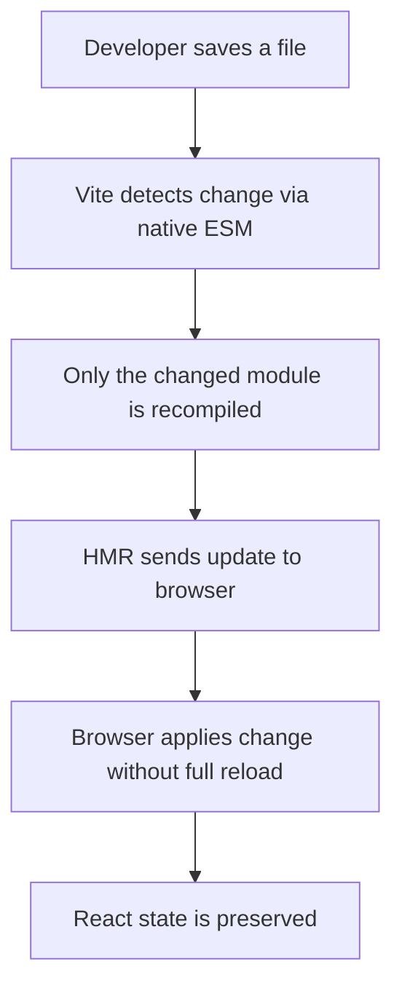

**Conclusion:**
Vite provides a modern, fast development environment for React applications. Its use of native ES modules eliminates the bundling step during development, resulting in near-instant server startup and updates. With React 18.x and Node.js 20 LTS, Vite is the recommended way to create new React projects, replacing the deprecated Create React App.

---

### E12. Explain how to add React to an existing website

**Introduction:**
React can be incrementally adopted into an existing website without rewriting the entire application. You can add React to specific sections of a page while keeping the rest of the site unchanged. This is useful for adding interactive widgets to static HTML sites, WordPress pages, or server-rendered applications.

**Approach 1: Using CDN Script Tags (Quick Setup)**

Add React directly to an HTML page via CDN links:

```html
<!DOCTYPE html>
<html>
<head>
  <title>My Website</title>
</head>
<body>
  <h1>My Existing Website</h1>
  <p>This is regular HTML content.</p>

  <!-- Container for React component -->
  <div id="react-root"></div>

  <!-- Load React from CDN -->
  <script crossorigin src="https://unpkg.com/react@18/umd/react.production.min.js"></script>
  <script crossorigin src="https://unpkg.com/react-dom@18/umd/react-dom.production.min.js"></script>

  <!-- Your React component -->
  <script>
    const root = ReactDOM.createRoot(document.getElementById('react-root'));
    root.render(
      React.createElement('div', null,
        React.createElement('h2', null, 'Hello from React!'),
        React.createElement('p', null, 'This section is powered by React.')
      )
    );
  </script>
</body>
</html>
```

**Approach 2: Using CDN with JSX (via Babel)**

To use JSX syntax with CDN setup, add Babel standalone:

```html
<!DOCTYPE html>
<html>
<head>
  <title>React on Existing Website</title>
</head>
<body>
  <h1>My Existing Website</h1>

  <div id="like-button-root"></div>

  <script crossorigin src="https://unpkg.com/react@18/umd/react.production.min.js"></script>
  <script crossorigin src="https://unpkg.com/react-dom@18/umd/react-dom.production.min.js"></script>
  <script src="https://unpkg.com/@babel/standalone/babel.min.js"></script>

  <script type="text/babel">
    function LikeButton() {
      const [liked, setLiked] = React.useState(false);

      if (liked) {
        return <span>You liked this!</span>;
      }

      return (
        <button onClick={() => setLiked(true)}>
          Like
        </button>
      );
    }

    const root = ReactDOM.createRoot(document.getElementById('like-button-root'));
    root.render(<LikeButton />);
  </script>
</body>
</html>
```

> Note: Babel standalone is intended for development/prototyping only. For production, use a build tool.

**Approach 3: Using a Build Tool (Recommended for Production)**

For production-ready integration, add a build step:

**Step 1:** Initialize npm and install dependencies:
```bash
npm init -y
npm install react react-dom
npm install -D vite @vitejs/plugin-react
```

**Step 2:** Create the React component:
```jsx
// src/components/ContactForm.jsx
import { useState } from 'react';

function ContactForm() {
  const [formData, setFormData] = useState({ name: '', email: '', message: '' });

  const handleChange = (e) => {
    setFormData({ ...formData, [e.target.name]: e.target.value });
  };

  const handleSubmit = (e) => {
    e.preventDefault();
    alert(`Message from ${formData.name}: ${formData.message}`);
  };

  return (
    <form onSubmit={handleSubmit}>
      <input name="name" value={formData.name} onChange={handleChange} placeholder="Name" />
      <input name="email" value={formData.email} onChange={handleChange} placeholder="Email" />
      <textarea name="message" value={formData.message} onChange={handleChange} placeholder="Message" />
      <button type="submit">Send</button>
    </form>
  );
}

export default ContactForm;
```

**Step 3:** Mount the component:
```jsx
// src/mount-contact-form.jsx
import React from 'react';
import ReactDOM from 'react-dom/client';
import ContactForm from './components/ContactForm';

const container = document.getElementById('contact-form-root');
if (container) {
  const root = ReactDOM.createRoot(container);
  root.render(<ContactForm />);
}
```

**Step 4:** Include in the existing HTML:
```html
<div id="contact-form-root"></div>
<script type="module" src="/src/mount-contact-form.jsx"></script>
```

**Multiple React Roots:**

You can mount multiple independent React components on the same page:

```html
<div id="header-widget"></div>
<div id="sidebar-widget"></div>
<div id="footer-widget"></div>

<script type="module">
  // Each widget is an independent React root
  import { renderHeader } from './widgets/header.jsx';
  import { renderSidebar } from './widgets/sidebar.jsx';
  import { renderFooter } from './widgets/footer.jsx';
</script>
```

**Conclusion:**
React's flexibility allows it to be added incrementally to any existing website. For quick prototyping, CDN scripts work well. For production applications, using Vite as a build tool ensures optimized bundles, JSX support, and HMR during development. Multiple independent React roots can coexist on the same page, each managing its own section of the UI.

---

### E13. Explain form handling and validation in React with a complete example

**Introduction:**
Forms are essential in web applications for collecting user input. React handles forms through controlled components where form state is managed by React. Validation ensures data integrity before submission.

**Complete Student Registration Form with Validation:**

```jsx
import { useState } from 'react';

function StudentRegistrationForm() {
  const [formData, setFormData] = useState({
    name: '',
    rollNo: '',
    email: '',
    branch: '',
    semester: '',
    phone: ''
  });

  const [errors, setErrors] = useState({});
  const [submitted, setSubmitted] = useState(false);

  // Validation function
  const validate = () => {
    const newErrors = {};

    if (!formData.name.trim()) {
      newErrors.name = 'Name is required';
    }

    if (!formData.rollNo.trim()) {
      newErrors.rollNo = 'Roll number is required';
    } else if (!/^[0-9]{2}[A-Z]{1}[0-9]{2}[A-Z]{1}[0-9]{4}$/.test(formData.rollNo)) {
      newErrors.rollNo = 'Invalid roll number format (e.g., 21B01A1234)';
    }

    if (!formData.email.trim()) {
      newErrors.email = 'Email is required';
    } else if (!/\S+@\S+\.\S+/.test(formData.email)) {
      newErrors.email = 'Invalid email format';
    }

    if (!formData.branch) {
      newErrors.branch = 'Please select a branch';
    }

    if (!formData.semester) {
      newErrors.semester = 'Please select a semester';
    }

    if (formData.phone && !/^[0-9]{10}$/.test(formData.phone)) {
      newErrors.phone = 'Phone number must be 10 digits';
    }

    return newErrors;
  };

  // Handle input changes
  const handleChange = (e) => {
    const { name, value } = e.target;
    setFormData((prev) => ({
      ...prev,
      [name]: value
    }));

    // Clear error for the field being edited
    if (errors[name]) {
      setErrors((prev) => ({
        ...prev,
        [name]: ''
      }));
    }
  };

  // Handle form submission
  const handleSubmit = (e) => {
    e.preventDefault();
    const validationErrors = validate();

    if (Object.keys(validationErrors).length > 0) {
      setErrors(validationErrors);
      return;
    }

    console.log('Form submitted:', formData);
    setSubmitted(true);
  };

  // Handle form reset
  const handleReset = () => {
    setFormData({
      name: '', rollNo: '', email: '', branch: '', semester: '', phone: ''
    });
    setErrors({});
    setSubmitted(false);
  };

  if (submitted) {
    return (
      <div>
        <h2>Registration Successful!</h2>
        <p>Name: {formData.name}</p>
        <p>Roll No: {formData.rollNo}</p>
        <p>Email: {formData.email}</p>
        <p>Branch: {formData.branch}</p>
        <button onClick={handleReset}>Register Another</button>
      </div>
    );
  }

  return (
    <form onSubmit={handleSubmit}>
      <h2>Student Registration</h2>

      <div>
        <label htmlFor="name">Name *</label>
        <input
          id="name"
          name="name"
          type="text"
          value={formData.name}
          onChange={handleChange}
        />
        {errors.name && <span className="error">{errors.name}</span>}
      </div>

      <div>
        <label htmlFor="rollNo">Roll Number *</label>
        <input
          id="rollNo"
          name="rollNo"
          type="text"
          value={formData.rollNo}
          onChange={handleChange}
          placeholder="e.g., 21B01A1234"
        />
        {errors.rollNo && <span className="error">{errors.rollNo}</span>}
      </div>

      <div>
        <label htmlFor="email">Email *</label>
        <input
          id="email"
          name="email"
          type="email"
          value={formData.email}
          onChange={handleChange}
        />
        {errors.email && <span className="error">{errors.email}</span>}
      </div>

      <div>
        <label htmlFor="branch">Branch *</label>
        <select id="branch" name="branch" value={formData.branch} onChange={handleChange}>
          <option value="">-- Select Branch --</option>
          <option value="IT">Information Technology</option>
          <option value="CSE">Computer Science</option>
          <option value="ECE">Electronics</option>
          <option value="EEE">Electrical</option>
        </select>
        {errors.branch && <span className="error">{errors.branch}</span>}
      </div>

      <div>
        <label htmlFor="semester">Semester *</label>
        <select id="semester" name="semester" value={formData.semester} onChange={handleChange}>
          <option value="">-- Select Semester --</option>
          {[1, 2, 3, 4, 5, 6, 7, 8].map((sem) => (
            <option key={sem} value={sem}>Semester {sem}</option>
          ))}
        </select>
        {errors.semester && <span className="error">{errors.semester}</span>}
      </div>

      <div>
        <label htmlFor="phone">Phone (optional)</label>
        <input
          id="phone"
          name="phone"
          type="tel"
          value={formData.phone}
          onChange={handleChange}
        />
        {errors.phone && <span className="error">{errors.phone}</span>}
      </div>

      <div>
        <button type="submit">Register</button>
        <button type="button" onClick={handleReset}>Reset</button>
      </div>
    </form>
  );
}

export default StudentRegistrationForm;
```

**Form Handling Flow:**

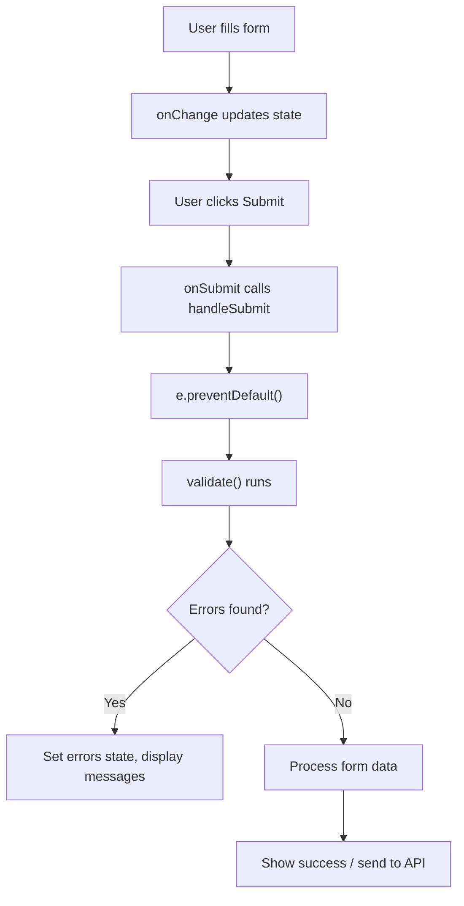

**Key Concepts Demonstrated:**
1. **Controlled components** -- all inputs bound to state via `value` and `onChange`
2. **Validation on submit** -- errors are checked before processing
3. **Real-time error clearing** -- errors clear as the user corrects input
4. **Form reset** -- state is reset to initial values
5. **Conditional rendering** -- success view replaces form after submission
6. **Accessible forms** -- `htmlFor` and `id` attributes link labels to inputs

**Conclusion:**
React's controlled component pattern gives full control over form data. Validation logic can be customized to any requirement. The pattern of storing form data in a single state object and errors in another is a scalable approach. For larger applications, libraries like Formik or React Hook Form can further simplify form management.

---

### E14. Explain the data flow in React (one-way data binding) with a diagram

**Introduction:**
React follows a unidirectional (one-way) data flow model. Data moves from parent components to child components through props, never the other way around directly. This makes the application's data flow predictable, easier to debug, and simpler to understand.

**One-Way Data Binding:**

In one-way data binding, the data has a single source of truth (the component's state), and changes flow in one direction:

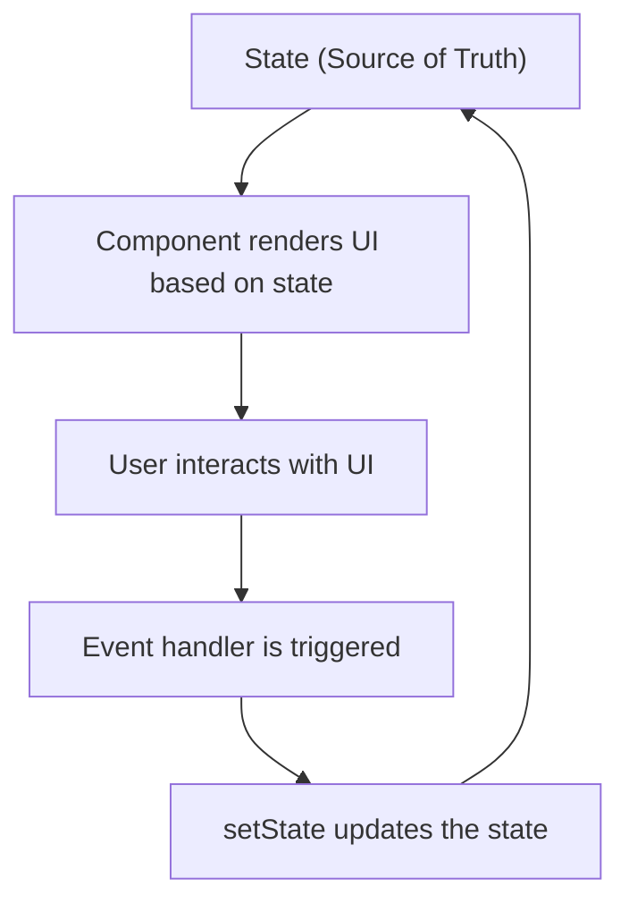

**Comparison with Two-Way Data Binding:**

| Feature | One-Way (React) | Two-Way (Angular) |
|---------|----------------|-------------------|
| Data flow | Parent to Child | UI and Model sync both ways |
| Control | Explicit updates via setState | Automatic sync via ngModel |
| Debugging | Easier to trace | Harder with circular updates |
| Performance | Predictable re-renders | May cause unexpected updates |

**Parent-to-Child Data Flow:**

```jsx
function App() {
  const [temperature, setTemperature] = useState(30);

  return (
    <div>
      <h1>Weather App</h1>
      <TemperatureInput value={temperature} onChange={setTemperature} />
      <TemperatureDisplay celsius={temperature} />
      <WeatherAdvice temperature={temperature} />
    </div>
  );
}

function TemperatureInput({ value, onChange }) {
  return (
    <input
      type="number"
      value={value}
      onChange={(e) => onChange(Number(e.target.value))}
    />
  );
}

function TemperatureDisplay({ celsius }) {
  const fahrenheit = (celsius * 9) / 5 + 32;
  return (
    <p>{celsius}°C = {fahrenheit.toFixed(1)}°F</p>
  );
}

function WeatherAdvice({ temperature }) {
  let advice;
  if (temperature > 35) advice = 'Stay hydrated!';
  else if (temperature > 20) advice = 'Nice weather!';
  else advice = 'Wear warm clothes!';

  return <p>Advice: {advice}</p>;
}
```

**Data Flow Diagram for the Above Example:**

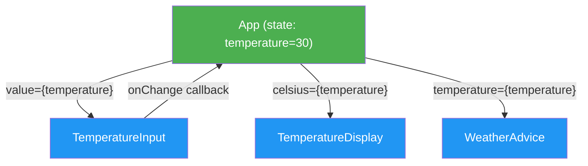

**Child-to-Parent Communication (Lifting State Up):**

When two sibling components need to share data, the shared state is "lifted up" to their common parent:

```jsx
function Parent() {
  const [sharedData, setSharedData] = useState('');

  return (
    <div>
      <ChildA onDataChange={setSharedData} />
      <ChildB data={sharedData} />
    </div>
  );
}

function ChildA({ onDataChange }) {
  return (
    <input
      onChange={(e) => onDataChange(e.target.value)}
      placeholder="Type here..."
    />
  );
}

function ChildB({ data }) {
  return <p>Received from sibling: {data}</p>;
}
```

**Lifting State Up - Flow:**

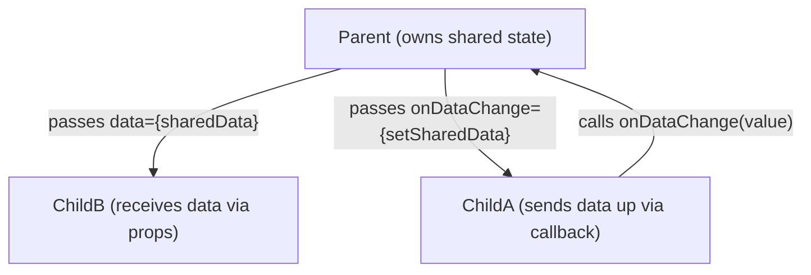

**Key Principles of React Data Flow:**

1. **Single source of truth** -- State is owned by one component and passed down.
2. **Props are read-only** -- Children cannot modify props directly.
3. **State changes trigger re-renders** -- When parent state changes, children re-render with new props.
4. **Callbacks for upward communication** -- Parents pass functions to children for sending data back.
5. **Lift state up** -- Shared state moves to the nearest common ancestor.

**Benefits of One-Way Data Flow:**
- Easier to debug (you can trace where data comes from)
- Predictable rendering behavior
- Clear component responsibilities
- Simpler testing (components are pure functions of their props)

**Conclusion:**
React's one-way data flow is a fundamental design principle that ensures predictable state management. Data flows downward through props, and events flow upward through callbacks. When multiple components need the same data, the state is lifted to their closest common ancestor. This architecture makes React applications maintainable, testable, and scalable.

---

### E15. Explain how to build a Student Management frontend with React

**Introduction:**
A Student Management System is a practical application that demonstrates all core React concepts: components, state, props, event handling, forms, lists, conditional rendering, and routing. This example builds a frontend that communicates with a Spring Boot REST API backend.

**Project Setup:**

```bash
npm create vite@latest student-management -- --template react
cd student-management
npm install
npm install react-router-dom axios
```

**Project Structure:**

```
src/
  ├── components/
  │   ├── Navbar.jsx
  │   └── StudentForm.jsx
  ├── pages/
  │   ├── Home.jsx
  │   ├── StudentList.jsx
  │   ├── AddStudent.jsx
  │   └── EditStudent.jsx
  ├── services/
  │   └── studentService.js
  ├── App.jsx
  └── main.jsx
```

**Step 1: API Service Layer**

```jsx
// src/services/studentService.js
import axios from 'axios';

const API_URL = 'http://localhost:8080/api/students';

const studentService = {
  getAll: () => axios.get(API_URL),
  getById: (id) => axios.get(`${API_URL}/${id}`),
  create: (student) => axios.post(API_URL, student),
  update: (id, student) => axios.put(`${API_URL}/${id}`, student),
  delete: (id) => axios.delete(`${API_URL}/${id}`)
};

export default studentService;
```

**Step 2: Main Entry Point**

```jsx
// src/main.jsx
import React from 'react';
import ReactDOM from 'react-dom/client';
import { BrowserRouter } from 'react-router-dom';
import App from './App';
import './index.css';

ReactDOM.createRoot(document.getElementById('root')).render(
  <React.StrictMode>
    <BrowserRouter>
      <App />
    </BrowserRouter>
  </React.StrictMode>
);
```

**Step 3: App with Routing**

```jsx
// src/App.jsx
import { Routes, Route } from 'react-router-dom';
import Navbar from './components/Navbar';
import Home from './pages/Home';
import StudentList from './pages/StudentList';
import AddStudent from './pages/AddStudent';
import EditStudent from './pages/EditStudent';

function App() {
  return (
    <div>
      <Navbar />
      <div className="container">
        <Routes>
          <Route path="/" element={<Home />} />
          <Route path="/students" element={<StudentList />} />
          <Route path="/students/add" element={<AddStudent />} />
          <Route path="/students/edit/:id" element={<EditStudent />} />
        </Routes>
      </div>
    </div>
  );
}

export default App;
```

**Step 4: Navbar Component**

```jsx
// src/components/Navbar.jsx
import { NavLink } from 'react-router-dom';

function Navbar() {
  return (
    <nav>
      <h2>Student Management System</h2>
      <ul>
        <li>
          <NavLink to="/" className={({ isActive }) => isActive ? 'active' : ''}>
            Home
          </NavLink>
        </li>
        <li>
          <NavLink to="/students" className={({ isActive }) => isActive ? 'active' : ''}>
            Students
          </NavLink>
        </li>
        <li>
          <NavLink to="/students/add" className={({ isActive }) => isActive ? 'active' : ''}>
            Add Student
          </NavLink>
        </li>
      </ul>
    </nav>
  );
}

export default Navbar;
```

**Step 5: Reusable Student Form Component**

```jsx
// src/components/StudentForm.jsx
import { useState, useEffect } from 'react';

function StudentForm({ initialData, onSubmit, buttonText }) {
  const [formData, setFormData] = useState({
    name: '',
    rollNo: '',
    email: '',
    branch: '',
    semester: ''
  });
  const [errors, setErrors] = useState({});

  useEffect(() => {
    if (initialData) {
      setFormData(initialData);
    }
  }, [initialData]);

  const validate = () => {
    const newErrors = {};
    if (!formData.name.trim()) newErrors.name = 'Name is required';
    if (!formData.rollNo.trim()) newErrors.rollNo = 'Roll number is required';
    if (!formData.email.trim()) newErrors.email = 'Email is required';
    if (!formData.branch) newErrors.branch = 'Branch is required';
    if (!formData.semester) newErrors.semester = 'Semester is required';
    return newErrors;
  };

  const handleChange = (e) => {
    const { name, value } = e.target;
    setFormData((prev) => ({ ...prev, [name]: value }));
  };

  const handleSubmit = (e) => {
    e.preventDefault();
    const validationErrors = validate();
    if (Object.keys(validationErrors).length > 0) {
      setErrors(validationErrors);
      return;
    }
    onSubmit(formData);
  };

  return (
    <form onSubmit={handleSubmit}>
      <div>
        <label>Name</label>
        <input name="name" value={formData.name} onChange={handleChange} />
        {errors.name && <span className="error">{errors.name}</span>}
      </div>
      <div>
        <label>Roll Number</label>
        <input name="rollNo" value={formData.rollNo} onChange={handleChange} />
        {errors.rollNo && <span className="error">{errors.rollNo}</span>}
      </div>
      <div>
        <label>Email</label>
        <input name="email" type="email" value={formData.email} onChange={handleChange} />
        {errors.email && <span className="error">{errors.email}</span>}
      </div>
      <div>
        <label>Branch</label>
        <select name="branch" value={formData.branch} onChange={handleChange}>
          <option value="">Select Branch</option>
          <option value="IT">IT</option>
          <option value="CSE">CSE</option>
          <option value="ECE">ECE</option>
          <option value="EEE">EEE</option>
        </select>
        {errors.branch && <span className="error">{errors.branch}</span>}
      </div>
      <div>
        <label>Semester</label>
        <select name="semester" value={formData.semester} onChange={handleChange}>
          <option value="">Select Semester</option>
          {[1, 2, 3, 4, 5, 6, 7, 8].map((s) => (
            <option key={s} value={s}>{s}</option>
          ))}
        </select>
        {errors.semester && <span className="error">{errors.semester}</span>}
      </div>
      <button type="submit">{buttonText || 'Submit'}</button>
    </form>
  );
}

export default StudentForm;
```

**Step 6: Student List Page (Read + Delete)**

```jsx
// src/pages/StudentList.jsx
import { useState, useEffect } from 'react';
import { Link } from 'react-router-dom';
import studentService from '../services/studentService';

function StudentList() {
  const [students, setStudents] = useState([]);
  const [loading, setLoading] = useState(true);
  const [error, setError] = useState(null);

  const fetchStudents = () => {
    studentService.getAll()
      .then((response) => {
        setStudents(response.data);
        setLoading(false);
      })
      .catch((err) => {
        setError('Failed to fetch students');
        setLoading(false);
      });
  };

  useEffect(() => {
    fetchStudents();
  }, []);

  const handleDelete = (id) => {
    if (window.confirm('Are you sure you want to delete this student?')) {
      studentService.delete(id)
        .then(() => {
          setStudents(students.filter((s) => s.id !== id));
        })
        .catch(() => alert('Failed to delete student'));
    }
  };

  if (loading) return <p>Loading students...</p>;
  if (error) return <p>{error}</p>;

  return (
    <div>
      <h2>Student List</h2>
      {students.length === 0 ? (
        <p>No students found. <Link to="/students/add">Add one</Link></p>
      ) : (
        <table>
          <thead>
            <tr>
              <th>Name</th>
              <th>Roll No</th>
              <th>Email</th>
              <th>Branch</th>
              <th>Semester</th>
              <th>Actions</th>
            </tr>
          </thead>
          <tbody>
            {students.map((student) => (
              <tr key={student.id}>
                <td>{student.name}</td>
                <td>{student.rollNo}</td>
                <td>{student.email}</td>
                <td>{student.branch}</td>
                <td>{student.semester}</td>
                <td>
                  <Link to={`/students/edit/${student.id}`}>Edit</Link>
                  <button onClick={() => handleDelete(student.id)}>Delete</button>
                </td>
              </tr>
            ))}
          </tbody>
        </table>
      )}
    </div>
  );
}

export default StudentList;
```

**Step 7: Add Student Page (Create)**

```jsx
// src/pages/AddStudent.jsx
import { useNavigate } from 'react-router-dom';
import StudentForm from '../components/StudentForm';
import studentService from '../services/studentService';

function AddStudent() {
  const navigate = useNavigate();

  const handleSubmit = (formData) => {
    studentService.create(formData)
      .then(() => {
        alert('Student added successfully!');
        navigate('/students');
      })
      .catch(() => alert('Failed to add student'));
  };

  return (
    <div>
      <h2>Add New Student</h2>
      <StudentForm onSubmit={handleSubmit} buttonText="Add Student" />
    </div>
  );
}

export default AddStudent;
```

**Step 8: Edit Student Page (Update)**

```jsx
// src/pages/EditStudent.jsx
import { useState, useEffect } from 'react';
import { useParams, useNavigate } from 'react-router-dom';
import StudentForm from '../components/StudentForm';
import studentService from '../services/studentService';

function EditStudent() {
  const { id } = useParams();
  const navigate = useNavigate();
  const [student, setStudent] = useState(null);

  useEffect(() => {
    studentService.getById(id)
      .then((response) => setStudent(response.data))
      .catch(() => alert('Student not found'));
  }, [id]);

  const handleSubmit = (formData) => {
    studentService.update(id, formData)
      .then(() => {
        alert('Student updated successfully!');
        navigate('/students');
      })
      .catch(() => alert('Failed to update student'));
  };

  if (!student) return <p>Loading...</p>;

  return (
    <div>
      <h2>Edit Student</h2>
      <StudentForm
        initialData={student}
        onSubmit={handleSubmit}
        buttonText="Update Student"
      />
    </div>
  );
}

export default EditStudent;
```

**Application Architecture:**

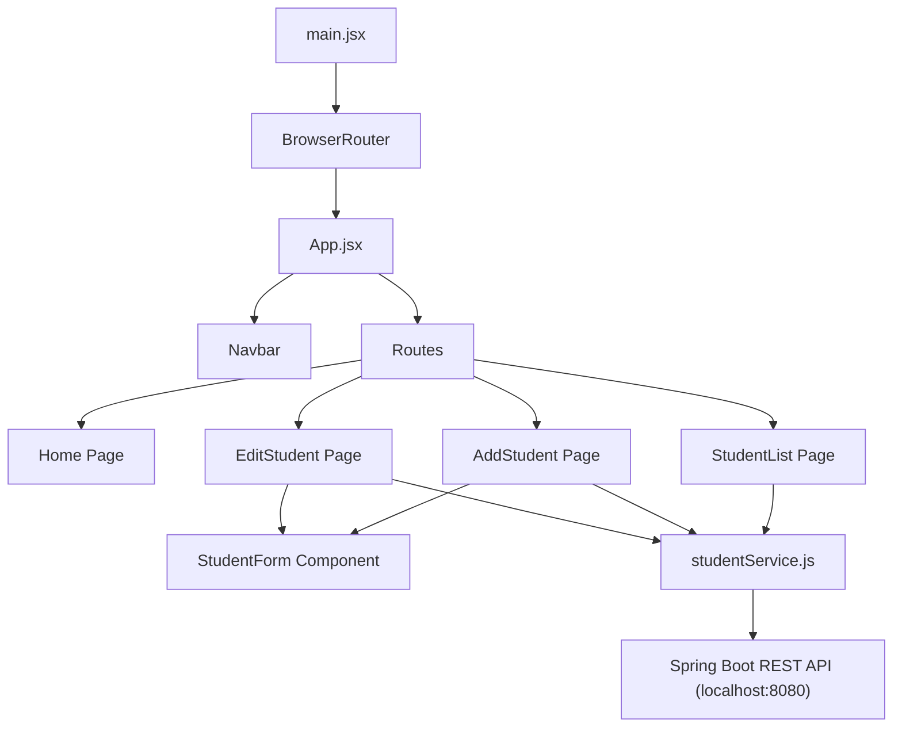

**React Concepts Used:**

| Concept | Where Used |
|---------|-----------|
| Components | Navbar, StudentForm, all pages |
| Props | StudentForm receives initialData, onSubmit, buttonText |
| State (useState) | Form data, student list, loading, errors |
| Effects (useEffect) | Fetching data on mount |
| Event Handling | Form submission, delete confirmation |
| Conditional Rendering | Loading/error/empty states |
| Lists and Keys | Student table rows with `key={student.id}` |
| Forms (Controlled) | All form inputs bound to state |
| React Router | Navigation, route params, programmatic navigation |
| Lifting State Up | StudentForm receives callbacks from parent pages |

**Conclusion:**
This Student Management frontend demonstrates a complete CRUD application using React with Vite. It showcases component reusability (StudentForm shared between Add and Edit), proper separation of concerns (service layer for API calls, components for UI), client-side routing with React Router, and all core React concepts working together in a real-world application.

---
