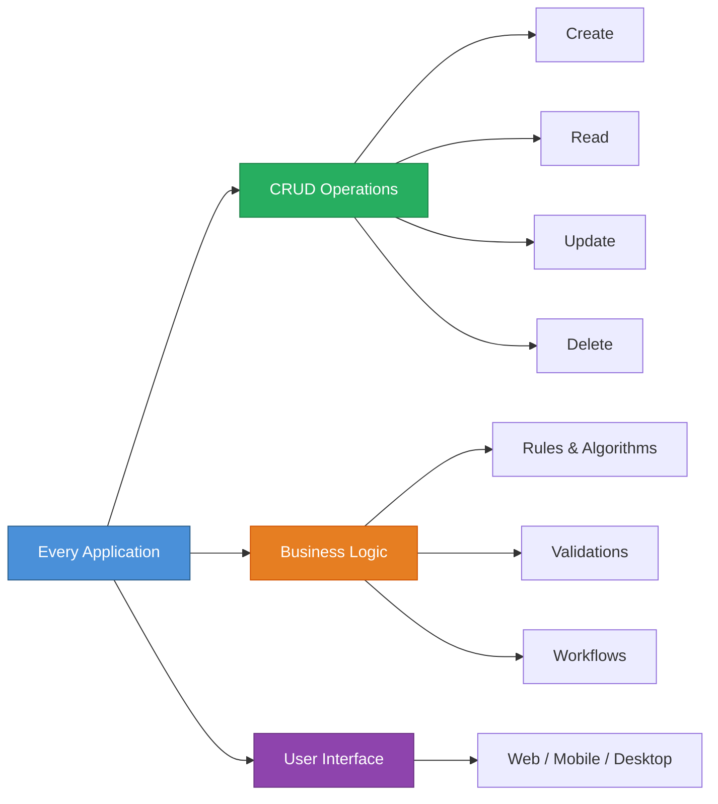
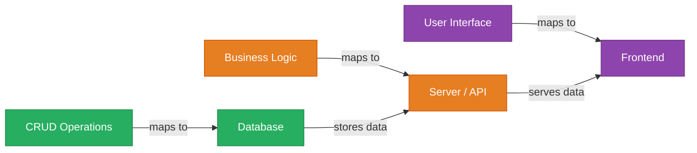
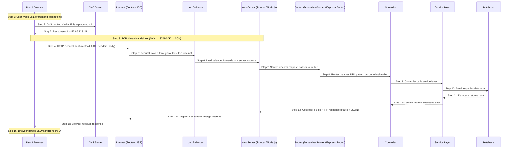
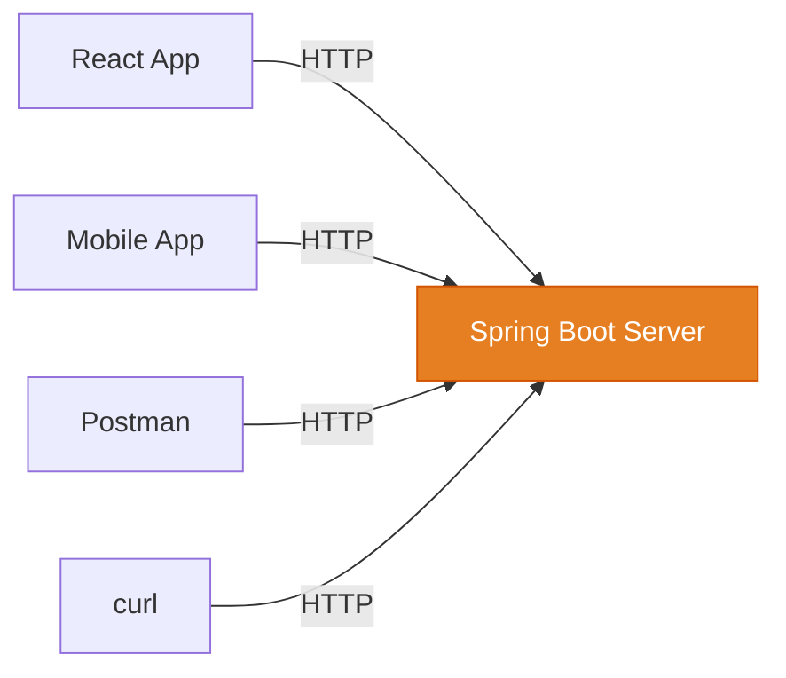
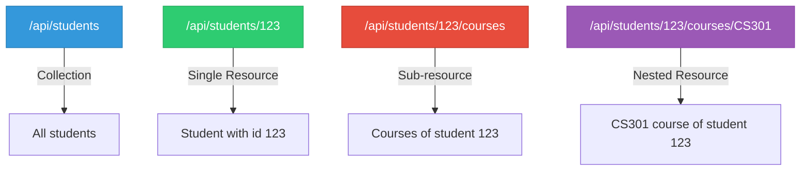
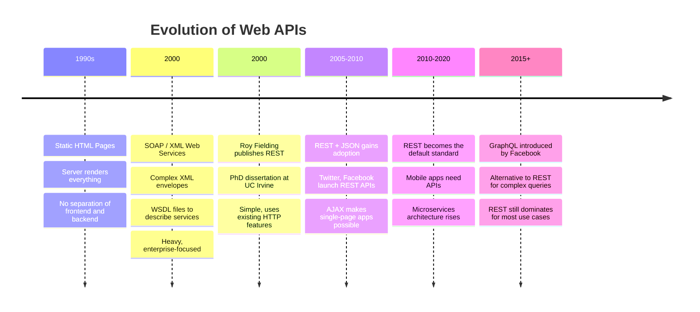
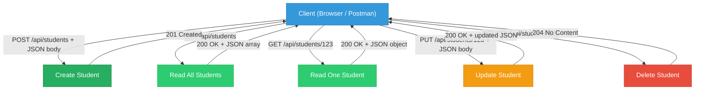

# REST, HTTP, and the Request-Response Cycle

[< Back to Docs](../README.md)

---

## Table of Contents

1. [Every Application is Just CRUD + Business Logic](#1-every-application-is-just-crud--business-logic)
2. [The Request-Response Cycle](#2-the-request-response-cycle)
3. [HTTP Methods (Verbs)](#3-http-methods-verbs)
4. [What is REST?](#4-what-is-rest)
5. [How We Arrived at REST -- Brief History](#5-how-we-arrived-at-rest----brief-history)
6. [HTTP Status Codes](#6-http-status-codes)
7. [CRUD, HTTP Methods, and Status Codes -- Complete Mapping](#7-crud-http-methods-and-status-codes----complete-mapping)
8. [REST in Spring Boot vs Express -- Code Comparison](#8-rest-in-spring-boot-vs-express----code-comparison)
9. [Testing REST APIs](#9-testing-rest-apis)
10. [Key Takeaways](#10-key-takeaways)

---

## 1. Every Application is Just CRUD + Business Logic

Before we talk about HTTP, REST, or APIs, let us understand one fundamental truth about software:

> **Every application you have ever used is, at its core, just four operations on data -- Create, Read, Update, Delete -- plus some business logic on top.**

That is it. Every app. Let that sink in.

### Real-World Examples

**Instagram**
| Operation | What Happens |
|-----------|-------------|
| **CREATE** | Post a new photo or reel |
| **READ** | Scroll through your feed, view a profile |
| **UPDATE** | Edit a caption, change your bio |
| **DELETE** | Delete a post or story |
| **Business Logic** | Recommendation algorithm, image filters, follower graph, notifications |

**Amazon**
| Operation | What Happens |
|-----------|-------------|
| **CREATE** | Add a new product listing |
| **READ** | Browse products, search, view details |
| **UPDATE** | Update price, stock quantity, description |
| **DELETE** | Remove a listing |
| **Business Logic** | Pricing engine, product recommendations, inventory management, payment processing |

**Zomato / Swiggy**
| Operation | What Happens |
|-----------|-------------|
| **CREATE** | Add a restaurant, add menu items |
| **READ** | Browse restaurants, view menus, track orders |
| **UPDATE** | Update menu prices, change availability |
| **DELETE** | Remove menu items, deactivate restaurant |
| **Business Logic** | Delivery partner assignment, surge pricing, ETA calculation, ratings |

**WhatsApp**
| Operation | What Happens |
|-----------|-------------|
| **CREATE** | Send a message, create a group |
| **READ** | View chat history, see status updates |
| **UPDATE** | Edit a sent message, change group name |
| **DELETE** | Delete a message ("This message was deleted") |
| **Business Logic** | End-to-end encryption, delivery receipts (blue ticks), group management |

**Google Classroom / LMS**
| Operation | What Happens |
|-----------|-------------|
| **CREATE** | Create an assignment, post an announcement |
| **READ** | View submissions, check grades |
| **UPDATE** | Update grades, edit assignment details |
| **DELETE** | Delete a course, remove an assignment |
| **Business Logic** | Plagiarism detection, deadline management, notification system |

**College ERP (you use this every day)**
| Operation | What Happens |
|-----------|-------------|
| **CREATE** | Add a new student record, register for courses |
| **READ** | View attendance, check marks, see fee status |
| **UPDATE** | Update marks after revaluation, correct attendance |
| **DELETE** | Remove a student record (TC issued) |
| **Business Logic** | CGPA calculation, eligibility rules, fee management, backlog tracking |

### The Big Picture



In terms of architecture, this maps directly to:



Now, here is the key question: **To make these apps work across the internet, we need a standard way for the frontend to talk to the backend.** Your React app running in a browser in Hyderabad needs to send data to a Spring Boot server running in AWS Mumbai. How?

**That standard is HTTP**, and the most popular pattern for designing APIs is **REST**.

---

## 2. The Request-Response Cycle

### What Happens When You Type a URL in the Browser?

When you type `https://erp.vce.ac.in/students` and press Enter, a LOT happens behind the scenes. But the core idea is simple:

> **The client sends a REQUEST. The server processes it. The server sends back a RESPONSE.**

That is the entire internet in one sentence.

### The Complete Journey -- Every Step Explained

When you type `https://erp.vce.ac.in/api/students` and press Enter, or when your React app calls `fetch('/api/students')`, here is the FULL journey that request takes:



### Every Step in Detail

| Step | What Happens | Technical Detail |
|------|-------------|-----------------|
| **1. User action** | User types a URL, clicks a link, or frontend JavaScript calls `fetch()` | The browser prepares to make an HTTP request |
| **2. DNS Lookup** | Browser asks: "What is the IP address of `erp.vce.ac.in`?" | Domain Name System translates human-readable domain names to IP addresses (like a phone book). Result is cached for future requests. |
| **3. TCP Handshake** | Browser establishes a connection with the server | **Three-way handshake**: Browser sends SYN, server responds SYN-ACK, browser sends ACK. This ensures both sides are ready to communicate. For HTTPS, a TLS handshake also happens here (encryption setup). |
| **4. HTTP Request sent** | Browser constructs and sends the HTTP request | Includes the method (GET), URL path (`/api/students`), headers (Host, Accept, Authorization), and optionally a body (for POST/PUT). |
| **5. Internet transit** | Request travels across the internet | Passes through your WiFi router, ISP, multiple backbone routers, possibly across continents. Each router looks at the destination IP and forwards the packet to the next hop. |
| **6. Load balancer** | Request reaches the server infrastructure | In production, a **load balancer** (like Nginx or AWS ALB) distributes requests across multiple server instances. In development on localhost, the request goes directly to your server. |
| **7. Web server receives** | The embedded web server receives the raw HTTP request | **Spring Boot**: Tomcat (embedded) listens on port 8080, parses the HTTP request. **Express**: Node.js `http` module listens on port 3000, parses the request. |
| **8. Routing** | Server matches the URL + method to the correct handler | **Spring Boot**: `DispatcherServlet` checks `@RequestMapping` annotations to find the right controller method. **Express**: Router checks `app.get()`, `app.post()` registrations to find the matching handler function. |
| **9-10. Processing** | Controller calls service, service calls database | The handler executes business logic: validation, data transformation, database queries. This is where your actual code runs. |
| **11-12. Data returns** | Database returns results, service processes them | Data flows back up: Database rows become Java objects (Spring) or JavaScript objects (Express). Business logic is applied. |
| **13. Response built** | Server constructs the HTTP response | Sets the status code (200, 201, 404), response headers (Content-Type: application/json), and serializes the data to JSON for the response body. |
| **14-15. Response sent** | Response travels back through the internet to the browser | Same path in reverse. TCP ensures all packets arrive and are in order. |
| **16. Client processes** | Browser receives and processes the response | If it is HTML, the browser renders it. If it is JSON (from a `fetch()` call), JavaScript code processes it and updates the UI. |

### The Same Flow in Spring Boot vs Express

```mermaid
graph TD
    subgraph "Spring Boot Flow"
        SB1["HTTP Request arrives"] --> SB2["Tomcat (embedded server)"]
        SB2 --> SB3["DispatcherServlet"]
        SB3 --> SB4["@RestController method"]
        SB4 --> SB5["@Service class"]
        SB5 --> SB6["@Repository / JPA"]
        SB6 --> SB7["Database"]
    end

    subgraph "Express Flow"
        EX1["HTTP Request arrives"] --> EX2["Node.js http module"]
        EX2 --> EX3["Express Router"]
        EX3 --> EX4["Route handler function"]
        EX4 --> EX5["Business logic"]
        EX5 --> EX6["MongoDB driver / Mongoose"]
        EX6 --> EX7["Database"]
    end

    style SB1 fill:#4a90d9,stroke:#2c5f8a,color:#fff
    style EX1 fill:#4a90d9,stroke:#2c5f8a,color:#fff
    style SB7 fill:#27ae60,stroke:#1e8449,color:#fff
    style EX7 fill:#27ae60,stroke:#1e8449,color:#fff
```



> **Key insight**: Whether you use Spring Boot or Express, the journey is the same. The request arrives, gets routed to a handler, the handler processes it (often involving a database), and a response is sent back. Only the specific classes and function names change.

### Anatomy of an HTTP Request

Every HTTP request has four parts:

```
┌─────────────────────────────────────────────────┐
│  1. METHOD + URL (the "what" and "where")       │
│     GET /api/students HTTP/1.1                  │
├─────────────────────────────────────────────────┤
│  2. HEADERS (metadata about the request)        │
│     Host: localhost:8080                        │
│     Accept: application/json                    │
│     Authorization: Bearer eyJhbGci...           │
├─────────────────────────────────────────────────┤
│  3. EMPTY LINE (separates headers from body)    │
│                                                 │
├─────────────────────────────────────────────────┤
│  4. BODY (optional -- data you are sending)     │
│     {"name": "Ravi", "department": "IT"}        │
└─────────────────────────────────────────────────┘
```

- **Method**: What you want to do (GET, POST, PUT, DELETE)
- **URL**: Which resource you want to act on (`/api/students`)
- **Headers**: Extra information (who you are, what format you want, authentication)
- **Body**: The data you are sending (only for POST, PUT, PATCH -- not GET or DELETE)

### Anatomy of an HTTP Response

Every HTTP response also has a predictable structure:

```
┌─────────────────────────────────────────────────┐
│  1. STATUS LINE (did it work?)                  │
│     HTTP/1.1 200 OK                             │
├─────────────────────────────────────────────────┤
│  2. HEADERS (metadata about the response)       │
│     Content-Type: application/json              │
│     Content-Length: 82                           │
├─────────────────────────────────────────────────┤
│  3. EMPTY LINE                                  │
│                                                 │
├─────────────────────────────────────────────────┤
│  4. BODY (the actual data)                      │
│     [{"name": "Ravi", "rollNumber": "1201"}]    │
└─────────────────────────────────────────────────┘
```

### A Complete Example

Here is a real HTTP conversation. Read it like a dialogue between the browser (client) and the server:

**Browser asks for all students:**

```
REQUEST:
GET /api/students HTTP/1.1
Host: localhost:8080
Accept: application/json
```

**Server responds with the data:**

```
RESPONSE:
HTTP/1.1 200 OK
Content-Type: application/json

[
  {"name": "Ravi", "rollNumber": "21B01A1201", "department": "IT"},
  {"name": "Priya", "rollNumber": "21B01A1202", "department": "IT"},
  {"name": "Amit", "rollNumber": "21B01A1203", "department": "IT"}
]
```

**Browser creates a new student:**

```
REQUEST:
POST /api/students HTTP/1.1
Host: localhost:8080
Content-Type: application/json

{"name": "Sneha", "rollNumber": "21B01A1204", "department": "IT"}
```

**Server confirms creation:**

```
RESPONSE:
HTTP/1.1 201 Created
Content-Type: application/json

{"id": 4, "name": "Sneha", "rollNumber": "21B01A1204", "department": "IT"}
```

Notice the difference: **GET** has no body in the request (you are just asking for data). **POST** has a body (you are sending data to create something). The response code changed from **200 OK** to **201 Created** because a new resource was created.

---

## 3. HTTP Methods (Verbs)

HTTP methods (also called **verbs**) tell the server **what action** you want to perform. Think of the URL as the noun (what resource) and the method as the verb (what to do with it).

### The Five Main Methods

| Method | Purpose | Real-World Analogy | Has Request Body? |
|--------|---------|-------------------|-------------------|
| **GET** | Read / retrieve data | Looking up a book in the library catalog | No |
| **POST** | Create a new resource | Filling and submitting a new admission form | Yes |
| **PUT** | Update an entire resource (replace) | Replacing an entire page in a notebook | Yes |
| **PATCH** | Update part of a resource | Using correction fluid on one word | Yes |
| **DELETE** | Remove a resource | Tearing out a page from a notebook | No |

### GET -- Retrieve Data

```
GET /api/students          --> Get ALL students
GET /api/students/123      --> Get student with id 123
GET /api/students?dept=IT  --> Get all students in IT department
```

- **Safe**: Does not change data on the server. You can call it 100 times and nothing changes.
- **Idempotent**: Calling it once or ten times gives the same result.
- **No body**: You never send data in the body of a GET request. Use query parameters instead.

### POST -- Create a New Resource

```
POST /api/students
Body: {"name": "Karthik", "rollNumber": "21B01A1205", "department": "CSE"}
```

- **Not safe**: It creates new data on the server.
- **Not idempotent**: Calling it twice creates two students (duplicates).
- **Has body**: The data for the new resource goes in the request body.

### PUT -- Replace an Entire Resource

```
PUT /api/students/123
Body: {"name": "Ravi Kumar", "rollNumber": "21B01A1201", "department": "IT", "year": 3}
```

- You must send the **entire** resource, even the fields that have not changed.
- **Idempotent**: Calling it ten times with the same data results in the same state.
- If the resource does not exist, some APIs create it (called "upsert").

### PATCH -- Update Part of a Resource

```
PATCH /api/students/123
Body: {"name": "Ravi Kumar"}
```

- You only send the fields you want to change.
- Useful when a resource has many fields and you only want to update one.

### DELETE -- Remove a Resource

```
DELETE /api/students/123
```

- **Idempotent**: Deleting something that is already deleted still results in "it is gone."
- **No body**: You just specify which resource to delete via the URL.

### PUT vs PATCH -- What is the Difference?

Imagine a student record:

```json
{"id": 1, "name": "Ravi", "department": "IT", "year": 2, "cgpa": 8.5}
```

**PUT** (replace everything):
```json
PUT /api/students/1
{"id": 1, "name": "Ravi Kumar", "department": "IT", "year": 3, "cgpa": 8.7}
```
You must send ALL fields. If you forget `cgpa`, it might get set to null.

**PATCH** (update only what changed):
```json
PATCH /api/students/1
{"year": 3, "cgpa": 8.7}
```
You only send the fields that changed. Everything else stays the same.

> **In practice**: Most student projects and many production APIs use PUT for updates and do not bother with PATCH. Know the difference for vivas, but do not overthink it.

---

## 4. What is REST?

### The Definition

**REST** stands for **Representational State Transfer**. It was defined by Roy Fielding in his PhD dissertation in the year 2000.

REST is not a protocol. It is not a framework. It is not a library you install.

> **REST is an architectural style** -- a set of guidelines for designing web APIs that are simple, scalable, and easy to understand.

Think of it this way: HTTP is the **language** (like English). REST is the **grammar rules** for writing clean sentences in that language. You can write HTTP APIs without following REST, just like you can write English without following grammar. But if you follow the rules, everyone understands you better.

### REST Constraints (The Rules)

REST defines six constraints. You need to know four of them well:

**1. Client-Server Separation**

The client (browser, mobile app) and the server (Spring Boot, Express) are independent. The server does not care if the client is a web browser, a mobile app, or a Python script. It just receives requests and sends responses.



**2. Stateless**

Every request must contain ALL the information the server needs. The server does not remember previous requests.

Bad (stateful):
```
Request 1: "My name is Ravi"
Request 2: "What department am I in?"   --> Server has to remember Request 1
```

Good (stateless):
```
Request 1: "Get student Ravi, here is my auth token: xyz"
Request 2: "What department is student Ravi in, here is my auth token: xyz"
```

Each request is complete on its own. This is why we send authentication tokens with every request.

**3. Uniform Interface (Resource-Based)**

Everything is a **resource**, identified by a URL. You perform actions on resources using HTTP methods.



**Good RESTful URLs:**
```
GET    /api/students           --> Get all students
GET    /api/students/123       --> Get one student
POST   /api/students           --> Create a student
PUT    /api/students/123       --> Update a student
DELETE /api/students/123       --> Delete a student
```

**Bad URLs (not RESTful):**
```
GET /api/getAllStudents
GET /api/getStudentById?id=123
POST /api/createStudent
POST /api/deleteStudent?id=123     --> Using POST for delete!
```

Notice: In REST, the URL describes the **resource** (noun), and the HTTP method describes the **action** (verb). You do not put verbs in the URL.

**4. Layered System**

The client does not need to know if it is talking directly to the server, or to a load balancer, or to a cache. Each layer only knows about the layer it directly interacts with.

### JSON -- The Language of REST

REST APIs almost always use **JSON** (JavaScript Object Notation) to represent data. JSON is lightweight, human-readable, and supported by every programming language.

```json
{
  "id": 1,
  "name": "Priya Sharma",
  "rollNumber": "21B01A1202",
  "department": "IT",
  "year": 3,
  "courses": ["DBMS", "Web Technologies", "OS"]
}
```

Compare this to XML (what SOAP used):

```xml
<student>
  <id>1</id>
  <name>Priya Sharma</name>
  <rollNumber>21B01A1202</rollNumber>
  <department>IT</department>
  <year>3</year>
  <courses>
    <course>DBMS</course>
    <course>Web Technologies</course>
    <course>OS</course>
  </courses>
</student>
```

JSON is clearly shorter, easier to read, and easier to work with. This is one reason REST + JSON won over SOAP + XML.

---

## 5. How We Arrived at REST -- Brief History

REST did not appear out of nowhere. It evolved from decades of web development challenges.



### The Three Eras

**Era 1: Server-Rendered Everything (1990s)**

In the early web, there was no "frontend" and "backend." The server generated complete HTML pages and sent them to the browser. Clicking a link loaded an entirely new page. There was no API.

```
Browser --> Server --> Generate full HTML page --> Send to browser
```

**Era 2: SOAP and XML (Early 2000s)**

As applications needed to talk to each other (not just serve HTML), SOAP (Simple Object Access Protocol) was invented. It used XML for everything:

```xml
<!-- A SOAP request to get a student -- look how verbose this is -->
<?xml version="1.0"?>
<soap:Envelope xmlns:soap="http://schemas.xmlsoap.org/soap/envelope/">
  <soap:Body>
    <GetStudent xmlns="http://example.com/students">
      <StudentId>123</StudentId>
    </GetStudent>
  </soap:Body>
</soap:Envelope>
```

SOAP required WSDL (Web Services Description Language) files, XML parsing, and complex tooling. It worked, but it was heavy and painful.

**Era 3: REST + JSON (2005 onwards)**

The same request in REST:

```
GET /api/students/123
```

That is it. One line. REST said: "HTTP already has methods (GET, POST, PUT, DELETE), status codes (200, 404, 500), and URLs. Why invent a whole new protocol on top? Just use HTTP properly."

REST won because of its simplicity. Today, the vast majority of web APIs are REST APIs.

> **GraphQL** (introduced by Facebook in 2015) is an alternative that lets clients request exactly the fields they need. It is useful for complex data requirements, but REST remains the default for most applications and is what you will use in this course.

---

## 6. HTTP Status Codes

Status codes are the server's way of saying what happened to your request. They are three-digit numbers, and the first digit tells you the category.

### 2xx -- Success (Your request worked)

| Code | Name | When Used | Analogy |
|------|------|-----------|---------|
| **200** | OK | GET, PUT returned data successfully | "Here is what you asked for" |
| **201** | Created | POST created a new resource | "Done, I created it for you" |
| **204** | No Content | DELETE succeeded, nothing to return | "Done, nothing more to show" |

**Examples:**

```
GET /api/students         --> 200 OK (here are all students)
POST /api/students        --> 201 Created (new student added)
PUT /api/students/123     --> 200 OK (student updated, here is the result)
DELETE /api/students/123  --> 204 No Content (student deleted, nothing to return)
```

### 3xx -- Redirection (Go somewhere else)

| Code | Name | When Used | Analogy |
|------|------|-----------|---------|
| **301** | Moved Permanently | Resource URL has changed forever | "We moved to a new address permanently" |
| **302** | Found (Redirect) | Temporary redirect | "Go here for now, but check back later" |

You will rarely set these manually. They are handled by web servers and frameworks.

### 4xx -- Client Error (You made a mistake)

These are the ones students encounter most during development:

| Code | Name | When Used | Analogy |
|------|------|-----------|---------|
| **400** | Bad Request | Invalid data in the request | "I cannot understand your request" |
| **401** | Unauthorized | Not logged in, no auth token | "Who are you? Show your ID first" |
| **403** | Forbidden | Logged in but no permission | "I know who you are, but you cannot do this" |
| **404** | Not Found | Resource does not exist | "There is nothing here" |
| **409** | Conflict | Duplicate entry, conflicting state | "This already exists" |
| **422** | Unprocessable Entity | Validation failed | "I understand the format, but the data is invalid" |

**Understanding 401 vs 403:**

```
401 Unauthorized:
  You walk into a building without an ID badge.
  Guard says: "Who are you? You cannot enter without identification."

403 Forbidden:
  You walk in with your student ID badge.
  Guard says: "I see you are a student, but only faculty can enter this room."
```

**Understanding 400 vs 422:**

```
400 Bad Request:
  You send: "asdkjfhaskjdf" (not even valid JSON)
  Server says: "I cannot even parse what you sent me."

422 Unprocessable Entity:
  You send: {"name": "Ravi", "email": "not-an-email"}
  Server says: "I understand the JSON, but 'not-an-email' is not a valid email."
```

### 5xx -- Server Error (The server messed up)

| Code | Name | When Used | Analogy |
|------|------|-----------|---------|
| **500** | Internal Server Error | Unhandled exception, bug in code | "Something broke on our end, sorry" |
| **502** | Bad Gateway | Upstream server is down | "The server behind me is not responding" |
| **503** | Service Unavailable | Server is overloaded or under maintenance | "We are too busy right now, try later" |

> **Pro tip for debugging**: If you see a **4xx error**, the problem is in your frontend code (wrong URL, missing headers, bad data). If you see a **5xx error**, the problem is in your backend code (null pointer, database connection failed, unhandled exception).

### Quick Memory Aid

```
2xx = "All good"       (Success)
3xx = "Go over there"  (Redirect)
4xx = "Your fault"     (Client error)
5xx = "Our fault"      (Server error)
```

---

## 7. CRUD, HTTP Methods, and Status Codes -- Complete Mapping

This is the table that ties everything together. **Memorize this.**

| Operation | HTTP Method | URL Pattern | Request Body | Success Code | Common Error Codes | Spring Boot Annotation | Express Method |
|-----------|------------|-------------|-------------|-------------|-------------------|----------------------|----------------|
| **Create** | POST | `/api/students` | Yes (JSON) | 201 Created | 400, 409 | `@PostMapping` | `app.post()` |
| **Read All** | GET | `/api/students` | No | 200 OK | -- | `@GetMapping` | `app.get()` |
| **Read One** | GET | `/api/students/:id` | No | 200 OK | 404 | `@GetMapping("/{id}")` | `app.get('/:id')` |
| **Update** | PUT | `/api/students/:id` | Yes (JSON) | 200 OK | 400, 404 | `@PutMapping("/{id}")` | `app.put('/:id')` |
| **Partial Update** | PATCH | `/api/students/:id` | Yes (JSON) | 200 OK | 400, 404 | `@PatchMapping("/{id}")` | `app.patch('/:id')` |
| **Delete** | DELETE | `/api/students/:id` | No | 204 No Content | 404 | `@DeleteMapping("/{id}")` | `app.delete('/:id')` |
| **Search** | GET | `/api/students?name=x` | No | 200 OK | -- | `@GetMapping` + `@RequestParam` | `app.get()` + `req.query` |

### Visualizing the Flow



---

## 8. REST in Spring Boot vs Express -- Code Comparison

The beauty of REST is that the concepts are the same regardless of the framework. Here is the exact same Student CRUD API built in both Spring Boot and Express.

### The Student Model

**Spring Boot (Java):**

```java
public class Student {
    private Long id;
    private String name;
    private String rollNumber;
    private String department;
    private int year;

    // Constructors
    public Student() {}

    public Student(String name, String rollNumber, String department, int year) {
        this.name = name;
        this.rollNumber = rollNumber;
        this.department = department;
        this.year = year;
    }

    // Getters and Setters
    public Long getId() { return id; }
    public void setId(Long id) { this.id = id; }

    public String getName() { return name; }
    public void setName(String name) { this.name = name; }

    public String getRollNumber() { return rollNumber; }
    public void setRollNumber(String rollNumber) { this.rollNumber = rollNumber; }

    public String getDepartment() { return department; }
    public void setDepartment(String department) { this.department = department; }

    public int getYear() { return year; }
    public void setYear(int year) { this.year = year; }
}
```

**Express (JavaScript) -- no model class needed, just JSON objects:**

```javascript
// In MongoDB, documents are just JSON objects:
// { name: "Ravi", rollNumber: "21B01A1201", department: "IT", year: 3 }
```

### The Complete Controller / Routes

**Spring Boot (Java):**

```java
import javax.validation.Valid;
import java.util.List;

import org.springframework.http.HttpStatus;
import org.springframework.http.ResponseEntity;
import org.springframework.web.bind.annotation.*;

@RestController
@RequestMapping("/api/students")
public class StudentController {

    private final StudentService studentService;

    public StudentController(StudentService studentService) {
        this.studentService = studentService;
    }

    // CREATE -- POST /api/students
    @PostMapping
    public ResponseEntity<Student> createStudent(@RequestBody Student student) {
        Student created = studentService.save(student);
        return new ResponseEntity<>(created, HttpStatus.CREATED); // 201
    }

    // READ ALL -- GET /api/students
    @GetMapping
    public List<Student> getAllStudents() {
        return studentService.findAll(); // 200 by default
    }

    // READ ONE -- GET /api/students/{id}
    @GetMapping("/{id}")
    public ResponseEntity<Student> getStudentById(@PathVariable Long id) {
        Student student = studentService.findById(id);
        if (student == null) {
            return new ResponseEntity<>(HttpStatus.NOT_FOUND); // 404
        }
        return new ResponseEntity<>(student, HttpStatus.OK); // 200
    }

    // UPDATE -- PUT /api/students/{id}
    @PutMapping("/{id}")
    public ResponseEntity<Student> updateStudent(
            @PathVariable Long id,
            @RequestBody Student student) {
        Student existing = studentService.findById(id);
        if (existing == null) {
            return new ResponseEntity<>(HttpStatus.NOT_FOUND); // 404
        }
        student.setId(id);
        Student updated = studentService.save(student);
        return new ResponseEntity<>(updated, HttpStatus.OK); // 200
    }

    // DELETE -- DELETE /api/students/{id}
    @DeleteMapping("/{id}")
    public ResponseEntity<Void> deleteStudent(@PathVariable Long id) {
        Student existing = studentService.findById(id);
        if (existing == null) {
            return new ResponseEntity<>(HttpStatus.NOT_FOUND); // 404
        }
        studentService.deleteById(id);
        return new ResponseEntity<>(HttpStatus.NO_CONTENT); // 204
    }

    // SEARCH -- GET /api/students?department=IT
    @GetMapping(params = "department")
    public List<Student> getStudentsByDepartment(
            @RequestParam String department) {
        return studentService.findByDepartment(department); // 200
    }
}
```

**Express (Node.js + MongoDB):**

```javascript
const express = require('express');
const { MongoClient, ObjectId } = require('mongodb');

const app = express();
app.use(express.json()); // Parse JSON request bodies

let db;

MongoClient.connect('mongodb://localhost:27017')
    .then(client => {
        db = client.db('college');
        console.log('Connected to MongoDB');
    });

// CREATE -- POST /api/students
app.post('/api/students', async (req, res) => {
    try {
        const result = await db.collection('students').insertOne(req.body);
        const created = { _id: result.insertedId, ...req.body };
        res.status(201).json(created); // 201 Created
    } catch (err) {
        res.status(400).json({ error: err.message }); // 400 Bad Request
    }
});

// READ ALL -- GET /api/students
app.get('/api/students', async (req, res) => {
    // Check if there are query parameters for search
    const filter = {};
    if (req.query.department) {
        filter.department = req.query.department;
    }
    const students = await db.collection('students').find(filter).toArray();
    res.json(students); // 200 OK (default)
});

// READ ONE -- GET /api/students/:id
app.get('/api/students/:id', async (req, res) => {
    try {
        const student = await db.collection('students')
            .findOne({ _id: new ObjectId(req.params.id) });

        if (!student) {
            return res.status(404).json({ error: 'Student not found' }); // 404
        }
        res.json(student); // 200 OK
    } catch (err) {
        res.status(400).json({ error: 'Invalid ID format' }); // 400
    }
});

// UPDATE -- PUT /api/students/:id
app.put('/api/students/:id', async (req, res) => {
    try {
        const result = await db.collection('students').findOneAndUpdate(
            { _id: new ObjectId(req.params.id) },
            { $set: req.body },
            { returnDocument: 'after' }
        );

        if (!result.value) {
            return res.status(404).json({ error: 'Student not found' }); // 404
        }
        res.json(result.value); // 200 OK
    } catch (err) {
        res.status(400).json({ error: err.message }); // 400
    }
});

// DELETE -- DELETE /api/students/:id
app.delete('/api/students/:id', async (req, res) => {
    try {
        const result = await db.collection('students')
            .deleteOne({ _id: new ObjectId(req.params.id) });

        if (result.deletedCount === 0) {
            return res.status(404).json({ error: 'Student not found' }); // 404
        }
        res.status(204).send(); // 204 No Content
    } catch (err) {
        res.status(400).json({ error: err.message }); // 400
    }
});

app.listen(3000, () => console.log('Server running on port 3000'));
```

### Side-by-Side Comparison

| Aspect | Spring Boot (Java) | Express (Node.js) |
|--------|-------------------|-------------------|
| **Define routes** | `@GetMapping`, `@PostMapping`, etc. | `app.get()`, `app.post()`, etc. |
| **Base path** | `@RequestMapping("/api/students")` | Repeat path in each route |
| **Path parameters** | `@PathVariable Long id` | `req.params.id` |
| **Query parameters** | `@RequestParam String department` | `req.query.department` |
| **Request body** | `@RequestBody Student student` | `req.body` |
| **Set status code** | `new ResponseEntity<>(data, HttpStatus.CREATED)` | `res.status(201).json(data)` |
| **Return JSON** | Automatic (Jackson serialization) | `res.json(data)` |
| **404 handling** | Return `ResponseEntity` with `NOT_FOUND` | `res.status(404).json(...)` |

> **Key insight**: The pattern is identical. Learn the concept once, and you can implement it in any framework. The URL design, HTTP methods, status codes, and request/response format are the same -- only the syntax changes.

---

## 9. Testing REST APIs

You have built an API. How do you test it?

### Method 1: Browser (GET only)

You can type any GET URL directly in the browser's address bar:

```
http://localhost:8080/api/students
http://localhost:8080/api/students/1
http://localhost:8080/api/students?department=IT
```

**Limitation**: Browsers can only send GET requests from the address bar. You cannot test POST, PUT, or DELETE this way.

### Method 2: curl (Command Line)

`curl` is a command-line tool that comes pre-installed on Mac and Linux. It lets you send any HTTP request.

**GET all students:**

```bash
curl http://localhost:8080/api/students
```

**GET one student:**

```bash
curl http://localhost:8080/api/students/1
```

**POST (create a student):**

```bash
curl -X POST http://localhost:8080/api/students \
  -H "Content-Type: application/json" \
  -d '{"name": "Karthik", "rollNumber": "21B01A1205", "department": "CSE", "year": 2}'
```

Explanation of the flags:
- `-X POST` -- use POST method
- `-H "Content-Type: application/json"` -- tell the server we are sending JSON
- `-d '...'` -- the data (request body)

**PUT (update a student):**

```bash
curl -X PUT http://localhost:8080/api/students/1 \
  -H "Content-Type: application/json" \
  -d '{"name": "Ravi Kumar", "rollNumber": "21B01A1201", "department": "IT", "year": 3}'
```

**DELETE a student:**

```bash
curl -X DELETE http://localhost:8080/api/students/1
```

**See full request and response headers (verbose mode):**

```bash
curl -v http://localhost:8080/api/students
```

### Method 3: Postman / Thunder Client (Recommended for Students)

Postman is a GUI tool for testing APIs. Thunder Client is a VS Code extension that does the same thing.

**Steps to test a POST request in Postman:**

1. Select **POST** from the method dropdown
2. Enter the URL: `http://localhost:8080/api/students`
3. Go to the **Body** tab
4. Select **raw** and choose **JSON** from the dropdown
5. Enter the JSON body:
   ```json
   {
     "name": "Sneha",
     "rollNumber": "21B01A1204",
     "department": "IT",
     "year": 2
   }
   ```
6. Click **Send**
7. Check the response: status code (201 Created) and response body

**Testing checklist for a CRUD API:**

```
[ ] POST /api/students          -- Create a student, expect 201
[ ] GET /api/students            -- Get all students, expect 200 with array
[ ] GET /api/students/{id}       -- Get the student you created, expect 200
[ ] GET /api/students/99999      -- Get a non-existent student, expect 404
[ ] PUT /api/students/{id}       -- Update the student, expect 200
[ ] DELETE /api/students/{id}    -- Delete the student, expect 204
[ ] GET /api/students/{id}       -- Confirm deletion, expect 404
[ ] POST /api/students           -- Send invalid data, expect 400
```

---

## 10. Key Takeaways

These are the points that matter for exams, vivas, and real-world development:

1. **Every application is CRUD + Business Logic.** Instagram, Amazon, Swiggy, your college ERP -- all of them boil down to Create, Read, Update, Delete plus domain-specific rules.

2. **HTTP is the protocol.** It defines how messages are formatted and transmitted between client and server. Every request has a method, URL, headers, and optional body. Every response has a status code, headers, and optional body.

3. **REST is the design pattern.** It is an architectural style that says: use HTTP methods as verbs, URLs as nouns (resources), JSON as the data format, and status codes to communicate results.

4. **The method-operation mapping:**
   - **GET** = Read (no body, safe, idempotent)
   - **POST** = Create (has body, not idempotent)
   - **PUT** = Update/Replace (has body, idempotent)
   - **DELETE** = Remove (no body, idempotent)

5. **Status codes tell you what happened:**
   - **2xx** = Success (200 OK, 201 Created, 204 No Content)
   - **4xx** = Client error, your code is wrong (400, 401, 403, 404)
   - **5xx** = Server error, backend code is broken (500, 502, 503)

6. **REST is framework-agnostic.** The same API design works in Spring Boot (`@GetMapping`), Express (`app.get()`), Django, Flask, Go, Rust -- anywhere. Learn the concepts once, apply everywhere.

7. **URLs should be nouns, not verbs.** Use `/api/students` (good), not `/api/getStudents` (bad). Let the HTTP method be the verb.

8. **Stateless means every request is independent.** The server does not remember your previous requests. Send all necessary information (including authentication) with every request.

---

**Next Steps**: Now that you understand REST and HTTP, you are ready to build your own APIs. Start with the [Spring Boot labs](./springboot/) or the [Node.js + MongoDB labs](./nodejs-mongodb/) in this repository.
