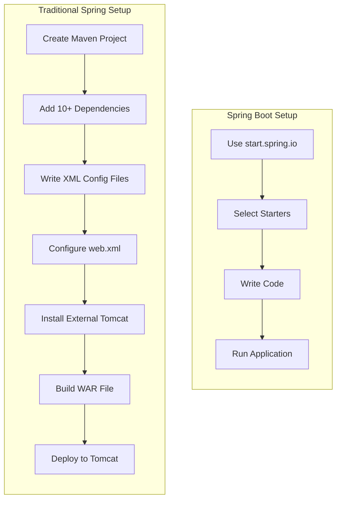
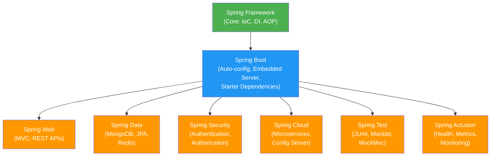

# Introduction to Spring Boot

[Back to Spring Boot Topics](./)

---

## Table of Contents

- [Introduction to Spring Framework](#introduction-to-spring-framework)
- [What is Spring Boot](#what-is-spring-boot)
- [Why Spring Boot](#why-spring-boot)
- [Spring vs Spring Boot](#spring-vs-spring-boot)
- [Spring Boot Features](#spring-boot-features)
- [Spring Ecosystem Overview](#spring-ecosystem-overview)
- [Key Takeaways](#key-takeaways)

---

## Introduction to Spring Framework

The **Spring Framework** is an open-source application framework for Java that provides comprehensive infrastructure support for developing Java applications. It was created by **Rod Johnson** in 2003 as a response to the complexity of Java EE (Enterprise Edition).

### Problems Spring Solves

1. **Tight coupling** between Java objects -- Spring promotes loose coupling through Dependency Injection (DI).
2. **Boilerplate code** -- Spring provides templates and abstractions to reduce repetitive code.
3. **Cross-cutting concerns** -- Spring AOP (Aspect-Oriented Programming) handles logging, security, and transactions cleanly.

### Core Concepts of Spring Framework

| Concept | Description |
|---------|-------------|
| **IoC (Inversion of Control)** | The framework controls object creation instead of the programmer |
| **Dependency Injection** | Objects receive their dependencies from outside rather than creating them |
| **AOP** | Separates cross-cutting concerns (logging, security) from business logic |
| **MVC** | Model-View-Controller pattern for web applications |

---

## What is Spring Boot

**Spring Boot** is a project built on top of the Spring Framework that makes it easy to create stand-alone, production-grade Spring-based applications. It was released in **April 2014** by Pivotal (now VMware).

> **In simple terms:** Spring Boot = Spring Framework + Auto Configuration + Embedded Server + Opinionated Defaults

Spring Boot does **not** replace Spring Framework. It simplifies the way you use Spring Framework by removing the need for complex XML configuration and manual setup.

### The Problem Spring Boot Solves

In traditional Spring, to build a simple web application, you needed to:

1. Create a Maven/Gradle project
2. Add 10+ dependencies manually
3. Write an XML configuration file (`applicationContext.xml`)
4. Configure a DispatcherServlet in `web.xml`
5. Set up a Tomcat server externally
6. Deploy your WAR file to the server

**With Spring Boot**, you:

1. Go to start.spring.io
2. Select your dependencies
3. Write your code
4. Run the application (embedded server included)

---

## Why Spring Boot

Spring Boot became popular because of three killer features:

### 1. Auto-Configuration

Spring Boot automatically configures your application based on the dependencies you add. If you add `spring-boot-starter-web`, it automatically configures:

- An embedded Tomcat server
- Spring MVC
- JSON message converters (Jackson)
- Error handling

You do not write a single line of XML configuration.

```java
// This single annotation enables auto-configuration
@SpringBootApplication
public class MyApplication {
    public static void main(String[] args) {
        SpringApplication.run(MyApplication.class, args);
    }
}
```

### 2. Embedded Server

Traditional Spring applications require an external application server (like Tomcat or JBoss) to be installed and configured separately. Spring Boot **embeds the server inside your application**.

| Feature | Traditional Spring | Spring Boot |
|---------|-------------------|-------------|
| Server | External Tomcat/JBoss | Embedded Tomcat/Jetty/Undertow |
| Deployment | WAR file deployed to server | JAR file runs independently |
| Command | Deploy to server manually | `java -jar myapp.jar` |

### 3. Starter Dependencies

Instead of adding individual libraries and worrying about version compatibility, Spring Boot provides **starter** dependencies that bundle everything you need.

```xml
<!-- Instead of adding 5-6 individual dependencies for web development -->
<!-- You just add ONE starter -->
<dependency>
    <groupId>org.springframework.boot</groupId>
    <artifactId>spring-boot-starter-web</artifactId>
</dependency>
```

Common starters:

| Starter | Purpose |
|---------|---------|
| `spring-boot-starter-web` | Web applications and REST APIs |
| `spring-boot-starter-data-mongodb` | MongoDB database access |
| `spring-boot-starter-data-jpa` | JPA/Hibernate database access |
| `spring-boot-starter-security` | Authentication and authorization |
| `spring-boot-starter-test` | Testing with JUnit, Mockito |
| `spring-boot-starter-thymeleaf` | Server-side HTML templates |

---

## Spring vs Spring Boot

### Comparison Diagram



### Detailed Comparison

| Aspect | Spring Framework | Spring Boot |
|--------|-----------------|-------------|
| **Configuration** | Manual XML or Java-based configuration | Auto-configuration |
| **Dependencies** | Add each library individually | Starter dependencies bundle libraries |
| **Server** | External server required | Embedded server (Tomcat/Jetty) |
| **Deployment** | WAR file | Executable JAR file |
| **Setup time** | Hours | Minutes |
| **XML files** | Required (applicationContext.xml, web.xml) | Not required |
| **Production-ready** | Manual setup for metrics, health checks | Built-in Actuator |
| **Learning curve** | Steep | Gentle |
| **Opinionated** | No -- you decide everything | Yes -- sensible defaults provided |

### Code Comparison

**Traditional Spring (XML Configuration):**

```xml
<!-- applicationContext.xml -->
<beans xmlns="http://www.springframework.org/schema/beans"
       xmlns:xsi="http://www.w3.org/2001/XMLSchema-instance"
       xmlns:context="http://www.springframework.org/schema/context"
       xsi:schemaLocation="...">

    <context:component-scan base-package="com.example"/>

    <bean id="viewResolver"
          class="org.springframework.web.servlet.view.InternalResourceViewResolver">
        <property name="prefix" value="/WEB-INF/views/"/>
        <property name="suffix" value=".jsp"/>
    </bean>
</beans>
```

**Spring Boot (Zero XML):**

```java
@SpringBootApplication
public class MyApplication {
    public static void main(String[] args) {
        SpringApplication.run(MyApplication.class, args);
    }
}
```

That is it. No XML. The `@SpringBootApplication` annotation handles component scanning, auto-configuration, and property loading.

---

## Spring Boot Features

### 1. `@SpringBootApplication` Annotation

This single annotation combines three annotations:

| Annotation | Purpose |
|-----------|---------|
| `@Configuration` | Marks the class as a source of bean definitions |
| `@EnableAutoConfiguration` | Tells Spring Boot to automatically configure beans |
| `@ComponentScan` | Scans the current package and sub-packages for Spring components |

### 2. `application.properties` / `application.yml`

All configuration goes into a single file instead of multiple XML files:

```properties
# application.properties
server.port=8080
spring.data.mongodb.uri=mongodb://localhost:27017/mydb
spring.application.name=my-app
```

### 3. Spring Boot Actuator

Provides production-ready features like health checks and metrics:

```
GET /actuator/health    → {"status": "UP"}
GET /actuator/info      → Application information
GET /actuator/metrics   → Application metrics
```

### 4. Spring Boot DevTools

Automatic restart when code changes are detected during development. Add the dependency and your application restarts every time you save a file.

### 5. Profiles

Run different configurations for different environments:

```properties
# application-dev.properties
server.port=8080
spring.data.mongodb.database=mydb_dev

# application-prod.properties
server.port=80
spring.data.mongodb.database=mydb_prod
```

Activate a profile: `java -jar myapp.jar --spring.profiles.active=prod`

---

## Spring Ecosystem Overview

Spring Boot is part of a larger ecosystem of Spring projects:



### What We Will Use in This Course

| Project | What For |
|---------|----------|
| **Spring Boot** | Application setup, auto-configuration |
| **Spring Web** | Building REST APIs and web pages |
| **Spring Data MongoDB** | Connecting to MongoDB database |
| **Spring Test** | Writing unit and integration tests |

---

## Key Takeaways

1. **Spring Framework** provides the foundation (IoC, DI, AOP) but requires significant manual configuration.
2. **Spring Boot** simplifies Spring development with auto-configuration, embedded servers, and starter dependencies.
3. The `@SpringBootApplication` annotation replaces multiple XML configuration files.
4. Spring Boot uses an **embedded Tomcat server** -- no external server installation needed.
5. **Starter dependencies** (like `spring-boot-starter-web`) bundle all required libraries with compatible versions.
6. Configuration is centralized in `application.properties` instead of scattered XML files.
7. We will use **Spring Boot 2.7.18** with **Java 8** and **Maven** throughout this course.

---

[Next: Spring Initializr and Project Setup >>](./02-spring-initializr.md)
