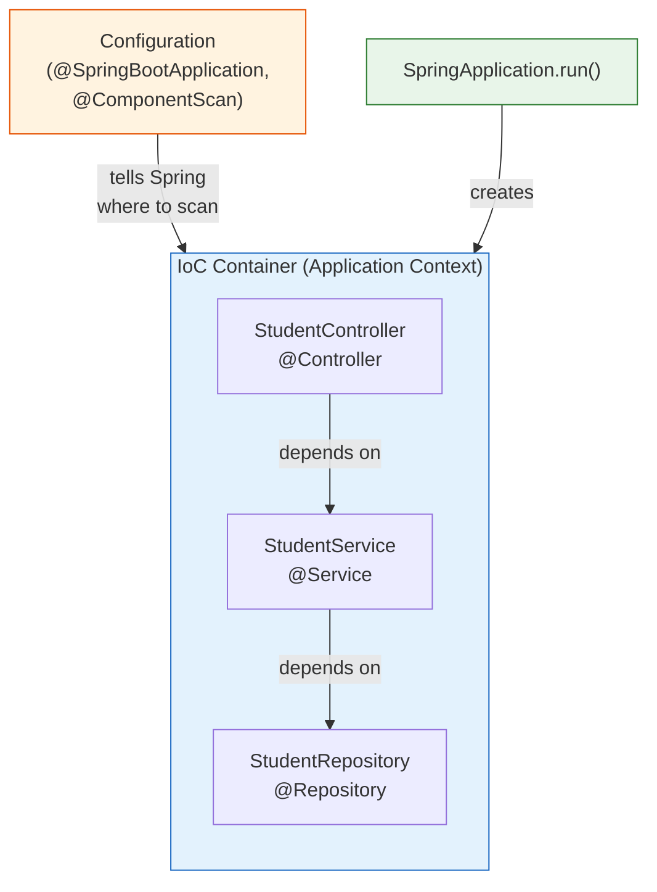
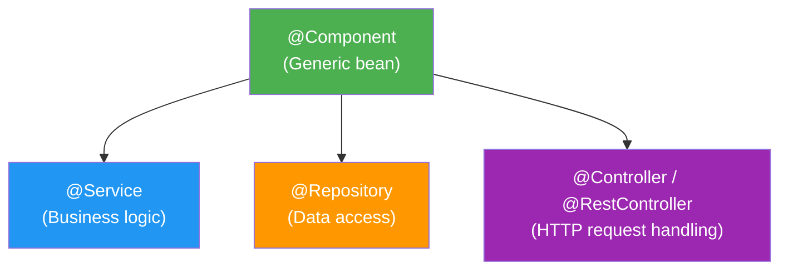
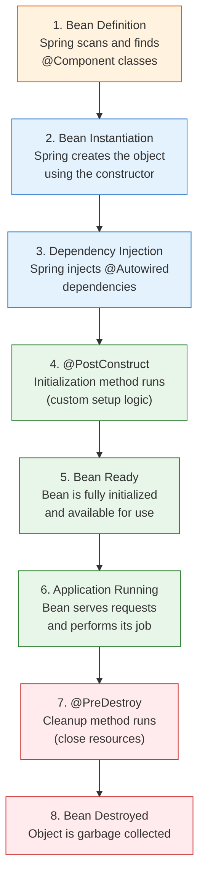

# Dependency Injection in Spring Boot

[Back to Spring Boot Topics](./)

---

## Table of Contents

- [What is Dependency Injection](#what-is-dependency-injection)
- [Why Dependency Injection Matters](#why-dependency-injection-matters)
- [IoC Container](#ioc-container)
- [Types of Dependency Injection](#types-of-dependency-injection)
  - [Constructor Injection](#1-constructor-injection-recommended)
  - [Setter Injection](#2-setter-injection)
  - [Field Injection](#3-field-injection)
- [Spring Stereotype Annotations](#spring-stereotype-annotations)
- [@Autowired Annotation](#autowired-annotation)
- [Bean Lifecycle](#bean-lifecycle)
- [Key Takeaways](#key-takeaways)

---

## What is Dependency Injection

**Dependency Injection (DI)** is a design pattern where an object receives its dependencies from an external source rather than creating them itself.

### Without Dependency Injection (Tight Coupling)

```java
public class StudentService {
    // StudentService CREATES its own dependency
    private StudentRepository repository = new StudentRepository();

    public Student findStudent(String id) {
        return repository.findById(id);
    }
}
```

**Problem:** `StudentService` is tightly coupled to `StudentRepository`. You cannot:
- Replace `StudentRepository` with a mock for testing
- Swap the implementation without modifying `StudentService`
- Reuse `StudentService` with a different repository

### With Dependency Injection (Loose Coupling)

```java
@Service
public class StudentService {
    // Dependency is INJECTED from outside
    private final StudentRepository repository;

    @Autowired
    public StudentService(StudentRepository repository) {
        this.repository = repository;
    }

    public Student findStudent(String id) {
        return repository.findById(id);
    }
}
```

**Now:** `StudentService` does not know or care how `StudentRepository` is created. Spring creates both objects and wires them together.

---

## Why Dependency Injection Matters

| Benefit | Explanation |
|---------|-------------|
| **Loose coupling** | Classes do not depend on concrete implementations |
| **Testability** | You can inject mock objects for unit testing |
| **Maintainability** | Changing a dependency does not require modifying the dependent class |
| **Reusability** | Components can be reused in different contexts |
| **Single Responsibility** | Objects focus on their job, not on creating dependencies |

---

## IoC Container

**IoC (Inversion of Control)** means the framework controls object creation and wiring, not the programmer.

The **IoC Container** (also called the **Application Context**) is the core of Spring. It:

1. Creates objects (called **beans**)
2. Manages their lifecycle
3. Injects dependencies where needed
4. Destroys beans when the application shuts down



### How the IoC Container Works

1. **Spring Boot starts** and scans your base package and sub-packages
2. It finds classes annotated with `@Component`, `@Service`, `@Repository`, `@Controller`
3. It creates instances (beans) of these classes
4. It looks at their dependencies (constructor parameters, `@Autowired` fields)
5. It injects the appropriate beans to satisfy those dependencies
6. All beans are stored in the Application Context and can be reused

### What is a Bean?

A **bean** is simply a Java object that is managed by the Spring IoC container. Any class annotated with `@Component` (or its specializations) becomes a bean.

```java
@Component  // This tells Spring: "Create an instance of this class and manage it"
public class EmailService {
    public void sendEmail(String to, String subject) {
        // send email logic
    }
}
```

By default, Spring creates **one instance** (singleton) of each bean and shares it across the entire application.

---

## Types of Dependency Injection

There are three ways to inject dependencies in Spring:

### 1. Constructor Injection (Recommended)

Dependencies are passed through the class constructor.

```java
@Service
public class StudentService {

    private final StudentRepository studentRepository;

    // Constructor Injection
    @Autowired
    public StudentService(StudentRepository studentRepository) {
        this.studentRepository = studentRepository;
    }

    public List<Student> getAllStudents() {
        return studentRepository.findAll();
    }
}
```

**Advantages:**
- Dependencies are **final** (immutable) -- cannot be changed after construction
- The object is **always in a valid state** -- all required dependencies are provided
- Easy to **unit test** -- just pass mock objects in the constructor
- Makes dependencies **explicit** -- you can see what the class needs

> **Note:** If a class has only ONE constructor, the `@Autowired` annotation is optional (Spring Boot 2.7.x will auto-detect it). However, adding it makes the code clearer for beginners.

### 2. Setter Injection

Dependencies are passed through setter methods.

```java
@Service
public class NotificationService {

    private EmailService emailService;
    private SMSService smsService;

    // Setter Injection
    @Autowired
    public void setEmailService(EmailService emailService) {
        this.emailService = emailService;
    }

    @Autowired
    public void setSmsService(SMSService smsService) {
        this.smsService = smsService;
    }

    public void notifyStudent(String studentId, String message) {
        emailService.sendEmail(studentId, message);
        smsService.sendSMS(studentId, message);
    }
}
```

**When to use:**
- When the dependency is **optional** (the class can work without it)
- When you need to **change** the dependency after object creation

**Disadvantage:** The object can exist in an **invalid state** if the setter is not called.

### 3. Field Injection

Dependencies are injected directly into the field using `@Autowired`.

```java
@Service
public class ReportService {

    // Field Injection
    @Autowired
    private StudentRepository studentRepository;

    @Autowired
    private EmailService emailService;

    public void generateAndSendReport() {
        List<Student> students = studentRepository.findAll();
        emailService.sendEmail("admin@example.com", "Report: " + students.size() + " students");
    }
}
```

**Advantages:**
- Shortest code -- no constructor or setter needed
- Clean-looking code

**Disadvantages:**
- Cannot make fields `final`
- Harder to test (requires reflection to inject mocks)
- Hides dependencies (not visible from the class API)
- Spring team **does not recommend** this approach

### Comparison Summary

| Aspect | Constructor | Setter | Field |
|--------|------------|--------|-------|
| **Recommended** | Yes | Sometimes | No |
| **Immutable (final)** | Yes | No | No |
| **Required dependencies** | Yes | No | No |
| **Testability** | Excellent | Good | Poor |
| **Code verbosity** | More code | Medium | Least code |
| **Spring team recommendation** | Preferred | OK for optional | Discouraged |

---

## Spring Stereotype Annotations

Spring provides four main annotations to mark classes as beans. They all do the same thing (register the class as a bean) but communicate **intent**:



### @Component

The generic annotation. Use when your class does not fit into Service, Repository, or Controller.

```java
@Component
public class EmailValidator {
    public boolean isValid(String email) {
        return email != null && email.contains("@");
    }
}
```

### @Service

For classes containing **business logic**. Functionally identical to `@Component` but communicates purpose.

```java
@Service
public class StudentService {

    private final StudentRepository studentRepository;

    @Autowired
    public StudentService(StudentRepository studentRepository) {
        this.studentRepository = studentRepository;
    }

    public Student enrollStudent(String name, String rollNumber) {
        // Business logic: validate, check duplicates, etc.
        if (rollNumber == null || rollNumber.isEmpty()) {
            throw new IllegalArgumentException("Roll number is required");
        }
        Student student = new Student();
        student.setName(name);
        student.setRollNumber(rollNumber);
        return studentRepository.save(student);
    }
}
```

### @Repository

For classes that interact with the **database**. Spring provides special exception translation for `@Repository` beans -- database-specific exceptions are converted to Spring's `DataAccessException`.

```java
@Repository
public interface StudentRepository extends MongoRepository<Student, String> {
    // Spring Data provides the implementation automatically
    List<Student> findByDepartment(String department);
}
```

### @Controller and @RestController

For classes that handle **HTTP requests**.

```java
// @Controller - returns view names (HTML pages)
@Controller
public class HomeController {
    @GetMapping("/")
    public String home() {
        return "index";  // Returns the Thymeleaf template "index.html"
    }
}

// @RestController - returns data directly (JSON)
@RestController
public class StudentController {
    @GetMapping("/api/students")
    public List<Student> getStudents() {
        return studentService.getAllStudents();  // Returns JSON
    }
}
```

### Which Annotation to Use?

| Layer | Annotation | Example |
|-------|-----------|---------|
| Web/API Layer | `@Controller` or `@RestController` | `StudentController` |
| Business Layer | `@Service` | `StudentService` |
| Data Access Layer | `@Repository` | `StudentRepository` |
| Other/Utility | `@Component` | `EmailValidator` |

---

## @Autowired Annotation

`@Autowired` tells Spring to **automatically inject** a dependency. Spring looks in its IoC container for a bean that matches the required type and injects it.

### How Spring Resolves Dependencies

```java
@Service
public class StudentService {

    @Autowired
    private StudentRepository studentRepository;  // Spring finds a bean of type StudentRepository
}
```

Spring follows this process:
1. Look for a bean of type `StudentRepository` in the IoC container
2. If **exactly one** bean is found -- inject it
3. If **no bean** is found -- throw `NoSuchBeanDefinitionException`
4. If **multiple beans** of the same type are found -- throw `NoUniqueBeanDefinitionException`

### Resolving Ambiguity with @Qualifier

When multiple beans of the same type exist, use `@Qualifier` to specify which one:

```java
@Component("emailNotifier")
public class EmailNotifier implements Notifier {
    public void notify(String message) { /* send email */ }
}

@Component("smsNotifier")
public class SMSNotifier implements Notifier {
    public void notify(String message) { /* send SMS */ }
}

@Service
public class AlertService {

    private final Notifier notifier;

    @Autowired
    public AlertService(@Qualifier("emailNotifier") Notifier notifier) {
        this.notifier = notifier;
    }
}
```

### @Autowired with `required = false`

By default, `@Autowired` dependencies are required. If the bean is not found, the application fails to start. You can make it optional:

```java
@Autowired(required = false)
private CacheService cacheService;  // Application starts even if no CacheService bean exists
```

---

## Bean Lifecycle

Every Spring bean goes through a lifecycle from creation to destruction:



### Lifecycle Callback Example

```java
import javax.annotation.PostConstruct;
import javax.annotation.PreDestroy;

@Service
public class DatabaseConnectionService {

    private Connection connection;

    @PostConstruct
    public void init() {
        // Called AFTER the bean is created and dependencies are injected
        System.out.println("Initializing database connection...");
        // Set up resources, open connections, load cache, etc.
    }

    @PreDestroy
    public void cleanup() {
        // Called BEFORE the bean is destroyed (application shutdown)
        System.out.println("Closing database connection...");
        // Close connections, release resources, flush buffers, etc.
    }
}
```

### Bean Scopes

By default, all beans are **singletons** -- Spring creates only one instance and shares it. You can change this:

| Scope | Description | Use Case |
|-------|-------------|----------|
| `singleton` (default) | One instance per IoC container | Stateless services |
| `prototype` | New instance every time it is requested | Stateful objects |
| `request` | One instance per HTTP request | Web applications |
| `session` | One instance per HTTP session | User-specific data |

```java
@Service
@Scope("prototype")  // New instance created each time this bean is injected
public class ReportGenerator {
    // ...
}
```

For most applications, the default `singleton` scope is correct. You rarely need to change it.

---

## Complete Example: Putting It All Together

Here is a complete example showing all layers working together with constructor injection:

### Model

```java
package com.example.demo.model;

public class Student {
    private String id;
    private String name;
    private String rollNumber;
    private String department;

    // Constructors
    public Student() {}

    public Student(String name, String rollNumber, String department) {
        this.name = name;
        this.rollNumber = rollNumber;
        this.department = department;
    }

    // Getters and Setters
    public String getId() { return id; }
    public void setId(String id) { this.id = id; }
    public String getName() { return name; }
    public void setName(String name) { this.name = name; }
    public String getRollNumber() { return rollNumber; }
    public void setRollNumber(String rollNumber) { this.rollNumber = rollNumber; }
    public String getDepartment() { return department; }
    public void setDepartment(String department) { this.department = department; }
}
```

### Repository

```java
package com.example.demo.repository;

import com.example.demo.model.Student;
import org.springframework.stereotype.Repository;
import java.util.ArrayList;
import java.util.List;

@Repository
public class StudentRepository {

    private final List<Student> students = new ArrayList<>();

    public List<Student> findAll() {
        return students;
    }

    public Student save(Student student) {
        students.add(student);
        return student;
    }
}
```

### Service

```java
package com.example.demo.service;

import com.example.demo.model.Student;
import com.example.demo.repository.StudentRepository;
import org.springframework.beans.factory.annotation.Autowired;
import org.springframework.stereotype.Service;
import java.util.List;

@Service
public class StudentService {

    private final StudentRepository studentRepository;

    @Autowired  // Constructor Injection
    public StudentService(StudentRepository studentRepository) {
        this.studentRepository = studentRepository;
    }

    public List<Student> getAllStudents() {
        return studentRepository.findAll();
    }

    public Student addStudent(Student student) {
        return studentRepository.save(student);
    }
}
```

### Controller

```java
package com.example.demo.controller;

import com.example.demo.model.Student;
import com.example.demo.service.StudentService;
import org.springframework.beans.factory.annotation.Autowired;
import org.springframework.web.bind.annotation.*;
import java.util.List;

@RestController
@RequestMapping("/api/students")
public class StudentController {

    private final StudentService studentService;

    @Autowired  // Constructor Injection
    public StudentController(StudentService studentService) {
        this.studentService = studentService;
    }

    @GetMapping
    public List<Student> getAllStudents() {
        return studentService.getAllStudents();
    }

    @PostMapping
    public Student addStudent(@RequestBody Student student) {
        return studentService.addStudent(student);
    }
}
```

### Dependency Flow

```
StudentController  →  StudentService  →  StudentRepository
 (@RestController)     (@Service)         (@Repository)

Spring creates all three beans and wires them together automatically.
```

---

## Key Takeaways

1. **Dependency Injection** means objects receive their dependencies from outside rather than creating them.
2. The **IoC Container** (Application Context) creates, manages, and wires all beans together.
3. **Constructor injection** is the recommended approach -- it makes dependencies explicit, immutable, and testable.
4. Use the correct **stereotype annotation** for each layer: `@Controller` for web, `@Service` for business logic, `@Repository` for data access, `@Component` for everything else.
5. `@Autowired` tells Spring to automatically inject a matching bean. Use `@Qualifier` when there are multiple candidates.
6. Beans go through a lifecycle: instantiation, dependency injection, `@PostConstruct`, usage, `@PreDestroy`, destruction.
7. By default, all beans are **singletons** -- one instance shared across the entire application.

---

[Next: Building Web Applications >>](./04-web-application.md)
