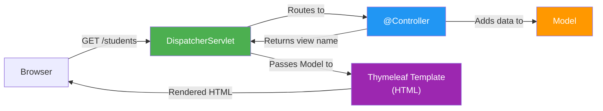
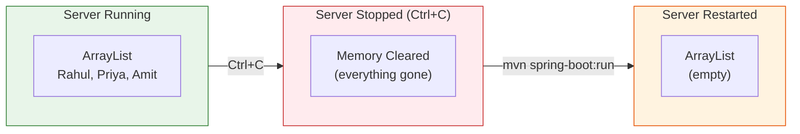

# Building Web Pages with Spring Boot and Thymeleaf

[Back to Spring Boot Topics](./)

---

## Table of Contents

- [Introduction to Spring MVC](#introduction-to-spring-mvc)
- [@Controller Annotation](#controller-annotation)
- [The Model Object](#the-model-object)
- [Introduction to Thymeleaf](#introduction-to-thymeleaf)
- [Building a Student Management App](#building-a-student-management-app)
  - [The Student Class](#the-student-class)
  - [The StudentController](#the-studentcontroller)
  - [Thymeleaf Templates](#thymeleaf-templates)
  - [CSS Styling](#css-styling)
- [Common Thymeleaf Expressions](#common-thymeleaf-expressions)
- [Understanding @ModelAttribute](#understanding-modelattribute)
- [The Post/Redirect/Get Pattern](#the-postredirectget-pattern)
- [Try It: The Data Disappearing Act](#try-it-the-data-disappearing-act)
- [Key Takeaways](#key-takeaways)

---

## Introduction to Spring MVC

Spring MVC (Model-View-Controller) is the web framework within Spring that handles HTTP requests and renders web pages. When you add `spring-boot-starter-web` to your project, Spring Boot auto-configures Spring MVC for you.

### How a Web Page Request Works



| Step | What Happens |
|------|-------------|
| 1 | The browser sends an HTTP request (e.g., `GET /students`) |
| 2 | Spring's **DispatcherServlet** receives the request and routes it to the right controller method |
| 3 | The **Controller** prepares data and puts it into the **Model** |
| 4 | The controller returns a **view name** (e.g., `"students"`) |
| 5 | **Thymeleaf** finds `templates/students.html`, fills in the data from the Model, and produces final HTML |
| 6 | The rendered HTML page is sent back to the browser |

The **DispatcherServlet** is automatically configured by Spring Boot. You never create or configure it manually.

---

## @Controller Annotation

`@Controller` marks a class as a Spring MVC controller that returns **view names** (HTML pages). This is different from `@RestController`, which returns data (JSON) -- we will cover that in a later section.

```java
import org.springframework.stereotype.Controller;
import org.springframework.ui.Model;
import org.springframework.web.bind.annotation.GetMapping;

@Controller
public class HomeController {

    @GetMapping("/")
    public String homePage(Model model) {
        model.addAttribute("message", "Welcome to Spring Boot!");
        return "index";  // Returns the view name -> templates/index.html
    }
}
```

Key points:
- `@Controller` is a Spring stereotype annotation (like `@Service`, `@Repository`)
- The return value is a **view name**, not data -- Spring resolves it to an HTML template
- The `Model` object carries data from the controller to the template

---

## The Model Object

The `Model` is a container for data that you want to display in your HTML template. Think of it as a map of key-value pairs.

```java
@GetMapping("/greeting")
public String greeting(Model model) {
    model.addAttribute("name", "Rahul");           // String
    model.addAttribute("age", 20);                  // Number
    model.addAttribute("departments", Arrays.asList("CSE", "IT", "ECE"));  // List

    return "greeting";  // templates/greeting.html can access name, age, departments
}
```

In the Thymeleaf template, you access these values:

```html
<p th:text="${name}">Default Name</p>          <!-- Displays: Rahul -->
<p th:text="${age}">0</p>                       <!-- Displays: 20 -->
<ul>
    <li th:each="dept : ${departments}" th:text="${dept}">Dept</li>
</ul>
```

---

## Introduction to Thymeleaf

**Thymeleaf** is a Java template engine for rendering HTML on the server side. It is the recommended template engine for Spring Boot.

### How Thymeleaf Works

1. You write HTML files with special `th:` attributes
2. The `@Controller` method adds data to the `Model` and returns a view name
3. Thymeleaf finds the template in `src/main/resources/templates/`
4. It replaces the `th:` placeholders with actual data from the Model
5. The final HTML (with no `th:` attributes) is sent to the browser

### Adding Thymeleaf to Your Project

Add this dependency to your `pom.xml`:

```xml
<dependency>
    <groupId>org.springframework.boot</groupId>
    <artifactId>spring-boot-starter-thymeleaf</artifactId>
</dependency>
```

Templates go in: `src/main/resources/templates/`
Static files (CSS, JS, images) go in: `src/main/resources/static/`

---

## Building a Student Management App

Let's build a complete Student Management web application. We will store students in an **in-memory ArrayList** -- no database yet. This will teach us Thymeleaf, forms, and the MVC pattern.

### Project Setup

Add these dependencies to `pom.xml`:

```xml
<parent>
    <groupId>org.springframework.boot</groupId>
    <artifactId>spring-boot-starter-parent</artifactId>
    <version>2.7.18</version>
</parent>

<properties>
    <java.version>1.8</java.version>
</properties>

<dependencies>
    <dependency>
        <groupId>org.springframework.boot</groupId>
        <artifactId>spring-boot-starter-web</artifactId>
    </dependency>
    <dependency>
        <groupId>org.springframework.boot</groupId>
        <artifactId>spring-boot-starter-thymeleaf</artifactId>
    </dependency>
    <dependency>
        <groupId>org.springframework.boot</groupId>
        <artifactId>spring-boot-devtools</artifactId>
        <scope>runtime</scope>
    </dependency>
</dependencies>
```

### The Student Class

This is a plain Java class (POJO) -- no database annotations, no frameworks. Just fields, a constructor, getters, and setters.

```java
package com.demo;

public class Student {

    private String name;
    private String rollNumber;
    private String department;
    private String email;

    // Default constructor (required for form binding)
    public Student() {
    }

    // Parameterized constructor
    public Student(String name, String rollNumber, String department, String email) {
        this.name = name;
        this.rollNumber = rollNumber;
        this.department = department;
        this.email = email;
    }

    // Getters and Setters
    public String getName() {
        return name;
    }

    public void setName(String name) {
        this.name = name;
    }

    public String getRollNumber() {
        return rollNumber;
    }

    public void setRollNumber(String rollNumber) {
        this.rollNumber = rollNumber;
    }

    public String getDepartment() {
        return department;
    }

    public void setDepartment(String department) {
        this.department = department;
    }

    public String getEmail() {
        return email;
    }

    public void setEmail(String email) {
        this.email = email;
    }
}
```

### The StudentController

This controller uses `@Controller` (not `@RestController`) and stores all students in a simple `ArrayList`. Every CRUD operation works on this in-memory list.

```java
package com.demo;

import org.springframework.stereotype.Controller;
import org.springframework.ui.Model;
import org.springframework.web.bind.annotation.GetMapping;
import org.springframework.web.bind.annotation.ModelAttribute;
import org.springframework.web.bind.annotation.PathVariable;
import org.springframework.web.bind.annotation.PostMapping;
import org.springframework.web.bind.annotation.RequestMapping;

import java.util.ArrayList;
import java.util.List;

@Controller
@RequestMapping("/students")
public class StudentController {

    // In-memory storage -- data lives only while the server is running
    private List<Student> students = new ArrayList<>();

    // GET /students -- List all students
    @GetMapping
    public String listStudents(Model model) {
        model.addAttribute("students", students);
        return "students";  // templates/students.html
    }

    // GET /students/add -- Show the add form
    @GetMapping("/add")
    public String showAddForm(Model model) {
        model.addAttribute("student", new Student());
        return "add-student";  // templates/add-student.html
    }

    // POST /students/add -- Handle form submission, add to list
    @PostMapping("/add")
    public String addStudent(@ModelAttribute Student student) {
        students.add(student);
        return "redirect:/students";
    }

    // GET /students/edit/{index} -- Show the edit form with pre-filled data
    @GetMapping("/edit/{index}")
    public String showEditForm(@PathVariable int index, Model model) {
        model.addAttribute("student", students.get(index));
        model.addAttribute("index", index);
        return "edit-student";  // templates/edit-student.html
    }

    // POST /students/edit/{index} -- Handle edit form submission
    @PostMapping("/edit/{index}")
    public String editStudent(@PathVariable int index, @ModelAttribute Student student) {
        students.set(index, student);
        return "redirect:/students";
    }

    // GET /students/delete/{index} -- Delete a student and redirect
    @GetMapping("/delete/{index}")
    public String deleteStudent(@PathVariable int index) {
        students.remove(index);
        return "redirect:/students";
    }
}
```

### Thymeleaf Templates

#### `students.html` -- List all students

File: `src/main/resources/templates/students.html`

```html
<!DOCTYPE html>
<html xmlns:th="http://www.thymeleaf.org">
<head>
    <title>Student Management</title>
    <link rel="stylesheet" th:href="@{/css/styles.css}"/>
</head>
<body>
    <div class="container">
        <h1>Student Management</h1>

        <a th:href="@{/students/add}" class="btn btn-primary">Add New Student</a>

        <table th:if="${!students.isEmpty()}">
            <thead>
                <tr>
                    <th>#</th>
                    <th>Name</th>
                    <th>Roll Number</th>
                    <th>Department</th>
                    <th>Email</th>
                    <th>Actions</th>
                </tr>
            </thead>
            <tbody>
                <tr th:each="student, iterStat : ${students}">
                    <td th:text="${iterStat.index + 1}">1</td>
                    <td th:text="${student.name}">John</td>
                    <td th:text="${student.rollNumber}">21CS001</td>
                    <td th:text="${student.department}">CSE</td>
                    <td th:text="${student.email}">john@example.com</td>
                    <td>
                        <a th:href="@{/students/edit/{idx}(idx=${iterStat.index})}"
                           class="btn btn-edit">Edit</a>
                        <a th:href="@{/students/delete/{idx}(idx=${iterStat.index})}"
                           class="btn btn-delete"
                           onclick="return confirm('Are you sure you want to delete this student?')">Delete</a>
                    </td>
                </tr>
            </tbody>
        </table>

        <p th:if="${students.isEmpty()}" class="empty-message">
            No students found. Click "Add New Student" to get started.
        </p>
    </div>
</body>
</html>
```

#### `add-student.html` -- Add student form

File: `src/main/resources/templates/add-student.html`

```html
<!DOCTYPE html>
<html xmlns:th="http://www.thymeleaf.org">
<head>
    <title>Add Student</title>
    <link rel="stylesheet" th:href="@{/css/styles.css}"/>
</head>
<body>
    <div class="container">
        <h1>Add New Student</h1>

        <form th:action="@{/students/add}" th:object="${student}" method="post">
            <div class="form-group">
                <label for="name">Name</label>
                <input type="text" id="name" th:field="*{name}"
                       placeholder="Enter student name" required/>
            </div>

            <div class="form-group">
                <label for="rollNumber">Roll Number</label>
                <input type="text" id="rollNumber" th:field="*{rollNumber}"
                       placeholder="e.g., 21CS001" required/>
            </div>

            <div class="form-group">
                <label for="department">Department</label>
                <select id="department" th:field="*{department}" required>
                    <option value="">Select Department</option>
                    <option value="CSE">Computer Science (CSE)</option>
                    <option value="IT">Information Technology (IT)</option>
                    <option value="ECE">Electronics (ECE)</option>
                    <option value="EEE">Electrical (EEE)</option>
                    <option value="MECH">Mechanical (MECH)</option>
                </select>
            </div>

            <div class="form-group">
                <label for="email">Email</label>
                <input type="email" id="email" th:field="*{email}"
                       placeholder="student@example.com" required/>
            </div>

            <div class="form-actions">
                <button type="submit" class="btn btn-primary">Save Student</button>
                <a th:href="@{/students}" class="btn btn-cancel">Cancel</a>
            </div>
        </form>
    </div>
</body>
</html>
```

#### `edit-student.html` -- Edit student form (pre-filled)

File: `src/main/resources/templates/edit-student.html`

```html
<!DOCTYPE html>
<html xmlns:th="http://www.thymeleaf.org">
<head>
    <title>Edit Student</title>
    <link rel="stylesheet" th:href="@{/css/styles.css}"/>
</head>
<body>
    <div class="container">
        <h1>Edit Student</h1>

        <form th:action="@{/students/edit/{idx}(idx=${index})}"
              th:object="${student}" method="post">
            <div class="form-group">
                <label for="name">Name</label>
                <input type="text" id="name" th:field="*{name}"
                       placeholder="Enter student name" required/>
            </div>

            <div class="form-group">
                <label for="rollNumber">Roll Number</label>
                <input type="text" id="rollNumber" th:field="*{rollNumber}"
                       placeholder="e.g., 21CS001" required/>
            </div>

            <div class="form-group">
                <label for="department">Department</label>
                <select id="department" th:field="*{department}" required>
                    <option value="">Select Department</option>
                    <option value="CSE">Computer Science (CSE)</option>
                    <option value="IT">Information Technology (IT)</option>
                    <option value="ECE">Electronics (ECE)</option>
                    <option value="EEE">Electrical (EEE)</option>
                    <option value="MECH">Mechanical (MECH)</option>
                </select>
            </div>

            <div class="form-group">
                <label for="email">Email</label>
                <input type="email" id="email" th:field="*{email}"
                       placeholder="student@example.com" required/>
            </div>

            <div class="form-actions">
                <button type="submit" class="btn btn-primary">Update Student</button>
                <a th:href="@{/students}" class="btn btn-cancel">Cancel</a>
            </div>
        </form>
    </div>
</body>
</html>
```

### CSS Styling

File: `src/main/resources/static/css/styles.css`

```css
* {
    margin: 0;
    padding: 0;
    box-sizing: border-box;
}

body {
    font-family: -apple-system, BlinkMacSystemFont, "Segoe UI", Roboto, sans-serif;
    background-color: #f5f5f5;
    color: #333;
    line-height: 1.6;
}

.container {
    max-width: 900px;
    margin: 40px auto;
    padding: 30px;
    background: #fff;
    border-radius: 8px;
    box-shadow: 0 2px 10px rgba(0, 0, 0, 0.1);
}

h1 {
    margin-bottom: 20px;
    color: #2c3e50;
}

/* Table Styles */
table {
    width: 100%;
    border-collapse: collapse;
    margin-top: 20px;
}

thead {
    background-color: #2c3e50;
    color: #fff;
}

th, td {
    padding: 12px 15px;
    text-align: left;
    border-bottom: 1px solid #ddd;
}

tbody tr:hover {
    background-color: #f0f0f0;
}

/* Button Styles */
.btn {
    display: inline-block;
    padding: 8px 16px;
    border: none;
    border-radius: 4px;
    cursor: pointer;
    text-decoration: none;
    font-size: 14px;
    color: #fff;
}

.btn-primary {
    background-color: #3498db;
}

.btn-primary:hover {
    background-color: #2980b9;
}

.btn-edit {
    background-color: #f39c12;
    color: #fff;
}

.btn-edit:hover {
    background-color: #e67e22;
}

.btn-delete {
    background-color: #e74c3c;
    color: #fff;
}

.btn-delete:hover {
    background-color: #c0392b;
}

.btn-cancel {
    background-color: #95a5a6;
    color: #fff;
}

.btn-cancel:hover {
    background-color: #7f8c8d;
}

/* Form Styles */
.form-group {
    margin-bottom: 18px;
}

.form-group label {
    display: block;
    margin-bottom: 6px;
    font-weight: 600;
    color: #2c3e50;
}

.form-group input,
.form-group select {
    width: 100%;
    padding: 10px 12px;
    border: 1px solid #ccc;
    border-radius: 4px;
    font-size: 14px;
}

.form-group input:focus,
.form-group select:focus {
    outline: none;
    border-color: #3498db;
    box-shadow: 0 0 0 2px rgba(52, 152, 219, 0.2);
}

.form-actions {
    margin-top: 20px;
}

.form-actions .btn {
    margin-right: 10px;
}

.empty-message {
    margin-top: 20px;
    padding: 20px;
    background-color: #fafafa;
    border: 1px dashed #ccc;
    border-radius: 4px;
    text-align: center;
    color: #777;
}
```

---

## Common Thymeleaf Expressions

| Expression | Purpose | Example |
|-----------|---------|---------|
| `th:text` | Set text content | `<p th:text="${name}">Default</p>` |
| `th:each` | Loop over a list | `<tr th:each="s : ${students}">` |
| `th:if` | Conditional rendering | `<p th:if="${error}">Error!</p>` |
| `th:unless` | Inverse conditional | `<p th:unless="${found}">Not found</p>` |
| `th:href` | Dynamic URL | `<a th:href="@{/students/edit/{id}(id=${idx})}">` |
| `th:action` | Form action URL | `<form th:action="@{/students/add}" method="post">` |
| `th:object` | Bind form to object | `<form th:object="${student}">` |
| `th:field` | Bind input to field | `<input th:field="*{name}"/>` |
| `th:value` | Set input value | `<input th:value="${student.name}"/>` |
| `${...}` | Variable expression | Access model attributes |
| `@{...}` | URL expression | Build URLs with parameters |
| `*{...}` | Selection expression | Access fields of `th:object` |

---

## Understanding @ModelAttribute

`@ModelAttribute` binds HTML form data to a Java object. When a form is submitted:

1. Spring creates a new `Student` object
2. It matches form field names (`name`, `rollNumber`, etc.) to the object's setter methods
3. It calls `setName()`, `setRollNumber()`, etc. with the form values
4. The populated `Student` object is passed to your controller method

```
HTML Form                  ->    Java Object
name="Rahul"               ->    student.setName("Rahul")
rollNumber="21CS001"       ->    student.setRollNumber("21CS001")
department="CSE"           ->    student.setDepartment("CSE")
email="rahul@example.com"  ->    student.setEmail("rahul@example.com")
```

---

## The Post/Redirect/Get Pattern

After a POST request (form submission), always **redirect** to a GET endpoint:

```java
@PostMapping("/add")
public String addStudent(@ModelAttribute Student student) {
    students.add(student);
    return "redirect:/students";  // Sends a 302 redirect to GET /students
}
```

This follows the **Post/Redirect/Get (PRG)** pattern, which prevents duplicate form submissions when the user refreshes the page. Without the redirect, refreshing the page would re-submit the form and add the same student again.

---

## Try It: The Data Disappearing Act

Here is the most important exercise in this section. Follow these steps exactly:

### Step 1: Run the application

```bash
mvn spring-boot:run
```

### Step 2: Add some students

Open your browser and go to `http://localhost:8080/students`. Click "Add New Student" and add a few students:

| Name | Roll Number | Department | Email |
|------|-------------|------------|-------|
| Rahul Kumar | 21CS001 | CSE | rahul@example.com |
| Priya Sharma | 21IT002 | IT | priya@example.com |
| Amit Patel | 21ECE003 | ECE | amit@example.com |

You should see all three students in the table. Everything works.

### Step 3: Stop the server

Go to your terminal and press `Ctrl+C` to stop the application.

### Step 4: Start the server again

```bash
mvn spring-boot:run
```

### Step 5: Check the student list

Go back to `http://localhost:8080/students`.

**Where did the students go? They are GONE.**

### Why?

Because we stored students in a Java `ArrayList`. An `ArrayList` lives in the application's **memory (RAM)**. When you stop the server, the Java process ends, and everything in memory is erased.



This is the fundamental limitation of in-memory storage. Every time the server restarts -- whether you stop it manually, it crashes, or you deploy a new version -- all data is lost.

**This is why we need a database.**

---

## Key Takeaways

1. **Spring MVC** follows the Controller -> Model -> View pattern for rendering web pages.
2. Use `@Controller` (not `@RestController`) when you want to return HTML pages via Thymeleaf.
3. The `Model` object carries data from the controller to the Thymeleaf template.
4. Thymeleaf templates live in `src/main/resources/templates/` and use `th:` attributes.
5. `@ModelAttribute` automatically binds HTML form fields to Java object properties.
6. Always use the **Post/Redirect/Get** pattern after form submissions.
7. **In-memory storage (ArrayList) is temporary** -- data is lost when the server restarts.

In the next section, we will connect to MongoDB so our student data **persists across restarts**.

---

[Previous: Dependency Injection](03-dependency-injection.md) | [Next: Database Connectivity](05-database-connectivity.md)
