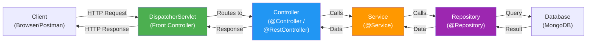

# Building Web Applications with Spring Boot

[Back to Spring Boot Topics](./)

---

## Table of Contents

- [Spring MVC Architecture](#spring-mvc-architecture)
- [@RestController vs @Controller](#restcontroller-vs-controller)
- [Request Mapping Annotations](#request-mapping-annotations)
- [Request and Response Handling](#request-and-response-handling)
- [Building REST APIs](#building-rest-apis)
- [HTTP Methods and CRUD Operations](#http-methods-and-crud-operations)
- [Thymeleaf Templates for Server-Side Rendering](#thymeleaf-templates-for-server-side-rendering)
- [Building a Web App with Forms](#building-a-web-app-with-forms)
- [Key Takeaways](#key-takeaways)

---

## Spring MVC Architecture

Spring MVC (Model-View-Controller) is the web framework within Spring that handles HTTP requests and responses. Spring Boot auto-configures Spring MVC when you add the `spring-boot-starter-web` dependency.

### Request Flow Diagram



### How the Flow Works

| Step | Component | Action |
|------|-----------|--------|
| 1 | **Client** | Sends HTTP request (e.g., `GET /api/students`) |
| 2 | **DispatcherServlet** | Spring's front controller receives all requests and routes them |
| 3 | **Controller** | Handles the request, calls the service layer |
| 4 | **Service** | Executes business logic, calls the repository |
| 5 | **Repository** | Interacts with the database |
| 6 | **Response** | Data flows back up through the layers to the client |

The **DispatcherServlet** is automatically configured by Spring Boot. You never create or configure it manually.

---

## @RestController vs @Controller

Spring provides two annotations for handling HTTP requests:

### @Controller (for HTML pages)

Returns **view names** that are resolved to HTML templates (e.g., Thymeleaf).

```java
@Controller
public class HomeController {

    @GetMapping("/")
    public String homePage(Model model) {
        model.addAttribute("message", "Welcome to Spring Boot!");
        return "index";  // Returns the template: src/main/resources/templates/index.html
    }
}
```

### @RestController (for REST APIs)

Returns **data directly** as JSON (or XML). It combines `@Controller` + `@ResponseBody`.

```java
@RestController
public class StudentApiController {

    @GetMapping("/api/students")
    public List<Student> getStudents() {
        // This List is automatically converted to JSON
        return studentService.getAllStudents();
    }
}
```

### Comparison

| Aspect | @Controller | @RestController |
|--------|------------|----------------|
| **Returns** | View name (HTML template) | Data (JSON/XML) |
| **Used for** | Web pages with Thymeleaf/JSP | REST APIs |
| **Response body** | Need `@ResponseBody` on each method | Automatic on all methods |
| **Clients** | Browsers | Mobile apps, JavaScript frontends, Postman |

### @ResponseBody Explained

`@ResponseBody` tells Spring to write the return value directly into the HTTP response body (as JSON), instead of resolving it as a view name.

```java
@Controller
public class MixedController {

    // Returns HTML page
    @GetMapping("/page")
    public String page() {
        return "page";  // Resolves to templates/page.html
    }

    // Returns JSON data (because of @ResponseBody)
    @GetMapping("/data")
    @ResponseBody
    public Student data() {
        return new Student("John", "21CS001", "CSE");  // Returns JSON
    }
}
```

`@RestController` is just a shortcut -- it adds `@ResponseBody` to every method automatically.

---

## Request Mapping Annotations

### @RequestMapping

The base annotation for mapping HTTP requests to controller methods. It works with any HTTP method.

```java
@RestController
@RequestMapping("/api/students")  // Base URL for all methods in this controller
public class StudentController {

    @RequestMapping(method = RequestMethod.GET)
    public List<Student> getAllStudents() {
        return studentService.getAllStudents();
    }

    @RequestMapping(value = "/{id}", method = RequestMethod.GET)
    public Student getStudent(@PathVariable String id) {
        return studentService.getStudentById(id);
    }
}
```

### Shortcut Annotations

Spring provides shortcut annotations for common HTTP methods:

| Annotation | HTTP Method | Purpose |
|-----------|------------|---------|
| `@GetMapping` | GET | Retrieve data |
| `@PostMapping` | POST | Create new data |
| `@PutMapping` | PUT | Update existing data |
| `@DeleteMapping` | DELETE | Delete data |
| `@PatchMapping` | PATCH | Partially update data |

```java
@RestController
@RequestMapping("/api/students")
public class StudentController {

    @GetMapping                    // GET    /api/students
    public List<Student> getAll() { ... }

    @GetMapping("/{id}")           // GET    /api/students/123
    public Student getById() { ... }

    @PostMapping                   // POST   /api/students
    public Student create() { ... }

    @PutMapping("/{id}")           // PUT    /api/students/123
    public Student update() { ... }

    @DeleteMapping("/{id}")        // DELETE /api/students/123
    public void delete() { ... }
}
```

---

## Request and Response Handling

### @PathVariable -- Extracting Values from the URL Path

Use `@PathVariable` to extract values from the URL path.

```java
// URL: GET /api/students/21CS001
@GetMapping("/api/students/{rollNumber}")
public Student getStudent(@PathVariable String rollNumber) {
    return studentService.findByRollNumber(rollNumber);
}

// Multiple path variables
// URL: GET /api/departments/CSE/students/21CS001
@GetMapping("/api/departments/{dept}/students/{roll}")
public Student getStudent(@PathVariable String dept, @PathVariable String roll) {
    return studentService.findByDeptAndRoll(dept, roll);
}
```

### @RequestParam -- Extracting Query Parameters

Use `@RequestParam` to extract values from the query string (`?key=value`).

```java
// URL: GET /api/students?department=CSE
@GetMapping("/api/students")
public List<Student> getStudents(@RequestParam String department) {
    return studentService.findByDepartment(department);
}

// Optional parameter with default value
// URL: GET /api/students?page=1&size=10
@GetMapping("/api/students")
public List<Student> getStudents(
        @RequestParam(defaultValue = "0") int page,
        @RequestParam(defaultValue = "10") int size) {
    return studentService.findAll(page, size);
}

// Optional parameter (not required)
@GetMapping("/api/students")
public List<Student> search(
        @RequestParam(required = false) String name) {
    if (name != null) {
        return studentService.findByName(name);
    }
    return studentService.findAll();
}
```

### @PathVariable vs @RequestParam

| Feature | @PathVariable | @RequestParam |
|---------|--------------|---------------|
| **URL format** | `/students/{id}` | `/students?id=123` |
| **Use case** | Identifying a specific resource | Filtering, sorting, pagination |
| **Required** | Always required | Can be optional |
| **Example** | `/api/students/5` | `/api/students?dept=CSE&page=1` |

### @RequestBody -- Reading JSON from Request Body

Use `@RequestBody` to read JSON data sent in the request body (typically with POST and PUT requests).

```java
// Client sends JSON in the request body:
// POST /api/students
// Body: {"name": "Rahul", "rollNumber": "21CS001", "department": "CSE"}

@PostMapping("/api/students")
public Student createStudent(@RequestBody Student student) {
    // Spring automatically converts JSON to a Student object (deserialization)
    return studentService.save(student);
}
```

Spring uses the **Jackson** library (included in `spring-boot-starter-web`) to automatically convert:
- **JSON to Java object** (deserialization) for `@RequestBody`
- **Java object to JSON** (serialization) for response

### ResponseEntity -- Controlling HTTP Response

`ResponseEntity` gives you full control over the HTTP response (status code, headers, body):

```java
@GetMapping("/{id}")
public ResponseEntity<Student> getStudent(@PathVariable String id) {
    Student student = studentService.findById(id);
    if (student != null) {
        return ResponseEntity.ok(student);                    // 200 OK
    }
    return ResponseEntity.notFound().build();                  // 404 Not Found
}

@PostMapping
public ResponseEntity<Student> createStudent(@RequestBody Student student) {
    Student saved = studentService.save(student);
    return ResponseEntity.status(HttpStatus.CREATED).body(saved);  // 201 Created
}

@DeleteMapping("/{id}")
public ResponseEntity<Void> deleteStudent(@PathVariable String id) {
    studentService.deleteById(id);
    return ResponseEntity.noContent().build();                  // 204 No Content
}
```

Common HTTP status codes:

| Status Code | Meaning | When to Use |
|------------|---------|-------------|
| 200 OK | Success | GET, PUT requests |
| 201 Created | Resource created | POST requests |
| 204 No Content | Success, no body | DELETE requests |
| 400 Bad Request | Invalid input | Validation failures |
| 404 Not Found | Resource not found | ID does not exist |
| 500 Internal Server Error | Server error | Unexpected exceptions |

---

## Building REST APIs

### Complete REST Controller Example

```java
package com.example.demo.controller;

import com.example.demo.model.Student;
import com.example.demo.service.StudentService;
import org.springframework.beans.factory.annotation.Autowired;
import org.springframework.http.HttpStatus;
import org.springframework.http.ResponseEntity;
import org.springframework.web.bind.annotation.*;

import java.util.List;

@RestController
@RequestMapping("/api/students")
public class StudentController {

    private final StudentService studentService;

    @Autowired
    public StudentController(StudentService studentService) {
        this.studentService = studentService;
    }

    // GET /api/students -- Get all students
    @GetMapping
    public List<Student> getAllStudents() {
        return studentService.getAllStudents();
    }

    // GET /api/students/{id} -- Get student by ID
    @GetMapping("/{id}")
    public ResponseEntity<Student> getStudentById(@PathVariable String id) {
        Student student = studentService.getStudentById(id);
        if (student != null) {
            return ResponseEntity.ok(student);
        }
        return ResponseEntity.notFound().build();
    }

    // POST /api/students -- Create a new student
    @PostMapping
    public ResponseEntity<Student> createStudent(@RequestBody Student student) {
        Student created = studentService.createStudent(student);
        return ResponseEntity.status(HttpStatus.CREATED).body(created);
    }

    // PUT /api/students/{id} -- Update a student
    @PutMapping("/{id}")
    public ResponseEntity<Student> updateStudent(@PathVariable String id,
                                                  @RequestBody Student student) {
        Student updated = studentService.updateStudent(id, student);
        if (updated != null) {
            return ResponseEntity.ok(updated);
        }
        return ResponseEntity.notFound().build();
    }

    // DELETE /api/students/{id} -- Delete a student
    @DeleteMapping("/{id}")
    public ResponseEntity<Void> deleteStudent(@PathVariable String id) {
        studentService.deleteStudent(id);
        return ResponseEntity.noContent().build();
    }

    // GET /api/students/department?name=CSE -- Search by department
    @GetMapping("/department")
    public List<Student> getByDepartment(@RequestParam String name) {
        return studentService.getStudentsByDepartment(name);
    }
}
```

### Testing REST APIs with Postman or curl

```bash
# GET all students
curl http://localhost:8080/api/students

# GET student by ID
curl http://localhost:8080/api/students/64a1b2c3d4e5f6

# POST create student
curl -X POST http://localhost:8080/api/students \
  -H "Content-Type: application/json" \
  -d '{"name":"Rahul","rollNumber":"21CS001","department":"CSE","email":"rahul@example.com"}'

# PUT update student
curl -X PUT http://localhost:8080/api/students/64a1b2c3d4e5f6 \
  -H "Content-Type: application/json" \
  -d '{"name":"Rahul Kumar","rollNumber":"21CS001","department":"CSE","email":"rahul.kumar@example.com"}'

# DELETE student
curl -X DELETE http://localhost:8080/api/students/64a1b2c3d4e5f6
```

---

## HTTP Methods and CRUD Operations

REST APIs follow a standard mapping between HTTP methods and CRUD (Create, Read, Update, Delete) operations:

| HTTP Method | CRUD Operation | URL Pattern | Request Body | Description |
|------------|----------------|-------------|-------------|-------------|
| **GET** | Read | `/api/students` | No | Get all students |
| **GET** | Read | `/api/students/{id}` | No | Get one student by ID |
| **POST** | Create | `/api/students` | Yes (JSON) | Create a new student |
| **PUT** | Update | `/api/students/{id}` | Yes (JSON) | Update entire student |
| **PATCH** | Partial Update | `/api/students/{id}` | Yes (JSON) | Update specific fields |
| **DELETE** | Delete | `/api/students/{id}` | No | Delete a student |

### REST API Design Best Practices

1. Use **nouns** for URLs, not verbs: `/api/students` (not `/api/getStudents`)
2. Use **plural** nouns: `/api/students` (not `/api/student`)
3. Use **path variables** for resource identification: `/api/students/{id}`
4. Use **query parameters** for filtering: `/api/students?department=CSE`
5. Return appropriate **HTTP status codes**
6. Use a **base path** like `/api/` to separate API endpoints from web pages

---

## Thymeleaf Templates for Server-Side Rendering

**Thymeleaf** is a Java template engine that renders HTML on the server side. It is the recommended template engine for Spring Boot.

### How Thymeleaf Works

1. The `@Controller` method adds data to the `Model`
2. The method returns a view name (e.g., `"students"`)
3. Thymeleaf finds `src/main/resources/templates/students.html`
4. Thymeleaf replaces placeholders with actual data
5. The final HTML is sent to the browser

### Controller for Thymeleaf

```java
@Controller
public class StudentWebController {

    private final StudentService studentService;

    @Autowired
    public StudentWebController(StudentService studentService) {
        this.studentService = studentService;
    }

    @GetMapping("/students")
    public String listStudents(Model model) {
        List<Student> students = studentService.getAllStudents();
        model.addAttribute("students", students);       // Add data to model
        model.addAttribute("title", "Student List");
        return "students";                                // Return view name
    }

    @GetMapping("/students/{id}")
    public String viewStudent(@PathVariable String id, Model model) {
        Student student = studentService.getStudentById(id);
        model.addAttribute("student", student);
        return "student-detail";
    }
}
```

### Thymeleaf Template Example

File: `src/main/resources/templates/students.html`

```html
<!DOCTYPE html>
<html xmlns:th="http://www.thymeleaf.org">
<head>
    <title th:text="${title}">Student List</title>
    <link rel="stylesheet" href="https://cdn.jsdelivr.net/npm/bootstrap@4.6.2/dist/css/bootstrap.min.css">
</head>
<body>
    <div class="container mt-4">
        <h1 th:text="${title}">Student List</h1>

        <table class="table table-striped">
            <thead>
                <tr>
                    <th>Roll Number</th>
                    <th>Name</th>
                    <th>Department</th>
                    <th>Email</th>
                </tr>
            </thead>
            <tbody>
                <!-- th:each iterates over the list -->
                <tr th:each="student : ${students}">
                    <td th:text="${student.rollNumber}">21CS001</td>
                    <td th:text="${student.name}">John</td>
                    <td th:text="${student.department}">CSE</td>
                    <td th:text="${student.email}">john@example.com</td>
                </tr>
            </tbody>
        </table>

        <!-- Show message if no students -->
        <p th:if="${#lists.isEmpty(students)}">No students found.</p>

        <a href="/students/new" class="btn btn-primary">Add New Student</a>
    </div>
</body>
</html>
```

### Common Thymeleaf Expressions

| Expression | Purpose | Example |
|-----------|---------|---------|
| `th:text` | Set text content | `<p th:text="${name}">Default</p>` |
| `th:each` | Loop over a list | `<tr th:each="s : ${students}">` |
| `th:if` | Conditional rendering | `<p th:if="${error}">Error!</p>` |
| `th:unless` | Inverse conditional | `<p th:unless="${found}">Not found</p>` |
| `th:href` | Dynamic URL | `<a th:href="@{/students/{id}(id=${s.id})}">` |
| `th:action` | Form action URL | `<form th:action="@{/students}" method="post">` |
| `th:object` | Bind form to object | `<form th:object="${student}">` |
| `th:field` | Bind input to field | `<input th:field="*{name}"/>` |
| `th:value` | Set input value | `<input th:value="${student.name}"/>` |
| `${...}` | Variable expression | Access model attributes |
| `@{...}` | URL expression | Build URLs with parameters |
| `*{...}` | Selection expression | Access fields of `th:object` |

---

## Building a Web App with Forms

### Step 1: Controller with Form Handling

```java
@Controller
@RequestMapping("/students")
public class StudentFormController {

    private final StudentService studentService;

    @Autowired
    public StudentFormController(StudentService studentService) {
        this.studentService = studentService;
    }

    // Show the list of students
    @GetMapping
    public String listStudents(Model model) {
        model.addAttribute("students", studentService.getAllStudents());
        return "student-list";
    }

    // Show the form to create a new student
    @GetMapping("/new")
    public String showCreateForm(Model model) {
        model.addAttribute("student", new Student());  // Empty student for the form
        return "student-form";
    }

    // Handle form submission (create)
    @PostMapping
    public String createStudent(@ModelAttribute Student student) {
        studentService.createStudent(student);
        return "redirect:/students";  // Redirect to the list page after saving
    }

    // Show the form to edit an existing student
    @GetMapping("/edit/{id}")
    public String showEditForm(@PathVariable String id, Model model) {
        Student student = studentService.getStudentById(id);
        model.addAttribute("student", student);
        return "student-form";
    }

    // Handle form submission (update)
    @PostMapping("/update/{id}")
    public String updateStudent(@PathVariable String id,
                                 @ModelAttribute Student student) {
        studentService.updateStudent(id, student);
        return "redirect:/students";
    }

    // Delete a student
    @GetMapping("/delete/{id}")
    public String deleteStudent(@PathVariable String id) {
        studentService.deleteStudent(id);
        return "redirect:/students";
    }
}
```

### Step 2: List Page Template

File: `src/main/resources/templates/student-list.html`

```html
<!DOCTYPE html>
<html xmlns:th="http://www.thymeleaf.org">
<head>
    <title>Students</title>
    <link rel="stylesheet" href="https://cdn.jsdelivr.net/npm/bootstrap@4.6.2/dist/css/bootstrap.min.css">
</head>
<body>
    <div class="container mt-4">
        <h1>Student List</h1>

        <a th:href="@{/students/new}" class="btn btn-primary mb-3">Add New Student</a>

        <table class="table table-bordered">
            <thead class="thead-dark">
                <tr>
                    <th>Roll Number</th>
                    <th>Name</th>
                    <th>Department</th>
                    <th>Email</th>
                    <th>Actions</th>
                </tr>
            </thead>
            <tbody>
                <tr th:each="student : ${students}">
                    <td th:text="${student.rollNumber}"></td>
                    <td th:text="${student.name}"></td>
                    <td th:text="${student.department}"></td>
                    <td th:text="${student.email}"></td>
                    <td>
                        <a th:href="@{/students/edit/{id}(id=${student.id})}"
                           class="btn btn-sm btn-warning">Edit</a>
                        <a th:href="@{/students/delete/{id}(id=${student.id})}"
                           class="btn btn-sm btn-danger"
                           onclick="return confirm('Are you sure?')">Delete</a>
                    </td>
                </tr>
            </tbody>
        </table>
    </div>
</body>
</html>
```

### Step 3: Form Template

File: `src/main/resources/templates/student-form.html`

```html
<!DOCTYPE html>
<html xmlns:th="http://www.thymeleaf.org">
<head>
    <title>Student Form</title>
    <link rel="stylesheet" href="https://cdn.jsdelivr.net/npm/bootstrap@4.6.2/dist/css/bootstrap.min.css">
</head>
<body>
    <div class="container mt-4">
        <h1 th:text="${student.id != null ? 'Edit Student' : 'Add New Student'}">Student Form</h1>

        <!-- If student has an ID, it is an update; otherwise, it is a create -->
        <form th:action="${student.id != null}
                  ? @{/students/update/{id}(id=${student.id})}
                  : @{/students}"
              th:object="${student}"
              method="post">

            <div class="form-group">
                <label for="name">Name</label>
                <input type="text" class="form-control" id="name"
                       th:field="*{name}" placeholder="Enter student name" required>
            </div>

            <div class="form-group">
                <label for="rollNumber">Roll Number</label>
                <input type="text" class="form-control" id="rollNumber"
                       th:field="*{rollNumber}" placeholder="e.g., 21CS001" required>
            </div>

            <div class="form-group">
                <label for="department">Department</label>
                <select class="form-control" id="department" th:field="*{department}">
                    <option value="">Select Department</option>
                    <option value="CSE">Computer Science (CSE)</option>
                    <option value="IT">Information Technology (IT)</option>
                    <option value="ECE">Electronics (ECE)</option>
                    <option value="EEE">Electrical (EEE)</option>
                    <option value="MECH">Mechanical (MECH)</option>
                </select>
            </div>

            <div class="form-group">
                <label for="email">Email</label>
                <input type="email" class="form-control" id="email"
                       th:field="*{email}" placeholder="student@example.com" required>
            </div>

            <button type="submit" class="btn btn-success">Save</button>
            <a th:href="@{/students}" class="btn btn-secondary">Cancel</a>
        </form>
    </div>
</body>
</html>
```

### Understanding @ModelAttribute

`@ModelAttribute` binds form data to a Java object. When the form is submitted:

1. Spring creates a new `Student` object
2. It matches form field names (`name`, `rollNumber`, etc.) to the object's setter methods
3. It calls `setName()`, `setRollNumber()`, etc. with the form values
4. The populated `Student` object is passed to your controller method

```
HTML Form                  →    Java Object
name="Rahul"               →    student.setName("Rahul")
rollNumber="21CS001"       →    student.setRollNumber("21CS001")
department="CSE"           →    student.setDepartment("CSE")
email="rahul@example.com"  →    student.setEmail("rahul@example.com")
```

### redirect: Prefix

After a POST request (form submission), always **redirect** to a GET endpoint:

```java
return "redirect:/students";  // Sends a 302 redirect to GET /students
```

This follows the **Post/Redirect/Get (PRG)** pattern, which prevents duplicate form submissions when the user refreshes the page.

---

## Key Takeaways

1. **Spring MVC** follows the DispatcherServlet pattern: Client -> DispatcherServlet -> Controller -> Service -> Repository -> Database.
2. Use `@RestController` for REST APIs (returns JSON) and `@Controller` for web pages (returns HTML via Thymeleaf).
3. Use shortcut annotations: `@GetMapping`, `@PostMapping`, `@PutMapping`, `@DeleteMapping` instead of `@RequestMapping`.
4. `@PathVariable` extracts values from the URL path; `@RequestParam` extracts query string parameters; `@RequestBody` reads JSON from the request body.
5. `ResponseEntity` gives you control over HTTP status codes in REST APIs.
6. **Thymeleaf** is Spring Boot's recommended server-side template engine. Templates go in `src/main/resources/templates/`.
7. `@ModelAttribute` binds HTML form data to Java objects automatically.
8. Always use the **Post/Redirect/Get** pattern after form submissions to prevent duplicate data.

---

[Next: Database Connectivity with MongoDB >>](./05-database-connectivity.md)
