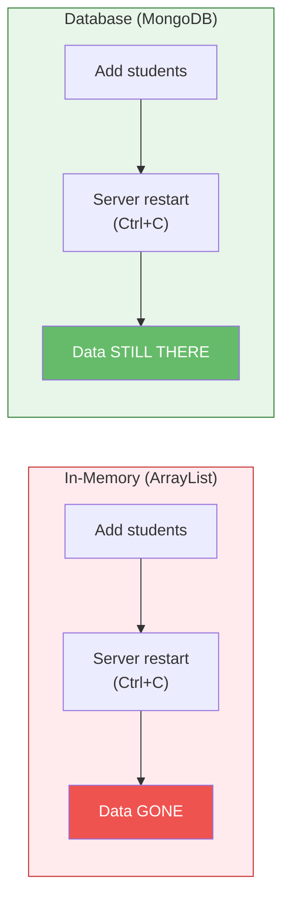
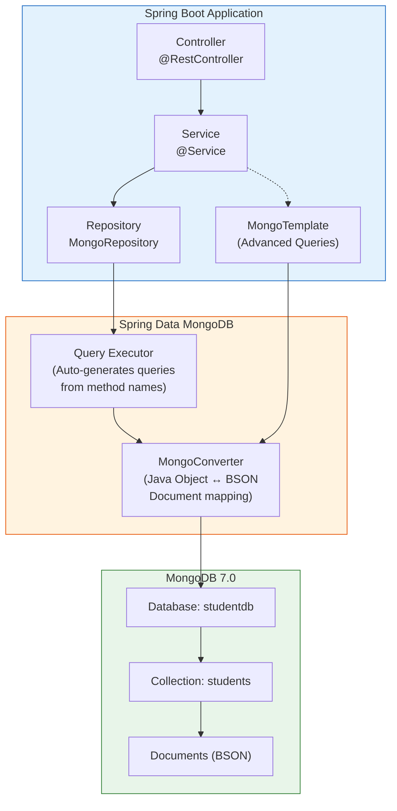

# Database Connectivity with Spring Data MongoDB

[Back to Spring Boot Topics](./)

---

## Table of Contents

- [Why Do We Need a Database?](#why-do-we-need-a-database)
- [Introduction to Spring Data MongoDB](#introduction-to-spring-data-mongodb)
- [Adding MongoDB Dependency](#adding-mongodb-dependency)
- [Configuring MongoDB Connection](#configuring-mongodb-connection)
- [Spring Data MongoDB Architecture](#spring-data-mongodb-architecture)
- [Creating Document Classes](#creating-document-classes)
- [MongoRepository Interface](#mongorepository-interface)
- [CRUD Operations with MongoRepository](#crud-operations-with-mongorepository)
- [Custom Query Methods](#custom-query-methods)
- [Custom Queries with @Query](#custom-queries-with-query)
- [MongoTemplate for Advanced Queries](#mongotemplate-for-advanced-queries)
- [Complete Example: Student Management](#complete-example-student-management)
- [Key Takeaways](#key-takeaways)
- [What Comes Next?](#what-comes-next)

---

## Why Do We Need a Database?

In the previous section, we stored students in an `ArrayList`. It worked -- we could add, edit, and delete students through the web interface. But when we restarted the server, **all data was lost**.

This is the fundamental problem with in-memory storage: it only lives as long as the application process is running. In the real world, servers restart for many reasons -- deployments, crashes, maintenance, scaling. Your users' data cannot disappear every time that happens.

A database gives us **persistent storage** -- data survives server restarts, crashes, and deployments. The data is written to disk (or a remote server), so it exists independently of your application.



We will now replace the `ArrayList` with **MongoDB**. The beautiful part? **Only the data layer changes.** The controller and templates stay almost the same. Instead of `students.add(student)`, we will call `studentRepository.save(student)`. Instead of `students.get(index)`, we will call `studentRepository.findById(id)`. The web pages, forms, and user experience remain identical -- but now the data persists.

---

## Introduction to Spring Data MongoDB

**Spring Data MongoDB** is a part of the larger Spring Data project that provides a familiar and consistent Spring-based programming model for MongoDB. It reduces boilerplate code for database operations.

### Why Spring Data MongoDB?

Without Spring Data, you would need to:
1. Create a `MongoClient` manually
2. Get the database and collection objects
3. Write BSON documents for queries
4. Handle connection pooling
5. Map results to Java objects manually

With Spring Data MongoDB, you:
1. Define your model class with annotations
2. Create an interface extending `MongoRepository`
3. Spring automatically provides the implementation with all CRUD operations

### Prerequisites

- **MongoDB 7.0** installed and running locally on port 27017
- **Spring Boot 2.7.18** with `spring-boot-starter-data-mongodb`

---

## Adding MongoDB Dependency

Add the following dependency to your `pom.xml`:

```xml
<dependency>
    <groupId>org.springframework.boot</groupId>
    <artifactId>spring-boot-starter-data-mongodb</artifactId>
</dependency>
```

This starter includes:
- `spring-data-mongodb` -- Spring Data MongoDB core
- `mongodb-driver-sync` -- Official MongoDB Java driver
- Auto-configuration for MongoDB connection

---

## Configuring MongoDB Connection

### application.properties

```properties
# MongoDB Configuration for local MongoDB 7.0
spring.data.mongodb.host=localhost
spring.data.mongodb.port=27017
spring.data.mongodb.database=studentdb

# Alternative: Connection URI format (does the same thing)
# spring.data.mongodb.uri=mongodb://localhost:27017/studentdb
```

### Configuration Properties Explained

| Property | Value | Description |
|----------|-------|-------------|
| `spring.data.mongodb.host` | `localhost` | MongoDB server hostname |
| `spring.data.mongodb.port` | `27017` | MongoDB default port |
| `spring.data.mongodb.database` | `studentdb` | Database name (created automatically if it does not exist) |

### With Authentication (if required)

```properties
spring.data.mongodb.host=localhost
spring.data.mongodb.port=27017
spring.data.mongodb.database=studentdb
spring.data.mongodb.username=admin
spring.data.mongodb.password=password123
spring.data.mongodb.authentication-database=admin
```

### Verifying MongoDB is Running

Before starting your application, make sure MongoDB is running:

```bash
# Check if MongoDB is running
mongosh --eval "db.runCommand({ ping: 1 })"

# Start MongoDB (if not running)
# On Mac (Homebrew):
brew services start mongodb-community@7.0

# On Linux:
sudo systemctl start mongod

# On Windows:
net start MongoDB
```

---

## Spring Data MongoDB Architecture



### How It Works

1. Your **Controller** receives an HTTP request and calls the **Service**
2. The **Service** calls the **Repository** (or MongoTemplate for complex queries)
3. Spring Data auto-generates the query implementation based on the method name
4. **MongoConverter** maps between Java objects and MongoDB BSON documents
5. The query is executed against the MongoDB database
6. Results are converted back to Java objects and returned

---

## Creating Document Classes

In MongoDB, data is stored as **documents** (similar to JSON). In Spring Data MongoDB, you map Java classes to MongoDB collections using annotations.

### The Student Document Class

```java
package com.example.demo.model;

import org.springframework.data.annotation.Id;
import org.springframework.data.mongodb.core.mapping.Document;
import org.springframework.data.mongodb.core.index.Indexed;

@Document(collection = "students")  // Maps to the "students" collection in MongoDB
public class Student {

    @Id  // Maps to MongoDB's _id field
    private String id;

    private String name;

    @Indexed(unique = true)  // Creates a unique index on rollNumber
    private String rollNumber;

    private String department;

    private String email;

    // Default constructor (required by Spring Data)
    public Student() {
    }

    // Parameterized constructor
    public Student(String name, String rollNumber, String department, String email) {
        this.name = name;
        this.rollNumber = rollNumber;
        this.department = department;
        this.email = email;
    }

    // Getters and Setters
    public String getId() {
        return id;
    }

    public void setId(String id) {
        this.id = id;
    }

    public String getName() {
        return name;
    }

    public void setName(String name) {
        this.name = name;
    }

    public String getRollNumber() {
        return rollNumber;
    }

    public void setRollNumber(String rollNumber) {
        this.rollNumber = rollNumber;
    }

    public String getDepartment() {
        return department;
    }

    public void setDepartment(String department) {
        this.department = department;
    }

    public String getEmail() {
        return email;
    }

    public void setEmail(String email) {
        this.email = email;
    }

    @Override
    public String toString() {
        return "Student{" +
                "id='" + id + '\'' +
                ", name='" + name + '\'' +
                ", rollNumber='" + rollNumber + '\'' +
                ", department='" + department + '\'' +
                ", email='" + email + '\'' +
                '}';
    }
}
```

### Key Annotations

| Annotation | Purpose |
|-----------|---------|
| `@Document(collection = "students")` | Maps this class to the "students" collection in MongoDB |
| `@Id` | Marks the field as the document's primary key (maps to `_id` in MongoDB) |
| `@Indexed(unique = true)` | Creates a database index on the field for faster queries |
| `@Field("field_name")` | Maps a Java field to a differently named MongoDB field |

### How Java Objects Map to MongoDB Documents

```
Java Object                          MongoDB Document
─────────────                        ─────────────────
Student                       →      {
  id = "64a1b2c3..."                   "_id": ObjectId("64a1b2c3..."),
  name = "Rahul"                       "name": "Rahul",
  rollNumber = "21CS001"               "rollNumber": "21CS001",
  department = "CSE"                   "department": "CSE",
  email = "rahul@example.com"          "email": "rahul@example.com"
                                     }
```

When `id` is of type `String`, Spring Data MongoDB automatically generates a MongoDB ObjectId and stores it as a String.

---

## MongoRepository Interface

`MongoRepository` is an interface provided by Spring Data that gives you CRUD operations without writing any implementation code.

### Creating a Repository

```java
package com.example.demo.repository;

import com.example.demo.model.Student;
import org.springframework.data.mongodb.repository.MongoRepository;
import org.springframework.stereotype.Repository;

import java.util.List;

@Repository
public interface StudentRepository extends MongoRepository<Student, String> {
    // MongoRepository<EntityType, IdType>
    // EntityType = Student (the document class)
    // IdType = String (the type of the @Id field)

    // Spring Data automatically provides:
    // - save(Student entity)
    // - findById(String id)
    // - findAll()
    // - deleteById(String id)
    // - count()
    // - existsById(String id)
    // ... and more
}
```

**You do not write any implementation code.** Spring Data generates the implementation at runtime.

### MongoRepository Hierarchy

```
Repository (marker interface)
  └── CrudRepository (basic CRUD operations)
       └── PagingAndSortingRepository (pagination and sorting)
            └── MongoRepository (MongoDB-specific operations)
```

### Built-in Methods

| Method | Description | MongoDB Equivalent |
|--------|-------------|-------------------|
| `save(entity)` | Insert or update a document | `db.students.insertOne()` / `updateOne()` |
| `findById(id)` | Find by `_id` | `db.students.findOne({_id: ...})` |
| `findAll()` | Find all documents | `db.students.find()` |
| `deleteById(id)` | Delete by `_id` | `db.students.deleteOne({_id: ...})` |
| `count()` | Count all documents | `db.students.countDocuments()` |
| `existsById(id)` | Check if document exists | `db.students.findOne({_id: ...}) != null` |
| `deleteAll()` | Delete all documents | `db.students.deleteMany({})` |
| `saveAll(entities)` | Insert/update multiple | Batch insert/update |

---

## CRUD Operations with MongoRepository

### Service Layer

```java
package com.example.demo.service;

import com.example.demo.model.Student;
import com.example.demo.repository.StudentRepository;
import org.springframework.beans.factory.annotation.Autowired;
import org.springframework.stereotype.Service;

import java.util.List;
import java.util.Optional;

@Service
public class StudentService {

    private final StudentRepository studentRepository;

    @Autowired
    public StudentService(StudentRepository studentRepository) {
        this.studentRepository = studentRepository;
    }

    // CREATE
    public Student createStudent(Student student) {
        return studentRepository.save(student);
    }

    // READ - Get all
    public List<Student> getAllStudents() {
        return studentRepository.findAll();
    }

    // READ - Get by ID
    public Student getStudentById(String id) {
        Optional<Student> student = studentRepository.findById(id);
        return student.orElse(null);
        // orElse(null) returns null if the student is not found
    }

    // UPDATE
    public Student updateStudent(String id, Student updatedStudent) {
        Optional<Student> existingOpt = studentRepository.findById(id);
        if (existingOpt.isPresent()) {
            Student existing = existingOpt.get();
            existing.setName(updatedStudent.getName());
            existing.setRollNumber(updatedStudent.getRollNumber());
            existing.setDepartment(updatedStudent.getDepartment());
            existing.setEmail(updatedStudent.getEmail());
            return studentRepository.save(existing);  // save() updates if _id exists
        }
        return null;
    }

    // DELETE
    public void deleteStudent(String id) {
        studentRepository.deleteById(id);
    }

    // COUNT
    public long getStudentCount() {
        return studentRepository.count();
    }

    // EXISTS
    public boolean studentExists(String id) {
        return studentRepository.existsById(id);
    }
}
```

### Understanding `save()` Behavior

The `save()` method behaves differently based on the `id` field:

| Scenario | Behavior |
|----------|----------|
| `id` is `null` | **INSERT** -- creates a new document with an auto-generated `_id` |
| `id` has a value and exists in DB | **UPDATE** -- replaces the existing document |
| `id` has a value but does not exist in DB | **INSERT** -- creates a new document with the given `_id` |

### Understanding `Optional<T>`

`findById()` returns `Optional<Student>` instead of `Student` directly. This avoids `NullPointerException`:

```java
Optional<Student> result = studentRepository.findById("123");

// Way 1: Check if present
if (result.isPresent()) {
    Student student = result.get();
    System.out.println(student.getName());
}

// Way 2: Return default value if not found
Student student = result.orElse(null);

// Way 3: Throw exception if not found
Student student = result.orElseThrow(
    () -> new RuntimeException("Student not found with id: 123")
);
```

---

## Custom Query Methods

Spring Data MongoDB can generate queries from **method names**. You just declare the method in your repository interface -- Spring creates the implementation.

### Naming Convention

The method name follows this pattern: `findBy` + `FieldName` + `Condition`

```java
@Repository
public interface StudentRepository extends MongoRepository<Student, String> {

    // Find by a single field
    List<Student> findByDepartment(String department);
    // MongoDB: db.students.find({ "department": "CSE" })

    // Find by name (case-sensitive)
    List<Student> findByName(String name);
    // MongoDB: db.students.find({ "name": "Rahul" })

    // Find by roll number
    Student findByRollNumber(String rollNumber);
    // MongoDB: db.students.findOne({ "rollNumber": "21CS001" })

    // Find by name containing a substring (like SQL LIKE)
    List<Student> findByNameContaining(String keyword);
    // MongoDB: db.students.find({ "name": { $regex: "keyword" } })

    // Find by name, case-insensitive
    List<Student> findByNameIgnoreCase(String name);

    // Find by department, sorted by name
    List<Student> findByDepartmentOrderByNameAsc(String department);

    // Find by department AND name
    List<Student> findByDepartmentAndName(String department, String name);
    // MongoDB: db.students.find({ "department": "CSE", "name": "Rahul" })

    // Find by department OR name
    List<Student> findByDepartmentOrName(String department, String name);

    // Check if a student exists with the given roll number
    boolean existsByRollNumber(String rollNumber);

    // Count students in a department
    long countByDepartment(String department);

    // Delete by roll number
    void deleteByRollNumber(String rollNumber);
}
```

### Query Method Keywords

| Keyword | Example | MongoDB Equivalent |
|---------|---------|-------------------|
| `findBy` | `findByName(name)` | `{ "name": name }` |
| `And` | `findByNameAndDept(n, d)` | `{ "name": n, "department": d }` |
| `Or` | `findByNameOrDept(n, d)` | `{ $or: [{...}, {...}] }` |
| `Between` | `findByAgeBetween(18, 25)` | `{ "age": { $gte: 18, $lte: 25 } }` |
| `LessThan` | `findByAgeLessThan(25)` | `{ "age": { $lt: 25 } }` |
| `GreaterThan` | `findByAgeGreaterThan(18)` | `{ "age": { $gt: 18 } }` |
| `Like` / `Containing` | `findByNameContaining("Ra")` | `{ "name": { $regex: "Ra" } }` |
| `StartingWith` | `findByNameStartingWith("Ra")` | `{ "name": { $regex: "^Ra" } }` |
| `EndingWith` | `findByNameEndingWith("ul")` | `{ "name": { $regex: "ul$" } }` |
| `IgnoreCase` | `findByNameIgnoreCase("rahul")` | Case-insensitive regex |
| `OrderBy` | `findByDeptOrderByNameAsc(d)` | `.sort({ "name": 1 })` |
| `In` | `findByDepartmentIn(list)` | `{ "department": { $in: [...] } }` |
| `IsNull` | `findByEmailIsNull()` | `{ "email": null }` |
| `IsNotNull` | `findByEmailIsNotNull()` | `{ "email": { $ne: null } }` |
| `True` / `False` | `findByActiveTrue()` | `{ "active": true }` |
| `existsBy` | `existsByRollNumber(roll)` | Returns boolean |
| `countBy` | `countByDepartment(dept)` | Returns long count |
| `deleteBy` | `deleteByRollNumber(roll)` | Deletes matching documents |

---

## Custom Queries with @Query

For complex queries that cannot be expressed through method names, use the `@Query` annotation with MongoDB JSON query syntax:

```java
import org.springframework.data.mongodb.repository.Query;

@Repository
public interface StudentRepository extends MongoRepository<Student, String> {

    // Find students by department using a custom query
    @Query("{ 'department': ?0 }")
    List<Student> findStudentsInDepartment(String department);
    // ?0 refers to the first method parameter

    // Find by name pattern (regex)
    @Query("{ 'name': { $regex: ?0, $options: 'i' } }")
    List<Student> searchByName(String namePattern);
    // $options: 'i' makes it case-insensitive

    // Find students with roll number starting with a prefix
    @Query("{ 'rollNumber': { $regex: '^?0' } }")
    List<Student> findByRollNumberPrefix(String prefix);

    // Find students by department and return only name and rollNumber (projection)
    @Query(value = "{ 'department': ?0 }", fields = "{ 'name': 1, 'rollNumber': 1 }")
    List<Student> findNameAndRollByDepartment(String department);
    // fields: 1 means include, 0 means exclude

    // Find students where department is in a list
    @Query("{ 'department': { $in: ?0 } }")
    List<Student> findByDepartments(List<String> departments);

    // Count students in a department using custom query
    @Query(value = "{ 'department': ?0 }", count = true)
    long countStudentsInDepartment(String department);
}
```

### @Query vs Method Names

| Approach | Use When |
|----------|----------|
| **Method name queries** | Simple queries (1-2 conditions) |
| **@Query annotation** | Complex queries, regex, projections, aggregations |

---

## MongoTemplate for Advanced Queries

`MongoTemplate` is a lower-level API that gives you full control over MongoDB operations. Use it for queries that are too complex for `MongoRepository`.

### Injecting MongoTemplate

```java
package com.example.demo.service;

import com.example.demo.model.Student;
import org.springframework.beans.factory.annotation.Autowired;
import org.springframework.data.mongodb.core.MongoTemplate;
import org.springframework.data.mongodb.core.query.Criteria;
import org.springframework.data.mongodb.core.query.Query;
import org.springframework.data.mongodb.core.query.Update;
import org.springframework.stereotype.Service;

import java.util.List;

@Service
public class StudentAdvancedService {

    private final MongoTemplate mongoTemplate;

    @Autowired
    public StudentAdvancedService(MongoTemplate mongoTemplate) {
        this.mongoTemplate = mongoTemplate;
    }

    // Find students by department
    public List<Student> findByDepartment(String department) {
        Query query = new Query();
        query.addCriteria(Criteria.where("department").is(department));
        return mongoTemplate.find(query, Student.class);
    }

    // Find students by name pattern (case-insensitive)
    public List<Student> searchByName(String keyword) {
        Query query = new Query();
        query.addCriteria(Criteria.where("name").regex(keyword, "i"));
        return mongoTemplate.find(query, Student.class);
    }

    // Find with multiple conditions (AND)
    public List<Student> findByDepartmentAndNamePattern(String department, String namePattern) {
        Query query = new Query();
        query.addCriteria(
            Criteria.where("department").is(department)
                    .and("name").regex(namePattern, "i")
        );
        return mongoTemplate.find(query, Student.class);
    }

    // Find with OR conditions
    public List<Student> findByDepartmentOrName(String department, String name) {
        Query query = new Query();
        query.addCriteria(
            new Criteria().orOperator(
                Criteria.where("department").is(department),
                Criteria.where("name").is(name)
            )
        );
        return mongoTemplate.find(query, Student.class);
    }

    // Update a specific field (partial update)
    public void updateDepartment(String rollNumber, String newDepartment) {
        Query query = new Query();
        query.addCriteria(Criteria.where("rollNumber").is(rollNumber));

        Update update = new Update();
        update.set("department", newDepartment);

        mongoTemplate.updateFirst(query, update, Student.class);
    }

    // Update multiple documents
    public void updateAllDepartmentEmails(String department, String emailDomain) {
        Query query = new Query();
        query.addCriteria(Criteria.where("department").is(department));

        Update update = new Update();
        update.set("email", emailDomain);

        mongoTemplate.updateMulti(query, update, Student.class);
    }

    // Count with criteria
    public long countByDepartment(String department) {
        Query query = new Query();
        query.addCriteria(Criteria.where("department").is(department));
        return mongoTemplate.count(query, Student.class);
    }

    // Check if a document exists
    public boolean existsByRollNumber(String rollNumber) {
        Query query = new Query();
        query.addCriteria(Criteria.where("rollNumber").is(rollNumber));
        return mongoTemplate.exists(query, Student.class);
    }

    // Delete by criteria
    public void deleteByDepartment(String department) {
        Query query = new Query();
        query.addCriteria(Criteria.where("department").is(department));
        mongoTemplate.remove(query, Student.class);
    }
}
```

### MongoTemplate vs MongoRepository

| Feature | MongoRepository | MongoTemplate |
|---------|----------------|---------------|
| **Ease of use** | Very easy | More code required |
| **CRUD operations** | Built-in | Manual query building |
| **Custom queries** | Method names or @Query | Full Criteria API |
| **Partial updates** | Not directly (save replaces entire document) | `updateFirst()`, `updateMulti()` |
| **Aggregation** | Limited | Full aggregation pipeline support |
| **Flexibility** | Limited to predefined patterns | Complete control |
| **When to use** | Simple CRUD, standard queries | Complex queries, partial updates, aggregations |

> **Recommendation:** Start with `MongoRepository` for most operations. Use `MongoTemplate` only when you need features that `MongoRepository` cannot provide (like partial field updates or aggregation pipelines).

---

## Complete Example: Student Management

Here is the complete code for a Student Management application with all layers.

### 1. Model -- Student.java

```java
package com.example.demo.model;

import org.springframework.data.annotation.Id;
import org.springframework.data.mongodb.core.mapping.Document;
import org.springframework.data.mongodb.core.index.Indexed;

@Document(collection = "students")
public class Student {

    @Id
    private String id;

    private String name;

    @Indexed(unique = true)
    private String rollNumber;

    private String department;

    private String email;

    public Student() {
    }

    public Student(String name, String rollNumber, String department, String email) {
        this.name = name;
        this.rollNumber = rollNumber;
        this.department = department;
        this.email = email;
    }

    public String getId() { return id; }
    public void setId(String id) { this.id = id; }
    public String getName() { return name; }
    public void setName(String name) { this.name = name; }
    public String getRollNumber() { return rollNumber; }
    public void setRollNumber(String rollNumber) { this.rollNumber = rollNumber; }
    public String getDepartment() { return department; }
    public void setDepartment(String department) { this.department = department; }
    public String getEmail() { return email; }
    public void setEmail(String email) { this.email = email; }
}
```

### 2. Repository -- StudentRepository.java

```java
package com.example.demo.repository;

import com.example.demo.model.Student;
import org.springframework.data.mongodb.repository.MongoRepository;
import org.springframework.data.mongodb.repository.Query;
import org.springframework.stereotype.Repository;

import java.util.List;

@Repository
public interface StudentRepository extends MongoRepository<Student, String> {

    // Query by method name
    List<Student> findByDepartment(String department);

    Student findByRollNumber(String rollNumber);

    List<Student> findByNameContainingIgnoreCase(String keyword);

    List<Student> findByDepartmentOrderByNameAsc(String department);

    boolean existsByRollNumber(String rollNumber);

    long countByDepartment(String department);

    // Custom query with @Query
    @Query("{ 'name': { $regex: ?0, $options: 'i' } }")
    List<Student> searchByName(String namePattern);

    @Query(value = "{ 'department': ?0 }", fields = "{ 'name': 1, 'rollNumber': 1 }")
    List<Student> findNameAndRollByDepartment(String department);
}
```

### 3. Service -- StudentService.java

```java
package com.example.demo.service;

import com.example.demo.model.Student;
import com.example.demo.repository.StudentRepository;
import org.springframework.beans.factory.annotation.Autowired;
import org.springframework.stereotype.Service;

import java.util.List;
import java.util.Optional;

@Service
public class StudentService {

    private final StudentRepository studentRepository;

    @Autowired
    public StudentService(StudentRepository studentRepository) {
        this.studentRepository = studentRepository;
    }

    // Create
    public Student createStudent(Student student) {
        // Check if roll number already exists
        if (studentRepository.existsByRollNumber(student.getRollNumber())) {
            throw new RuntimeException("Student with roll number "
                + student.getRollNumber() + " already exists");
        }
        return studentRepository.save(student);
    }

    // Read all
    public List<Student> getAllStudents() {
        return studentRepository.findAll();
    }

    // Read by ID
    public Student getStudentById(String id) {
        Optional<Student> student = studentRepository.findById(id);
        return student.orElseThrow(
            () -> new RuntimeException("Student not found with id: " + id)
        );
    }

    // Read by roll number
    public Student getStudentByRollNumber(String rollNumber) {
        return studentRepository.findByRollNumber(rollNumber);
    }

    // Read by department
    public List<Student> getStudentsByDepartment(String department) {
        return studentRepository.findByDepartment(department);
    }

    // Search by name
    public List<Student> searchStudents(String keyword) {
        return studentRepository.searchByName(keyword);
    }

    // Update
    public Student updateStudent(String id, Student updatedStudent) {
        Student existing = getStudentById(id);  // Throws if not found
        existing.setName(updatedStudent.getName());
        existing.setRollNumber(updatedStudent.getRollNumber());
        existing.setDepartment(updatedStudent.getDepartment());
        existing.setEmail(updatedStudent.getEmail());
        return studentRepository.save(existing);
    }

    // Delete
    public void deleteStudent(String id) {
        if (!studentRepository.existsById(id)) {
            throw new RuntimeException("Student not found with id: " + id);
        }
        studentRepository.deleteById(id);
    }

    // Count
    public long countStudentsByDepartment(String department) {
        return studentRepository.countByDepartment(department);
    }
}
```

### 4. Controller -- StudentController.java

```java
package com.example.demo.controller;

import com.example.demo.model.Student;
import com.example.demo.service.StudentService;
import org.springframework.beans.factory.annotation.Autowired;
import org.springframework.http.HttpStatus;
import org.springframework.http.ResponseEntity;
import org.springframework.web.bind.annotation.*;

import java.util.List;

@RestController
@RequestMapping("/api/students")
public class StudentController {

    private final StudentService studentService;

    @Autowired
    public StudentController(StudentService studentService) {
        this.studentService = studentService;
    }

    // POST /api/students -- Create a new student
    @PostMapping
    public ResponseEntity<Student> createStudent(@RequestBody Student student) {
        Student created = studentService.createStudent(student);
        return ResponseEntity.status(HttpStatus.CREATED).body(created);
    }

    // GET /api/students -- Get all students
    @GetMapping
    public List<Student> getAllStudents() {
        return studentService.getAllStudents();
    }

    // GET /api/students/{id} -- Get student by ID
    @GetMapping("/{id}")
    public ResponseEntity<Student> getStudentById(@PathVariable String id) {
        Student student = studentService.getStudentById(id);
        return ResponseEntity.ok(student);
    }

    // GET /api/students/roll/{rollNumber} -- Get by roll number
    @GetMapping("/roll/{rollNumber}")
    public ResponseEntity<Student> getByRollNumber(@PathVariable String rollNumber) {
        Student student = studentService.getStudentByRollNumber(rollNumber);
        if (student != null) {
            return ResponseEntity.ok(student);
        }
        return ResponseEntity.notFound().build();
    }

    // GET /api/students/department?name=CSE -- Get by department
    @GetMapping("/department")
    public List<Student> getByDepartment(@RequestParam String name) {
        return studentService.getStudentsByDepartment(name);
    }

    // GET /api/students/search?keyword=Rahul -- Search by name
    @GetMapping("/search")
    public List<Student> searchStudents(@RequestParam String keyword) {
        return studentService.searchStudents(keyword);
    }

    // PUT /api/students/{id} -- Update a student
    @PutMapping("/{id}")
    public ResponseEntity<Student> updateStudent(@PathVariable String id,
                                                  @RequestBody Student student) {
        Student updated = studentService.updateStudent(id, student);
        return ResponseEntity.ok(updated);
    }

    // DELETE /api/students/{id} -- Delete a student
    @DeleteMapping("/{id}")
    public ResponseEntity<Void> deleteStudent(@PathVariable String id) {
        studentService.deleteStudent(id);
        return ResponseEntity.noContent().build();
    }
}
```

### 5. application.properties

```properties
# Application
spring.application.name=student-management

# Server
server.port=8080

# MongoDB Configuration (local MongoDB 7.0)
spring.data.mongodb.host=localhost
spring.data.mongodb.port=27017
spring.data.mongodb.database=studentdb

# Logging
logging.level.org.springframework.data.mongodb=DEBUG
```

### Testing with curl

```bash
# Create a student
curl -X POST http://localhost:8080/api/students \
  -H "Content-Type: application/json" \
  -d '{
    "name": "Rahul Kumar",
    "rollNumber": "21IT001",
    "department": "IT",
    "email": "rahul@vasavi.ac.in"
  }'

# Get all students
curl http://localhost:8080/api/students

# Get student by ID (replace with actual ID from create response)
curl http://localhost:8080/api/students/64a1b2c3d4e5f6789

# Get by roll number
curl http://localhost:8080/api/students/roll/21IT001

# Get by department
curl "http://localhost:8080/api/students/department?name=IT"

# Search by name
curl "http://localhost:8080/api/students/search?keyword=Rahul"

# Update a student
curl -X PUT http://localhost:8080/api/students/64a1b2c3d4e5f6789 \
  -H "Content-Type: application/json" \
  -d '{
    "name": "Rahul Kumar Singh",
    "rollNumber": "21IT001",
    "department": "IT",
    "email": "rahul.singh@vasavi.ac.in"
  }'

# Delete a student
curl -X DELETE http://localhost:8080/api/students/64a1b2c3d4e5f6789
```

### Verify in MongoDB Shell

```javascript
// Connect to MongoDB
mongosh

// Switch to the database
use studentdb

// View all students
db.students.find().pretty()

// Count students in IT department
db.students.countDocuments({ department: "IT" })

// Find by roll number
db.students.findOne({ rollNumber: "21IT001" })
```

---

## Key Takeaways

1. **Spring Data MongoDB** eliminates boilerplate code for database operations. You define an interface -- Spring provides the implementation.
2. Use `@Document` to map a Java class to a MongoDB collection and `@Id` for the primary key.
3. `MongoRepository<EntityType, IdType>` provides built-in CRUD operations: `save()`, `findById()`, `findAll()`, `deleteById()`, `count()`, etc.
4. Spring Data generates query implementations from **method names**: `findByDepartment()`, `findByNameContaining()`, `countByDepartment()`, etc.
5. Use `@Query` with MongoDB JSON syntax for complex queries that method names cannot express.
6. Use `MongoTemplate` for advanced operations like partial field updates, aggregation pipelines, and complex criteria queries.
7. The `save()` method both inserts (when `id` is null) and updates (when `id` exists).
8. `findById()` returns `Optional<T>` -- use `orElse()` or `orElseThrow()` to handle missing documents safely.
9. Configure MongoDB connection in `application.properties` with `spring.data.mongodb.host`, `port`, and `database`.
10. The complete flow is: **Model** (`@Document`) -> **Repository** (`MongoRepository`) -> **Service** (`@Service`) -> **Controller** (`@RestController`).

---

## What Comes Next?

Now that we have a full working app with Thymeleaf and MongoDB, you might notice something: every time you add, edit, or delete a student, the **ENTIRE page reloads**. Open the browser's Network tab (F12 -> Network) and watch -- a full HTML page is fetched every time. The server re-renders the complete page, sends it to the browser, and the browser replaces everything on screen.

What if we could send and receive just the **data** (JSON) instead of full HTML pages? What if the browser could update only the parts that changed, without reloading the entire page? In the next section, we will learn about **REST APIs**, which do exactly that -- and they are the foundation for building modern frontends with React.

---

[Previous: Building Web Pages](04-building-web-pages.md) | [Next: REST APIs](06-rest-apis.md)
