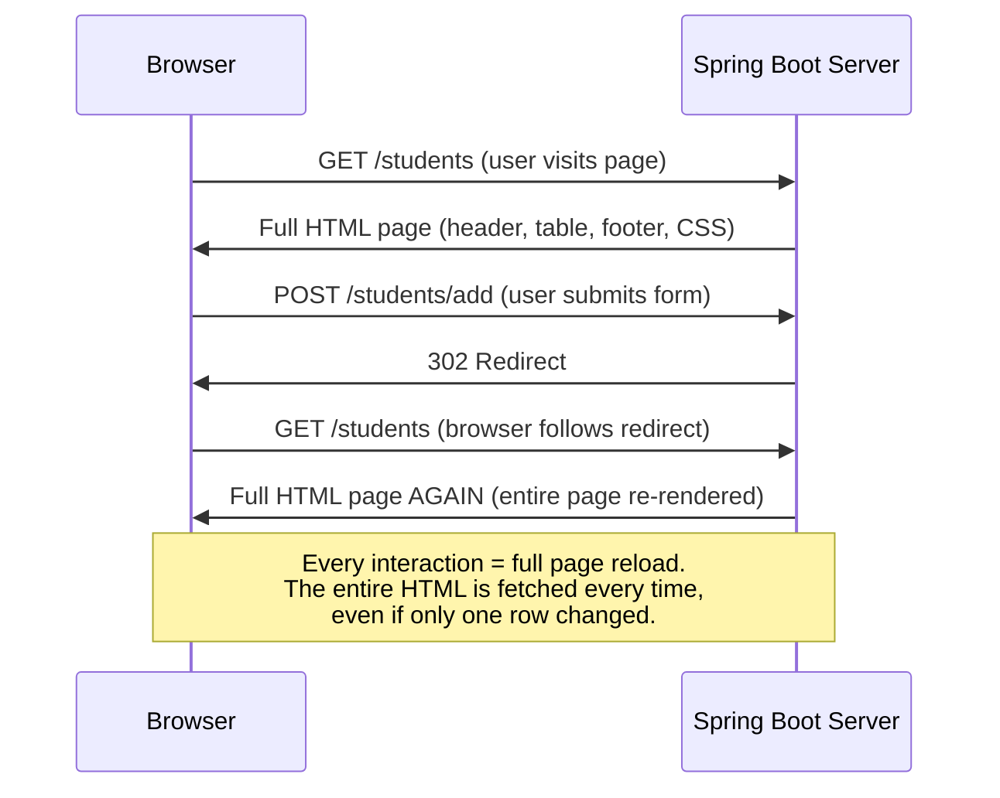
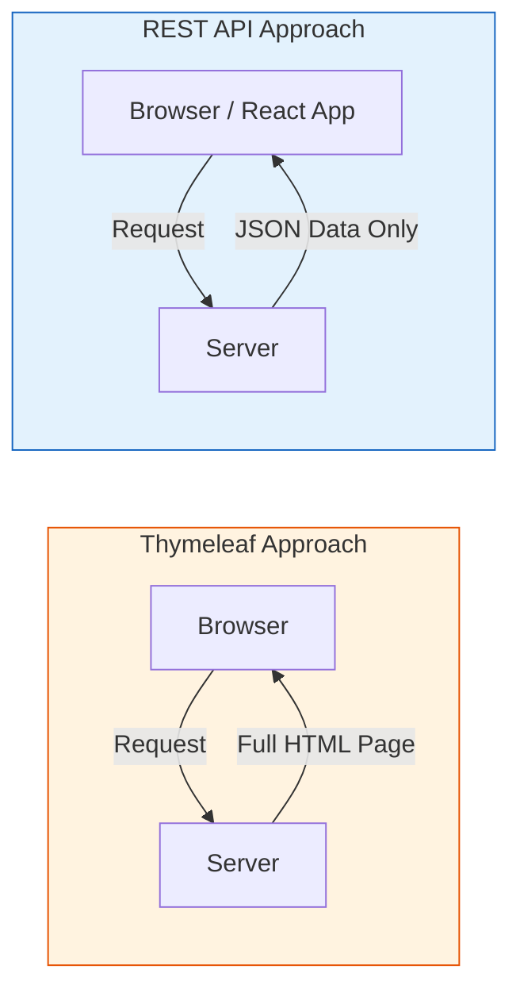
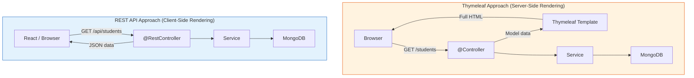

# REST APIs with Spring Boot

[Back to Spring Boot Topics](./)

---

## Table of Contents

- [The Problem with Full Page Reloads](#the-problem-with-full-page-reloads)
- [What Are REST APIs?](#what-are-rest-apis)
- [@RestController vs @Controller](#restcontroller-vs-controller)
- [@ResponseBody Explained](#responsebody-explained)
- [JSON Responses](#json-responses)
- [Request Mapping Annotations](#request-mapping-annotations)
- [Request and Response Handling](#request-and-response-handling)
  - [@PathVariable](#pathvariable----extracting-values-from-the-url-path)
  - [@RequestParam](#requestparam----extracting-query-parameters)
  - [@RequestBody](#requestbody----reading-json-from-request-body)
  - [ResponseEntity](#responseentity----controlling-http-response)
- [HTTP Methods and CRUD Operations](#http-methods-and-crud-operations)
- [Building the Student Management REST API](#building-the-student-management-rest-api)
- [Testing with Postman or curl](#testing-with-postman-or-curl)
- [Thymeleaf vs REST API: Side-by-Side](#thymeleaf-vs-rest-api-side-by-side)
- [Key Takeaways](#key-takeaways)

---

## The Problem with Full Page Reloads

You have now built a full web app with Thymeleaf and MongoDB. It works great. But notice what happens every time you click a button -- add a student, edit a student, delete a student:



Open your browser's **Network tab** (F12 -> Network) and watch what happens when you add a student:

1. The browser sends the form data to the server
2. The server processes it, then sends a **redirect**
3. The browser follows the redirect and requests the full page
4. The server renders the **entire HTML page** from scratch and sends it back
5. The browser **replaces everything** on the screen

This means: even if you only added one student, the server re-rendered the entire page (header, navigation, table, footer, CSS references) and the browser threw away the old page and loaded a completely new one.

**What if we could just send and receive DATA (JSON) instead of full HTML pages?**

**What if the frontend could update ONLY the parts that changed?**

This is where **REST APIs** come in -- and why modern web apps use React, Angular, or Vue on the frontend.

---

## What Are REST APIs?

REST (Representational State Transfer) APIs are a way for applications to communicate by exchanging **data** (usually JSON) instead of full HTML pages.



| Thymeleaf (Server-Side) | REST API (Client-Side) |
|--------------------------|----------------------|
| Server builds the HTML | Server sends only JSON data |
| Browser displays the finished page | Frontend (React) builds the HTML |
| Every click = full page reload | Only the changed parts update |
| Good for simple apps | Good for rich, interactive apps |

---

## @RestController vs @Controller

You have already used `@Controller` to build Thymeleaf web pages. Now meet `@RestController`:

### @Controller (returns HTML pages)

```java
@Controller
public class StudentWebController {

    @GetMapping("/students")
    public String listStudents(Model model) {
        model.addAttribute("students", studentService.getAllStudents());
        return "students";  // Returns VIEW NAME -> templates/students.html
    }
}
```

### @RestController (returns JSON data)

```java
@RestController
public class StudentApiController {

    @GetMapping("/api/students")
    public List<Student> getStudents() {
        return studentService.getAllStudents();
        // Returns DATA -> automatically converted to JSON
    }
}
```

### Comparison

| Aspect | @Controller | @RestController |
|--------|------------|----------------|
| **Returns** | View name (HTML template) | Data (JSON/XML) |
| **Used for** | Web pages with Thymeleaf | REST APIs |
| **Response body** | Need `@ResponseBody` on each method | Automatic on all methods |
| **Clients** | Browsers (humans) | Mobile apps, React/Angular frontends, Postman |
| **Example response** | Full HTML page | `[{"name":"Rahul","rollNumber":"21CS001"}]` |

---

## @ResponseBody Explained

`@ResponseBody` tells Spring to write the return value directly into the HTTP response body (as JSON), instead of resolving it as a view name.

```java
@Controller
public class MixedController {

    // Returns HTML page
    @GetMapping("/page")
    public String page() {
        return "page";  // Resolves to templates/page.html
    }

    // Returns JSON data (because of @ResponseBody)
    @GetMapping("/data")
    @ResponseBody
    public Student data() {
        return new Student("John", "21CS001", "CSE", "john@example.com");  // Returns JSON
    }
}
```

`@RestController` is just a shortcut -- it adds `@ResponseBody` to every method automatically. So `@RestController` = `@Controller` + `@ResponseBody` on every method.

---

## JSON Responses

When a `@RestController` method returns a Java object, Spring automatically converts it to JSON using the **Jackson** library (included in `spring-boot-starter-web`).

```java
@RestController
public class ExampleController {

    @GetMapping("/api/student")
    public Student getStudent() {
        return new Student("Rahul", "21CS001", "CSE", "rahul@example.com");
    }
}
```

The browser or client receives:

```json
{
    "name": "Rahul",
    "rollNumber": "21CS001",
    "department": "CSE",
    "email": "rahul@example.com"
}
```

For a list of students:

```json
[
    {"name": "Rahul", "rollNumber": "21CS001", "department": "CSE", "email": "rahul@example.com"},
    {"name": "Priya", "rollNumber": "21IT002", "department": "IT", "email": "priya@example.com"}
]
```

Spring uses Jackson to automatically convert:
- **Java object to JSON** (serialization) for responses
- **JSON to Java object** (deserialization) for `@RequestBody` parameters

---

## Request Mapping Annotations

### @RequestMapping

The base annotation for mapping HTTP requests to controller methods.

```java
@RestController
@RequestMapping("/api/students")  // Base URL for all methods in this controller
public class StudentController {

    @RequestMapping(method = RequestMethod.GET)
    public List<Student> getAllStudents() {
        return studentService.getAllStudents();
    }

    @RequestMapping(value = "/{id}", method = RequestMethod.GET)
    public Student getStudent(@PathVariable String id) {
        return studentService.getStudentById(id);
    }
}
```

### Shortcut Annotations

Spring provides shortcut annotations for common HTTP methods:

| Annotation | HTTP Method | Purpose |
|-----------|------------|---------|
| `@GetMapping` | GET | Retrieve data |
| `@PostMapping` | POST | Create new data |
| `@PutMapping` | PUT | Update existing data |
| `@DeleteMapping` | DELETE | Delete data |
| `@PatchMapping` | PATCH | Partially update data |

```java
@RestController
@RequestMapping("/api/students")
public class StudentController {

    @GetMapping                    // GET    /api/students
    public List<Student> getAll() { ... }

    @GetMapping("/{id}")           // GET    /api/students/123
    public Student getById() { ... }

    @PostMapping                   // POST   /api/students
    public Student create() { ... }

    @PutMapping("/{id}")           // PUT    /api/students/123
    public Student update() { ... }

    @DeleteMapping("/{id}")        // DELETE /api/students/123
    public void delete() { ... }
}
```

---

## Request and Response Handling

### @PathVariable -- Extracting Values from the URL Path

Use `@PathVariable` to extract values from the URL path.

```java
// URL: GET /api/students/21CS001
@GetMapping("/api/students/{rollNumber}")
public Student getStudent(@PathVariable String rollNumber) {
    return studentService.findByRollNumber(rollNumber);
}

// Multiple path variables
// URL: GET /api/departments/CSE/students/21CS001
@GetMapping("/api/departments/{dept}/students/{roll}")
public Student getStudent(@PathVariable String dept, @PathVariable String roll) {
    return studentService.findByDeptAndRoll(dept, roll);
}
```

### @RequestParam -- Extracting Query Parameters

Use `@RequestParam` to extract values from the query string (`?key=value`).

```java
// URL: GET /api/students?department=CSE
@GetMapping("/api/students")
public List<Student> getStudents(@RequestParam String department) {
    return studentService.findByDepartment(department);
}

// Optional parameter with default value
// URL: GET /api/students?page=1&size=10
@GetMapping("/api/students")
public List<Student> getStudents(
        @RequestParam(defaultValue = "0") int page,
        @RequestParam(defaultValue = "10") int size) {
    return studentService.findAll(page, size);
}

// Optional parameter (not required)
@GetMapping("/api/students")
public List<Student> search(
        @RequestParam(required = false) String name) {
    if (name != null) {
        return studentService.findByName(name);
    }
    return studentService.findAll();
}
```

### @PathVariable vs @RequestParam

| Feature | @PathVariable | @RequestParam |
|---------|--------------|---------------|
| **URL format** | `/students/{id}` | `/students?id=123` |
| **Use case** | Identifying a specific resource | Filtering, sorting, pagination |
| **Required** | Always required | Can be optional |
| **Example** | `/api/students/5` | `/api/students?dept=CSE&page=1` |

### @RequestBody -- Reading JSON from Request Body

Use `@RequestBody` to read JSON data sent in the request body (typically with POST and PUT requests).

```java
// Client sends JSON in the request body:
// POST /api/students
// Body: {"name": "Rahul", "rollNumber": "21CS001", "department": "CSE", "email": "rahul@example.com"}

@PostMapping("/api/students")
public Student createStudent(@RequestBody Student student) {
    // Spring automatically converts JSON to a Student object (deserialization)
    return studentService.save(student);
}
```

### ResponseEntity -- Controlling HTTP Response

`ResponseEntity` gives you full control over the HTTP response (status code, headers, body):

```java
@GetMapping("/{id}")
public ResponseEntity<Student> getStudent(@PathVariable String id) {
    Student student = studentService.findById(id);
    if (student != null) {
        return ResponseEntity.ok(student);                    // 200 OK
    }
    return ResponseEntity.notFound().build();                  // 404 Not Found
}

@PostMapping
public ResponseEntity<Student> createStudent(@RequestBody Student student) {
    Student saved = studentService.save(student);
    return ResponseEntity.status(HttpStatus.CREATED).body(saved);  // 201 Created
}

@DeleteMapping("/{id}")
public ResponseEntity<Void> deleteStudent(@PathVariable String id) {
    studentService.deleteById(id);
    return ResponseEntity.noContent().build();                  // 204 No Content
}
```

### Common HTTP Status Codes

| Status Code | Meaning | When to Use |
|------------|---------|-------------|
| 200 OK | Success | GET, PUT requests |
| 201 Created | Resource created | POST requests |
| 204 No Content | Success, no body | DELETE requests |
| 400 Bad Request | Invalid input | Validation failures |
| 404 Not Found | Resource not found | ID does not exist |
| 500 Internal Server Error | Server error | Unexpected exceptions |

---

## HTTP Methods and CRUD Operations

REST APIs follow a standard mapping between HTTP methods and CRUD (Create, Read, Update, Delete) operations:

| HTTP Method | CRUD Operation | URL Pattern | Request Body | Description |
|------------|----------------|-------------|-------------|-------------|
| **GET** | Read | `/api/students` | No | Get all students |
| **GET** | Read | `/api/students/{id}` | No | Get one student by ID |
| **POST** | Create | `/api/students` | Yes (JSON) | Create a new student |
| **PUT** | Update | `/api/students/{id}` | Yes (JSON) | Update entire student |
| **PATCH** | Partial Update | `/api/students/{id}` | Yes (JSON) | Update specific fields |
| **DELETE** | Delete | `/api/students/{id}` | No | Delete a student |

### REST API Design Best Practices

1. Use **nouns** for URLs, not verbs: `/api/students` (not `/api/getStudents`)
2. Use **plural** nouns: `/api/students` (not `/api/student`)
3. Use **path variables** for resource identification: `/api/students/{id}`
4. Use **query parameters** for filtering: `/api/students?department=CSE`
5. Return appropriate **HTTP status codes**
6. Use a **base path** like `/api/` to separate API endpoints from web pages

---

## Building the Student Management REST API

Here is the same Student Management app, but as a REST API. Compare this with the Thymeleaf version from the previous sections -- the data logic is the same, but instead of returning HTML templates, we return JSON.

### Student Model

The same `Student` class works for both approaches. If you are using MongoDB (from the database connectivity section), it will have `@Document` and `@Id` annotations. The JSON conversion works the same either way.

### Complete REST Controller

```java
package com.example.demo.controller;

import com.example.demo.model.Student;
import com.example.demo.service.StudentService;
import org.springframework.beans.factory.annotation.Autowired;
import org.springframework.http.HttpStatus;
import org.springframework.http.ResponseEntity;
import org.springframework.web.bind.annotation.*;

import java.util.List;

@RestController
@RequestMapping("/api/students")
public class StudentController {

    private final StudentService studentService;

    @Autowired
    public StudentController(StudentService studentService) {
        this.studentService = studentService;
    }

    // GET /api/students -- Get all students
    @GetMapping
    public List<Student> getAllStudents() {
        return studentService.getAllStudents();
    }

    // GET /api/students/{id} -- Get student by ID
    @GetMapping("/{id}")
    public ResponseEntity<Student> getStudentById(@PathVariable String id) {
        Student student = studentService.getStudentById(id);
        if (student != null) {
            return ResponseEntity.ok(student);
        }
        return ResponseEntity.notFound().build();
    }

    // POST /api/students -- Create a new student
    @PostMapping
    public ResponseEntity<Student> createStudent(@RequestBody Student student) {
        Student created = studentService.createStudent(student);
        return ResponseEntity.status(HttpStatus.CREATED).body(created);
    }

    // PUT /api/students/{id} -- Update a student
    @PutMapping("/{id}")
    public ResponseEntity<Student> updateStudent(@PathVariable String id,
                                                  @RequestBody Student student) {
        Student updated = studentService.updateStudent(id, student);
        if (updated != null) {
            return ResponseEntity.ok(updated);
        }
        return ResponseEntity.notFound().build();
    }

    // DELETE /api/students/{id} -- Delete a student
    @DeleteMapping("/{id}")
    public ResponseEntity<Void> deleteStudent(@PathVariable String id) {
        studentService.deleteStudent(id);
        return ResponseEntity.noContent().build();
    }

    // GET /api/students/department?name=CSE -- Search by department
    @GetMapping("/department")
    public List<Student> getByDepartment(@RequestParam String name) {
        return studentService.getStudentsByDepartment(name);
    }
}
```

Notice the differences from the Thymeleaf controller:
- `@RestController` instead of `@Controller`
- No `Model` object -- we return data directly
- No view names -- we return Java objects that become JSON
- No `redirect:` -- the client decides what to do with the response
- `@RequestBody` instead of `@ModelAttribute` -- we receive JSON, not form data

---

## Testing with Postman or curl

Since REST APIs return JSON (not HTML pages), you cannot test them by visiting URLs in a browser (well, you can for GET requests, but not for POST/PUT/DELETE). Use **Postman**, **Thunder Client** (VS Code extension), or **curl**.

```bash
# GET all students
curl http://localhost:8080/api/students

# GET student by ID
curl http://localhost:8080/api/students/64a1b2c3d4e5f6

# POST create student
curl -X POST http://localhost:8080/api/students \
  -H "Content-Type: application/json" \
  -d '{"name":"Rahul","rollNumber":"21CS001","department":"CSE","email":"rahul@example.com"}'

# PUT update student
curl -X PUT http://localhost:8080/api/students/64a1b2c3d4e5f6 \
  -H "Content-Type: application/json" \
  -d '{"name":"Rahul Kumar","rollNumber":"21CS001","department":"CSE","email":"rahul.kumar@example.com"}'

# DELETE student
curl -X DELETE http://localhost:8080/api/students/64a1b2c3d4e5f6
```

### Reading the Response

When you create a student with POST, the server responds with:

```
HTTP/1.1 201 Created
Content-Type: application/json

{
    "id": "64a1b2c3d4e5f6789",
    "name": "Rahul",
    "rollNumber": "21CS001",
    "department": "CSE",
    "email": "rahul@example.com"
}
```

The status code `201 Created` tells the client the resource was created successfully, and the response body contains the created student with its generated ID.

---

## Thymeleaf vs REST API: Side-by-Side

### Architecture Comparison



### Code Comparison

| Aspect | Thymeleaf (@Controller) | REST API (@RestController) |
|--------|------------------------|---------------------------|
| **Annotation** | `@Controller` | `@RestController` |
| **List students** | `model.addAttribute("students", list); return "students";` | `return studentService.getAllStudents();` |
| **Create** | `@ModelAttribute Student s` (form data) | `@RequestBody Student s` (JSON) |
| **After create** | `return "redirect:/students";` | `return ResponseEntity.status(201).body(created);` |
| **Client receives** | Full HTML page | JSON data only |
| **Who builds HTML?** | Server (Thymeleaf) | Client (React/JavaScript) |
| **Page reload?** | Yes, every interaction | No, only data changes |

### When to Use Which?

| Use Thymeleaf When... | Use REST APIs When... |
|----------------------|----------------------|
| Building simple internal tools | Building apps with rich interactivity |
| Team knows Java but not JavaScript | Frontend team uses React/Angular/Vue |
| SEO is important (server-rendered HTML) | Building mobile app backends |
| Rapid prototyping | Multiple clients need the same data |

---

## Key Takeaways

1. **Thymeleaf** returns full HTML pages on every request; **REST APIs** return only JSON data.
2. Use `@RestController` for REST APIs -- it automatically adds `@ResponseBody` to every method.
3. Use shortcut annotations: `@GetMapping`, `@PostMapping`, `@PutMapping`, `@DeleteMapping` instead of `@RequestMapping`.
4. `@PathVariable` extracts values from the URL path; `@RequestParam` extracts query string parameters; `@RequestBody` reads JSON from the request body.
5. `ResponseEntity` gives you control over HTTP status codes (200, 201, 204, 404, etc.).
6. REST APIs follow **CRUD conventions**: GET = Read, POST = Create, PUT = Update, DELETE = Delete.
7. Use **nouns** and **plural** names for URLs: `/api/students`, not `/api/getStudent`.
8. The same backend service and model classes can serve both Thymeleaf and REST controllers.

Now that we have a REST API returning JSON, we need a frontend that can consume it. That is React -- which we will learn next.

---

[Previous: Database Connectivity](05-database-connectivity.md) | [Next: React Introduction](../react/01-introduction.md)
