# Spring Boot - Questions & Answers

> Exam preparation material covering all Spring Boot topics from Unit III
>
> **B.E. IV Semester IT - Vasavi College of Engineering**
> JDK 1.8 | Spring Boot 2.7.18 | Maven | MongoDB 7.0

## Table of Contents

- [Section 1: Introduction to Spring and Spring Boot](#section-1-introduction-to-spring-and-spring-boot)
- [Section 2: Spring Boot Architecture](#section-2-spring-boot-architecture)
- [Section 3: Installation of Spring Boot - Spring Initializr](#section-3-installation-of-spring-boot---spring-initializr)
- [Section 4: Building a Web Application using Spring Boot](#section-4-building-a-web-application-using-spring-boot)
- [Section 5: Dependency Injection](#section-5-dependency-injection)
- [Section 6: Database Connectivity using Spring Boot (MongoDB)](#section-6-database-connectivity-using-spring-boot-mongodb)

---

## Section 1: Introduction to Spring and Spring Boot

### Q1. What is Spring Framework? (2 Marks)

Spring Framework is an open-source, lightweight Java application framework that provides comprehensive infrastructure support for developing enterprise Java applications. It was created by Rod Johnson in 2003. Spring provides features like Dependency Injection (DI), Aspect-Oriented Programming (AOP), transaction management, and MVC web framework. It follows the principle of Inversion of Control (IoC), where the framework manages object creation and lifecycle instead of the developer doing it manually.

---

### Q2. What is Spring Boot? (2 Marks)

Spring Boot is an extension of the Spring Framework that simplifies the development of Spring-based applications. It eliminates boilerplate configuration by providing auto-configuration, embedded servers (Tomcat, Jetty), and starter dependencies. Spring Boot follows an opinionated approach with sensible defaults, allowing developers to create stand-alone, production-ready applications with minimal setup. It was developed by Pivotal Team and released in 2014.

---

### Q3. What are the advantages of Spring Boot over Spring? (2 Marks)

Key advantages of Spring Boot over Spring include: (1) Auto-configuration eliminates manual XML/Java configuration, (2) Embedded servers (Tomcat/Jetty) remove the need for external server deployment, (3) Starter dependencies simplify Maven/Gradle dependency management, (4) No XML configuration required, (5) Built-in production-ready features like health checks and metrics, (6) Rapid application development with minimal boilerplate code.

---

### Q4. What is auto-configuration in Spring Boot? (2 Marks)

Auto-configuration is a feature of Spring Boot that automatically configures the Spring application based on the JAR dependencies present in the classpath. For example, if `spring-boot-starter-web` is on the classpath, Spring Boot automatically configures an embedded Tomcat server and Spring MVC. If `spring-boot-starter-data-mongodb` is present, it auto-configures a MongoDB connection. Auto-configuration is enabled by the `@EnableAutoConfiguration` annotation (included in `@SpringBootApplication`).

---

### Q5. What is the purpose of @SpringBootApplication? (2 Marks)

`@SpringBootApplication` is a convenience annotation that combines three annotations: (1) `@Configuration` - marks the class as a source of bean definitions, (2) `@EnableAutoConfiguration` - enables Spring Boot's auto-configuration mechanism, and (3) `@ComponentScan` - enables scanning of the package and sub-packages for Spring components (`@Component`, `@Service`, `@Repository`, `@Controller`). It is placed on the main class of a Spring Boot application.

---

### Q6. What is an embedded server? (2 Marks)

An embedded server is a web server that is bundled within the Spring Boot application JAR itself, eliminating the need to install and configure an external application server. Spring Boot supports embedded Tomcat (default), Jetty, and Undertow. When the application starts, the embedded server starts automatically on a configured port (default 8080). This makes the application self-contained and easy to deploy using a simple `java -jar` command.

---

### Q7. What is Thymeleaf? (2 Marks)

Thymeleaf is a modern server-side Java template engine for web applications. It processes HTML, XML, JavaScript, CSS, and plain text. In Spring Boot, Thymeleaf serves as the view layer in the MVC architecture, replacing JSP. It uses natural templates that can be directly opened in browsers and uses `th:` attributes (e.g., `th:text`, `th:each`, `th:if`) to bind data from the controller to the HTML view. Spring Boot auto-configures Thymeleaf when `spring-boot-starter-thymeleaf` is added.

---

### Q8. What is the purpose of application.properties? (2 Marks)

`application.properties` is the default configuration file in Spring Boot located in `src/main/resources/`. It is used to configure application-level settings such as server port (`server.port=8080`), database connection details (`spring.data.mongodb.uri`), logging levels, and custom application properties. Spring Boot reads this file automatically at startup. An alternative YAML format (`application.yml`) can also be used for hierarchical configuration.

---

### Q9. What is the purpose of pom.xml? (2 Marks)

`pom.xml` (Project Object Model) is the fundamental configuration file for Maven-based projects. It defines the project's metadata (groupId, artifactId, version), dependencies (Spring Boot starters, database drivers), build plugins, and the parent project (`spring-boot-starter-parent`). Maven reads this file to download required libraries, compile code, run tests, and package the application. It acts as the single source of truth for project build configuration.

---

### Q10. What is Maven? (2 Marks)

Apache Maven is a build automation and project management tool for Java projects. It manages project dependencies by downloading JAR files from central repositories, standardizes project structure, and provides a consistent build lifecycle (compile, test, package, install, deploy). Maven uses `pom.xml` for configuration and follows the convention-over-configuration principle. In Spring Boot, Maven manages starter dependencies and provides the `mvn spring-boot:run` command to launch applications.

---

### Q11. Compare Spring Framework vs Spring Boot (Essay - 10 Marks)

Spring Framework and Spring Boot are complementary technologies but differ significantly in their approach to application development.

**Comparison Table:**

| Feature | Spring Framework | Spring Boot |
|---------|-----------------|-------------|
| Configuration | Manual (XML or Java) | Auto-configuration |
| Server | External (Tomcat, JBoss) | Embedded (Tomcat, Jetty) |
| Dependency Management | Manual version management | Starter dependencies |
| Boilerplate Code | Extensive | Minimal |
| Setup Time | Longer | Rapid |
| Deployment | WAR file to server | Standalone JAR |
| XML Config | Often required | Not required |
| Production Features | Manual setup | Built-in (Actuator) |

**Spring Framework Configuration Example:**

```java
<!-- web.xml -->
<servlet>
    <servlet-name>dispatcher</servlet-name>
    <servlet-class>org.springframework.web.servlet.DispatcherServlet</servlet-class>
</servlet>

<!-- dispatcher-servlet.xml -->
<context:component-scan base-package="com.example" />
<bean class="org.springframework.web.servlet.view.InternalResourceViewResolver">
    <property name="prefix" value="/WEB-INF/views/" />
    <property name="suffix" value=".jsp" />
</bean>
```

**Spring Boot Equivalent:**

```java
@SpringBootApplication
public class StudentApplication {
    public static void main(String[] args) {
        SpringApplication.run(StudentApplication.class, args);
    }
}
```

**Architecture Comparison Diagram:**

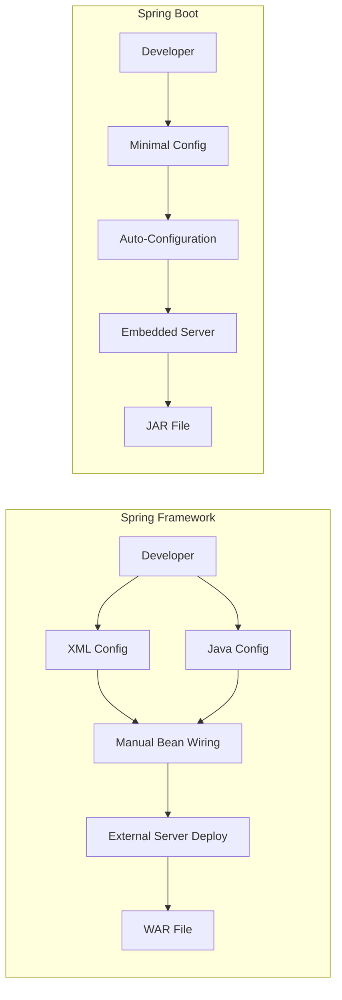

**Key Differences Explained:**

1. **Configuration:** Spring requires explicit configuration through XML files or Java-based `@Configuration` classes. Every bean, view resolver, and data source must be manually defined. Spring Boot auto-configures these based on classpath dependencies.

2. **Dependency Management:** In Spring, developers must individually specify each dependency with compatible versions. Spring Boot provides starter POMs (e.g., `spring-boot-starter-web`) that bundle related dependencies with tested, compatible versions.

3. **Server Deployment:** Spring applications are packaged as WAR files and deployed to external servers like Tomcat or JBoss. Spring Boot embeds the server within the application JAR, making it self-contained and runnable with `java -jar app.jar`.

4. **Development Speed:** Spring Boot significantly reduces development time through auto-configuration, DevTools for hot-reload, and opinionated defaults. Spring Framework requires more setup time but offers greater flexibility.

5. **Production Readiness:** Spring Boot includes Actuator for health checks, metrics, and monitoring out of the box. In Spring Framework, these features require manual integration.

**When to Use What:**
- Use **Spring Framework** when fine-grained control over configuration is needed, or when integrating with legacy systems.
- Use **Spring Boot** for new microservices, rapid prototyping, and standalone applications where convention over configuration is preferred.

---

## Section 2: Spring Boot Architecture

### Q12. Explain Spring Boot architecture with a neat diagram. (Essay - 10 Marks)

Spring Boot architecture follows a layered approach that organizes the application into distinct layers, each with specific responsibilities. This promotes separation of concerns, testability, and maintainability.

**Spring Boot Architecture Diagram:**

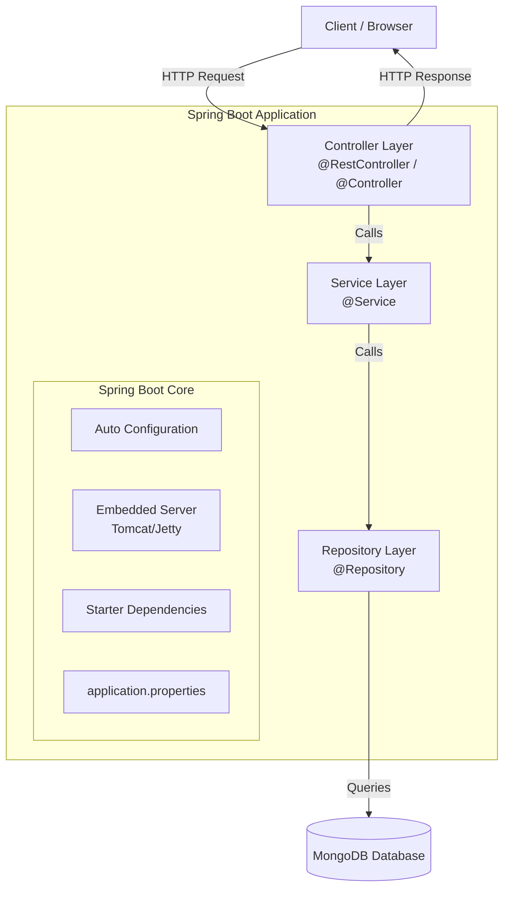

**Layers of Spring Boot Architecture:**

**1. Presentation Layer (Controller Layer):**
This layer handles HTTP requests and responses. Controllers are annotated with `@Controller` (for MVC views) or `@RestController` (for REST APIs). They receive client requests, delegate business logic to the service layer, and return appropriate responses.

```java
@RestController
@RequestMapping("/api/students")
public class StudentController {

    @Autowired
    private StudentService studentService;

    @GetMapping
    public List<Student> getAllStudents() {
        return studentService.getAllStudents();
    }

    @PostMapping
    public Student createStudent(@RequestBody Student student) {
        return studentService.saveStudent(student);
    }
}
```

**2. Business Logic Layer (Service Layer):**
This layer contains the core business logic of the application. Classes are annotated with `@Service`. It acts as a bridge between the controller and repository layers, processing data and applying business rules.

```java
@Service
public class StudentService {

    @Autowired
    private StudentRepository studentRepository;

    public List<Student> getAllStudents() {
        return studentRepository.findAll();
    }

    public Student saveStudent(Student student) {
        return studentRepository.save(student);
    }
}
```

**3. Data Access Layer (Repository Layer):**
This layer manages data persistence and retrieval. Classes are annotated with `@Repository` or extend interfaces like `MongoRepository`. It abstracts the database operations and provides a clean API for the service layer.

```java
@Repository
public interface StudentRepository extends MongoRepository<Student, String> {
    List<Student> findByDepartment(String department);
}
```

**4. Model/Entity Layer:**
This layer defines the data structures (POJOs) used across all layers. In MongoDB context, entities are annotated with `@Document`.

```java
@Document(collection = "students")
public class Student {
    @Id
    private String id;
    private String name;
    private String rollNumber;
    private String department;
    private String email;

    // Constructors, Getters, and Setters
}
```

**Spring Boot Internal Architecture:**

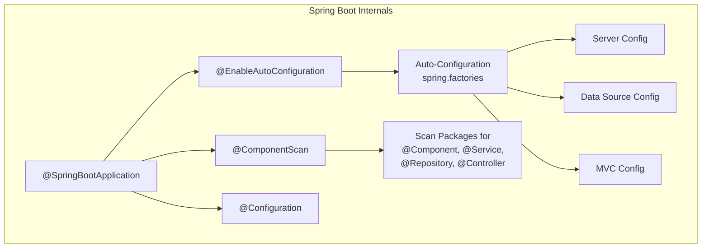

**Spring Boot Execution Flow:**
1. `main()` method calls `SpringApplication.run()`.
2. Spring Boot loads `application.properties` / `application.yml`.
3. Auto-configuration reads classpath and configures beans.
4. Component scanning discovers annotated classes.
5. Embedded server (Tomcat) starts on the configured port.
6. Application is ready to accept HTTP requests.

**Key Components:**
- **Spring Boot Starters:** Pre-configured dependency bundles.
- **Auto-Configuration:** Intelligent defaults based on classpath.
- **Embedded Server:** Self-contained deployment.
- **Actuator:** Production monitoring and management.
- **Spring Boot CLI:** Command-line tool for rapid development.

---

### Q13. Explain the layered architecture of a Spring Boot application. (Essay - 10 Marks)

A Spring Boot application follows a well-defined layered architecture pattern that separates concerns into distinct tiers. Each layer has a specific responsibility and communicates only with adjacent layers.

**Layered Architecture Diagram:**

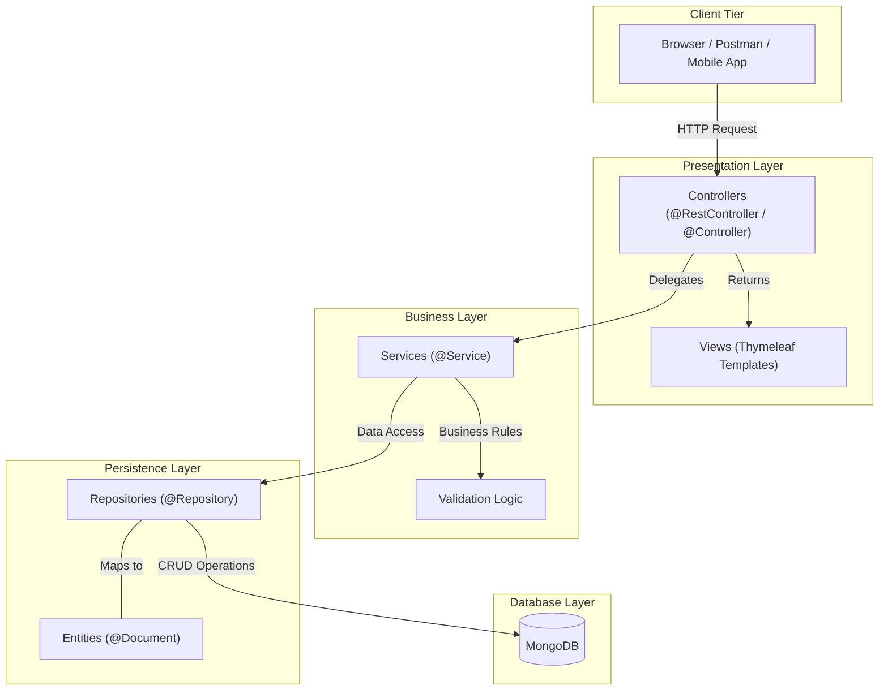

**Layer 1: Presentation Layer**

The topmost layer that handles client interaction. It receives HTTP requests, validates input, and returns responses (JSON for REST APIs or HTML views for web applications).

```java
@RestController
@RequestMapping("/api/students")
public class StudentController {

    @Autowired
    private StudentService studentService;

    @GetMapping("/{id}")
    public ResponseEntity<Student> getStudentById(@PathVariable String id) {
        Student student = studentService.getStudentById(id);
        if (student != null) {
            return ResponseEntity.ok(student);
        }
        return ResponseEntity.notFound().build();
    }

    @PostMapping
    public ResponseEntity<Student> createStudent(@RequestBody Student student) {
        Student saved = studentService.saveStudent(student);
        return ResponseEntity.status(HttpStatus.CREATED).body(saved);
    }

    @PutMapping("/{id}")
    public ResponseEntity<Student> updateStudent(@PathVariable String id,
                                                  @RequestBody Student student) {
        Student updated = studentService.updateStudent(id, student);
        return ResponseEntity.ok(updated);
    }

    @DeleteMapping("/{id}")
    public ResponseEntity<Void> deleteStudent(@PathVariable String id) {
        studentService.deleteStudent(id);
        return ResponseEntity.noContent().build();
    }
}
```

**Layer 2: Service Layer**

Contains the business logic and acts as a transaction boundary. It orchestrates data flow between the controller and repository layers.

```java
@Service
public class StudentService {

    @Autowired
    private StudentRepository studentRepository;

    public List<Student> getAllStudents() {
        return studentRepository.findAll();
    }

    public Student getStudentById(String id) {
        return studentRepository.findById(id).orElse(null);
    }

    public Student saveStudent(Student student) {
        // Business validation
        if (student.getEmail() == null || student.getEmail().isEmpty()) {
            throw new IllegalArgumentException("Email is required");
        }
        return studentRepository.save(student);
    }

    public Student updateStudent(String id, Student student) {
        Student existing = studentRepository.findById(id)
                .orElseThrow(() -> new RuntimeException("Student not found"));
        existing.setName(student.getName());
        existing.setDepartment(student.getDepartment());
        existing.setEmail(student.getEmail());
        return studentRepository.save(existing);
    }

    public void deleteStudent(String id) {
        studentRepository.deleteById(id);
    }
}
```

**Layer 3: Repository/Persistence Layer**

Manages data access and database operations. Spring Data provides repository abstractions that generate implementations at runtime.

```java
@Repository
public interface StudentRepository extends MongoRepository<Student, String> {
    List<Student> findByDepartment(String department);
    Student findByRollNumber(String rollNumber);
    List<Student> findByNameContaining(String name);
}
```

**Layer 4: Model/Entity Layer**

Defines data structures that flow across all layers. Entities map to database collections/tables.

```java
@Document(collection = "students")
public class Student {
    @Id
    private String id;
    private String name;
    private String rollNumber;
    private String department;
    private String email;

    public Student() {}

    public Student(String name, String rollNumber, String department, String email) {
        this.name = name;
        this.rollNumber = rollNumber;
        this.department = department;
        this.email = email;
    }

    // Getters and Setters
    public String getId() { return id; }
    public void setId(String id) { this.id = id; }
    public String getName() { return name; }
    public void setName(String name) { this.name = name; }
    public String getRollNumber() { return rollNumber; }
    public void setRollNumber(String rollNumber) { this.rollNumber = rollNumber; }
    public String getDepartment() { return department; }
    public void setDepartment(String department) { this.department = department; }
    public String getEmail() { return email; }
    public void setEmail(String email) { this.email = email; }
}
```

**Benefits of Layered Architecture:**
- **Separation of Concerns:** Each layer handles only its specific responsibility.
- **Testability:** Layers can be unit-tested independently using mocks.
- **Maintainability:** Changes in one layer do not affect others.
- **Reusability:** Service and repository layers can be reused across controllers.
- **Scalability:** Layers can be scaled independently in microservice architecture.

**Data Flow Summary:**

```
Client Request -> Controller -> Service -> Repository -> Database
Database Response -> Repository -> Service -> Controller -> Client Response
```

---

## Section 3: Installation of Spring Boot - Spring Initializr

### Q14. What is Spring Initializr? (2 Marks)

Spring Initializr is a web-based tool (available at [start.spring.io](https://start.spring.io)) that generates a ready-to-use Spring Boot project structure. Developers can select the project type (Maven/Gradle), Java version, Spring Boot version, and required dependencies (Web, MongoDB, Thymeleaf, etc.). It generates a downloadable ZIP file containing the complete project skeleton with `pom.xml`, main application class, and directory structure. It is also integrated into IDEs like IntelliJ IDEA and Spring Tool Suite.

---

### Q15. What is a starter dependency? (2 Marks)

A starter dependency is a pre-packaged set of related Maven/Gradle dependencies bundled by Spring Boot for specific functionality. For example, `spring-boot-starter-web` includes Spring MVC, embedded Tomcat, and Jackson (JSON processing). `spring-boot-starter-data-mongodb` includes the MongoDB driver and Spring Data MongoDB. Starters follow the naming convention `spring-boot-starter-*` and simplify dependency management by providing compatible, tested versions of libraries through the parent POM.

---

### Q16. Explain the steps to create a Spring Boot project using Spring Initializr. (Essay - 10 Marks)

Spring Initializr provides a quick and standardized way to bootstrap a Spring Boot project. Below are the detailed steps to create a Student Management application.

**Step 1: Access Spring Initializr**

Open a web browser and navigate to [https://start.spring.io](https://start.spring.io).

**Step 2: Configure Project Settings**

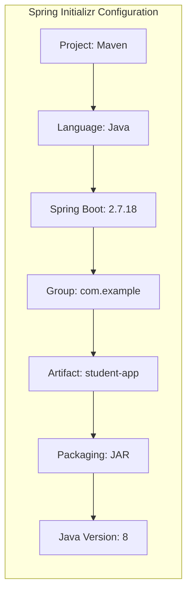

Fill in the following details:
| Setting | Value |
|---------|-------|
| Project | Maven Project |
| Language | Java |
| Spring Boot Version | 2.7.18 |
| Group | com.example |
| Artifact | student-app |
| Name | student-app |
| Description | Student Management Application |
| Package Name | com.example.studentapp |
| Packaging | JAR |
| Java Version | 8 |

**Step 3: Add Dependencies**

Click "ADD DEPENDENCIES" and select:
- **Spring Web** - For building REST APIs and web applications
- **Spring Data MongoDB** - For MongoDB database connectivity
- **Thymeleaf** - For server-side HTML rendering
- **Spring Boot DevTools** - For automatic restart during development
- **Lombok** (optional) - For reducing boilerplate code

**Step 4: Generate and Download**

Click the "GENERATE" button. A ZIP file (`student-app.zip`) is downloaded.

**Step 5: Extract and Import into IDE**

Extract the ZIP file and import it into your IDE:
- **IntelliJ IDEA:** File -> Open -> Select the extracted folder
- **Eclipse/STS:** File -> Import -> Existing Maven Projects -> Browse to folder

**Step 6: Understand the Generated Project Structure**

```
student-app/
├── src/
│   ├── main/
│   │   ├── java/
│   │   │   └── com/example/studentapp/
│   │   │       └── StudentAppApplication.java
│   │   └── resources/
│   │       ├── static/          (CSS, JS, images)
│   │       ├── templates/       (Thymeleaf HTML files)
│   │       └── application.properties
│   └── test/
│       └── java/
│           └── com/example/studentapp/
│               └── StudentAppApplicationTests.java
├── pom.xml
├── mvnw              (Maven wrapper for Linux/Mac)
├── mvnw.cmd          (Maven wrapper for Windows)
└── .gitignore
```

**Step 7: Examine the Generated pom.xml**

```java
<?xml version="1.0" encoding="UTF-8"?>
<project xmlns="http://maven.apache.org/POM/4.0.0"
         xmlns:xsi="http://www.w3.org/2001/XMLSchema-instance"
         xsi:schemaLocation="http://maven.apache.org/POM/4.0.0
         https://maven.apache.org/xsd/maven-4.0.0.xsd">
    <modelVersion>4.0.0</modelVersion>

    <parent>
        <groupId>org.springframework.boot</groupId>
        <artifactId>spring-boot-starter-parent</artifactId>
        <version>2.7.18</version>
    </parent>

    <groupId>com.example</groupId>
    <artifactId>student-app</artifactId>
    <version>0.0.1-SNAPSHOT</version>
    <name>student-app</name>
    <description>Student Management Application</description>

    <properties>
        <java.version>1.8</java.version>
    </properties>

    <dependencies>
        <dependency>
            <groupId>org.springframework.boot</groupId>
            <artifactId>spring-boot-starter-web</artifactId>
        </dependency>
        <dependency>
            <groupId>org.springframework.boot</groupId>
            <artifactId>spring-boot-starter-data-mongodb</artifactId>
        </dependency>
        <dependency>
            <groupId>org.springframework.boot</groupId>
            <artifactId>spring-boot-starter-thymeleaf</artifactId>
        </dependency>
        <dependency>
            <groupId>org.springframework.boot</groupId>
            <artifactId>spring-boot-devtools</artifactId>
            <scope>runtime</scope>
        </dependency>
        <dependency>
            <groupId>org.springframework.boot</groupId>
            <artifactId>spring-boot-starter-test</artifactId>
            <scope>test</scope>
        </dependency>
    </dependencies>

    <build>
        <plugins>
            <plugin>
                <groupId>org.springframework.boot</groupId>
                <artifactId>spring-boot-maven-plugin</artifactId>
            </plugin>
        </plugins>
    </build>
</project>
```

**Step 8: Examine the Main Application Class**

```java
package com.example.studentapp;

import org.springframework.boot.SpringApplication;
import org.springframework.boot.autoconfigure.SpringBootApplication;

@SpringBootApplication
public class StudentAppApplication {
    public static void main(String[] args) {
        SpringApplication.run(StudentAppApplication.class, args);
    }
}
```

**Step 9: Configure application.properties**

```
server.port=8080
spring.data.mongodb.host=localhost
spring.data.mongodb.port=27017
spring.data.mongodb.database=studentdb
```

**Step 10: Run the Application**

Using Maven wrapper:
```
./mvnw spring-boot:run
```

Or from IDE: Right-click `StudentAppApplication.java` -> Run As -> Java Application.

The application starts on `http://localhost:8080`.

---

### Q17. Explain the role of Spring Initializr and the generated project structure. (Essay - 10 Marks)

**Role of Spring Initializr:**

Spring Initializr serves as the official project bootstrapping tool for the Spring ecosystem. Its primary roles are:

1. **Project Generation:** Creates a complete, runnable project skeleton based on user selections.
2. **Dependency Management:** Resolves and bundles compatible dependency versions.
3. **Standard Structure:** Enforces Maven/Gradle conventions for consistent project organization.
4. **Version Compatibility:** Ensures all selected dependencies work together with the chosen Spring Boot version.

**Access Methods:**
- **Web Interface:** [start.spring.io](https://start.spring.io)
- **IDE Integration:** IntelliJ IDEA (Spring Initializr wizard), Eclipse/STS (Spring Starter Project)
- **CLI:** `curl https://start.spring.io/starter.zip -d dependencies=web,data-mongodb -o project.zip`
- **Spring Boot CLI:** `spring init --dependencies=web,data-mongodb student-app`

**Generated Project Structure Explained:**

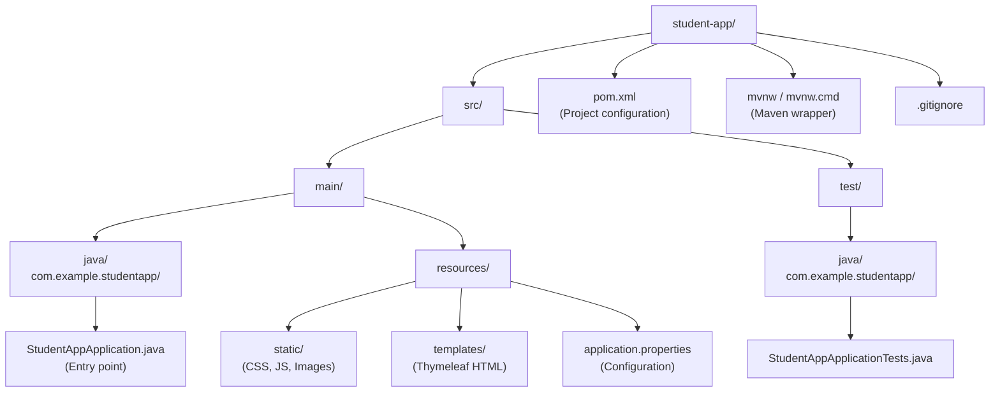

**Detailed Explanation of Each Component:**

**1. pom.xml (Project Object Model)**
- Defines project metadata (groupId, artifactId, version).
- Declares `spring-boot-starter-parent` as the parent POM for version management.
- Lists all project dependencies (starters).
- Configures the `spring-boot-maven-plugin` for building executable JARs.

**2. StudentAppApplication.java (Main Class)**
- The entry point of the application containing the `main()` method.
- Annotated with `@SpringBootApplication` which triggers auto-configuration and component scanning.
- `SpringApplication.run()` bootstraps the Spring context and starts the embedded server.

**3. src/main/resources/**
- `application.properties`: Externalized configuration for the application (database URI, server port, logging).
- `static/`: Serves static web resources (CSS, JavaScript, images) directly without controller mapping.
- `templates/`: Stores Thymeleaf HTML templates rendered by controllers.

**4. src/test/java/**
- Contains test classes. The generated `StudentAppApplicationTests.java` includes a context-load test.
- Uses `@SpringBootTest` annotation for integration testing.

**5. Maven Wrapper (mvnw / mvnw.cmd)**
- Ensures the project uses a specific Maven version without requiring Maven to be installed globally.
- Run with `./mvnw spring-boot:run` on Linux/Mac or `mvnw.cmd spring-boot:run` on Windows.

**Building the Application:**

After project generation, developers add layers following the standard structure:

```
src/main/java/com/example/studentapp/
├── StudentAppApplication.java        (Main class)
├── controller/
│   └── StudentController.java        (REST endpoints)
├── service/
│   └── StudentService.java           (Business logic)
├── repository/
│   └── StudentRepository.java        (Data access)
└── model/
    └── Student.java                   (Entity class)
```

This structure promotes clean separation of concerns and follows Spring Boot conventions for component scanning.

---

## Section 4: Building a Web Application using Spring Boot

### Q18. What is @RestController? (2 Marks)

`@RestController` is a Spring annotation that combines `@Controller` and `@ResponseBody`. It marks a class as a RESTful web controller where every method's return value is automatically serialized to JSON (or XML) and written directly to the HTTP response body. Unlike `@Controller`, which returns view names for template engines, `@RestController` is used for building REST APIs that return data. It eliminates the need to annotate each method with `@ResponseBody`.

---

### Q19. What is the difference between @Controller and @RestController? (2 Marks)

`@Controller` is used for traditional MVC web applications where methods return view names (e.g., Thymeleaf templates). The return value is resolved by a ViewResolver to render an HTML page. `@RestController` is a specialized version of `@Controller` that adds `@ResponseBody` to every method, meaning return values are serialized directly to JSON/XML in the HTTP response body. Use `@Controller` for server-rendered HTML pages and `@RestController` for REST APIs.

---

### Q20. What is @RequestMapping? (2 Marks)

`@RequestMapping` is a Spring annotation used to map HTTP requests to controller handler methods. It can be applied at both class level (base URL) and method level (specific endpoint). It supports attributes like `value` (URL path), `method` (HTTP method: GET, POST, PUT, DELETE), `produces` (response content type), and `consumes` (request content type). Shortcut annotations include `@GetMapping`, `@PostMapping`, `@PutMapping`, and `@DeleteMapping`.

---

### Q21. Explain the Spring MVC request flow with a diagram. (Essay - 10 Marks)

Spring MVC (Model-View-Controller) follows a front-controller design pattern using the DispatcherServlet as the central request handler.

**Spring MVC Request Flow Diagram:**

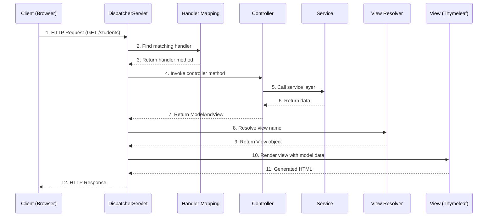

**Detailed Explanation of Each Step:**

**Step 1 - Client sends HTTP Request:**
The client (browser/Postman) sends an HTTP request to the server (e.g., `GET http://localhost:8080/students`).

**Step 2-3 - Handler Mapping:**
The `DispatcherServlet` (front controller) receives the request and consults `HandlerMapping` to find the appropriate controller method. The mapping is based on URL patterns defined in `@RequestMapping` or `@GetMapping` annotations.

**Step 4 - Controller Invocation:**
The `DispatcherServlet` invokes the matched controller method. For example:

```java
@Controller
@RequestMapping("/students")
public class StudentController {

    @Autowired
    private StudentService studentService;

    @GetMapping
    public String listStudents(Model model) {
        List<Student> students = studentService.getAllStudents();
        model.addAttribute("students", students);
        return "student-list"; // View name
    }

    @GetMapping("/{id}")
    public String getStudent(@PathVariable String id, Model model) {
        Student student = studentService.getStudentById(id);
        model.addAttribute("student", student);
        return "student-detail";
    }
}
```

**Step 5-6 - Service Layer Processing:**
The controller delegates business logic to the service layer, which interacts with the repository to fetch data.

**Step 7 - ModelAndView Return:**
The controller returns a view name (String) and populates the `Model` object with data attributes that the view will render.

**Step 8-9 - View Resolution:**
The `ViewResolver` maps the view name to an actual view template. For Thymeleaf, it resolves `"student-list"` to `/templates/student-list.html`.

**Step 10-11 - View Rendering:**
The view engine (Thymeleaf) merges the model data with the HTML template to produce the final HTML output.

```html
<!-- templates/student-list.html -->
<!DOCTYPE html>
<html xmlns:th="http://www.thymeleaf.org">
<head>
    <title>Student List</title>
</head>
<body>
    <h1>Student Directory</h1>
    <table>
        <tr>
            <th>Name</th>
            <th>Roll Number</th>
            <th>Department</th>
            <th>Email</th>
        </tr>
        <tr th:each="student : ${students}">
            <td th:text="${student.name}"></td>
            <td th:text="${student.rollNumber}"></td>
            <td th:text="${student.department}"></td>
            <td th:text="${student.email}"></td>
        </tr>
    </table>
</body>
</html>
```

**Step 12 - Response Sent:**
The rendered HTML is sent back to the client as an HTTP response.

**REST API Flow (with @RestController):**

For REST APIs, the flow is simplified as there is no view resolution:

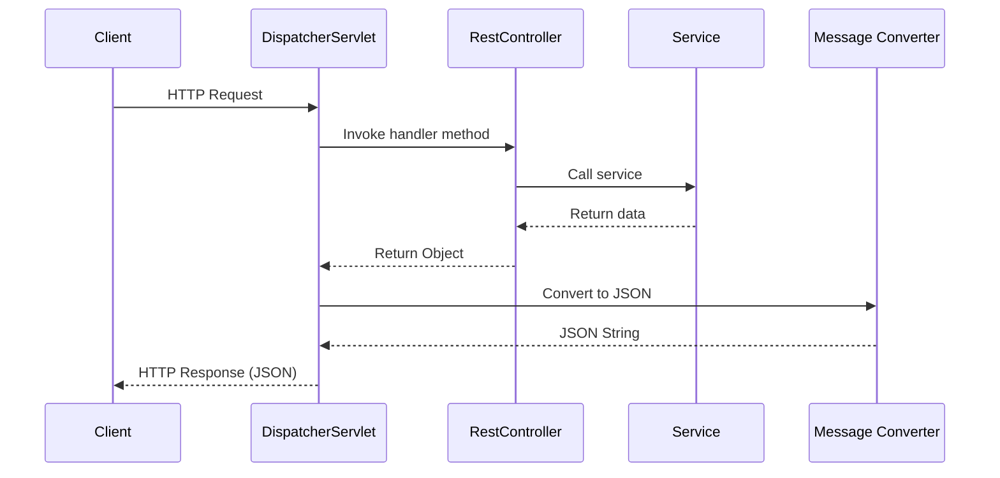

```java
@RestController
@RequestMapping("/api/students")
public class StudentRestController {

    @Autowired
    private StudentService studentService;

    @GetMapping
    public List<Student> getAllStudents() {
        return studentService.getAllStudents();
        // Automatically converted to JSON by Jackson
    }
}
```

**Key Components Summary:**
| Component | Role |
|-----------|------|
| DispatcherServlet | Front controller, receives all requests |
| HandlerMapping | Maps URLs to controller methods |
| Controller | Processes request and returns model + view |
| ViewResolver | Resolves view name to actual view template |
| MessageConverter | Converts objects to JSON/XML for REST APIs |

---

### Q22. Explain how to build a REST API with Spring Boot with code examples. (Essay - 10 Marks)

Building a REST API with Spring Boot involves creating a layered application that exposes HTTP endpoints for CRUD operations. Below is a complete example of a Student Management REST API.

**REST API Architecture:**

```mermaid
graph LR
    Client[Client<br/>Postman/Browser] -->|GET /api/students| API
    Client -->|POST /api/students| API
    Client -->|PUT /api/students/id| API
    Client -->|DELETE /api/students/id| API
    subgraph "Spring Boot REST API"
        API[StudentController<br/>@RestController] --> SVC[StudentService<br/>@Service]
        SVC --> REPO[StudentRepository<br/>MongoRepository]
    end
    REPO --> DB[(MongoDB)]
```

**Step 1: Define the Entity (Model)**

```java
package com.example.studentapp.model;

import org.springframework.data.annotation.Id;
import org.springframework.data.mongodb.core.mapping.Document;

@Document(collection = "students")
public class Student {

    @Id
    private String id;
    private String name;
    private String rollNumber;
    private String department;
    private String email;

    public Student() {}

    public Student(String name, String rollNumber, String department, String email) {
        this.name = name;
        this.rollNumber = rollNumber;
        this.department = department;
        this.email = email;
    }

    public String getId() { return id; }
    public void setId(String id) { this.id = id; }
    public String getName() { return name; }
    public void setName(String name) { this.name = name; }
    public String getRollNumber() { return rollNumber; }
    public void setRollNumber(String rollNumber) { this.rollNumber = rollNumber; }
    public String getDepartment() { return department; }
    public void setDepartment(String department) { this.department = department; }
    public String getEmail() { return email; }
    public void setEmail(String email) { this.email = email; }
}
```

**Step 2: Create the Repository**

```java
package com.example.studentapp.repository;

import com.example.studentapp.model.Student;
import org.springframework.data.mongodb.repository.MongoRepository;
import org.springframework.stereotype.Repository;
import java.util.List;

@Repository
public interface StudentRepository extends MongoRepository<Student, String> {
    List<Student> findByDepartment(String department);
    Student findByRollNumber(String rollNumber);
}
```

**Step 3: Create the Service Layer**

```java
package com.example.studentapp.service;

import com.example.studentapp.model.Student;
import com.example.studentapp.repository.StudentRepository;
import org.springframework.beans.factory.annotation.Autowired;
import org.springframework.stereotype.Service;
import java.util.List;
import java.util.Optional;

@Service
public class StudentService {

    @Autowired
    private StudentRepository studentRepository;

    // Get all students
    public List<Student> getAllStudents() {
        return studentRepository.findAll();
    }

    // Get student by ID
    public Optional<Student> getStudentById(String id) {
        return studentRepository.findById(id);
    }

    // Create a new student
    public Student createStudent(Student student) {
        return studentRepository.save(student);
    }

    // Update an existing student
    public Student updateStudent(String id, Student studentDetails) {
        Student student = studentRepository.findById(id)
                .orElseThrow(() -> new RuntimeException("Student not found with id: " + id));

        student.setName(studentDetails.getName());
        student.setRollNumber(studentDetails.getRollNumber());
        student.setDepartment(studentDetails.getDepartment());
        student.setEmail(studentDetails.getEmail());

        return studentRepository.save(student);
    }

    // Delete a student
    public void deleteStudent(String id) {
        studentRepository.deleteById(id);
    }

    // Find by department
    public List<Student> getStudentsByDepartment(String department) {
        return studentRepository.findByDepartment(department);
    }
}
```

**Step 4: Create the REST Controller**

```java
package com.example.studentapp.controller;

import com.example.studentapp.model.Student;
import com.example.studentapp.service.StudentService;
import org.springframework.beans.factory.annotation.Autowired;
import org.springframework.http.HttpStatus;
import org.springframework.http.ResponseEntity;
import org.springframework.web.bind.annotation.*;
import java.util.List;

@RestController
@RequestMapping("/api/students")
public class StudentController {

    @Autowired
    private StudentService studentService;

    // GET /api/students - Get all students
    @GetMapping
    public List<Student> getAllStudents() {
        return studentService.getAllStudents();
    }

    // GET /api/students/{id} - Get student by ID
    @GetMapping("/{id}")
    public ResponseEntity<Student> getStudentById(@PathVariable String id) {
        return studentService.getStudentById(id)
                .map(ResponseEntity::ok)
                .orElse(ResponseEntity.notFound().build());
    }

    // POST /api/students - Create a new student
    @PostMapping
    public ResponseEntity<Student> createStudent(@RequestBody Student student) {
        Student created = studentService.createStudent(student);
        return ResponseEntity.status(HttpStatus.CREATED).body(created);
    }

    // PUT /api/students/{id} - Update a student
    @PutMapping("/{id}")
    public ResponseEntity<Student> updateStudent(@PathVariable String id,
                                                  @RequestBody Student student) {
        Student updated = studentService.updateStudent(id, student);
        return ResponseEntity.ok(updated);
    }

    // DELETE /api/students/{id} - Delete a student
    @DeleteMapping("/{id}")
    public ResponseEntity<Void> deleteStudent(@PathVariable String id) {
        studentService.deleteStudent(id);
        return ResponseEntity.noContent().build();
    }

    // GET /api/students/department/{dept} - Filter by department
    @GetMapping("/department/{dept}")
    public List<Student> getByDepartment(@PathVariable String dept) {
        return studentService.getStudentsByDepartment(dept);
    }
}
```

**Step 5: Configure application.properties**

```
server.port=8080
spring.data.mongodb.host=localhost
spring.data.mongodb.port=27017
spring.data.mongodb.database=studentdb
```

**REST API Endpoints Summary:**

| HTTP Method | Endpoint | Description | Status Code |
|-------------|----------|-------------|-------------|
| GET | /api/students | Get all students | 200 OK |
| GET | /api/students/{id} | Get student by ID | 200 OK / 404 |
| POST | /api/students | Create new student | 201 Created |
| PUT | /api/students/{id} | Update student | 200 OK |
| DELETE | /api/students/{id} | Delete student | 204 No Content |
| GET | /api/students/department/{dept} | Filter by dept | 200 OK |

**Testing with cURL/Postman:**

```
# Create a student
POST http://localhost:8080/api/students
Content-Type: application/json

{
    "name": "Ravi Kumar",
    "rollNumber": "20B01A1234",
    "department": "IT",
    "email": "ravi@example.com"
}

# Get all students
GET http://localhost:8080/api/students

# Get student by ID
GET http://localhost:8080/api/students/64a1b2c3d4e5f6a7b8c9d0e1
```

---

### Q23. Explain the annotation-based configuration in Spring Boot. (Essay - 10 Marks)

Spring Boot uses annotations extensively to replace traditional XML-based configuration. Annotations are metadata markers placed on classes, methods, or fields that instruct the Spring container on how to manage components.

**Categories of Annotations:**

```mermaid
graph TB
    ANN[Spring Boot Annotations] --> CORE[Core Annotations]
    ANN --> WEB[Web Annotations]
    ANN --> DATA[Data Annotations]
    ANN --> DI[DI Annotations]

    CORE --> SBA["@SpringBootApplication"]
    CORE --> CFG["@Configuration"]
    CORE --> EAC["@EnableAutoConfiguration"]
    CORE --> CSC["@ComponentScan"]

    WEB --> RC["@RestController"]
    WEB --> CTR["@Controller"]
    WEB --> RM["@RequestMapping"]
    WEB --> GM["@GetMapping"]
    WEB --> PM["@PostMapping"]
    WEB --> RB["@RequestBody"]
    WEB --> PV["@PathVariable"]
    WEB --> RP["@RequestParam"]

    DATA --> DOC["@Document"]
    DATA --> ID["@Id"]
    DATA --> REPO["@Repository"]

    DI --> AW["@Autowired"]
    DI --> COMP["@Component"]
    DI --> SVC["@Service"]
    DI --> BEAN["@Bean"]
    DI --> VAL["@Value"]
```

**1. Core/Bootstrap Annotations:**

```java
// @SpringBootApplication = @Configuration + @EnableAutoConfiguration + @ComponentScan
@SpringBootApplication
public class StudentAppApplication {
    public static void main(String[] args) {
        SpringApplication.run(StudentAppApplication.class, args);
    }
}

// @Configuration - Declares a class as a source of bean definitions
@Configuration
public class AppConfig {

    @Bean
    public RestTemplate restTemplate() {
        return new RestTemplate();
    }
}
```

**2. Stereotype Annotations (Component Scanning):**

These annotations mark classes for automatic detection during component scanning:

| Annotation | Purpose | Layer |
|------------|---------|-------|
| `@Component` | Generic Spring-managed component | Any |
| `@Controller` | MVC Controller (returns views) | Presentation |
| `@RestController` | REST Controller (returns JSON) | Presentation |
| `@Service` | Business logic component | Business |
| `@Repository` | Data access component | Persistence |

```java
@Component
public class EmailValidator {
    public boolean isValid(String email) {
        return email != null && email.contains("@");
    }
}

@Service
public class StudentService {
    @Autowired
    private StudentRepository studentRepository;
    // Business logic methods
}

@Repository
public interface StudentRepository extends MongoRepository<Student, String> {
    // Data access methods
}
```

**3. Dependency Injection Annotations:**

```java
@Service
public class StudentService {

    // Field injection
    @Autowired
    private StudentRepository studentRepository;

    // Constructor injection (recommended)
    private final EmailValidator emailValidator;

    @Autowired
    public StudentService(EmailValidator emailValidator) {
        this.emailValidator = emailValidator;
    }
}

// @Value - Injects values from application.properties
@Component
public class AppSettings {

    @Value("${app.name:StudentApp}")
    private String appName;

    @Value("${server.port:8080}")
    private int serverPort;
}
```

**4. Web/REST Annotations:**

```java
@RestController
@RequestMapping("/api/students")
public class StudentController {

    @Autowired
    private StudentService studentService;

    // @GetMapping - Maps HTTP GET requests
    @GetMapping
    public List<Student> getAll() {
        return studentService.getAllStudents();
    }

    // @PathVariable - Extracts value from URL path
    @GetMapping("/{id}")
    public Student getById(@PathVariable String id) {
        return studentService.getStudentById(id);
    }

    // @RequestBody - Deserializes JSON request body to object
    @PostMapping
    public Student create(@RequestBody Student student) {
        return studentService.createStudent(student);
    }

    // @RequestParam - Extracts query parameters
    @GetMapping("/search")
    public List<Student> search(@RequestParam String department) {
        return studentService.getStudentsByDepartment(department);
    }

    // @PutMapping - Maps HTTP PUT requests
    @PutMapping("/{id}")
    public Student update(@PathVariable String id, @RequestBody Student student) {
        return studentService.updateStudent(id, student);
    }

    // @DeleteMapping - Maps HTTP DELETE requests
    @DeleteMapping("/{id}")
    public void delete(@PathVariable String id) {
        studentService.deleteStudent(id);
    }
}
```

**5. Data/MongoDB Annotations:**

```java
@Document(collection = "students")  // Maps class to MongoDB collection
public class Student {

    @Id                              // Marks the primary key field
    private String id;

    @Field("student_name")          // Custom field name in MongoDB
    private String name;

    @Indexed(unique = true)         // Creates unique index
    private String rollNumber;

    private String department;
    private String email;
}
```

**Comparison: XML vs Annotation Configuration:**

| XML Configuration | Annotation Configuration |
|-------------------|-------------------------|
| `<bean id="service" class="...">` | `@Service` |
| `<property name="repo" ref="...">` | `@Autowired` |
| `<context:component-scan>` | `@ComponentScan` |
| `<mvc:annotation-driven/>` | `@EnableWebMvc` |
| External XML files | Inline with code |

Annotations provide a cleaner, more readable, and type-safe approach to configuration compared to XML.

---

### Q24. Explain how to handle forms using Thymeleaf in Spring Boot. (Essay - 10 Marks)

Thymeleaf is a server-side template engine that integrates seamlessly with Spring Boot for building HTML-based web applications. Below is a complete example of form handling for a Student entity.

**Form Handling Flow:**

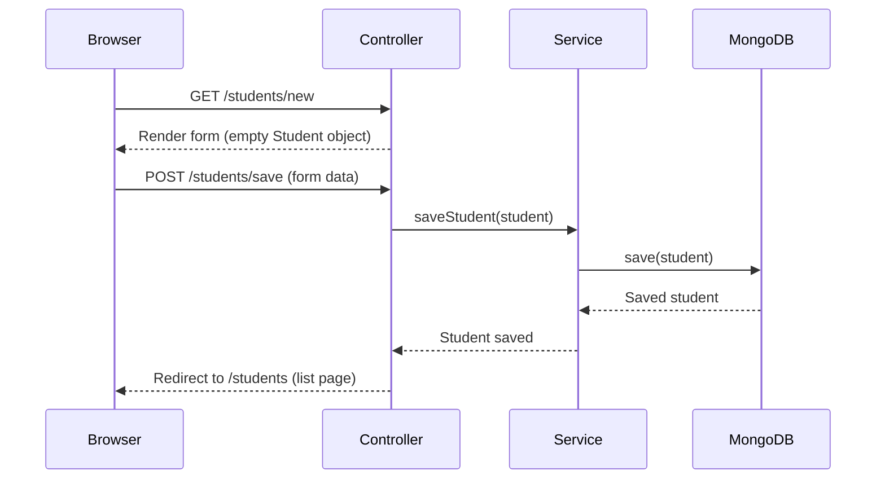

**Step 1: Entity Class**

```java
@Document(collection = "students")
public class Student {
    @Id
    private String id;
    private String name;
    private String rollNumber;
    private String department;
    private String email;

    // Constructors, getters, and setters (same as before)
}
```

**Step 2: Controller with Form Handling**

```java
@Controller
@RequestMapping("/students")
public class StudentWebController {

    @Autowired
    private StudentService studentService;

    // Display list of all students
    @GetMapping
    public String listStudents(Model model) {
        model.addAttribute("students", studentService.getAllStudents());
        return "student-list";
    }

    // Show form to create a new student
    @GetMapping("/new")
    public String showCreateForm(Model model) {
        model.addAttribute("student", new Student());
        return "student-form";
    }

    // Handle form submission for creating a student
    @PostMapping("/save")
    public String saveStudent(@ModelAttribute("student") Student student) {
        studentService.createStudent(student);
        return "redirect:/students";
    }

    // Show form to edit an existing student
    @GetMapping("/edit/{id}")
    public String showEditForm(@PathVariable String id, Model model) {
        Student student = studentService.getStudentById(id)
                .orElseThrow(() -> new RuntimeException("Student not found"));
        model.addAttribute("student", student);
        return "student-form";
    }

    // Handle delete
    @GetMapping("/delete/{id}")
    public String deleteStudent(@PathVariable String id) {
        studentService.deleteStudent(id);
        return "redirect:/students";
    }
}
```

**Step 3: Create Form Template (student-form.html)**

Place in `src/main/resources/templates/student-form.html`:

```html
<!DOCTYPE html>
<html xmlns:th="http://www.thymeleaf.org">
<head>
    <title>Student Form</title>
    <style>
        body { font-family: Arial, sans-serif; margin: 40px; }
        form { max-width: 400px; }
        label { display: block; margin-top: 10px; font-weight: bold; }
        input { width: 100%; padding: 8px; margin-top: 4px; box-sizing: border-box; }
        button { margin-top: 20px; padding: 10px 20px; background: #4CAF50;
                 color: white; border: none; cursor: pointer; }
    </style>
</head>
<body>
    <h1 th:text="${student.id != null} ? 'Edit Student' : 'Add New Student'">
        Student Form
    </h1>

    <form th:action="@{/students/save}" th:object="${student}" method="post">
        <!-- Hidden field for ID (used during edit) -->
        <input type="hidden" th:field="*{id}" />

        <label for="name">Name:</label>
        <input type="text" th:field="*{name}" placeholder="Enter student name"
               required="required" />

        <label for="rollNumber">Roll Number:</label>
        <input type="text" th:field="*{rollNumber}" placeholder="Enter roll number"
               required="required" />

        <label for="department">Department:</label>
        <input type="text" th:field="*{department}" placeholder="Enter department"
               required="required" />

        <label for="email">Email:</label>
        <input type="email" th:field="*{email}" placeholder="Enter email"
               required="required" />

        <button type="submit">Save Student</button>
    </form>

    <br/>
    <a th:href="@{/students}">Back to Student List</a>
</body>
</html>
```

**Step 4: Create List Template (student-list.html)**

Place in `src/main/resources/templates/student-list.html`:

```html
<!DOCTYPE html>
<html xmlns:th="http://www.thymeleaf.org">
<head>
    <title>Student List</title>
    <style>
        body { font-family: Arial, sans-serif; margin: 40px; }
        table { border-collapse: collapse; width: 100%; }
        th, td { border: 1px solid #ddd; padding: 10px; text-align: left; }
        th { background-color: #4CAF50; color: white; }
        tr:nth-child(even) { background-color: #f2f2f2; }
        a { margin-right: 10px; }
    </style>
</head>
<body>
    <h1>Student Directory</h1>
    <a th:href="@{/students/new}">Add New Student</a>
    <br/><br/>

    <table>
        <thead>
            <tr>
                <th>Name</th>
                <th>Roll Number</th>
                <th>Department</th>
                <th>Email</th>
                <th>Actions</th>
            </tr>
        </thead>
        <tbody>
            <tr th:each="student : ${students}">
                <td th:text="${student.name}"></td>
                <td th:text="${student.rollNumber}"></td>
                <td th:text="${student.department}"></td>
                <td th:text="${student.email}"></td>
                <td>
                    <a th:href="@{/students/edit/{id}(id=${student.id})}">Edit</a>
                    <a th:href="@{/students/delete/{id}(id=${student.id})}"
                       onclick="return confirm('Are you sure?')">Delete</a>
                </td>
            </tr>
        </tbody>
    </table>

    <p th:if="${#lists.isEmpty(students)}">No students found.</p>
</body>
</html>
```

**Key Thymeleaf Attributes Explained:**

| Attribute | Purpose | Example |
|-----------|---------|---------|
| `th:text` | Sets element text content | `th:text="${student.name}"` |
| `th:field` | Binds form field to object property | `th:field="*{name}"` |
| `th:action` | Sets form action URL | `th:action="@{/students/save}"` |
| `th:object` | Binds form to a model object | `th:object="${student}"` |
| `th:each` | Iterates over a collection | `th:each="s : ${students}"` |
| `th:href` | Generates dynamic URLs | `th:href="@{/students/edit/{id}}"` |
| `th:if` | Conditional rendering | `th:if="${condition}"` |
| `@{...}` | URL expression | `@{/students/new}` |
| `${...}` | Variable expression | `${student.name}` |
| `*{...}` | Selection expression (relative to `th:object`) | `*{name}` |

---

## Section 5: Dependency Injection

### Q25. What is Dependency Injection? (2 Marks)

Dependency Injection (DI) is a design pattern in which an object's dependencies (other objects it needs) are provided ("injected") by an external framework rather than being created internally. In Spring, the IoC container injects dependencies at runtime. Instead of a class creating its own dependencies using `new`, the Spring container creates and wires them together. This promotes loose coupling, easier testing, and better code maintainability.

---

### Q26. What is Inversion of Control? (2 Marks)

Inversion of Control (IoC) is a design principle where the control of object creation and lifecycle management is transferred from the application code to a framework or container. In Spring, the IoC container (ApplicationContext) manages the creation, configuration, and assembly of objects (beans). Instead of the developer controlling when and how objects are created, the framework "inverts" this control by managing dependencies automatically through dependency injection.

---

### Q27. What is the difference between @Component and @Bean? (2 Marks)

`@Component` is a class-level annotation that marks a class for auto-detection during component scanning; Spring automatically creates a bean from that class. `@Bean` is a method-level annotation used inside `@Configuration` classes to explicitly define and configure a bean; the method's return value becomes the bean. Use `@Component` for your own classes, and `@Bean` for third-party library classes that you cannot annotate (e.g., `RestTemplate`, `ObjectMapper`).

---

### Q28. What is @Autowired? (2 Marks)

`@Autowired` is a Spring annotation used to automatically inject a dependency into a class. Spring's IoC container resolves the dependency by type and injects the appropriate bean. It can be applied on fields, constructors, or setter methods. When applied on a constructor (recommended approach), it enables constructor-based injection. If multiple beans of the same type exist, `@Qualifier` annotation can be used alongside `@Autowired` to specify which bean to inject.

---

### Q29. What are the types of Dependency Injection? (2 Marks)

Spring supports three types of Dependency Injection: (1) **Constructor Injection** - Dependencies are provided through the class constructor; recommended for mandatory dependencies. (2) **Setter Injection** - Dependencies are injected through setter methods; suitable for optional dependencies. (3) **Field Injection** - Dependencies are injected directly into fields using `@Autowired`; simplest but not recommended for production code as it makes testing harder.

---

### Q30. Explain Dependency Injection with types and examples. (Essay - 10 Marks)

Dependency Injection (DI) is a core feature of the Spring Framework that implements the Inversion of Control (IoC) principle. It allows the Spring container to manage object creation and inject dependencies automatically, promoting loose coupling between components.

**Without DI (Tight Coupling):**

```java
public class StudentService {
    // Tight coupling - directly creating the dependency
    private StudentRepository repository = new StudentRepository();

    public List<Student> getAllStudents() {
        return repository.findAll();
    }
}
```

**With DI (Loose Coupling):**

```java
@Service
public class StudentService {
    // Loose coupling - dependency is injected by Spring
    @Autowired
    private StudentRepository repository;

    public List<Student> getAllStudents() {
        return repository.findAll();
    }
}
```

**DI Concept Diagram:**

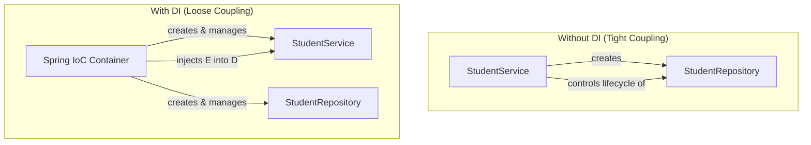

**Type 1: Constructor Injection (Recommended)**

Dependencies are provided through the class constructor. This ensures the object is always created with its required dependencies and makes them immutable.

```java
@Service
public class StudentService {

    private final StudentRepository studentRepository;
    private final EmailService emailService;

    @Autowired  // Optional for single constructor in Spring 4.3+
    public StudentService(StudentRepository studentRepository,
                          EmailService emailService) {
        this.studentRepository = studentRepository;
        this.emailService = emailService;
    }

    public Student createStudent(Student student) {
        Student saved = studentRepository.save(student);
        emailService.sendWelcomeEmail(student.getEmail());
        return saved;
    }

    public List<Student> getAllStudents() {
        return studentRepository.findAll();
    }
}
```

**Advantages of Constructor Injection:**
- Dependencies are `final` and immutable.
- Object is never created in an invalid state.
- Easy to unit test (pass mocks via constructor).
- Clearly shows all required dependencies.

**Type 2: Setter Injection**

Dependencies are injected through setter methods. Suitable for optional dependencies that have reasonable defaults.

```java
@Service
public class StudentService {

    private StudentRepository studentRepository;
    private EmailService emailService;

    @Autowired
    public void setStudentRepository(StudentRepository studentRepository) {
        this.studentRepository = studentRepository;
    }

    @Autowired(required = false)  // Optional dependency
    public void setEmailService(EmailService emailService) {
        this.emailService = emailService;
    }

    public Student createStudent(Student student) {
        Student saved = studentRepository.save(student);
        if (emailService != null) {
            emailService.sendWelcomeEmail(student.getEmail());
        }
        return saved;
    }
}
```

**Advantages of Setter Injection:**
- Allows optional dependencies (`required = false`).
- Dependencies can be changed after construction.
- Useful for circular dependency resolution.

**Type 3: Field Injection**

Dependencies are injected directly into fields. While concise, it is generally not recommended for production code.

```java
@Service
public class StudentService {

    @Autowired
    private StudentRepository studentRepository;

    @Autowired
    private EmailService emailService;

    public List<Student> getAllStudents() {
        return studentRepository.findAll();
    }
}
```

**Disadvantages of Field Injection:**
- Cannot make fields `final`.
- Harder to test (requires reflection to set private fields).
- Hides dependencies from the public API.
- Not possible to instantiate the object outside the Spring container.

**Comparison Table:**

| Feature | Constructor | Setter | Field |
|---------|-------------|--------|-------|
| Immutability | Yes (final fields) | No | No |
| Required Dependencies | Best suited | Possible | Possible |
| Optional Dependencies | Awkward | Best suited | Possible |
| Testability | Easy | Moderate | Difficult |
| Readability | Clear contract | Moderate | Hidden |
| Recommended | Yes (Spring team) | For optional | No |

**Using @Qualifier for Multiple Beans:**

When multiple beans of the same type exist, `@Qualifier` specifies which one to inject:

```java
public interface NotificationService {
    void sendNotification(String to, String message);
}

@Component("emailNotification")
public class EmailNotificationService implements NotificationService {
    public void sendNotification(String to, String message) {
        // Send email
    }
}

@Component("smsNotification")
public class SmsNotificationService implements NotificationService {
    public void sendNotification(String to, String message) {
        // Send SMS
    }
}

@Service
public class StudentService {

    private final NotificationService notificationService;

    @Autowired
    public StudentService(@Qualifier("emailNotification")
                           NotificationService notificationService) {
        this.notificationService = notificationService;
    }
}
```

**Using @Bean in @Configuration Class:**

For third-party classes that cannot be annotated with `@Component`:

```java
@Configuration
public class AppConfig {

    @Bean
    public RestTemplate restTemplate() {
        return new RestTemplate();
    }

    @Bean
    public ObjectMapper objectMapper() {
        ObjectMapper mapper = new ObjectMapper();
        mapper.setSerializationInclusion(JsonInclude.Include.NON_NULL);
        return mapper;
    }
}
```

---

### Q31. Explain the Bean lifecycle in Spring Boot. (Essay - 10 Marks)

The Spring Bean lifecycle refers to the sequence of events that occur from the creation of a bean to its destruction. Understanding the lifecycle is essential for initializing resources, performing cleanup, and managing bean state.

**Bean Lifecycle Diagram:**

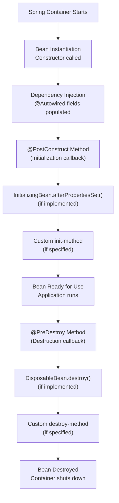

**Lifecycle Phases Explained:**

**Phase 1: Instantiation**
The Spring container creates an instance of the bean using its constructor.

**Phase 2: Dependency Injection**
Spring injects all dependencies (`@Autowired` fields, constructor parameters, setter methods).

**Phase 3: Initialization**
After dependencies are set, initialization callbacks are invoked in this order:
1. `@PostConstruct` annotated method
2. `afterPropertiesSet()` from `InitializingBean` interface
3. Custom `init-method` specified in `@Bean` annotation

**Phase 4: Usage**
The bean is fully initialized and available for use in the application.

**Phase 5: Destruction**
When the container shuts down, destruction callbacks are invoked:
1. `@PreDestroy` annotated method
2. `destroy()` from `DisposableBean` interface
3. Custom `destroy-method` specified in `@Bean` annotation

**Complete Lifecycle Example:**

```java
import javax.annotation.PostConstruct;
import javax.annotation.PreDestroy;
import org.springframework.beans.factory.DisposableBean;
import org.springframework.beans.factory.InitializingBean;
import org.springframework.stereotype.Component;

@Component
public class StudentService implements InitializingBean, DisposableBean {

    @Autowired
    private StudentRepository studentRepository;

    // Constructor - Phase 1
    public StudentService() {
        System.out.println("1. Constructor: StudentService instance created");
    }

    // Phase 2: Dependencies injected (handled by @Autowired)

    // Phase 3a: @PostConstruct
    @PostConstruct
    public void postConstruct() {
        System.out.println("3. @PostConstruct: Initialization logic");
        // Load cache, validate configuration, etc.
    }

    // Phase 3b: InitializingBean callback
    @Override
    public void afterPropertiesSet() throws Exception {
        System.out.println("4. afterPropertiesSet: Properties are set");
    }

    // Phase 4: Bean is used by the application
    public List<Student> getAllStudents() {
        return studentRepository.findAll();
    }

    // Phase 5a: @PreDestroy
    @PreDestroy
    public void preDestroy() {
        System.out.println("5. @PreDestroy: Cleanup before destruction");
        // Close connections, release resources
    }

    // Phase 5b: DisposableBean callback
    @Override
    public void destroy() throws Exception {
        System.out.println("6. destroy: Final cleanup");
    }
}
```

**Bean Scopes:**

Bean scope determines the lifecycle and visibility of a bean instance:

| Scope | Description |
|-------|-------------|
| `singleton` (default) | One instance per Spring container |
| `prototype` | New instance every time it is requested |
| `request` | One instance per HTTP request (web only) |
| `session` | One instance per HTTP session (web only) |

```java
@Component
@Scope("singleton")  // Default - single instance shared
public class StudentService {
    // ...
}

@Component
@Scope("prototype")  // New instance for each injection
public class ReportGenerator {
    // ...
}
```

**Using @Bean with init and destroy methods:**

```java
@Configuration
public class AppConfig {

    @Bean(initMethod = "init", destroyMethod = "cleanup")
    public DatabaseConnectionPool connectionPool() {
        return new DatabaseConnectionPool();
    }
}

public class DatabaseConnectionPool {
    public void init() {
        System.out.println("Initializing connection pool");
    }

    public void cleanup() {
        System.out.println("Closing all connections");
    }
}
```

**Lifecycle Execution Order (Console Output):**

```
1. Constructor: StudentService instance created
2. Dependencies injected via @Autowired
3. @PostConstruct: Initialization logic
4. afterPropertiesSet: Properties are set
--- Application running ---
5. @PreDestroy: Cleanup before destruction
6. destroy: Final cleanup
```

The recommended approach for modern Spring Boot applications is to use `@PostConstruct` for initialization and `@PreDestroy` for cleanup, as they are simple, annotation-based, and part of the `javax.annotation` package.

---

## Section 6: Database Connectivity using Spring Boot (MongoDB)

### Q32. What is Spring Data MongoDB? (2 Marks)

Spring Data MongoDB is a sub-project of Spring Data that provides integration between Spring applications and MongoDB. It offers a familiar Spring-based programming model for MongoDB operations, including repository abstractions (`MongoRepository`), query derivation from method names, template-based access (`MongoTemplate`), and automatic object-document mapping. It is included in Spring Boot via the `spring-boot-starter-data-mongodb` dependency and supports auto-configuration for MongoDB connections.

---

### Q33. What is MongoRepository? (2 Marks)

`MongoRepository` is an interface provided by Spring Data MongoDB that extends `PagingAndSortingRepository` and `CrudRepository`. By simply creating an interface that extends `MongoRepository<EntityType, IdType>`, Spring automatically generates the implementation at runtime with built-in methods like `save()`, `findAll()`, `findById()`, `deleteById()`, and `count()`. It also supports derived query methods based on method naming conventions (e.g., `findByDepartment(String department)`).

---

### Q34. What is the @Document annotation? (2 Marks)

`@Document` is a Spring Data MongoDB annotation used to mark a Java class as a MongoDB document entity. It maps the class to a specific MongoDB collection. The `collection` attribute specifies the collection name (e.g., `@Document(collection = "students")`). If no collection name is specified, Spring uses the class name in lowercase. Each instance of the annotated class corresponds to a document in the MongoDB collection.

---

### Q35. What is the difference between MongoRepository and MongoTemplate? (2 Marks)

`MongoRepository` is a high-level abstraction providing ready-made CRUD methods and derived queries through interface method naming; it requires minimal code and is suitable for standard operations. `MongoTemplate` is a low-level class offering fine-grained control over MongoDB operations, supporting complex queries, aggregations, updates, and custom criteria using `Query` and `Criteria` objects. Use `MongoRepository` for simple CRUD and `MongoTemplate` for advanced, complex queries.

---

### Q36. What is @Id annotation in MongoDB context? (2 Marks)

The `@Id` annotation (from `org.springframework.data.annotation.Id`) marks a field in a document class as the primary key, mapping it to MongoDB's `_id` field. When the field type is `String`, MongoDB auto-generates a unique `ObjectId` value if no explicit value is provided. The `@Id` field uniquely identifies each document within a collection and is automatically indexed by MongoDB for efficient lookups.

---

### Q37. Explain database connectivity with MongoDB in Spring Boot with complete code example. (Essay - 10 Marks)

Spring Boot provides seamless integration with MongoDB through Spring Data MongoDB. Below is a step-by-step guide to connect a Spring Boot application with MongoDB 7.0.

**Architecture:**

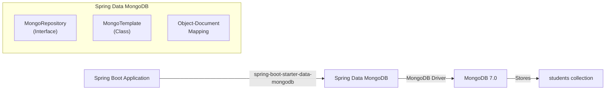

**Prerequisites:**
- MongoDB 7.0 installed and running on `localhost:27017`
- JDK 1.8 installed
- Spring Boot 2.7.18 project with `spring-boot-starter-data-mongodb` dependency

**Step 1: Add Dependency in pom.xml**

```java
<dependency>
    <groupId>org.springframework.boot</groupId>
    <artifactId>spring-boot-starter-data-mongodb</artifactId>
</dependency>
```

**Step 2: Configure MongoDB Connection in application.properties**

```
# MongoDB Configuration
spring.data.mongodb.host=localhost
spring.data.mongodb.port=27017
spring.data.mongodb.database=studentdb

# Alternative: Using connection URI
# spring.data.mongodb.uri=mongodb://localhost:27017/studentdb
```

**Step 3: Create the Entity (Document) Class**

```java
package com.example.studentapp.model;

import org.springframework.data.annotation.Id;
import org.springframework.data.mongodb.core.mapping.Document;
import org.springframework.data.mongodb.core.index.Indexed;

@Document(collection = "students")
public class Student {

    @Id
    private String id;

    private String name;

    @Indexed(unique = true)
    private String rollNumber;

    private String department;
    private String email;

    public Student() {}

    public Student(String name, String rollNumber, String department, String email) {
        this.name = name;
        this.rollNumber = rollNumber;
        this.department = department;
        this.email = email;
    }

    // Getters and Setters
    public String getId() { return id; }
    public void setId(String id) { this.id = id; }
    public String getName() { return name; }
    public void setName(String name) { this.name = name; }
    public String getRollNumber() { return rollNumber; }
    public void setRollNumber(String rollNumber) { this.rollNumber = rollNumber; }
    public String getDepartment() { return department; }
    public void setDepartment(String department) { this.department = department; }
    public String getEmail() { return email; }
    public void setEmail(String email) { this.email = email; }

    @Override
    public String toString() {
        return "Student{id='" + id + "', name='" + name +
               "', rollNumber='" + rollNumber + "', department='" +
               department + "', email='" + email + "'}";
    }
}
```

**Step 4: Create the Repository Interface**

```java
package com.example.studentapp.repository;

import com.example.studentapp.model.Student;
import org.springframework.data.mongodb.repository.MongoRepository;
import org.springframework.data.mongodb.repository.Query;
import org.springframework.stereotype.Repository;
import java.util.List;

@Repository
public interface StudentRepository extends MongoRepository<Student, String> {

    // Derived query methods (auto-implemented by Spring Data)
    List<Student> findByDepartment(String department);
    Student findByRollNumber(String rollNumber);
    List<Student> findByNameContaining(String name);
    List<Student> findByDepartmentAndName(String department, String name);

    // Custom MongoDB query using @Query annotation
    @Query("{ 'department': ?0, 'name': { $regex: ?1, $options: 'i' } }")
    List<Student> searchByDepartmentAndName(String department, String namePattern);
}
```

**Step 5: Create the Service Layer**

```java
package com.example.studentapp.service;

import com.example.studentapp.model.Student;
import com.example.studentapp.repository.StudentRepository;
import org.springframework.beans.factory.annotation.Autowired;
import org.springframework.stereotype.Service;
import java.util.List;
import java.util.Optional;

@Service
public class StudentService {

    @Autowired
    private StudentRepository studentRepository;

    public List<Student> getAllStudents() {
        return studentRepository.findAll();
    }

    public Optional<Student> getStudentById(String id) {
        return studentRepository.findById(id);
    }

    public Student createStudent(Student student) {
        return studentRepository.save(student);
    }

    public Student updateStudent(String id, Student studentDetails) {
        Student student = studentRepository.findById(id)
                .orElseThrow(() -> new RuntimeException("Student not found"));
        student.setName(studentDetails.getName());
        student.setRollNumber(studentDetails.getRollNumber());
        student.setDepartment(studentDetails.getDepartment());
        student.setEmail(studentDetails.getEmail());
        return studentRepository.save(student);
    }

    public void deleteStudent(String id) {
        studentRepository.deleteById(id);
    }

    public List<Student> findByDepartment(String department) {
        return studentRepository.findByDepartment(department);
    }

    public long countStudents() {
        return studentRepository.count();
    }
}
```

**Step 6: Create the REST Controller**

```java
package com.example.studentapp.controller;

import com.example.studentapp.model.Student;
import com.example.studentapp.service.StudentService;
import org.springframework.beans.factory.annotation.Autowired;
import org.springframework.http.HttpStatus;
import org.springframework.http.ResponseEntity;
import org.springframework.web.bind.annotation.*;
import java.util.List;

@RestController
@RequestMapping("/api/students")
public class StudentController {

    @Autowired
    private StudentService studentService;

    @GetMapping
    public List<Student> getAllStudents() {
        return studentService.getAllStudents();
    }

    @GetMapping("/{id}")
    public ResponseEntity<Student> getStudentById(@PathVariable String id) {
        return studentService.getStudentById(id)
                .map(ResponseEntity::ok)
                .orElse(ResponseEntity.notFound().build());
    }

    @PostMapping
    public ResponseEntity<Student> createStudent(@RequestBody Student student) {
        return ResponseEntity.status(HttpStatus.CREATED)
                .body(studentService.createStudent(student));
    }

    @PutMapping("/{id}")
    public ResponseEntity<Student> updateStudent(@PathVariable String id,
                                                  @RequestBody Student student) {
        return ResponseEntity.ok(studentService.updateStudent(id, student));
    }

    @DeleteMapping("/{id}")
    public ResponseEntity<Void> deleteStudent(@PathVariable String id) {
        studentService.deleteStudent(id);
        return ResponseEntity.noContent().build();
    }
}
```

**Step 7: Run and Test**

Start MongoDB server, then run the Spring Boot application. The auto-configuration automatically creates the MongoDB connection and collection.

**MongoDB Document Structure:**
```
// Document in "students" collection
{
    "_id": ObjectId("64a1b2c3d4e5f6a7b8c9d0e1"),
    "name": "Ravi Kumar",
    "rollNumber": "20B01A1234",
    "department": "IT",
    "email": "ravi@example.com",
    "_class": "com.example.studentapp.model.Student"
}
```

**How Auto-Configuration Works:**
1. Spring Boot detects `spring-boot-starter-data-mongodb` on the classpath.
2. It reads MongoDB settings from `application.properties`.
3. It auto-creates a `MongoClient` bean connected to the specified database.
4. It sets up `MongoTemplate` and enables MongoDB repository support.
5. `StudentRepository` implementation is generated at runtime by Spring Data.

---

### Q38. Explain CRUD operations using Spring Boot and MongoDB with code. (Essay - 10 Marks)

CRUD stands for Create, Read, Update, and Delete -- the four fundamental database operations. Below is a complete implementation using Spring Boot 2.7.18 with MongoDB.

**CRUD Operations Flow:**

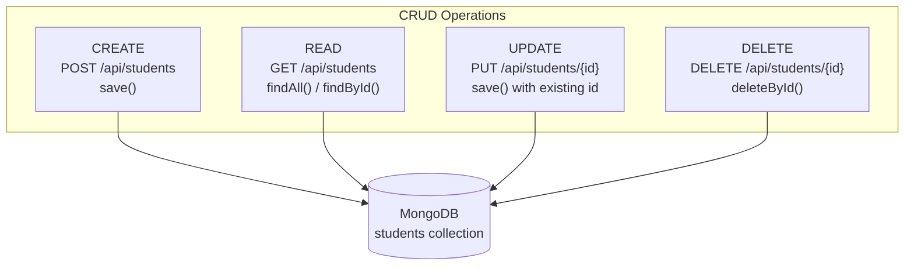

**Entity Class:**

```java
@Document(collection = "students")
public class Student {
    @Id
    private String id;
    private String name;
    private String rollNumber;
    private String department;
    private String email;

    public Student() {}

    public Student(String name, String rollNumber, String department, String email) {
        this.name = name;
        this.rollNumber = rollNumber;
        this.department = department;
        this.email = email;
    }

    // Getters and Setters
    public String getId() { return id; }
    public void setId(String id) { this.id = id; }
    public String getName() { return name; }
    public void setName(String name) { this.name = name; }
    public String getRollNumber() { return rollNumber; }
    public void setRollNumber(String rollNumber) { this.rollNumber = rollNumber; }
    public String getDepartment() { return department; }
    public void setDepartment(String department) { this.department = department; }
    public String getEmail() { return email; }
    public void setEmail(String email) { this.email = email; }
}
```

**Repository Interface:**

```java
@Repository
public interface StudentRepository extends MongoRepository<Student, String> {
    List<Student> findByDepartment(String department);
    Student findByRollNumber(String rollNumber);
    List<Student> findByNameContaining(String keyword);
}
```

**Service Layer with all CRUD operations:**

```java
@Service
public class StudentService {

    @Autowired
    private StudentRepository studentRepository;

    // ========== CREATE ==========
    public Student createStudent(Student student) {
        return studentRepository.save(student);
    }

    // ========== READ ==========
    public List<Student> getAllStudents() {
        return studentRepository.findAll();
    }

    public Optional<Student> getStudentById(String id) {
        return studentRepository.findById(id);
    }

    public Student getStudentByRollNumber(String rollNumber) {
        return studentRepository.findByRollNumber(rollNumber);
    }

    public List<Student> getStudentsByDepartment(String department) {
        return studentRepository.findByDepartment(department);
    }

    // ========== UPDATE ==========
    public Student updateStudent(String id, Student updatedStudent) {
        Student existingStudent = studentRepository.findById(id)
                .orElseThrow(() -> new RuntimeException("Student not found with id: " + id));

        existingStudent.setName(updatedStudent.getName());
        existingStudent.setRollNumber(updatedStudent.getRollNumber());
        existingStudent.setDepartment(updatedStudent.getDepartment());
        existingStudent.setEmail(updatedStudent.getEmail());

        return studentRepository.save(existingStudent);
    }

    // ========== DELETE ==========
    public void deleteStudent(String id) {
        if (!studentRepository.existsById(id)) {
            throw new RuntimeException("Student not found with id: " + id);
        }
        studentRepository.deleteById(id);
    }

    public void deleteAllStudents() {
        studentRepository.deleteAll();
    }
}
```

**Controller with CRUD Endpoints:**

```java
@RestController
@RequestMapping("/api/students")
public class StudentController {

    @Autowired
    private StudentService studentService;

    // ========== CREATE ==========
    // POST http://localhost:8080/api/students
    @PostMapping
    public ResponseEntity<Student> createStudent(@RequestBody Student student) {
        Student created = studentService.createStudent(student);
        return ResponseEntity.status(HttpStatus.CREATED).body(created);
    }

    // ========== READ ==========
    // GET http://localhost:8080/api/students
    @GetMapping
    public List<Student> getAllStudents() {
        return studentService.getAllStudents();
    }

    // GET http://localhost:8080/api/students/{id}
    @GetMapping("/{id}")
    public ResponseEntity<Student> getStudentById(@PathVariable String id) {
        return studentService.getStudentById(id)
                .map(ResponseEntity::ok)
                .orElse(ResponseEntity.notFound().build());
    }

    // GET http://localhost:8080/api/students/roll/{rollNumber}
    @GetMapping("/roll/{rollNumber}")
    public ResponseEntity<Student> getByRollNumber(@PathVariable String rollNumber) {
        Student student = studentService.getStudentByRollNumber(rollNumber);
        if (student != null) {
            return ResponseEntity.ok(student);
        }
        return ResponseEntity.notFound().build();
    }

    // GET http://localhost:8080/api/students/department/{dept}
    @GetMapping("/department/{dept}")
    public List<Student> getByDepartment(@PathVariable String dept) {
        return studentService.getStudentsByDepartment(dept);
    }

    // ========== UPDATE ==========
    // PUT http://localhost:8080/api/students/{id}
    @PutMapping("/{id}")
    public ResponseEntity<Student> updateStudent(@PathVariable String id,
                                                  @RequestBody Student student) {
        Student updated = studentService.updateStudent(id, student);
        return ResponseEntity.ok(updated);
    }

    // ========== DELETE ==========
    // DELETE http://localhost:8080/api/students/{id}
    @DeleteMapping("/{id}")
    public ResponseEntity<Void> deleteStudent(@PathVariable String id) {
        studentService.deleteStudent(id);
        return ResponseEntity.noContent().build();
    }
}
```

**Testing CRUD Operations (HTTP Requests):**

```
--- CREATE ---
POST http://localhost:8080/api/students
Content-Type: application/json

{
    "name": "Ravi Kumar",
    "rollNumber": "20B01A1234",
    "department": "IT",
    "email": "ravi@example.com"
}

Response: 201 Created
{
    "id": "64a1b2c3d4e5f6a7b8c9d0e1",
    "name": "Ravi Kumar",
    "rollNumber": "20B01A1234",
    "department": "IT",
    "email": "ravi@example.com"
}

--- READ ALL ---
GET http://localhost:8080/api/students

Response: 200 OK
[
    {
        "id": "64a1b2c3d4e5f6a7b8c9d0e1",
        "name": "Ravi Kumar",
        "rollNumber": "20B01A1234",
        "department": "IT",
        "email": "ravi@example.com"
    }
]

--- READ BY ID ---
GET http://localhost:8080/api/students/64a1b2c3d4e5f6a7b8c9d0e1

--- UPDATE ---
PUT http://localhost:8080/api/students/64a1b2c3d4e5f6a7b8c9d0e1
Content-Type: application/json

{
    "name": "Ravi Kumar",
    "rollNumber": "20B01A1234",
    "department": "CSE",
    "email": "ravi.kumar@example.com"
}

--- DELETE ---
DELETE http://localhost:8080/api/students/64a1b2c3d4e5f6a7b8c9d0e1

Response: 204 No Content
```

**MongoRepository Built-in Methods Used:**

| Method | Operation | Description |
|--------|-----------|-------------|
| `save(entity)` | Create/Update | Inserts new or updates existing document |
| `findAll()` | Read | Returns all documents in collection |
| `findById(id)` | Read | Returns Optional with document by ID |
| `existsById(id)` | Read | Checks if document exists |
| `count()` | Read | Returns total document count |
| `deleteById(id)` | Delete | Removes document by ID |
| `deleteAll()` | Delete | Removes all documents |

---

### Q39. Explain how to implement search and filter functionality in a Spring Boot REST API. (Essay - 10 Marks)

Search and filter functionality allows clients to query specific subsets of data based on various criteria. Spring Data MongoDB provides multiple approaches for implementing this.

**Search/Filter Architecture:**

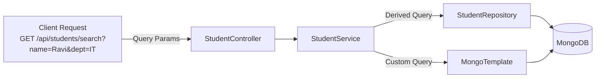

**Approach 1: Derived Query Methods (Simple Filters)**

Spring Data automatically generates queries from method names:

```java
@Repository
public interface StudentRepository extends MongoRepository<Student, String> {

    // Find by single field
    List<Student> findByDepartment(String department);
    Student findByRollNumber(String rollNumber);
    Student findByEmail(String email);

    // Find by partial match (contains)
    List<Student> findByNameContaining(String keyword);

    // Find by multiple fields (AND)
    List<Student> findByDepartmentAndName(String department, String name);

    // Find with sorting
    List<Student> findByDepartmentOrderByNameAsc(String department);

    // Find with ignore case
    List<Student> findByNameIgnoreCase(String name);

    // Find by name starting with
    List<Student> findByNameStartingWith(String prefix);
}
```

**Approach 2: @Query Annotation (Custom MongoDB Queries)**

```java
@Repository
public interface StudentRepository extends MongoRepository<Student, String> {

    // Custom query using MongoDB JSON syntax
    @Query("{ 'name': { $regex: ?0, $options: 'i' } }")
    List<Student> searchByName(String namePattern);

    // Query with multiple conditions
    @Query("{ 'department': ?0, 'name': { $regex: ?1, $options: 'i' } }")
    List<Student> searchByDepartmentAndName(String department, String namePattern);

    // Query with projection (return only specific fields)
    @Query(value = "{ 'department': ?0 }", fields = "{ 'name': 1, 'rollNumber': 1 }")
    List<Student> findNameAndRollByDepartment(String department);
}
```

**Approach 3: MongoTemplate (Complex Dynamic Queries)**

```java
@Service
public class StudentSearchService {

    @Autowired
    private MongoTemplate mongoTemplate;

    public List<Student> searchStudents(String name, String department, String email) {
        Query query = new Query();

        // Add criteria dynamically based on provided parameters
        if (name != null && !name.isEmpty()) {
            query.addCriteria(Criteria.where("name")
                    .regex(name, "i")); // Case-insensitive regex
        }

        if (department != null && !department.isEmpty()) {
            query.addCriteria(Criteria.where("department").is(department));
        }

        if (email != null && !email.isEmpty()) {
            query.addCriteria(Criteria.where("email")
                    .regex(email, "i"));
        }

        return mongoTemplate.find(query, Student.class);
    }

    // Search with pagination and sorting
    public List<Student> searchWithPagination(String department, int page, int size) {
        Query query = new Query();

        if (department != null && !department.isEmpty()) {
            query.addCriteria(Criteria.where("department").is(department));
        }

        query.with(Sort.by(Sort.Direction.ASC, "name"));
        query.skip((long) page * size);
        query.limit(size);

        return mongoTemplate.find(query, Student.class);
    }
}
```

**Controller with Search Endpoints:**

```java
@RestController
@RequestMapping("/api/students")
public class StudentController {

    @Autowired
    private StudentService studentService;

    @Autowired
    private StudentSearchService searchService;

    // Simple filter by department
    // GET /api/students/department/IT
    @GetMapping("/department/{dept}")
    public List<Student> filterByDepartment(@PathVariable String dept) {
        return studentService.getStudentsByDepartment(dept);
    }

    // Search by name (partial match)
    // GET /api/students/search?name=Ravi
    @GetMapping("/search")
    public List<Student> searchStudents(
            @RequestParam(required = false) String name,
            @RequestParam(required = false) String department,
            @RequestParam(required = false) String email) {
        return searchService.searchStudents(name, department, email);
    }

    // Search with pagination
    // GET /api/students/search/paged?department=IT&page=0&size=10
    @GetMapping("/search/paged")
    public List<Student> searchWithPagination(
            @RequestParam(required = false) String department,
            @RequestParam(defaultValue = "0") int page,
            @RequestParam(defaultValue = "10") int size) {
        return searchService.searchWithPagination(department, page, size);
    }

    // Find by roll number
    // GET /api/students/roll/20B01A1234
    @GetMapping("/roll/{rollNumber}")
    public ResponseEntity<Student> findByRollNumber(@PathVariable String rollNumber) {
        Student student = studentService.getStudentByRollNumber(rollNumber);
        if (student != null) {
            return ResponseEntity.ok(student);
        }
        return ResponseEntity.notFound().build();
    }
}
```

**Query Method Keyword Reference:**

| Keyword | Method Example | MongoDB Query |
|---------|---------------|---------------|
| Is / Equals | `findByName(String)` | `{ "name": value }` |
| Containing | `findByNameContaining(String)` | `{ "name": /value/ }` |
| StartingWith | `findByNameStartingWith(String)` | `{ "name": /^value/ }` |
| GreaterThan | `findByAgeGreaterThan(int)` | `{ "age": { $gt: value } }` |
| Between | `findByAgeBetween(int, int)` | `{ "age": { $gt: v1, $lt: v2 } }` |
| OrderBy | `findByDeptOrderByNameAsc(String)` | `sort: { "name": 1 }` |
| IgnoreCase | `findByNameIgnoreCase(String)` | Case-insensitive match |
| In | `findByDepartmentIn(List)` | `{ "department": { $in: [...] } }` |

**Example Requests and Responses:**

```
# Search by name
GET /api/students/search?name=Ravi
-> Returns all students whose name contains "Ravi"

# Search by department
GET /api/students/search?department=IT
-> Returns all IT department students

# Combined search
GET /api/students/search?name=Kumar&department=CSE
-> Returns CSE students with "Kumar" in their name

# Paginated search
GET /api/students/search/paged?department=IT&page=0&size=5
-> Returns first 5 IT students sorted by name
```

---

### Q40. Explain Spring Security basics for user authentication. (Essay - 10 Marks)

Spring Security is a powerful authentication and authorization framework for Spring-based applications. It provides comprehensive security services including user authentication, role-based access control, CSRF protection, and session management.

**Spring Security Architecture:**

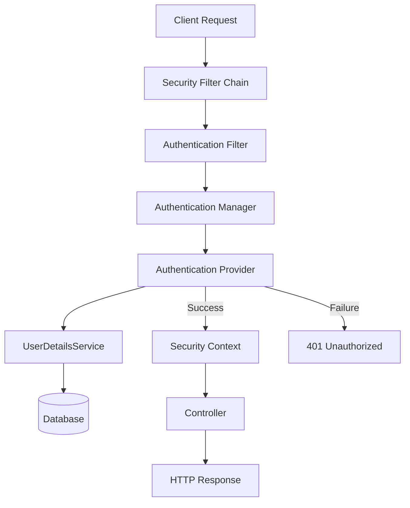

**Step 1: Add Spring Security Dependency**

```java
<dependency>
    <groupId>org.springframework.boot</groupId>
    <artifactId>spring-boot-starter-security</artifactId>
</dependency>
```

When this dependency is added, Spring Boot auto-configures basic security: all endpoints require authentication, and a default user with a generated password is created.

**Step 2: Create Security Configuration**

```java
package com.example.studentapp.config;

import org.springframework.context.annotation.Bean;
import org.springframework.context.annotation.Configuration;
import org.springframework.security.config.annotation.web.builders.HttpSecurity;
import org.springframework.security.config.annotation.web.configuration.EnableWebSecurity;
import org.springframework.security.core.userdetails.User;
import org.springframework.security.core.userdetails.UserDetails;
import org.springframework.security.core.userdetails.UserDetailsService;
import org.springframework.security.crypto.bcrypt.BCryptPasswordEncoder;
import org.springframework.security.crypto.password.PasswordEncoder;
import org.springframework.security.provisioning.InMemoryUserDetailsManager;
import org.springframework.security.web.SecurityFilterChain;

@Configuration
@EnableWebSecurity
public class SecurityConfig {

    @Bean
    public SecurityFilterChain securityFilterChain(HttpSecurity http) throws Exception {
        http
            .csrf().disable()
            .authorizeRequests()
                .antMatchers("/api/students/**").hasRole("USER")
                .antMatchers("/admin/**").hasRole("ADMIN")
                .antMatchers("/", "/home", "/public/**").permitAll()
                .anyRequest().authenticated()
            .and()
            .formLogin()
                .loginPage("/login")
                .defaultSuccessUrl("/students")
                .permitAll()
            .and()
            .logout()
                .logoutUrl("/logout")
                .logoutSuccessUrl("/login?logout")
                .permitAll()
            .and()
            .httpBasic(); // For REST API testing

        return http.build();
    }

    @Bean
    public UserDetailsService userDetailsService() {
        UserDetails user = User.builder()
                .username("student")
                .password(passwordEncoder().encode("password123"))
                .roles("USER")
                .build();

        UserDetails admin = User.builder()
                .username("admin")
                .password(passwordEncoder().encode("admin123"))
                .roles("USER", "ADMIN")
                .build();

        return new InMemoryUserDetailsManager(user, admin);
    }

    @Bean
    public PasswordEncoder passwordEncoder() {
        return new BCryptPasswordEncoder();
    }
}
```

**Step 3: Create User Entity for MongoDB-based Authentication**

```java
@Document(collection = "users")
public class AppUser {
    @Id
    private String id;
    private String username;
    private String password;
    private String role; // "ROLE_USER", "ROLE_ADMIN"

    // Constructors, Getters, and Setters
    public AppUser() {}

    public AppUser(String username, String password, String role) {
        this.username = username;
        this.password = password;
        this.role = role;
    }

    public String getId() { return id; }
    public void setId(String id) { this.id = id; }
    public String getUsername() { return username; }
    public void setUsername(String username) { this.username = username; }
    public String getPassword() { return password; }
    public void setPassword(String password) { this.password = password; }
    public String getRole() { return role; }
    public void setRole(String role) { this.role = role; }
}
```

**Step 4: Custom UserDetailsService with MongoDB**

```java
@Service
public class CustomUserDetailsService implements UserDetailsService {

    @Autowired
    private UserRepository userRepository;

    @Override
    public UserDetails loadUserByUsername(String username) throws UsernameNotFoundException {
        AppUser appUser = userRepository.findByUsername(username);
        if (appUser == null) {
            throw new UsernameNotFoundException("User not found: " + username);
        }

        return User.builder()
                .username(appUser.getUsername())
                .password(appUser.getPassword())
                .roles(appUser.getRole().replace("ROLE_", ""))
                .build();
    }
}

@Repository
public interface UserRepository extends MongoRepository<AppUser, String> {
    AppUser findByUsername(String username);
}
```

**Step 5: Login Page with Thymeleaf**

```html
<!DOCTYPE html>
<html xmlns:th="http://www.thymeleaf.org">
<head>
    <title>Login</title>
</head>
<body>
    <h1>Login</h1>
    <div th:if="${param.error}" style="color: red;">
        Invalid username or password.
    </div>
    <div th:if="${param.logout}" style="color: green;">
        You have been logged out.
    </div>

    <form th:action="@{/login}" method="post">
        <label>Username:</label>
        <input type="text" name="username" required /><br/>

        <label>Password:</label>
        <input type="password" name="password" required /><br/>

        <button type="submit">Login</button>
    </form>
</body>
</html>
```

**Key Spring Security Concepts:**

| Concept | Description |
|---------|-------------|
| Authentication | Verifying user identity (who are you?) |
| Authorization | Verifying user permissions (what can you do?) |
| SecurityFilterChain | Chain of filters that process every HTTP request |
| UserDetailsService | Interface to load user data for authentication |
| PasswordEncoder | Encodes passwords (BCrypt recommended) |
| CSRF Protection | Prevents Cross-Site Request Forgery attacks |
| `@EnableWebSecurity` | Enables Spring Security's web configuration |

**Request Authorization Rules:**

```java
.authorizeRequests()
    .antMatchers("/public/**").permitAll()         // No auth required
    .antMatchers("/api/**").hasRole("USER")         // USER role required
    .antMatchers("/admin/**").hasRole("ADMIN")       // ADMIN role required
    .anyRequest().authenticated()                    // Any other: login required
```

---

## Additional Short Answer Questions

### Q41. What is the difference between @GetMapping and @RequestMapping? (2 Marks)

`@RequestMapping` is a general-purpose annotation that maps HTTP requests to handler methods and supports all HTTP methods via the `method` attribute (e.g., `@RequestMapping(value="/students", method=RequestMethod.GET)`). `@GetMapping` is a shortcut annotation specifically for HTTP GET requests, equivalent to `@RequestMapping(method=RequestMethod.GET)`. Similarly, `@PostMapping`, `@PutMapping`, and `@DeleteMapping` are shortcuts for their respective HTTP methods. `@GetMapping` is more concise and readable.

---

### Q42. What is the difference between @PathVariable and @RequestParam? (2 Marks)

`@PathVariable` extracts values from the URI path itself (e.g., `/students/{id}` maps `id` from the URL). `@RequestParam` extracts values from query string parameters (e.g., `/students?department=IT` extracts `department`). `@PathVariable` is used for identifying specific resources (RESTful style), while `@RequestParam` is used for filtering, searching, or optional parameters. `@RequestParam` supports default values (`defaultValue = "IT"`) and can be marked as optional (`required = false`).

---

### Q43. What is @ResponseBody? (2 Marks)

`@ResponseBody` is a Spring annotation that indicates the return value of a controller method should be written directly to the HTTP response body, rather than being interpreted as a view name. Spring uses `HttpMessageConverter` (Jackson library) to automatically serialize the return object to JSON or XML. When using `@RestController`, `@ResponseBody` is implicitly applied to all methods, so it does not need to be specified separately.

---

### Q44. What is @ModelAttribute? (2 Marks)

`@ModelAttribute` is a Spring annotation used in two contexts: (1) On a method parameter in a controller, it binds form data or request parameters to a Java object automatically (e.g., `public String save(@ModelAttribute Student student)`). (2) On a method in a controller, it adds attributes to the model before any handler method is called. It is commonly used with Thymeleaf forms to bind HTML form fields to entity properties using `th:field`.

---

### Q45. What is the difference between PUT and POST in REST? (2 Marks)

`POST` is used to **create** a new resource on the server. It is not idempotent (calling it multiple times creates multiple resources). `PUT` is used to **update** an existing resource or create it at a specific URI. It is idempotent (calling it multiple times with the same data produces the same result). In Spring Boot: `@PostMapping` handles creation (`POST /api/students`), and `@PutMapping` handles updates (`PUT /api/students/{id}`).

---

### Q46. What is ResponseEntity in Spring Boot? (2 Marks)

`ResponseEntity` is a class in Spring that represents the entire HTTP response including status code, headers, and body. It provides fine-grained control over the response sent to the client. For example, `ResponseEntity.ok(student)` returns 200 OK with the student object, `ResponseEntity.status(HttpStatus.CREATED).body(student)` returns 201 Created, and `ResponseEntity.notFound().build()` returns 404 Not Found. It is the recommended return type for REST API controller methods.

---

### Q47. What is @Field annotation in MongoDB? (2 Marks)

`@Field` is a Spring Data MongoDB annotation used to customize the field name in the MongoDB document. By default, Java field names are used as MongoDB document field names. `@Field("student_name")` on a Java field `name` will store it as `student_name` in the MongoDB document. This is useful when the MongoDB collection uses different naming conventions (e.g., snake_case) than the Java entity (camelCase).

---

### Q48. What is the role of Spring Boot DevTools? (2 Marks)

Spring Boot DevTools is a development-time module that enhances developer productivity. Key features include: (1) **Automatic restart** - application restarts automatically when code changes are detected, (2) **LiveReload** - browser refreshes automatically when static resources change, (3) **Disable caching** - disables template caching for immediate changes in Thymeleaf views, (4) **H2 console** - enables the database console. It is added as a `runtime` scope dependency and is automatically disabled in production.

---

### Q49. What is @Indexed annotation in MongoDB? (2 Marks)

`@Indexed` is a Spring Data MongoDB annotation that creates an index on a field in the MongoDB collection for faster query performance. For example, `@Indexed(unique = true)` on the `rollNumber` field creates a unique index, preventing duplicate roll numbers. `@Indexed` without `unique` creates a non-unique index. Indexes improve read performance for frequently queried fields but add a small overhead to write operations.

---

### Q50. What is the difference between findById() and findAll() in MongoRepository? (2 Marks)

`findById(String id)` retrieves a single document from MongoDB by its `_id` field and returns an `Optional<Entity>` (may or may not contain a value). `findAll()` retrieves all documents from the collection and returns a `List<Entity>`. `findById` queries using the primary key index, making it very fast. `findAll` performs a full collection scan and should be used with caution on large collections. Both are built-in methods provided by `MongoRepository`.

---

## Quick Reference: Annotations Summary

| Annotation | Layer | Purpose |
|------------|-------|---------|
| `@SpringBootApplication` | Main | Combines @Configuration + @EnableAutoConfiguration + @ComponentScan |
| `@RestController` | Controller | REST API controller (returns JSON) |
| `@Controller` | Controller | MVC controller (returns views) |
| `@Service` | Service | Business logic component |
| `@Repository` | Repository | Data access component |
| `@Component` | Any | Generic Spring-managed bean |
| `@Autowired` | Any | Auto-inject dependency |
| `@Configuration` | Config | Declares bean definition source |
| `@Bean` | Config | Declares a bean via method |
| `@Document` | Model | Maps class to MongoDB collection |
| `@Id` | Model | Primary key field |
| `@GetMapping` | Controller | HTTP GET handler |
| `@PostMapping` | Controller | HTTP POST handler |
| `@PutMapping` | Controller | HTTP PUT handler |
| `@DeleteMapping` | Controller | HTTP DELETE handler |
| `@RequestBody` | Controller | Deserialize JSON request body |
| `@PathVariable` | Controller | Extract URL path variable |
| `@RequestParam` | Controller | Extract query parameter |
| `@Value` | Any | Inject property value |

---

*Prepared for B.E. IV Semester IT - Vasavi College of Engineering*
*Spring Boot 2.7.18 | JDK 1.8 | Maven | MongoDB 7.0*
