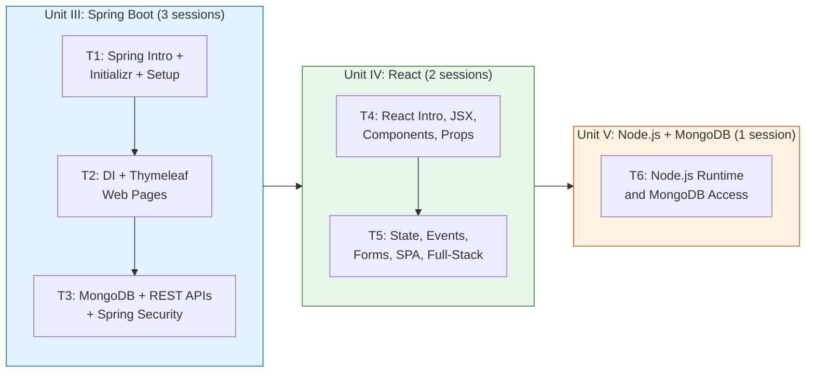
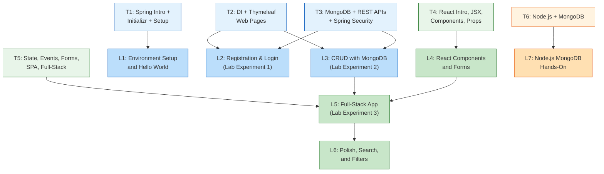

# Full Stack Development - Teaching Plan

> **Vasavi College of Engineering (Autonomous), Hyderabad**
> Department of Information Technology | B.E. IV Semester
> Theory: U24PC440IT (3 hrs/week) | Lab: U24PC431IT (2 hrs/week)

This document covers **Units III, IV, and V** only (Spring Boot, React, Node.js + MongoDB). Units I-II (HTML/CSS/JS/XML) and Bootstrap are handled separately.

**Tech stack:** JDK 1.8, Spring Boot 2.7.18, React 18.3.x (Vite), Node.js 20 LTS, MongoDB 7.0 local.

---

## Table of Contents

- [0. Code and Directory Reference Guide](#0-code-and-directory-reference-guide)
- [1. Theory Sessions (T1-T6) -- Detailed Instructor Plans](#1-theory-sessions-t1-t10----detailed-instructor-plans)
- [2. Lab Sessions (L1-L7) -- Detailed Instructor Plans](#2-lab-sessions-l1-l7----detailed-instructor-plans)
- [3. Teaching Flow](#3-teaching-flow)
- [4. Lab Session Mapping](#4-lab-session-mapping)
- [5. Assessment Timeline](#5-assessment-timeline)
- [6. Q&A Reference and Exam Mapping](#6-qa-reference-and-exam-mapping)
- [7. Tips for the Instructor](#7-tips-for-the-instructor)

---

## 0. Code and Directory Reference Guide

This table maps every topic to its exact resources in the repository. Use this as your master lookup when preparing sessions.

| Topic | Theory Doc | Presentation | Live Coding Snippet | Lab Experiment | Exam Scaffold |
|-------|-----------|-------------|---------------------|----------------|--------------|
| Spring Boot Introduction | [docs/springboot/01-introduction.md](../docs/springboot/01-introduction.md) | [presentations/01-springboot.pptx](../presentations/01-springboot.pptx) | [snippets/springboot/hello-world/](../snippets/springboot/hello-world/) | -- | -- |
| Spring Initializr | [docs/springboot/02-spring-initializr.md](../docs/springboot/02-spring-initializr.md) | [presentations/01-springboot.pptx](../presentations/01-springboot.pptx) | [snippets/springboot/hello-world/](../snippets/springboot/hello-world/) | -- | -- |
| Dependency Injection | [docs/springboot/03-dependency-injection.md](../docs/springboot/03-dependency-injection.md) | [presentations/01-springboot.pptx](../presentations/01-springboot.pptx) | [snippets/springboot/dependency-injection/](../snippets/springboot/dependency-injection/) | -- | -- |
| Building Web Pages (Thymeleaf) | [docs/springboot/04-building-web-pages.md](../docs/springboot/04-building-web-pages.md) | [presentations/01-springboot.pptx](../presentations/01-springboot.pptx) | [snippets/springboot/thymeleaf-inmemory/](../snippets/springboot/thymeleaf-inmemory/) | -- | -- |
| Database Connectivity | [docs/springboot/05-database-connectivity.md](../docs/springboot/05-database-connectivity.md) | [presentations/01-springboot.pptx](../presentations/01-springboot.pptx) | [snippets/springboot/mongo-connection/](../snippets/springboot/mongo-connection/) | [labs/springboot-crud-mongodb/](../labs/springboot-crud-mongodb/) | [exams/springboot-crud-mongodb/](../exams/springboot-crud-mongodb/) |
| REST APIs | [docs/springboot/06-rest-apis.md](../docs/springboot/06-rest-apis.md) | [presentations/01-springboot.pptx](../presentations/01-springboot.pptx) | [snippets/springboot/rest-controller/](../snippets/springboot/rest-controller/) | -- | -- |
| Registration and Login | [docs/springboot/qa.md](../docs/springboot/qa.md) | [presentations/01-springboot.pptx](../presentations/01-springboot.pptx) | -- | [labs/springboot-login-register/](../labs/springboot-login-register/) | [exams/springboot-login-register/](../exams/springboot-login-register/) |
| React Introduction | [docs/react/01-introduction.md](../docs/react/01-introduction.md) | [presentations/02-react.pptx](../presentations/02-react.pptx) | [snippets/react/jsx-basics/](../snippets/react/jsx-basics/) | -- | -- |
| JSX and Rendering | [docs/react/02-jsx-rendering.md](../docs/react/02-jsx-rendering.md) | [presentations/02-react.pptx](../presentations/02-react.pptx) | [snippets/react/jsx-basics/](../snippets/react/jsx-basics/) | -- | -- |
| Components and Props | [docs/react/03-components-props.md](../docs/react/03-components-props.md) | [presentations/02-react.pptx](../presentations/02-react.pptx) | [snippets/react/components-props/](../snippets/react/components-props/) | -- | -- |
| State and Lifecycle | [docs/react/04-state-lifecycle.md](../docs/react/04-state-lifecycle.md) | [presentations/02-react.pptx](../presentations/02-react.pptx) | [snippets/react/state-events/](../snippets/react/state-events/) | -- | -- |
| Events and Forms | [docs/react/05-events-forms.md](../docs/react/05-events-forms.md) | [presentations/02-react.pptx](../presentations/02-react.pptx) | [snippets/react/forms-validation/](../snippets/react/forms-validation/) | -- | -- |
| Lists and Conditional | [docs/react/06-lists-conditional.md](../docs/react/06-lists-conditional.md) | [presentations/02-react.pptx](../presentations/02-react.pptx) | [snippets/react/components-props/](../snippets/react/components-props/) | -- | -- |
| Single Page Apps | [docs/react/07-single-page-apps.md](../docs/react/07-single-page-apps.md) | [presentations/02-react.pptx](../presentations/02-react.pptx) | [snippets/react/react-router-spa/](../snippets/react/react-router-spa/) | -- | -- |
| Full-Stack App | -- | -- | -- | [labs/fullstack-student-app/](../labs/fullstack-student-app/) | [exams/fullstack-student-app/](../exams/fullstack-student-app/) |
| Node.js Introduction | [docs/nodejs-mongodb/01-introduction-nodejs.md](../docs/nodejs-mongodb/01-introduction-nodejs.md) | [presentations/03-nodejs-mongodb.pptx](../presentations/03-nodejs-mongodb.pptx) | [snippets/nodejs-mongodb/hello-node/](../snippets/nodejs-mongodb/hello-node/) | -- | -- |
| Events and Callbacks | [docs/nodejs-mongodb/02-events-callbacks.md](../docs/nodejs-mongodb/02-events-callbacks.md) | [presentations/03-nodejs-mongodb.pptx](../presentations/03-nodejs-mongodb.pptx) | [snippets/nodejs-mongodb/events-timers/](../snippets/nodejs-mongodb/events-timers/) + `callbacks-async/` | -- | -- |
| MongoDB Introduction | [docs/nodejs-mongodb/03-introduction-mongodb.md](../docs/nodejs-mongodb/03-introduction-mongodb.md) | [presentations/03-nodejs-mongodb.pptx](../presentations/03-nodejs-mongodb.pptx) | [snippets/nodejs-mongodb/mongo-crud/](../snippets/nodejs-mongodb/mongo-crud/) | -- | -- |
| MongoDB from Node.js | [docs/nodejs-mongodb/04-mongodb-from-nodejs.md](../docs/nodejs-mongodb/04-mongodb-from-nodejs.md) | [presentations/03-nodejs-mongodb.pptx](../presentations/03-nodejs-mongodb.pptx) | [snippets/nodejs-mongodb/mongo-crud/](../snippets/nodejs-mongodb/mongo-crud/) | -- | -- |
| Q&A / Exam Prep | [docs/springboot/qa.md](../docs/springboot/qa.md), [docs/react/qa.md](../docs/react/qa.md), [docs/nodejs-mongodb/qa.md](../docs/nodejs-mongodb/qa.md) | -- | -- | -- | All in [exams/](../exams/) |

### Snippet File Quick-Reference

**Spring Boot snippets:**

| Snippet Folder | Key Files |
|---------------|-----------|
| [snippets/springboot/hello-world/](../snippets/springboot/hello-world/) | `pom.xml`, `src/main/java/com/demo/HelloApplication.java`, `src/main/java/com/demo/HelloController.java` |
| [snippets/springboot/dependency-injection/](../snippets/springboot/dependency-injection/) | `pom.xml`, `src/main/java/com/demo/DiApplication.java`, `src/main/java/com/demo/service/GreetingService.java`, `EnglishGreetingService.java`, `TeluguGreetingService.java`, `src/main/java/com/demo/controller/ConstructorInjectionController.java`, `FieldInjectionController.java`, `SetterInjectionController.java` |
| [snippets/springboot/thymeleaf-inmemory/](../snippets/springboot/thymeleaf-inmemory/) | `pom.xml`, `src/main/java/com/demo/ThymeleafApplication.java`, `src/main/java/com/demo/Student.java`, `src/main/java/com/demo/StudentController.java`, `src/main/resources/templates/students.html` |
| [snippets/springboot/rest-controller/](../snippets/springboot/rest-controller/) | `pom.xml`, `src/main/java/com/demo/RestControllerApplication.java`, `src/main/java/com/demo/Message.java`, `src/main/java/com/demo/MessageController.java` |
| [snippets/springboot/mongo-connection/](../snippets/springboot/mongo-connection/) | `pom.xml`, `src/main/java/com/demo/MongoApplication.java`, `src/main/java/com/demo/Student.java`, `src/main/java/com/demo/StudentRepository.java`, `src/main/java/com/demo/StudentController.java`, `src/main/resources/application.properties` |

**React snippets:**

| Snippet Folder | Key Files |
|---------------|-----------|
| [snippets/react/jsx-basics/](../snippets/react/jsx-basics/) | `package.json`, `vite.config.js`, `src/main.jsx`, `src/App.jsx` |
| [snippets/react/components-props/](../snippets/react/components-props/) | `src/App.jsx`, `src/components/Header.jsx`, `src/components/StudentCard.jsx`, `src/components/StudentList.jsx` |
| [snippets/react/state-events/](../snippets/react/state-events/) | `src/App.jsx`, `src/main.jsx` |
| [snippets/react/forms-validation/](../snippets/react/forms-validation/) | `src/App.jsx`, `src/main.jsx` |
| [snippets/react/react-router-spa/](../snippets/react/react-router-spa/) | `src/App.jsx`, `src/main.jsx`, `src/components/Navbar.jsx`, `src/pages/Home.jsx`, `src/pages/About.jsx`, `src/pages/StudentDetails.jsx`, `src/App.css` |

**Node.js/MongoDB snippets:**

| Snippet Folder | Key Files |
|---------------|-----------|
| [snippets/nodejs-mongodb/hello-node/](../snippets/nodejs-mongodb/hello-node/) | `01-hello.js`, `02-http-server.js`, `03-file-system.js`, `04-modules.js`, `math.js` |
| [snippets/nodejs-mongodb/events-timers/](../snippets/nodejs-mongodb/events-timers/) | `01-events.js`, `02-timers.js`, `03-event-driven-app.js` |
| [snippets/nodejs-mongodb/callbacks-async/](../snippets/nodejs-mongodb/callbacks-async/) | `01-callbacks.js`, `02-callback-hell.js`, `03-promises.js`, `04-async-await.js`, `sample.txt` |
| [snippets/nodejs-mongodb/mongo-crud/](../snippets/nodejs-mongodb/mongo-crud/) | `package.json`, `01-connect.js`, `02-insert.js`, `03-find.js`, `04-update.js`, `05-delete.js`, `06-express-api.js` |

**Lab starter files (what students edit):**

| Lab | Starter Path | Key TODO Files |
|-----|-------------|----------------|
| Login/Register | [labs/springboot-login-register/starter/](../labs/springboot-login-register/starter/) | `src/main/java/com/lab/auth/model/User.java`, `repository/UserRepository.java`, `service/UserService.java`, `service/CustomUserDetailsService.java`, `config/SecurityConfig.java`, `controller/AuthController.java` |
| CRUD MongoDB | [labs/springboot-crud-mongodb/starter/](../labs/springboot-crud-mongodb/starter/) | `src/main/java/com/lab/student/model/Student.java`, `repository/StudentRepository.java`, `service/StudentService.java`, `controller/StudentController.java` |
| Full-Stack | [labs/fullstack-student-app/starter/](../labs/fullstack-student-app/starter/) | Backend: `backend/src/main/java/com/lab/student/...` (same structure as CRUD), Frontend: `frontend/src/App.jsx`, `src/pages/StudentList.jsx`, `AddStudent.jsx`, `EditStudent.jsx`, `src/components/Navbar.jsx`, `SearchBar.jsx`, `StudentCard.jsx`, `src/services/studentService.js` |

**Exam scaffolds:**

| Exam | Question Paper | Starter Code |
|------|---------------|-------------|
| Login/Register | [exams/springboot-login-register/question.md](../exams/springboot-login-register/question.md) | [exams/springboot-login-register/starter/](../exams/springboot-login-register/starter/) |
| CRUD MongoDB | [exams/springboot-crud-mongodb/question.md](../exams/springboot-crud-mongodb/question.md) | [exams/springboot-crud-mongodb/starter/](../exams/springboot-crud-mongodb/starter/) |
| Full-Stack | [exams/fullstack-student-app/question.md](../exams/fullstack-student-app/question.md) | [exams/fullstack-student-app/starter/](../exams/fullstack-student-app/starter/) |

---

## 1. Theory Sessions (T1-T6) -- Detailed Instructor Plans

---

### Session T1: Introduction to Spring Framework and Spring Boot

**Duration:** 50 minutes

**Before class -- open these files/tabs ready:**
- [docs/springboot/01-introduction.md](../docs/springboot/01-introduction.md) (theory reference)
- [presentations/01-springboot.pptx](../presentations/01-springboot.pptx) (slides)
- [presentations/01-springboot.md](../presentations/01-springboot.md) (speaker notes)
- [snippets/springboot/hello-world/](../snippets/springboot/hello-world/) folder in IDE
- Terminal ready in [snippets/springboot/hello-world/](../snippets/springboot/hello-world/)
- Browser tab at `http://localhost:8080` (do not navigate yet)

**Step-by-step instruction:**

**[0:00 - 0:05] Opening**
- Ask students: "How many of you have heard of Spring? What do you think it does?"
- Let 2-3 students respond. Do not correct wrong answers yet.
- Say: "By the end of this class, you will see a working web application built with Spring Boot -- and understand why it is so popular in industry."
- Show the final running app: in terminal, run `cd snippets/springboot/hello-world && mvn spring-boot:run`
- While it starts up (takes 10-15 seconds), explain: "This is a fully functional web application. Let me show you."
- Open `http://localhost:8080/hello` in browser. Show the response.
- Open `http://localhost:8080/hello/Ravi` in browser. Show the personalized response.
- Say: "We built this with about 20 lines of code. No XML, no deployment to Tomcat, no configuration files. That is the power of Spring Boot."
- Stop the server (Ctrl+C).

**[0:05 - 0:20] Slides: Spring Framework and Spring Boot**
- Open [presentations/01-springboot.pptx](../presentations/01-springboot.pptx)
- Cover these points in order:
  1. **Spring Framework history** -- born in 2003, created by Rod Johnson as alternative to heavy J2EE. Emphasize: "Spring simplified Java enterprise development."
  2. **Inversion of Control (IoC)** -- explain with a real-world analogy: "Instead of you making your own coffee (creating objects), the cafe (Spring container) prepares it for you and hands it to you."
  3. **Dependency Injection (DI)** -- explain as the mechanism Spring uses to deliver IoC: "Your class declares what it needs, Spring provides it."
  4. **Problems with Spring Framework** -- XML configuration, boilerplate code, manual server setup. Show a sample Spring XML config (from slides) and say: "Imagine writing this for every project."
  5. **What Spring Boot solves** -- auto-configuration, embedded server, starter dependencies, opinionated defaults.
  6. **Spring vs Spring Boot comparison table** -- pause on this slide. Ask: "Which column looks simpler? Which would you rather write?" Let students point out differences.
  7. **Auto-configuration** -- "Spring Boot looks at your dependencies and automatically configures everything. You add `spring-boot-starter-web` and it sets up Tomcat, Spring MVC, and JSON serialization."
  8. **Embedded server** -- "No need to install Tomcat separately. It is built into your JAR file."
- For each slide, refer to the corresponding section in [docs/springboot/01-introduction.md](../docs/springboot/01-introduction.md) if students want to read more.

**[0:20 - 0:35] Live Coding Demo**
- Open [snippets/springboot/hello-world/](../snippets/springboot/hello-world/) in IDE
- Walk through these files in this exact order:
  1. **`pom.xml`** (5 min) -- point out:
     - `<parent>` tag: `spring-boot-starter-parent` -- "This gives us all the Spring Boot defaults"
     - `<dependency>` for `spring-boot-starter-web` -- "This single line gives us an embedded Tomcat server and Spring MVC"
     - `<java.version>1.8</java.version>` -- "We are using Java 8, which is still widely used"
     - `spring-boot-maven-plugin` -- "This lets us run `mvn spring-boot:run`"
  2. **`src/main/java/com/demo/HelloApplication.java`** (3 min) -- point out:
     - `@SpringBootApplication` -- "This single annotation replaces three annotations: @Configuration, @EnableAutoConfiguration, @ComponentScan"
     - `SpringApplication.run(...)` -- "This starts the embedded server and the Spring container"
     - Ask: "How many lines of configuration did we write? Zero."
  3. **`src/main/java/com/demo/HelloController.java`** (7 min) -- point out:
     - `@RestController` -- "This tells Spring: this class handles web requests and returns data directly (not HTML pages)"
     - `@GetMapping("/hello")` -- "When someone visits /hello, this method runs"
     - `@GetMapping("/hello/{name}")` -- "The curly braces capture a variable from the URL"
     - `@PathVariable` -- "This injects the URL variable into the method parameter"
     - Return type is `String` -- "Spring Boot automatically sets the content type"
- Run: `cd snippets/springboot/hello-world && mvn spring-boot:run`
- Test in browser:
  - `http://localhost:8080/hello` -- show plain response
  - `http://localhost:8080/hello/Ravi` -- show personalized response
  - Try `http://localhost:8080/hello/YourStudentName` -- use a student's name to make it personal
- Stop the server (Ctrl+C).

**[0:35 - 0:45] Interactive**
- Ask students to identify all annotations in the code (should name: `@SpringBootApplication`, `@RestController`, `@GetMapping`, `@PathVariable`)
- Ask: "What would this look like without Spring Boot?" Briefly describe: you would need a `web.xml`, a `servlet-mapping`, a separate Tomcat installation, WAR packaging, and about 50 lines of XML.
- Ask: "What happens if I change the port? Where would I do that?" (Answer: `application.properties`, which we will cover next session)

**[0:45 - 0:50] Wrap up**
- Key takeaways (put these 3 bullets on screen):
  1. Spring Boot = Spring Framework + Auto-configuration + Embedded Server
  2. `@SpringBootApplication` is the entry point; `@RestController` handles web requests
  3. Zero XML configuration needed -- convention over configuration
- "Before next class, read: [docs/springboot/02-spring-initializr.md](../docs/springboot/02-spring-initializr.md)"
- "Try running the [snippets/springboot/hello-world/](../snippets/springboot/hello-world/) project on your own machine. If it does not work, note the error -- we will fix it in Lab L1."

**Checklist:**
- [ ] Session completed
- [ ] Students saw the running app in the browser
- [ ] Students understand: Spring Boot = Spring + Auto-config + Embedded Server
- [ ] At least 3 students could name the annotations

---

### Session T2: Spring Initializr and Project Setup

**Duration:** 50 minutes

**Before class -- open these files/tabs ready:**
- [docs/springboot/02-spring-initializr.md](../docs/springboot/02-spring-initializr.md) (theory reference)
- [presentations/01-springboot.pptx](../presentations/01-springboot.pptx) (slides -- continue from where T1 ended)
- [presentations/01-springboot.md](../presentations/01-springboot.md) (speaker notes)
- Browser tab open at `https://start.spring.io`
- [snippets/springboot/hello-world/](../snippets/springboot/hello-world/) folder in IDE (for reference)
- Terminal ready

**Step-by-step instruction:**

**[0:00 - 0:05] Opening and Recap**
- Put 3 bullet points on screen from T1:
  1. Spring Boot = Spring + Auto-config + Embedded Server
  2. `@SpringBootApplication` is the entry point
  3. Zero XML configuration
- Ask one student: "Explain what auto-configuration means in your own words."
- Ask another: "What annotation did we put on the controller class?"
- Say: "Last time we looked at a finished project. Today you will learn how to create one from scratch."

**[0:05 - 0:20] Live Demo: Spring Initializr**
- Open `https://start.spring.io` in browser (projector visible)
- Walk through every field, filling it out live:
  1. **Project:** Maven -- "Maven is a build tool. It downloads libraries and compiles your code."
  2. **Language:** Java -- "Spring Boot supports Java, Kotlin, and Groovy. We use Java."
  3. **Spring Boot version:** 2.7.18 -- "This is the version we will use all semester. Do not pick 3.x -- it requires Java 17."
  4. **Group:** `com.example` -- "This is your organization's reverse domain name. Like a namespace."
  5. **Artifact:** `demo` -- "This becomes your project folder name and JAR file name."
  6. **Name:** `demo` -- "Same as artifact, usually."
  7. **Package name:** `com.example.demo` -- "Java packages organize your classes."
  8. **Packaging:** Jar -- "JAR includes the embedded Tomcat. WAR is for external Tomcat."
  9. **Java:** 8 -- "Must match your installed JDK version."
- Click "Add Dependencies" and add:
  - **Spring Web** -- explain: "For building REST APIs and web apps"
  - **Spring Boot DevTools** -- explain: "Auto-restarts the server when you change code"
- Click **Explore** to show the generated project structure without downloading
- Walk through the preview:
  - `pom.xml` -- compare with [snippets/springboot/hello-world/pom.xml](../snippets/springboot/hello-world/pom.xml) side by side
  - `src/main/java/.../DemoApplication.java` -- "Same `@SpringBootApplication` we saw yesterday"
  - `src/main/resources/application.properties` -- "Empty for now. This is where you put database URLs, server port, etc."
  - `src/test/` -- "Test folder. We will not focus on testing this semester."
- Click **Generate** and download the ZIP (or tell students they can use the starter code)

**[0:20 - 0:35] Maven and pom.xml Deep Dive**
- Open [snippets/springboot/hello-world/pom.xml](../snippets/springboot/hello-world/pom.xml) in IDE
- Explain each section:
  1. **`<parent>`** (3 min) -- "This inherits from `spring-boot-starter-parent`. It defines default versions for all Spring Boot libraries so you do not have to specify versions yourself."
  2. **`<groupId>`, `<artifactId>`, `<version>`** (2 min) -- "These three together uniquely identify your project, like a postal address for your code."
  3. **`<properties>`** (1 min) -- "Set Java version here. Must be 1.8 for our course."
  4. **`<dependencies>`** (5 min) -- "Each `<dependency>` is a library you want to use."
     - `spring-boot-starter-web` -- "Includes Tomcat, Spring MVC, Jackson (JSON)"
     - `spring-boot-starter-test` -- "Includes JUnit for testing"
     - Ask: "Notice there is no version tag on these. Why?" (Answer: inherited from parent)
  5. **`<build>/<plugins>`** (2 min) -- "`spring-boot-maven-plugin` lets you run `mvn spring-boot:run` and creates executable JARs"
- Run `mvn dependency:tree` in terminal to show all transitive dependencies -- "One starter pulled in 30+ libraries automatically."

**[0:35 - 0:45] application.properties and First Run**
- Open [snippets/springboot/hello-world/src/main/resources/](../snippets/springboot/hello-world/src/main/resources/) -- note there is no `application.properties` file here (or it is empty)
- Explain: "Spring Boot has sensible defaults. Port 8080, no database, etc. You only add properties when you want to change a default."
- Show common properties (write on board or slide):
  ```
  server.port=8081
  spring.data.mongodb.uri=mongodb://localhost:27017/mydb
  spring.application.name=my-app
  ```
- Run the hello-world snippet: `cd snippets/springboot/hello-world && mvn spring-boot:run`
- Point out the console output:
  - "Tomcat started on port 8080" -- "This proves the embedded server is running"
  - "Started HelloApplication in X seconds" -- "Your app is ready"
- Test `http://localhost:8080/hello` in browser
- Stop server, add `server.port=9090` to a temporary `application.properties`, restart, show it now runs on 9090. (Revert after demo.)

**[0:45 - 0:50] Wrap up**
- Key takeaways:
  1. Spring Initializr generates a ready-to-run project skeleton
  2. `pom.xml` manages dependencies -- starters bundle related libraries
  3. `application.properties` overrides defaults -- you only configure what you need
- "Before next class, read: [docs/springboot/03-dependency-injection.md](../docs/springboot/03-dependency-injection.md)"
- "Try generating your own project at start.spring.io with a different Group and Artifact name. Run it on your machine."

**Checklist:**
- [ ] Session completed
- [ ] Students saw start.spring.io live
- [ ] Students understand pom.xml structure (parent, dependencies, plugins)
- [ ] Everyone saw `mvn spring-boot:run` in action

---

### Session T3: Dependency Injection and Spring Annotations

**Duration:** 50 minutes

**Before class -- open these files/tabs ready:**
- [docs/springboot/03-dependency-injection.md](../docs/springboot/03-dependency-injection.md) (theory reference)
- [presentations/01-springboot.pptx](../presentations/01-springboot.pptx) (slides -- DI section)
- [presentations/01-springboot.md](../presentations/01-springboot.md) (speaker notes)
- [snippets/springboot/dependency-injection/](../snippets/springboot/dependency-injection/) folder in IDE
- Terminal ready in [snippets/springboot/dependency-injection/](../snippets/springboot/dependency-injection/)

**Step-by-step instruction:**

**[0:00 - 0:05] Opening and Recap**
- Recap bullets from T2:
  1. Spring Initializr generates project skeletons
  2. pom.xml starters bundle related libraries
  3. application.properties overrides defaults
- Ask: "If I want to add MongoDB support to my project, what would I add to pom.xml?" (Answer: `spring-boot-starter-data-mongodb` dependency)
- Say: "Today we learn the most important concept in Spring: Dependency Injection. Every Spring Boot application uses it."

**[0:05 - 0:25] Slides and Theory: Dependency Injection**
- Open slides for DI section
- Cover in this order:
  1. **The problem DI solves** (5 min) -- Write pseudocode on board:
     ```java
     class StudentController {
         StudentService service = new StudentService(); // tight coupling
     }
     ```
     Ask: "What happens if I want to swap StudentService with a mock for testing?" (Answer: You cannot, because the controller creates it directly.)
  2. **Inversion of Control (IoC)** (3 min) -- "Instead of the class creating its dependencies, the Spring container creates them and hands them to the class. The control of object creation is inverted."
  3. **Types of DI** (7 min):
     - **Constructor injection** -- "Dependencies passed through the constructor. Recommended by Spring team."
     - **Field injection** -- "Dependencies injected directly into fields using `@Autowired`. Simpler but harder to test."
     - **Setter injection** -- "Dependencies passed through setter methods. Rarely used."
     - Show the comparison table from the theory doc.
  4. **Key annotations** (5 min):
     - `@Component` -- "Generic Spring-managed bean"
     - `@Service` -- "Business logic layer (same as @Component, but semantic)"
     - `@Repository` -- "Data access layer"
     - `@Controller` / `@RestController` -- "Web layer"
     - `@Autowired` -- "Tells Spring to inject a dependency"
     - `@Bean` -- "Manually defines a bean in a configuration class"
     - Draw the layered architecture on board: Controller -> Service -> Repository -> Database

**[0:25 - 0:45] Live Coding Demo**
- Open [snippets/springboot/dependency-injection/](../snippets/springboot/dependency-injection/) in IDE
- Walk through files in this order:
  1. **`src/main/java/com/demo/service/GreetingService.java`** (3 min)
     - "This is an interface. It defines a contract: any greeting service must have a `greet()` method."
     - Ask: "Why use an interface?" (Answer: So we can have multiple implementations and swap them.)
  2. **`src/main/java/com/demo/service/EnglishGreetingService.java`** (2 min)
     - Point out `@Service` annotation -- "This tells Spring: create an instance of this class and manage it."
     - Show the `greet()` method returning English greeting.
  3. **`src/main/java/com/demo/service/TeluguGreetingService.java`** (2 min)
     - Same interface, different implementation
     - Ask: "Now we have two implementations of GreetingService. How does Spring know which one to inject?"
  4. **`src/main/java/com/demo/controller/ConstructorInjectionController.java`** (5 min)
     - Show the constructor that takes `GreetingService`
     - Explain: "Spring sees this constructor parameter, looks for a bean of type GreetingService, and injects it."
     - Point out: no `new` keyword anywhere. Spring handles object creation.
  5. **`src/main/java/com/demo/controller/FieldInjectionController.java`** (3 min)
     - Show `@Autowired` on the field directly
     - Compare with constructor injection: "Shorter code, but harder to test because you cannot pass a mock through the constructor."
  6. **`src/main/java/com/demo/controller/SetterInjectionController.java`** (2 min)
     - Show `@Autowired` on the setter method
     - "Rarely used in practice. Constructor injection is preferred."
- Run the application: `cd snippets/springboot/dependency-injection && mvn spring-boot:run`
- Test each endpoint in browser and show the responses.
- **Intentional error demo** (3 min): Explain what happens if both `EnglishGreetingService` and `TeluguGreetingService` are annotated with `@Service` and no `@Primary` or `@Qualifier` is used -- Spring throws an error because it does not know which to inject. Show how `@Primary` or `@Qualifier` resolves the ambiguity.

**[0:45 - 0:50] Wrap up**
- Key takeaways:
  1. DI means the Spring container creates and injects dependencies -- you never use `new` for Spring-managed beans
  2. Use `@Service`, `@Repository`, `@Controller` to register beans by layer
  3. Constructor injection is preferred; `@Autowired` on fields is the shortcut
- "Before next class, read: [docs/springboot/04-building-web-pages.md](../docs/springboot/04-building-web-pages.md)"
- "Try adding a third implementation (HindiGreetingService) to the DI snippet and making it the default with `@Primary`."

**Checklist:**
- [ ] Session completed
- [ ] Students can explain constructor injection vs field injection
- [ ] Demonstrated `@Autowired` in a live example
- [ ] Students understand the layered architecture (Controller -> Service -> Repository)

---

### Session T4: Building Web Pages with Thymeleaf

**Duration:** 50 minutes

**Before class -- open these files/tabs ready:**
- [docs/springboot/04-building-web-pages.md](../docs/springboot/04-building-web-pages.md) (theory reference)
- [presentations/01-springboot.pptx](../presentations/01-springboot.pptx) (slides -- Thymeleaf/Web section)
- [presentations/01-springboot.md](../presentations/01-springboot.md) (speaker notes)
- [snippets/springboot/thymeleaf-inmemory/](../snippets/springboot/thymeleaf-inmemory/) folder in IDE
- Terminal ready in [snippets/springboot/thymeleaf-inmemory/](../snippets/springboot/thymeleaf-inmemory/)
- Browser ready

**Step-by-step instruction:**

**[0:00 - 0:05] Opening and Recap**
- Recap bullets from T3:
  1. DI = Spring creates objects and injects them for you
  2. `@Service`, `@Repository`, `@Controller` register beans by layer
  3. Constructor injection is preferred
- Ask: "So far our controller returned plain text. But real web apps have HTML pages with forms and tables. How do we build those with Spring Boot?"
- Say: "Today you will build a Student Management web app with real HTML pages, a form to add students, and a table to display them -- all using Thymeleaf."

**[0:05 - 0:15] Slides: @Controller, Thymeleaf, and Server-Side Rendering**
- Cover in this order:
  1. **@Controller vs @RestController** (3 min) -- "`@RestController` returns raw data (text, JSON). `@Controller` returns the name of an HTML template. Thymeleaf fills in the data and sends the complete HTML page to the browser."
  2. **What is Thymeleaf?** (3 min) -- "A server-side template engine. You write HTML with special `th:` attributes. Spring Boot fills in the data before sending the page to the browser."
     Show example:
     ```html
     <p th:text="${student.name}">Placeholder</p>
     ```
     "At runtime, Spring replaces `Placeholder` with the actual student name."
  3. **Model and View** (2 min) -- "The controller adds data to a `Model` object. Thymeleaf reads from the model to render the HTML."
     Draw on board:
     ```
     Browser request -> @Controller -> adds data to Model -> Thymeleaf template -> HTML response
     ```
  4. **In-memory storage** (2 min) -- "We will store students in an ArrayList for now. No database yet. This keeps things simple so we can focus on the web page."

**[0:15 - 0:35] Live Coding Demo**
- Open [snippets/springboot/thymeleaf-inmemory/](../snippets/springboot/thymeleaf-inmemory/) in IDE
- Walk through files in this order:
  1. **`pom.xml`** (2 min)
     - Point out `spring-boot-starter-web` and `spring-boot-starter-thymeleaf` -- "Two starters: one for web, one for templates."
  2. **`src/main/java/com/demo/Student.java`** (2 min)
     - "A simple Java class. Fields: id, name, rollNumber, department, email."
     - "No database annotations yet. This is just a plain object."
  3. **`src/main/java/com/demo/StudentController.java`** (10 min)
     - Point out `@Controller` (not `@RestController`) -- "We return view names, not data."
     - Show the `ArrayList<Student>` field -- "Our in-memory storage. Simple but temporary."
     - Walk through each method:
       - `@GetMapping("/students")` -- "Adds the student list to the model, returns the template name `students`."
       - `@PostMapping("/students")` -- "Reads form data, creates a Student, adds to the list, redirects back to `/students`."
     - Point out `model.addAttribute("students", studentList)` -- "This is how data gets from Java to HTML."
     - Point out `"redirect:/students"` -- "After adding, redirect to the list page so the browser does a fresh GET."
  4. **`src/main/resources/templates/students.html`** (6 min)
     - Show `th:each="student : ${students}"` -- "Loops over the student list, like a for-each."
     - Show `th:text="${student.name}"` -- "Displays the student's name."
     - Show the `<form>` with `th:action="@{/students}"` and `method="post"` -- "Submits the form data to our POST endpoint."
     - Show `<input name="name">` -- "The `name` attribute must match the Student field name. Spring maps them automatically."
- Run the application: `cd snippets/springboot/thymeleaf-inmemory && mvn spring-boot:run`
- Demo in browser:
  1. Open `http://localhost:8080/students` -- show the empty page with the form
  2. Fill in the form: name "Ravi Kumar", roll "21B01A1234", dept "IT", email "ravi@example.com" -- submit
  3. Show the student appears in the table below the form
  4. Add 2-3 more students -- show the table growing
  5. **The key demo moment:** Stop the server (Ctrl+C). Restart it (`mvn spring-boot:run`). Go to `http://localhost:8080/students` again.
  6. "Where did the students go? They are gone. Because we stored them in memory -- in an ArrayList. When the server stopped, the memory was cleared."
  7. "This is why we need a database. That is what we cover next session."

**[0:35 - 0:45] Interactive**
- Ask: "What is the difference between `@Controller` and `@RestController`?" (Answer: `@Controller` returns view names for template rendering; `@RestController` returns data directly as JSON/text)
- Ask: "What happens to our student data when the server restarts?" (Answer: It disappears because it is stored in an ArrayList in memory)
- Ask: "What does `th:each` do?" (Answer: Loops over a collection, rendering the HTML block once for each item)
- Ask: "How does form data get from HTML to our Java controller?" (Answer: The `name` attribute on input fields matches the Java object's field names; Spring binds them automatically)

**[0:45 - 0:50] Wrap up**
- Key takeaways:
  1. `@Controller` + Thymeleaf = server-rendered HTML pages with dynamic data
  2. `model.addAttribute()` passes data from controller to template; `th:each` and `th:text` display it
  3. In-memory storage (ArrayList) works but data is lost on restart -- we need a database
- "Before next class, read: [docs/springboot/05-database-connectivity.md](../docs/springboot/05-database-connectivity.md)"
- "Think about this: if we had 1000 students in our app and the server crashed, we would lose all of them. How would you solve this?"

**Checklist:**
- [ ] Session completed
- [ ] Students saw a working Thymeleaf web page with form and table
- [ ] Students understand @Controller vs @RestController
- [ ] Demonstrated data loss on server restart (the "aha" moment for why databases matter)

---

### Session T5: Database Connectivity and REST APIs

**Duration:** 50 minutes

**Before class -- open these files/tabs ready:**
- [docs/springboot/05-database-connectivity.md](../docs/springboot/05-database-connectivity.md) (theory reference)
- [docs/springboot/06-rest-apis.md](../docs/springboot/06-rest-apis.md) (REST API theory reference)
- [presentations/01-springboot.pptx](../presentations/01-springboot.pptx) (slides -- MongoDB and REST sections)
- [presentations/01-springboot.md](../presentations/01-springboot.md) (speaker notes)
- [snippets/springboot/mongo-connection/](../snippets/springboot/mongo-connection/) folder in IDE
- [snippets/springboot/rest-controller/](../snippets/springboot/rest-controller/) folder in IDE
- Terminal ready in [snippets/springboot/mongo-connection/](../snippets/springboot/mongo-connection/)
- MongoDB running locally (`mongosh` should connect)
- MongoDB Compass open (or `mongosh` in a second terminal)
- Postman open

**Step-by-step instruction:**

**[0:00 - 0:05] Opening and Recap -- The "Data is Gone" Moment**
- Recap bullets from T4:
  1. `@Controller` + Thymeleaf = server-rendered HTML pages
  2. `model.addAttribute()` passes data to templates
  3. In-memory ArrayList storage works but data is lost on restart
- Ask: "Remember what happened when we restarted the server last time?" (Answer: All the students we added were gone.)
- Say: "Today we fix that. First, we connect to MongoDB so data survives restarts. Then we learn a new way to send data -- REST APIs -- that will set us up for React later."

**[0:05 - 0:15] Part 1 Slides: MongoDB and Spring Data**
- Cover in this order:
  1. **Why we need a database** (2 min) -- "Our Thymeleaf app stored data in an ArrayList. Server stops, data vanishes. A database stores data on disk -- it survives crashes, restarts, and even power failures."
  2. **MongoDB quick review** (2 min) -- "MongoDB stores data as JSON-like documents in collections. No tables, no rows, no SQL."
     ```
     Database -> Collection -> Document
     (like)    (like table)   (like row, but flexible)
     ```
  3. **Spring Data MongoDB** (2 min) -- "Spring Data provides a standard way to talk to databases. `spring-boot-starter-data-mongodb` gives us everything we need."
  4. **Key concepts** (4 min):
     - `@Document(collection = "students")` -- "Maps a Java class to a MongoDB collection"
     - `@Id` -- "Marks the primary key field"
     - `MongoRepository<Student, String>` -- "An interface that gives us free CRUD methods: save, findAll, findById, deleteById"
     - `application.properties` -- "Where we specify the MongoDB connection URI"
  5. **How it works** (draw on board):
     ```
     Controller -> Service -> Repository -> MongoDB
     (@Controller)  (logic)   (MongoRepository)  (database)
     ```

**[0:15 - 0:30] Part 1 Live Coding: MongoDB Connection**
- Open [snippets/springboot/mongo-connection/](../snippets/springboot/mongo-connection/) in IDE
- Walk through files in this order:
  1. **`src/main/resources/application.properties`** (2 min)
     - Show the MongoDB URI: `spring.data.mongodb.uri=mongodb://localhost:27017/demo_db`
     - "This tells Spring Boot where MongoDB is running and which database to use."
     - "Spring Boot auto-configures the MongoDB connection -- no manual MongoClient setup needed."
  2. **`src/main/java/com/demo/Student.java`** (3 min)
     - `@Document(collection = "students")` -- "This class maps to the `students` collection in MongoDB."
     - `@Id private String id` -- "MongoDB will auto-generate this if you do not set it."
     - "Compare this to our Thymeleaf demo -- same Student class, but now with database annotations."
  3. **`src/main/java/com/demo/StudentRepository.java`** (3 min)
     - "This is an interface -- we do not write any implementation code."
     - `extends MongoRepository<Student, String>` -- "Student is the document type, String is the ID type."
     - "MongoRepository gives us these methods for free: `save()`, `findAll()`, `findById()`, `deleteById()`."
     - Show custom query methods (e.g., `findByDepartment(String department)`) -- "Spring Data creates the query from the method name."
  4. **`src/main/java/com/demo/StudentController.java`** (5 min)
     - Walk through each endpoint briefly (POST, GET all, GET by id, PUT, DELETE)
     - "Notice the controller injects the repository using `@Autowired` -- that is the DI we learned in T3."
- Run the application: `cd snippets/springboot/mongo-connection && mvn spring-boot:run`
- Quick test with Postman:
  1. **POST** `http://localhost:8080/api/students` with body:
     ```json
     {"name": "Ravi Kumar", "rollNumber": "21B01A1234", "department": "IT", "email": "ravi@example.com"}
     ```
  2. **GET** `http://localhost:8080/api/students` -- show student returned.
  3. Switch to **MongoDB Compass** (or `mongosh`): show the document in the database. "The data is real."
  4. **Stop the server** (Ctrl+C), restart it. **GET** `/api/students` again -- "Data is still there! Unlike our Thymeleaf ArrayList app, this survives restarts."

**[0:30 - 0:35] Transition: Why REST APIs?**
- Say: "Our Thymeleaf app works with MongoDB now. But notice something: every time you click a button or submit a form, the entire page reloads. Watch."
- (If time allows, briefly show or describe a Thymeleaf page reloading on form submit.)
- "What if we could send just the data and let the browser update only the part that changed? That is what REST APIs do. Instead of returning full HTML pages, we return JSON data."
- "This is what makes modern apps like Instagram and Zomato feel fast -- they use REST APIs behind the scenes."

**[0:35 - 0:43] Part 2: REST API Concepts**
- Open [snippets/springboot/rest-controller/](../snippets/springboot/rest-controller/) in IDE
- Quick comparison:
  - `@Controller` returns view names -> Thymeleaf renders HTML -> browser gets full page
  - `@RestController` returns objects -> Spring converts to JSON -> browser gets just data
- Walk through [snippets/springboot/rest-controller/](../snippets/springboot/rest-controller/) briefly:
  - Show `@RestController` annotation
  - Show `@GetMapping`, `@PostMapping`, `@PutMapping`, `@DeleteMapping`
  - Show `@RequestBody` -- "Converts incoming JSON to a Java object"
  - Show `@PathVariable` -- "Captures a value from the URL path"
- If time: run the rest-controller snippet and test a GET in Postman. Show JSON response vs the Thymeleaf HTML response.
- "In the next unit, we will build a React frontend that calls these REST APIs. React handles the UI, Spring Boot handles the data."

**[0:43 - 0:48] Interactive**
- Ask: "What is the difference between our Thymeleaf app and a REST API?" (Answer: Thymeleaf returns full HTML pages; REST returns JSON data. Thymeleaf reloads the page; REST lets the frontend update parts.)
- Ask: "What does `findById` return?" (Answer: `Optional<Student>` -- it might not find anything.)
- Ask: "If I want to find all IT students, what method name would I add to the repository?" (Answer: `List<Student> findByDepartment(String department)`)

**[0:48 - 0:50] Wrap up**
- Key takeaways:
  1. `spring-boot-starter-data-mongodb` + `application.properties` = persistent data that survives restarts
  2. `@Document` maps class to collection; `MongoRepository` gives free CRUD methods
  3. `@RestController` returns JSON data (not HTML) -- the foundation for modern frontend frameworks like React
- "Before next class, read the security section in [docs/springboot/qa.md](../docs/springboot/qa.md) (Q40)"
- "Review both [docs/springboot/05-database-connectivity.md](../docs/springboot/05-database-connectivity.md) and [docs/springboot/06-rest-apis.md](../docs/springboot/06-rest-apis.md)"

**Checklist:**
- [ ] Session completed
- [ ] Students verified MongoDB is running locally
- [ ] Demonstrated data persisting across server restarts (contrast with T4 ArrayList)
- [ ] Students understand @Controller (Thymeleaf/HTML) vs @RestController (JSON/REST)
- [ ] Students see the teaching narrative: in-memory -> database -> REST API -> React (next unit)

---

### Session T6: Spring Security Basics and Authentication

**Duration:** 50 minutes

**Before class -- open these files/tabs ready:**
- [docs/springboot/qa.md](../docs/springboot/qa.md) -- Q40 section on Spring Security (theory reference)
- [presentations/01-springboot.pptx](../presentations/01-springboot.pptx) (slides -- security section)
- [presentations/01-springboot.md](../presentations/01-springboot.md) (speaker notes)
- [labs/springboot-login-register/solution/](../labs/springboot-login-register/solution/) folder in IDE (reference implementation)
- Terminal ready in [labs/springboot-login-register/solution/](../labs/springboot-login-register/solution/)
- MongoDB running locally
- Browser ready

**Step-by-step instruction:**

**[0:00 - 0:05] Opening and Recap**
- Recap bullets from T5:
  1. MongoDB + `@Document` + `MongoRepository` = persistent data that survives restarts
  2. `@RestController` returns JSON data; `@Controller` returns HTML pages
  3. REST APIs are the foundation for connecting to React frontends
- Ask: "Our REST API is wide open right now. Anyone with the URL can read, create, or delete data. Is that okay for a real application?" (Answer: No, we need security.)
- Say: "Today we add authentication -- login and registration -- so only authorized users can access the application."

**[0:05 - 0:15] Slides: Security Concepts**
- Cover in this order:
  1. **Why security matters** (3 min) -- "Every web application needs authentication (who are you?) and authorization (what can you do?)"
  2. **Spring Security** (3 min) -- "A powerful framework that handles authentication, authorization, password encoding, session management. We add `spring-boot-starter-security`."
  3. **Password encoding** (4 min) -- "NEVER store passwords in plain text."
     - Show example: plain text `password123` vs BCrypt hash `$2a$10$...`
     - "BCrypt is a one-way hash. You cannot reverse it. Spring Security compares hashes, not passwords."
     - `BCryptPasswordEncoder` is the standard encoder.
  4. **Security flow** (5 min) -- draw on board:
     ```
     User visits /home -> Security Filter -> Is user authenticated?
       -> No: Redirect to /login
       -> Yes: Allow access
     
     User submits login form -> SecurityConfig checks credentials
       -> CustomUserDetailsService loads user from MongoDB
       -> Compares BCrypt hashes
       -> Match: Create session, redirect to /home
       -> No match: Show error on login page
     ```

**[0:15 - 0:35] Live Walkthrough of Login/Register App**
- Open [labs/springboot-login-register/solution/](../labs/springboot-login-register/solution/) in IDE
- Walk through files in this order:
  1. **`pom.xml`** (2 min) -- point out `spring-boot-starter-security` and `thymeleaf` dependencies. "Security for authentication, Thymeleaf for HTML templates."
  2. **`src/main/resources/application.properties`** (1 min) -- MongoDB connection to `auth_db`.
  3. **`src/main/java/com/lab/auth/model/User.java`** (3 min)
     - `@Document(collection = "users")` -- maps to users collection
     - Fields: id, name, email (with `@Indexed(unique = true)`), password
     - "The `@Indexed(unique = true)` prevents duplicate email registrations at the database level."
  4. **`src/main/java/com/lab/auth/repository/UserRepository.java`** (2 min)
     - `findByEmail(String email)` -- returns `Optional<User>`
     - `existsByEmail(String email)` -- returns boolean, used during registration
  5. **`src/main/java/com/lab/auth/service/UserService.java`** (4 min)
     - `registerUser()` method:
       - Checks if email already exists
       - Encodes password with `passwordEncoder.encode(password)` -- "This creates the BCrypt hash"
       - Saves user to MongoDB
     - "Notice it never stores the raw password."
  6. **`src/main/java/com/lab/auth/service/CustomUserDetailsService.java`** (4 min)
     - Implements `UserDetailsService` -- "Spring Security calls this when someone logs in"
     - `loadUserByUsername(String email)` -- "Looks up the user in MongoDB by email"
     - Returns `UserDetails` object -- "Spring Security uses this to compare passwords"
  7. **`src/main/java/com/lab/auth/config/SecurityConfig.java`** (5 min)
     - `@EnableWebSecurity` -- "Enables Spring Security"
     - `passwordEncoder()` bean -- "Defines BCrypt as our password encoder"
     - `filterChain()` method -- walk through each line:
       - `.antMatchers("/register", "/css/**").permitAll()` -- "These URLs are public"
       - `.anyRequest().authenticated()` -- "Everything else requires login"
       - `.formLogin().loginPage("/login")` -- "Use our custom login page, not the default"
       - `.logout().logoutSuccessUrl("/login?logout")` -- "After logout, go back to login page"
  8. **`src/main/java/com/lab/auth/controller/AuthController.java`** (3 min)
     - GET `/login` -- returns login.html template
     - GET/POST `/register` -- shows form / processes registration
     - GET `/home` -- returns home.html (only accessible if logged in)
  9. **Templates** (2 min) -- quickly show `login.html`, `register.html`, `home.html` in `src/main/resources/templates/`
- Run the application: `cd labs/springboot-login-register/solution && mvn spring-boot:run`
- Demo in browser:
  1. Go to `http://localhost:8080/home` -- redirected to `/login` (security works!)
  2. Click "Register here" -- fill in name, email, password, submit
  3. See "Registration successful" message on login page
  4. Enter email and password, click Login
  5. See the Home page -- "Welcome! You are successfully logged in."
  6. Click Logout -- back to login page
  7. Open `mongosh` -- `use auth_db`, `db.users.find().pretty()` -- show the BCrypt hashed password. "This is what is stored. Not your actual password."

**[0:35 - 0:45] Interactive**
- Ask: "What happens if someone tries to register with an email that already exists?" (Answer: Error message displayed)
- Ask: "Why do we use BCrypt instead of MD5 or SHA?" (Answer: BCrypt is slow by design, making brute-force attacks impractical; it also includes a salt automatically)
- Ask: "What does `@Indexed(unique = true)` do?" (Answer: Creates a unique index in MongoDB, preventing duplicate emails at the database level)

**[0:45 - 0:50] Wrap up**
- Key takeaways:
  1. Spring Security + `SecurityConfig` controls who can access what
  2. Passwords must always be hashed with BCrypt -- never stored in plain text
  3. `CustomUserDetailsService` bridges Spring Security with your MongoDB user data
- "Lab L2 will have you build this from scratch using the starter code."
- "Review: [docs/springboot/qa.md](../docs/springboot/qa.md) questions Q1-Q40 for Internal Test 1."

**Checklist:**
- [ ] Session completed
- [ ] Students understand password hashing vs plain text
- [ ] Showed the full login-register app running
- [ ] Students saw BCrypt hash in MongoDB

---

### Session T7: Introduction to React

**Duration:** 50 minutes

**Before class -- open these files/tabs ready:**
- [docs/react/01-introduction.md](../docs/react/01-introduction.md) (theory reference)
- [docs/react/02-jsx-rendering.md](../docs/react/02-jsx-rendering.md) (JSX theory)
- [docs/react/03-components-props.md](../docs/react/03-components-props.md) (components theory)
- [presentations/02-react.pptx](../presentations/02-react.pptx) (slides)
- [presentations/02-react.md](../presentations/02-react.md) (speaker notes)
- [snippets/react/jsx-basics/](../snippets/react/jsx-basics/) folder in IDE
- [snippets/react/components-props/](../snippets/react/components-props/) folder in IDE
- Terminal ready
- Browser ready

**Step-by-step instruction:**

**[0:00 - 0:05] Opening**
- Ask: "Why do modern web apps like Gmail or Instagram feel faster than traditional websites?"
- Let students respond. Guide them toward: "They do not reload the entire page. They update only the part that changed."
- Say: "That is a Single Page Application. React is the most popular library for building SPAs. Facebook, Instagram, Netflix, and Airbnb all use React."
- Show the final snippet running: `cd snippets/react/components-props && yarn install && yarn dev`
- Open the browser at the Vite dev server URL. Show a page with components rendering.
- "We built this with reusable components. By the end of today, you will understand how."

**[0:05 - 0:20] Slides: React Fundamentals**
- Open [presentations/02-react.pptx](../presentations/02-react.pptx)
- Cover in this order:
  1. **What is React?** (3 min) -- "A JavaScript library for building user interfaces. Created by Facebook in 2013. It is a library, not a framework -- it handles the view layer only."
  2. **SPA vs MPA** (3 min) -- draw comparison:
     - MPA: every click = full page reload from server
     - SPA: initial load, then JavaScript updates the page without reloading
     - "React runs in the browser and updates the DOM directly."
  3. **Virtual DOM** (4 min) -- "React keeps a lightweight copy of the DOM in memory. When state changes, it calculates the minimum changes needed and applies only those. This is why React is fast."
  4. **JSX** (5 min):
     - "JSX looks like HTML but it is actually JavaScript. It gets compiled to `React.createElement()` calls."
     - Show comparison: JSX vs plain JavaScript
     - Key differences from HTML: `className` instead of `class`, `htmlFor` instead of `for`, camelCase attributes, expressions in `{curly braces}`
     - "You can put any JavaScript expression inside `{}`"
  5. **Components** (5 min):
     - "Everything in React is a component. A component is a function that returns JSX."
     - "Components are reusable. Build once, use everywhere."
     - "Props are how you pass data from a parent component to a child component."
     - Show the analogy: "A component is like a function. Props are its parameters."

**[0:20 - 0:35] Live Coding Demo: JSX Basics**
- Open [snippets/react/jsx-basics/](../snippets/react/jsx-basics/) in IDE
- Walk through files:
  1. **`package.json`** (2 min) -- point out:
     - `react` and `react-dom` dependencies
     - `vite` as the build tool -- "Vite is faster than Create React App. It starts in milliseconds."
     - Scripts: `dev` to start, `build` to create production files
  2. **`vite.config.js`** (1 min) -- "Tells Vite to use the React plugin for JSX compilation."
  3. **`index.html`** (1 min) -- "The single HTML file. Notice `<div id="root">` -- React will render everything inside this div."
  4. **`src/main.jsx`** (2 min) -- "The entry point. `ReactDOM.createRoot()` attaches React to the `#root` div. `<App />` is our root component."
  5. **`src/App.jsx`** (7 min) -- Walk through the JSX:
     - Show how `{}` embeds JavaScript expressions
     - Show `className` instead of `class`
     - Show conditional rendering with `{condition && <element>}`
     - Show list rendering with `.map()`
     - Modify something live (change a string, add an element) -- save the file and show hot reload in browser. "Vite updates instantly without a full page refresh."
- Switch to [snippets/react/components-props/](../snippets/react/components-props/):
  6. **`src/components/Header.jsx`** (2 min) -- "A simple component that takes `title` as a prop."
  7. **`src/components/StudentCard.jsx`** (3 min) -- "Takes `name`, `department` etc. as props. Renders a card."
  8. **`src/components/StudentList.jsx`** (3 min) -- "Maps over an array of students and renders a `StudentCard` for each one."
  9. **`src/App.jsx`** (2 min) -- "The parent component passes data down to children via props."

**[0:35 - 0:45] Interactive**
- Ask: "What is the difference between JSX and HTML?" (Expected: className, expressions in {}, camelCase, etc.)
- Ask: "If I want to display the current date in JSX, how would I do it?" (Answer: `{new Date().toLocaleDateString()}`)
- Ask: "What is the difference between a component and an HTML element?" (Answer: Components start with capital letters, they are functions, they can accept props)
- Quick exercise: "Name three components you would create for a Student Management System." (Expected: StudentList, StudentForm, SearchBar, Navbar, etc.)

**[0:45 - 0:50] Wrap up**
- Key takeaways:
  1. React = component-based UI library; JSX = HTML-like syntax in JavaScript
  2. Components are functions that return JSX; props are how data flows from parent to child
  3. Vite is the build tool; `yarn dev` starts the dev server with hot reload
- "Before next class, read: [docs/react/04-state-lifecycle.md](../docs/react/04-state-lifecycle.md) and [docs/react/05-events-forms.md](../docs/react/05-events-forms.md)"
- "Try modifying the `components-props` snippet: add a new StudentCard with your own data."

**Checklist:**
- [ ] Session completed
- [ ] Students saw a running React app with hot reload
- [ ] Everyone understands JSX is not HTML
- [ ] Students can explain what props are

---

### Session T8: React State, Events, and Forms

**Duration:** 50 minutes

**Before class -- open these files/tabs ready:**
- [docs/react/04-state-lifecycle.md](../docs/react/04-state-lifecycle.md) (state theory)
- [docs/react/05-events-forms.md](../docs/react/05-events-forms.md) (events/forms theory)
- [docs/react/06-lists-conditional.md](../docs/react/06-lists-conditional.md) (lists/conditional reference)
- [presentations/02-react.pptx](../presentations/02-react.pptx) (slides -- state/events section)
- [presentations/02-react.md](../presentations/02-react.md) (speaker notes)
- [snippets/react/state-events/](../snippets/react/state-events/) folder in IDE
- [snippets/react/forms-validation/](../snippets/react/forms-validation/) folder in IDE
- Terminal ready
- Browser ready

**Step-by-step instruction:**

**[0:00 - 0:05] Opening and Recap**
- Recap bullets from T7:
  1. React = components + JSX + Virtual DOM
  2. Props pass data from parent to child
  3. `yarn dev` starts Vite dev server
- Ask: "In our components-props example, the student data was hardcoded in the code. What if we want users to add new students through a form? How does the app know data has changed?"
- Say: "That is what state is for. State is data that can change over time, and when it changes, React automatically re-renders the component."

**[0:05 - 0:20] Slides and Live Demo: useState**
- Open slides for state section
- Cover:
  1. **What is state?** (3 min) -- "State is a component's private data. When state changes, the component re-renders."
     - Props = data from parent (read-only) vs State = data owned by the component (mutable)
  2. **useState hook** (5 min):
     ```jsx
     const [count, setCount] = useState(0);
     ```
     - "Declare a state variable `count` with initial value `0`"
     - "`setCount` is the function to update it"
     - "Never modify state directly (`count = 5` is WRONG). Always use the setter."
     - "When you call `setCount(5)`, React re-renders the component with the new value."
- Switch to [snippets/react/state-events/](../snippets/react/state-events/) in IDE:
  3. **`src/App.jsx`** (7 min) -- walk through:
     - Show `useState` import and usage
     - Show the counter example: button click updates state, UI reflects the change
     - Show event handling: `onClick={handleClick}` -- "Note: no parentheses. We pass the function reference, not the result."
     - Modify live: add a "Reset" button that sets count back to 0. Save, show hot reload.
  4. Run `cd snippets/react/state-events && yarn install && yarn dev`
  5. Demo in browser: click buttons, show the count updating in real time. "Notice: no page reload. React updates only the number."

**[0:20 - 0:35] Live Demo: Forms**
- Open [snippets/react/forms-validation/](../snippets/react/forms-validation/) in IDE
- Walk through `src/App.jsx`:
  1. **Controlled components** (5 min):
     - Show `<input value={name} onChange={e => setName(e.target.value)} />`
     - "The input's value is controlled by React state. Every keystroke calls `onChange`, which updates state, which updates the input. This is a controlled component."
     - "Why? Because React is the single source of truth for the form data."
  2. **Form submission** (5 min):
     - Show `onSubmit={handleSubmit}` on the `<form>` tag
     - Show `e.preventDefault()` -- "Without this, the browser reloads the page. We do not want that in a SPA."
     - Show how submitted data is added to a list using state
  3. **Validation** (5 min):
     - Show validation logic: check if name is empty, if email format is valid
     - Show error messages rendered conditionally: `{errors.name && <span>{errors.name}</span>}`
     - "This is conditional rendering. The error only shows when there is one."
- Run `cd snippets/react/forms-validation && yarn install && yarn dev`
- Demo in browser:
  1. Submit the empty form -- show validation errors
  2. Fill in data, submit -- show new entry added to list
  3. Show the list growing with each submission
  4. "All of this is in-memory state. No backend yet. That comes in T9."

**[0:35 - 0:45] Interactive**
- Ask: "What is the difference between `onClick={handleClick}` and `onClick={handleClick()}`?" (Answer: The first passes the function reference, the second calls it immediately during render.)
- Ask: "Why do we call `e.preventDefault()` in form submission?" (Answer: To prevent the browser from reloading the page.)
- Ask: "What is a controlled component?" (Answer: An input whose value is tied to React state via `value` and `onChange`.)
- Quick challenge: "How would you add a 'Clear All' button that removes all entries from the list?" (Answer: `setEntries([])`)

**[0:45 - 0:50] Wrap up**
- Key takeaways:
  1. `useState` declares state; always update with the setter function, never directly
  2. Controlled components tie input values to state via `value` + `onChange`
  3. `e.preventDefault()` stops page reload; conditional rendering shows/hides elements
- "Before next class, read: [docs/react/07-single-page-apps.md](../docs/react/07-single-page-apps.md)"
- "Try adding a 'Delete' button next to each entry in the forms-validation snippet."

**Checklist:**
- [ ] Session completed
- [ ] Students built a form with useState (saw it in the snippet)
- [ ] Demonstrated form submission and state updates
- [ ] Students understand controlled components

---

### Session T9: React API Integration, Routing, and Full-Stack Connection

**Duration:** 50 minutes

**Before class -- open these files/tabs ready:**
- [docs/react/07-single-page-apps.md](../docs/react/07-single-page-apps.md) (routing theory)
- [presentations/02-react.pptx](../presentations/02-react.pptx) (slides -- API integration and routing sections)
- [presentations/02-react.md](../presentations/02-react.md) (speaker notes)
- [snippets/react/react-router-spa/](../snippets/react/react-router-spa/) folder in IDE
- [snippets/springboot/mongo-connection/](../snippets/springboot/mongo-connection/) terminal ready (backend)
- [labs/fullstack-student-app/solution/](../labs/fullstack-student-app/solution/) in IDE (reference for full-stack)
- Two terminals ready (one for backend, one for frontend)
- Browser ready

**Step-by-step instruction:**

**[0:00 - 0:05] Opening and Recap**
- Recap bullets from T8:
  1. `useState` for state management
  2. Controlled components for forms
  3. `e.preventDefault()` stops page reload
- Ask: "Our React form adds data to a list in memory. What happens when you refresh the page?" (Answer: Data disappears.)
- Say: "Today we connect React to our Spring Boot backend so data goes to MongoDB and persists. We will also learn routing -- how to have multiple pages in a single-page app."

**[0:05 - 0:15] Slides: useEffect, fetch, and CORS**
- Cover:
  1. **useEffect hook** (4 min):
     - "Runs side effects in a component: API calls, timers, subscriptions."
     - Syntax: `useEffect(() => { ... }, [dependencies])`
     - Empty dependency array `[]` = runs once on mount
     - "Use it to fetch data when the component first loads."
  2. **fetch / axios** (3 min):
     - Show `fetch('http://localhost:8080/api/students').then(res => res.json()).then(data => setStudents(data))`
     - "This calls our Spring Boot API and sets the response data into state."
  3. **CORS** (3 min):
     - "Cross-Origin Resource Sharing. The browser blocks requests from one port (3000) to another (8080) by default."
     - "Fix it on the backend with `@CrossOrigin` annotation or a CorsConfig class."
     - Show the `CorsConfig.java` from [labs/fullstack-student-app/starter/backend/src/main/java/com/lab/student/config/CorsConfig.java](../labs/fullstack-student-app/starter/backend/src/main/java/com/lab/student/config/CorsConfig.java)

**[0:15 - 0:25] Live Demo: React Router (SPA routing)**
- Open [snippets/react/react-router-spa/](../snippets/react/react-router-spa/) in IDE
- Walk through files:
  1. **`package.json`** (1 min) -- point out `react-router-dom` dependency
  2. **`src/App.jsx`** (4 min):
     - Show `<BrowserRouter>`, `<Routes>`, `<Route>` components
     - Show how each `<Route path="..." element={<Component />} />` maps a URL to a component
     - "No page reloads. React Router swaps components based on the URL."
  3. **`src/components/Navbar.jsx`** (2 min):
     - Show `<Link to="/about">` -- "This is like `<a href>` but without page reload."
     - Show `<NavLink>` for active styling
  4. **`src/pages/Home.jsx`**, **`About.jsx`**, **`StudentDetails.jsx`** (3 min):
     - Show how each page is a simple component
     - Show URL parameters: `useParams()` in StudentDetails
- Run: `cd snippets/react/react-router-spa && yarn install && yarn dev`
- Demo in browser:
  1. Click between Home, About links -- "Notice the URL changes but the page does not reload."
  2. Navigate to a student details page -- "The URL parameter is captured by `useParams()`."

**[0:25 - 0:40] Live Demo: Full-Stack Connection**
- Start the Spring Boot backend: in terminal 1, run `cd snippets/springboot/mongo-connection && mvn spring-boot:run`
- Verify it works: `http://localhost:8080/api/students` should return data (or empty array).
- Open [labs/fullstack-student-app/solution/frontend/](../labs/fullstack-student-app/solution/frontend/) in IDE and show:
  1. **`src/services/studentService.js`** (5 min):
     - Show the API base URL
     - Show `getAll()`, `create()`, `update()`, `remove()` functions
     - "This is a service layer in React. It separates API calls from component logic."
     - "Each function uses `fetch` or `axios` to call our Spring Boot API."
  2. **`src/pages/StudentList.jsx`** (5 min):
     - Show `useEffect` fetching students on mount
     - Show `useState` holding the students array
     - Show the render: mapping over students to display them
  3. **`src/pages/AddStudent.jsx`** (3 min):
     - Show form with controlled components
     - Show `handleSubmit` calling the service to POST to the API
     - Show redirect after successful creation using `useNavigate()`
  4. **`src/App.jsx`** (2 min):
     - Show the routes connecting everything together
- If time permits, run the full-stack solution:
  - Terminal 1: `cd labs/fullstack-student-app/solution/backend && mvn spring-boot:run`
  - Terminal 2: `cd labs/fullstack-student-app/solution/frontend && yarn install && yarn dev`
  - Demo: add a student in React, see it in the browser, verify it in MongoDB Compass.

**[0:40 - 0:48] Interactive**
- Ask: "What is the purpose of `useEffect` with an empty dependency array?" (Answer: Runs once when the component mounts -- perfect for initial data fetching.)
- Ask: "What is CORS and why does it happen?" (Answer: Browser security. Different origins (ports) cannot communicate by default.)
- Ask: "What is the difference between `<Link>` and `<a href>`?" (Answer: Link does client-side navigation without page reload; `<a>` triggers a full page reload.)

**[0:48 - 0:50] Wrap up**
- Key takeaways:
  1. `useEffect` + `fetch` = load data from API on component mount
  2. React Router (`BrowserRouter`, `Routes`, `Route`, `Link`) = client-side navigation
  3. CORS must be configured on the Spring Boot backend for cross-origin requests
- "Labs L5 and L6 will have you build the full-stack app from scratch."
- "Review [docs/react/qa.md](../docs/react/qa.md) for the upcoming assessments."

**Checklist:**
- [ ] Session completed
- [ ] Students saw data flowing from MongoDB through Spring Boot to React
- [ ] React Router navigation demonstrated without page reloads
- [ ] CORS concept explained

---

### Grand Finale Demo -- Full-Stack Student Management System

**Duration:** 15-20 minutes (run at the end of T9 if time permits, or as the opening of T10 before Node.js)

**Purpose:** Connect the entire teaching narrative by running the complete full-stack application. Students see every layer they have learned -- Thymeleaf, MongoDB, REST APIs, and React -- working together in one system.

**Before the demo -- prepare:**
- [labs/fullstack-student-app/solution/backend/](../labs/fullstack-student-app/solution/backend/) ready in IDE
- [labs/fullstack-student-app/solution/frontend/](../labs/fullstack-student-app/solution/frontend/) ready in IDE
- MongoDB running locally
- Two terminals ready
- Browser with Network tab accessible
- MongoDB Compass open (optional but recommended)
- Reference docs to call back to: [docs/rest-and-http.md](../docs/rest-and-http.md), [docs/mvc-architecture.md](../docs/mvc-architecture.md)

**Setup (2 min):**
- Terminal 1: `cd labs/fullstack-student-app/solution/backend && mvn spring-boot:run`
- Terminal 2: `cd labs/fullstack-student-app/solution/frontend && yarn install && yarn dev`
- Verify MongoDB is running (`mongosh` connects)

**Demo flow (15 min):**

1. **Open the React app** at `http://localhost:5173` -- show the student list (pre-loaded from DataInitializer if present, or add a student via Postman first).
   - "This is the React frontend you will build in Labs L4-L6."

2. **Add a new student** via the React form -- show it appears instantly in the list.
   - "Notice: no page reload. React updated just the list."

3. **Search for a student** by name -- show filtered results appearing as you type.
   - "The search happens on the frontend -- React filters the array."

4. **Filter by department** dropdown -- show only matching students.
   - "Search and filter working together."

5. **Edit a student** -- show the form pre-fills with existing data, update and save.
   - "The PUT request goes to Spring Boot, which updates MongoDB."

6. **Delete a student** -- confirm and remove from the list.
   - "DELETE request to the API. React removes the card from state."

7. **Open MongoDB Compass** (or `mongosh`) -- show the data is in the database.
   - `use student_db` -> `db.students.find().pretty()`
   - "Everything you just did through the React UI is stored permanently in MongoDB."

8. **Open the browser Network tab** (F12 -> Network) -- repeat an action (add or delete a student). Show that only JSON API calls (`/api/students`) are made, not full page loads.
   - "See? Only small JSON requests. No HTML pages being reloaded. This is why the app feels fast."

9. **Connect to the Thymeleaf experience** -- "Remember our Thymeleaf app in T4? Every time you submitted the form, the entire page reloaded. Now React handles the UI, Spring Boot handles the data, and MongoDB stores it. The page never reloads."

**Connect the dots (3 min):**
- Draw the final architecture on the board:
  ```
  React (port 5173) --fetch/JSON--> Spring Boot REST API (port 8080) --Spring Data--> MongoDB (port 27017)
  ```
- "The React frontend talks to Spring Boot via REST API (fetch sends JSON)"
- "Spring Boot talks to MongoDB via Spring Data (MongoRepository)"
- "This is how modern web apps work -- the same pattern used by Instagram, Zomato, and every startup"
- "You have now seen the complete journey: plain text (@RestController in T1) -> HTML pages (Thymeleaf in T4) -> data persistence (MongoDB in T5) -> JSON APIs (REST in T5) -> dynamic frontend (React in T7-T9)"

**Checklist:**
- [ ] Grand Finale Demo completed
- [ ] Students saw the full Create/Read/Update/Delete flow in the React app
- [ ] Students saw data in MongoDB Compass or mongosh
- [ ] Network tab showed JSON API calls (not page reloads)
- [ ] Students understand the three-layer architecture: React -> Spring Boot -> MongoDB
- [ ] Connected back to the Thymeleaf "page reload" experience from T4

---

### Session T10: Node.js and MongoDB

**Duration:** 50 minutes

**Before class -- open these files/tabs ready:**
- [docs/nodejs-mongodb/01-introduction-nodejs.md](../docs/nodejs-mongodb/01-introduction-nodejs.md) (Node.js theory)
- [docs/nodejs-mongodb/02-events-callbacks.md](../docs/nodejs-mongodb/02-events-callbacks.md) (events/callbacks theory)
- [docs/nodejs-mongodb/03-introduction-mongodb.md](../docs/nodejs-mongodb/03-introduction-mongodb.md) (MongoDB theory)
- [docs/nodejs-mongodb/04-mongodb-from-nodejs.md](../docs/nodejs-mongodb/04-mongodb-from-nodejs.md) (MongoDB from Node.js theory)
- [presentations/03-nodejs-mongodb.pptx](../presentations/03-nodejs-mongodb.pptx) (slides)
- [presentations/03-nodejs-mongodb.md](../presentations/03-nodejs-mongodb.md) (speaker notes)
- [snippets/nodejs-mongodb/hello-node/](../snippets/nodejs-mongodb/hello-node/) folder in IDE
- [snippets/nodejs-mongodb/events-timers/](../snippets/nodejs-mongodb/events-timers/) folder in IDE
- [snippets/nodejs-mongodb/callbacks-async/](../snippets/nodejs-mongodb/callbacks-async/) folder in IDE
- [snippets/nodejs-mongodb/mongo-crud/](../snippets/nodejs-mongodb/mongo-crud/) folder in IDE
- Terminal ready
- MongoDB running locally

**Step-by-step instruction:**

**[0:00 - 0:05] Opening**
- Ask: "We used Java to talk to MongoDB via Spring Boot. Can JavaScript do the same -- outside the browser?"
- Let students respond. Say: "Yes. Node.js lets you run JavaScript on the server. It is used by Netflix, LinkedIn, Uber, and PayPal."
- Say: "This is a fast-paced session. We will cover Node.js basics, events, callbacks, and MongoDB access -- all in 50 minutes."
- Quick demo: `cd snippets/nodejs-mongodb/hello-node && node 01-hello.js` -- show "Hello from Node.js" in terminal. "JavaScript running outside the browser."

**[0:05 - 0:15] Slides: Node.js Fundamentals**
- Open [presentations/03-nodejs-mongodb.pptx](../presentations/03-nodejs-mongodb.pptx)
- Cover:
  1. **What is Node.js?** (2 min) -- "A JavaScript runtime built on Chrome's V8 engine. Single-threaded, non-blocking, event-driven."
  2. **Event loop** (4 min) -- draw on board:
     - "Node.js handles thousands of connections with a single thread using the event loop."
     - Request comes in -> if non-blocking, process immediately -> if blocking (file I/O, DB), delegate to thread pool -> callback when done.
     - "Compare with Java/Spring: creates a thread per request. Node.js: one thread, many requests."
  3. **npm** (2 min) -- "Node Package Manager. Like Maven for Java. `npm init`, `npm install`, `package.json`."
  4. **Callbacks, Promises, async/await** (2 min) -- high-level overview:
     - Callbacks: "Pass a function to run when async work completes"
     - Promises: "A cleaner way to handle async results"
     - async/await: "Modern syntax that makes async code look synchronous"

**[0:15 - 0:30] Live Coding Demos: Node.js Snippets**
- Demo 1: **Hello Node** (3 min)
  - [snippets/nodejs-mongodb/hello-node/](../snippets/nodejs-mongodb/hello-node/)
  - Run `node 01-hello.js` -- console output
  - Run `node 02-http-server.js` -- open `http://localhost:3000` in browser. "A web server in 10 lines."
  - Run `node 03-file-system.js` -- show file read
  - Run `node 04-modules.js` -- show `require('./math')` and `module.exports`
- Demo 2: **Events and Timers** (5 min)
  - [snippets/nodejs-mongodb/events-timers/](../snippets/nodejs-mongodb/events-timers/)
  - Run `node 01-events.js` -- show EventEmitter pattern
  - "This is the core of Node.js. Everything is event-driven."
  - Run `node 02-timers.js` -- show setTimeout, setInterval, setImmediate
  - "Notice how setTimeout(0) does not run first -- the event loop has phases."
  - Run `node 03-event-driven-app.js` -- show a practical example
- Demo 3: **Callbacks and Async** (5 min)
  - [snippets/nodejs-mongodb/callbacks-async/](../snippets/nodejs-mongodb/callbacks-async/)
  - Run `node 01-callbacks.js` -- show basic callback pattern
  - Run `node 02-callback-hell.js` -- show nested callbacks. "This is callback hell. Ugly and hard to maintain."
  - Run `node 03-promises.js` -- show the same logic with Promises. "Cleaner."
  - Run `node 04-async-await.js` -- show async/await. "Cleanest. Modern Node.js code uses this."
- Demo 4: **MongoDB from Node.js** (5 min)
  - [snippets/nodejs-mongodb/mongo-crud/](../snippets/nodejs-mongodb/mongo-crud/)
  - Run `cd snippets/nodejs-mongodb/mongo-crud && npm install` (first time only)
  - Run `node 01-connect.js` -- show successful MongoDB connection
  - Run `node 02-insert.js` -- insert documents
  - Run `node 03-find.js` -- query documents
  - Run `node 04-update.js` -- update a document
  - Run `node 05-delete.js` -- delete a document
  - Quickly show `06-express-api.js` -- "An Express REST API in 30 lines. Compare with Spring Boot's 100+ lines."

**[0:30 - 0:40] Comparison: Spring Boot vs Node.js**
- Draw comparison table on board:

  | Aspect | Spring Boot (Java) | Node.js |
  |--------|-------------------|---------|
  | Language | Java | JavaScript |
  | Threading | Multi-threaded | Single-threaded + event loop |
  | MongoDB access | Spring Data MongoRepository | mongodb driver or mongoose |
  | Build tool | Maven | npm/yarn |
  | Typing | Static (compile-time) | Dynamic (runtime) |
  | Boilerplate | More (annotations, classes) | Less (functions, objects) |
  | Best for | Enterprise apps, microservices | Real-time apps, APIs, prototypes |

- Ask: "When would you choose Spring Boot over Node.js?" (Answer: Large enterprise apps, teams that know Java, need strong typing)
- Ask: "When would you choose Node.js?" (Answer: Real-time apps, quick prototypes, full-stack JavaScript)

**[0:40 - 0:48] Interactive**
- Ask: "What is the event loop?" (Answer: The mechanism that handles async operations in Node.js's single thread)
- Ask: "What is the difference between a callback and a Promise?" (Answer: A Promise is cleaner and chainable; callbacks can lead to callback hell)
- Ask: "How does MongoDB access differ between Spring Boot and Node.js?" (Answer: Spring Data gives free CRUD via interface; Node.js uses explicit driver calls with connect/insertOne/find etc.)

**[0:48 - 0:50] Wrap up**
- Key takeaways:
  1. Node.js = JavaScript on the server; single-threaded with event loop for concurrency
  2. Callbacks -> Promises -> async/await: three ways to handle async code (prefer async/await)
  3. MongoDB from Node.js uses the `mongodb` driver: connect, insertOne, find, updateOne, deleteOne
- "Lab L7 will have you write these scripts yourself."
- "Review [docs/nodejs-mongodb/qa.md](../docs/nodejs-mongodb/qa.md) for Internal Test 2."

**Checklist:**
- [ ] Session completed
- [ ] Students ran a Node.js script that reads from MongoDB
- [ ] Compared Spring Data MongoDB vs Node.js MongoDB driver
- [ ] Students understand the event loop concept

---

## 2. Lab Sessions (L1-L7) -- Detailed Instructor Plans

---

### Lab L1: Environment Setup and Spring Boot Hello World

**Duration:** 2 hours

**Prerequisite Theory:** T1, T2

**Objective:** Verify all software is installed; create first Spring Boot project; run it and access localhost:8080.

**Before the lab -- prepare:**
- [PREREQUISITES.md](../PREREQUISITES.md) printed or projected (installation checklist)
- [docs/springboot/01-introduction.md](../docs/springboot/01-introduction.md) open for reference
- [snippets/springboot/hello-world/](../snippets/springboot/hello-world/) ready as fallback
- Write the verification commands on the board:
  ```
  java -version        (expect 1.8.x)
  mvn -version         (expect 3.x)
  mongosh              (expect connection to localhost:27017)
  node -v              (expect v20.x)
  yarn -v              (expect 1.x or 4.x)
  ```

**Step-by-step instruction:**

**[0:00 - 0:10] Lab Introduction**
- Say: "Today is about getting your environment working. If your tools are not installed, nothing else matters."
- Show the verification commands on the board.
- "Run each of these in your terminal. If any command fails, raise your hand."

**[0:10 - 0:40] Task 1: Verify Installations (30 min)**
- Students run each verification command on their machines.
- Walk around the room. Common issues and fixes:

  | Problem | Fix |
  |---------|-----|
  | `java -version` shows wrong version or "not found" | Verify JAVA_HOME is set to JDK 1.8. On Windows: System Properties -> Environment Variables. On Mac: add `export JAVA_HOME=$(/usr/libexec/java_home -v 1.8)` to `~/.zshrc`. |
  | `mvn -version` not found | Download Maven from maven.apache.org, extract, add `bin/` to PATH. |
  | `mongosh` connection refused | MongoDB service not running. Windows: `net start MongoDB`. Mac: `brew services start mongodb-community@7.0`. Linux: `sudo systemctl start mongod`. |
  | `node -v` not found | Download from nodejs.org (LTS version). |

- For students who have everything working, ask them to help neighbors who are stuck.
- Target: by 0:40, 100% of students should pass all verification checks.

**[0:40 - 1:00] Task 2: Generate Project on Spring Initializr (20 min)**
- Project the browser on `https://start.spring.io`
- Students follow along on their machines with these settings:

  | Setting | Value |
  |---------|-------|
  | Project | Maven |
  | Language | Java |
  | Spring Boot | 2.7.18 |
  | Group | `com.example` |
  | Artifact | `hello-world` |
  | Package name | `com.example.helloworld` |
  | Packaging | Jar |
  | Java | 8 |
  | Dependencies | Spring Web, Spring Boot DevTools |

- Click Generate, download ZIP, extract to a working directory.
- Students open the project in their IDE (VS Code, IntelliJ, or Eclipse).
- Walk through the generated structure together:
  - `pom.xml` -- point out parent and dependencies
  - `src/main/java/.../HelloWorldApplication.java` -- the main class
  - `src/main/resources/application.properties` -- empty for now

**[1:00 - 1:30] Task 3: Create a Hello Endpoint (30 min)**
- Students create a new file `HelloController.java` in the same package as the main class.
- Write on board (students type along):
  ```java
  package com.example.helloworld;

  import org.springframework.web.bind.annotation.GetMapping;
  import org.springframework.web.bind.annotation.PathVariable;
  import org.springframework.web.bind.annotation.RestController;

  @RestController
  public class HelloController {

      @GetMapping("/hello")
      public String hello() {
          return "Hello, Spring Boot!";
      }

      @GetMapping("/hello/{name}")
      public String helloName(@PathVariable String name) {
          return "Hello, " + name + "!";
      }
  }
  ```
- Students run: `mvn spring-boot:run`
- Common errors at this stage:

  | Error | Fix |
  |-------|-----|
  | "Port 8080 already in use" | Kill the process using port 8080, or add `server.port=8081` to `application.properties`. |
  | Compilation error "package does not exist" | Maven dependencies not downloaded yet. Run `mvn clean install` first with internet access. |
  | "No compiler is provided" | JAVA_HOME points to JRE, not JDK. Fix JAVA_HOME. |
  | Class not found at runtime | Ensure the controller is in the same package (or sub-package) as the main Application class. |

**[1:30 - 1:50] Task 4: Test with Browser and Postman (20 min)**
- Students test:
  - `http://localhost:8080/hello` in browser -- should see "Hello, Spring Boot!"
  - `http://localhost:8080/hello/YourName` -- should see personalized greeting
  - Open Postman, make a GET request to the same URLs, observe the response headers and body
- "Notice the `Content-Type: text/plain` header. When we return objects, it will be `application/json`."
- Bonus: have students try returning a Map or simple object to see JSON serialization.

**[1:50 - 2:00] Buffer and Verification**
- Walk the room: verify every student has a running Spring Boot app.
- Troubleshoot any remaining issues.
- If students finish early: "Try adding a `/goodbye` endpoint that returns a farewell message."

**Checklist:**
- [ ] Lab completed
- [ ] All students have working dev environment (JDK, Maven, MongoDB, Node.js)
- [ ] Everyone accessed `http://localhost:8080/hello` from their own machine
- [ ] Everyone can create a controller and run the application

---

### Lab L2: Spring Boot Registration and Login (Lab Experiment 1)

**Duration:** 2 hours

**Prerequisite Theory:** T3, T5, T6

**Objective:** Build a registration and login system using Spring Boot, Spring Security, Thymeleaf, and MongoDB.

**Before the lab -- prepare:**
- [labs/springboot-login-register/README.md](../labs/springboot-login-register/README.md) projected or printed (contains all step-by-step instructions)
- [labs/springboot-login-register/starter/](../labs/springboot-login-register/starter/) distributed to students (or they use Spring Initializr)
- [labs/springboot-login-register/solution/](../labs/springboot-login-register/solution/) on your machine only (for reference if students get stuck)
- MongoDB running, verified with `mongosh`

**Step-by-step instruction:**

**[0:00 - 0:10] Lab Introduction**
- Say: "Today you build a real login/registration system. This is Lab Experiment 1 that will be evaluated."
- Show the running solution briefly: open [labs/springboot-login-register/solution/](../labs/springboot-login-register/solution/), run it, show the register -> login -> home flow in browser.
- Stop the solution. "Now you build this from the starter code."
- Students open [labs/springboot-login-register/starter/](../labs/springboot-login-register/starter/) in their IDE.

**[0:10 - 0:30] Task 1: Review Structure and Configure MongoDB (20 min)**
- Students open the starter project and examine the structure.
- Files already provided in starter:
  - `pom.xml` (with all dependencies)
  - `AuthApplication.java` (main class)
  - `src/main/resources/templates/login.html`, `register.html`, `home.html` (Thymeleaf templates)
  - `src/main/resources/static/css/styles.css`
- Files students need to complete (have TODO comments):
  - `model/User.java`
  - `repository/UserRepository.java`
  - `service/UserService.java`
  - `service/CustomUserDetailsService.java`
  - `config/SecurityConfig.java`
  - `controller/AuthController.java`
- Students configure `application.properties`:
  ```properties
  spring.data.mongodb.host=localhost
  spring.data.mongodb.port=27017
  spring.data.mongodb.database=auth_db
  ```
- Walk through the templates so students understand the HTML they are connecting to.

**[0:30 - 0:50] Task 2: Implement User Model and Repository (20 min)**
- Students complete `model/User.java`:
  - Add `@Document(collection = "users")`
  - Add fields: `id` (with `@Id`), `name`, `email` (with `@Indexed(unique = true)`), `password`
  - Add constructors, getters, setters
- Students complete `repository/UserRepository.java`:
  - Extend `MongoRepository<User, String>`
  - Add `Optional<User> findByEmail(String email)`
  - Add `boolean existsByEmail(String email)`
- Verification: code should compile at this point. No runtime test yet.

**[0:50 - 1:20] Task 3: Build Services and SecurityConfig (30 min)**
- Students complete `service/UserService.java`:
  - Inject `UserRepository` and `PasswordEncoder`
  - Implement `registerUser(name, email, password)`: check if email exists, encode password, save
- Students complete `service/CustomUserDetailsService.java`:
  - Implement `UserDetailsService` interface
  - Override `loadUserByUsername(String email)`: find user by email, return `UserDetails`
- Students complete `config/SecurityConfig.java`:
  - Add `@Configuration` and `@EnableWebSecurity`
  - Create `passwordEncoder()` bean returning `new BCryptPasswordEncoder()`
  - Create `filterChain()` bean: permit `/register` and `/css/**`, require auth for everything else, set custom login page
- Common errors at this stage:

  | Error | Fix |
  |-------|-----|
  | "No qualifying bean of type PasswordEncoder" | Ensure the `@Bean` method for `passwordEncoder()` is in SecurityConfig. |
  | "Circular dependency" | Ensure `CustomUserDetailsService` does not inject `SecurityConfig`. |

**[1:20 - 1:40] Task 4: Build AuthController (20 min)**
- Students complete `controller/AuthController.java`:
  - `@Controller` (not `@RestController` -- we return views, not JSON)
  - GET `/login` returns "login"
  - GET `/register` returns "register"
  - POST `/register` calls `userService.registerUser(...)`, redirects to `/login?registered` on success, shows error on failure
  - GET `/home` returns "home"

**[1:40 - 2:00] Task 5: Test and Verify (20 min)**
- Students run: `mvn spring-boot:run`
- Test flow:
  1. Visit `http://localhost:8080/home` -- should redirect to `/login`
  2. Click "Register here" -- fill form, submit
  3. Should see success message on login page
  4. Log in with credentials
  5. Should see home page
  6. Click Logout
  7. Verify in MongoDB: `mongosh` -> `use auth_db` -> `db.users.find().pretty()` -- password should be BCrypt hash
- Common errors at this stage:

  | Error | Fix |
  |-------|-----|
  | Login always fails | Spring Security expects the login form field name to be `username`, not `email`. Check the HTML form. |
  | Whitelabel Error Page | Template names must match exactly. `return "login"` looks for `templates/login.html`. |
  | CSS not loading | Ensure SecurityConfig permits `/css/**`. |

- Students who finish early: try the extension tasks from the README (password confirmation, display username, Bootstrap styling).

**Checklist:**
- [ ] Lab completed
- [ ] Students can register a new user
- [ ] Students can log in and see the home page
- [ ] Passwords are stored as BCrypt hashes in MongoDB (verified via mongosh)
- [ ] At least one student attempted an extension task

---

### Lab L3: Spring Boot CRUD with MongoDB (Lab Experiment 2)

**Duration:** 2 hours

**Prerequisite Theory:** T4, T5

**Objective:** Build a full CRUD REST API for a Student Management System with MongoDB. (Students use @RestController and MongoDB from T5.)

**Before the lab -- prepare:**
- [labs/springboot-crud-mongodb/README.md](../labs/springboot-crud-mongodb/README.md) projected or printed
- [labs/springboot-crud-mongodb/starter/](../labs/springboot-crud-mongodb/starter/) distributed to students
- [labs/springboot-crud-mongodb/solution/](../labs/springboot-crud-mongodb/solution/) on your machine only
- Postman or Thunder Client installed on student machines
- MongoDB running

**Step-by-step instruction:**

**[0:00 - 0:10] Lab Introduction**
- Say: "Today you build a REST API for student management. This is Lab Experiment 2."
- Show the running solution briefly: start it, open Postman, do a quick POST and GET to show it working.
- Stop the solution.
- Students open [labs/springboot-crud-mongodb/starter/](../labs/springboot-crud-mongodb/starter/) in their IDE.

**[0:10 - 0:30] Task 1: Create Student Model (20 min)**
- Students open `model/Student.java` and complete it:
  - `@Document(collection = "students")`
  - Fields: `id` (`@Id`), `name`, `rollNumber`, `department`, `email`
  - Constructors, getters, setters
- Students open `repository/StudentRepository.java` and complete it:
  - Extend `MongoRepository<Student, String>`
  - Add: `List<Student> findByDepartment(String department)`
  - Add: `List<Student> findByNameContainingIgnoreCase(String name)`
- Configure `application.properties`:
  ```properties
  spring.data.mongodb.uri=mongodb://localhost:27017/student_db
  ```

**[0:30 - 0:55] Task 2: Build StudentService (25 min)**
- Students open `service/StudentService.java` and implement:
  - Inject `StudentRepository`
  - `createStudent(Student student)` -- calls `repository.save(student)`
  - `getAllStudents()` -- calls `repository.findAll()`
  - `getStudentById(String id)` -- calls `repository.findById(id)`, handles Optional
  - `updateStudent(String id, Student student)` -- find by id, update fields, save
  - `deleteStudent(String id)` -- calls `repository.deleteById(id)`
  - `searchByName(String name)` -- calls custom repository method
  - `getByDepartment(String department)` -- calls custom repository method

**[0:55 - 1:20] Task 3: Create StudentController (25 min)**
- Students open `controller/StudentController.java` and implement:
  - `@RestController` and `@RequestMapping("/api/students")`
  - `@PostMapping` -- create student, return `ResponseEntity` with 201 status
  - `@GetMapping` -- get all students
  - `@GetMapping("/{id}")` -- get student by id, return 404 if not found
  - `@PutMapping("/{id}")` -- update student
  - `@DeleteMapping("/{id}")` -- delete student
  - `@GetMapping("/search")` with `@RequestParam String name` -- search
  - `@GetMapping("/department/{dept}")` -- filter by department

**[1:20 - 1:45] Task 4: Test with Postman (25 min)**
- Students run: `mvn spring-boot:run`
- Test checklist (students work through this in order):
  1. POST `http://localhost:8080/api/students` with body:
     ```json
     {"name": "Ravi Kumar", "rollNumber": "21B01A1234", "department": "IT", "email": "ravi@vce.ac.in"}
     ```
     Verify: 201 response with generated id.
  2. POST two more students with different departments.
  3. GET `http://localhost:8080/api/students` -- verify all 3 appear.
  4. GET `http://localhost:8080/api/students/{id}` -- use an id from step 1.
  5. PUT `http://localhost:8080/api/students/{id}` with updated email -- verify changes.
  6. GET `/api/students/search?name=Ravi` -- verify search works.
  7. GET `/api/students/department/IT` -- verify filter works.
  8. DELETE `http://localhost:8080/api/students/{id}` -- verify deletion.
  9. GET all again -- verify student is gone.
  10. Open MongoDB Compass or `mongosh` -> `use student_db` -> `db.students.find()` -- verify data.
- Common errors:

  | Error | Fix |
  |-------|-----|
  | 415 Unsupported Media Type | In Postman, set Content-Type header to `application/json`. |
  | 404 Not Found | Check the URL. Ensure `@RequestMapping("/api/students")` is on the controller class. |
  | 500 Internal Server Error | Check terminal for stack trace. Usually a null pointer or missing dependency injection. |
  | Data not appearing in MongoDB | Check `application.properties` database name matches what you query in mongosh. |

**[1:45 - 2:00] Buffer and Verification (15 min)**
- Walk the room, verify every student has at least POST, GET (all), and GET (by id) working.
- Students who finish early: add validation (rollNumber must be unique), add a count endpoint, or add sorting.

**Checklist:**
- [ ] Lab completed
- [ ] All four CRUD operations work via Postman
- [ ] Data persists in MongoDB (verified via Compass or mongosh)
- [ ] Search by name and filter by department work
- [ ] At least one student added a custom query or extra feature

---

### Lab L4: React Basics and Component Building

**Duration:** 2 hours

**Prerequisite Theory:** T7, T8

**Objective:** Create a React frontend with components, state management, and forms for the Student Management System.

**Before the lab -- prepare:**
- [snippets/react/components-props/](../snippets/react/components-props/) as reference
- [snippets/react/forms-validation/](../snippets/react/forms-validation/) as reference
- [snippets/react/state-events/](../snippets/react/state-events/) as reference
- Terminal with Node.js and yarn ready
- Browser ready

**Step-by-step instruction:**

**[0:00 - 0:10] Lab Introduction**
- Say: "Today you build the React frontend for the Student Management System. In the next lab, you will connect it to the Spring Boot backend."
- Show the final full-stack app briefly (from [labs/fullstack-student-app/solution/frontend/](../labs/fullstack-student-app/solution/frontend/)) to give students a target.
- Stop the demo.

**[0:10 - 0:25] Task 1: Create a New Vite React Project (15 min)**
- Students run in terminal:
  ```bash
  yarn create vite student-frontend --template react
  cd student-frontend
  yarn install
  yarn dev
  ```
- Verify: browser opens at `http://localhost:5173` with default Vite React page.
- Students clean up: delete the default content in `src/App.jsx`, remove `src/App.css` contents.
- Install React Router for later: `yarn add react-router-dom`

**[0:25 - 0:50] Task 2: Build StudentList Component (25 min)**
- Students create `src/components/StudentCard.jsx`:
  ```jsx
  function StudentCard({ student, onDelete }) {
    return (
      <div style={{border: '1px solid #ccc', padding: '1rem', margin: '0.5rem', borderRadius: '8px'}}>
        <h3>{student.name}</h3>
        <p>Roll: {student.rollNumber}</p>
        <p>Dept: {student.department}</p>
        <p>Email: {student.email}</p>
        <button onClick={() => onDelete(student.id)}>Delete</button>
      </div>
    );
  }
  export default StudentCard;
  ```
- Students create `src/components/StudentList.jsx`:
  - Import `StudentCard`
  - Accept `students` and `onDelete` as props
  - Map over students array, render a `StudentCard` for each
  - Handle empty state: "No students found."
  - Remember the `key` prop on each mapped element
- Students update `src/App.jsx`:
  - Import `useState`
  - Create sample student data in state:
    ```jsx
    const [students, setStudents] = useState([
      {id: '1', name: 'Ravi', rollNumber: '21B01A1234', department: 'IT', email: 'ravi@vce.ac.in'},
      {id: '2', name: 'Priya', rollNumber: '21B01A1235', department: 'CSE', email: 'priya@vce.ac.in'},
    ]);
    ```
  - Render `<StudentList students={students} onDelete={handleDelete} />`
  - Implement `handleDelete` function that filters out the student by id
- Verify in browser: see the student cards, click Delete, see the card disappear.

**[0:50 - 1:15] Task 3: Build StudentForm Component (25 min)**
- Students create `src/components/StudentForm.jsx`:
  - Four controlled inputs: name, rollNumber, department, email
  - Each has `useState` for its value
  - `<form onSubmit={handleSubmit}>` with `e.preventDefault()`
  - Validation: name required, email must contain `@`, rollNumber required
  - On valid submit, call `onAdd(newStudent)` prop and clear the form
- Students update `src/App.jsx`:
  - Import and render `<StudentForm onAdd={handleAdd} />`
  - Implement `handleAdd`: generate a random id, add student to the array with `setStudents([...students, newStudent])`
- Verify in browser: fill the form, submit, see new student card appear. Try submitting empty -- see validation errors.

**[1:15 - 1:35] Task 4: Add State Management and Search (20 min)**
- Students add a search bar to `src/App.jsx`:
  - `const [searchTerm, setSearchTerm] = useState('')`
  - `<input placeholder="Search by name..." value={searchTerm} onChange={...} />`
  - Filter students before passing to StudentList:
    ```jsx
    const filtered = students.filter(s =>
      s.name.toLowerCase().includes(searchTerm.toLowerCase())
    );
    ```
  - Pass `filtered` instead of `students` to StudentList.
- Students add a department filter:
  - `const [deptFilter, setDeptFilter] = useState('')`
  - `<select>` with options for IT, CSE, ECE, All
  - Chain the filter with the search filter
- Verify in browser: type in search, see list filter. Select department, see filter.

**[1:35 - 1:55] Task 5: Polish and Test (20 min)**
- Students add basic CSS styling (inline or separate file).
- Test all features:
  - [ ] StudentList renders all students
  - [ ] StudentForm captures and validates input
  - [ ] Adding a student updates the list
  - [ ] Deleting a student removes the card
  - [ ] Search filters by name
  - [ ] Department dropdown filters by department
- Common errors:

  | Error | Fix |
  |-------|-----|
  | Duplicate key warning | Ensure each StudentCard has a unique `key` prop (use `student.id`). |
  | State not updating | Make sure you are creating a new array: `[...students, newStudent]`, not mutating the existing one. |
  | Form not clearing after submit | Reset each state value to empty string after the `onAdd` call. |

**[1:55 - 2:00] Buffer**
- Walk the room, verify every student has at least the StudentList and StudentForm working.
- Students who finish early: add an "Edit" button on each card that opens a pre-filled form.

**Checklist:**
- [ ] Lab completed
- [ ] StudentList renders a table/cards of students
- [ ] StudentForm captures and validates input
- [ ] Local state management works correctly (add, delete, search)
- [ ] Students understand the difference between props and state

---

### Lab L5: Full-Stack App - Spring Boot + React + MongoDB (Lab Experiment 3)

**Duration:** 2 hours

**Prerequisite Theory:** T9 | **Prerequisite Labs:** L3, L4

**Objective:** Connect the React frontend (Lab L4) to the Spring Boot backend (Lab L3) to create a full-stack Student Management System.

**Before the lab -- prepare:**
- [labs/fullstack-student-app/starter/](../labs/fullstack-student-app/starter/) distributed to students (contains both `backend/` and `frontend/` folders)
- [labs/fullstack-student-app/solution/](../labs/fullstack-student-app/solution/) on your machine only
- [labs/fullstack-student-app/README.md](../labs/fullstack-student-app/README.md) projected or printed
- Two terminals needed per student (one for backend, one for frontend)
- MongoDB running
- Postman ready (for testing backend independently)

**Step-by-step instruction:**

**[0:00 - 0:10] Lab Introduction**
- Say: "This is Lab Experiment 3 -- the most important lab. You will connect everything: React -> Spring Boot -> MongoDB."
- Show the architecture diagram on board:
  ```
  Browser (React, port 5173) --HTTP--> Spring Boot (port 8080) --MongoDB driver--> MongoDB (port 27017)
  ```
- Show the running solution briefly to give students a target.
- Students open [labs/fullstack-student-app/starter/](../labs/fullstack-student-app/starter/) in their IDE. Show the folder structure:
  - `backend/` -- Spring Boot app (similar to L3 but with CORS config)
  - `frontend/` -- React app (similar to L4 but with service layer)

**[0:10 - 0:25] Task 1: Configure CORS on Backend (15 min)**
- Students open `backend/src/main/java/com/lab/student/config/CorsConfig.java`
- This file should already exist in the starter. Students verify it allows requests from `http://localhost:5173`.
- If not present, students create it:
  ```java
  @Configuration
  public class CorsConfig implements WebMvcConfigurer {
      @Override
      public void addCorsMappings(CorsRegistry registry) {
          registry.addMapping("/api/**")
                  .allowedOrigins("http://localhost:5173")
                  .allowedMethods("GET", "POST", "PUT", "DELETE");
      }
  }
  ```
- Students start the backend: `cd backend && mvn spring-boot:run`
- Verify: `http://localhost:8080/api/students` returns `[]` or seeded data.
- Leave the backend running in terminal 1.

**[0:25 - 0:45] Task 2: Create API Service Module in React (20 min)**
- Students open `frontend/src/services/studentService.js`
- Complete the service functions:
  ```javascript
  const API_URL = 'http://localhost:8080/api/students';

  export async function getAllStudents() {
    const res = await fetch(API_URL);
    return res.json();
  }

  export async function createStudent(student) {
    const res = await fetch(API_URL, {
      method: 'POST',
      headers: { 'Content-Type': 'application/json' },
      body: JSON.stringify(student),
    });
    return res.json();
  }

  export async function updateStudent(id, student) {
    const res = await fetch(`${API_URL}/${id}`, {
      method: 'PUT',
      headers: { 'Content-Type': 'application/json' },
      body: JSON.stringify(student),
    });
    return res.json();
  }

  export async function deleteStudent(id) {
    await fetch(`${API_URL}/${id}`, { method: 'DELETE' });
  }
  ```
- Start the frontend: in terminal 2, `cd frontend && yarn install && yarn dev`

**[0:45 - 1:05] Task 3: Connect StudentList to GET (20 min)**
- Students open `frontend/src/pages/StudentList.jsx`
- Add `useEffect` to fetch students on mount:
  ```jsx
  import { useState, useEffect } from 'react';
  import { getAllStudents, deleteStudent } from '../services/studentService';

  function StudentList() {
    const [students, setStudents] = useState([]);
    const [loading, setLoading] = useState(true);

    useEffect(() => {
      getAllStudents()
        .then(data => setStudents(data))
        .finally(() => setLoading(false));
    }, []);

    const handleDelete = async (id) => {
      await deleteStudent(id);
      setStudents(students.filter(s => s.id !== id));
    };

    if (loading) return <p>Loading...</p>;
    // render student list...
  }
  ```
- Verify: browser should show students from the database (or empty state if none exist).
- Use Postman to POST a student to the backend, then refresh the React page -- student appears.
- Common error: **CORS error** in browser console. Fix: verify CorsConfig allows `http://localhost:5173` (not `http://localhost:5173/`).

**[1:05 - 1:25] Task 4: Connect StudentForm to POST (20 min)**
- Students open `frontend/src/pages/AddStudent.jsx`
- Wire up the form submission to call `createStudent()`:
  ```jsx
  import { createStudent } from '../services/studentService';
  import { useNavigate } from 'react-router-dom';

  function AddStudent() {
    const navigate = useNavigate();
    // ... form state ...

    const handleSubmit = async (e) => {
      e.preventDefault();
      await createStudent({ name, rollNumber, department, email });
      navigate('/'); // go back to student list
    };
    // ... form JSX ...
  }
  ```
- Verify: fill the form in React, submit, navigate back to list, see the new student.
- Open MongoDB Compass: verify the document is in the database.

**[1:25 - 1:50] Task 5: Implement Update and Delete (25 min)**
- Students wire up `EditStudent.jsx`:
  - Fetch existing student data on mount using the id from URL params
  - Pre-fill the form
  - On submit, call `updateStudent(id, updatedData)`
  - Navigate back to list
- Students wire up Delete button in StudentList:
  - Already done in Task 3 if following the template
  - Add confirmation: `if (window.confirm('Delete this student?')) { ... }`
- Verify all operations work end-to-end.

**[1:50 - 2:00] Task 6: End-to-End Testing (10 min)**
- Students work through this checklist:
  - [ ] Create a new student via React form -- verify in browser AND MongoDB
  - [ ] Edit the student -- verify changes reflect
  - [ ] Delete the student -- verify removal
  - [ ] Refresh the page -- data persists (comes from MongoDB)
  - [ ] Stop and restart backend -- data still there
- Common errors:

  | Error | Fix |
  |-------|-----|
  | CORS error | Check CorsConfig allows the exact frontend origin including port. |
  | 400 Bad Request on POST | Check that Content-Type header is set to `application/json` in the fetch call. |
  | Student created but list does not update | Make sure to re-fetch or update local state after the POST. |
  | Edit form shows stale data | Ensure `useEffect` depends on the `id` parameter. |

**Checklist:**
- [ ] Lab completed
- [ ] React app fetches and displays students from Spring Boot API
- [ ] Create, update, delete operations work end-to-end
- [ ] Data persists across page refreshes (MongoDB)
- [ ] CORS is properly configured

---

### Lab L6: Full-Stack Polish and Additional Features

**Duration:** 2 hours

**Prerequisite Theory:** T9 | **Prerequisite Labs:** L5

**Objective:** Add search, filters, error handling, and validation to the full-stack Student Management System.

**Before the lab -- prepare:**
- Students continue with their L5 project (or use [labs/fullstack-student-app/starter/](../labs/fullstack-student-app/starter/) with L5 tasks done)
- [labs/fullstack-student-app/solution/](../labs/fullstack-student-app/solution/) on your machine for reference
- Both backend and frontend running

**Step-by-step instruction:**

**[0:00 - 0:05] Lab Introduction**
- Say: "Your app works. Now we make it production-quality: search, filters, error handling, validation, and better UI."
- Show the polished solution briefly.

**[0:05 - 0:25] Task 1: Add Search by Name on Backend and Frontend (20 min)**
- Backend: students verify their `StudentController` has a search endpoint:
  ```java
  @GetMapping("/search")
  public List<Student> searchByName(@RequestParam String name) {
      return studentService.searchByName(name);
  }
  ```
- Frontend: students open `SearchBar.jsx` component:
  - Controlled input for search term
  - On change, call the backend search API (debounce optional)
  - Or filter locally from the already-fetched list (simpler)
- Add the search service function:
  ```javascript
  export async function searchStudents(name) {
    const res = await fetch(`${API_URL}/search?name=${name}`);
    return res.json();
  }
  ```
- Wire up in StudentList: when search term changes, call search or filter locally.

**[0:25 - 0:45] Task 2: Add Department Filter (20 min)**
- Frontend: add a dropdown `<select>` with department options (IT, CSE, ECE, EEE, All).
- On change, either:
  - Call backend endpoint: `GET /api/students/department/{dept}`
  - Or filter the local array
- Combine with search: students should be able to search by name AND filter by department simultaneously.
- Verify: select a department, see only matching students. Clear filter, see all.

**[0:45 - 1:05] Task 3: Add Form Validation (20 min)**
- Frontend validation in AddStudent/EditStudent:
  - Name: required, minimum 2 characters
  - Roll number: required, must match pattern (e.g., `21B01AXXXX`)
  - Email: required, must contain `@` and `.`
  - Department: required, must be one of the valid options
- Show error messages below each field
- Disable submit button until all fields are valid (optional, but good UX)
- Backend validation (bonus): add `@NotBlank`, `@Email` annotations on the Student model with `spring-boot-starter-validation`

**[1:05 - 1:25] Task 4: Add Error Handling and Loading States (20 min)**
- Frontend:
  - Add `loading` state: show "Loading..." while fetching
  - Add `error` state: show error message if API call fails
  - Wrap fetch calls in try/catch:
    ```jsx
    try {
      const data = await getAllStudents();
      setStudents(data);
    } catch (err) {
      setError('Failed to load students. Is the server running?');
    }
    ```
  - Test: stop the backend, refresh the React page -- should show error message, not crash
  - Start the backend again, refresh -- should work normally
- Backend error handling (optional): return proper error responses with status codes

**[1:25 - 1:45] Task 5: Style the Application (20 min)**
- Students add CSS to make the app look presentable:
  - Consistent layout (centered content, max-width)
  - Card styling for student entries
  - Form styling (labels, inputs, buttons)
  - Responsive design (optional)
  - Color scheme for different actions (green for add, red for delete, blue for edit)
- Reference: [labs/fullstack-student-app/solution/frontend/src/App.css](../labs/fullstack-student-app/solution/frontend/src/App.css)

**[1:45 - 2:00] Task 6: Final Testing and Demo (15 min)**
- Students run through the complete feature checklist:
  - [ ] Search by name works
  - [ ] Department filter works
  - [ ] Search + filter combined works
  - [ ] Form validation prevents bad data
  - [ ] Error messages show when server is down
  - [ ] Loading state shows while data is fetching
  - [ ] UI looks clean and consistent
- Walk the room and verify.

**Checklist:**
- [ ] Lab completed
- [ ] Search and filter features work
- [ ] Validation prevents bad data entry
- [ ] Error states display correctly
- [ ] App looks presentable

---

### Lab L7: Node.js and MongoDB Hands-On

**Duration:** 2 hours

**Prerequisite Theory:** T10

**Objective:** Write Node.js scripts to perform MongoDB CRUD operations; optionally build a minimal Express API.

**Before the lab -- prepare:**
- [snippets/nodejs-mongodb/](../snippets/nodejs-mongodb/) folder available to students as reference
- [docs/nodejs-mongodb/qa.md](../docs/nodejs-mongodb/qa.md) for reference
- MongoDB running
- Node.js and npm/yarn verified

**Step-by-step instruction:**

**[0:00 - 0:10] Lab Introduction**
- Say: "Today you write Node.js scripts from scratch to interact with MongoDB. This is the last lab -- after this, you have seen all three stacks: Spring Boot, React, and Node.js."
- Quick verification: `node -v` should show v20.x.
- Show the target: run through [snippets/nodejs-mongodb/mongo-crud/01-connect.js](../snippets/nodejs-mongodb/mongo-crud/01-connect.js) to `05-delete.js` to show what students will build.

**[0:10 - 0:25] Task 1: Initialize Project and Connect (15 min)**
- Students create a new folder and initialize:
  ```bash
  mkdir nodejs-mongodb-lab
  cd nodejs-mongodb-lab
  npm init -y
  npm install mongodb
  ```
- Students create `connect.js`:
  ```javascript
  const { MongoClient } = require('mongodb');

  const uri = 'mongodb://localhost:27017';
  const client = new MongoClient(uri);

  async function main() {
    try {
      await client.connect();
      console.log('Connected to MongoDB!');
      const db = client.db('node_lab_db');
      const collections = await db.listCollections().toArray();
      console.log('Collections:', collections.map(c => c.name));
    } finally {
      await client.close();
    }
  }

  main();
  ```
- Run: `node connect.js` -- should see "Connected to MongoDB!"
- Common errors:

  | Error | Fix |
  |-------|-----|
  | "MongoServerSelectionError" | MongoDB is not running. Start the service. |
  | "Cannot find module 'mongodb'" | Run `npm install mongodb` in the project folder. |

**[0:25 - 0:40] Task 2: Install and Use the MongoDB Driver (15 min)**
- Students create `insert.js`:
  - Connect to MongoDB
  - Get the `students` collection from `node_lab_db`
  - Insert 5 student documents using `insertMany()`:
    ```javascript
    const students = [
      { name: 'Ravi', rollNumber: '21B01A1234', department: 'IT', email: 'ravi@vce.ac.in' },
      { name: 'Priya', rollNumber: '21B01A1235', department: 'CSE', email: 'priya@vce.ac.in' },
      // ... 3 more
    ];
    const result = await collection.insertMany(students);
    console.log(`Inserted ${result.insertedCount} documents`);
    ```
- Run: `node insert.js`
- Verify in mongosh: `use node_lab_db` -> `db.students.find().pretty()`

**[0:40 - 1:10] Task 3: Write CRUD Scripts (30 min)**
- Students create four scripts (reference [snippets/nodejs-mongodb/mongo-crud/](../snippets/nodejs-mongodb/mongo-crud/)):

  **`find.js`** -- Read operations:
  - `collection.find({}).toArray()` -- find all
  - `collection.find({ department: 'IT' }).toArray()` -- find by department
  - `collection.findOne({ rollNumber: '21B01A1234' })` -- find one by roll number
  - Print results to console with `console.table()` or `console.log(JSON.stringify(result, null, 2))`

  **`update.js`** -- Update operations:
  - `collection.updateOne({ rollNumber: '21B01A1234' }, { $set: { email: 'ravi.new@vce.ac.in' } })`
  - Print `result.modifiedCount`
  - Verify with a find after update

  **`delete.js`** -- Delete operations:
  - `collection.deleteOne({ rollNumber: '21B01A1235' })`
  - Print `result.deletedCount`
  - Verify with find all after delete

- Students run each script and verify results.
- Common errors:

  | Error | Fix |
  |-------|-----|
  | "TypeError: collection.find is not a function" | Ensure you are calling `.db('name').collection('name')` on the connected client. |
  | Empty results from find | Check the database and collection names match. Remember MongoDB is case-sensitive. |
  | "MongoClient must be connected" | Ensure `await client.connect()` is called before any operations. |

**[1:10 - 1:40] Task 4: Build a Minimal Express REST Endpoint (30 min)**
- Students install Express: `npm install express`
- Students create `server.js`:
  ```javascript
  const express = require('express');
  const { MongoClient } = require('mongodb');

  const app = express();
  app.use(express.json());

  const uri = 'mongodb://localhost:27017';
  const client = new MongoClient(uri);
  let collection;

  async function start() {
    await client.connect();
    collection = client.db('node_lab_db').collection('students');

    app.get('/api/students', async (req, res) => {
      const students = await collection.find({}).toArray();
      res.json(students);
    });

    app.post('/api/students', async (req, res) => {
      const result = await collection.insertOne(req.body);
      res.status(201).json({ id: result.insertedId, ...req.body });
    });

    app.listen(3000, () => console.log('Server running on port 3000'));
  }

  start();
  ```
- Run: `node server.js`
- Test with Postman or browser:
  - GET `http://localhost:3000/api/students`
  - POST `http://localhost:3000/api/students` with JSON body
- Reference: [snippets/nodejs-mongodb/mongo-crud/06-express-api.js](../snippets/nodejs-mongodb/mongo-crud/06-express-api.js) for a more complete example.

**[1:40 - 1:55] Task 5: Compare with Spring Boot (15 min)**
- Students write a brief comparison (in a comment block or on paper):
  - How many files needed for Spring Boot CRUD vs Node.js CRUD?
  - How many lines of code?
  - Which felt easier to set up?
  - Which has more structure/organization?
- Discuss as a class:
  - Spring Boot: more files, more structure, easier to maintain large apps
  - Node.js: fewer files, faster to prototype, less boilerplate
  - "Both connect to the same MongoDB. The data is the same."

**[1:55 - 2:00] Buffer**
- Verify every student ran at least the connect, insert, and find scripts successfully.
- Students who finished early: add update and delete endpoints to the Express server, or add query parameters for filtering.

**Checklist:**
- [ ] Lab completed
- [ ] Students executed all CRUD operations from Node.js
- [ ] Students built a minimal Express API
- [ ] Students can articulate differences between Spring Data and Node.js MongoDB driver

---

## 3. Teaching Flow

The teaching sequence is designed around three principles:
1. **Spring Boot first** -- it is the largest and most unfamiliar topic; students need time to absorb Java ecosystem concepts.
2. **React second** -- students already know JavaScript basics from Unit II, so the learning curve is gentler.
3. **Node.js + MongoDB last** -- Node.js is a quick conceptual introduction, and by this point students have already used MongoDB from the Spring Boot side.



### Pacing Guidelines

> **Note:** This plan compresses 10 topics into 6 theory sessions. All content and concepts are preserved — each session covers more ground. Use the detailed session plans above for time splits within each session. You may adjust pacing based on student understanding.

| Unit | Theory Sessions | Lab Sessions | Calendar Weeks |
|------|----------------|-------------|----------------|
| III - Spring Boot | T1 through T3 (3 sessions) | L1, L2, L3 (3 labs) | Weeks 1-3 |
| IV - React | T4 through T5 (2 sessions) | L4, L5, L6 (3 labs) | Weeks 4-5 |
| V - Node.js + MongoDB | T6 (1 session) | L7 (1 lab) | Week 6 |
| **Buffer / Revision** | -- | -- | Week 7-8 |

### Session Mapping (Old → New)

| New Session | Covers Old Sessions | Topics |
|-------------|-------------------|--------|
| T1 | Old T1 + T2 | Spring Intro, Spring Boot, Spring Initializr, Project Setup |
| T2 | Old T3 + T4 | Dependency Injection, Annotations, @Controller, Thymeleaf, In-Memory Web App |
| T3 | Old T5 + T6 | MongoDB (persistent storage), REST APIs (@RestController, JSON), Spring Security, Login/Register |
| T4 | Old T7 + T8 (part) | React Intro, JSX, Components, Props, Composition |
| T5 | Old T8 (rest) + T9 | State, Events, Forms, useEffect, API Integration, SPA |
| T6 | Old T10 | Node.js, Events, Callbacks, MongoDB, Express API |

---

## 4. Lab Session Mapping

Each lab session depends on specific theory sessions being completed first. The diagram below shows these dependencies.



### Dependency Summary Table

| Lab Session | Required Theory Sessions | Must Complete Labs |
|-------------|------------------------|--------------------|
| L1: Environment Setup | T1 | -- |
| L2: Registration & Login | T2, T3 | -- |
| L3: CRUD with MongoDB | T2, T3 | -- |
| L4: React Components | T4 | -- |
| L5: Full-Stack App | T5 | L3, L4 |
| L6: Polish & Filters | T5 | L5 |
| L7: Node.js + MongoDB | T6 | -- |

---

## 5. Assessment Timeline

### Assessment Components

| Component | Count | Marks Each | Total Marks | Weight |
|-----------|-------|-----------|-------------|--------|
| Internal Tests | 2 | 30 | 60 | Scaled to CIE theory marks |
| Assignments | 3 | 5 | 15 | Part of CIE |
| Quizzes | 3 | 5 | 15 | Part of CIE |

### Suggested Schedule

```
Week 1  [T1, L1] .................. Spring Intro + Setup ......
Week 2  [T2, L2] .................. DI + Thymeleaf + Quiz 1 ..
Week 3  [T3, L3] .................. MongoDB + REST + Security + Assignment 1
Week 4  [Revision] ................ INTERNAL TEST 1 ..........
Week 5  [T4, L4, L5] .............. React + Quiz 2 + Assignment 2
Week 6  [T5, T6, L6, L7] ......... SPA + Node.js + Quiz 3 + Assignment 3
Week 7  [Revision] ................ INTERNAL TEST 2 ..........
Week 8  [Buffer] .................. Revision / Catch-up .......
```

### Assessment Details

#### Quiz 1 (Week 2 end) -- Spring Boot Fundamentals
- [ ] Conducted
- **Coverage:** T1 through T4 (Spring Boot intro, Initializr, DI, Thymeleaf web pages)
- **Format:** 10 MCQs + 2 short answer (5 marks, 15 minutes)
- **Sample topics:** Identify the correct annotation, explain IoC, match HTTP methods to annotations

#### Quiz 2 (Week 5 end) -- Spring Boot Advanced and React Basics
- [ ] Conducted
- **Coverage:** T5 through T8 (MongoDB connectivity, REST APIs, Security, React intro, state/forms)
- **Format:** 10 MCQs + 2 short answer (5 marks, 15 minutes)
- **Sample topics:** MongoRepository methods, @Document annotation, @Controller vs @RestController, JSX vs HTML, useState syntax

#### Quiz 3 (Week 7 end) -- React Integration and Node.js
- [ ] Conducted
- **Coverage:** T9 through T10 (API integration, Node.js, MongoDB from Node.js)
- **Format:** 10 MCQs + 2 short answer (5 marks, 15 minutes)
- **Sample topics:** useEffect dependency array, CORS, event loop, MongoDB driver methods

#### Assignment 1 (Due Week 3) -- Spring Boot REST API
- [ ] Assigned
- [ ] Collected
- **Task:** Build a REST API for a Library Book Management system (title, author, ISBN, genre) with all CRUD operations and MongoDB persistence. Submit source code and Postman screenshots.
- **Evaluation:** Correct endpoints (2), MongoDB integration (1.5), code quality (1), documentation (0.5)

#### Assignment 2 (Due Week 6) -- React Frontend
- [ ] Assigned
- [ ] Collected
- **Task:** Build a React frontend for the Library Book system from Assignment 1. Must include a book list, add/edit form, and search by title or author.
- **Evaluation:** Component structure (1.5), state management (1.5), API integration (1), UI quality (1)

#### Assignment 3 (Due Week 7) -- Node.js MongoDB Script
- [ ] Assigned
- [ ] Collected
- **Task:** Write a Node.js script that connects to MongoDB, inserts 10 sample student records, queries by department, updates an email, and deletes a record. Print results to console.
- **Evaluation:** Correct CRUD operations (2), error handling (1), code clarity (1), output formatting (1)

#### Internal Test 1 (Week 4) -- Spring Boot (Unit III)
- [ ] Conducted
- **Duration:** 90 minutes
- **Marks:** 30
- **Coverage:** T1 through T6 (all Spring Boot sessions)
- **Format:** 2 long answer (10 marks each) + 5 short answer (2 marks each)
- **Topics:** Spring Boot architecture, DI with code, REST API design, MongoDB CRUD, Security configuration

#### Internal Test 2 (Week 8) -- React and Node.js (Units IV and V)
- [ ] Conducted
- **Duration:** 90 minutes
- **Marks:** 30
- **Coverage:** T7 through T10 (React and Node.js + MongoDB)
- **Format:** 2 long answer (10 marks each) + 5 short answer (2 marks each)
- **Topics:** React component lifecycle, state management, full-stack integration, Node.js event loop, MongoDB operations from Node.js

---

## 6. Q&A Reference and Exam Mapping

### Q&A File Locations

| File | Question Count | Sections |
|------|---------------|----------|
| [docs/springboot/qa.md](../docs/springboot/qa.md) | 50 questions (Q1-Q50) | Section 1: Intro (Q1-Q11), Section 2: Architecture (Q12-Q13), Section 3: Initializr (Q14-Q17), Section 4: Web/REST (Q18-Q24), Section 5: DI (Q25-Q31), Section 6: MongoDB (Q32-Q39), Security (Q40), Additional (Q41-Q50) |
| [docs/react/qa.md](../docs/react/qa.md) | 30 short (Q1-Q30) + 15 essay (E1-E15) | Short answers: React basics, JSX, components, state, hooks, routing. Essays: Virtual DOM, JSX, components/props, state, lifecycle, events, forms, lists, routing, full-stack |
| [docs/nodejs-mongodb/qa.md](../docs/nodejs-mongodb/qa.md) | 33 short (Q1-Q33) + 14 essay (Q1-Q14 essays) | Topic 1: Node.js intro (Q1-Q8), Topic 2: Installing (Q9-Q11), Topic 3: Events/Callbacks (Q12-Q19), Topic 4: MongoDB intro (Q20-Q30), Topic 5: MongoDB from Node.js (Q31-Q33) |

### Internal Test 1 -- Recommended Q&A Questions (Spring Boot)

**Short answer questions (2 marks each) -- pick 5 from these:**

| Question | Topic | Session |
|----------|-------|---------|
| Q1. What is Spring Framework? | Introduction | T1 |
| Q2. What is Spring Boot? | Introduction | T1 |
| Q4. What is auto-configuration? | Introduction | T1 |
| Q5. What is @SpringBootApplication? | Introduction | T1 |
| Q14. What is Spring Initializr? | Project setup | T2 |
| Q18. What is @RestController? | REST APIs | T5 |
| Q19. Difference between @Controller and @RestController? | REST APIs | T5 |
| Q25. What is Dependency Injection? | DI | T3 |
| Q26. What is Inversion of Control? | DI | T3 |
| Q28. What is @Autowired? | DI | T3 |
| Q32. What is Spring Data MongoDB? | Database | T5 |
| Q33. What is MongoRepository? | Database | T5 |
| Q34. What is @Document? | Database | T5 |
| Q41. Difference between @GetMapping and @RequestMapping? | REST APIs | T5 |
| Q42. Difference between @PathVariable and @RequestParam? | REST APIs | T5 |

**Essay questions (10 marks each) -- pick 2 from these:**

| Question | Topic | Session |
|----------|-------|---------|
| Q11. Compare Spring Framework vs Spring Boot | Introduction | T1 |
| Q12. Explain Spring Boot architecture with diagram | Architecture | T1-T2 |
| Q16. Steps to create a project using Spring Initializr | Project setup | T2 |
| Q22. Build a REST API with Spring Boot (code) | REST APIs | T5 |
| Q30. Explain DI with types and examples | DI | T3 |
| Q37. Database connectivity with MongoDB (code) | Database | T5 |
| Q38. CRUD operations using Spring Boot and MongoDB (code) | Database | T5 |
| Q40. Spring Security basics for authentication | Security | T6 |

### Internal Test 2 -- Recommended Q&A Questions (React + Node.js)

**Short answer questions (2 marks each) -- pick 5 from these:**

**React (from [docs/react/qa.md](../docs/react/qa.md)):**

| Question | Topic | Session |
|----------|-------|---------|
| Q1. What is React? | Introduction | T7 |
| Q2. What is the Virtual DOM? | Introduction | T7 |
| Q4. What is JSX? | JSX | T7 |
| Q5. What is a component? | Components | T7 |
| Q7. What are Props? | Components | T7 |
| Q8. What is State? | State | T8 |
| Q10. What is useState? | State | T8 |
| Q11. What is useEffect? | Lifecycle | T9 |
| Q14. What is a controlled component? | Forms | T8 |
| Q15. What is a SPA? | Routing | T9 |
| Q16. What is React Router? | Routing | T9 |

**Node.js/MongoDB (from [docs/nodejs-mongodb/qa.md](../docs/nodejs-mongodb/qa.md)):**

| Question | Topic | Session |
|----------|-------|---------|
| Q1. What is Node.js? | Introduction | T10 |
| Q4. What is the event loop? | Architecture | T10 |
| Q5. What is non-blocking I/O? | Architecture | T10 |
| Q12. What is EventEmitter? | Events | T10 |
| Q13. What is a callback? | Callbacks | T10 |
| Q15. What is a Promise? | Async | T10 |
| Q20. What is MongoDB? | MongoDB | T10 |
| Q31. What is the MongoDB Node.js driver? | MongoDB access | T10 |

**Essay questions (10 marks each) -- pick 2 from these:**

| Question | Source | Topic | Session |
|----------|--------|-------|---------|
| E1. Virtual DOM and reconciliation | React qa.md | Virtual DOM | T7 |
| E3. Components and props with examples | React qa.md | Components | T7 |
| E4. State management using useState | React qa.md | State | T8 |
| E7. Controlled vs uncontrolled components | React qa.md | Forms | T8 |
| E10. React Router and SPA | React qa.md | Routing | T9 |
| Essay Q1. Node.js architecture with event loop | Node.js qa.md | Architecture | T10 |
| Essay Q6. Callbacks to Promises to async/await | Node.js qa.md | Async patterns | T10 |
| Essay Q9. MongoDB CRUD with mongosh | Node.js qa.md | MongoDB | T10 |
| Essay Q14. Connect to MongoDB from Node.js | Node.js qa.md | MongoDB access | T10 |

### Viva Voce -- Top 20 Questions Across All Topics

These are the most likely viva questions. Students should be able to answer all 20 verbally.

| # | Question | Source | Expected Answer Length |
|---|----------|--------|----------------------|
| 1 | What is Spring Boot and how is it different from Spring? | SB qa.md Q2, Q3 | 3-4 sentences |
| 2 | Explain Dependency Injection with an example. | SB qa.md Q25, Q30 | 4-5 sentences + code |
| 3 | What is @RestController and how is it different from @Controller? | SB qa.md Q18, Q19 | 2-3 sentences (covered in T4 for @Controller, T5 for @RestController) |
| 4 | Explain the Spring Boot layered architecture. | SB qa.md Q13 | 4-5 sentences |
| 5 | How does MongoRepository work? What methods does it provide? | SB qa.md Q33, Q38 | 3-4 sentences |
| 6 | What is auto-configuration in Spring Boot? | SB qa.md Q4 | 2-3 sentences |
| 7 | Explain how Spring Security handles login. | SB qa.md Q40 | 4-5 sentences |
| 8 | Why do we hash passwords with BCrypt? | SB qa.md Q40 | 2-3 sentences |
| 9 | What is React and what problem does it solve? | React qa.md Q1 | 3-4 sentences |
| 10 | What is the Virtual DOM? | React qa.md Q2 | 3-4 sentences |
| 11 | What is JSX? How is it different from HTML? | React qa.md Q4, E2 | 3-4 sentences |
| 12 | Explain useState with an example. | React qa.md Q10, E4 | 3-4 sentences + code |
| 13 | What is the difference between Props and State? | React qa.md Q9 | 3-4 sentences |
| 14 | What is useEffect and when do you use it? | React qa.md Q11, E5 | 3-4 sentences |
| 15 | What is a controlled component? | React qa.md Q14, E7 | 2-3 sentences |
| 16 | What is React Router? How does client-side routing work? | React qa.md Q16, E10 | 3-4 sentences |
| 17 | What is Node.js? How is it different from browser JavaScript? | Node qa.md Q1, Q6 | 3-4 sentences |
| 18 | Explain the Node.js event loop. | Node qa.md Q4, Essay Q1 | 4-5 sentences |
| 19 | What is the difference between callbacks, Promises, and async/await? | Node qa.md Q13-Q16 | 4-5 sentences |
| 20 | How do you connect to MongoDB from Node.js? | Node qa.md Q31-Q33, Essay Q14 | 3-4 sentences + code |

---

## 7. Tips for the Instructor

### How to Start Each Session

1. **Open with a question.** Begin every session with a real-world question or a quick recap question from the previous session. Examples:
   - T1: "How many of you have heard of Spring? What do you think it does?"
   - T4: "So far our controller returned plain text. How do we build real HTML pages with forms?"
   - T7: "Why do modern web apps feel faster than traditional websites?"
   - T10: "We used Java to talk to MongoDB. Can JavaScript do the same?"

2. **Show the end result first.** Before diving into code, spend 2 minutes showing the working application that students will build by the end of that session or lab. This gives them a mental target.

3. **Recap in 3 bullets.** At the start of each session, put 3 bullet points on screen summarizing the previous session. Ask one student to explain one of them.

### When to Do Live Coding vs Slides

| Use Slides For | Use Live Coding For |
|---------------|---------------------|
| Architecture diagrams | Creating a project from scratch |
| Comparison tables (Spring vs Spring Boot) | Writing controller endpoints |
| Concept introductions (IoC, DI, event loop) | Debugging errors in real time |
| Annotation reference tables | Connecting frontend to backend |
| Security flow diagrams | Testing with Postman |

**Rule of thumb:** Use slides for the first 15 minutes (concepts), then switch to live coding for the remaining time. Students learn more from watching you make mistakes and fix them than from perfect slides.

### How to Handle Common Student Questions

| Question | Suggested Response |
|----------|-------------------|
| "Why Java 8 and not Java 17?" | "Industry still uses Java 8 heavily. The Spring Boot concepts are identical across versions. Once you understand these, upgrading is trivial." |
| "Is Spring Boot only for Java?" | "Yes, but the patterns (MVC, DI, REST) exist in every language. Learn the pattern, not just the syntax." |
| "Why MongoDB and not MySQL?" | "MongoDB is simpler to start with (no schema, no SQL), and it teaches you document-based thinking. You will learn SQL databases in your DBMS course." |
| "Why not use Next.js or Angular?" | "React is the most widely adopted library. The concepts (components, state, props) transfer to any framework." |
| "Can I use VS Code instead of IntelliJ?" | "Yes. All lab instructions are IDE-agnostic. Use whatever you are comfortable with." |
| "Why is my Spring Boot app not starting?" | "Check three things: (1) Is port 8080 already in use? (2) Is MongoDB running? (3) Are there compile errors in terminal?" |
| "CORS error -- what is this?" | "The browser blocks requests between different ports for security. We will fix it with a Spring Boot config annotation. This is normal." |

### Overall Course Navigation Path


### Additional Advice

- **Pair struggling students with confident ones** during lab sessions. This benefits both -- the strong student solidifies understanding by explaining, and the struggling student gets peer-level help.
- **Keep Postman open throughout Spring Boot sessions.** Every time you write an endpoint, test it immediately. Students need to see the feedback loop.
- **Use MongoDB Compass visually.** When inserting data via API, switch to Compass and show the document appearing in real time. This makes the database feel real.
- **Do not skip error scenarios.** Intentionally send a bad request (missing field, wrong type) and show the error response. Students remember errors better than successes.
- **End every session with "one thing to try."** Give students a small 5-minute challenge to attempt before the next class. Examples: "Add a /students/count endpoint", "Create a component that shows the current time", "Write a Node.js script that prints all collection names."

---

*Last updated: 2026-04-07*
