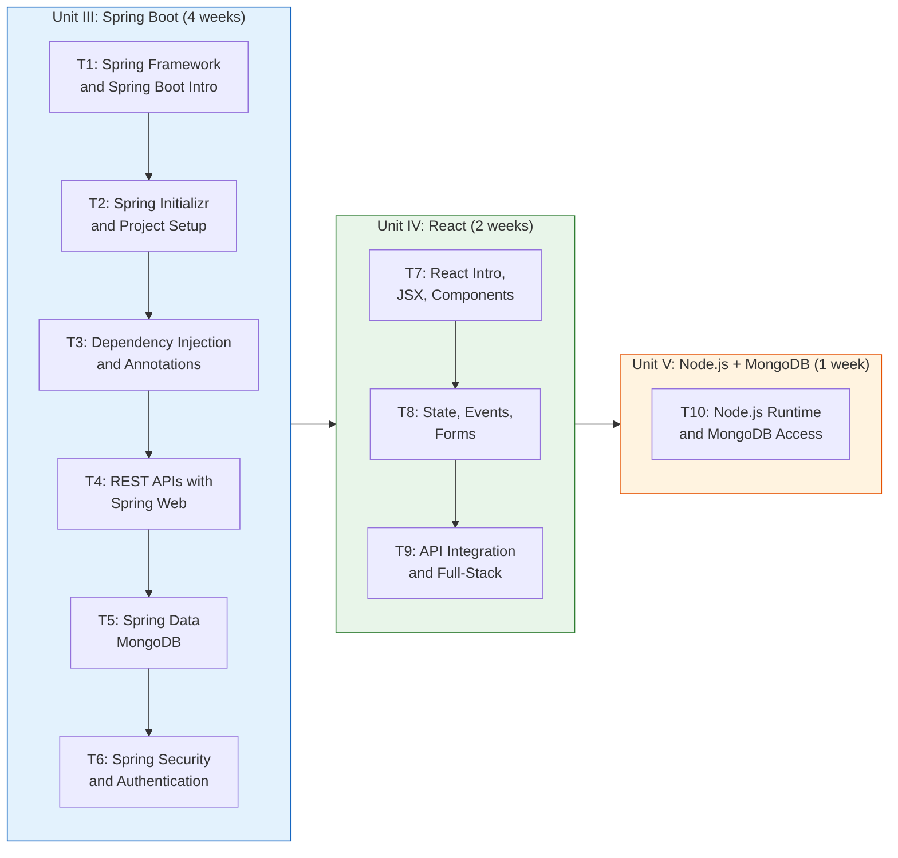
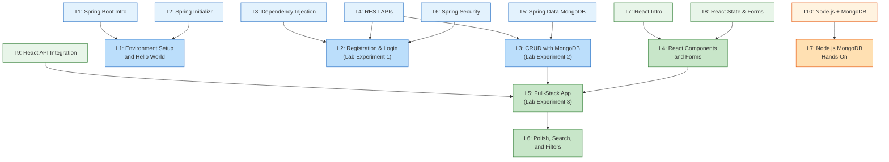
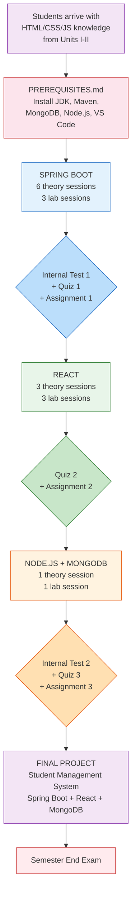

# Full Stack Development - Teaching Plan

> **Vasavi College of Engineering (Autonomous), Hyderabad**
> Department of Information Technology | B.E. IV Semester
> Theory: U24PC440IT (3 hrs/week) | Lab: U24PC431IT (2 hrs/week)

This document covers **Units III, IV, and V** only (Spring Boot, React, Node.js + MongoDB). Units I-II (HTML/CSS/JS/XML) and Bootstrap are handled separately.

---

## Table of Contents

- [1. Session-by-Session Breakdown](#1-session-by-session-breakdown)
  - [Theory Sessions](#theory-sessions)
  - [Lab Sessions](#lab-sessions)
- [2. Teaching Flow](#2-teaching-flow)
- [3. Lab Session Mapping](#3-lab-session-mapping)
- [4. Assessment Timeline](#4-assessment-timeline)
- [5. Tips for the Instructor](#5-tips-for-the-instructor)

---

## 1. Session-by-Session Breakdown

### Theory Sessions

#### Session T1: Introduction to Spring Framework and Spring Boot

| Item | Details |
|------|---------|
| **Duration** | 50 min |
| **Topics** | Spring Framework history, IoC and DI concepts, what Spring Boot solves, Spring vs Spring Boot comparison, auto-configuration, embedded server, starter dependencies |
| **Docs/Slides** | `docs/springboot/01-introduction.md`, `presentations/01-springboot.md` |
| **Snippets to Demo** | Show the `@SpringBootApplication` main class from `demo/src/main/java/com/example/demo/DemoApplication.java`; walk through `demo/pom.xml` starter dependencies |
| **Time Split** | Spring Framework background (15 min) -- Spring Boot intro and comparison (20 min) -- Live walkthrough of starter project structure (15 min) |

- [ ] Session completed
- [ ] Students understood IoC/DI distinction
- [ ] Showed start.spring.io live

---

#### Session T2: Spring Initializr and Project Setup

| Item | Details |
|------|---------|
| **Duration** | 50 min |
| **Topics** | Using start.spring.io, Maven project structure, pom.xml anatomy, application.properties, running a Spring Boot app for the first time |
| **Docs/Slides** | `docs/springboot/02-spring-initializr.md`, `presentations/01-springboot.md` |
| **Snippets to Demo** | Generate a fresh project on start.spring.io (live), compare with `demo/pom.xml` and `demo/src/main/resources/application.properties` |
| **Time Split** | start.spring.io walkthrough (15 min) -- Maven and pom.xml (15 min) -- application.properties and first run (20 min) |

- [ ] Session completed
- [ ] Students generated their own project on start.spring.io
- [ ] Verified everyone can run `mvn spring-boot:run`

---

#### Session T3: Dependency Injection and Spring Annotations

| Item | Details |
|------|---------|
| **Duration** | 50 min |
| **Topics** | @Component, @Service, @Repository, @Controller, @Autowired, constructor injection vs field injection, bean lifecycle |
| **Docs/Slides** | `docs/springboot/03-dependency-injection.md`, `presentations/01-springboot.md` |
| **Snippets to Demo** | `demo/src/main/java/com/example/demo/service/ContactService.java` (service layer), `demo/src/main/java/com/example/demo/repository/ContactRepository.java` (repository layer) |
| **Time Split** | DI theory with diagrams (20 min) -- Annotation walkthrough with code (15 min) -- Live coding: create a simple service and inject it (15 min) |

- [ ] Session completed
- [ ] Students can explain constructor injection
- [ ] Demonstrated @Autowired in a live example

---

#### Session T4: Building Web Applications - REST APIs

| Item | Details |
|------|---------|
| **Duration** | 50 min |
| **Topics** | @RestController, @RequestMapping, @GetMapping, @PostMapping, @PutMapping, @DeleteMapping, request/response JSON, @RequestBody, @PathVariable, HTTP status codes |
| **Docs/Slides** | `docs/springboot/04-web-application.md`, `presentations/01-springboot.md` |
| **Snippets to Demo** | `demo/src/main/java/com/example/demo/controller/ContactController.java`, `lab/springboot-rest-contacts/src/main/java/com/lab/contacts/controller/ContactController.java` |
| **Time Split** | REST concepts and HTTP methods (15 min) -- Controller annotations deep dive (15 min) -- Live coding: build a Student endpoint from scratch (20 min) |

- [ ] Session completed
- [ ] Tested endpoints with Postman or browser
- [ ] Students understand GET vs POST vs PUT vs DELETE

---

#### Session T5: Database Connectivity - Spring Data MongoDB

| Item | Details |
|------|---------|
| **Duration** | 50 min |
| **Topics** | MongoDB setup verification, spring-boot-starter-data-mongodb, @Document, @Id, MongoRepository interface, CRUD methods (save, findAll, findById, deleteById), custom query methods |
| **Docs/Slides** | `docs/springboot/05-database-connectivity.md`, `presentations/01-springboot.md` |
| **Snippets to Demo** | `demo/src/main/java/com/example/demo/model/Contact.java` (model), `demo/src/main/java/com/example/demo/repository/ContactRepository.java` (repository), `demo/src/main/resources/application.properties` (MongoDB URI) |
| **Time Split** | MongoDB recap and Spring Data intro (15 min) -- Model and repository walkthrough (15 min) -- Live coding: full CRUD flow with Postman testing (20 min) |

- [ ] Session completed
- [ ] Students verified MongoDB is running locally
- [ ] Demonstrated data appearing in MongoDB Compass

---

#### Session T6: Spring Security Basics and Authentication

| Item | Details |
|------|---------|
| **Duration** | 50 min |
| **Topics** | spring-boot-starter-security, SecurityConfig, password encoding with BCrypt, form-based login, UserDetailsService, securing endpoints |
| **Docs/Slides** | `docs/springboot/qa.md` (security Q&A section), `presentations/01-springboot.md` |
| **Snippets to Demo** | `lab/springboot-login-register/src/main/java/com/lab/auth/config/SecurityConfig.java`, `lab/springboot-login-register/src/main/java/com/lab/auth/service/CustomUserDetailsService.java`, `lab/springboot-login-register/src/main/java/com/lab/auth/model/User.java` |
| **Time Split** | Why security matters (10 min) -- SecurityConfig walkthrough (15 min) -- BCrypt and UserDetailsService (10 min) -- Live demo: login/register flow (15 min) |

- [ ] Session completed
- [ ] Students understand password hashing vs plain text
- [ ] Showed the full login-register lab project running

---

#### Session T7: Introduction to React

| Item | Details |
|------|---------|
| **Duration** | 50 min |
| **Topics** | What is React and why SPA, Vite project setup, JSX syntax, components (functional), props, folder structure, running a React app |
| **Docs/Slides** | `docs/react/01-introduction.md`, `presentations/02-react.md` |
| **Snippets to Demo** | `my-app/src/main.jsx`, `my-app/src/App.jsx`, `my-app/vite.config.js`, `my-app/package.json` |
| **Time Split** | React concepts and SPA vs MPA (15 min) -- Vite setup and project structure (10 min) -- JSX and components (15 min) -- Live coding: create a simple component with props (10 min) |

- [ ] Session completed
- [ ] Students created a Vite React app on their machines
- [ ] Everyone understands JSX is not HTML

---

#### Session T8: React State, Events, and Forms

| Item | Details |
|------|---------|
| **Duration** | 50 min |
| **Topics** | useState hook, event handling (onClick, onChange, onSubmit), controlled components, form handling, conditional rendering, lifting state up |
| **Docs/Slides** | `docs/react/qa.md`, `presentations/02-react.md` |
| **Snippets to Demo** | `my-app/src/components/Login.jsx`, `my-app/src/components/Register.jsx`, `lab/react-contacts-client/src/components/Contacts.jsx` |
| **Time Split** | useState and event handlers (15 min) -- Forms and controlled components (15 min) -- Live coding: build a student form with validation (20 min) |

- [ ] Session completed
- [ ] Students built a form with useState
- [ ] Demonstrated form submission and state updates

---

#### Session T9: React API Integration and Full-Stack Connection

| Item | Details |
|------|---------|
| **Duration** | 50 min |
| **Topics** | useEffect hook, fetch/axios for API calls, connecting React frontend to Spring Boot backend, CORS configuration, environment variables, proxy setup in Vite |
| **Docs/Slides** | `docs/react/qa.md`, `presentations/02-react.md` |
| **Snippets to Demo** | `lab/react-contacts-client/src/components/Contacts.jsx` (API calls), `lab/react-auth-client/src/services/authService.js` (service layer), `lab/react-auth-client/vite.config.js` (proxy), `spring-contacts-app/src/main/frontend/src/App.js` |
| **Time Split** | useEffect and data fetching (15 min) -- CORS and proxy config (10 min) -- Live coding: connect React to Spring Boot API (25 min) |

- [ ] Session completed
- [ ] Students saw data flowing from MongoDB through Spring Boot to React
- [ ] CORS issues explained and resolved live

---

#### Session T10: Node.js and MongoDB

| Item | Details |
|------|---------|
| **Duration** | 50 min |
| **Topics** | Node.js runtime overview, event loop, callbacks, npm basics, Express.js quick intro, MongoDB driver for Node.js, CRUD from Node.js, comparison with Spring Boot approach |
| **Docs/Slides** | `docs/nodejs-mongodb/qa.md`, `presentations/03-nodejs-mongodb.md` |
| **Snippets to Demo** | `snippets/nodejs-mongodb/` (code examples) |
| **Time Split** | Node.js event loop and callbacks (15 min) -- npm and Express basics (10 min) -- MongoDB with Node.js driver (15 min) -- Live coding: simple CRUD script (10 min) |

- [ ] Session completed
- [ ] Students ran a Node.js script that reads from MongoDB
- [ ] Compared Spring Data MongoDB vs Node.js MongoDB driver

---

### Lab Sessions

#### Lab L1: Environment Setup and Spring Boot Hello World

| Item | Details |
|------|---------|
| **Duration** | 2 hours |
| **Prerequisite Theory** | T1, T2 |
| **Objective** | Verify all software is installed; create first Spring Boot project from Spring Initializr; run it and access localhost:8080 |
| **Materials** | `PREREQUISITES.md`, `docs/springboot/01-introduction.md` |
| **Tasks** | (1) Verify JDK 1.8, Maven, MongoDB installations (30 min) -- (2) Generate project on start.spring.io with Web + MongoDB starters (20 min) -- (3) Create a simple /hello endpoint (30 min) -- (4) Test with browser and Postman (20 min) -- Buffer (20 min) |

- [ ] Lab completed
- [ ] All students have working dev environment
- [ ] Everyone accessed localhost:8080/hello

---

#### Lab L2: Spring Boot Registration and Login (Lab Experiment 1)

| Item | Details |
|------|---------|
| **Duration** | 2 hours |
| **Prerequisite Theory** | T3, T4, T6 |
| **Objective** | Build a registration and login system using Spring Boot, Spring Security, Thymeleaf, and MongoDB |
| **Materials** | `lab/springboot-login-register/instructions.md`, `lab/springboot-login-register/` (starter code), `labs/springboot-login-register/starter/` |
| **Tasks** | (1) Review project structure and SecurityConfig (20 min) -- (2) Implement User model and UserRepository (20 min) -- (3) Build AuthController with register/login endpoints (30 min) -- (4) Wire up Thymeleaf templates (20 min) -- (5) Test registration and login flow (20 min) -- Buffer (10 min) |

- [ ] Lab completed
- [ ] Students can register a new user
- [ ] Students can log in and see the home page
- [ ] Passwords are stored as BCrypt hashes in MongoDB

---

#### Lab L3: Spring Boot CRUD with MongoDB (Lab Experiment 2)

| Item | Details |
|------|---------|
| **Duration** | 2 hours |
| **Prerequisite Theory** | T4, T5 |
| **Objective** | Build a full CRUD REST API for a Student Management System with MongoDB |
| **Materials** | `lab/springboot-contacts-crud/instructions.md`, `lab/springboot-contacts-crud/` (starter code), `labs/springboot-crud-mongodb/starter/` |
| **Tasks** | (1) Create Student model with fields: name, rollNumber, department, email (20 min) -- (2) Create StudentRepository extending MongoRepository (15 min) -- (3) Build StudentService with CRUD methods (25 min) -- (4) Create StudentController with REST endpoints (25 min) -- (5) Test all CRUD operations with Postman (25 min) -- Buffer (10 min) |

- [ ] Lab completed
- [ ] All four CRUD operations work via Postman
- [ ] Data persists in MongoDB (verified via Compass)
- [ ] Search by department or rollNumber works

---

#### Lab L4: React Basics and Component Building

| Item | Details |
|------|---------|
| **Duration** | 2 hours |
| **Prerequisite Theory** | T7, T8 |
| **Objective** | Create a React frontend with components, state management, and forms for the Student Management System |
| **Materials** | `my-app/` (starter Vite app), `lab/react-contacts-client/instructions.md`, `lab/react-contacts-client/src/components/` |
| **Tasks** | (1) Create a new Vite React project (15 min) -- (2) Build StudentList component with a table (25 min) -- (3) Build StudentForm component with controlled inputs (25 min) -- (4) Add useState for managing student data locally (20 min) -- (5) Add search/filter functionality (25 min) -- Buffer (10 min) |

- [ ] Lab completed
- [ ] StudentList renders a table of students
- [ ] StudentForm captures and validates input
- [ ] Local state management works correctly

---

#### Lab L5: Full-Stack App - Spring Boot + React + MongoDB (Lab Experiment 3)

| Item | Details |
|------|---------|
| **Duration** | 2 hours |
| **Prerequisite Theory** | T9 |
| **Objective** | Connect the React frontend (Lab L4) to the Spring Boot backend (Lab L3) to create a full-stack Student Management System |
| **Materials** | `lab/react-contacts-client/instructions.md`, `lab/react-auth-client/src/services/authService.js` (API service pattern), `spring-contacts-app/` (reference full-stack app), `labs/fullstack-student-app/starter/` |
| **Tasks** | (1) Configure CORS on Spring Boot backend (15 min) -- (2) Create API service module in React (axios/fetch) (20 min) -- (3) Connect StudentList to GET /api/students (20 min) -- (4) Connect StudentForm to POST /api/students (20 min) -- (5) Implement update and delete flows (25 min) -- (6) End-to-end testing (15 min) -- Buffer (5 min) |

- [ ] Lab completed
- [ ] React app fetches and displays students from Spring Boot API
- [ ] Create, update, delete operations work end-to-end
- [ ] Data persists across page refreshes (MongoDB)

---

#### Lab L6: Full-Stack Polish and Additional Features

| Item | Details |
|------|---------|
| **Duration** | 2 hours |
| **Prerequisite Theory** | T9 |
| **Objective** | Add search, filters, error handling, and validation to the full-stack Student Management System |
| **Materials** | `lab/react-contacts-client/src/components/Contacts.jsx` (search reference), `spring-contacts-app/` (reference), `labs/fullstack-student-app/solution/` |
| **Tasks** | (1) Add search by name/rollNumber on backend (20 min) -- (2) Add department filter dropdown on frontend (20 min) -- (3) Add form validation (email format, required fields) (20 min) -- (4) Add error handling and loading states (20 min) -- (5) Style the application (20 min) -- (6) Final testing and demo (20 min) |

- [ ] Lab completed
- [ ] Search and filter features work
- [ ] Validation prevents bad data entry
- [ ] Error states display correctly

---

#### Lab L7: Node.js and MongoDB Hands-On

| Item | Details |
|------|---------|
| **Duration** | 2 hours |
| **Prerequisite Theory** | T10 |
| **Objective** | Write Node.js scripts to perform MongoDB CRUD operations; optionally build a minimal Express API |
| **Materials** | `snippets/nodejs-mongodb/`, `docs/nodejs-mongodb/qa.md` |
| **Tasks** | (1) Initialize a Node.js project with npm init (15 min) -- (2) Install and use the mongodb driver (15 min) -- (3) Write insert, find, update, delete scripts (30 min) -- (4) Build a minimal Express REST endpoint (30 min) -- (5) Compare with Spring Boot approach (15 min) -- Buffer (15 min) |

- [ ] Lab completed
- [ ] Students executed CRUD operations from Node.js
- [ ] Students can articulate differences between Spring Data and Node.js driver

---

## 2. Teaching Flow

The teaching sequence is designed around three principles:
1. **Spring Boot first** -- it is the largest and most unfamiliar topic; students need time to absorb Java ecosystem concepts.
2. **React second** -- students already know JavaScript basics from Unit II, so the learning curve is gentler.
3. **Node.js + MongoDB last** -- Node.js is a quick conceptual introduction, and by this point students have already used MongoDB from the Spring Boot side.



### Pacing Guidelines

| Unit | Theory Sessions | Lab Sessions | Calendar Weeks |
|------|----------------|-------------|----------------|
| III - Spring Boot | T1 through T6 (6 sessions) | L1, L2, L3 (3 labs) | Weeks 1-4 |
| IV - React | T7 through T9 (3 sessions) | L4, L5, L6 (3 labs) | Weeks 5-6 |
| V - Node.js + MongoDB | T10 (1 session) | L7 (1 lab) | Week 7 |
| **Buffer / Revision** | -- | -- | Week 8 |

---

## 3. Lab Session Mapping

Each lab session depends on specific theory sessions being completed first. The diagram below shows these dependencies.



### Dependency Summary Table

| Lab Session | Required Theory Sessions | Must Complete Labs |
|-------------|------------------------|--------------------|
| L1: Environment Setup | T1, T2 | -- |
| L2: Registration & Login | T3, T4, T6 | -- |
| L3: CRUD with MongoDB | T4, T5 | -- |
| L4: React Components | T7, T8 | -- |
| L5: Full-Stack App | T9 | L3, L4 |
| L6: Polish & Filters | T9 | L5 |
| L7: Node.js + MongoDB | T10 | -- |

---

## 4. Assessment Timeline

### Assessment Components

| Component | Count | Marks Each | Total Marks | Weight |
|-----------|-------|-----------|-------------|--------|
| Internal Tests | 2 | 30 | 60 | Scaled to CIE theory marks |
| Assignments | 3 | 5 | 15 | Part of CIE |
| Quizzes | 3 | 5 | 15 | Part of CIE |

### Suggested Schedule

```
Week 1  [T1, T2, L1] ..........................................
Week 2  [T3, T4, L2] .............. Quiz 1 (end of week) .....
Week 3  [T5, T6, L3] .............. Assignment 1 (due) .......
Week 4  [Revision] ................ INTERNAL TEST 1 ..........
Week 5  [T7, T8, L4] .............. Quiz 2 (end of week) .....
Week 6  [T9, L5, L6] .............. Assignment 2 (due) .......
Week 7  [T10, L7] ................. Quiz 3 (end of week) .....
Week 7  [continued] ............... Assignment 3 (due) .......
Week 8  [Revision] ................ INTERNAL TEST 2 ..........
```

### Assessment Details

#### Quiz 1 (Week 2 end) -- Spring Boot Fundamentals
- [ ] Conducted
- **Coverage:** T1 through T4 (Spring Boot intro, Initializr, DI, REST APIs)
- **Format:** 10 MCQs + 2 short answer (5 marks, 15 minutes)
- **Sample topics:** Identify the correct annotation, explain IoC, match HTTP methods to annotations

#### Quiz 2 (Week 5 end) -- Spring Boot Advanced and React Basics
- [ ] Conducted
- **Coverage:** T5 through T8 (MongoDB connectivity, Security, React intro, state/forms)
- **Format:** 10 MCQs + 2 short answer (5 marks, 15 minutes)
- **Sample topics:** MongoRepository methods, @Document annotation, JSX vs HTML, useState syntax

#### Quiz 3 (Week 7 end) -- React Integration and Node.js
- [ ] Conducted
- **Coverage:** T9 through T10 (API integration, Node.js, MongoDB from Node.js)
- **Format:** 10 MCQs + 2 short answer (5 marks, 15 minutes)
- **Sample topics:** useEffect dependency array, CORS, event loop, MongoDB driver methods

#### Assignment 1 (Due Week 3) -- Spring Boot REST API
- [ ] Assigned
- [ ] Collected
- **Task:** Build a REST API for a Library Book Management system (title, author, ISBN, genre) with all CRUD operations and MongoDB persistence. Submit source code and Postman screenshots.
- **Evaluation:** Correct endpoints (2), MongoDB integration (1.5), code quality (1), documentation (0.5)

#### Assignment 2 (Due Week 6) -- React Frontend
- [ ] Assigned
- [ ] Collected
- **Task:** Build a React frontend for the Library Book system from Assignment 1. Must include a book list, add/edit form, and search by title or author.
- **Evaluation:** Component structure (1.5), state management (1.5), API integration (1), UI quality (1)

#### Assignment 3 (Due Week 7) -- Node.js MongoDB Script
- [ ] Assigned
- [ ] Collected
- **Task:** Write a Node.js script that connects to MongoDB, inserts 10 sample student records, queries by department, updates an email, and deletes a record. Print results to console.
- **Evaluation:** Correct CRUD operations (2), error handling (1), code clarity (1), output formatting (1)

#### Internal Test 1 (Week 4) -- Spring Boot (Unit III)
- [ ] Conducted
- **Duration:** 90 minutes
- **Marks:** 30
- **Coverage:** T1 through T6 (all Spring Boot sessions)
- **Format:** 2 long answer (10 marks each) + 5 short answer (2 marks each)
- **Topics:** Spring Boot architecture, DI with code, REST API design, MongoDB CRUD, Security configuration

#### Internal Test 2 (Week 8) -- React and Node.js (Units IV and V)
- [ ] Conducted
- **Duration:** 90 minutes
- **Marks:** 30
- **Coverage:** T7 through T10 (React and Node.js + MongoDB)
- **Format:** 2 long answer (10 marks each) + 5 short answer (2 marks each)
- **Topics:** React component lifecycle, state management, full-stack integration, Node.js event loop, MongoDB operations from Node.js

---

## 5. Tips for the Instructor

### How to Start Each Session

1. **Open with a question.** Begin every session with a real-world question or a quick recap question from the previous session. Examples:
   - T1: "How many of you have heard of Spring? What do you think it does?"
   - T4: "If I type google.com in my browser, what happens behind the scenes?"
   - T7: "Why do modern web apps feel faster than traditional websites?"
   - T10: "We used Java to talk to MongoDB. Can JavaScript do the same?"

2. **Show the end result first.** Before diving into code, spend 2 minutes showing the working application that students will build by the end of that session or lab. This gives them a mental target.

3. **Recap in 3 bullets.** At the start of each session, put 3 bullet points on screen summarizing the previous session. Ask one student to explain one of them.

### When to Do Live Coding vs Slides

| Use Slides For | Use Live Coding For |
|---------------|---------------------|
| Architecture diagrams | Creating a project from scratch |
| Comparison tables (Spring vs Spring Boot) | Writing controller endpoints |
| Concept introductions (IoC, DI, event loop) | Debugging errors in real time |
| Annotation reference tables | Connecting frontend to backend |
| Security flow diagrams | Testing with Postman |

**Rule of thumb:** Use slides for the first 15 minutes (concepts), then switch to live coding for the remaining time. Students learn more from watching you make mistakes and fix them than from perfect slides.

### How to Handle Common Student Questions

| Question | Suggested Response |
|----------|-------------------|
| "Why Java 8 and not Java 17?" | "Industry still uses Java 8 heavily. The Spring Boot concepts are identical across versions. Once you understand these, upgrading is trivial." |
| "Is Spring Boot only for Java?" | "Yes, but the patterns (MVC, DI, REST) exist in every language. Learn the pattern, not just the syntax." |
| "Why MongoDB and not MySQL?" | "MongoDB is simpler to start with (no schema, no SQL), and it teaches you document-based thinking. You will learn SQL databases in your DBMS course." |
| "Why not use Next.js or Angular?" | "React is the most widely adopted library. The concepts (components, state, props) transfer to any framework." |
| "Can I use VS Code instead of IntelliJ?" | "Yes. All lab instructions are IDE-agnostic. Use whatever you are comfortable with." |
| "Why is my Spring Boot app not starting?" | "Check three things: (1) Is port 8080 already in use? (2) Is MongoDB running? (3) Are there compile errors in terminal?" |
| "CORS error -- what is this?" | "The browser blocks requests between different ports for security. We will fix it with a Spring Boot config annotation. This is normal." |

### Overall Course Navigation Path



### Additional Advice

- **Pair struggling students with confident ones** during lab sessions. This benefits both -- the strong student solidifies understanding by explaining, and the struggling student gets peer-level help.
- **Keep Postman open throughout Spring Boot sessions.** Every time you write an endpoint, test it immediately. Students need to see the feedback loop.
- **Use MongoDB Compass visually.** When inserting data via API, switch to Compass and show the document appearing in real time. This makes the database feel real.
- **Do not skip error scenarios.** Intentionally send a bad request (missing field, wrong type) and show the error response. Students remember errors better than successes.
- **End every session with "one thing to try."** Give students a small 5-minute challenge to attempt before the next class. Examples: "Add a /students/count endpoint", "Create a component that shows the current time", "Write a Node.js script that prints all collection names."

---

*Last updated: 2026-04-07*
