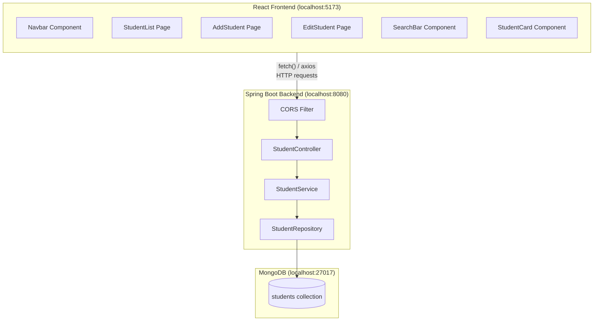
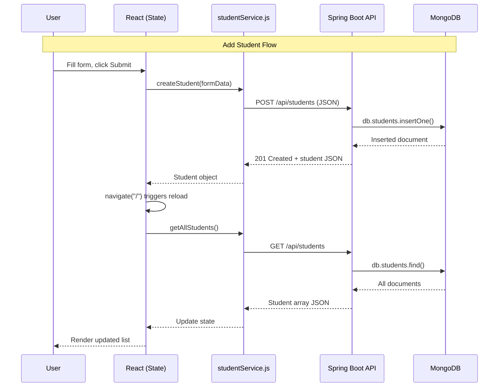
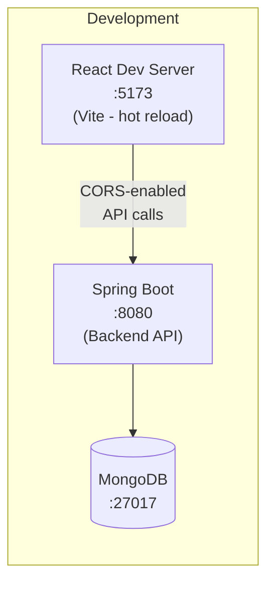
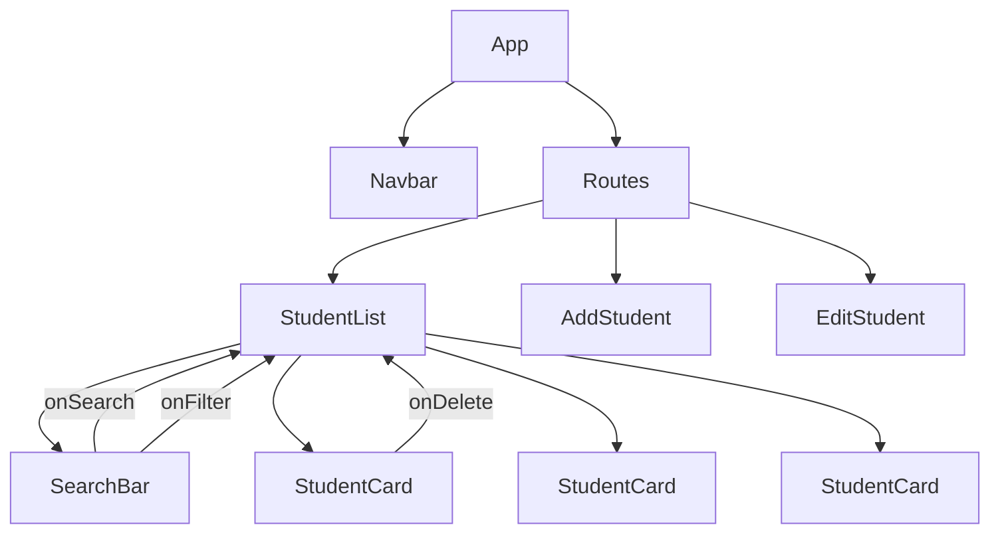

# Lab Experiment 3: Full-Stack Student Management App

> **Objective:** Develop a web application using Spring Boot (backend), React (frontend), and MongoDB (database)

[Back to Lab Overview](../lab-overview.md) | [Prerequisites](../../PREREQUISITES.md)

---

## What You'll Build

A complete **Student Management System** with:
- **Backend:** Spring Boot REST API (builds on Lab 2)
- **Frontend:** React SPA with components for all CRUD operations
- **Database:** MongoDB storing student records
- Search students by name
- Filter students by department
- Responsive UI



---

## Before You Start

- [ ] JDK 1.8, Maven, Node.js 20, MongoDB 7.0 all installed
- [ ] Completed Lab 2 (or understand Spring Boot REST APIs)
- [ ] Read React theory docs (Components, Props, State, Events, Forms)
- [ ] Postman/Thunder Client installed

---

## Part A: Backend (Spring Boot REST API)

The backend is the same as Lab 2 with two additions:
1. **CORS configuration** (so React can call the API)
2. **A data initializer** (to pre-load sample data)

### Step 1: Create the Project

Use the same Spring Initializr settings as Lab 2, or copy the Lab 2 solution.

**Dependencies:** Spring Web, Spring Data MongoDB, Spring Boot DevTools

### Step 2: Add CORS Configuration

This is **critical** — without it, the React frontend (running on port 5173) cannot call the backend (running on port 8080).

Create `src/main/java/com/lab/student/config/CorsConfig.java`:

```java
package com.lab.student.config;

import org.springframework.context.annotation.Bean;
import org.springframework.context.annotation.Configuration;
import org.springframework.web.servlet.config.annotation.CorsRegistry;
import org.springframework.web.servlet.config.annotation.WebMvcConfigurer;

@Configuration
public class CorsConfig {

    @Bean
    public WebMvcConfigurer corsConfigurer() {
        return new WebMvcConfigurer() {
            @Override
            public void addCorsMappings(CorsRegistry registry) {
                registry.addMapping("/api/**")
                        .allowedOrigins("http://localhost:5173")
                        .allowedMethods("GET", "POST", "PUT", "DELETE")
                        .allowedHeaders("*");
            }
        };
    }
}
```

### Step 3: Add Data Initializer (Optional)

Create `src/main/java/com/lab/student/config/DataInitializer.java`:

```java
package com.lab.student.config;

import com.lab.student.model.Student;
import com.lab.student.repository.StudentRepository;
import org.springframework.beans.factory.annotation.Autowired;
import org.springframework.boot.CommandLineRunner;
import org.springframework.stereotype.Component;

import java.util.Arrays;

@Component
public class DataInitializer implements CommandLineRunner {

    @Autowired
    private StudentRepository studentRepository;

    @Override
    public void run(String... args) {
        // Only insert if collection is empty
        if (studentRepository.count() == 0) {
            studentRepository.saveAll(Arrays.asList(
                new Student("Ravi Kumar", "21B01A1201", "IT", "ravi@example.com"),
                new Student("Priya Sharma", "21B01A1202", "CSE", "priya@example.com"),
                new Student("Amit Reddy", "21B01A1203", "IT", "amit@example.com"),
                new Student("Sneha Patel", "21B01A1204", "ECE", "sneha@example.com"),
                new Student("Karthik Rao", "21B01A1205", "CSE", "karthik@example.com")
            ));
            System.out.println("Sample data loaded into MongoDB");
        }
    }
}
```

### Step 4: Run the Backend

```bash
cd backend
mvn spring-boot:run
```

Verify: `http://localhost:8080/api/students` should return the student list as JSON.

---

## Part B: Frontend (React)

### Step 5: Create the React App

Open a **new terminal** (keep the backend running):

```bash
npm create vite@latest frontend -- --template react
cd frontend
npm install
```

Install additional dependency for API calls and routing:

```bash
npm install react-router-dom
```

### Step 6: Project Structure

After setup, organize your `src/` folder like this:

```
frontend/src/
├── components/
│   ├── Navbar.jsx
│   ├── StudentCard.jsx
│   └── SearchBar.jsx
├── pages/
│   ├── StudentList.jsx
│   ├── AddStudent.jsx
│   └── EditStudent.jsx
├── services/
│   └── studentService.js
├── App.jsx
├── App.css
└── main.jsx
```

### Step 7: Create the API Service

`src/services/studentService.js`:

```javascript
const API_URL = "http://localhost:8080/api/students";

// GET all students
export async function getAllStudents() {
  const response = await fetch(API_URL);
  return response.json();
}

// GET student by ID
export async function getStudentById(id) {
  const response = await fetch(`${API_URL}/${id}`);
  return response.json();
}

// POST create student
export async function createStudent(student) {
  const response = await fetch(API_URL, {
    method: "POST",
    headers: { "Content-Type": "application/json" },
    body: JSON.stringify(student),
  });
  return response.json();
}

// PUT update student
export async function updateStudent(id, student) {
  const response = await fetch(`${API_URL}/${id}`, {
    method: "PUT",
    headers: { "Content-Type": "application/json" },
    body: JSON.stringify(student),
  });
  return response.json();
}

// DELETE student
export async function deleteStudent(id) {
  await fetch(`${API_URL}/${id}`, { method: "DELETE" });
}

// SEARCH students by name
export async function searchStudents(name) {
  const response = await fetch(`${API_URL}/search?name=${name}`);
  return response.json();
}

// GET students by department
export async function getByDepartment(department) {
  const response = await fetch(`${API_URL}/department/${department}`);
  return response.json();
}
```

### Step 8: Create Components

**`src/components/Navbar.jsx`**:

```jsx
import { Link } from "react-router-dom";

function Navbar() {
  return (
    <nav className="navbar">
      <h1>Student Management System</h1>
      <div className="nav-links">
        <Link to="/">All Students</Link>
        <Link to="/add">Add Student</Link>
      </div>
    </nav>
  );
}

export default Navbar;
```

**`src/components/SearchBar.jsx`**:

```jsx
import { useState } from "react";

function SearchBar({ onSearch, onFilter, onClear }) {
  const [searchTerm, setSearchTerm] = useState("");
  const [department, setDepartment] = useState("");

  const handleSearch = () => {
    if (searchTerm.trim()) {
      onSearch(searchTerm);
    }
  };

  const handleFilter = (e) => {
    const dept = e.target.value;
    setDepartment(dept);
    if (dept) {
      onFilter(dept);
    } else {
      onClear();
    }
  };

  const handleClear = () => {
    setSearchTerm("");
    setDepartment("");
    onClear();
  };

  return (
    <div className="search-bar">
      <div className="search-group">
        <input
          type="text"
          placeholder="Search by name..."
          value={searchTerm}
          onChange={(e) => setSearchTerm(e.target.value)}
          onKeyDown={(e) => e.key === "Enter" && handleSearch()}
        />
        <button onClick={handleSearch}>Search</button>
      </div>
      <div className="filter-group">
        <select value={department} onChange={handleFilter}>
          <option value="">All Departments</option>
          <option value="IT">IT</option>
          <option value="CSE">CSE</option>
          <option value="ECE">ECE</option>
          <option value="EEE">EEE</option>
          <option value="MECH">MECH</option>
          <option value="CIVIL">CIVIL</option>
        </select>
        <button onClick={handleClear} className="btn-clear">Clear</button>
      </div>
    </div>
  );
}

export default SearchBar;
```

**`src/components/StudentCard.jsx`**:

```jsx
import { useNavigate } from "react-router-dom";

function StudentCard({ student, onDelete }) {
  const navigate = useNavigate();

  return (
    <div className="student-card">
      <div className="card-body">
        <h3>{student.name}</h3>
        <p><strong>Roll No:</strong> {student.rollNumber}</p>
        <p><strong>Department:</strong> {student.department}</p>
        <p><strong>Email:</strong> {student.email}</p>
      </div>
      <div className="card-actions">
        <button
          className="btn-edit"
          onClick={() => navigate(`/edit/${student.id}`)}
        >
          Edit
        </button>
        <button
          className="btn-delete"
          onClick={() => onDelete(student.id)}
        >
          Delete
        </button>
      </div>
    </div>
  );
}

export default StudentCard;
```

### Step 9: Create Pages

**`src/pages/StudentList.jsx`**:

```jsx
import { useState, useEffect } from "react";
import StudentCard from "../components/StudentCard";
import SearchBar from "../components/SearchBar";
import {
  getAllStudents,
  deleteStudent,
  searchStudents,
  getByDepartment,
} from "../services/studentService";

function StudentList() {
  const [students, setStudents] = useState([]);
  const [loading, setLoading] = useState(true);

  const loadStudents = async () => {
    setLoading(true);
    const data = await getAllStudents();
    setStudents(data);
    setLoading(false);
  };

  useEffect(() => {
    loadStudents();
  }, []);

  const handleDelete = async (id) => {
    if (window.confirm("Are you sure you want to delete this student?")) {
      await deleteStudent(id);
      loadStudents();
    }
  };

  const handleSearch = async (name) => {
    setLoading(true);
    const data = await searchStudents(name);
    setStudents(data);
    setLoading(false);
  };

  const handleFilter = async (department) => {
    setLoading(true);
    const data = await getByDepartment(department);
    setStudents(data);
    setLoading(false);
  };

  if (loading) return <p className="loading">Loading students...</p>;

  return (
    <div className="student-list">
      <h2>All Students</h2>
      <SearchBar
        onSearch={handleSearch}
        onFilter={handleFilter}
        onClear={loadStudents}
      />
      {students.length === 0 ? (
        <p className="no-data">No students found.</p>
      ) : (
        <div className="cards-grid">
          {students.map((student) => (
            <StudentCard
              key={student.id}
              student={student}
              onDelete={handleDelete}
            />
          ))}
        </div>
      )}
    </div>
  );
}

export default StudentList;
```

**`src/pages/AddStudent.jsx`**:

```jsx
import { useState } from "react";
import { useNavigate } from "react-router-dom";
import { createStudent } from "../services/studentService";

function AddStudent() {
  const navigate = useNavigate();
  const [formData, setFormData] = useState({
    name: "",
    rollNumber: "",
    department: "",
    email: "",
  });
  const [error, setError] = useState("");

  const handleChange = (e) => {
    setFormData({ ...formData, [e.target.name]: e.target.value });
  };

  const handleSubmit = async (e) => {
    e.preventDefault();
    setError("");

    // Basic validation
    if (!formData.name || !formData.rollNumber || !formData.department || !formData.email) {
      setError("All fields are required");
      return;
    }

    try {
      await createStudent(formData);
      navigate("/");
    } catch (err) {
      setError("Failed to add student. Roll number may already exist.");
    }
  };

  return (
    <div className="form-container">
      <h2>Add New Student</h2>
      {error && <p className="error-message">{error}</p>}
      <form onSubmit={handleSubmit}>
        <div className="form-group">
          <label htmlFor="name">Name:</label>
          <input
            type="text"
            id="name"
            name="name"
            value={formData.name}
            onChange={handleChange}
            required
          />
        </div>
        <div className="form-group">
          <label htmlFor="rollNumber">Roll Number:</label>
          <input
            type="text"
            id="rollNumber"
            name="rollNumber"
            value={formData.rollNumber}
            onChange={handleChange}
            placeholder="e.g., 21B01A1201"
            required
          />
        </div>
        <div className="form-group">
          <label htmlFor="department">Department:</label>
          <select
            id="department"
            name="department"
            value={formData.department}
            onChange={handleChange}
            required
          >
            <option value="">Select Department</option>
            <option value="IT">IT</option>
            <option value="CSE">CSE</option>
            <option value="ECE">ECE</option>
            <option value="EEE">EEE</option>
            <option value="MECH">MECH</option>
            <option value="CIVIL">CIVIL</option>
          </select>
        </div>
        <div className="form-group">
          <label htmlFor="email">Email:</label>
          <input
            type="email"
            id="email"
            name="email"
            value={formData.email}
            onChange={handleChange}
            required
          />
        </div>
        <div className="form-actions">
          <button type="submit" className="btn-submit">Add Student</button>
          <button type="button" className="btn-cancel" onClick={() => navigate("/")}>
            Cancel
          </button>
        </div>
      </form>
    </div>
  );
}

export default AddStudent;
```

**`src/pages/EditStudent.jsx`**:

```jsx
import { useState, useEffect } from "react";
import { useNavigate, useParams } from "react-router-dom";
import { getStudentById, updateStudent } from "../services/studentService";

function EditStudent() {
  const { id } = useParams();
  const navigate = useNavigate();
  const [formData, setFormData] = useState({
    name: "",
    rollNumber: "",
    department: "",
    email: "",
  });
  const [loading, setLoading] = useState(true);
  const [error, setError] = useState("");

  useEffect(() => {
    async function fetchStudent() {
      try {
        const student = await getStudentById(id);
        setFormData({
          name: student.name,
          rollNumber: student.rollNumber,
          department: student.department,
          email: student.email,
        });
        setLoading(false);
      } catch (err) {
        setError("Failed to load student data");
        setLoading(false);
      }
    }
    fetchStudent();
  }, [id]);

  const handleChange = (e) => {
    setFormData({ ...formData, [e.target.name]: e.target.value });
  };

  const handleSubmit = async (e) => {
    e.preventDefault();
    setError("");
    try {
      await updateStudent(id, formData);
      navigate("/");
    } catch (err) {
      setError("Failed to update student");
    }
  };

  if (loading) return <p className="loading">Loading...</p>;

  return (
    <div className="form-container">
      <h2>Edit Student</h2>
      {error && <p className="error-message">{error}</p>}
      <form onSubmit={handleSubmit}>
        <div className="form-group">
          <label htmlFor="name">Name:</label>
          <input
            type="text" id="name" name="name"
            value={formData.name} onChange={handleChange} required
          />
        </div>
        <div className="form-group">
          <label htmlFor="rollNumber">Roll Number:</label>
          <input
            type="text" id="rollNumber" name="rollNumber"
            value={formData.rollNumber} onChange={handleChange} required
          />
        </div>
        <div className="form-group">
          <label htmlFor="department">Department:</label>
          <select
            id="department" name="department"
            value={formData.department} onChange={handleChange} required
          >
            <option value="">Select Department</option>
            <option value="IT">IT</option>
            <option value="CSE">CSE</option>
            <option value="ECE">ECE</option>
            <option value="EEE">EEE</option>
            <option value="MECH">MECH</option>
            <option value="CIVIL">CIVIL</option>
          </select>
        </div>
        <div className="form-group">
          <label htmlFor="email">Email:</label>
          <input
            type="email" id="email" name="email"
            value={formData.email} onChange={handleChange} required
          />
        </div>
        <div className="form-actions">
          <button type="submit" className="btn-submit">Update Student</button>
          <button type="button" className="btn-cancel" onClick={() => navigate("/")}>
            Cancel
          </button>
        </div>
      </form>
    </div>
  );
}

export default EditStudent;
```

### Step 10: Create App Component with Router

**`src/App.jsx`**:

```jsx
import { BrowserRouter, Routes, Route } from "react-router-dom";
import Navbar from "./components/Navbar";
import StudentList from "./pages/StudentList";
import AddStudent from "./pages/AddStudent";
import EditStudent from "./pages/EditStudent";
import "./App.css";

function App() {
  return (
    <BrowserRouter>
      <div className="app">
        <Navbar />
        <main className="main-content">
          <Routes>
            <Route path="/" element={<StudentList />} />
            <Route path="/add" element={<AddStudent />} />
            <Route path="/edit/:id" element={<EditStudent />} />
          </Routes>
        </main>
      </div>
    </BrowserRouter>
  );
}

export default App;
```

### Step 11: Add Styles

**`src/App.css`**:

```css
* {
  margin: 0;
  padding: 0;
  box-sizing: border-box;
}

body {
  font-family: 'Segoe UI', Tahoma, Geneva, Verdana, sans-serif;
  background-color: #f0f2f5;
  color: #333;
}

/* Navbar */
.navbar {
  background-color: #1a73e8;
  color: white;
  padding: 1rem 2rem;
  display: flex;
  justify-content: space-between;
  align-items: center;
  box-shadow: 0 2px 4px rgba(0,0,0,0.1);
}

.navbar h1 {
  font-size: 1.4rem;
}

.nav-links {
  display: flex;
  gap: 1.5rem;
}

.nav-links a {
  color: white;
  text-decoration: none;
  font-weight: 500;
  padding: 0.4rem 0.8rem;
  border-radius: 4px;
  transition: background 0.2s;
}

.nav-links a:hover {
  background-color: rgba(255,255,255,0.2);
}

/* Main Content */
.main-content {
  max-width: 1000px;
  margin: 2rem auto;
  padding: 0 1rem;
}

/* Search Bar */
.search-bar {
  display: flex;
  gap: 1rem;
  margin-bottom: 1.5rem;
  flex-wrap: wrap;
}

.search-group, .filter-group {
  display: flex;
  gap: 0.5rem;
}

.search-bar input, .search-bar select {
  padding: 0.5rem 0.8rem;
  border: 1px solid #ddd;
  border-radius: 4px;
  font-size: 0.95rem;
}

.search-bar input {
  width: 250px;
}

.search-bar button {
  padding: 0.5rem 1rem;
  border: none;
  border-radius: 4px;
  cursor: pointer;
  font-size: 0.9rem;
  background-color: #1a73e8;
  color: white;
}

.btn-clear {
  background-color: #6c757d !important;
}

/* Cards Grid */
.cards-grid {
  display: grid;
  grid-template-columns: repeat(auto-fill, minmax(280px, 1fr));
  gap: 1rem;
}

/* Student Card */
.student-card {
  background: white;
  border-radius: 8px;
  padding: 1.2rem;
  box-shadow: 0 1px 3px rgba(0,0,0,0.1);
  transition: box-shadow 0.2s;
}

.student-card:hover {
  box-shadow: 0 4px 12px rgba(0,0,0,0.15);
}

.student-card h3 {
  color: #1a73e8;
  margin-bottom: 0.5rem;
}

.student-card p {
  margin: 0.3rem 0;
  font-size: 0.9rem;
  color: #555;
}

.card-actions {
  display: flex;
  gap: 0.5rem;
  margin-top: 1rem;
  padding-top: 0.8rem;
  border-top: 1px solid #eee;
}

.btn-edit {
  padding: 0.4rem 1rem;
  background-color: #ffc107;
  color: #333;
  border: none;
  border-radius: 4px;
  cursor: pointer;
}

.btn-delete {
  padding: 0.4rem 1rem;
  background-color: #dc3545;
  color: white;
  border: none;
  border-radius: 4px;
  cursor: pointer;
}

/* Form */
.form-container {
  max-width: 500px;
  margin: 0 auto;
  background: white;
  padding: 2rem;
  border-radius: 8px;
  box-shadow: 0 1px 3px rgba(0,0,0,0.1);
}

.form-container h2 {
  margin-bottom: 1.5rem;
  color: #333;
}

.form-group {
  margin-bottom: 1rem;
}

.form-group label {
  display: block;
  margin-bottom: 0.3rem;
  font-weight: 500;
  color: #555;
}

.form-group input, .form-group select {
  width: 100%;
  padding: 0.6rem;
  border: 1px solid #ddd;
  border-radius: 4px;
  font-size: 1rem;
}

.form-actions {
  display: flex;
  gap: 1rem;
  margin-top: 1.5rem;
}

.btn-submit {
  padding: 0.6rem 1.5rem;
  background-color: #1a73e8;
  color: white;
  border: none;
  border-radius: 4px;
  cursor: pointer;
  font-size: 1rem;
}

.btn-cancel {
  padding: 0.6rem 1.5rem;
  background-color: #6c757d;
  color: white;
  border: none;
  border-radius: 4px;
  cursor: pointer;
  font-size: 1rem;
}

/* Utility */
.loading, .no-data {
  text-align: center;
  padding: 2rem;
  color: #666;
}

.error-message {
  background-color: #f8d7da;
  color: #721c24;
  padding: 0.7rem;
  border-radius: 4px;
  margin-bottom: 1rem;
  text-align: center;
}

h2 {
  margin-bottom: 1rem;
}
```

### Step 12: Run Both Servers

**Terminal 1 — Backend:**
```bash
cd backend
mvn spring-boot:run
# Runs on http://localhost:8080
```

**Terminal 2 — Frontend:**
```bash
cd frontend
npm run dev
# Runs on http://localhost:5173
```

Open **http://localhost:5173** in your browser.

---

## Testing the Application

### Walkthrough

1. **View all students** — Home page shows all student cards loaded from the API
2. **Add a student** — Click "Add Student" in the navbar, fill the form, submit
3. **Search** — Type a name in the search box and click Search
4. **Filter** — Select a department from the dropdown
5. **Edit** — Click "Edit" on any student card, modify fields, submit
6. **Delete** — Click "Delete" on any student card, confirm

### Data Flow for Each Operation



---

## Understanding the Architecture

### Why Two Separate Servers?



- **React Dev Server (Vite)** serves the frontend with hot module replacement for fast development
- **Spring Boot** serves the REST API
- **CORS** is configured to allow the frontend to call the backend across different ports
- In production, you'd typically build the React app and serve it from Spring Boot's `static/` folder

### Component Architecture



---

## Troubleshooting

| Problem | Solution |
|---------|----------|
| CORS error in browser console | Ensure `CorsConfig.java` allows `http://localhost:5173`. Restart the Spring Boot server after adding it. |
| `fetch failed` / Network error | Is the backend running? Check `http://localhost:8080/api/students` in a browser. |
| React page is blank | Check browser console (F12) for errors. Common cause: import path typos. |
| Form submit doesn't work | Ensure `e.preventDefault()` is called in `handleSubmit`. Check the API URL in `studentService.js`. |
| Edit page shows empty form | Check that `useParams()` is returning the correct `id`. Check `getStudentById` response. |
| Delete doesn't refresh the list | Ensure `loadStudents()` is called after `deleteStudent()` resolves. |
| MongoDB connection refused | Ensure MongoDB is running on port 27017. Check `application.properties`. |
| `npm run dev` fails | Run `npm install` first. Check Node.js version: `node -v` (should be 20.x). |
| Styles not applying | Ensure `import "./App.css"` is in `App.jsx`. |
| Backend returns 404 | Check that the controller has `@RequestMapping("/api/students")` and methods have correct annotations. |

---

## What to Submit

1. Screenshots showing:
   - Student list page with data
   - Add student form
   - Search results
   - Department filter results
   - Edit student form
   - MongoDB data (`mongosh` output)
2. Backend source code
3. Frontend source code

---

## Extension Tasks (Optional)

- Add a "Student Details" page (click on a card to see full details)
- Add form validation (roll number format, email format)
- Add a loading spinner component
- Add pagination (show 10 students per page)
- Deploy the frontend as a static build inside Spring Boot's `static/` folder

[Back to Lab Overview](../lab-overview.md)
