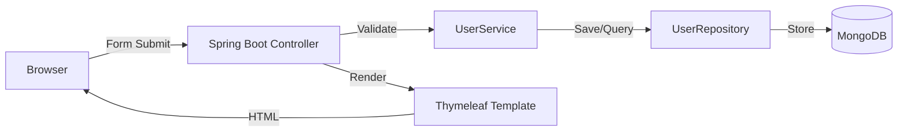
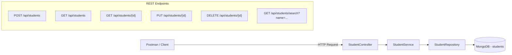
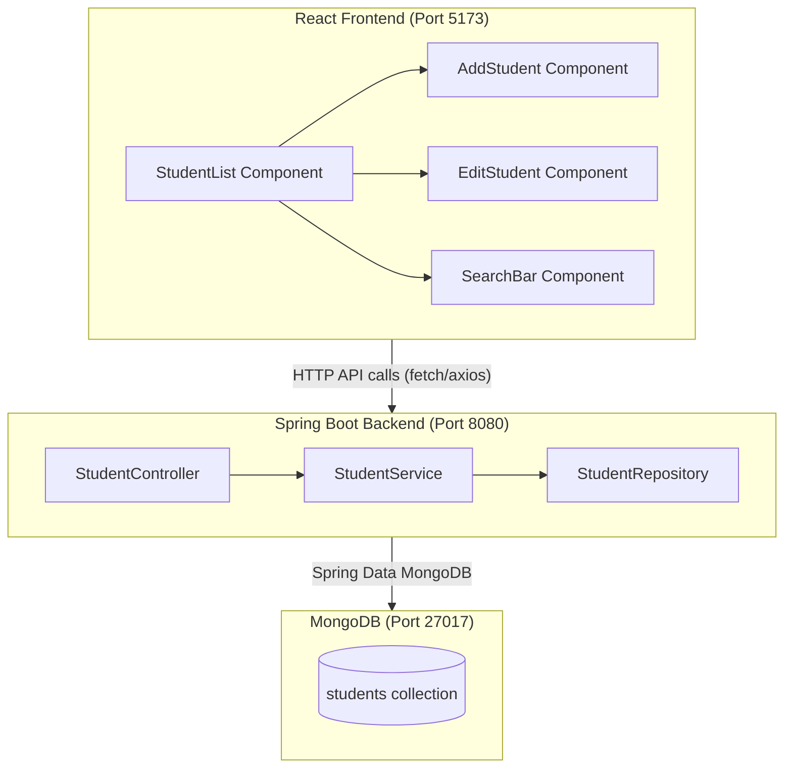

# Lab Experiments Overview

> **Full Stack Development Lab (U24PC431IT) | B.E. IV Semester**

This document lists all lab experiments covered in this repository. Each experiment has its own folder with detailed instructions, starter code, and complete solutions.

---

## Experiments at a Glance

| # | Experiment | Technologies | Folder |
|---|-----------|-------------|--------|
| 1 | [Registration & Login System](#experiment-1-registration--login-system) | Spring Boot, Thymeleaf, MongoDB | [`springboot-login-register/`](springboot-login-register/) |
| 2 | [CRUD Operations with MongoDB](#experiment-2-crud-operations-with-mongodb) | Spring Boot, REST API, MongoDB | [`springboot-crud-mongodb/`](springboot-crud-mongodb/) |
| 3 | [Full-Stack Student Management App](#experiment-3-full-stack-student-management-app) | Spring Boot, React, MongoDB | [`fullstack-student-app/`](fullstack-student-app/) |

---

## Experiment 1: Registration & Login System

**Objective:** Develop a web-based application to perform Registration and Login using Spring Initializr.

**What you'll build:**
- User registration form with name, email, and password
- Login page with authentication
- Home page visible only after login
- Server-side rendered UI using Thymeleaf templates
- Password hashing with Spring Security

**Prerequisites (Theory):**
- Spring Boot Introduction & Architecture
- Spring Initializr
- Dependency Injection
- Building Web Applications (Controllers, Thymeleaf)
- Database Connectivity (MongoDB)

**Key Concepts Practiced:**
- Creating a Spring Boot project from Spring Initializr
- MVC pattern with @Controller
- Form handling with Thymeleaf
- Spring Security basics
- MongoDB document storage for users



**Folder structure:**
```
springboot-login-register/
├── README.md          # Detailed step-by-step instructions
├── starter/           # Skeleton code (students start here)
└── solution/          # Complete working solution
```

[Go to Experiment 1 →](springboot-login-register/)

---

## Experiment 2: CRUD Operations with MongoDB

**Objective:** Create a Spring Boot application to perform basic CRUD (Create/Read/Update/Delete) operations using MongoDB.

**What you'll build:**
- REST API for Student Management (name, rollNumber, department, email)
- All CRUD endpoints (POST, GET, PUT, DELETE)
- Search students by name or department
- Filter students by department
- MongoDB integration with Spring Data

**Prerequisites (Theory):**
- All Spring Boot topics
- MongoDB basics

**Key Concepts Practiced:**
- @RestController and REST API design
- MongoRepository with custom queries
- Request/Response handling (@RequestBody, @PathVariable, @RequestParam)
- Service layer pattern
- Testing APIs with Postman/Thunder Client



**Folder structure:**
```
springboot-crud-mongodb/
├── README.md          # Detailed step-by-step instructions
├── starter/           # Skeleton code (students start here)
└── solution/          # Complete working solution
```

[Go to Experiment 2 →](springboot-crud-mongodb/)

---

## Experiment 3: Full-Stack Student Management App

**Objective:** Develop a web application using Spring Boot (backend), React (frontend), and MongoDB (database).

**What you'll build:**
- **Backend:** Spring Boot REST API (from Experiment 2, enhanced)
- **Frontend:** React SPA with components for listing, adding, editing, and deleting students
- **Database:** MongoDB storing student records
- Search bar and department filter on the UI
- Full Create, Read, Update, Delete operations from the browser

**Prerequisites (Theory):**
- All Spring Boot topics
- All React topics
- MongoDB basics

**Key Concepts Practiced:**
- Full-stack architecture (frontend ↔ backend ↔ database)
- React components, state management, and API calls
- CORS configuration in Spring Boot
- React Router for SPA navigation
- Form handling and validation in React



**Folder structure:**
```
fullstack-student-app/
├── README.md          # Detailed step-by-step instructions
├── starter/
│   ├── backend/       # Spring Boot starter
│   └── frontend/      # React starter
└── solution/
    ├── backend/       # Complete Spring Boot API
    └── frontend/      # Complete React app
```

[Go to Experiment 3 →](fullstack-student-app/)

---

## Lab Evaluation

| Component | Marks |
|-----------|-------|
| Day-to-day lab work | 18 |
| Internal Test 1 | 12 |
| Internal Test 2 | 12 |
| **Total CIE** | **30** |
| Semester End Exam (3 hours) | **50** |

---

## Before Each Lab Session

1. Ensure all [prerequisites](../PREREQUISITES.md) are installed and working
2. Read the corresponding theory notes before the lab
3. Pull the latest code: `git pull origin main`
4. Read the experiment's README.md carefully before starting

## Common Lab Setup

```bash
# Clone the repository (first time only)
git clone https://github.com/krushiraj/spring-boot-demo.git
cd spring-boot-demo

# For Spring Boot experiments
cd labs/springboot-login-register/starter  # or whichever experiment
mvn spring-boot:run

# For React experiments
cd labs/fullstack-student-app/starter/frontend
npm install
npm run dev
```
