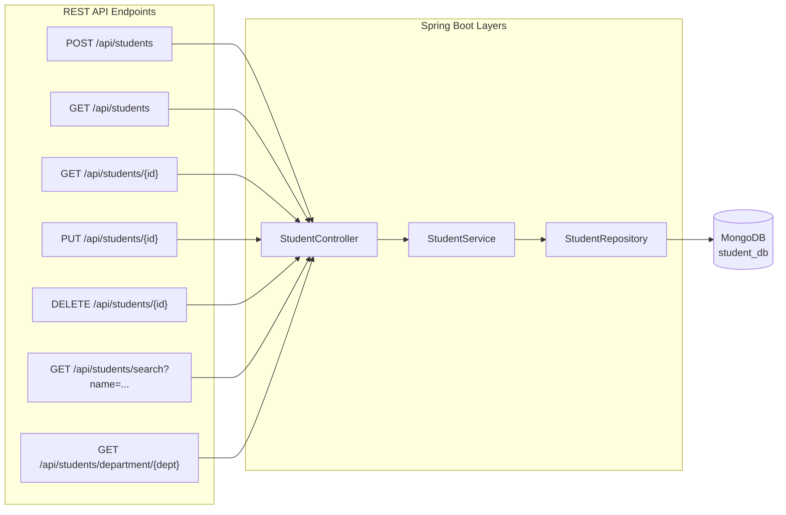
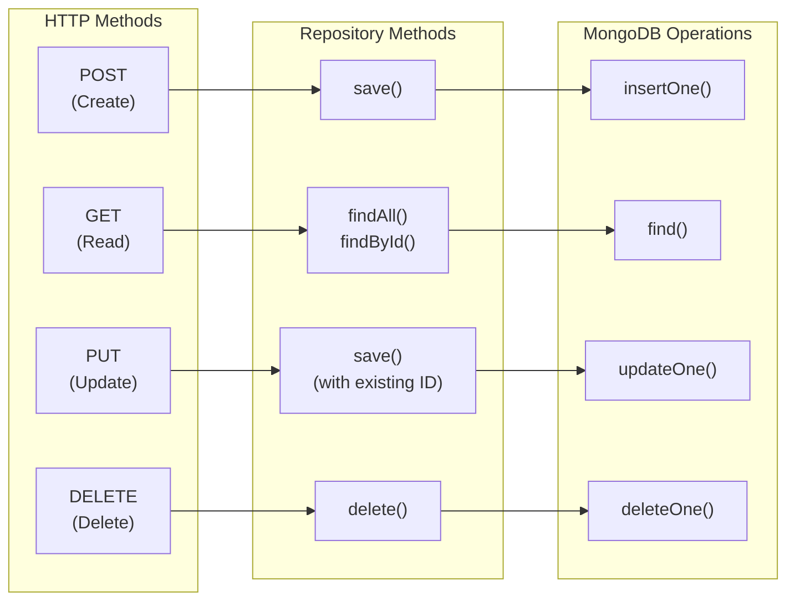

# Lab Experiment 2: CRUD Operations with MongoDB

> **Objective:** Create a Spring Boot application to perform basic CRUD (Create/Read/Update/Delete) operations using MongoDB

[Back to Lab Overview](../lab-overview.md) | [Prerequisites](../../PREREQUISITES.md)

---

## What You'll Build

A REST API for a **Student Management System** with:
- Create new student records
- Read/list all students
- Read a single student by ID
- Update student details
- Delete a student
- Search students by name
- Filter students by department



---

## Before You Start

- [ ] JDK 1.8 installed
- [ ] Maven installed
- [ ] MongoDB running on port 27017
- [ ] Postman or Thunder Client installed (for testing APIs)
- [ ] Completed Lab 1 (or understand Spring Boot basics)

---

## Step-by-Step Instructions

### Step 1: Create Project with Spring Initializr

Go to **https://start.spring.io** and configure:

| Setting | Value |
|---------|-------|
| Project | Maven |
| Language | Java |
| Spring Boot | 2.7.18 |
| Group | `com.lab.student` |
| Artifact | `student-crud` |
| Name | `student-crud` |
| Package name | `com.lab.student` |
| Packaging | Jar |
| Java | 8 |

**Dependencies:**
- Spring Web
- Spring Data MongoDB
- Spring Boot DevTools
- Lombok *(optional - reduces boilerplate code)*

Click **Generate**, extract, and open in your IDE.

### Step 2: Configure MongoDB

`src/main/resources/application.properties`:

```properties
# MongoDB Configuration
spring.data.mongodb.host=localhost
spring.data.mongodb.port=27017
spring.data.mongodb.database=student_db

# Server Configuration
server.port=8080
```

### Step 3: Create the Student Model

`src/main/java/com/lab/student/model/Student.java`:

```java
package com.lab.student.model;

import org.springframework.data.annotation.Id;
import org.springframework.data.mongodb.core.mapping.Document;
import org.springframework.data.mongodb.core.index.Indexed;

@Document(collection = "students")
public class Student {

    @Id
    private String id;

    private String name;

    @Indexed(unique = true)
    private String rollNumber;

    private String department;

    private String email;

    // Default constructor
    public Student() {}

    // Parameterized constructor
    public Student(String name, String rollNumber, String department, String email) {
        this.name = name;
        this.rollNumber = rollNumber;
        this.department = department;
        this.email = email;
    }

    // Getters and Setters
    public String getId() { return id; }
    public void setId(String id) { this.id = id; }

    public String getName() { return name; }
    public void setName(String name) { this.name = name; }

    public String getRollNumber() { return rollNumber; }
    public void setRollNumber(String rollNumber) { this.rollNumber = rollNumber; }

    public String getDepartment() { return department; }
    public void setDepartment(String department) { this.department = department; }

    public String getEmail() { return email; }
    public void setEmail(String email) { this.email = email; }

    @Override
    public String toString() {
        return "Student{" +
                "id='" + id + '\'' +
                ", name='" + name + '\'' +
                ", rollNumber='" + rollNumber + '\'' +
                ", department='" + department + '\'' +
                ", email='" + email + '\'' +
                '}';
    }
}
```

### Step 4: Create the Repository

`src/main/java/com/lab/student/repository/StudentRepository.java`:

```java
package com.lab.student.repository;

import com.lab.student.model.Student;
import org.springframework.data.mongodb.repository.MongoRepository;
import org.springframework.data.mongodb.repository.Query;

import java.util.List;
import java.util.Optional;

public interface StudentRepository extends MongoRepository<Student, String> {

    // Find students by department
    List<Student> findByDepartment(String department);

    // Find student by roll number
    Optional<Student> findByRollNumber(String rollNumber);

    // Search students by name (case-insensitive, partial match)
    @Query("{ 'name': { $regex: ?0, $options: 'i' } }")
    List<Student> searchByName(String name);

    // Find students by department, sorted by name
    List<Student> findByDepartmentOrderByNameAsc(String department);
}
```

### Step 5: Create the Service Layer

`src/main/java/com/lab/student/service/StudentService.java`:

```java
package com.lab.student.service;

import com.lab.student.model.Student;
import com.lab.student.repository.StudentRepository;
import org.springframework.beans.factory.annotation.Autowired;
import org.springframework.stereotype.Service;

import java.util.List;
import java.util.Optional;

@Service
public class StudentService {

    @Autowired
    private StudentRepository studentRepository;

    // Create
    public Student createStudent(Student student) {
        return studentRepository.save(student);
    }

    // Read all
    public List<Student> getAllStudents() {
        return studentRepository.findAll();
    }

    // Read by ID
    public Optional<Student> getStudentById(String id) {
        return studentRepository.findById(id);
    }

    // Update
    public Student updateStudent(String id, Student studentDetails) {
        Student student = studentRepository.findById(id)
                .orElseThrow(() -> new RuntimeException("Student not found with id: " + id));

        student.setName(studentDetails.getName());
        student.setRollNumber(studentDetails.getRollNumber());
        student.setDepartment(studentDetails.getDepartment());
        student.setEmail(studentDetails.getEmail());

        return studentRepository.save(student);
    }

    // Delete
    public void deleteStudent(String id) {
        Student student = studentRepository.findById(id)
                .orElseThrow(() -> new RuntimeException("Student not found with id: " + id));
        studentRepository.delete(student);
    }

    // Search by name
    public List<Student> searchByName(String name) {
        return studentRepository.searchByName(name);
    }

    // Filter by department
    public List<Student> getByDepartment(String department) {
        return studentRepository.findByDepartment(department);
    }
}
```

### Step 6: Create the REST Controller

`src/main/java/com/lab/student/controller/StudentController.java`:

```java
package com.lab.student.controller;

import com.lab.student.model.Student;
import com.lab.student.service.StudentService;
import org.springframework.beans.factory.annotation.Autowired;
import org.springframework.http.HttpStatus;
import org.springframework.http.ResponseEntity;
import org.springframework.web.bind.annotation.*;

import java.util.List;

@RestController
@RequestMapping("/api/students")
public class StudentController {

    @Autowired
    private StudentService studentService;

    // CREATE - POST /api/students
    @PostMapping
    public ResponseEntity<Student> createStudent(@RequestBody Student student) {
        Student created = studentService.createStudent(student);
        return new ResponseEntity<>(created, HttpStatus.CREATED);
    }

    // READ ALL - GET /api/students
    @GetMapping
    public ResponseEntity<List<Student>> getAllStudents() {
        List<Student> students = studentService.getAllStudents();
        return ResponseEntity.ok(students);
    }

    // READ ONE - GET /api/students/{id}
    @GetMapping("/{id}")
    public ResponseEntity<Student> getStudentById(@PathVariable String id) {
        return studentService.getStudentById(id)
                .map(ResponseEntity::ok)
                .orElse(ResponseEntity.notFound().build());
    }

    // UPDATE - PUT /api/students/{id}
    @PutMapping("/{id}")
    public ResponseEntity<Student> updateStudent(@PathVariable String id,
                                                  @RequestBody Student student) {
        try {
            Student updated = studentService.updateStudent(id, student);
            return ResponseEntity.ok(updated);
        } catch (RuntimeException e) {
            return ResponseEntity.notFound().build();
        }
    }

    // DELETE - DELETE /api/students/{id}
    @DeleteMapping("/{id}")
    public ResponseEntity<Void> deleteStudent(@PathVariable String id) {
        try {
            studentService.deleteStudent(id);
            return ResponseEntity.noContent().build();
        } catch (RuntimeException e) {
            return ResponseEntity.notFound().build();
        }
    }

    // SEARCH - GET /api/students/search?name=xxx
    @GetMapping("/search")
    public ResponseEntity<List<Student>> searchStudents(@RequestParam String name) {
        List<Student> students = studentService.searchByName(name);
        return ResponseEntity.ok(students);
    }

    // FILTER BY DEPARTMENT - GET /api/students/department/{dept}
    @GetMapping("/department/{department}")
    public ResponseEntity<List<Student>> getByDepartment(
            @PathVariable String department) {
        List<Student> students = studentService.getByDepartment(department);
        return ResponseEntity.ok(students);
    }
}
```

### Step 7: Run the Application

```bash
mvn spring-boot:run
```

You should see:
```
Started StudentCrudApplication in X.XXX seconds
```

### Step 8: Test with Postman / Thunder Client

#### Insert Sample Data

**POST** `http://localhost:8080/api/students`

Headers: `Content-Type: application/json`

Body (raw JSON):
```json
{
    "name": "Ravi Kumar",
    "rollNumber": "21B01A1201",
    "department": "IT",
    "email": "ravi@example.com"
}
```

Add more students:
```json
{
    "name": "Priya Sharma",
    "rollNumber": "21B01A1202",
    "department": "CSE",
    "email": "priya@example.com"
}
```

```json
{
    "name": "Amit Reddy",
    "rollNumber": "21B01A1203",
    "department": "IT",
    "email": "amit@example.com"
}
```

```json
{
    "name": "Sneha Patel",
    "rollNumber": "21B01A1204",
    "department": "ECE",
    "email": "sneha@example.com"
}
```

```json
{
    "name": "Karthik Rao",
    "rollNumber": "21B01A1205",
    "department": "CSE",
    "email": "karthik@example.com"
}
```

#### Test All Operations

| Operation | Method | URL | Expected |
|-----------|--------|-----|----------|
| Get all | GET | `/api/students` | List of all students |
| Get one | GET | `/api/students/{id}` | Single student (use ID from POST response) |
| Search | GET | `/api/students/search?name=ravi` | Students matching "ravi" |
| Filter | GET | `/api/students/department/IT` | Students in IT department |
| Update | PUT | `/api/students/{id}` | Updated student (send full JSON body) |
| Delete | DELETE | `/api/students/{id}` | 204 No Content |

#### Example: Update a Student

**PUT** `http://localhost:8080/api/students/{id}`

```json
{
    "name": "Ravi Kumar",
    "rollNumber": "21B01A1201",
    "department": "CSE",
    "email": "ravi.kumar@example.com"
}
```

### Step 9: Verify in MongoDB

```bash
mongosh
use student_db
db.students.find().pretty()
db.students.countDocuments()
```

---

## Understanding the Code

### HTTP Methods → CRUD Mapping



### Custom Queries Explained

```java
// Spring Data derives the query from the method name:
List<Student> findByDepartment(String department);
// Equivalent MongoDB query: { "department": "IT" }

// @Query allows writing custom MongoDB queries:
@Query("{ 'name': { $regex: ?0, $options: 'i' } }")
List<Student> searchByName(String name);
// $regex: partial match, $options 'i': case-insensitive
// searchByName("ravi") matches "Ravi Kumar", "ravi123", etc.
```

### Response Codes

| Code | Meaning | When |
|------|---------|------|
| 200 OK | Success | GET, PUT successful |
| 201 Created | Resource created | POST successful |
| 204 No Content | Deleted successfully | DELETE successful |
| 404 Not Found | Resource doesn't exist | GET/PUT/DELETE with invalid ID |

---

## Troubleshooting

| Problem | Solution |
|---------|----------|
| `MongoSocketOpenException` | MongoDB not running. Start it first. |
| `DuplicateKeyException` on POST | A student with the same rollNumber already exists. Use a different rollNumber. |
| 404 on all endpoints | Check that `@RequestMapping("/api/students")` is on the controller class. |
| POST returns 403 Forbidden | You may have Spring Security in dependencies. Remove it (this lab doesn't need it) or add `@Bean SecurityFilterChain` that permits all. |
| `HttpMessageNotReadableException` | Your POST body is not valid JSON. Check the JSON format. |
| Search returns empty | Check the query parameter: `/api/students/search?name=ravi` (not `?name="ravi"`). |
| PUT doesn't update | Ensure you're sending the complete student object in the body, not just the changed fields. |

---

## What to Submit

1. Screenshots of all CRUD operations in Postman (POST, GET, PUT, DELETE)
2. Screenshot of search results
3. Screenshot of filter by department
4. Screenshot of MongoDB data (`mongosh` output)
5. Complete source code

---

## Extension Tasks (Optional)

- Add pagination: `GET /api/students?page=0&size=10`
- Add sorting: `GET /api/students?sort=name,asc`
- Add validation (rollNumber format, email format)
- Add a count endpoint: `GET /api/students/count`

[Next: Lab 3 - Full-Stack Student Management App →](../fullstack-student-app/)
