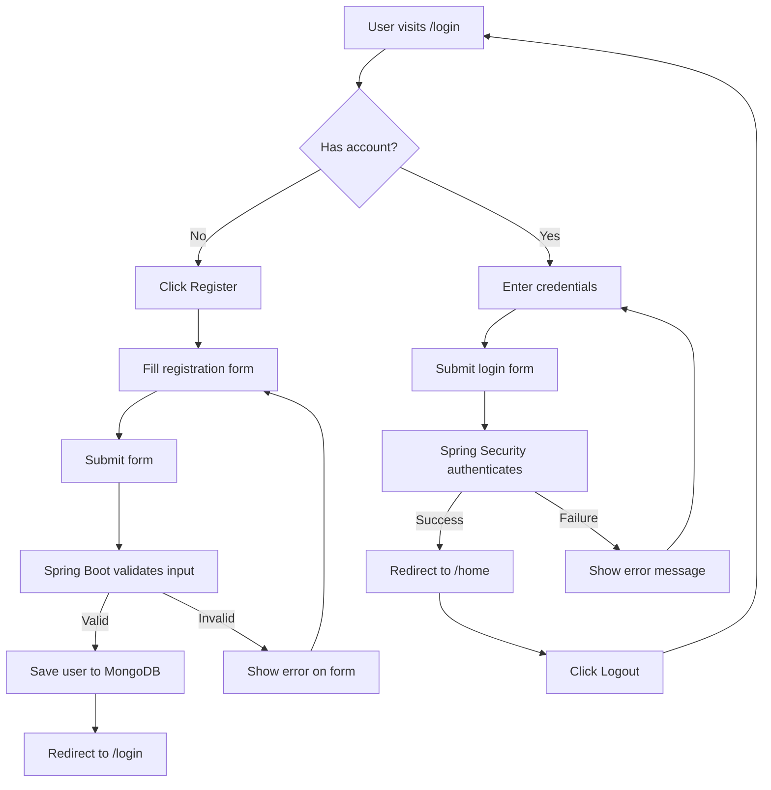
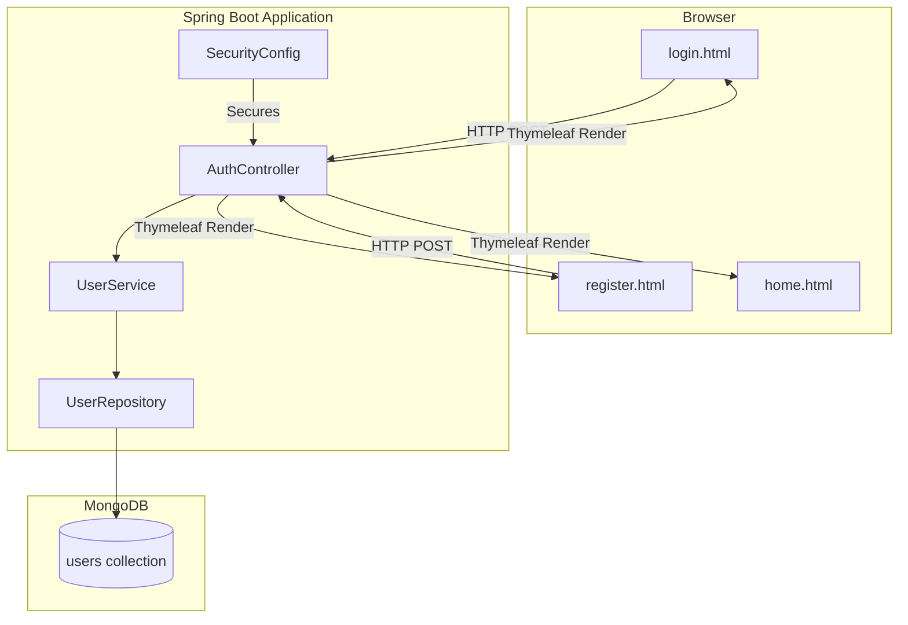
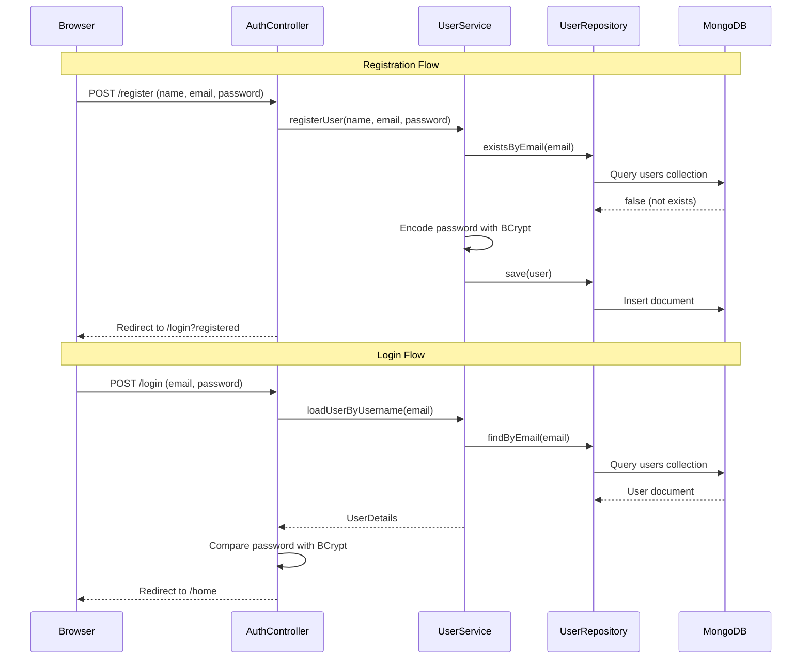

# Lab Experiment 1: Registration & Login System

> **Objective:** Develop a web-based application to perform Registration and Login using Spring Initializr

[Back to Lab Overview](../lab-overview.md) | [Prerequisites](../../PREREQUISITES.md)

---

## What You'll Build

A web application where users can:
- Register with a username, email, and password
- Log in with their credentials
- See a home/dashboard page after successful login
- Log out



---

## Architecture



---

## Before You Start

- [ ] JDK 1.8 installed (`java -version` shows 1.8.x)
- [ ] Maven installed (`mvn -version`)
- [ ] MongoDB running on port 27017 (`mongosh` connects successfully)
- [ ] IDE/editor ready (VS Code, Windsurf, IntelliJ, etc.)
- [ ] Internet access (for downloading dependencies on first run)

---

## Step-by-Step Instructions

### Step 1: Create Project with Spring Initializr

1. Open **https://start.spring.io** in your browser
2. Configure the project:

| Setting | Value |
|---------|-------|
| Project | Maven |
| Language | Java |
| Spring Boot | 2.7.18 |
| Group | `com.lab.auth` |
| Artifact | `login-register` |
| Name | `login-register` |
| Package name | `com.lab.auth` |
| Packaging | Jar |
| Java | 8 |

3. Add these **Dependencies** (click "Add Dependencies"):
   - **Spring Web** - for building web applications
   - **Spring Data MongoDB** - for MongoDB connectivity
   - **Spring Security** - for authentication
   - **Thymeleaf** - for HTML templates
   - **Spring Boot DevTools** - for auto-reload during development

4. Click **Generate** to download the ZIP file
5. Extract the ZIP and open the folder in your IDE

> **Alternatively:** Use the starter code provided in the `starter/` folder.

### Step 2: Configure MongoDB Connection

Open `src/main/resources/application.properties` and add:

```properties
# MongoDB Configuration
spring.data.mongodb.host=localhost
spring.data.mongodb.port=27017
spring.data.mongodb.database=auth_db

# Server port (default 8080)
server.port=8080
```

### Step 3: Create the User Model

Create `src/main/java/com/lab/auth/model/User.java`:

```java
package com.lab.auth.model;

import org.springframework.data.annotation.Id;
import org.springframework.data.mongodb.core.mapping.Document;
import org.springframework.data.mongodb.core.index.Indexed;

@Document(collection = "users")
public class User {

    @Id
    private String id;

    private String name;

    @Indexed(unique = true)
    private String email;

    private String password;

    // Default constructor
    public User() {}

    // Parameterized constructor
    public User(String name, String email, String password) {
        this.name = name;
        this.email = email;
        this.password = password;
    }

    // Getters and Setters
    public String getId() { return id; }
    public void setId(String id) { this.id = id; }

    public String getName() { return name; }
    public void setName(String name) { this.name = name; }

    public String getEmail() { return email; }
    public void setEmail(String email) { this.email = email; }

    public String getPassword() { return password; }
    public void setPassword(String password) { this.password = password; }
}
```

### Step 4: Create the Repository

Create `src/main/java/com/lab/auth/repository/UserRepository.java`:

```java
package com.lab.auth.repository;

import com.lab.auth.model.User;
import org.springframework.data.mongodb.repository.MongoRepository;
import java.util.Optional;

public interface UserRepository extends MongoRepository<User, String> {
    Optional<User> findByEmail(String email);
    boolean existsByEmail(String email);
}
```

### Step 5: Create the User Service

Create `src/main/java/com/lab/auth/service/UserService.java`:

```java
package com.lab.auth.service;

import com.lab.auth.model.User;
import com.lab.auth.repository.UserRepository;
import org.springframework.beans.factory.annotation.Autowired;
import org.springframework.security.crypto.password.PasswordEncoder;
import org.springframework.stereotype.Service;

@Service
public class UserService {

    @Autowired
    private UserRepository userRepository;

    @Autowired
    private PasswordEncoder passwordEncoder;

    public void registerUser(String name, String email, String password) {
        if (userRepository.existsByEmail(email)) {
            throw new RuntimeException("Email already registered");
        }
        User user = new User();
        user.setName(name);
        user.setEmail(email);
        user.setPassword(passwordEncoder.encode(password));
        userRepository.save(user);
    }
}
```

### Step 6: Create CustomUserDetailsService

Create `src/main/java/com/lab/auth/service/CustomUserDetailsService.java`:

```java
package com.lab.auth.service;

import com.lab.auth.model.User;
import com.lab.auth.repository.UserRepository;
import org.springframework.beans.factory.annotation.Autowired;
import org.springframework.security.core.userdetails.UserDetails;
import org.springframework.security.core.userdetails.UserDetailsService;
import org.springframework.security.core.userdetails.UsernameNotFoundException;
import org.springframework.stereotype.Service;

import java.util.ArrayList;

@Service
public class CustomUserDetailsService implements UserDetailsService {

    @Autowired
    private UserRepository userRepository;

    @Override
    public UserDetails loadUserByUsername(String email)
            throws UsernameNotFoundException {
        User user = userRepository.findByEmail(email)
                .orElseThrow(() -> new UsernameNotFoundException(
                    "User not found with email: " + email));

        return new org.springframework.security.core.userdetails.User(
                user.getEmail(),
                user.getPassword(),
                new ArrayList<>()
        );
    }
}
```

### Step 7: Configure Spring Security

Create `src/main/java/com/lab/auth/config/SecurityConfig.java`:

```java
package com.lab.auth.config;

import com.lab.auth.service.CustomUserDetailsService;
import org.springframework.beans.factory.annotation.Autowired;
import org.springframework.context.annotation.Bean;
import org.springframework.context.annotation.Configuration;
import org.springframework.security.config.annotation.authentication.builders.AuthenticationManagerBuilder;
import org.springframework.security.config.annotation.web.builders.HttpSecurity;
import org.springframework.security.config.annotation.web.configuration.EnableWebSecurity;
import org.springframework.security.crypto.bcrypt.BCryptPasswordEncoder;
import org.springframework.security.crypto.password.PasswordEncoder;
import org.springframework.security.web.SecurityFilterChain;

@Configuration
@EnableWebSecurity
public class SecurityConfig {

    @Autowired
    private CustomUserDetailsService userDetailsService;

    @Bean
    public PasswordEncoder passwordEncoder() {
        return new BCryptPasswordEncoder();
    }

    @Bean
    public SecurityFilterChain filterChain(HttpSecurity http) throws Exception {
        http
            .csrf().disable()
            .authorizeRequests()
                .antMatchers("/register", "/css/**").permitAll()
                .anyRequest().authenticated()
            .and()
            .formLogin()
                .loginPage("/login")
                .defaultSuccessUrl("/home", true)
                .permitAll()
            .and()
            .logout()
                .logoutSuccessUrl("/login?logout")
                .permitAll();

        return http.build();
    }
}
```

### Step 8: Create the Controller

Create `src/main/java/com/lab/auth/controller/AuthController.java`:

```java
package com.lab.auth.controller;

import com.lab.auth.service.UserService;
import org.springframework.beans.factory.annotation.Autowired;
import org.springframework.stereotype.Controller;
import org.springframework.ui.Model;
import org.springframework.web.bind.annotation.GetMapping;
import org.springframework.web.bind.annotation.PostMapping;
import org.springframework.web.bind.annotation.RequestParam;

@Controller
public class AuthController {

    @Autowired
    private UserService userService;

    @GetMapping("/login")
    public String loginPage() {
        return "login";
    }

    @GetMapping("/register")
    public String registerPage() {
        return "register";
    }

    @PostMapping("/register")
    public String registerUser(@RequestParam String name,
                               @RequestParam String email,
                               @RequestParam String password,
                               Model model) {
        try {
            userService.registerUser(name, email, password);
            return "redirect:/login?registered";
        } catch (RuntimeException e) {
            model.addAttribute("error", e.getMessage());
            return "register";
        }
    }

    @GetMapping("/home")
    public String homePage() {
        return "home";
    }
}
```

### Step 9: Create Thymeleaf Templates

Create `src/main/resources/templates/login.html`:

```html
<!DOCTYPE html>
<html xmlns:th="http://www.thymeleaf.org">
<head>
    <title>Login</title>
    <link rel="stylesheet" th:href="@{/css/styles.css}"/>
</head>
<body>
    <div class="container">
        <h2>Login</h2>

        <div th:if="${param.error}" class="alert error">
            Invalid email or password.
        </div>
        <div th:if="${param.registered}" class="alert success">
            Registration successful! Please log in.
        </div>
        <div th:if="${param.logout}" class="alert success">
            You have been logged out.
        </div>

        <form th:action="@{/login}" method="post">
            <div class="form-group">
                <label for="username">Email:</label>
                <input type="email" id="username" name="username" required/>
            </div>
            <div class="form-group">
                <label for="password">Password:</label>
                <input type="password" id="password" name="password" required/>
            </div>
            <button type="submit">Login</button>
        </form>

        <p>Don't have an account? <a th:href="@{/register}">Register here</a></p>
    </div>
</body>
</html>
```

Create `src/main/resources/templates/register.html`:

```html
<!DOCTYPE html>
<html xmlns:th="http://www.thymeleaf.org">
<head>
    <title>Register</title>
    <link rel="stylesheet" th:href="@{/css/styles.css}"/>
</head>
<body>
    <div class="container">
        <h2>Register</h2>

        <div th:if="${error}" class="alert error" th:text="${error}"></div>

        <form th:action="@{/register}" method="post">
            <div class="form-group">
                <label for="name">Name:</label>
                <input type="text" id="name" name="name" required
                       minlength="2" maxlength="50"/>
            </div>
            <div class="form-group">
                <label for="email">Email:</label>
                <input type="email" id="email" name="email" required/>
            </div>
            <div class="form-group">
                <label for="password">Password:</label>
                <input type="password" id="password" name="password" required
                       minlength="6"/>
            </div>
            <button type="submit">Register</button>
        </form>

        <p>Already have an account? <a th:href="@{/login}">Login here</a></p>
    </div>
</body>
</html>
```

Create `src/main/resources/templates/home.html`:

```html
<!DOCTYPE html>
<html xmlns:th="http://www.thymeleaf.org">
<head>
    <title>Home</title>
    <link rel="stylesheet" th:href="@{/css/styles.css}"/>
</head>
<body>
    <div class="container">
        <h2>Welcome!</h2>
        <p>You are successfully logged in.</p>
        <form th:action="@{/logout}" method="post">
            <button type="submit">Logout</button>
        </form>
    </div>
</body>
</html>
```

Create `src/main/resources/static/css/styles.css`:

```css
body {
    font-family: Arial, sans-serif;
    background-color: #f4f4f4;
    margin: 0;
    padding: 0;
    display: flex;
    justify-content: center;
    align-items: center;
    min-height: 100vh;
}

.container {
    background: white;
    padding: 2rem;
    border-radius: 8px;
    box-shadow: 0 2px 10px rgba(0, 0, 0, 0.1);
    width: 100%;
    max-width: 400px;
}

h2 {
    text-align: center;
    color: #333;
    margin-bottom: 1.5rem;
}

.form-group {
    margin-bottom: 1rem;
}

label {
    display: block;
    margin-bottom: 0.3rem;
    color: #555;
    font-size: 0.9rem;
}

input {
    width: 100%;
    padding: 0.6rem;
    border: 1px solid #ddd;
    border-radius: 4px;
    font-size: 1rem;
    box-sizing: border-box;
}

button {
    width: 100%;
    padding: 0.7rem;
    background-color: #4CAF50;
    color: white;
    border: none;
    border-radius: 4px;
    font-size: 1rem;
    cursor: pointer;
}

button:hover {
    background-color: #45a049;
}

.alert {
    padding: 0.7rem;
    border-radius: 4px;
    margin-bottom: 1rem;
    text-align: center;
}

.alert.error {
    background-color: #f8d7da;
    color: #721c24;
    border: 1px solid #f5c6cb;
}

.alert.success {
    background-color: #d4edda;
    color: #155724;
    border: 1px solid #c3e6cb;
}

p {
    text-align: center;
    margin-top: 1rem;
}

a {
    color: #4CAF50;
}
```

### Step 10: Run the Application

```bash
# Navigate to the project directory
cd login-register

# Build and run
mvn spring-boot:run
```

Open your browser and go to:
- **http://localhost:8080/login** - Login page
- **http://localhost:8080/register** - Registration page

### Step 11: Test the Application

1. Go to http://localhost:8080/register
2. Fill in the form and click Register
3. You should be redirected to the login page with a success message
4. Enter your credentials and click Login
5. You should see the Home page
6. Click Logout to return to the login page

### Step 12: Verify Data in MongoDB

Open a terminal and run:

```bash
mongosh
use auth_db
db.users.find().pretty()
```

You should see the registered user document with the password hashed (not plain text).

---

## Understanding the Code

### Request Flow



### Key Annotations Explained

| Annotation | Purpose |
|-----------|---------|
| `@Document` | Marks a class as a MongoDB document |
| `@Id` | Marks the primary key field |
| `@Indexed(unique=true)` | Creates a unique index in MongoDB |
| `@Service` | Marks a class as a service layer component |
| `@Repository` | Marks an interface as a data access layer |
| `@Controller` | Marks a class as a web controller (returns views) |
| `@Autowired` | Injects dependencies automatically |
| `@Configuration` | Marks a class as a Spring configuration |
| `@EnableWebSecurity` | Enables Spring Security |

---

## Troubleshooting

| Problem | Solution |
|---------|----------|
| `MongoSocketOpenException: Exception opening socket` | MongoDB is not running. Start it: Windows: `net start MongoDB`, macOS: `brew services start mongodb-community@7.0`, Linux: `sudo systemctl start mongod` |
| `Port 8080 already in use` | Another app is using port 8080. Change port in `application.properties`: `server.port=8081` |
| Whitelabel Error Page | Check your controller mappings. Ensure Thymeleaf templates are in `src/main/resources/templates/` |
| `No qualifying bean of type PasswordEncoder` | Ensure `SecurityConfig` has the `@Bean` method for `passwordEncoder()` |
| Login always fails | Ensure Spring Security's login form uses `username` (not `email`) as the field name. The `loadUserByUsername` method receives this value. |
| CSS not loading | Ensure CSS is in `src/main/resources/static/css/` and SecurityConfig allows `/css/**` |
| `Failed to execute goal org.apache.maven.plugins...` | Run `mvn clean install` first to download all dependencies |

---

## What to Submit

1. Screenshot of the registration page
2. Screenshot of successful login (home page)
3. Screenshot of MongoDB data (`mongosh` output showing the user document)
4. Complete source code

---

## Extension Tasks (Optional)

- Add password confirmation field on the registration form
- Display the logged-in user's name on the home page
- Add input validation (email format, minimum password length)
- Style the pages with Bootstrap

[Next: Lab 2 - CRUD Operations →](../springboot-crud-mongodb/)
