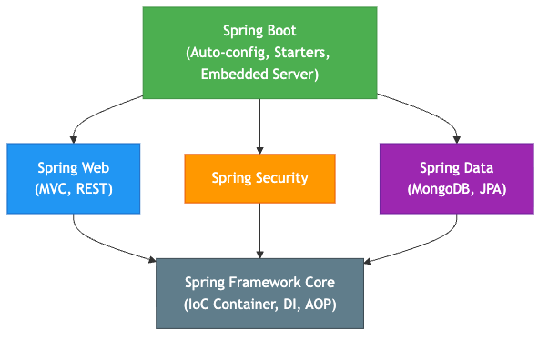
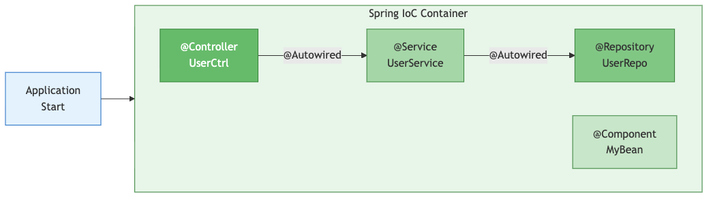
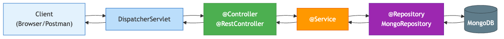
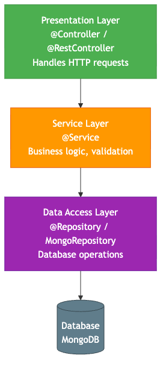

# Spring Boot

## Full Stack Development - Unit III

**Department of Information Technology**
Vasavi College of Engineering, Hyderabad

---

<!-- Speaker notes: Start by asking students what they know about web development with Java. Most will know basic Java but not Spring. Bridge from their Java knowledge to Spring Boot. -->

## What We'll Cover

1. Introduction to Spring Framework
2. What is Spring Boot & Why
3. Spring Boot Architecture
4. Spring Initializr
5. Dependency Injection
6. Building Web Applications
7. Database Connectivity (MongoDB)

---

<!-- Speaker notes: Explain that Spring is an ecosystem, not a single library. It's been around since 2003 and is used by most enterprise Java applications. -->

## What is the Spring Framework?

- **Open-source** Java application framework
- Created by **Rod Johnson** in 2003
- Makes Java enterprise development **simpler**
- Core principle: **Inversion of Control (IoC)**

### The Problem Spring Solves

Without Spring:
- Manual object creation and wiring
- Boilerplate configuration (XML files)
- Hard-to-test code with tight coupling

---

<!-- Speaker notes: This is the key slide. Emphasize that Spring Boot is NOT a replacement for Spring - it's built ON TOP of Spring. It just removes the painful setup. Use the analogy: Spring is the engine, Spring Boot is the car with the engine pre-installed. -->

## What is Spring Boot?

> Spring Boot makes it easy to create **stand-alone**, **production-grade** Spring applications that you can **just run**.

- Built **on top of** Spring Framework
- Created by **Pivotal** (now VMware) in 2014
- **Opinionated defaults** — works out of the box
- **No XML configuration** needed

### Key Features
- Auto-configuration
- Embedded server (Tomcat)
- Starter dependencies
- Production-ready defaults

---

<!-- Speaker notes: Walk through each advantage. For embedded server, explain that traditionally you had to install Tomcat separately and deploy WAR files. Spring Boot bundles Tomcat inside the JAR. -->

## Spring vs Spring Boot

| Aspect | Spring | Spring Boot |
|--------|--------|-------------|
| Configuration | Manual (XML/Java) | Auto-configured |
| Server | External (install Tomcat) | Embedded Tomcat |
| Dependencies | Add each manually | Starter bundles |
| Setup time | Hours | Minutes |
| Boilerplate | Lots | Minimal |
| Production-ready | Manual setup | Built-in |

**Spring Boot = Spring + Auto-configuration + Embedded Server + Starters**

---

<!-- Speaker notes: Draw this on the board too. Explain each component briefly. Spring Boot sits on top and uses all of these. -->

## Spring Ecosystem



---

<!-- Speaker notes: Open start.spring.io on the projector. Walk through each field. Let students follow along on their machines. This is a LIVE DEMO slide - switch to the browser. -->

## Spring Initializr

**https://start.spring.io** — Project generator for Spring Boot

### Live Demo: Create a Project

| Field | Value |
|-------|-------|
| Project | Maven |
| Language | Java |
| Spring Boot | 2.7.18 |
| Group | `com.example` |
| Artifact | `demo` |
| Packaging | Jar |
| Java | 8 |

**Dependencies to add:** Spring Web, Spring Data MongoDB, DevTools

---

<!-- Speaker notes: After generating, open the project in VS Code. Show each file and explain its purpose. Highlight that you didn't write any of this - it was generated. -->

## Generated Project Structure

```
demo/
├── src/
│   ├── main/
│   │   ├── java/com/example/demo/
│   │   │   └── DemoApplication.java      ← Entry point
│   │   └── resources/
│   │       ├── application.properties     ← Configuration
│   │       ├── static/                    ← Static files (CSS, JS)
│   │       └── templates/                 ← HTML templates
│   └── test/
│       └── java/com/example/demo/
│           └── DemoApplicationTests.java  ← Tests
├── pom.xml                                ← Dependencies
└── mvnw / mvnw.cmd                        ← Maven wrapper
```

---

<!-- Speaker notes: Highlight the three key parts: parent, dependencies, and build plugin. The parent inherits all Spring Boot defaults. Each starter pulls in many transitive dependencies. -->

## Understanding pom.xml

```xml
<!-- Parent: Inherits Spring Boot defaults -->
<parent>
    <groupId>org.springframework.boot</groupId>
    <artifactId>spring-boot-starter-parent</artifactId>
    <version>2.7.18</version>
</parent>

<!-- Dependencies: Starters bundle related libraries -->
<dependencies>
    <dependency>
        <groupId>org.springframework.boot</groupId>
        <artifactId>spring-boot-starter-web</artifactId>
    </dependency>
</dependencies>
```

`spring-boot-starter-web` includes: Spring MVC, Tomcat, Jackson (JSON), Validation

---

<!-- Speaker notes: This is the simplest Spring Boot app. Explain @SpringBootApplication = @Configuration + @EnableAutoConfiguration + @ComponentScan. Run it: mvn spring-boot:run -->

## The Main Class

```java
package com.example.demo;

import org.springframework.boot.SpringApplication;
import org.springframework.boot.autoconfigure.SpringBootApplication;

@SpringBootApplication
public class DemoApplication {
    public static void main(String[] args) {
        SpringApplication.run(DemoApplication.class, args);
    }
}
```

`@SpringBootApplication` combines:
- `@Configuration` — This is a config class
- `@EnableAutoConfiguration` — Auto-configure based on dependencies
- `@ComponentScan` — Scan for components in this package

---

<!-- Speaker notes: LIVE DEMO - create this controller, run the app, open browser to localhost:8080/hello. Show how fast it is from code to running. -->

## Your First Controller

```java
import org.springframework.web.bind.annotation.GetMapping;
import org.springframework.web.bind.annotation.RestController;

@RestController
public class HelloController {

    @GetMapping("/hello")
    public String hello() {
        return "Hello, Spring Boot!";
    }

    @GetMapping("/hello/{name}")
    public String helloName(@PathVariable String name) {
        return "Hello, " + name + "!";
    }
}
```

Run: `mvn spring-boot:run` → Visit `http://localhost:8080/hello`

---

<!-- Speaker notes: This is a critical concept. Use the restaurant analogy: You (controller) don't cook food yourself - you ask the chef (service). The chef doesn't grow vegetables - they come from the farmer (repository). DI is the system that connects them all. -->

## Dependency Injection (DI)

### The Problem: Tight Coupling

```java
// BAD - creating dependencies manually
public class OrderController {
    private OrderService service = new OrderService();  // Tight coupling!
}
```

### The Solution: Dependency Injection

```java
// GOOD - Spring injects the dependency
@RestController
public class OrderController {
    @Autowired
    private OrderService service;  // Spring provides this!
}
```

**DI = Don't create objects yourself. Let Spring create and inject them.**

---

<!-- Speaker notes: Draw the IoC container on the board. Show that Spring manages a "pool" of objects (beans). When a class needs a dependency, Spring provides it from this pool. -->

## IoC Container



---

<!-- Speaker notes: Show each type with a live code example. Recommend constructor injection as best practice. Mention that field injection is convenient but harder to test. -->

## Types of Dependency Injection

### 1. Constructor Injection (Recommended)
```java
@RestController
public class StudentController {
    private final StudentService service;

    @Autowired  // Optional in newer Spring
    public StudentController(StudentService service) {
        this.service = service;
    }
}
```

### 2. Field Injection (Convenient)
```java
@RestController
public class StudentController {
    @Autowired
    private StudentService service;
}
```

### 3. Setter Injection
```java
@Autowired
public void setService(StudentService service) {
    this.service = service;
}
```

---

<!-- Speaker notes: Explain stereotype annotations. These tell Spring "this class is a bean, manage it for me." The specific annotation (@Service vs @Repository) doesn't change behavior but helps readability. -->

## Spring Stereotype Annotations

| Annotation | Purpose | Layer |
|-----------|---------|-------|
| `@Component` | Generic Spring bean | Any |
| `@Controller` | Web controller (returns views) | Presentation |
| `@RestController` | REST API controller (returns JSON) | Presentation |
| `@Service` | Business logic | Service |
| `@Repository` | Data access | Data |
| `@Configuration` | Configuration class | Config |

All are specializations of `@Component` — Spring scans and registers them as beans.

---

<!-- Speaker notes: This is the most important architectural diagram. Draw it on the board step by step. Follow the flow of an HTTP request from browser to database and back. -->

## Spring MVC Architecture



---

<!-- Speaker notes: Explain each annotation. @Controller returns view names (Thymeleaf templates). @RestController returns data (JSON). This is the key difference. -->

## @Controller vs @RestController

### @Controller (Server-Side Rendering)
```java
@Controller
public class PageController {
    @GetMapping("/home")
    public String home(Model model) {
        model.addAttribute("name", "Ravi");
        return "home";  // Returns template name
    }
}
```

### @RestController (REST API)
```java
@RestController
public class ApiController {
    @GetMapping("/api/students")
    public List<Student> getStudents() {
        return studentService.findAll();  // Returns JSON
    }
}
```

`@RestController` = `@Controller` + `@ResponseBody`

---

<!-- Speaker notes: LIVE DEMO - show each mapping. Create a simple controller with all methods. Test with Postman. Show that GET works in browser but POST/PUT/DELETE need Postman. -->

## HTTP Methods & Annotations

| HTTP Method | Annotation | CRUD Operation | Example |
|-------------|-----------|----------------|---------|
| GET | `@GetMapping` | Read | Get all students |
| POST | `@PostMapping` | Create | Add new student |
| PUT | `@PutMapping` | Update | Update student |
| DELETE | `@DeleteMapping` | Delete | Remove student |

```java
@RestController
@RequestMapping("/api/students")
public class StudentController {

    @GetMapping           // GET /api/students
    @GetMapping("/{id}")  // GET /api/students/123
    @PostMapping          // POST /api/students
    @PutMapping("/{id}")  // PUT /api/students/123
    @DeleteMapping("/{id}") // DELETE /api/students/123
}
```

---

<!-- Speaker notes: Explain each annotation with a concrete example. @RequestBody converts JSON to Java object. @PathVariable extracts from URL path. @RequestParam extracts query parameters. -->

## Request Data Annotations

### @PathVariable — from URL path
```java
@GetMapping("/students/{id}")
public Student getById(@PathVariable String id) { ... }
// GET /students/abc123 → id = "abc123"
```

### @RequestParam — from query string
```java
@GetMapping("/students/search")
public List<Student> search(@RequestParam String name) { ... }
// GET /students/search?name=Ravi → name = "Ravi"
```

### @RequestBody — from request body (JSON)
```java
@PostMapping("/students")
public Student create(@RequestBody Student student) { ... }
// POST with JSON body → converted to Student object
```

---

<!-- Speaker notes: Explain ResponseEntity gives you full control over the HTTP response - status code, headers, body. Show the difference between returning an object directly vs wrapping in ResponseEntity. -->

## ResponseEntity

```java
@PostMapping
public ResponseEntity<Student> create(@RequestBody Student s) {
    Student saved = service.save(s);
    return new ResponseEntity<>(saved, HttpStatus.CREATED);
    // Returns 201 Created with the student JSON
}

@GetMapping("/{id}")
public ResponseEntity<Student> getById(@PathVariable String id) {
    return service.findById(id)
        .map(ResponseEntity::ok)              // 200 OK
        .orElse(ResponseEntity.notFound().build()); // 404
}
```

| Status Code | Meaning | When to Use |
|-------------|---------|-------------|
| 200 OK | Success | GET, PUT |
| 201 Created | Resource created | POST |
| 204 No Content | Deleted | DELETE |
| 404 Not Found | Doesn't exist | Invalid ID |

---

<!-- Speaker notes: Now transition to MongoDB. Ask who has used databases before (most will know Oracle/SQL). This slide bridges their SQL knowledge to MongoDB. -->

## MongoDB — NoSQL Database

### SQL vs MongoDB Terminology

| SQL (Oracle) | MongoDB |
|-------------|---------|
| Database | Database |
| Table | Collection |
| Row | Document |
| Column | Field |
| Primary Key | _id |
| JOIN | Embedded documents / $lookup |

### A MongoDB Document

```json
{
    "_id": "ObjectId(...)",
    "name": "Ravi Kumar",
    "rollNumber": "21B01A1201",
    "department": "IT",
    "email": "ravi@example.com"
}
```

---

<!-- Speaker notes: Show application.properties configuration. Emphasize that Spring Boot auto-configures the MongoDB connection - you just provide host/port/database. No driver code needed! -->

## Spring Data MongoDB Setup

### 1. Add Dependency (in pom.xml)
```xml
<dependency>
    <groupId>org.springframework.boot</groupId>
    <artifactId>spring-boot-starter-data-mongodb</artifactId>
</dependency>
```

### 2. Configure Connection (application.properties)
```properties
spring.data.mongodb.host=localhost
spring.data.mongodb.port=27017
spring.data.mongodb.database=student_db
```

### 3. That's it!
Spring Boot auto-configures the MongoDB connection.
No driver code, no connection pooling setup needed.

---

<!-- Speaker notes: Walk through the model class. @Document maps to a collection. @Id marks the primary key. @Indexed creates a database index. Compare to SQL: @Document ≈ CREATE TABLE, @Id ≈ PRIMARY KEY. -->

## Model Class (@Document)

```java
import org.springframework.data.annotation.Id;
import org.springframework.data.mongodb.core.mapping.Document;
import org.springframework.data.mongodb.core.index.Indexed;

@Document(collection = "students")
public class Student {

    @Id
    private String id;              // MongoDB _id

    private String name;

    @Indexed(unique = true)
    private String rollNumber;      // Unique index

    private String department;
    private String email;

    // Constructors, Getters, Setters
}
```

---

<!-- Speaker notes: This is the magic of Spring Data. Just declare an interface extending MongoRepository and you get all CRUD methods FREE. No SQL, no queries, no implementation. Spring generates it at runtime. -->

## Repository (MongoRepository)

```java
import org.springframework.data.mongodb.repository.MongoRepository;

public interface StudentRepository
        extends MongoRepository<Student, String> {

    // Spring Data generates these automatically!
    // You get for FREE:
    //   save(student)
    //   findById(id)
    //   findAll()
    //   deleteById(id)
    //   count()
    //   existsById(id)

    // Custom queries - derived from method name:
    List<Student> findByDepartment(String department);

    // Custom query with @Query:
    @Query("{ 'name': { $regex: ?0, $options: 'i' } }")
    List<Student> searchByName(String name);
}
```

**You write the interface. Spring writes the implementation.**

---

<!-- Speaker notes: Show the complete flow. This is the pattern they'll use in every lab. Controller → Service → Repository → MongoDB. Walk through a POST request creating a student. -->

## Complete CRUD — Controller

```java
@RestController
@RequestMapping("/api/students")
public class StudentController {

    @Autowired
    private StudentService service;

    @PostMapping
    public ResponseEntity<Student> create(@RequestBody Student s) {
        return new ResponseEntity<>(service.create(s), HttpStatus.CREATED);
    }

    @GetMapping
    public List<Student> getAll() {
        return service.getAll();
    }

    @GetMapping("/{id}")
    public ResponseEntity<Student> getById(@PathVariable String id) {
        return service.getById(id)
            .map(ResponseEntity::ok)
            .orElse(ResponseEntity.notFound().build());
    }

    @PutMapping("/{id}")
    public Student update(@PathVariable String id, @RequestBody Student s) {
        return service.update(id, s);
    }

    @DeleteMapping("/{id}")
    public ResponseEntity<Void> delete(@PathVariable String id) {
        service.delete(id);
        return ResponseEntity.noContent().build();
    }
}
```

---

<!-- Speaker notes: Emphasize that the service layer contains business logic. It sits between controller and repository. Even if the logic is simple now, this pattern is essential for real-world apps. -->

## Complete CRUD — Service

```java
@Service
public class StudentService {

    @Autowired
    private StudentRepository repository;

    public Student create(Student student) {
        return repository.save(student);
    }

    public List<Student> getAll() {
        return repository.findAll();
    }

    public Optional<Student> getById(String id) {
        return repository.findById(id);
    }

    public Student update(String id, Student details) {
        Student student = repository.findById(id)
            .orElseThrow(() -> new RuntimeException("Not found"));
        student.setName(details.getName());
        student.setRollNumber(details.getRollNumber());
        student.setDepartment(details.getDepartment());
        student.setEmail(details.getEmail());
        return repository.save(student);
    }

    public void delete(String id) {
        repository.deleteById(id);
    }
}
```

---

<!-- Speaker notes: LIVE DEMO - open Postman and test each endpoint. Show the JSON request/response. Also show mongosh to verify data is in MongoDB. -->

## Testing with Postman

### POST — Create Student
```
POST http://localhost:8080/api/students
Content-Type: application/json

{
    "name": "Ravi Kumar",
    "rollNumber": "21B01A1201",
    "department": "IT",
    "email": "ravi@example.com"
}
```

### GET — List All
```
GET http://localhost:8080/api/students
```

### Verify in MongoDB
```bash
mongosh
> use student_db
> db.students.find().pretty()
```

---

<!-- Speaker notes: Explain search and filter. The @Query annotation uses MongoDB's query syntax. $regex is for pattern matching, $options 'i' makes it case-insensitive. Relate to SQL's LIKE operator. -->

## Search & Filter

```java
// In Repository
@Query("{ 'name': { $regex: ?0, $options: 'i' } }")
List<Student> searchByName(String name);

List<Student> findByDepartment(String department);
```

```java
// In Controller
@GetMapping("/search")
public List<Student> search(@RequestParam String name) {
    return service.searchByName(name);
}

@GetMapping("/department/{dept}")
public List<Student> filterByDept(@PathVariable String dept) {
    return service.getByDepartment(dept);
}
```

**Test:**
- `GET /api/students/search?name=ravi` → finds "Ravi Kumar"
- `GET /api/students/department/IT` → all IT students

---

<!-- Speaker notes: Quick recap of the configuration file. Point out that this is the ONLY configuration needed - everything else is auto-configured by Spring Boot. Compare to traditional Spring which needs XML files. -->

## application.properties

```properties
# Server
server.port=8080

# MongoDB
spring.data.mongodb.host=localhost
spring.data.mongodb.port=27017
spring.data.mongodb.database=student_db

# Logging (optional)
logging.level.org.springframework=INFO

# DevTools (auto-restart on code change)
spring.devtools.restart.enabled=true
```

This is **all the configuration** Spring Boot needs.
No XML. No Java config classes for basic setup.

---

<!-- Speaker notes: Thymeleaf is for server-side rendered pages (Lab 1 - Login/Register). REST API is for React frontend (Lab 2 & 3). Explain when to use which approach. -->

## Thymeleaf — Server-Side Templates

For rendering HTML pages (used in Login/Register lab):

```java
@Controller
public class PageController {
    @GetMapping("/home")
    public String home(Model model) {
        model.addAttribute("students", service.getAll());
        return "home";  // → templates/home.html
    }
}
```

```html
<!-- templates/home.html -->
<table>
    <tr th:each="student : ${students}">
        <td th:text="${student.name}">Name</td>
        <td th:text="${student.department}">Dept</td>
    </tr>
</table>
```

---

<!-- Speaker notes: This is the layered architecture diagram. Each layer has a specific responsibility. Data flows down (request) and up (response). This is the standard enterprise pattern. -->

## Spring Boot Layered Architecture



Each layer only talks to the layer directly below it.

---

<!-- Speaker notes: Summarize the key points. This is what students should remember for exams. -->

## Key Takeaways

1. **Spring Boot** = Spring + Auto-config + Embedded Server + Starters
2. **Spring Initializr** generates ready-to-run projects
3. **DI** — Let Spring manage and inject your objects
4. **@RestController** — For REST APIs (returns JSON)
5. **@Controller** — For web pages (returns templates)
6. **MongoRepository** — Free CRUD operations, just extend the interface
7. **Layered architecture** — Controller → Service → Repository → Database
8. **application.properties** — Minimal configuration needed

---

<!-- Speaker notes: Point students to the repo docs and lab experiments. Encourage them to run the snippets and practice. -->

## What's Next?

### Labs
1. **Lab 1:** Build a Login/Register system with Thymeleaf
2. **Lab 2:** Build a Student CRUD REST API
3. **Lab 3:** Connect with React frontend

### Resources
- [Spring Boot 2.7.x Docs](https://docs.spring.io/spring-boot/docs/2.7.18/reference/html/)
- [Spring Guides](https://spring.io/guides)
- Code snippets: `snippets/springboot/` in the repo
- Q&A for exams: `docs/springboot/qa.md`

---

# Thank You!

### Questions?

**Code Repository:** github.com/krushiraj/spring-boot-demo
