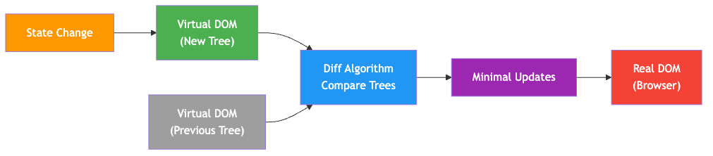
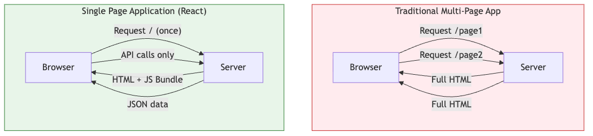
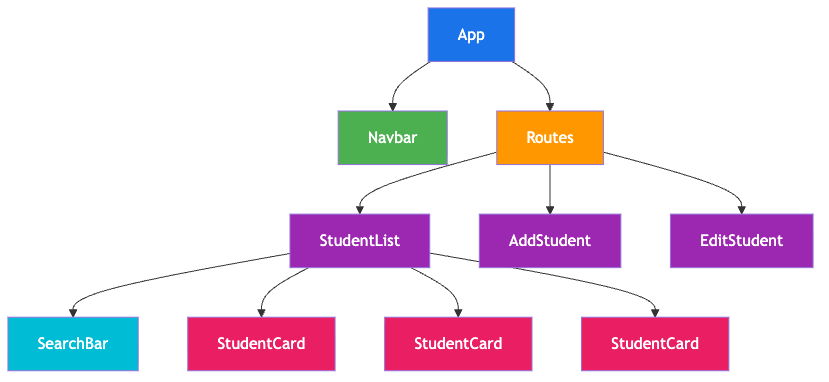
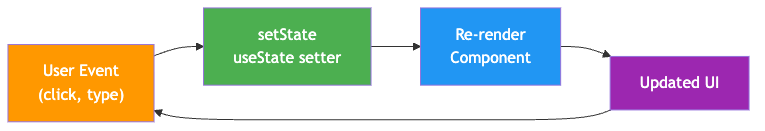
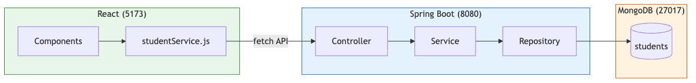
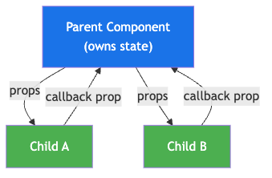

# React.js - Unit IV

### Building Modern User Interfaces

**B.E. IV Semester - Information Technology**

Instructor: Krushi Raj Tula
GitHub: github.com/krushiraj/spring-boot-demo

<!-- Speaker notes: Welcome students. This unit covers React.js - the most popular JavaScript library for building user interfaces. By the end of this unit, you will be able to build single-page applications with React using modern tools. Ask students about their experience with JavaScript so far. -->

---

## What is React?

- A **JavaScript library** for building user interfaces
- Created by **Facebook (Meta)** in 2013
- Open-source and maintained by a large community
- Used by: Facebook, Instagram, Netflix, Airbnb, WhatsApp Web

### Key Philosophy

> "Learn once, write anywhere"

- **Declarative** - describe *what* the UI should look like
- **Component-based** - build encapsulated, reusable pieces
- **Unidirectional data flow** - data flows top-down

<!-- Speaker notes: Emphasize that React is a library, not a framework like Angular. It focuses only on the view layer. Ask students if they've used any of the websites listed - they've already been using React without knowing it! Mention that React Native extends this to mobile apps. -->

---

## Why React?

| Feature | Benefit |
|---------|---------|
| Virtual DOM | Fast UI updates without full page reload |
| Component Reusability | Write once, use everywhere |
| Large Ecosystem | Thousands of packages and tools |
| Strong Community | Easy to find help and resources |
| Job Market | Most in-demand frontend skill |
| React Native | Same skills for mobile apps |

### npm downloads: **20M+ per week**

<!-- Speaker notes: Show npmtrends.com comparing React vs Angular vs Vue to give students a sense of popularity. Emphasize job market relevance - check local job boards for React positions. Ask: "How many of you have heard of React before?" -->

---

## Virtual DOM - The Secret Sauce



- React creates a lightweight copy of the real DOM
- When state changes, React diffs the Virtual DOM
- Only the changed nodes are updated in the real DOM

<!-- Speaker notes: Draw this on the whiteboard step by step. The key insight is that DOM manipulation is expensive - React batches and minimizes actual DOM updates. Use the analogy: "Imagine editing a Word document vs rewriting the whole thing every time you change a word." Do a live demo showing how many DOM nodes a simple page has using document.querySelectorAll('*').length in the console. -->

---

## How Virtual DOM Diffing Works


- This process is called **Reconciliation**
- Makes React extremely fast even with complex UIs

<!-- Speaker notes: Explain reconciliation step by step. Mention that React uses a heuristic O(n) algorithm instead of O(n^3) for tree comparison. Don't go too deep into the algorithm - just emphasize that React is smart about what it updates. Common question: "Is Virtual DOM faster than direct DOM?" - Answer: Not always for single changes, but for complex UIs with many updates, it's much more efficient. -->

---

## SPA vs Traditional Websites



- **Traditional**: Server sends full HTML on every navigation
- **SPA**: Load once, React handles navigation client-side

<!-- Speaker notes: Open two tabs - one with a traditional website (e.g., a university portal) and one with Gmail or Twitter. Navigate around both and point out the page reload vs smooth transition difference. Ask: "Which feels faster?" This is a great time to show the Network tab in DevTools to see full page loads vs API calls. -->

---

## SPA Advantages and Trade-offs

### Advantages
- Faster navigation after initial load
- Better user experience (no page flicker)
- Reduced server load (only JSON data)
- Native app-like feel

### Trade-offs
- Larger initial bundle size
- SEO can be challenging (solved by Next.js)
- Requires JavaScript enabled in browser
- More complex development setup

<!-- Speaker notes: Be honest about trade-offs - this shows maturity in engineering decisions. Mention that frameworks like Next.js solve many SPA limitations with Server-Side Rendering (SSR). Ask students: "When would you NOT use an SPA?" Good answers: simple static sites, content-heavy blogs, sites that need to work without JS. -->

---

## Creating a React App with Vite

### Why Vite? (pronounced "veet" - French for "fast")
- Lightning-fast dev server with Hot Module Replacement
- Optimized production builds
- Modern and lightweight

```bash
# Create a new React project
npm create vite@latest my-react-app -- --template react

cd my-react-app
npm install
npm run dev
```

Server starts at `http://localhost:5173`

<!-- Speaker notes: DO A LIVE DEMO HERE. Open terminal, run these commands step by step. Let students see Vite's speed - it starts in under a second. Point out the --template react flag. Show the browser with the default Vite+React page. Compare with Create React App which is now deprecated. -->

---

## Vite + React Project Structure

```
my-react-app/
+-- node_modules/        # Dependencies (don't touch!)
+-- public/              # Static assets (favicon, images)
+-- src/
|   +-- assets/          # Images, fonts, etc.
|   +-- App.css          # App component styles
|   +-- App.jsx          # Main App component
|   +-- index.css        # Global styles
|   +-- main.jsx         # Entry point (mounts React)
+-- index.html           # Single HTML file (the "S" in SPA)
+-- package.json         # Project config & dependencies
+-- vite.config.js       # Vite configuration
```

- **main.jsx** - Where React attaches to the DOM
- **App.jsx** - Your root component

<!-- Speaker notes: Open the project in VS Code and walk through each file. Show index.html - point out the single div with id="root". Open main.jsx and explain createRoot. Open App.jsx and show the default component. Ask students: "Where is the HTML?" - Trick question, the HTML is generated by React! Mention node_modules should never be committed to git. -->

---

## The Entry Point - main.jsx

```jsx
import React from 'react'
import ReactDOM from 'react-dom/client'
import App from './App.jsx'
import './index.css'

ReactDOM.createRoot(
  document.getElementById('root')
).render(
  <React.StrictMode>
    <App />
  </React.StrictMode>
)
```

- `createRoot` - Creates a React root in the DOM
- `render` - Renders the App component into that root
- `StrictMode` - Helps find bugs during development

<!-- Speaker notes: Walk through each line. Explain that this is the bridge between React and the browser DOM. StrictMode intentionally double-renders components in development to catch side effects - don't worry if you see console logs appearing twice. Show index.html and where the div id="root" is. This file rarely needs changes. -->

---

## JSX Introduction

**JSX** = JavaScript XML - A syntax extension for JavaScript

```jsx
// This is JSX - looks like HTML but it's JavaScript!
const element = <h1>Hello, React!</h1>;

// Babel/Vite compiles it to:
const element = React.createElement(
  'h1', null, 'Hello, React!'
);
```

### JSX is NOT HTML - it's syntactic sugar!

- JSX produces **React elements** (plain JS objects)
- Browsers don't understand JSX directly
- Vite transforms JSX to JavaScript at build time

<!-- Speaker notes: Emphasize that JSX is not a separate language - it's JavaScript with HTML-like syntax. Show the Babel REPL (babeljs.io/repl) to demonstrate how JSX compiles to React.createElement calls. This helps demystify what React is doing under the hood. Ask: "Why not just write React.createElement everywhere?" - Because JSX is much more readable! -->

---

## JSX Syntax Rules - Single Root Element

### Must return a single root element

```jsx
// WRONG - multiple root elements
return (
  <h1>Title</h1>
  <p>Text</p>
);

// CORRECT - wrap in a parent element
return (
  <div>
    <h1>Title</h1>
    <p>Text</p>
  </div>
);
```

<!-- Speaker notes: The single root rule is because JSX compiles to a single function call. Show the error message students will see if they forget this. -->

---

## JSX Syntax Rules - Fragments

### Use Fragments to avoid extra DOM nodes

```jsx
// Fragment syntax (no extra DOM node)
return (
  <>
    <h1>Title</h1>
    <p>Text</p>
  </>
);
```

- `<> </>` is shorthand for `<React.Fragment>`
- Doesn't add extra nodes to the DOM
- Always start your return with parentheses and a single wrapper

<!-- Speaker notes: Introduce Fragments as the clean solution - they don't add extra DOM nodes. Common mistake: students will forget the single root rule and get confused by the error. Tip: Always start your return statement with parentheses and a single wrapper. -->

---

## JSX vs HTML Differences

| HTML | JSX | Why? |
|------|-----|------|
| `class="btn"` | `className="btn"` | `class` is reserved in JS |
| `for="email"` | `htmlFor="email"` | `for` is reserved in JS |
| `<br>` | `<br />` | All tags must be closed |
| `` | `` | Self-closing required |
| `onclick="..."` | `onClick={...}` | camelCase events |
| `style="color:red"` | `style={{color:'red'}}` | Object, not string |
| `tabindex="1"` | `tabIndex="1"` | camelCase attributes |

<!-- Speaker notes: This slide is a reference - students will come back to it often. The most common mistakes are className and self-closing tags. Explain WHY these differences exist: JSX is JavaScript, so reserved words like class and for can't be used. -->

---

## JSX - Inline Styles

```jsx
// HTML style in JSX uses objects with camelCase
<div style={{ backgroundColor: 'blue', fontSize: '16px' }}>
  Styled content
</div>
```

- Style attribute takes a **JavaScript object**, not a string
- CSS properties use **camelCase** (backgroundColor, not background-color)
- Values are strings (with units) or numbers (for px values)

<!-- Speaker notes: Show an error example if you use class instead of className. Tip: Install the ES7+ React/Redux/GraphQL/React-Native snippets VS Code extension. -->

---

## Embedding Expressions in JSX

Use **curly braces** `{}` to embed any JavaScript expression:

```jsx
function Greeting() {
  const name = "Krushi";
  const age = 25;

  return (
    <div>
      <h1>Hello, {name}!</h1>
      <p>Next year: {age + 1}</p>
      <p>Uppercase: {name.toUpperCase()}</p>
      <p>Date: {new Date().toLocaleDateString()}</p>
    </div>
  );
}
```

**Rule**: Anything inside `{}` must be a valid JS **expression** (not a statement).

<!-- Speaker notes: Key distinction: expressions return values, statements don't. You can put 2+2, function calls, ternary operators inside {}. You CANNOT put if/else, for loops, or variable declarations. Ask students: "Can you put an if statement inside {}?" - No! Use ternary operator instead. Live demo: Create this component and change the values to show reactivity. -->

---

## Rendering Elements

```jsx
// A React element is a plain JavaScript object
const element = <h1>Hello, World!</h1>;

// React DOM renders it to the actual DOM
const root = ReactDOM.createRoot(
  document.getElementById('root')
);
root.render(element);
```

### Key Points

- React elements are **immutable** - once created, can't change them
- To update the UI, create a **new element** and re-render
- In practice, React re-renders automatically when **state changes**
- React only updates what's **necessary** (Virtual DOM diffing)

<!-- Speaker notes: This is mostly theoretical - in practice, you rarely call root.render() directly. Components handle re-rendering through state. The key takeaway is that React elements are lightweight objects, not actual DOM nodes. They're cheap to create. -->

---

## Function Components

The building blocks of a React application:

```jsx
// Simple function component
function Welcome() {
  return <h1>Welcome to React!</h1>;
}

// Arrow function component (also valid)
const Welcome = () => {
  return <h1>Welcome to React!</h1>;
};
```

### Rules:
- Component names **must start with a capital letter**
- Must return **JSX** (or null)

<!-- Speaker notes: Explain that components are like custom HTML tags. Capital letter is required so React can distinguish between HTML elements (lowercase) and components (uppercase). Show what happens if you use a lowercase name - React treats it as an HTML tag. -->

---

## Using Components

```jsx
function App() {
  return (
    <div>
      <Welcome />
      <Welcome />
      <Welcome />
    </div>
  );
}
```

- Components can be **reused** multiple times
- Each instance is **independent**
- Class components exist but function components with hooks are the modern standard

<!-- Speaker notes: Live demo: Create a simple component and render it multiple times. Mention that class components exist but function components with hooks are the modern standard. -->

---

## Props - Passing Data to Components

Props = **Properties** passed from parent to child:

```jsx
function App() {
  return (
    <div>
      <StudentCard name="Alice" grade="A" />
      <StudentCard name="Bob" grade="B+" />
    </div>
  );
}

function StudentCard(props) {
  return (
    <div className="card">
      <h3>{props.name}</h3>
      <p>Grade: {props.grade}</p>
    </div>
  );
}
```

- Props are **read-only** - a child cannot modify its props
- Props flow **one-way**: parent -> child

<!-- Speaker notes: Use the analogy: "Props are like function arguments - you pass data in, the function uses it but doesn't change the original." This is the start of the Student Management example we'll build on. Live demo: Create these components and show how changing the props in the parent changes the child. -->

---

## Props Destructuring

Cleaner syntax to access props:

```jsx
// Without destructuring
function StudentCard(props) {
  return <h3>{props.name} - {props.grade}</h3>;
}

// With destructuring (preferred)
function StudentCard({ name, grade }) {
  return <h3>{name} - {grade}</h3>;
}

// With default values
function StudentCard({ name, grade = "N/A" }) {
  return <h3>{name} - {grade}</h3>;
}
```

<!-- Speaker notes: Destructuring is standard JavaScript (ES6), not React-specific. Show both syntaxes side by side - destructuring is cleaner and more common in real codebases. Default values are useful for optional props. -->

---

## Props Spread Operator

```jsx
// Passing all properties of an object
const student = { name: "Alice", grade: "A" };
<StudentCard {...student} />
// Same as: <StudentCard name="Alice" grade="A" />
```

- The spread operator `...` passes each object property as a separate prop
- Very common when passing objects as props
- Destructuring comes from ES6 object destructuring

<!-- Speaker notes: The spread operator (...) is very common when passing objects as props. Ask: "What JavaScript concept is destructuring from?" - Object destructuring from ES6. -->

---

## Component Composition

Building complex UIs from simple components:



> "Think in components" - Break UI into small, reusable pieces

<!-- Speaker notes: Draw this on the whiteboard for a Student Management System. Start with the full UI and break it down. Ask students: "If we have a student list page, what components do you see?" Guide them to identify Header, StudentList, StudentCard, SearchBar, etc. This is the React mental model - everything is a component tree. Mention that React DevTools shows this tree in the browser. -->

---

## Composition Example - Components

```jsx
function Header({ title }) {
  return <h1>{title}</h1>;
}

function StudentCard({ name, id }) {
  return (
    <div className="card">
      <p><strong>{name}</strong> (ID: {id})</p>
    </div>
  );
}

function StudentList({ students }) {
  return (
    <div>
      {students.map(s => (
        <StudentCard key={s.id} name={s.name} id={s.id} />
      ))}
    </div>
  );
}
```

<!-- Speaker notes: Live demo: Build this step by step. Start with App, then extract Header, then StudentCard, then StudentList. Show how data flows from App down through props. Point out the key prop on StudentCard - we'll explain why later. -->

---

## Composition Example - App Component

```jsx
function App() {
  const students = [
    { id: 1, name: "Alice" },
    { id: 2, name: "Bob" },
  ];
  return (
    <>
      <Header title="Student Manager" />
      <StudentList students={students} />
    </>
  );
}
```

- Data flows from **App** down through **props**
- Each component has a **single responsibility**
- This is the Student Management example we'll keep building

<!-- Speaker notes: This is the Student Management example we'll keep building throughout the slides. -->

---

## useState Hook

Adding **state** (dynamic data) to components:

```jsx
import { useState } from 'react';

function Counter() {
  const [count, setCount] = useState(0);

  return (
    <div>
      <p>Count: {count}</p>
      <button onClick={() => setCount(count + 1)}>+</button>
      <button onClick={() => setCount(count - 1)}>-</button>
      <button onClick={() => setCount(0)}>Reset</button>
    </div>
  );
}
```

- `useState` returns `[currentValue, setterFunction]`
- Calling the setter **re-renders** the component

<!-- Speaker notes: LIVE DEMO - this is a critical concept. Build the counter step by step. First without state (hardcoded), then add useState. Show that clicking the button re-renders the component with the new value. Ask: "What happens if we just do count = count + 1 instead of setCount?" - Nothing! React doesn't know to re-render. -->

---

## State vs Props - Comparison

| Feature | Props | State |
|---------|-------|-------|
| **Ownership** | Passed from parent | Owned by component |
| **Mutability** | Read-only | Can be updated with setter |
| **Purpose** | Configure child | Track changing data |
| **Updates** | When parent re-renders | When setter is called |
| **Direction** | Parent -> Child | Internal to component |

> State in a parent becomes props in a child.

<!-- Speaker notes: This is one of the most important concepts. Draw a diagram showing data flowing down as props and state being internal. The quote at the bottom is key. -->

---

## State vs Props - Example

```jsx
function App() {
  const [score, setScore] = useState(0);  // state
  return <Display value={score} />;       // prop
}

function Display({ value }) {
  return <p>Score: {value}</p>;
  // Cannot change 'value' here!
}
```

- Props are like **arguments** to a function
- State is like **local variables** inside a function
- If data changes over time and this component owns it, use **state**
- If it's passed from above, use **props**

<!-- Speaker notes: Use the analogy: Props are like arguments to a function. State is like local variables inside a function. Common question: "When do I use state vs props?" - If the data changes over time and this component owns it, use state. If it's passed from above, use props. -->

---

## State Immutability - Arrays

**Never modify state directly** - always create new values:

```jsx
function StudentManager() {
  const [students, setStudents] = useState([
    { id: 1, name: "Alice" }
  ]);

  // WRONG - mutating state directly
  const addWrong = () => {
    students.push({ id: 2, name: "Bob" });
    setStudents(students); // Same reference!
  };

  // CORRECT - create a new array
  const addCorrect = () => {
    setStudents([...students, { id: 2, name: "Bob" }]);
  };
}
```

<!-- Speaker notes: This is a very common source of bugs. Explain WHY immutability matters: React compares references to detect changes. If you mutate the existing array and pass it to setState, React sees the same reference and may skip re-rendering. -->

---

## State Immutability - Operations

```jsx
// ADD - spread into new array
setStudents([...students, { id: 2, name: "Bob" }]);

// REMOVE - filter creates a new array
const removeStudent = (id) => {
  setStudents(students.filter(s => s.id !== id));
};

// UPDATE - map creates a new array
const updateGrade = (id, grade) => {
  setStudents(students.map(s =>
    s.id === id ? { ...s, grade } : s
  ));
};
```

- Spread operator `...` creates a shallow copy
- `filter()` and `map()` always return new arrays

<!-- Speaker notes: For objects, use {...obj, key: newValue}. For arrays: add with [...arr, item], remove with filter(), update with map(). Live demo showing the bug with direct mutation. -->

---

## useEffect Hook

Perform **side effects** in components:

```jsx
import { useState, useEffect } from 'react';

function StudentDashboard() {
  const [students, setStudents] = useState([]);
  const [loading, setLoading] = useState(true);

  useEffect(() => {
    fetch('/api/students')
      .then(res => res.json())
      .then(data => {
        setStudents(data);
        setLoading(false);
      });
  }, []); // Empty array = run only once on mount

  if (loading) return <p>Loading...</p>;
  return <ul>{students.map(s =>
    <li key={s.id}>{s.name}</li>
  )}</ul>;
}
```

<!-- Speaker notes: Side effects = anything outside of rendering: API calls, timers, DOM manipulation, subscriptions. The dependency array is crucial. Live demo: Fetch data from jsonplaceholder.typicode.com/users. Common mistake: Forgetting the dependency array causes infinite loops! -->

---

## useEffect Dependency Array

```jsx
// 1. No dependency array - runs after EVERY render
useEffect(() => {
  console.log("Runs on every render");
});

// 2. Empty array - runs ONCE after first render
useEffect(() => {
  console.log("Runs once on mount");
}, []);

// 3. With dependencies - runs when values change
useEffect(() => {
  fetchResults(query);
}, [query]);
```

<!-- Speaker notes: Draw a timeline on the board showing when each version fires. The dependency array tells React: "Only re-run this effect if these values changed." Common question: "What goes in the dependency array?" - Any value from props or state that the effect uses. -->

---

## useEffect Cleanup

```jsx
// Cleanup function - runs on unmount
useEffect(() => {
  const timer = setInterval(() => tick(), 1000);
  return () => clearInterval(timer); // Cleanup!
}, []);
```

- Cleanup prevents **memory leaks**
- Runs before the next effect or on unmount
- Use for: timers, subscriptions, event listeners

<!-- Speaker notes: The cleanup function is important for preventing memory leaks - timers, subscriptions, event listeners should be cleaned up. React will warn you with ESLint if you miss a dependency. -->

---

## Component Lifecycle with Hooks

```
  Class Component             Function + Hooks Equivalent
  ===============             ==========================
  constructor()          -->  useState()
  componentDidMount()    -->  useEffect(() => {}, [])
  componentDidUpdate()   -->  useEffect(() => {}, [deps])
  componentWillUnmount() -->  useEffect cleanup function
```

### Timeline

```
  Mount:    [useState init] -> [render] -> [useEffect[]]
  Update:   [render] -> [useEffect[deps]]
  Unmount:  [cleanup functions run]
```

- Hooks replaced class lifecycle methods
- Simpler mental model: **effects run after render**

<!-- Speaker notes: If students have seen class components in tutorials, this mapping helps. If not, focus on the bottom half - the timeline. The key mental model: useState initializes, render produces JSX, useEffect runs after the render is committed to the DOM. -->

---

## Event Handling

React uses **camelCase** event handlers:

```jsx
function StudentForm() {
  const [name, setName] = useState('');

  const handleSubmit = (e) => {
    e.preventDefault();
    console.log("Submitted:", name);
  };

  return (
    <form onSubmit={handleSubmit}>
      <input type="text" value={name}
        onChange={(e) => setName(e.target.value)}
        placeholder="Student name" />
      <button type="submit">Add</button>
    </form>
  );
}
```

- `e.preventDefault()` prevents page reload on form submit
- Pass function **references**, not calls: `onClick={fn}` not `onClick={fn()}`

<!-- Speaker notes: Live demo: Build this form step by step. Key points: (1) Events are camelCase (onClick not onclick), (2) Pass function references, not calls. Common mistake: onClick={handleClick()} - this calls the function immediately! -->

---

## Synthetic Events

React wraps browser events in **SyntheticEvent** objects:

```jsx
function EventDemo() {
  const handleClick = (event) => {
    console.log(event.type);    // "click"
    console.log(event.target);  // DOM element
    event.preventDefault();
    event.stopPropagation();
  };
  return <button onClick={handleClick}>Click Me</button>;
}
```

### Common Events in React

| Event | Use Case |
|-------|----------|
| `onClick` | Button clicks |
| `onChange` | Input/select changes |
| `onSubmit` | Form submission |
| `onKeyDown` | Keyboard input |

<!-- Speaker notes: Synthetic events normalize browser differences - your code works the same across Chrome, Firefox, Safari, etc. Most of the time, you'll use onClick and onChange. -->

---

## Controlled Components

React **controls** the form input value via state:

```jsx
function NameInput() {
  const [name, setName] = useState('');
  return (
    <div>
      <input type="text"
        value={name}
        onChange={(e) => setName(e.target.value)} />
      <p>You typed: {name}</p>
    </div>
  );
}
```



- **Single source of truth**: State is the source, input reflects it

<!-- Speaker notes: This is a critical pattern. In vanilla HTML, the DOM owns the input value. In React, STATE owns the value and the input just displays it. Show a live demo where you type and see the text reflected below. Then show forcing uppercase with setName(e.target.value.toUpperCase()). -->

---

## Form Handling - Validation Logic

```jsx
function AddStudentForm({ onAdd }) {
  const [name, setName] = useState('');
  const [email, setEmail] = useState('');
  const [errors, setErrors] = useState({});

  const validate = () => {
    const errs = {};
    if (!name.trim()) errs.name = "Name is required";
    if (!email.includes("@"))
      errs.email = "Valid email required";
    return errs;
  };

  const handleSubmit = (e) => {
    e.preventDefault();
    const errs = validate();
    if (Object.keys(errs).length > 0) {
      setErrors(errs); return;
    }
    onAdd({ name, email });
    setName(''); setEmail(''); setErrors({});
  };
```

<!-- Speaker notes: Walk through validation step by step. Point out: (1) Multiple state variables for each input, (2) Validation function returns an error object, (3) Form resets after successful submission. -->

---

## Form Handling - JSX Template

```jsx
  return (
    <form onSubmit={handleSubmit}>
      <input value={name}
        onChange={e => setName(e.target.value)}
        placeholder="Name" />
      {errors.name && <span>{errors.name}</span>}

      <input value={email}
        onChange={e => setEmail(e.target.value)}
        placeholder="Email" />
      {errors.email && <span>{errors.email}</span>}

      <button type="submit">Add Student</button>
    </form>
  );
}
```

- Errors displayed conditionally with `&&`
- `onAdd` is a callback prop - data flows **UP** to the parent

<!-- Speaker notes: Live demo: Build this and show validation errors appearing. The onAdd callback pattern is how data flows up - the child calls the parent's function with data. -->

---

## Conditional Rendering - Ternary

Show or hide UI elements based on conditions:

```jsx
function StudentStatus({ isEnrolled, name }) {
  return (
    <div>
      <h3>{name}</h3>
      {isEnrolled
        ? <span className="badge green">Active</span>
        : <span className="badge red">Inactive</span>
      }
    </div>
  );
}
```

- **Ternary operator** for either/or rendering
- Great for toggling between two states

<!-- Speaker notes: Three patterns to know for conditional rendering. The ternary is the most common for either/or choices. Live demo: Toggle isEnrolled between true and false to show the ternary. -->

---

## Conditional Rendering - AND & Early Return

```jsx
// Method 2: Logical AND (&&) - show/hide
function Notification({ messages }) {
  return (
    <div>
      {messages.length > 0 && (
        <p>You have {messages.length} new messages</p>
      )}
    </div>
  );
}

// Method 3: Early return - guard clauses
function ProtectedContent({ isLoggedIn }) {
  if (!isLoggedIn) return <p>Please log in</p>;
  return <div>Secret student data...</div>;
}
```

- `&&` works because: `true && <JSX>` returns `<JSX>`
- **GOTCHA**: `0 && <JSX>` renders "0"! Use `length > 0`

<!-- Speaker notes: The && pattern works because: true && <JSX> returns <JSX>, false && <JSX> returns false (React ignores false). GOTCHA: 0 && <JSX> renders "0" on screen! Use messages.length > 0 not just messages.length. Ask: "When would you use each pattern?" -->

---

## Lists with map() and Keys

Rendering arrays of data:

```jsx
function StudentList() {
  const students = [
    { id: 1, name: "Alice", grade: "A" },
    { id: 2, name: "Bob", grade: "B+" },
    { id: 3, name: "Charlie", grade: "A-" },
  ];

  return (
    <ul>
      {students.map(student => (
        <li key={student.id}>
          {student.name} - Grade: {student.grade}
        </li>
      ))}
    </ul>
  );
}
```

### Rules for Keys:
- Must be **unique** among siblings and **stable**
- Use **database IDs** - never use array index as key!

<!-- Speaker notes: map() is the most common way to render lists in React. The key prop is REQUIRED - React uses it to efficiently update the list. Live demo: Start without keys and show the console warning. Then add keys. -->

---

## Why Keys Matter

```
  Without proper keys (using index):
  ==================================
  Before:               After removing "Bob":
  [0] Alice             [0] Alice
  [1] Bob    <-- del    [1] Charlie  (React thinks Bob
  [2] Charlie                        became Charlie!)

  With proper keys (using id):
  ============================
  Before:               After removing "Bob":
  [id:1] Alice          [id:1] Alice
  [id:2] Bob  <-- del   [id:3] Charlie  (React knows
  [id:3] Charlie                         Bob was removed!)
```

- Without keys, React re-renders ALL items unnecessarily
- With keys, React knows exactly which item changed

<!-- Speaker notes: This is one of the most common React mistakes. Draw the diagram on the whiteboard. When using index as key and you delete the second item, React sees the wrong mapping. -->

---

## Keys - Good vs Bad

```jsx
// BAD: index can change when items reorder
{items.map((item, index) => (
  <li key={index}>{item}</li>
))}

// GOOD: stable, unique identifier
{items.map(item => (
  <li key={item.id}>{item.name}</li>
))}
```

- **Performance**: Correct keys = minimal DOM updates
- Always use a unique, stable ID from your data

<!-- Speaker notes: Show a demo with a sortable or deletable list to illustrate the bug with index keys. -->

---

## React Router - Setup

Install React Router for client-side navigation:

```bash
npm install react-router-dom
```

### Basic Setup in main.jsx

```jsx
import { BrowserRouter } from 'react-router-dom';
import App from './App';

ReactDOM.createRoot(document.getElementById('root')).render(
  <BrowserRouter>
    <App />
  </BrowserRouter>
);
```

- Wrap the entire app in `BrowserRouter` to enable routing
- Using React Router v6

<!-- Speaker notes: React Router is the standard routing library for React SPAs. Wrap the entire app in BrowserRouter - this enables routing throughout your component tree. We're using React Router v6 which has a different API from v5 (many tutorials online use v5 - watch out!). -->

---

## React Router - Key Components

| Component | Purpose |
|-----------|---------|
| `BrowserRouter` | Provides routing context |
| `Routes` | Container for Route definitions |
| `Route` | Maps a URL path to a component |
| `Link` | Navigation without page reload |
| `NavLink` | Link with active styling |

<!-- Speaker notes: Live demo: Install react-router-dom and set up the BrowserRouter wrapper. -->

---

## Defining Routes

```jsx
function App() {
  return (
    <div>
      <nav>
        <Link to="/">Home</Link>
        <Link to="/students">Students</Link>
      </nav>
      <Routes>
        <Route path="/" element={<Home />} />
        <Route path="/students" element={<StudentList />}/>
        <Route path="/students/:id" element={<StudentDetail />} />
        <Route path="*" element={<NotFound />} />
      </Routes>
    </div>
  );
}
```

- `path="*"` catches unmatched routes (404) | `:id` is a dynamic URL parameter

<!-- Speaker notes: Walk through each route. The order doesn't matter in v6 (React Router picks the most specific match). Live demo: Set up these routes and navigate between them. Show that the URL changes but the page doesn't reload. -->

---

## Link, NavLink, useNavigate

```jsx
function Navigation() {
  const navigate = useNavigate();
  return (
    <nav>
      <Link to="/">Home</Link>
      <NavLink to="/students"
        className={({ isActive }) =>
          isActive ? "active" : ""}>
        Students
      </NavLink>
      <button onClick={() => navigate('/login')}>
        Logout
      </button>
    </nav>
  );
}
```

| Hook/Component | Purpose |
|---|---|
| `Link` | Navigation without page reload |
| `NavLink` | Link with active class styling |
| `useNavigate` | Programmatic navigation in handlers |

<!-- Speaker notes: Three ways to navigate: (1) Link - simple navigation, (2) NavLink - knows if it's the active route, (3) useNavigate - programmatic navigation in event handlers. Show the difference between Link and a regular <a> tag in DevTools. -->

---

## useParams - Reading URL Parameters

```jsx
function StudentDetail() {
  const { id } = useParams();
  const [student, setStudent] = useState(null);

  useEffect(() => {
    fetch(`/api/students/${id}`)
      .then(res => res.json())
      .then(setStudent);
  }, [id]);

  if (!student) return <p>Loading...</p>;
  return <h2>{student.name} - {student.email}</h2>;
}
```

- Route: `<Route path="/students/:id" ... />`
- `useParams()` returns `{ id: "42" }` — always strings

<!-- Speaker notes: useParams extracts the dynamic segments from the URL. If the route is /students/:id and the URL is /students/42, then id = "42" (always a string!). Notice the useEffect depends on [id]. -->

---

## Building a Complete SPA



**React Router** handles URLs | **Components** render views | **useState/useEffect** manage data

<!-- Speaker notes: This ties everything together. Draw this architecture on the whiteboard. Each page is a component, each component manages its own state and effects. The router decides which component to show based on the URL. Ask: "What Spring Boot endpoints would we need for this?" -->

---

## SPA Example - App Component

```jsx
import { useState, useEffect } from 'react';
import { Routes, Route, Link } from 'react-router-dom';

function App() {
  return (
    <div>
      <nav>
        <Link to="/">Home</Link>{" | "}
        <Link to="/students">Students</Link>
      </nav>
      <Routes>
        <Route path="/" element={<Home />} />
        <Route path="/students" element={<Students />} />
      </Routes>
    </div>
  );
}
```

<!-- Speaker notes: Live demo: Build this from scratch in 10 minutes. Use jsonplaceholder as the API since we don't need a backend. -->

---

## SPA Example - Students Component

```jsx
function Students() {
  const [students, setStudents] = useState([]);

  useEffect(() => {
    fetch("https://jsonplaceholder.typicode.com/users")
      .then(r => r.json())
      .then(setStudents);
  }, []);

  return (
    <ul>
      {students.map(s =>
        <li key={s.id}>{s.name} - {s.email}</li>
      )}
    </ul>
  );
}
```

Combines **useState** + **useEffect** + **map()** + **keys** — everything we've learned!

<!-- Speaker notes: Walk through each concept as you code: components, state, effects, routing, lists, keys. This is the culmination of everything we've learned. If time allows, add a search filter. -->

---

## useState with Objects

```jsx
const [student, setStudent] = useState({
  name: '', email: '', department: ''
});

const handleChange = (e) => {
  setStudent(prev => ({
    ...prev,              // keep other fields
    [e.target.name]: e.target.value  // update this field
  }));
};

// One handler for all inputs:
<input name="name" value={student.name} onChange={handleChange} />
<input name="email" value={student.email} onChange={handleChange} />
```

- `...prev` spread keeps existing fields, `[name]` updates only the changed one

<!-- Speaker notes: This pattern uses a single state object instead of multiple useState calls. The handleChange function uses computed property names [name] to update the right field. -->

---

## Multiple useState vs Object State

```jsx
// Approach 1: Multiple useState (simpler)
const [name, setName] = useState('');
const [email, setEmail] = useState('');
const [grade, setGrade] = useState('A');

// Approach 2: Single object state (grouped)
const [student, setStudent] = useState({
  name: '', email: '', grade: 'A'
});
// Easy to reset all at once

// Approach 3: useReducer (complex logic)
// For many state transitions - advanced topic
```

### Rule of thumb:
- **Few independent values** -> Multiple useState
- **Related fields (forms)** -> Single object useState
- **Complex logic** -> useReducer (advanced)

<!-- Speaker notes: There's no single right answer - it depends on the use case. Multiple useState is simpler and more explicit. Object state is cleaner for forms with many fields. Ask students which approach they'd use for a student registration form with 10 fields. -->

---

## Lifting State Up

When siblings need to share data, lift state to their parent:

```jsx
function App() {
  const [students, setStudents] = useState([]);
  const addStudent = (s) => {
    setStudents([...students, { ...s, id: Date.now() }]);
  };
  return (
    <div>
      <AddStudentForm onAdd={addStudent} />
      <StudentList students={students} />
    </div>
  );
}
```

<!-- Speaker notes: This is a crucial React pattern. When two components need the same data, move the state to their closest common parent. -->

---

## Data Flow in React



- **Props flow down** — parent passes data to children
- **Callbacks flow up** — child calls parent's function to update state
- This is **one-way data binding** — data has a single source of truth

<!-- Speaker notes: Draw this on the board. The parent owns the state and passes it down as props. The child can "send data up" by calling a callback function (onAdd). This is fundamentally different from Angular's two-way binding. -->

---

## Student Manager - State & Logic

```jsx
function App() {
  const [students, setStudents] = useState([]);
  const [search, setSearch] = useState('');

  const addStudent = (name) => {
    setStudents(prev => [
      ...prev, { id: Date.now(), name }
    ]);
  };

  const removeStudent = (id) => {
    setStudents(prev => prev.filter(s => s.id !== id));
  };

  const filtered = students.filter(s =>
    s.name.toLowerCase().includes(search.toLowerCase())
  );
```

<!-- Speaker notes: LIVE DEMO: Build this from scratch. This combines everything: state, controlled inputs, lists, keys, callbacks, filtering. -->

---

## Student Manager - UI

```jsx
  return (
    <div>
      <h1>Student Manager</h1>
      <input placeholder="Search..." value={search}
             onChange={e => setSearch(e.target.value)} />
      <AddForm onAdd={addStudent} />
      <ul>
        {filtered.map(s => (
          <li key={s.id}>
            {s.name}
            <button onClick={() => removeStudent(s.id)}>
              Remove
            </button>
          </li>
        ))}
      </ul>
    </div>
  );
}
```

- Combines: state, controlled inputs, lists, keys, callbacks
- Search filtering with `filter()` and `toLowerCase()`

<!-- Speaker notes: Walk through each feature: (1) Adding students, (2) Removing with filter, (3) Searching with controlled input. Let students try to build it themselves first, then reveal the solution. -->

---

## Common React Patterns

```jsx
// 1. Loading state pattern
const [data, setData] = useState(null);
const [loading, setLoading] = useState(true);
const [error, setError] = useState(null);

// 2. Toggle pattern
const [isOpen, setIsOpen] = useState(false);
const toggle = () => setIsOpen(prev => !prev);

// 3. Previous state pattern
setCount(prev => prev + 1); // Always use prev!

// 4. Computed values (no need for state)
const fullName = `${firstName} ${lastName}`;
const total = items.reduce((sum, i) => sum + i.price, 0);
```

<!-- Speaker notes: This is a reference slide - students can come back to it. Emphasize pattern 3: always use the functional form of setState when the new state depends on the old state. -->

---

## Common Anti-Patterns

### Avoid these mistakes:

- Storing **derived/computed** values in state
- Copying **props** into state unnecessarily
- Using **index as key** in dynamic lists

```jsx
// Callback pattern (child to parent)
<Child onAction={(data) => handleAction(data)} />
```

- If you can compute it from existing state/props, don't add a new state variable

<!-- Speaker notes: Mention the anti-patterns - especially "don't copy props into state" which is a very common beginner mistake. -->

---

## Debugging React Apps

### React Developer Tools (Browser Extension)

```
  Install: Chrome Web Store -> "React Developer Tools"

  Two new tabs in DevTools:
  +-- Components: View component tree, props, state
  +-- Profiler: Measure render performance

  Components Tab:
  +-App
    +-Header
    +-StudentList
      +-StudentCard  props: {name: "Alice", id: 1}
      +-StudentCard  props: {name: "Bob", id: 2}
```

<!-- Speaker notes: LIVE DEMO: Install React DevTools and show the Components tab. Click on a component and show its props and state in real time. This is the most valuable debugging tool for React. -->

---

## Common Debugging Tips

| Problem | Solution |
|---------|----------|
| Component not rendering | Check spelling, capitalization |
| State not updating | Are you using the setter? |
| Infinite loop | Check useEffect dependencies |
| Stale state in callbacks | Use functional setState |
| Console warning about keys | Add unique key to list items |

<!-- Speaker notes: Walk through each common problem and show how to identify it. The infinite loop from useEffect is the most dramatic - show it carefully. Teach students to read error messages - React has excellent error messages. -->

---

## React 18 Features (Brief Overview)

### What's New in React 18.3.x

- **Automatic Batching**: Multiple setState calls batched into one render
- **Concurrent Features**: UI stays responsive during heavy updates
- **Strict Mode** (dev only): Double-renders to catch side effects
- **createRoot API**: New way to mount React apps

```jsx
// Automatic batching example
function handleClick() {
  setCount(c => c + 1);  // Does NOT re-render yet
  setFlag(f => !f);       // Does NOT re-render yet
  // React re-renders ONCE here (batched!)
}
```

<!-- Speaker notes: Keep this brief. The key takeaway is automatic batching: React 18 batches state updates even inside promises and setTimeout. Strict Mode double-rendering confuses beginners - explain it only happens in development. -->

---

## Project Best Practices - Structure

```
src/
+-- components/
|   +-- Header/
|   |   +-- Header.jsx
|   |   +-- Header.css
|   +-- StudentCard/
|   |   +-- StudentCard.jsx
|   |   +-- StudentCard.css
+-- pages/
|   +-- Home.jsx
|   +-- StudentList.jsx
+-- hooks/         (custom hooks)
+-- utils/         (helper functions)
+-- App.jsx
+-- main.jsx
```

<!-- Speaker notes: Good project structure makes code maintainable. The component folder pattern (component + its CSS together) is very common. Pages are components too, but they represent full views mapped to routes. -->

---

## Project Best Practices - Naming

### Naming Conventions
- Components: **PascalCase** (StudentCard.jsx)
- Functions/variables: **camelCase** (handleSubmit)
- CSS files: Match component name (StudentCard.css)

### Organization Tips
- Separate **pages** (route-level) from **components** (reusable)
- Group related files together
- As project grows, add: `services/`, `context/`, `constants/`

<!-- Speaker notes: Ask: "Why separate pages from components?" - Pages are route-level, components are reusable building blocks. -->

---

## Common Mistakes - Part 1

```jsx
// 1. Forgetting to return JSX
function Bad() {
  <h1>I forgot return!</h1>  // Returns undefined!
}

// 2. Mutating state directly
students.push(newStudent);    // WRONG
setStudents([...students, newStudent]); // CORRECT

// 3. Calling function instead of passing reference
<button onClick={handleClick()}>  // WRONG
<button onClick={handleClick}>    // CORRECT
```

<!-- Speaker notes: Go through each mistake and ask students: "What's wrong here?" The most common is #3 - passing handleClick() instead of handleClick. -->

---

## Common Mistakes - Part 2

```jsx
// 4. Missing dependency in useEffect
useEffect(() => {
  fetchData(userId);  // Uses userId but not in deps!
}, []);               // Should be [userId]

// 5. Using state for derived values
const [fullName, setFullName] = useState(
  first + " " + last  // WRONG - just compute it!
);
const fullName = `${first} ${last}`; // CORRECT
```

- ESLint exhaustive-deps rule helps catch mistake #4
- Save this reference - you will encounter all of these!

<!-- Speaker notes: The most confusing is #4 - the ESLint exhaustive-deps rule helps catch this. Encourage students to come back to this slide when debugging. -->

---

## Summary Table

| Concept | Purpose | Example |
|---------|---------|---------|
| JSX | HTML-like syntax in JS | `<h1>{name}</h1>` |
| Component | Reusable UI piece | `function Card() {}` |
| Props | Pass data to children | `<Card name="X" />` |
| useState | Manage local state | `const [x, setX] = useState(0)` |
| useEffect | Side effects | `useEffect(() => {}, [])` |
| Events | Handle user actions | `onClick={handler}` |
| Controlled | React-managed forms | `value={state}` |
| Conditional | Show/hide UI | `{flag && <X />}` |
| Lists | Render arrays | `arr.map(i => <X key />)` |
| Router | Client navigation | `<Route path="/" />` |

<!-- Speaker notes: Use this as a recap slide. Point to each row and ask a student to explain the concept in their own words. This is a good exercise to check understanding before moving to the lab. -->

---

## Key Takeaways

1. **React is declarative** - describe WHAT, not HOW
2. **Components are functions** that return JSX
3. **Props flow down**, callbacks flow up
4. **useState** for local data, **useEffect** for side effects
5. **Virtual DOM** makes updates efficient
6. **Keys** help React identify list items
7. **Controlled components** for form inputs
8. **React Router** for SPA navigation

### The React Mental Model

```
  UI = f(state)

  Your UI is a function of your state.
  When state changes, the UI automatically updates.
```

<!-- Speaker notes: This is the most important slide conceptually. UI = f(state) is the core insight of React. Everything else is just implementation details. If students understand this formula, they understand React. -->

---

## What's Next - Labs & Practice

### Lab Exercises (Upcoming)
1. **Lab 1**: Set up Vite + React, create first components
2. **Lab 2**: Build Student Manager with useState
3. **Lab 3**: Add API calls with useEffect (connect to Spring Boot)
4. **Lab 4**: Full SPA with React Router

### Practice Resources
- [React Official Docs](https://react.dev) - Interactive tutorials
- [Vite Guide](https://vitejs.dev/guide/)
- [React Router Docs](https://reactrouter.com/)

<!-- Speaker notes: Point students to react.dev - the new official docs are excellent with interactive examples. The labs will progressively build on each other. Encourage students to practice between classes. -->

---

## Recommended VS Code Extensions

- ES7+ React/Redux/GraphQL snippets
- Prettier - Code formatter
- ESLint

<!-- Speaker notes: Suggest building a small personal project alongside the labs (todo app, expense tracker, etc.). -->

---

## Recommended Study Path

```
  Week 1: Fundamentals
  +-- Components, JSX, Props
  +-- Lab 1: Hello React

  Week 2: State & Effects
  +-- useState, useEffect, Events
  +-- Lab 2: Student Manager

  Week 3: Forms & Data
  +-- Controlled Components, API Calls
  +-- Lab 3: Connect to Spring Boot API

  Week 4: Routing & SPA
  +-- React Router, Full SPA
  +-- Lab 4: Complete Student Management App
```

<!-- Speaker notes: This gives students a clear roadmap. Each week builds on the previous one. By Week 4, they should be able to build a complete CRUD application with React frontend and Spring Boot backend. -->

---

## Quick Reference Card

```
  CREATE APP:    npm create vite@latest app -- --template react
  DEV SERVER:    npm run dev
  BUILD:         npm run build
  INSTALL PKG:   npm install package-name

  COMPONENT:     function Name() { return <jsx /> }
  PROPS:         function Name({ prop1, prop2 }) { ... }
  STATE:         const [val, setVal] = useState(initial)
  EFFECT:        useEffect(() => { ... }, [deps])
  EVENT:         onClick={() => handler()}
  LIST:          arr.map(i => <X key={i.id} />)
  CONDITIONAL:   {condition && <X />}
  NAVIGATE:      <Link to="/path">Text</Link>
  URL PARAM:     const { id } = useParams()
```

<!-- Speaker notes: Students love cheat sheets. Suggest they print this or keep it open in a tab while coding. This covers the 90% of React they'll use in daily development. -->

---

## Thank You!

### React.js - Unit IV

**Build something amazing with React!**

---

Course Repository:
**github.com/krushiraj/spring-boot-demo**

Lab instructions, code examples, and starter projects
are available in the repository.

---

Questions? Reach out during office hours or open
an issue on the GitHub repository.

<!-- Speaker notes: Thank students for their attention. Remind them to star the GitHub repository for easy access. Encourage them to start the first lab immediately while the concepts are fresh. Open the floor for questions. Remind them of office hours and that the repo issues are monitored. -->
