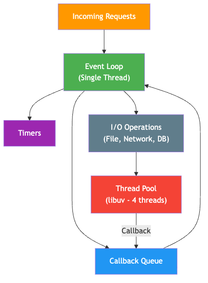
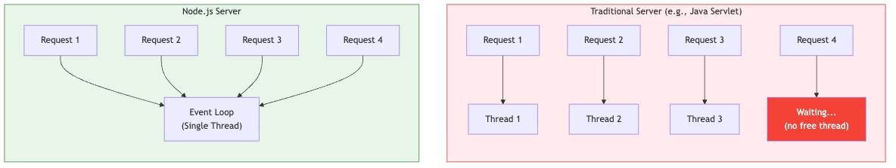

# Node.js & MongoDB
## Unit V - Full Stack Web Development

**B.E. IV Semester - Information Technology**

Instructor: Krushi Raj Tula
GitHub: github.com/krushiraj/spring-boot-demo

<!-- Speaker notes: Welcome students. This unit covers Node.js for server-side JavaScript and MongoDB as a NoSQL database. By the end, you will be able to build REST APIs using Node.js and perform CRUD operations on MongoDB. You already know JavaScript basics and Oracle DB, so we will draw comparisons throughout. -->

---

## What is Node.js?

- **Runtime environment** for executing JavaScript outside the browser
- Built on Google Chrome's **V8 JavaScript engine**
- Created by **Ryan Dahl** in 2009
- **Single-threaded**, event-driven, **non-blocking I/O**
- Used by Netflix, LinkedIn, Uber, PayPal, NASA

### Why Node.js?

- Same language (JS) on frontend and backend
- Huge ecosystem via **npm** (2M+ packages)
- Great for I/O-heavy applications (APIs, real-time apps)
- Fast development cycle

<!-- Speaker notes: Node.js is NOT a framework or a language. It is a runtime that lets you run JavaScript on the server. Think of it like how JVM runs Java. The V8 engine compiles JavaScript directly to machine code, making it very fast. Companies like Netflix moved from Java to Node.js and saw a 70% reduction in startup time. -->

---

## Node.js vs Browser JavaScript

| Feature | Browser JS | Node.js |
|---------|-----------|---------|
| Environment | Browser (Chrome, Firefox) | Server / Terminal |
| DOM Access | Yes (`document`, `window`) | No |
| File System | No (security) | Yes (`fs` module) |
| Network | `fetch`, `XMLHttpRequest` | `http`, `net`, `fetch` |
| Module System | ES Modules, `<script>` | CommonJS + ES Modules |
| Global Object | `window` | `global` / `globalThis` |
| Use Case | UI, DOM manipulation | APIs, file processing, CLI tools |
| Package Manager | N/A | npm, yarn |

<!-- Speaker notes: The key difference is the environment. Browser JS is sandboxed for security - it cannot access your file system. Node.js has full access to the operating system. In the browser, the global object is window. In Node.js, it is global. Both share the same core JavaScript language (ES2015+), but the available APIs are completely different. -->

---

## Node.js Architecture - Event Loop



**Single thread** handles requests | Heavy I/O goes to **thread pool** | Completed tasks return via **callbacks**

<!-- Speaker notes: This is the most important concept in Node.js. The event loop is what makes Node.js non-blocking. When a request comes in, Node.js does not create a new thread. Instead, the single thread puts I/O operations into the thread pool managed by libuv, and continues processing the next request. When the I/O completes, the callback is placed in the event queue, and the event loop picks it up. The event loop has phases: timers, pending callbacks, poll (for I/O), check (setImmediate), and close callbacks. -->

---

## Node.js vs Traditional Multi-threaded Server



- Traditional: **one thread per request** (blocks until done)
- Node.js: **one thread, many requests** (non-blocking)
- Node.js excels at **I/O-bound** tasks (APIs, DB queries)
- Not ideal for **CPU-bound** tasks (video encoding, ML)

<!-- Speaker notes: In a traditional server like Apache with PHP, each incoming request gets its own thread. If you have 1000 concurrent users, you need 1000 threads, each consuming about 2MB of RAM. That is 2GB just for threads. Node.js handles all 1000 requests in a single thread using the event loop. The actual I/O operations are offloaded to the thread pool, but the main thread never blocks. This is why Node.js can handle tens of thousands of concurrent connections with very low memory. However, if you do heavy CPU computation (like image processing), it WILL block the single thread and slow down everything. -->

---

## Installing Node.js

### Download & Install (Node.js 20 LTS)

- Visit **nodejs.org** and download the **LTS** version (20.x)
- Or follow the steps in `PREREQUISITES.md` in our course repo

### Verify Installation

```javascript
// In terminal:
node --version    // v20.x.x
npm --version     // 10.x.x
```

### What Gets Installed?

- `node` - the JavaScript runtime
- `npm` - Node Package Manager
- `npx` - execute npm packages without installing

> Refer to **PREREQUISITES.md** in the course repository for detailed OS-specific installation steps.

<!-- Speaker notes: We use the LTS (Long Term Support) version because it is stable and gets security updates for 30 months. The current version has newer features but may not be stable for production. When you install Node.js, npm comes bundled with it. npm is the package manager we will use to install libraries. npx lets you run packages without installing them globally. Check the PREREQUISITES.md file in our GitHub repository for step-by-step installation instructions for Windows, macOS, and Linux. -->

---

## Running Node.js - REPL

### 1. REPL (Read-Eval-Print Loop)

```javascript
$ node
> 2 + 3
5
> console.log("Hello IT students!")
Hello IT students!
> .exit
```

- Type `node` in your terminal to enter REPL mode
- Use `.exit` or Ctrl+C twice to exit
- Great for quick experiments

<!-- Speaker notes: There are two main ways to run Node.js. The REPL is interactive - you type JavaScript and see results immediately. It is great for quick experiments. Type 'node' in your terminal to enter REPL mode. Use .exit or Ctrl+C twice to exit. -->

---

## Running Node.js - Script Files

### 2. Running a Script File

```javascript
// hello.js
const name = "IT Department";
console.log(`Hello from ${name}!`);
console.log(`Node version: ${process.version}`);
```

```
$ node hello.js
Hello from IT Department!
Node version: v20.11.0
```

<!-- Speaker notes: For actual programs, you write JavaScript in a .js file and run it with 'node filename.js'. Notice we used template literals with backticks - this is ES6 syntax. The process object is a global in Node.js that gives you information about the current process. -->

---

## npm Basics - Project Setup

### Initialize a Project

```
$ mkdir my-project && cd my-project
$ npm init -y       # Creates package.json with defaults
```

### package.json (Project Manifest)

```javascript
{
  "name": "my-project",
  "version": "1.0.0",
  "description": "My first Node.js project",
  "main": "index.js",
  "scripts": {
    "start": "node index.js",
    "dev": "node --watch index.js"
  },
  "dependencies": {},
  "devDependencies": {}
}
```

<!-- Speaker notes: npm is the world's largest software registry with over 2 million packages. Every Node.js project should have a package.json file - it is like the project's identity card. It lists the project name, version, entry point, scripts, and dependencies. npm init -y creates one with default values. The scripts section lets you define shortcuts. -->

---

## npm Basics - Installing Packages

### Install Packages

```
$ npm install express        # Production dependency
$ npm install nodemon -D     # Dev dependency
```

- `npm install` or `npm i` adds to `dependencies`
- `-D` flag adds to `devDependencies` (development only)
- `node_modules/` contains installed packages - **never commit to git**
- Use `.gitignore` to exclude `node_modules/`

<!-- Speaker notes: npm install or npm i installs a package and adds it to dependencies. The -D flag adds it to devDependencies, which are only needed during development, not in production. The node_modules folder contains all installed packages - NEVER commit it to git. -->

---

## Modules - CommonJS

### CommonJS (Traditional Node.js)

```javascript
// math.js - Exporting
const add = (a, b) => a + b;
const subtract = (a, b) => a - b;
module.exports = { add, subtract };

// app.js - Importing
const { add, subtract } = require('./math');
console.log(add(5, 3));       // 8
```

- Uses `require()` and `module.exports`
- Original Node.js module system, still very common

<!-- Speaker notes: Node.js has two module systems. CommonJS uses require() and module.exports - this is the original Node.js way and is still very common. Node.js also ships with many built-in modules - you do not need to install them. For example, the fs module for file operations, http for creating servers, path for file path manipulation. -->

---

## Modules - ES Modules

### ES Modules (Modern - add `"type": "module"` in package.json)

```javascript
// math.mjs - Exporting
export const add = (a, b) => a + b;
export const subtract = (a, b) => a - b;

// app.mjs - Importing
import { add, subtract } from './math.mjs';
console.log(add(5, 3));       // 8
```

- Same syntax as browser JavaScript (`import`/`export`)
- Requires `"type": "module"` in package.json or `.mjs` extension

> Node.js has built-in modules: `fs`, `path`, `http`, `os`, `crypto`

<!-- Speaker notes: ES Modules use import/export syntax, which is the same as what you use in browser JavaScript. To use ES Modules in Node.js, you need to either add "type": "module" in package.json or use the .mjs file extension. We will use both CommonJS and ES Modules in this course. -->

---

## Creating an HTTP Server

```javascript
const http = require('http');

const server = http.createServer((req, res) => {
  if (req.url === '/' && req.method === 'GET') {
    res.writeHead(200, { 'Content-Type': 'text/html' });
    res.end('<h1>Welcome to Node.js Server!</h1>');
  } else if (req.url === '/api/students') {
    res.writeHead(200, { 'Content-Type': 'application/json' });
    res.end(JSON.stringify({ message: 'Student list' }));
  } else {
    res.writeHead(404);
    res.end('Not Found');
  }
});

server.listen(3000, () =>
  console.log('Server running at http://localhost:3000')
);
```

Run with: `$ node server.js`

<!-- Speaker notes: This is how you create a basic HTTP server in Node.js without any framework. The http module is built-in. The createServer method takes a callback function that receives request (req) and response (res) objects. We check req.url to handle different routes and req.method for GET, POST, etc. res.writeHead sets the status code and headers. res.end sends the response body. The server listens on port 3000. This is low-level - in practice, we use Express.js which makes routing much easier. But understanding this helps you appreciate what Express does under the hood. -->

---

## EventEmitter

```javascript
const EventEmitter = require('events');

// Create an emitter instance
const emitter = new EventEmitter();

// Register a listener
emitter.on('studentEnrolled', (student) => {
  console.log(`Welcome ${student.name} to ${student.branch}!`);
});

// Emit the event
emitter.emit('studentEnrolled', {
  name: 'Ravi Kumar',
  rollNo: '21B01A1201',
  branch: 'IT'
});
// Output: Welcome Ravi Kumar to IT!
```

- Node.js is built on an **event-driven architecture**
- Many built-in modules (http, fs, streams) extend EventEmitter
- Pattern: **register listeners** first, then **emit events**

<!-- Speaker notes: EventEmitter is at the core of Node.js. Almost every built-in module in Node.js extends EventEmitter. For example, when an HTTP server receives a request, it emits a 'request' event. The EventEmitter class is in the 'events' module. You create an instance, register event listeners using .on(), and then trigger events using .emit(). The first argument to emit is the event name, and subsequent arguments are passed to the listener function. This is the Observer Pattern from design patterns. Think of it like subscribing to notifications - you register interest in an event, and when it happens, you get notified. -->

---

## Custom Events - Extending EventEmitter

```javascript
const EventEmitter = require('events');

class StudentManager extends EventEmitter {
  addStudent(student) {
    console.log(`Adding: ${student.name}`);
    this.emit('added', student);
  }
}

const manager = new StudentManager();

manager.on('added', (s) => {    // runs every time
  console.log(`Notify HOD: ${s.name} joined ${s.branch}`);
});
```

<!-- Speaker notes: You can create your own classes that extend EventEmitter. This is a very common pattern in Node.js libraries. The .on method registers a listener that fires every time the event is emitted. -->

---

## Custom Events - .on() vs .once()

```javascript
// .once() - runs only the first time
manager.once('added', (s) => {
  console.log(`First student bonus for: ${s.name}`);
});

manager.addStudent({ name: 'Priya Sharma', branch: 'CSE' });
// Notify HOD: Priya Sharma joined CSE
// First student bonus for: Priya Sharma

manager.addStudent({ name: 'Amit Reddy', branch: 'IT' });
// Notify HOD: Amit Reddy joined IT
// (no bonus - .once already fired)
```

- `.on()` - fires every time the event is emitted
- `.once()` - fires only the first time, then auto-removed
- `.off()` / `.removeListener()` - manually remove listeners

<!-- Speaker notes: The .once method registers a listener that fires only the first time - after that, it is automatically removed. You can also use .removeListener() or .off() to manually remove listeners, and .removeAllListeners() to remove all listeners for an event. Always be careful about memory leaks - if you keep adding listeners without removing them, you will get a warning when you exceed 10 listeners for a single event. -->

---

## Timers - setTimeout & setInterval

```javascript
// setTimeout - run once after delay
setTimeout(() => {
  console.log('Runs after 2 seconds');
}, 2000);

// setInterval - run repeatedly
let count = 0;
const timer = setInterval(() => {
  count++;
  console.log(`Tick ${count}`);
  if (count === 3) clearInterval(timer);
}, 1000);
// Tick 1 (at 1s), Tick 2 (at 2s), Tick 3 (at 3s)
```

<!-- Speaker notes: Timers in Node.js work similarly to browser timers. setTimeout and setInterval work the same way you know from browser JavaScript. In practice, you will mostly use setTimeout and setInterval. -->

---

## Timers - Node.js Specific

```javascript
// setImmediate - run after current I/O events
setImmediate(() => {
  console.log('Runs after current I/O cycle');
});

// process.nextTick - runs before any I/O
process.nextTick(() => {
  console.log('Runs before everything else in queue');
});
```

**Priority**: `process.nextTick` > `setImmediate` > `setTimeout(fn, 0)`

- `setImmediate` - Node.js only, runs after current I/O cycle
- `process.nextTick` - highest priority, use sparingly

<!-- Speaker notes: setImmediate is Node.js specific - it executes after the current event loop cycle completes all I/O events. process.nextTick is even higher priority - it runs before the event loop continues. The priority order is important: process.nextTick callbacks run first, then promise callbacks, then setImmediate, then setTimeout with 0 delay. Use process.nextTick sparingly as it can starve the event loop if overused. -->

---

## Callbacks

```javascript
const fs = require('fs');

// Asynchronous with Callback (NON-BLOCKING)
fs.readFile('students.txt', 'utf8', (err, data) => {
  if (err) {
    console.error('Error:', err.message);
    return;
  }
  console.log(data);
});
console.log('This runs BEFORE file is read!');
```

**Error-First Convention:** first arg = error (`null` if success), second arg = result

<!-- Speaker notes: Callbacks are the original way Node.js handles asynchronous operations. The convention in Node.js is error-first callbacks. Notice 'This runs BEFORE file is read' prints first because Node.js continues executing while waiting for the file I/O to complete. -->

---

## Callback Hell - "Pyramid of Doom"

```javascript
fs.readFile('students.json', 'utf8', (err, data) => {
  if (err) return console.error(err);
  db.query('SELECT * FROM courses', (err, courses) => {
    if (err) return console.error(err);
    api.fetch('/departments', (err, depts) => {
      if (err) return console.error(err);
      fs.writeFile('report.json', result, (err) => {
        console.log('Done!');  // 4 levels deep!
      });
    });
  });
});
```

- Each async step adds nesting | Error handling repeated everywhere
- Solution: **Promises** and **async/await**

<!-- Speaker notes: When you have multiple asynchronous operations that depend on each other, callbacks create deeply nested code that is very hard to read and maintain. This is called 'callback hell' or the 'pyramid of doom'. Each callback adds another level of indentation. Error handling must be repeated at every level. This was a major pain point in early Node.js development and led to the creation of Promises and later async/await. -->

---

## Promises

```javascript
// Creating a Promise
function readStudentFile(filename) {
  return new Promise((resolve, reject) => {
    fs.readFile(filename, 'utf8', (err, data) => {
      if (err) reject(err);
      else resolve(JSON.parse(data));
    });
  });
}

// Using Promises - chaining with .then()
readStudentFile('students.json')
  .then(students => {
    console.log(`Found ${students.length} students`);
    return students.filter(s => s.branch === 'IT');
  })
  .then(itStudents => {
    console.log('IT students:', itStudents);
  })
  .catch(err => {
    console.error('Error:', err.message);
  });
```

- **Pending** -> **Fulfilled** (resolve) or **Rejected** (reject)
- `.then()` for success, `.catch()` for errors
- Flat chain instead of nested callbacks!

<!-- Speaker notes: Promises were introduced in ES6 to solve the callback hell problem. A Promise represents a value that may not be available yet. It has three states: pending (initial), fulfilled (resolved successfully), or rejected (error). You create a Promise with new Promise() and pass a function that receives resolve and reject. Call resolve(value) on success and reject(error) on failure. The beauty of Promises is chaining - each .then() returns a new Promise, so you can chain operations in a flat structure instead of nesting. The .catch() at the end handles errors from any step in the chain. Most modern Node.js APIs support Promises natively, and the fs module has a promises version: fs.promises or require('fs/promises'). -->

---

## async/await

```javascript
const fs = require('fs').promises;

async function processStudents() {
  try {
    const data = await fs.readFile('students.json', 'utf8');
    const students = JSON.parse(data);
    const itStudents = students.filter(s => s.branch === 'IT');
    console.log('IT Students:', itStudents);

    await fs.writeFile('it-students.json',
      JSON.stringify(itStudents, null, 2));
    console.log('File saved!');
  } catch (err) {
    console.error('Error:', err.message);
  }
}
processStudents();
```

- `async` marks a function as asynchronous (always returns a Promise)
- `await` pauses execution until the Promise resolves
- Use `try/catch` for error handling (familiar from Java!)
- Reads like synchronous code but is **non-blocking**

<!-- Speaker notes: async/await is syntactic sugar over Promises introduced in ES2017. It makes asynchronous code look and behave like synchronous code. The async keyword before a function means the function always returns a Promise. The await keyword pauses the function execution until the Promise resolves, and returns the resolved value. If the Promise rejects, await throws an error, which you catch with try/catch - just like exception handling in Java. This is the preferred way to write asynchronous code in modern Node.js. Notice we use require('fs').promises to get the Promise-based version of the fs module. Behind the scenes, the event loop is still working the same way - await does NOT block the thread, it just pauses the function and lets other code run. -->

---

# MongoDB

## NoSQL Document Database

<!-- Speaker notes: Now let us move to the second part of this unit - MongoDB. You already know Oracle DB which is a relational database. MongoDB is fundamentally different - it is a NoSQL document database. We will see what that means and how it compares to what you already know. -->

---

## What is NoSQL?

### NoSQL = "Not Only SQL"

- **Document DB** (MongoDB) - stores JSON-like documents
- Key-Value (Redis) - simple key-value pairs
- Column Family (Cassandra) - wide columns
- Graph (Neo4j) - nodes and edges

<!-- Speaker notes: You know Oracle DB which is a Relational Database Management System or RDBMS. It stores data in tables with fixed schemas. MongoDB is a NoSQL database, specifically a document database. Instead of rows in tables, it stores documents in collections. Each document is a JSON-like object. -->

---

## Why MongoDB?

- **Flexible schema** - no ALTER TABLE needed
- **JSON-like documents** - natural for JavaScript
- **Horizontal scaling** - distribute data across servers
- **High performance** for reads and writes
- Most popular NoSQL database (Google, Facebook, eBay)

### When NOT to use MongoDB?

- Complex joins and transactions (use RDBMS)
- Financial systems requiring strict ACID compliance

<!-- Speaker notes: The key advantage is schema flexibility - different documents in the same collection can have different fields. This is very useful in web development where data structures evolve frequently. In Oracle, adding a column requires ALTER TABLE and affects all rows. In MongoDB, you just start storing documents with the new field. However, MongoDB is not a replacement for RDBMS everywhere - for banking systems or complex relational data, Oracle/PostgreSQL is still better. -->

---

## SQL vs MongoDB Terminology

| Oracle DB (RDBMS) | MongoDB | Example |
|-------------------|---------|---------|
| Database | Database | `student_db` |
| Table | Collection | `students` |
| Row | Document | `{ name: "Ravi", ... }` |
| Column | Field | `name`, `rollNo`, `branch` |
| Primary Key | `_id` (auto-generated) | `ObjectId("64a...")` |
| `JOIN` | `$lookup` (aggregation) | Embedding preferred |
| `ALTER TABLE` | Not needed! | Schema-less |
| `CREATE TABLE` | Not needed! | Auto-created on insert |
| Schema | Flexible (optional validation) | JSON Schema |
| SQL Query | MongoDB Query Language (MQL) | `db.students.find()` |

> In MongoDB, you do NOT need to define table structure before inserting data!

<!-- Speaker notes: This table maps what you already know from Oracle DB to MongoDB equivalents. A database is still called a database. What you call a table in Oracle is called a collection in MongoDB. A row becomes a document, and a column becomes a field. The biggest difference is the primary key - in Oracle, you define it yourself. In MongoDB, every document automatically gets an _id field with a unique ObjectId. There is no JOIN operation like in Oracle - MongoDB prefers embedding related data within documents or using the $lookup aggregation stage. The most striking difference: you do not need CREATE TABLE or ALTER TABLE. Collections are created automatically when you first insert data, and each document can have its own structure. -->

---

## Document Model (JSON/BSON)

### JSON (JavaScript Object Notation) - What you write

```javascript
{
  "name": "Ravi Kumar",
  "rollNo": "21B01A1201",
  "branch": "IT",
  "semester": 4,
  "subjects": ["FSWAD", "ML", "CC"],
  "address": {
    "city": "Hyderabad",
    "state": "Telangana"
  }
}
```

### BSON (Binary JSON) - What MongoDB stores internally

- Binary-encoded JSON for efficiency
- Supports extra types: `Date`, `ObjectId`, `Decimal128`, `Binary`
- Faster to parse than plain JSON
- Max document size: **16 MB**

> Documents can contain arrays and nested objects - no need for separate tables!

<!-- Speaker notes: MongoDB stores data as documents, which look like JSON objects. What you write and see is JSON, but internally MongoDB stores it as BSON - Binary JSON. BSON is more efficient for storage and adds extra data types that JSON does not support, like Date objects, ObjectId for unique identifiers, and precise decimal numbers. Notice how the document has an array of subjects and a nested address object. In Oracle, you would need a separate table for subjects with a foreign key. In MongoDB, you embed the data right inside the document. This is called denormalization. The maximum document size is 16 MB, which is more than enough for most use cases. -->

---

## MongoDB Document Example

```javascript
{
  "_id": ObjectId("65f2a1b3c4d5e6f7a8b9c0d1"),
  "name": "Ravi Kumar",
  "rollNo": "21B01A1201",
  "branch": "IT",
  "semester": 4,
  "cgpa": 8.5,
  "subjects": [
    { "code": "CS401", "name": "FSWAD", "credits": 4 },
    { "code": "CS402", "name": "ML", "credits": 3 }
  ],
  "address": { "city": "Hyderabad", "state": "Telangana" },
  "isActive": true,
  "enrolledDate": ISODate("2021-08-15T00:00:00Z")
}
```

Compare: In Oracle, this would need **3 tables** (students, subjects, addresses) with JOINs!

<!-- Speaker notes: Let us look at a more complete student document. The _id is automatically generated by MongoDB as an ObjectId - a 12-byte unique identifier. Notice the data types: strings, numbers, arrays of objects, nested objects, booleans, and dates. In Oracle, to store this same data, you would need a students table, a student_subjects junction table, and possibly an addresses table. In MongoDB, it is all in one document - one read operation gets everything. -->

---

## mongosh Basics

### Start MongoDB Shell

```
$ mongosh                          # Connect to localhost:27017
$ mongosh "mongodb://localhost:27017/studentDB"
```

### Basic Commands

```javascript
show dbs                           // List all databases
use studentDB                     // Switch to / create database
show collections                  // List collections in current db
db.getName()                      // Current database name
db.students.countDocuments()      // Count documents
db.dropDatabase()                 // Delete entire database!
```

- Database is auto-created when you first insert data
- `mongosh` is the modern MongoDB Shell (replaces old `mongo` shell)

<!-- Speaker notes: mongosh is the MongoDB Shell - it is an interactive JavaScript interface to MongoDB. When you install MongoDB 7.0, mongosh comes with it. You start it by typing mongosh in the terminal. By default, it connects to localhost on port 27017. The use command switches to a database - if it does not exist, MongoDB will create it when you first insert data. This is a key difference from Oracle where you must explicitly CREATE DATABASE. Everything in mongosh is JavaScript, so you can use variables, loops, and all JavaScript features. -->

---

## CRUD - insertOne

```javascript
// Insert a single document
db.students.insertOne({
  name: "Ravi Kumar",
  rollNo: "21B01A1201",
  branch: "IT",
  semester: 4,
  cgpa: 8.5
})
// Returns: { acknowledged: true, insertedId: ObjectId(...) }
```

- `_id` is auto-generated if not provided
- Collection is auto-created on first insert

<!-- Speaker notes: Insert operations add new documents to a collection. insertOne takes a single document object and inserts it. If the collection does not exist, MongoDB creates it automatically on the first insert. Notice that we do not specify _id - MongoDB generates a unique ObjectId automatically. Compare this to Oracle: you would need a CREATE TABLE statement first with all column definitions. -->

---

## CRUD - insertMany

```javascript
// Insert multiple documents
db.students.insertMany([
  { name: "Priya Sharma", rollNo: "21B01A1202",
    branch: "CSE", semester: 4, cgpa: 9.1 },
  { name: "Amit Reddy", rollNo: "21B01A1203",
    branch: "IT", semester: 4, cgpa: 7.8 },
  { name: "Sneha Patel", rollNo: "21B01A1204",
    branch: "ECE", semester: 4, cgpa: 8.9 },
  { name: "Karthik Rao", rollNo: "21B01A1205",
    branch: "CSE", semester: 4, cgpa: 8.2 }
])
// Returns: { acknowledged: true, insertedIds: {...} }
```

<!-- Speaker notes: insertMany takes an array of documents. You CAN provide your own _id if you want, but it must be unique within the collection. The return value tells you if the operation was acknowledged and gives you the generated IDs. -->

---

## CRUD - find & findOne

```javascript
// Find all documents
db.students.find()

// Find with filter (WHERE equivalent)
db.students.find({ branch: "IT" })

// Find one document
db.students.findOne({ rollNo: "21B01A1201" })

// Projection - select specific fields
db.students.find(
  { branch: "CSE" },              // Filter (WHERE)
  { name: 1, cgpa: 1, _id: 0 }   // Projection (SELECT)
)
// { name: "Priya Sharma", cgpa: 9.1 }
// { name: "Karthik Rao", cgpa: 8.2 }
```

<!-- Speaker notes: find() is the MongoDB equivalent of SELECT. Without arguments, it returns all documents like SELECT *. The first argument is the filter - equivalent to the WHERE clause. findOne returns just the first matching document instead of a cursor. The second argument is the projection - it controls which fields to include or exclude. Use 1 to include a field and 0 to exclude. -->

---

## find - SQL Comparison

| Oracle SQL | MongoDB |
|-----------|---------|
| `SELECT * FROM students` | `db.students.find()` |
| `SELECT * FROM students WHERE branch='IT'` | `db.students.find({branch:"IT"})` |
| `SELECT name, cgpa FROM students WHERE branch='CSE'` | `db.students.find({branch:"CSE"}, {name:1, cgpa:1, _id:0})` |

- Use `1` to include a field, `0` to exclude
- `_id` is always included unless you set `_id: 0`
- Cannot mix includes and excludes (except `_id`)

<!-- Speaker notes: The comparison table shows Oracle SQL equivalents so you can map your existing knowledge. In Oracle, you write SQL strings. In MongoDB, everything is JavaScript objects. By default, _id is always included unless you explicitly exclude it with _id: 0. You cannot mix includes and excludes (except for _id). -->

---

## CRUD - updateOne & updateMany

```javascript
// Update one document - use $set to modify fields
db.students.updateOne(
  { rollNo: "21B01A1201" },        // Filter
  { $set: { cgpa: 8.7, semester: 5 } }  // Update
)

// Update many documents
db.students.updateMany(
  { branch: "IT" },                // All IT students
  { $set: { semester: 5 } }       // Set semester to 5
)

// Add a new field to all documents
db.students.updateMany(
  {},                              // Empty filter = all docs
  { $set: { university: "JNTUH" } }
)
```

- **Must use `$set`** - without it, the entire document is replaced!

<!-- Speaker notes: Update operations modify existing documents. updateOne modifies the first document matching the filter. updateMany modifies all matching documents. The key thing to remember is the $set operator - you MUST use it to update specific fields. If you write updateOne without $set, it will REPLACE the entire document! Notice how easy it is to add a new field to all documents - in Oracle, you would need ALTER TABLE first. -->

---

## Update Operators

```javascript
// Increment a numeric field
db.students.updateOne(
  { rollNo: "21B01A1203" },
  { $inc: { cgpa: 0.5 } }         // cgpa + 0.5
)
```

| Operator | Description | Example |
|----------|-------------|---------|
| `$set` | Set field value | `{ $set: { cgpa: 9.0 } }` |
| `$inc` | Increment number | `{ $inc: { cgpa: 0.5 } }` |
| `$push` | Add to array | `{ $push: { subjects: "AI" } }` |
| `$pull` | Remove from array | `{ $pull: { subjects: "ML" } }` |
| `$unset` | Remove a field | `{ $unset: { email: "" } }` |

<!-- Speaker notes: Other useful update operators include $inc for incrementing numbers, $push for adding to arrays, $pull for removing from arrays, and $unset for removing a field entirely. These operators make MongoDB updates very flexible compared to SQL UPDATE statements. -->

---

## CRUD - deleteOne & deleteMany

```javascript
// Delete one document
db.students.deleteOne({ rollNo: "21B01A1205" })

// Delete many matching a condition
db.students.deleteMany({ branch: "ECE" })

// Delete ALL documents (careful!)
db.students.deleteMany({})  // Empty filter = delete all!

// Drop entire collection
db.students.drop()
```

| Oracle SQL | MongoDB |
|-----------|---------|
| `DELETE FROM ... WHERE rollNo='...'` | `deleteOne({rollNo:"..."})` |
| `DELETE FROM ... WHERE branch='ECE'` | `deleteMany({branch:"ECE"})` |
| `DELETE FROM students` | `deleteMany({})` |
| `DROP TABLE students` | `db.students.drop()` |

<!-- Speaker notes: Delete operations remove documents from a collection. deleteOne removes the first document that matches the filter. deleteMany removes all documents matching the filter. Be very careful with deleteMany with an empty filter - it deletes ALL documents. The drop method removes the entire collection including its indexes. There is no UNDO in MongoDB - once deleted, the data is gone unless you have backups. -->

---

## Query Operators - Comparison

```javascript
db.students.find({ cgpa: { $eq: 8.5 } })   // Equal to
db.students.find({ cgpa: { $gt: 8.0 } })   // Greater than
db.students.find({ cgpa: { $gte: 8.0 } })  // Greater than or equal
db.students.find({ cgpa: { $lt: 9.0 } })   // Less than
db.students.find({ cgpa: { $lte: 9.0 } })  // Less than or equal
db.students.find({ cgpa: { $ne: 8.5 } })   // Not equal

// $in - match any value in array (like SQL IN)
db.students.find({ branch: { $in: ["IT", "CSE"] } })
```

<!-- Speaker notes: MongoDB query operators start with a dollar sign. The comparison operators work inside field filters. For example, cgpa: {$gt: 8.0} means cgpa greater than 8.0, which is like WHERE cgpa > 8.0 in Oracle SQL. The $in operator is equivalent to SQL's IN clause. -->

---

## Query Operators - Logical

```javascript
// $and - all conditions must be true
db.students.find({
  $and: [{ branch: "IT" }, { cgpa: { $gt: 8.0 } }]
})

// $or - at least one condition must be true
db.students.find({
  $or: [{ branch: "IT" }, { branch: "CSE" }]
})

// Implicit $and (shorthand - most common)
db.students.find({ branch: "IT", cgpa: { $gt: 8.0 } })
```

- Multiple conditions in same object are implicitly `$and`
- Other operators: `$exists`, `$regex`, `$not`

<!-- Speaker notes: For logical operators, $and requires ALL conditions to be true, $or requires at least one. There is a shorthand for $and - when you put multiple conditions in the same filter object, they are implicitly ANDed together. Other useful operators include $exists to check if a field exists, $regex for pattern matching (like LIKE in SQL), and $not for negation. -->

---

## Sorting and Limiting

```javascript
// Sort ascending (1) or descending (-1)
db.students.find().sort({ cgpa: -1 })

// Sort by multiple fields
db.students.find().sort({ branch: 1, cgpa: -1 })

// Limit results
db.students.find().limit(3)

// Count documents
db.students.countDocuments({ branch: "IT" })  // 2
```

<!-- Speaker notes: Sorting and limiting are essential for building real applications. sort() takes a document where 1 means ascending and -1 means descending. You can sort by multiple fields. limit() restricts the number of results returned. countDocuments() returns the count of matching documents. -->

---

## Pagination with skip & limit

```javascript
// Page 1: skip 0, limit 2
db.students.find()
  .sort({ cgpa: -1 })
  .skip(0)
  .limit(2)
// Returns: Priya (9.1), Sneha (8.9)

// Page 2: skip 2, limit 2
db.students.find()
  .sort({ cgpa: -1 })
  .skip(2)
  .limit(2)
// Returns: Ravi (8.5), Karthik (8.2)
```

- **Formula**: `skip((page - 1) * pageSize).limit(pageSize)`
- In Oracle: more complex with `OFFSET/FETCH` or `ROW_NUMBER`

<!-- Speaker notes: Combining skip and limit gives you pagination - the same pattern you see on websites with page numbers. For page N with pageSize items, use skip((N-1) * pageSize).limit(pageSize). In Oracle SQL, pagination is more complex with OFFSET/FETCH or ROW_NUMBER. MongoDB makes it simpler with method chaining. -->

---

## MongoDB Node.js Driver - Connecting

### Install: `npm install mongodb`

```javascript
const { MongoClient } = require('mongodb');
const client = new MongoClient('mongodb://localhost:27017');

async function main() {
  try {
    await client.connect();
    console.log('Connected to MongoDB!');
    const db = client.db('studentDB');
    const students = db.collection('students');
    const count = await students.countDocuments();
    console.log(`Total students: ${count}`);
  } catch (err) {
    console.error('Connection failed:', err.message);
  } finally {
    await client.close();
  }
}
main();
```

<!-- Speaker notes: To use MongoDB from a Node.js application, you need the official MongoDB Node.js driver package. The MongoClient class is the main entry point. The connect() method returns a Promise, so we use async/await. Once connected, client.db gives you a database reference, and db.collection gives you a collection reference. Always close the connection in the finally block. The driver handles connection pooling automatically. -->

---

## CRUD from Node.js

```javascript
const students = client.db('studentDB').collection('students');

// CREATE
await students.insertOne({ name: 'Ravi', rollNo: '21B01A1201' });

// READ
const list = await students.find({ branch: 'IT' }).toArray();

// UPDATE
await students.updateOne(
  { rollNo: '21B01A1201' }, { $set: { cgpa: 8.7 } });

// DELETE
await students.deleteOne({ rollNo: '21B01A1201' });
```

- Same methods as `mongosh`, but returns **Promises** (use `await`)
- `find()` returns a cursor — use `.toArray()` to get results

<!-- Speaker notes: The methods are exactly the same names as in mongosh - insertOne, find, updateOne, deleteOne. The key difference is that in Node.js, these methods return Promises, so we use await. For find(), it returns a cursor, and we call .toArray() to get all results as a JavaScript array. -->

---

## Express.js + MongoDB - Setup

```javascript
const express = require('express');
const { MongoClient } = require('mongodb');
const app = express();
app.use(express.json());

const client = new MongoClient('mongodb://localhost:27017');
let db;
client.connect().then(() => {
  db = client.db('studentDB');
  app.listen(3000, () => console.log('API on :3000'));
});
```

- Connect once, reuse | `express.json()` parses JSON bodies

<!-- Speaker notes: This is the real-world pattern you will use most often - Express.js as the web framework combined with MongoDB as the database. We connect to MongoDB once when the server starts and reuse the connection. -->

---

## Express.js + MongoDB - GET & POST

```javascript
// GET all students
app.get('/api/students', async (req, res) => {
  const students = await db.collection('students')
    .find().toArray();
  res.json(students);
});

// POST create student
app.post('/api/students', async (req, res) => {
  const result = await db.collection('students')
    .insertOne(req.body);
  res.status(201).json(result);
});
```

<!-- Speaker notes: app.get handles GET requests, app.post handles POST requests. The async/await pattern makes the code clean and readable. res.json() sends a JSON response. This pattern forms the foundation of REST APIs. -->

---

## Express.js + MongoDB - GET by ID & PUT

```javascript
// GET one student by roll number
app.get('/api/students/:rollNo', async (req, res) => {
  const student = await db.collection('students')
    .findOne({ rollNo: req.params.rollNo });
  if (!student) return res.status(404)
    .json({ error: 'Student not found' });
  res.json(student);
});

// PUT update student
app.put('/api/students/:rollNo', async (req, res) => {
  const result = await db.collection('students')
    .updateOne(
      { rollNo: req.params.rollNo },
      { $set: req.body });
  res.json(result);
});
```

<!-- Speaker notes: Express uses colon syntax for URL parameters - :rollNo captures the value from the URL, and you access it with req.params.rollNo. Notice the error handling in GET - if findOne returns null, we send a 404 status. The PUT endpoint uses $set with req.body so it only updates the fields the client sends. -->

---

## Express.js + MongoDB - DELETE & Summary

```javascript
app.delete('/api/students/:rollNo', async (req, res) => {
  await db.collection('students')
    .deleteOne({ rollNo: req.params.rollNo });
  res.status(204).send();
});
```

| Method | Route | Operation |
|--------|-------|-----------|
| GET | `/api/students` | Read all |
| GET | `/api/students/:rollNo` | Read one |
| POST | `/api/students` | Create |
| PUT | `/api/students/:rollNo` | Update |
| DELETE | `/api/students/:rollNo` | Delete |

<!-- Speaker notes: The mapping is: HTTP GET = Read, POST = Create, PUT = Update, DELETE = Delete. This REST pattern is universal across web development. -->

---

## Key Takeaways - Node.js

- Server-side JavaScript runtime built on **V8 engine**
- **Single-threaded** with **event loop** for non-blocking I/O
- npm ecosystem with 2M+ packages
- Callbacks -> Promises -> **async/await** (evolution)
- Best for I/O-bound applications (APIs, real-time)

<!-- Speaker notes: Node.js brings JavaScript to the server with a unique event-driven, non-blocking architecture. The async evolution from callbacks to Promises to async/await makes asynchronous code much easier to write and read. -->

---

## Key Takeaways - MongoDB

- **Document database** - stores JSON-like documents (BSON)
- **Schema-flexible** - no CREATE TABLE, ALTER TABLE needed
- Collections (tables) -> Documents (rows) -> Fields (columns)
- Rich query operators: `$gt`, `$in`, `$and`, `$set`, `$inc`
- CRUD: `insertOne/Many`, `find/findOne`, `updateOne/Many`, `deleteOne/Many`

### Together

- Express.js + MongoDB = powerful REST API stack
- Full CRUD API with just ~50 lines of code!
- Foundation of the **MERN stack** (MongoDB, Express, React, Node.js)

<!-- Speaker notes: MongoDB offers a flexible alternative to RDBMS that maps naturally to JavaScript objects. When you combine Node.js with MongoDB and Express.js, you get a powerful, fast, and developer-friendly stack for building web APIs. The entire backend can be written in JavaScript. -->

---

## What's Next? - Lab Exercises

1. **Lab 1**: Set up Node.js project, create HTTP server
2. **Lab 2**: Build student CRUD API with Express + MongoDB
3. **Lab 3**: Add query parameters, pagination, and sorting
4. **Lab 4**: Error handling and input validation

### Practice

- Install Node.js 20 LTS and MongoDB 7.0 locally
- Follow `PREREQUISITES.md` in the course repo
- Complete each lab exercise before the next class

<!-- Speaker notes: For the upcoming lab sessions, make sure you have Node.js 20 LTS and MongoDB 7.0 installed on your machines. Follow the PREREQUISITES.md file in our GitHub repository for installation steps. We will start with building a basic HTTP server, then progressively build a full REST API with MongoDB. -->

---

## Resources

| Resource | Link |
|----------|------|
| Node.js Docs | nodejs.org/docs |
| MongoDB Manual | docs.mongodb.com/manual |
| Express.js Guide | expressjs.com/guide |
| MongoDB University | learn.mongodb.com (free courses) |
| Course Repository | github.com/krushiraj/spring-boot-demo |

<!-- Speaker notes: The official documentation for Node.js and MongoDB are excellent resources. MongoDB University at learn.mongodb.com offers free courses with certificates. Practice is key - try to experiment with mongosh on your own, insert different types of data, and try various queries. All the code from today's slides is available in the course repository. -->

---

# Thank You!

## Questions?

**Course Repository**
github.com/krushiraj/spring-boot-demo

**Topics Covered**
Node.js Runtime | Event Loop | npm | Modules
Callbacks | Promises | async/await
MongoDB | CRUD Operations | Query Operators
Express.js + MongoDB REST API

**Next Unit**: React.js Frontend Development

> "Any application that can be written in JavaScript, will eventually be written in JavaScript." - Jeff Atwood

<!-- Speaker notes: Thank you for attending this lecture on Node.js and MongoDB. We covered a lot of ground today, from Node.js fundamentals like the event loop and asynchronous programming patterns to MongoDB CRUD operations and building REST APIs. Remember, all the code and resources are available at github.com/krushiraj/spring-boot-demo. Make sure to set up your development environment before the next lab session. Feel free to reach out with questions. See you in the lab! -->
